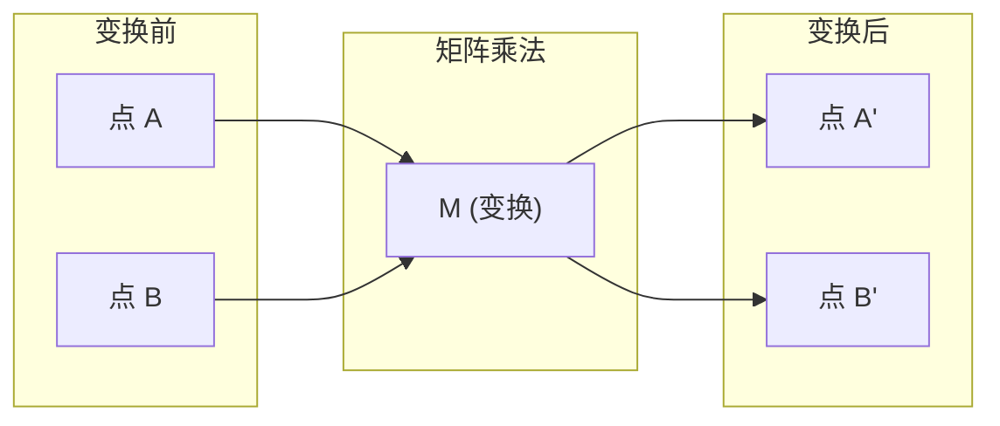
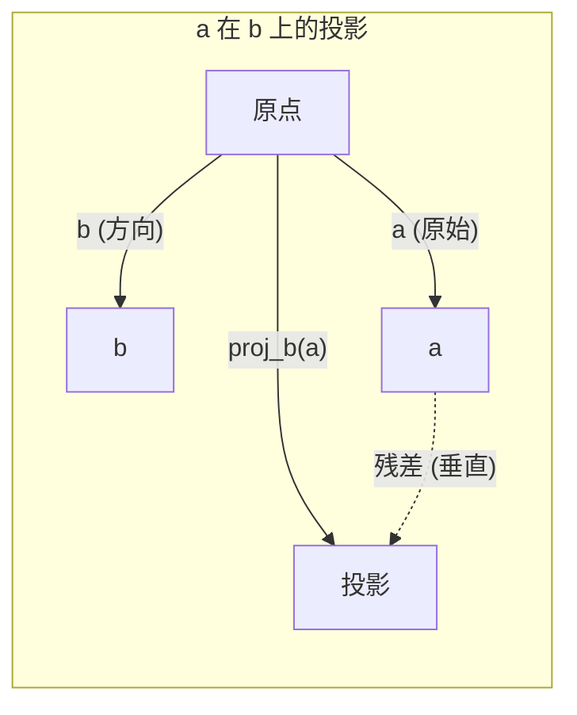

# 线性代数直觉

> 每一个AI模型都只是戴着漂亮帽子的矩阵运算。

**类型：** 学习  
**语言：** Python、Julia  
**前置要求：** 阶段 0  
**时间：** 约 60 分钟

## 学习目标

- 在 Python 中从零实现向量与矩阵运算（加法、点积、矩阵乘法）
- 从几何角度解释点积、投影和格拉姆-施密特过程的作用
- 使用行化简判断向量组的线性无关性、秩和基
- 将线性代数概念与 AI 应用联系起来：嵌入、注意力分数和 LoRA

## 问题所在

打开任何一篇机器学习论文。在第一页内，你必然会看到向量、矩阵、点积和变换。如果没有线性代数直觉，它们只是符号。而有了直觉，你就能看到神经网络实际在做什么——在空间中移动点。

你不需要成为数学家。你需要理解这些运算在几何上意味着什么，然后自己编写代码。

## 核心概念

### 向量即点（也是方向）

一个向量就是一列数字。但这些数字有意义——它们是空间中的坐标。

**二维向量 [3, 2]：**

| x | y | 点 |
|---|---|-------|
| 3 | 2 | 该向量从原点 (0,0) 指向平面上的 (3, 2) |

向量的模为 sqrt(3^2 + 2^2) = sqrt(13)，指向右上方。

> 什么是向量的模？
> **向量的模**（也称长度或范数）是向量在空间中的大小。  
> 对于一个 \(n\) 维向量 \(\mathbf{v} = (v_1, v_2, \dots, v_n)\)，其模定义为各分量平方和的平方根：
> \[
> \|\mathbf{v}\| = \sqrt{v_1^2 + v_2^2 + \cdots + v_n^2}
>\]
> **几何意义**：  
> - 在二维或三维空间中，向量的模就是从原点指向该点的有向线段的长度。  
> - 例如，向量 \(\mathbf{v} = (3, 4)\) 的模为 \(\sqrt{3^2 + 4^2} = 5\)。  
> **性质**：  
> - 模总是非负实数，且只有零向量的模为 0。  
> - 单位向量是模为 1 的向量（可通过除以自身模得到）。  
> - 在机器学习中，向量的模常用于归一化、计算余弦相似度、衡量误差等。

在 AI 中，向量代表一切：
- 一个词 → 一个包含 768 个数字的向量（它在嵌入空间中的“含义”）
- 一张图像 → 一个包含数百万像素值的向量
- 一个用户 → 一个偏好向量

### 矩阵即变换

矩阵将一个向量变换为另一个向量。它可以旋转、缩放、拉伸或投影。



在 AI 中，矩阵就是模型：
- 神经网络权重 → 将输入变换为输出的矩阵
- 注意力分数 → 决定关注什么的矩阵
- 嵌入 → 将词映射为向量的矩阵

### 点积衡量相似性

两个向量的点积告诉它们有多相似。

```
a · b = a₁×b₁ + a₂×b₂ + ... + aₙ×bₙ

方向相同：      a · b > 0  (相似)
垂直：          a · b = 0  (无关)
方向相反：      a · b < 0  (不相似)
```

这正是搜索引擎、推荐系统和 RAG 的工作原理——找到具有高点积的向量。

### 线性无关性

如果向量组中没有一个向量可以写成其他向量的线性组合，则这些向量是线性无关的。如果 v1、v2、v3 无关，它们张成一个三维空间。如果其中一个是其他向量的组合，则它们只能张成一个平面。

为什么对 AI 很重要：你的特征矩阵应当具有线性无关的列。如果两个特征完全相关（线性相关），模型就无法区分它们的影响。这会导致回归中的多重共线性——权重矩阵变得不稳定，微小的输入变化会引起输出剧烈波动。

**具体例子：**

```
v1 = [1, 0, 0]
v2 = [0, 1, 0]
v3 = [2, 1, 0]   # v3 = 2*v1 + v2
```

v1 和 v2 无关——它们都不是另一个的标量倍数或组合。但 v3 = 2*v1 + v2，因此 {v1, v2, v3} 是相关的。这三个向量都位于 xy 平面内。无论怎样组合它们，都无法到达 [0, 0, 1]。你有三个向量，但只有两维的自由度。

在数据集中：如果 feature_3 = 2*feature_1 + feature_2，那么添加 feature_3 不会给模型带来任何新信息。更糟糕的是，它会使正规方程奇异——权重的解不唯一。

### 基与秩

基是张成整个空间的最小线性无关向量组。基向量的个数就是空间的维数。

三维空间的标准基是 {[1,0,0], [0,1,0], [0,0,1]}。但三维空间中任意三个无关向量都构成一个有效的基。基的选择就是坐标系的选择。

矩阵的秩 = 线性无关的列数 = 线性无关的行数。如果秩 < min(行数, 列数)，则矩阵是秩亏的。这意味着：
- 方程组有无限多解（或无解）
- 变换中信息丢失
- 矩阵不可逆

| 情形 | 秩 | 对 ML 的意义 |
|-----------|------|---------------------|
| 满秩 (秩 = min(m, n)) | 最大可能 | 存在唯一的最小二乘解。模型是良态的。 |
| 秩亏 (秩 < min(m, n)) | 低于最大值 | 特征冗余。有无穷多权重解。需要正则化。 |
| 秩 1 | 1 | 每一列都是一个向量的缩放副本。所有数据位于一条直线上。 |
| 接近秩亏（小的奇异值） | 数值上低 | 矩阵病态。微小的输入噪声引起大的输出变化。使用 SVD 截断或岭回归。 |

### 投影

将向量 **a** 投影到向量 **b** 上，得到 **a** 在 **b** 方向上的分量：

```
proj_b(a) = (a dot b / b dot b) * b
```

残差 (a - proj_b(a)) 垂直于 b。这种正交分解是最小二乘拟合的基础。

投影在 ML 中无处不在：
- 线性回归最小化观测点到列空间的距离——解就是投影
- PCA 将数据投影到方差最大的方向上
- Transformer 中的注意力计算查询对键的投影



**例子：** a = [3, 4], b = [1, 0]

proj_b(a) = (3*1 + 4*0) / (1*1 + 0*0) * [1, 0] = 3 * [1, 0] = [3, 0]

投影丢弃了 y 分量。这是最简单的降维——扔掉你不关心的方向。

### 格拉姆-施密特过程

将任意一组无关向量转化为标准正交基。标准正交意味着每个向量长度为 1，且每对向量垂直。

算法：
1. 取第一个向量，归一化
2. 取第二个向量，减去它在第一个上的投影，归一化
3. 取第三个向量，减去它在所有先前向量上的投影，归一化
4. 重复直至处理完所有向量

```
输入:  v1, v2, v3, ... (线性无关)

u1 = v1 / |v1|

w2 = v2 - (v2 dot u1) * u1
u2 = w2 / |w2|

w3 = v3 - (v3 dot u1) * u1 - (v3 dot u2) * u2
u3 = w3 / |w3|

输出: u1, u2, u3, ... (标准正交基)
```

这就是 QR 分解的内部工作原理。Q 是标准正交基，R 记录投影系数。QR 分解用于：
- 求解线性方程组（比高斯消元更稳定）
- 计算特征值（QR 算法）
- 最小二乘回归（标准数值方法）

## 动手实现

### 步骤 1：从零实现向量（Python）

```python
class Vector:
    def __init__(self, components):
        self.components = list(components)
        self.dim = len(self.components)

    def __add__(self, other):
        return Vector([a + b for a, b in zip(self.components, other.components)])

    def __sub__(self, other):
        return Vector([a - b for a, b in zip(self.components, other.components)])

    def dot(self, other):
        return sum(a * b for a, b in zip(self.components, other.components))

    def magnitude(self):
        return sum(x**2 for x in self.components) ** 0.5

    def normalize(self):
        mag = self.magnitude()
        return Vector([x / mag for x in self.components])

    def cosine_similarity(self, other):
        return self.dot(other) / (self.magnitude() * other.magnitude())

    def __repr__(self):
        return f"Vector({self.components})"


a = Vector([1, 2, 3])
b = Vector([4, 5, 6])

print(f"a + b = {a + b}")
print(f"a · b = {a.dot(b)}")
print(f"|a| = {a.magnitude():.4f}")
print(f"余弦相似度 = {a.cosine_similarity(b):.4f}")
```

### 步骤 2：从零实现矩阵（Python）

```python
class Matrix:
    def __init__(self, rows):
        self.rows = [list(row) for row in rows]
        self.shape = (len(self.rows), len(self.rows[0]))

    def __matmul__(self, other):
        if isinstance(other, Vector):
            return Vector([
                sum(self.rows[i][j] * other.components[j] for j in range(self.shape[1]))
                for i in range(self.shape[0])
            ])
        rows = []
        for i in range(self.shape[0]):
            row = []
            for j in range(other.shape[1]):
                row.append(sum(
                    self.rows[i][k] * other.rows[k][j]
                    for k in range(self.shape[1])
                ))
            rows.append(row)
        return Matrix(rows)

    def transpose(self):
        return Matrix([
            [self.rows[j][i] for j in range(self.shape[0])]
            for i in range(self.shape[1])
        ])

    def __repr__(self):
        return f"Matrix({self.rows})"


rotation_90 = Matrix([[0, -1], [1, 0]])
point = Vector([3, 1])

rotated = rotation_90 @ point
print(f"原始: {point}")
print(f"旋转 90°: {rotated}")
```

### 步骤 3：为什么这对 AI 很重要

```python
import random

random.seed(42)
weights = Matrix([[random.gauss(0, 0.1) for _ in range(3)] for _ in range(2)])
input_vector = Vector([1.0, 0.5, -0.3])

output = weights @ input_vector
print(f"输入 (3D): {input_vector}")
print(f"输出 (2D): {output}")
print("这就是神经网络层所做的——矩阵乘法。")
```

### 步骤 4：Julia 版本

```julia
a = [1.0, 2.0, 3.0]
b = [4.0, 5.0, 6.0]

println("a + b = ", a + b)
println("a · b = ", a ⋅ b)       # Julia 支持 Unicode 运算符
println("|a| = ", √(a ⋅ a))
println("余弦 = ", (a ⋅ b) / (√(a ⋅ a) * √(b ⋅ b)))

# 矩阵-向量乘法
W = [0.1 -0.2 0.3; 0.4 0.5 -0.1]
x = [1.0, 0.5, -0.3]
println("Wx = ", W * x)
println("这是一个神经网络层。")
```

### 步骤 5：线性无关性与投影从零实现（Python）

```python
def is_linearly_independent(vectors):
    n = len(vectors)
    dim = len(vectors[0].components)
    mat = Matrix([v.components[:] for v in vectors])
    rows = [row[:] for row in mat.rows]
    rank = 0
    for col in range(dim):
        pivot = None
        for row in range(rank, len(rows)):
            if abs(rows[row][col]) > 1e-10:
                pivot = row
                break
        if pivot is None:
            continue
        rows[rank], rows[pivot] = rows[pivot], rows[rank]
        scale = rows[rank][col]
        rows[rank] = [x / scale for x in rows[rank]]
        for row in range(len(rows)):
            if row != rank and abs(rows[row][col]) > 1e-10:
                factor = rows[row][col]
                rows[row] = [rows[row][j] - factor * rows[rank][j] for j in range(dim)]
        rank += 1
    return rank == n


def project(a, b):
    scalar = a.dot(b) / b.dot(b)
    return Vector([scalar * x for x in b.components])


def gram_schmidt(vectors):
    orthonormal = []
    for v in vectors:
        w = v
        for u in orthonormal:
            proj = project(w, u)
            w = w - proj
        if w.magnitude() < 1e-10:
            continue
        orthonormal.append(w.normalize())
    return orthonormal


v1 = Vector([1, 0, 0])
v2 = Vector([1, 1, 0])
v3 = Vector([1, 1, 1])
basis = gram_schmidt([v1, v2, v3])
for i, u in enumerate(basis):
    print(f"u{i+1} = {u}")
    print(f"  |u{i+1}| = {u.magnitude():.6f}")

print(f"u1 · u2 = {basis[0].dot(basis[1]):.6f}")
print(f"u1 · u3 = {basis[0].dot(basis[2]):.6f}")
print(f"u2 · u3 = {basis[1].dot(basis[2]):.6f}")
```

## 实际使用

现在用 NumPy 做同样的事——你在实践中实际会用的工具：

```python
import numpy as np

a = np.array([1, 2, 3], dtype=float)
b = np.array([4, 5, 6], dtype=float)

print(f"a + b = {a + b}")
print(f"a · b = {np.dot(a, b)}")
print(f"|a| = {np.linalg.norm(a):.4f}")
print(f"余弦 = {np.dot(a, b) / (np.linalg.norm(a) * np.linalg.norm(b)):.4f}")

W = np.random.randn(2, 3) * 0.1
x = np.array([1.0, 0.5, -0.3])
print(f"Wx = {W @ x}")
```

### 使用 NumPy 计算秩、投影和 QR

```python
import numpy as np

A = np.array([[1, 2], [2, 4]])
print(f"秩: {np.linalg.matrix_rank(A)}")

a = np.array([3, 4])
b = np.array([1, 0])
proj = (np.dot(a, b) / np.dot(b, b)) * b
print(f"{a} 在 {b} 上的投影: {proj}")

Q, R = np.linalg.qr(np.random.randn(3, 3))
print(f"Q 是正交矩阵: {np.allclose(Q @ Q.T, np.eye(3))}")
print(f"R 是上三角矩阵: {np.allclose(R, np.triu(R))}")
```

### PyTorch —— 张量是带有自动微分的向量

```python
import torch

x = torch.randn(3, requires_grad=True)
y = torch.tensor([1.0, 0.0, 0.0])

similarity = torch.dot(x, y)
similarity.backward()

print(f"x = {x.data}")
print(f"y = {y.data}")
print(f"点积 = {similarity.item():.4f}")
print(f"d(点积)/dx = {x.grad}")
```

点积对 x 的梯度就是 y。PyTorch 自动计算了这个。神经网络中的每一个操作都建立在类似的操作之上——矩阵乘法、点积、投影——而自动微分会追踪所有操作中的梯度。

你刚刚从零实现了 NumPy 一行代码就能做的事。现在你知道底层发生了什么。

## 交付物

本节课产出：
- `outputs/prompt-linear-algebra-tutor.md` —— 一个提示词，供 AI 助手通过几何直觉教授线性代数

## 关联

本节课的每个概念都与现代 AI 的具体部分相关联：

| 概念 | 在何处出现 |
|---------|------------------|
| 点积 | Transformer 中的注意力分数，RAG 中的余弦相似度 |
| 矩阵乘法 | 每一个神经网络层，每一个线性变换 |
| 线性无关性 | 特征选择，避免多重共线性 |
| 秩 | 判断方程组是否可解，LoRA（低秩适应） |
| 投影 | 线性回归（投影到列空间），PCA |
| 格拉姆-施密特 / QR | 数值求解器，特征值计算 |
| 标准正交基 | 稳定数值计算，白化变换 |

LoRA 值得特别提及。它通过将权重更新分解为低秩矩阵来微调大语言模型。更新一个 4096x4096 的权重矩阵（1600 万参数）时，LoRA 更新两个大小分别为 4096x16 和 16x4096 的矩阵（13.1 万参数）。秩为 16 的约束意味着 LoRA 假定权重更新位于 4096 维空间中的一个 16 维子空间内。这就是线性代数在真正发挥作用。

## 练习

1. 实现 `Vector.angle_between(other)`，返回两个向量之间的夹角（度数）
2. 创建一个 2D 缩放矩阵，使 x 坐标加倍、y 坐标变为三倍，然后将其应用于向量 [1, 1]
3. 给定 5 个类似单词的随机向量（维度 50），使用余弦相似度找出最相似的两个
4. 验证格拉姆-施密特输出确实是标准正交的：检查每一对向量的点积为 0，每个向量的模为 1
5. 创建一个秩为 2 的 3x3 矩阵，用 `rank()` 方法验证。然后解释其列张成的几何对象是什么
6. 将向量 [1, 2, 3] 投影到 [1, 1, 1] 上。结果在几何上代表什么？

## 关键术语

| 术语 | 别人说的 | 实际含义 |
|------|----------------|----------------------|
| 向量 Vector | “一个箭头” | 一列数字，表示 n 维空间中的一个点或方向 |
| 矩阵 Matrix | “一张数字表格” | 一个将向量从一个空间映射到另一个空间的变换 |
| 点积 Dot product | “相乘再求和” | 衡量两个向量对齐程度的指标——相似性搜索的核心 |
| 嵌入 Embedding | “某种 AI 魔法” | 一个表示某事物（词、图像、用户）含义的向量 |
| 线性无关性 Linear independence | “它们不重叠” | 向量组中没有一个向量可以写成其他向量的线性组合 |
| 秩 Rank | “有多少维” | 矩阵中线性无关列（或行）的个数 |
| 投影  Projection | “影子” | 一个向量在另一个向量方向上的分量 |
| 基  Basis | “坐标轴” | 张成空间的最小无关向量组 |
| 标准正交 Orthonormal | “垂直的单位向量” | 向量之间相互垂直且每个长度为 1 |


## 问题
1. **什么是 julia？**
    vectors.jl 是一个纯文本文件，里面包含的是用 Julia 语言 编写的源代码。它的文件后缀 .jl 是 Julia 语言的标准代码文件格式

    **Julia 语言的定义**  
    Julia 是一种**高性能、动态类型的高级编程语言**，专门为数值计算、数据科学和科学计算而设计。它于 2012 年正式发布，旨在兼顾 Python 的易用性和 C/Fortran 的运行速度。

    **Julia 的主要作用**  
    - **数值计算与线性代数**：提供一流的矩阵运算、向量化操作和丰富的线性代数函数库（如 `LinearAlgebra`），性能接近手写的 C 或 Fortran 代码。  
    - **机器学习与 AI**：支持原生实现反向传播、自动微分（如 `Zygote.jl`），并拥有类似 PyTorch 的框架（如 `Flux.jl`），适合快速原型开发和高性能训练。  
    - **并行与分布式计算**：内置并行原语，无需额外安装即可利用多核、GPU 和集群资源。  
    - **通用编程**：也能用于文件处理、Web 开发（`Genie.jl`）等，但主要强项仍是科学计算。

    **为什么要用 Julia？**  
    | 问题 | Python 等传统语言 | Julia 的优势 |
    |------|----------------|-------------|
    | **性能瓶颈** | 纯 Python 循环慢，需用 NumPy/C 扩展 | 即时编译（JIT）让 Julia 循环接近 C 速度，且无需额外包装 |
    | **两语言问题** | 原型用 Python，加速改写成 C/C++ | 一门语言同时满足高生产力和高性能，无需重写 |
    | **线性代数表达** | 依赖 NumPy，但自定义运算符不如 Julia 直观 | 支持 `A * x`、`a ⋅ b`、`a' * b` 等原生数学语法 |
    | **自动微分** | 需借助 TensorFlow/PyTorch 等框架 | `Zygote.jl` 能直接对 Julia 函数做 AD，方便自己实现新算子 |
    | **交互性** | Jupyter Notebook 基础可用 | 内置强大 REPL，并完美集成 Pluto.jl（响应式笔记本） |

    **举例**：在之前的教程中，Julia 可以这样写：
    ```julia
    a = [1.0, 2.0, 3.0]
    b = [4.0, 5.0, 6.0]
    println("点积 = ", a ⋅ b)   # Unicode 点乘运算符
    ```
    这既像数学公式，又运行得飞快。

    **总结**：Julia 是**科学计算和机器学习领域的现代选择**，当你需要同时拥有 Python 的开发速度和 C 的执行效率时，尤其适合使用。