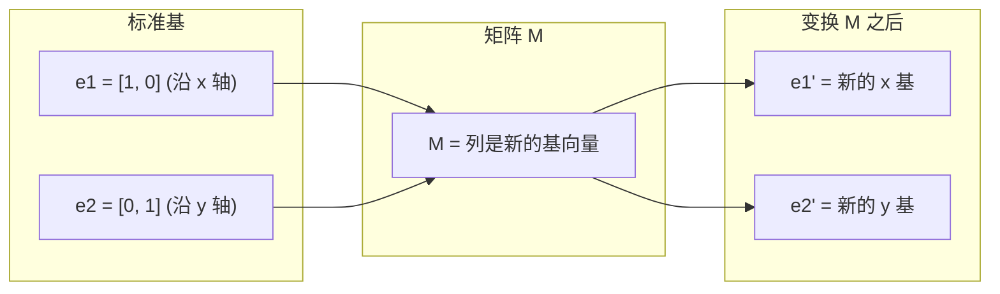
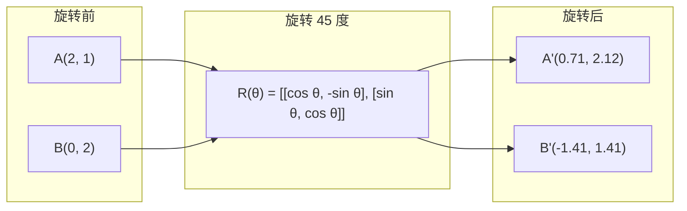
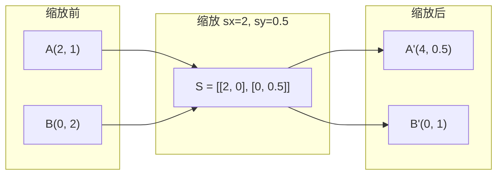
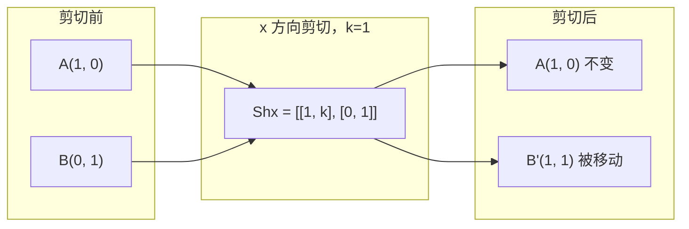
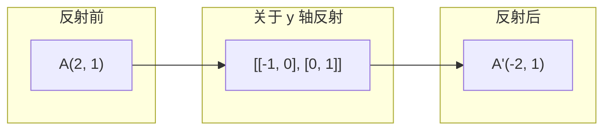
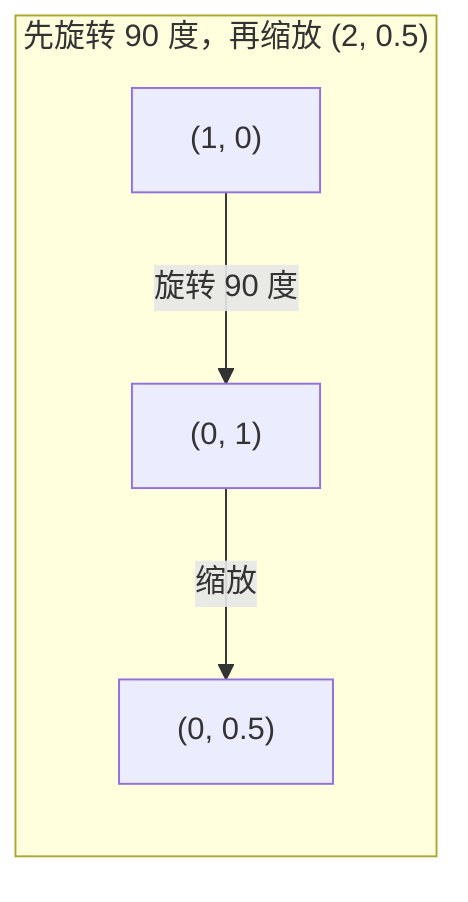
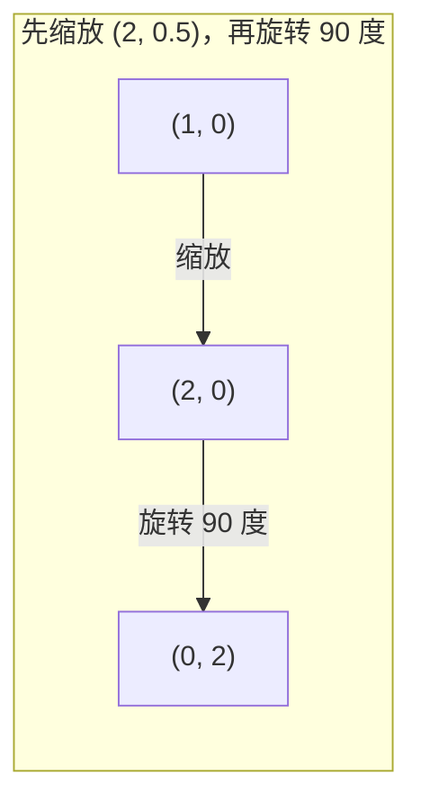

# 矩阵变换

> 矩阵是一台重塑空间的机器。了解它对每个点的作用，你就理解了整个变换。

**类型：** 构建  
**语言：** Python、Julia  
**前置要求：** 阶段1，第01-02课（线性代数直观理解、向量与矩阵运算）  
**时间：** 约75分钟

## 学习目标

- 构建旋转、缩放、剪切和反射矩阵，并将其应用于二维和三维点
- 通过矩阵乘法组合多个变换，并验证顺序的重要性
- 根据特征方程计算 2x2 矩阵的特征值和特征向量
- 解释为什么特征值决定了 PCA 方向、RNN 稳定性以及谱聚类行为

## 问题描述

你读到 PCA 时会看到“求协方差矩阵的特征向量”。你读到模型稳定性时会看到“检查所有特征值的模是否小于1”。你读到数据增强时会看到“应用一个随机旋转”。如果你不理解矩阵对空间在几何上做了什么，这些都没有意义。

矩阵不仅仅是数字网格。它们是空间机器。旋转矩阵使点旋转。缩放矩阵拉伸它们。剪切矩阵倾斜它们。神经网络应用于数据的每一个变换，都是这些操作之一，或者是它们的组合。本课程将这些操作变得具体可感。

## 概念讲解

### 变换即矩阵

二维中的每一个线性变换都可以写成一个 2x2 矩阵。这个矩阵准确地告诉你基向量 [1, 0] 和 [0, 1] 最终去了哪里。其余一切由此导出。



### 旋转

二维中旋转角度 θ 保持距离和角度不变。它将每个点沿着圆弧移动。



在三维中，你绕轴旋转。每个轴都有自己的旋转矩阵：

```
Rz(theta) = | cos  -sin  0 |     绕 z 轴旋转
            | sin   cos  0 |     (x-y 平面旋转，z 不变)
            |  0     0   1 |

Rx(theta) = | 1   0     0    |   绕 x 轴旋转
            | 0  cos  -sin   |    (y-z 平面旋转，x 不变)
            | 0  sin   cos   |

Ry(theta) = |  cos  0  sin |     绕 y 轴旋转
            |   0   1   0  |     (x-z 平面旋转，y 不变)
            | -sin  0  cos |
```

### 缩放

缩放沿每个轴独立拉伸或压缩。



### 剪切

剪切使一个轴倾斜，同时保持另一个轴固定。它将矩形变成平行四边形。



剪切矩阵：
- `Shx = [[1, k], [0, 1]]` 将 x 移动 k * y
- `Shy = [[1, 0], [k, 1]]` 将 y 移动 k * x

### 反射

反射将点镜像到轴或直线的另一侧。



反射矩阵：
- 关于 y 轴反射：`[[-1, 0], [0, 1]]`
- 关于 x 轴反射：`[[1, 0], [0, -1]]`

### 组合：链接变换

先应用变换 A 再应用 B，等价于它们的矩阵相乘：`result = B @ A @ point`。顺序很重要。先旋转后缩放，与先缩放后旋转，结果不同。



组合：`S @ R = [[0, -2], [0.5, 0]]`



组合：`R @ S = [[0, -0.5], [2, 0]]`

结果不同。矩阵乘法不满足交换律。

### 特征值和特征向量

大多数向量被矩阵作用后方向会改变。特征向量是特殊的：矩阵只缩放它们，从不旋转它们。缩放因子就是特征值。

```
A @ v = lambda * v

v 是特征向量（幸存的方向）
lambda 是特征值（拉伸的程度）

例子：A = | 2  1 |
         | 1  2 |

特征向量 [1, 1] 对应特征值 3：
  A @ [1,1] = [3, 3] = 3 * [1, 1]     （方向相同，缩放 3 倍）

特征向量 [1, -1] 对应特征值 1：
  A @ [1,-1] = [1, -1] = 1 * [1, -1]  （方向相同，不变）
```

该矩阵沿 [1, 1] 方向将空间拉伸 3 倍，沿 [1, -1] 方向保持不变。其他所有方向都是这两个方向的混合。

### 特征分解

如果一个矩阵有 n 个线性无关的特征向量，它可以被分解为：

```
A = V @ D @ V^(-1)

V = 特征向量作为列的矩阵
D = 特征值构成的对角矩阵
V^(-1) = V 的逆矩阵

这表示：旋转到特征向量坐标系，沿每个轴缩放，再旋转回来。
```

### 为什么特征值很重要

**PCA。** 协方差矩阵的特征向量就是主成分。特征值告诉你每个成分捕获了多少方差。按特征值排序，保留前 k 个，就完成了降维。

**稳定性。** 在循环网络和动力系统中，模大于 1 的特征值会导致输出爆炸，模小于 1 会导致它们消失。这正是一句话总结的梯度消失/爆炸问题。

**谱方法。** 图神经网络使用邻接矩阵的特征值。谱聚类使用拉普拉斯矩阵的特征值。特征向量揭示了图的结构。

### 行列式作为体积缩放因子

变换矩阵的行列式告诉你它如何缩放面积（二维）或体积（三维）。

```
det = 1:   面积保持不变（旋转）
det = 2:   面积加倍
det = 0:   空间被压塌到更低维度（奇异）
det = -1:  面积不变但方向翻转（反射）

|det(旋转)| = 1      （总是）
|det(缩放 sx, sy)| = sx * sy
|det(剪切)| = 1            （面积不变）
|det(反射)| = -1           （方向翻转）
```

## 动手实现

### 步骤 1：从零实现变换矩阵（Python）

```python
import math

def rotation_2d(theta):
    c, s = math.cos(theta), math.sin(theta)
    return [[c, -s], [s, c]]

def scaling_2d(sx, sy):
    return [[sx, 0], [0, sy]]

def shearing_2d(kx, ky):
    return [[1, kx], [ky, 1]]

def reflection_x():
    return [[1, 0], [0, -1]]

def reflection_y():
    return [[-1, 0], [0, 1]]

def mat_vec_mul(matrix, vector):
    return [
        sum(matrix[i][j] * vector[j] for j in range(len(vector)))
        for i in range(len(matrix))
    ]

def mat_mul(a, b):
    rows_a, cols_b = len(a), len(b[0])
    cols_a = len(a[0])
    return [
        [sum(a[i][k] * b[k][j] for k in range(cols_a)) for j in range(cols_b)]
        for i in range(rows_a)
    ]

point = [1.0, 0.0]
angle = math.pi / 4

rotated = mat_vec_mul(rotation_2d(angle), point)
print(f"将 (1,0) 旋转 45 度: ({rotated[0]:.4f}, {rotated[1]:.4f})")

scaled = mat_vec_mul(scaling_2d(2, 3), [1.0, 1.0])
print(f"将 (1,1) 缩放 (2,3): ({scaled[0]:.1f}, {scaled[1]:.1f})")

sheared = mat_vec_mul(shearing_2d(1, 0), [1.0, 1.0])
print(f"对 (1,1) 进行 x 方向剪切 kx=1: ({sheared[0]:.1f}, {sheared[1]:.1f})")

reflected = mat_vec_mul(reflection_y(), [2.0, 1.0])
print(f"将 (2,1) 关于 y 轴反射: ({reflected[0]:.1f}, {reflected[1]:.1f})")
```

### 步骤 2：变换的组合

```python
R = rotation_2d(math.pi / 2)
S = scaling_2d(2, 0.5)

rotate_then_scale = mat_mul(S, R)
scale_then_rotate = mat_mul(R, S)

point = [1.0, 0.0]
result1 = mat_vec_mul(rotate_then_scale, point)
result2 = mat_vec_mul(scale_then_rotate, point)

print(f"先旋转 90 度再缩放: ({result1[0]:.2f}, {result1[1]:.2f})")
print(f"先缩放再旋转 90 度: ({result2[0]:.2f}, {result2[1]:.2f})")
print(f"结果相同？{result1 == result2}")
```

### 步骤 3：从零计算特征值（2x2）

对于 2x2 矩阵 `[[a, b], [c, d]]`，特征值满足特征方程：`λ^2 - (a+d)λ + (ad - bc) = 0`。

```python
def eigenvalues_2x2(matrix):
    a, b = matrix[0]
    c, d = matrix[1]
    trace = a + d
    det = a * d - b * c
    discriminant = trace ** 2 - 4 * det
    if discriminant < 0:
        real = trace / 2
        imag = (-discriminant) ** 0.5 / 2
        return (complex(real, imag), complex(real, -imag))
    sqrt_disc = discriminant ** 0.5
    return ((trace + sqrt_disc) / 2, (trace - sqrt_disc) / 2)

def eigenvector_2x2(matrix, eigenvalue):
    a, b = matrix[0]
    c, d = matrix[1]
    if abs(b) > 1e-10:
        v = [b, eigenvalue - a]
    elif abs(c) > 1e-10:
        v = [eigenvalue - d, c]
    else:
        if abs(a - eigenvalue) < 1e-10:
            v = [1, 0]
        else:
            v = [0, 1]
    mag = (v[0] ** 2 + v[1] ** 2) ** 0.5
    return [v[0] / mag, v[1] / mag]

A = [[2, 1], [1, 2]]
vals = eigenvalues_2x2(A)
print(f"矩阵: {A}")
print(f"特征值: {vals[0]:.4f}, {vals[1]:.4f}")

for val in vals:
    vec = eigenvector_2x2(A, val)
    result = mat_vec_mul(A, vec)
    scaled = [val * vec[0], val * vec[1]]
    print(f"  lambda={val:.1f}, v={[round(x,4) for x in vec]}")
    print(f"    A@v = {[round(x,4) for x in result]}")
    print(f"    l*v = {[round(x,4) for x in scaled]}")
```

### 步骤 4：行列式作为体积缩放因子

```python
def det_2x2(matrix):
    return matrix[0][0] * matrix[1][1] - matrix[0][1] * matrix[1][0]

print(f"det(旋转 45 度) = {det_2x2(rotation_2d(math.pi/4)):.4f}")
print(f"det(缩放 2,3)   = {det_2x2(scaling_2d(2, 3)):.1f}")
print(f"det(剪切 kx=1)  = {det_2x2(shearing_2d(1, 0)):.1f}")
print(f"det(关于 y 反射)   = {det_2x2(reflection_y()):.1f}")

singular = [[1, 2], [2, 4]]
print(f"det(奇异矩阵)     = {det_2x2(singular):.1f}")
print("奇异矩阵：列成比例，空间被压塌到一条直线。")
```

## 使用 NumPy

NumPy 使用优化例程处理所有这些操作。

```python
import numpy as np

theta = np.pi / 4
R = np.array([[np.cos(theta), -np.sin(theta)],
              [np.sin(theta),  np.cos(theta)]])

point = np.array([1.0, 0.0])
print(f"将 (1,0) 旋转 45 度: {R @ point}")

S = np.diag([2.0, 3.0])
composed = S @ R
print(f"先旋转 45 度再缩放 (2,3): {composed @ point}")

A = np.array([[2, 1], [1, 2]], dtype=float)
eigenvalues, eigenvectors = np.linalg.eig(A)
print(f"\n特征值: {eigenvalues}")
print(f"特征向量（列）:\n{eigenvectors}")

for i in range(len(eigenvalues)):
    v = eigenvectors[:, i]
    lam = eigenvalues[i]
    print(f"  A @ v{i} = {A @ v}, lambda * v{i} = {lam * v}")

print(f"\ndet(R) = {np.linalg.det(R):.4f}")
print(f"det(S) = {np.linalg.det(S):.1f}")

B = np.array([[3, 1], [0, 2]], dtype=float)
vals, vecs = np.linalg.eig(B)
D = np.diag(vals)
V = vecs
reconstructed = V @ D @ np.linalg.inv(V)
print(f"\n特征分解 A = V @ D @ V^-1:")
print(f"原矩阵:\n{B}")
print(f"重构矩阵:\n{reconstructed}")
```

### 使用 NumPy 进行 3D 旋转

```python
def rotation_3d_z(theta):
    c, s = np.cos(theta), np.sin(theta)
    return np.array([[c, -s, 0], [s, c, 0], [0, 0, 1]])

def rotation_3d_x(theta):
    c, s = np.cos(theta), np.sin(theta)
    return np.array([[1, 0, 0], [0, c, -s], [0, s, c]])

point_3d = np.array([1.0, 0.0, 0.0])
rotated_z = rotation_3d_z(np.pi / 2) @ point_3d
rotated_x = rotation_3d_x(np.pi / 2) @ point_3d

print(f"\n3D 点: {point_3d}")
print(f"绕 z 轴旋转 90 度: {np.round(rotated_z, 4)}")
print(f"绕 x 轴旋转 90 度: {np.round(rotated_x, 4)}")
```

## 交付成果

本课程为 PCA（阶段2）和神经网络权重分析构建了几何基础。这里构建的特征值/特征向量代码，正是支撑生产级机器学习系统中降维、谱聚类和稳定性分析的同一算法。

## 练习

1. 对一个单位正方形（顶点 [0,0]、[1,0]、[1,1]、[0,1]）依次应用旋转、缩放和剪切。输出每个变换后的顶点坐标。验证旋转保持了顶点之间的距离不变。

2. 使用特征方程手动计算矩阵 `[[4, 2], [1, 3]]` 的特征值。然后用你自己的函数和 NumPy 验证。

3. 创建一个由三个变换组成的复合变换（旋转 30 度、缩放 [1.5, 0.8]、x 方向剪切 kx=0.3），并将其应用于分布在圆上的 8 个点。输出变换前后的坐标。计算复合矩阵的行列式，验证它等于各个变换行列式的乘积。

## 关键术语

| 术语 | 人们常说的 | 实际含义 |
|------|-----------|----------|
| 旋转矩阵 | “旋转物体” | 一个正交矩阵，使点沿圆弧移动，保持距离和角度不变。行列式总是 1。 |
| 缩放矩阵 | “放大物体” | 一个对角矩阵，沿每个轴独立拉伸或压缩。行列式是缩放因子的乘积。 |
| 剪切矩阵 | “倾斜物体” | 使一个坐标与另一个坐标成比例移动的矩阵，将矩形变成平行四边形。行列式为 1。 |
| 反射 | “镜像物体” | 将空间跨越轴或平面翻转的矩阵。行列式为 -1。 |
| 组合 | “做两件事” | 通过矩阵乘法链接变换操作。顺序重要：B @ A 表示先应用 A，再应用 B。 |
| 特征向量 | “特殊方向” | 矩阵只缩放而不旋转的方向。变换的“指纹”。 |
| 特征值 | “拉伸多少” | 矩阵对其特征向量缩放的标量因子。可以是负数（翻转）或复数（旋转）。 |
| 特征分解 | “分解矩阵” | 将矩阵写成 V @ D @ V^(-1) 的形式，将其分解为基本的缩放方向和幅度。 |
| 行列式 | “从矩阵算出的一个数” | 变换缩放面积（二维）或体积（三维）的因子。为零意味着变换不可逆。 |
| 特征方程 | “特征值的来源” | det(A - lambda * I) = 0。特征值作为根的多项式方程。 |

## 延伸阅读

- [3Blue1Brown：线性变换](https://www.3blue1brown.com/lessons/linear-transformations) —— 矩阵如何重塑空间的可视化直观理解
- [3Blue1Brown：特征向量与特征值](https://www.3blue1brown.com/lessons/eigenvalues) —— 关于特征值几何意义的最佳可视化解释
- [MIT 18.06 第21讲：特征值与特征向量](https://ocw.mit.edu/courses/18-06-linear-algebra-spring-2010/) —— Gilbert Strang 的经典讲解