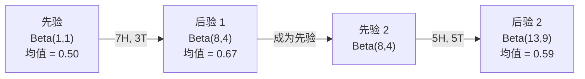

# 贝叶斯定理

> 概率关乎你预期什么。贝叶斯定理关乎你学到什么。

**类型：** 构建  
**语言：** Python  
**前置要求：** 阶段1，第06课（概率基础）  
**时间：** 约75分钟

## 学习目标

- 运用贝叶斯定理，从先验、似然和证据计算后验概率
- 从零构建一个带有拉普拉斯平滑和对数空间计算的朴素贝叶斯文本分类器
- 比较 MLE 和 MAP 估计，并解释 MAP 如何对应 L2 正则化
- 使用 Beta-二项共轭先验为 A/B 测试实现顺序贝叶斯更新

## 问题描述

一种医学检测的准确率是 99%。你检测为阳性。你实际上患病的概率是多少？

大多数人会说是 99%。真正的答案取决于这种疾病有多罕见。如果一万人中只有一人患病，那么阳性结果只会给你大约 1% 的患病概率。其余 99% 的阳性结果都来自健康人的假警报。

这不是一个脑筋急转弯。这就是贝叶斯定理。每一个垃圾邮件过滤器、每一个医学诊断、每一个量化不确定性的机器学习模型都使用了这一精确的推理。你从一个信念开始。你看到证据。你更新信念。

如果你在不理解这一点的情况下构建机器学习系统，你会误解模型输出、设置糟糕的阈值，并发布过度自信的预测。

## 概念讲解

### 从联合概率到贝叶斯定理

你在第06课已经知道条件概率：

```
P(A|B) = P(A and B) / P(B)
```

对称地：

```
P(B|A) = P(A and B) / P(A)
```

两个表达式共享相同的分子：P(A and B)。令它们相等并重新排列：

```
P(A and B) = P(A|B) * P(B) = P(B|A) * P(A)

因此：

P(A|B) = P(B|A) * P(A) / P(B)
```

这就是贝叶斯定理。四个量，一个方程。

### 四个部分

| 部分 | 名称 | 含义 |
|------|------|------|
| P(A\|B) | 后验 | 看到证据 B 后你对 A 的更新信念 |
| P(B\|A) | 似然 | 如果 A 为真，证据 B 出现的概率 |
| P(A) | 先验 | 看到任何证据之前你对 A 的信念 |
| P(B) | 证据 | 在所有可能情况下看到 B 的总概率 |

证据项 P(B) 扮演归一化常数的角色。你可以用全概率公式展开它：

```
P(B) = P(B|A) * P(A) + P(B|¬A) * P(¬A)
```

### 医学检测例子

一种疾病影响一万人中的一人。检测准确率 99%（能检测出 99% 的病人，有 1% 的假阳性率）。

```
P(患病)          = 0.0001     （先验：疾病罕见）
P(阳性|患病)     = 0.99       （似然：检测能检出）
P(阳性|健康)     = 0.01       （假阳性率）

P(阳性) = P(阳性|患病) * P(患病) + P(阳性|健康) * P(健康)
        = 0.99 * 0.0001 + 0.01 * 0.9999
        = 0.000099 + 0.009999
        = 0.010098

P(患病|阳性) = P(阳性|患病) * P(患病) / P(阳性)
             = 0.99 * 0.0001 / 0.010098
             = 0.0098
             = 0.98%
```

不到 1%。先验占主导。当一个条件罕见时，即使准确的检测也会产生大部分假阳性。这就是为什么医生会要求做确认检测。

### 垃圾邮件过滤器例子

你收到一封包含“彩票”一词的邮件。它是垃圾邮件吗？

```
P(垃圾邮件)                = 0.3      （30% 的邮件是垃圾邮件）
P("彩票"|垃圾邮件)         = 0.05     （5% 的垃圾邮件包含“彩票”）
P("彩票"|非垃圾邮件)       = 0.001    （0.1% 的正常邮件包含“彩票”）

P("彩票") = 0.05 * 0.3 + 0.001 * 0.7
         = 0.015 + 0.0007
         = 0.0157

P(垃圾邮件|"彩票") = 0.05 * 0.3 / 0.0157
                  = 0.955
                  = 95.5%
```

一个词就把概率从 30% 推到了 95.5%。真正的垃圾邮件过滤器会同时对成百上千个词应用贝叶斯定理。

### 朴素贝叶斯：独立性假设

朴素贝叶斯将这一点扩展到多个特征，它假设所有特征在给定类别下是条件独立的：

```
P(类别 | 特征₁, 特征₂, ..., 特征ₙ)
  = P(类别) * P(特征₁|类别) * P(特征₂|类别) * ... * P(特征ₙ|类别)
    / P(特征₁, 特征₂, ..., 特征ₙ)
```

“朴素”之处就是这个独立性假设。在文本中，词语的出现不是独立的（“New”和“York”是相关的）。但这个假设在实践中效果出奇地好，因为分类器只需要对类别进行排序，而不需要产生校准过的概率。

由于分母对所有类别都一样，你可以跳过它，只比较分子：

```
得分(类别) = P(类别) * ∏ P(特征_i | 类别)
```

选择得分最高的类别。

### 最大似然估计（MLE）

如何从训练数据中得到 P(特征|类别)？计数。

```
P("免费"|垃圾邮件) = (垃圾邮件中包含“免费”的邮件数) / (垃圾邮件总数)
```

这就是 MLE：选择使观测数据最有可能出现的参数值。你是在最大化似然函数，对于离散计数来说，这简化为相对频率。

问题：如果一个词在训练时从未出现在垃圾邮件中，MLE 会给出零概率。一个未见过的词就会毁掉整个乘积。用拉普拉斯平滑修复：

```
P(词|类别) = (count(词, 类别) + 1) / (类别中总词数 + 词汇表大小)
```

给每个计数加 1，确保没有概率为零。

### 最大后验估计（MAP）

MLE 问：什么参数最大化 P(数据|参数)？

MAP 问：什么参数最大化 P(参数|数据)？

根据贝叶斯定理：

```
P(参数|数据) ∝ P(数据|参数) * P(参数)
```

MAP 在参数本身上添加了一个先验。如果你认为参数应该很小，你可以将其编码为一个对较大值施加惩罚的先验。这与机器学习中的 L2 正则化完全相同。岭回归中的“岭”惩罚实际上就是权重上的高斯先验。

| 估计 | 优化的目标 | 机器学习中的对应 |
|------|-----------|----------------|
| MLE | P(数据\|参数) | 无正则化训练 |
| MAP | P(数据\|参数) * P(参数) | L2 / L1 正则化 |

### 贝叶斯 vs 频率派：实际区别

频率派把参数视为固定的未知量。他们问：“如果我把这个实验重复很多次，会发生什么？”

贝叶斯派把参数视为分布。他们问：“基于我已经观察到的，我对参数的信念是什么？”

对于构建机器学习系统，实际区别在于：

| 方面 | 频率派 | 贝叶斯派 |
|------|--------|----------|
| 输出 | 点估计 | 值的分布 |
| 不确定性 | 置信区间（关于过程的） | 可信区间（关于参数的） |
| 小数据 | 可能过拟合 | 先验起到正则化作用 |
| 计算 | 通常更快 | 常需要采样（MCMC） |

大多数生产级机器学习是频率派的（SGD、点估计）。当你需要校准过的不确定性（医疗决策、安全关键系统）或数据稀缺时（少样本学习、冷启动），贝叶斯方法表现出色。

### 为什么贝叶斯思维对机器学习重要

这种联系不仅仅是类比：

**先验就是正则化。** 权重上的高斯先验就是 L2 正则化。拉普拉斯先验就是 L1。每次你添加一个正则化项，你就是在做一个贝叶斯陈述，表达你期望的参数值是什么。

**后验就是不确定性。** 单一预测概率不能告诉你模型对该估计有多自信。贝叶斯方法给你一个分布：“我认为 P(垃圾邮件) 在 0.8 到 0.95 之间。”

**贝叶斯更新就是在线学习。** 今天的后验成为明天的先验。当你的模型看到新数据时，它会逐步更新信念，而不是从头重新训练。

**模型比较是贝叶斯式的。** 贝叶斯信息准则（BIC）、边际似然和贝叶斯因子都使用贝叶斯推理在不同模型之间进行选择，而不会过拟合。

## 动手实现

### 步骤 1：贝叶斯定理函数

```python
def bayes(prior, likelihood, false_positive_rate):
    evidence = likelihood * prior + false_positive_rate * (1 - prior)
    posterior = likelihood * prior / evidence
    return posterior

result = bayes(prior=0.0001, likelihood=0.99, false_positive_rate=0.01)
print(f"P(患病|阳性) = {result:.4f}")
```

### 步骤 2：朴素贝叶斯分类器

```python
import math
from collections import defaultdict

class NaiveBayes:
    def __init__(self, smoothing=1.0):
        self.smoothing = smoothing
        self.class_counts = defaultdict(int)
        self.word_counts = defaultdict(lambda: defaultdict(int))
        self.class_word_totals = defaultdict(int)
        self.vocab = set()

    def train(self, documents, labels):
        for doc, label in zip(documents, labels):
            self.class_counts[label] += 1
            words = doc.lower().split()
            for word in words:
                self.word_counts[label][word] += 1
                self.class_word_totals[label] += 1
                self.vocab.add(word)

    def predict(self, document):
        words = document.lower().split()
        total_docs = sum(self.class_counts.values())
        vocab_size = len(self.vocab)
        best_class = None
        best_score = float("-inf")
        for cls in self.class_counts:
            score = math.log(self.class_counts[cls] / total_docs)
            for word in words:
                count = self.word_counts[cls].get(word, 0)
                total = self.class_word_totals[cls]
                score += math.log((count + self.smoothing) / (total + self.smoothing * vocab_size))
            if score > best_score:
                best_score = score
                best_class = cls
        return best_class
```

对数概率防止下溢。将许多小概率相乘会得到浮点数无法表示的数字。而对数概率求和在数值上稳定，并且在数学上等价。

### 步骤 3：在垃圾邮件数据上训练

```python
train_docs = [
    "win free money now",
    "free lottery ticket winner",
    "claim your prize today free",
    "urgent offer free cash",
    "congratulations you won free",
    "meeting tomorrow at noon",
    "project update attached",
    "can we schedule a call",
    "quarterly report review",
    "lunch on thursday sounds good",
    "team standup notes attached",
    "please review the pull request",
]

train_labels = [
    "spam", "spam", "spam", "spam", "spam",
    "ham", "ham", "ham", "ham", "ham", "ham", "ham",
]

classifier = NaiveBayes()
classifier.train(train_docs, train_labels)

test_messages = [
    "free money waiting for you",
    "meeting rescheduled to friday",
    "you won a free prize",
    "please review the attached report",
]

for msg in test_messages:
    print(f"  '{msg}' -> {classifier.predict(msg)}")
```

### 步骤 4：查看学习到的概率

```python
def show_top_words(classifier, cls, n=5):
    vocab_size = len(classifier.vocab)
    total = classifier.class_word_totals[cls]
    probs = {}
    for word in classifier.vocab:
        count = classifier.word_counts[cls].get(word, 0)
        probs[word] = (count + classifier.smoothing) / (total + classifier.smoothing * vocab_size)
    sorted_words = sorted(probs.items(), key=lambda x: x[1], reverse=True)
    for word, prob in sorted_words[:n]:
        print(f"    {word}: {prob:.4f}")

print("\nTop spam words:")
show_top_words(classifier, "spam")
print("\nTop ham words:")
show_top_words(classifier, "ham")
```

## 使用 Scikit‑Learn

Scikit‑learn 提供了可用于生产的朴素贝叶斯实现：

```python
from sklearn.feature_extraction.text import CountVectorizer
from sklearn.naive_bayes import MultinomialNB
from sklearn.metrics import classification_report

vectorizer = CountVectorizer()
X_train = vectorizer.fit_transform(train_docs)
clf = MultinomialNB()
clf.fit(X_train, train_labels)

X_test = vectorizer.transform(test_messages)
predictions = clf.predict(X_test)
for msg, pred in zip(test_messages, predictions):
    print(f"  '{msg}' -> {pred}")
```

同样的算法。CountVectorizer 处理分词和词汇表构建。MultinomialNB 内部处理平滑和对数概率。你自己实现的版本用 40 行代码完成了相同的事情。

## 交付成果

这里构建的 NaiveBayes 类展示了完整的流程：分词、拉普拉斯平滑的概率估计、对数空间预测。`code/bayes.py` 中的代码端到端运行，除了 Python 标准库外没有其他依赖。

### 共轭先验

当先验和后验属于同一分布族时，该先验被称为“共轭”。这使得贝叶斯更新在代数上非常简洁——你可以得到一个封闭形式的后验，无需数值积分。

| 似然 | 共轭先验 | 后验 | 示例 |
|------|---------|------|------|
| 伯努利 | Beta(a, b) | Beta(a + 成功数, b + 失败数) | 抛硬币偏差估计 |
| 正态（已知方差） | 正态(μ₀, σ₀) | 正态(加权均值, 更小方差) | 传感器校准 |
| 泊松 | Gamma(a, b) | Gamma(a + 计数和, b + n) | 到达率建模 |
| 多项分布 | Dirichlet(α) | Dirichlet(α + 计数) | 主题建模、语言模型 |

为什么这很重要：没有共轭先验，你需要蒙特卡洛采样或变分推断来近似后验。有了共轭先验，你只需更新两个数字。

Beta 分布是实践中最常见的共轭先验。Beta(a, b) 表示你对一个概率参数的信念。其均值为 a/(a+b)。a+b 越大，分布越集中（越自信）。

Beta 先验的特例：
- Beta(1, 1) = 均匀分布。你对参数没有看法。
- Beta(10, 10) = 在 0.5 处尖峰。你坚信参数接近 0.5。
- Beta(1, 10) = 向 0 偏斜。你认为参数很小。

更新规则非常简单：

```
先验：     Beta(a, b)
数据：      s 次成功，f 次失败
后验：     Beta(a + s, b + f)
```

没有积分。没有采样。只是加法。

### 顺序贝叶斯更新

贝叶斯推理本质上是顺序性的。今天的后验成为明天的先验。这就是真实系统逐步学习的方式，无需重新处理所有历史数据。

具体例子：估计一枚硬币是否公平。

**第 1 天：还没有数据。**
从 Beta(1, 1) 开始——一个均匀先验。你没有任何看法。
- 先验均值：0.5
- 先验在 [0, 1] 上是平坦的

**第 2 天：观察到 7 次正面，3 次反面。**
后验 = Beta(1 + 7, 1 + 3) = Beta(8, 4)
- 后验均值：8/12 = 0.667
- 证据表明硬币偏向正面

**第 3 天：再观察到 5 次正面，5 次反面。**
使用昨天的后验作为今天的先验。
后验 = Beta(8 + 5, 4 + 5) = Beta(13, 9)
- 后验均值：13/22 = 0.591
- 平衡的新数据将估计值拉回 0.5



观测的顺序无关紧要。同时用所有 12 次正面和 8 次反面更新 Beta(1,1) 得到 Beta(13,9)——结果相同。顺序更新和批量更新在数学上是等价的。但顺序更新允许你在每一步做出决策，而无需存储原始数据。

这是生产级机器学习系统中在线学习的基础。用于 bandit 的汤普森采样、增量推荐系统和流式异常检测器都使用这种模式。

### 与 A/B 测试的联系

A/B 测试实际上是贝叶斯推理的一种形式。

设置：你正在测试两种按钮颜色。变体 A（蓝色）和变体 B（绿色）。你想知道哪个获得更多点击。

贝叶斯 A/B 测试：

1. **先验。** 对两个变体都从 Beta(1, 1) 开始。没有先验偏好。
2. **数据。** 变体 A：1000 次浏览中 50 次点击。变体 B：1000 次浏览中 65 次点击。
3. **后验。**
   - A：Beta(1 + 50, 1 + 950) = Beta(51, 951)。均值 = 0.051
   - B：Beta(1 + 65, 1 + 935) = Beta(66, 936)。均值 = 0.066
4. **决策。** 计算 P(B > A)——B 的真实转化率高于 A 的概率。

解析计算 P(B > A) 很困难。但蒙特卡洛方法使其变得简单：

```
1. 从 Beta(51, 951) 中抽取 100,000 个样本 -> samples_A
2. 从 Beta(66, 936) 中抽取 100,000 个样本 -> samples_B
3. P(B > A) = samples_B 大于 samples_A 的比例
```

如果 P(B > A) > 0.95，你就发布变体 B。如果在 0.05 和 0.95 之间，你就继续收集数据。如果 P(B > A) < 0.05，你就发布变体 A。

与频率派 A/B 测试相比的优势：
- 你得到一个直接的概率陈述：“B 更好的可能性是 97%”
- 没有 p 值的混淆。没有“无法拒绝零假设”这种含糊说法。
- 你可以随时查看结果，而不会增加假阳性率（没有“偷看问题”）
- 你可以纳入先验知识（例如，之前的测试表明转化率通常在 3-8% 之间）

| 方面 | 频率派 A/B | 贝叶斯 A/B |
|------|-----------|-----------|
| 输出 | p 值 | P(B > A) |
| 解释 | “如果 A=B，这个数据有多令人惊讶？” | “B 比 A 好的可能性有多大？” |
| 提前停止 | 增加假阳性 | 任何时间都安全（给定良好选择的先验和正确指定的模型）|
| 先验知识 | 不使用 | 编码为 Beta 先验 |
| 决策规则 | p < 0.05 | P(B > A) > 阈值 |

## 练习

1. **多次检测。** 一个病人连续两次独立检测均为阳性（两次检测准确率均为 99%，疾病患病率为万分之一）。两次检测后 P(患病) 是多少？将第一次检测的后验作为第二次检测的先验。

2. **平滑的影响。** 使用平滑值 0.01、0.1、1.0 和 10.0 运行垃圾邮件分类器。顶部词语的概率如何变化？当 smoothing=0 且一个词只出现在 ham 中时会发生什么？

3. **添加特征。** 扩展 NaiveBayes 类，除了词频外，还将消息长度（短/长）作为一个特征。从训练数据中估计 P(短|垃圾邮件) 和 P(短|ham)，并将其纳入预测分数。

4. **手动计算 MAP。** 给定观测数据（10 次抛硬币中 7 次正面），使用 Beta(2,2) 先验计算偏差的 MAP 估计。将其与 MLE 估计（7/10）进行比较。

## 关键术语

| 术语 | 人们常说的 | 实际含义 |
|------|-----------|----------|
| 先验 | “我的初始猜测” | 观测证据之前 P(假设)。在机器学习中：正则化项。 |
| 似然 | “数据拟合得如何” | P(证据\|假设)。在特定假设下，观测数据出现的概率。 |
| 后验 | “我更新后的信念” | P(假设\|证据)。先验乘以似然，然后归一化。 |
| 证据 | “归一化常数” | 在所有假设下 P(数据)。确保后验之和为 1。 |
| 朴素贝叶斯 | “那个简单的文本分类器” | 一个假设特征在给定类别下相互独立的分类器。尽管假设错误，但效果很好。 |
| 拉普拉斯平滑 | “加一平滑” | 为每个特征添加一个小的计数，以防止未见数据导致零概率。 |
| MLE | “直接用频率” | 选择最大化 P(数据\|参数) 的参数。没有先验。在小数据下可能过拟合。 |
| MAP | “带先验的 MLE” | 选择最大化 P(数据\|参数) * P(参数) 的参数。等价于正则化的 MLE。 |
| 对数概率 | “在对数空间工作” | 使用 log(P) 代替 P，以避免在相乘许多小数字时浮点数下溢。 |
| 假阳性 | “虚警” | 检测结果为阳性，但真实状态为阴性。导致了基率谬误。 |

## 延伸阅读

- [3Blue1Brown：贝叶斯定理](https://www.youtube.com/watch?v=HZGCoVF3YvM) —— 带有医学检测示例的可视化解释
- [斯坦福 CS229：生成学习算法](https://cs229.stanford.edu/notes2022fall/cs229-notes2.pdf) —— 朴素贝叶斯及其与判别模型的联系
- [Think Bayes](https://greenteapress.com/wp/think-bayes/) —— 免费书籍，用 Python 代码讲解贝叶斯统计
- [scikit-learn 朴素贝叶斯](https://scikit-learn.org/stable/modules/naive_bayes.html) —— 生产级实现以及何时使用每种变体