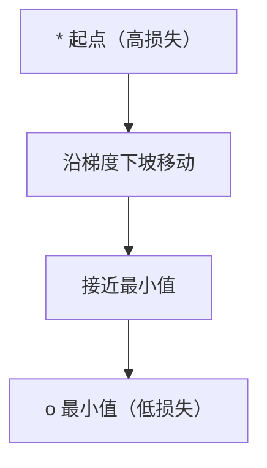
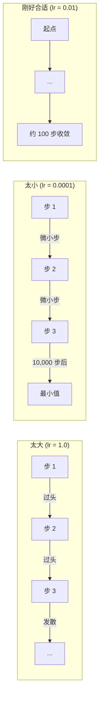
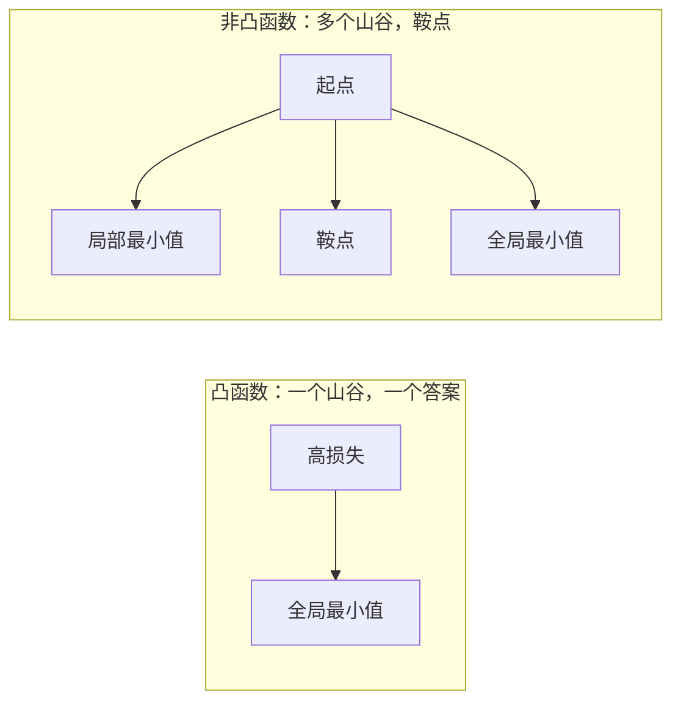
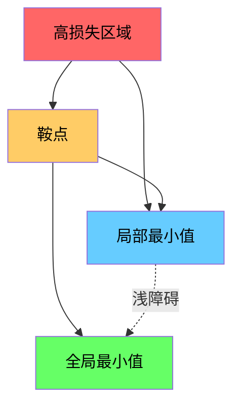

# 优化

> 训练一个神经网络无非是在山谷中找到最低点。

**类型：** 构建  
**语言：** Python  
**前置要求：** 阶段1，第04-05课（导数、梯度）  
**时间：** 约75分钟

## 学习目标

- 从零实现普通梯度下降、带动量的 SGD 和 Adam 优化器
- 在 Rosenbrock 函数上比较优化器的收敛性，并解释 Adam 如何为每个权重自适应学习率
- 区分凸损失景观和非凸损失景观，并解释鞍点在高维空间中的作用
- 配置学习率调度策略（阶梯衰减、余弦退火、预热）以保证训练稳定性

## 问题描述

你有一个损失函数。它告诉你模型错得有多离谱。你有梯度。它们告诉你哪个方向会让损失变得更糟。现在你需要一个策略来走下坡路。

朴素的方法很简单：沿着梯度的反方向移动。用学习率这个数字来缩放步长。重复。这就是梯度下降，而且它有效。但“有效”是有条件的。学习率太大，你会完全越过山谷，在两边之间来回弹跳。学习率太小，你会爬行成千上万不必要的步才到达答案。遇到鞍点，你甚至会停止移动，尽管还没有找到最小值。

深度学习中的每一个优化器都在回答同一个问题：你怎样才能更快、更可靠地到达山谷的底部？

## 概念讲解

### 优化意味着什么

优化是找到使函数最小（或最大）的输入值。在机器学习中，这个函数是损失函数。输入是模型的权重。训练就是优化。

```
最小化 L(w)，其中：
  L = 损失函数
  w = 模型权重（可能有数百万个参数）
```

### 梯度下降（普通版）

最简单的优化器。计算损失对每一个权重的梯度。将每个权重沿其梯度的反方向移动。用学习率来缩放步长。

```
w = w - lr * gradient
```

这就是整个算法。一行代码。



### 学习率：最重要的超参数

学习率控制步长。它决定收敛的一切。



没有公式能算出正确的学习率。你通过实验找到它。常见的起点：Adam 用 0.001，带动量的 SGD 用 0.01。

### SGD vs 批梯度 vs 小批量

普通梯度下降在走一步之前先计算整个数据集上的梯度。这叫做批梯度下降。它稳定但慢。

随机梯度下降（SGD）在单个随机样本上计算梯度并立即更新。它噪声大但快。

小批量梯度下降取折中。在一个小批量（32、64、128、256 个样本）上计算梯度，然后更新。这才是大家实际使用的。

| 变体 | 批量大小 | 梯度质量 | 每步速度 | 噪声 |
|------|---------|----------|---------|------|
| 批梯度 | 整个数据集 | 精确 | 慢 | 无 |
| SGD | 1 个样本 | 噪声很大 | 快 | 高 |
| 小批量 | 32-256 | 良好估计 | 均衡 | 中等 |

SGD 和小批量中的噪声不是缺陷。它有助于逃离浅的局部最小值和鞍点。

### 动量：滚下山坡的球

普通梯度下降只看当前梯度。如果梯度来回摆动（在狭窄山谷中常见），进展就会很慢。动量通过将过去的梯度累积到一个速度项中来解决这个问题。

```
v = beta * v + gradient
w = w - lr * v
```

类比：一个滚下山坡的球。它不会在每个凸起处停下来重新启动。它在一致的方向上积累速度，并抑制振荡。


`beta`（通常为 0.9）控制保留多少历史。beta 越大，动量越大，路径越平滑，但对方向变化的响应越慢。

### Adam：自适应学习率

不同的权重需要不同的学习率。一个很少获得大梯度的权重，当它终于获得大梯度时，应该迈出更大的步子。一个不断获得巨大梯度的权重应该迈出更小的步子。

Adam（自适应矩估计）为每个权重跟踪两个量：

1. 一阶矩（m）：梯度的运行平均值（类似动量）
2. 二阶矩（v）：梯度平方的运行平均值（梯度大小）

```
m = beta1 * m + (1 - beta1) * gradient
v = beta2 * v + (1 - beta2) * gradient^2

m_hat = m / (1 - beta1^t)    偏差修正
v_hat = v / (1 - beta2^t)    偏差修正

w = w - lr * m_hat / (sqrt(v_hat) + epsilon)
```

除以 `sqrt(v_hat)` 是关键见解。梯度大的权重会被一个大数除（有效步长小）。梯度小的权重会被一个小数除（有效步长大）。每个权重都有自己的自适应学习率。

默认超参数：`lr=0.001, beta1=0.9, beta2=0.999, epsilon=1e-8`。这些默认值对大多数问题都很有效。

### 学习率调度

固定的学习率是一种妥协。训练早期，你需要大步长以快速进展。训练后期，你需要小步长以在最小值附近微调。

常见的调度策略：

| 调度策略 | 公式 | 用例 |
|----------|------|------|
| 阶梯衰减 | 每 N 个 epoch lr = lr * factor | 简单，手动控制 |
| 指数衰减 | lr = lr_0 * decay^t | 平滑减小 |
| 余弦退火 | lr = lr_min + 0.5 * (lr_max - lr_min) * (1 + cos(pi * t / T)) | Transformer，现代训练 |
| 预热 + 衰减 | 线性上升，然后衰减 | 大模型，防止早期不稳定 |

### 凸函数 vs 非凸函数

凸函数只有一个最小值。梯度下降总能找到它。像 `f(x) = x^2` 这样的二次函数是凸的。

神经网络损失函数是非凸的。它们有许多局部最小值、鞍点和平坦区域。



在实践中，高维神经网络中的局部最小值很少是问题。大多数局部最小值的损失值接近全局最小值。鞍点（在某些方向平坦，在其他方向弯曲）才是真正的障碍。动量和来自小批量的噪声有助于逃离它们。

### 损失景观可视化

损失是所有权重的函数。对于一个有 100 万个权重的模型，损失景观存在于 1,000,001 维空间中。我们通过在权重空间中选取两个随机方向，并沿着这些方向绘制损失来可视化它，从而得到一个二维曲面。



尖锐的最小值泛化能力差。平坦的最小值泛化能力强。这就是为什么带动量的 SGD 在最终测试准确率上常常优于 Adam 的原因之一：它的噪声阻止了陷入尖锐的最小值。

## 动手实现

### 步骤 1：定义一个测试函数

Rosenbrock 函数是一个经典的优化基准。它的最小值在 (1, 1)，位于一个狭窄弯曲的山谷中，容易找到但难以沿着山谷走。

```
f(x, y) = (1 - x)^2 + 100 * (y - x^2)^2
```

```python
def rosenbrock(params):
    x, y = params
    return (1 - x) ** 2 + 100 * (y - x ** 2) ** 2

def rosenbrock_gradient(params):
    x, y = params
    df_dx = -2 * (1 - x) + 200 * (y - x ** 2) * (-2 * x)
    df_dy = 200 * (y - x ** 2)
    return [df_dx, df_dy]
```

### 步骤 2：普通梯度下降

```python
class GradientDescent:
    def __init__(self, lr=0.001):
        self.lr = lr

    def step(self, params, grads):
        return [p - self.lr * g for p, g in zip(params, grads)]
```

### 步骤 3：带动量的 SGD

```python
class SGDMomentum:
    def __init__(self, lr=0.001, momentum=0.9):
        self.lr = lr
        self.momentum = momentum
        self.velocity = None

    def step(self, params, grads):
        if self.velocity is None:
            self.velocity = [0.0] * len(params)
        self.velocity = [
            self.momentum * v + g
            for v, g in zip(self.velocity, grads)
        ]
        return [p - self.lr * v for p, v in zip(params, self.velocity)]
```

### 步骤 4：Adam

```python
class Adam:
    def __init__(self, lr=0.001, beta1=0.9, beta2=0.999, epsilon=1e-8):
        self.lr = lr
        self.beta1 = beta1
        self.beta2 = beta2
        self.epsilon = epsilon
        self.m = None
        self.v = None
        self.t = 0

    def step(self, params, grads):
        if self.m is None:
            self.m = [0.0] * len(params)
            self.v = [0.0] * len(params)

        self.t += 1

        self.m = [
            self.beta1 * m + (1 - self.beta1) * g
            for m, g in zip(self.m, grads)
        ]
        self.v = [
            self.beta2 * v + (1 - self.beta2) * g ** 2
            for v, g in zip(self.v, grads)
        ]

        m_hat = [m / (1 - self.beta1 ** self.t) for m in self.m]
        v_hat = [v / (1 - self.beta2 ** self.t) for v in self.v]

        return [
            p - self.lr * mh / (vh ** 0.5 + self.epsilon)
            for p, mh, vh in zip(params, m_hat, v_hat)
        ]
```

### 步骤 5：运行并比较

```python
def optimize(optimizer, func, grad_func, start, steps=5000):
    params = list(start)
    history = [params[:]]
    for _ in range(steps):
        grads = grad_func(params)
        params = optimizer.step(params, grads)
        history.append(params[:])
    return history

start = [-1.0, 1.0]

gd_history = optimize(GradientDescent(lr=0.0005), rosenbrock, rosenbrock_gradient, start)
sgd_history = optimize(SGDMomentum(lr=0.0001, momentum=0.9), rosenbrock, rosenbrock_gradient, start)
adam_history = optimize(Adam(lr=0.01), rosenbrock, rosenbrock_gradient, start)

for name, history in [("GD", gd_history), ("SGD+M", sgd_history), ("Adam", adam_history)]:
    final = history[-1]
    loss = rosenbrock(final)
    print(f"{name:6s} -> x={final[0]:.6f}, y={final[1]:.6f}, loss={loss:.8f}")
```

预期输出：Adam 收敛最快。带动量的 SGD 路径更平滑。普通梯度下降沿着狭窄山谷进展缓慢。

## 使用示例

在实践中，使用 PyTorch 或 JAX 优化器。它们处理参数组、权重衰减、梯度裁剪和 GPU 加速。

```python
import torch

model = torch.nn.Linear(784, 10)

sgd = torch.optim.SGD(model.parameters(), lr=0.01, momentum=0.9)
adam = torch.optim.Adam(model.parameters(), lr=0.001)
adamw = torch.optim.AdamW(model.parameters(), lr=0.001, weight_decay=0.01)

scheduler = torch.optim.lr_scheduler.CosineAnnealingLR(adam, T_max=100)
```

经验法则：

- 从 Adam 开始（lr=0.001）。它适用于大多数问题，无需调参。
- 当你需要最好的最终准确率并且可以承担更多调参时，切换到带动量的 SGD（lr=0.01，momentum=0.9）。
- 对于 Transformer，使用 AdamW（Adam 解耦权重衰减）。
- 对于超过几个 epoch 的训练运行，总是使用学习率调度。
- 如果训练不稳定，降低学习率。如果训练太慢，提高学习率。

## 交付成果

本课程产出一个用于选择合适优化器的提示。参见 `outputs/prompt-optimizer-guide.md`。

这里构建的优化器类将在阶段3我们从零训练神经网络时再次出现。

## 练习

1. **学习率扫描。** 在 Rosenbrock 函数上以学习率 [0.0001, 0.0005, 0.001, 0.005, 0.01] 运行普通梯度下降。绘制或打印每个学习率在 5000 步后的最终损失。找到仍然能够收敛的最大学习率。

2. **动量比较。** 在 Rosenbrock 函数上以动量值 [0.0, 0.5, 0.9, 0.99] 运行 SGD。记录每一步的损失。哪个动量值收敛最快？哪个会过头？

3. **逃离鞍点。** 定义函数 `f(x, y) = x^2 - y^2`（在原点有一个鞍点）。从 (0.01, 0.01) 开始。比较普通 GD、带动量的 SGD 和 Adam 的行为。哪个能逃离鞍点？

4. **实现学习率衰减。** 为 GradientDescent 类添加一个指数衰减调度：`lr = lr_0 * 0.999^step`。在 Rosenbrock 函数上比较有衰减和无衰减的收敛情况。

## 关键术语

| 术语 | 人们常说的 | 实际含义 |
|------|-----------|----------|
| 梯度下降 | “走下坡” | 通过减去梯度乘以学习率来更新权重。最基本的优化器。 |
| 学习率 | “步长” | 控制每次更新移动权重大小的标量。太大会导致发散。太小会浪费计算。 |
| 动量 | “继续滚动” | 将过去的梯度累积成一个速度向量。抑制振荡，并通过一致的方向加速移动。 |
| SGD | “随机采样” | 随机梯度下降。在随机子集而非整个数据集上计算梯度。实践中几乎总是指小批量 SGD。 |
| 小批量 | “一块数据” | 一小部分训练数据（32-256 个样本），用于估计梯度。平衡速度和梯度准确性。 |
| Adam | “默认优化器” | 自适应矩估计。为每个权重跟踪梯度和梯度平方的运行平均值，从而为每个权重赋予自己的学习率。 |
| 偏差修正 | “修复冷启动” | Adam 的一阶矩和二阶矩初始化为零。偏差修正除以 (1 - beta^t) 以在早期步中补偿。 |
| 学习率调度 | “随时间改变 lr” | 一个在训练期间调整学习率的函数。早期大步长，晚期小步长。 |
| 凸函数 | “一个山谷” | 任何局部最小值都是全局最小值的函数。梯度下降总能找到它。神经网络损失不是凸的。 |
| 鞍点 | “平坦但不是最小值” | 梯度为零，但在某些方向是最小值，在另一些方向是最大值。在高维空间中常见。 |
| 损失景观 | “地形” | 损失函数在权重空间上的图形。通过沿两个随机方向切片来可视化。 |
| 收敛 | “到达那里” | 优化器已经到达一个点，进一步更新不会显著降低损失。 |

## 延伸阅读

- [Sebastian Ruder：梯度下降优化算法综述](https://ruder.io/optimizing-gradient-descent/) —— 所有主要优化器的全面综述
- [为什么动量真正有效 (Distill)](https://distill.pub/2017/momentum/) —— 动量动力学的交互式可视化
- [Adam：一种随机优化方法 (Kingma & Ba, 2014)](https://arxiv.org/abs/1412.6980) —— 原始 Adam 论文，可读且简短
- [可视化神经网络的损失景观 (Li et al., 2018)](https://arxiv.org/abs/1712.09913) —— 展示尖锐最小值与平坦最小值的那篇论文