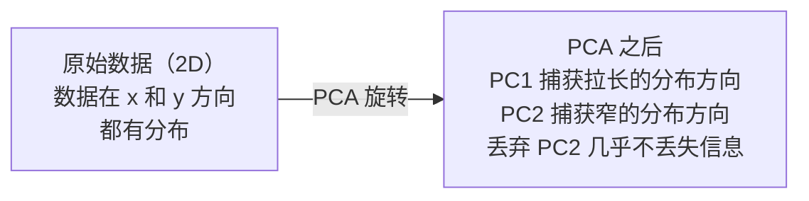

# 降维

> 高维数据有其内在结构。你只需从正确的角度观察，就能发现它。

**类型：** 构建  
**语言：** Python  
**前置要求：** 阶段1，第01课（线性代数直观理解）、第02课（向量、矩阵与运算）、第03课（特征值与特征向量）、第06课（概率与分布）  
**时间：** 约90分钟

## 学习目标

- 从零实现 PCA：中心化数据、计算协方差矩阵、特征分解、投影
- 使用解释方差比和肘部法则选择主成分的数量
- 比较 PCA、t‑SNE 和 UMAP 在 2D 中可视化 MNIST 手写数字的效果，并解释各自的权衡
- 应用带有 RBF 核的核 PCA 来分离标准 PCA 无法处理的非线性数据结构

## 问题描述

你有一个数据集，每个样本有 784 个特征。它们可能是手写数字的像素值，可能是基因表达水平，可能是用户行为信号。你无法可视化 784 维。你无法绘制它们。你甚至无法想象它们。

但是，这 784 个特征中的大部分是冗余的。实际的信息存在于一个更小的表面上。一个手写的“7”不需要 784 个独立的数字来描述。它只需要几个：笔画的倾斜角度、横杠的长度、整体偏斜程度。其余的都是噪声。

降维就是找到那个更小的表面。它将你的 784 维数据压缩到 2 维、10 维或 50 维，同时保留重要的结构信息。

## 概念讲解

### 维度灾难

高维空间违反直觉。随着维度的增长，三件事会出问题。

**距离变得无意义。** 在高维空间中，任意两个随机点之间的距离会趋向于同一个值。如果每两个点之间的距离都差不多，那么最近邻搜索就失效了。

```
维度      平均距离比（随机点之间的最大值/最小值）
2          ~5.0
10         ~1.8
100        ~1.2
1000       ~1.02
```

**体积集中在角上。** 一个 d 维的单位超立方体有 2^d 个角。在 100 维时，几乎所有的体积都集中在角上，远离中心。数据点会分散到边缘，导致模型在内部区域缺乏数据。

**你需要指数级更多的数据。** 为了在空间中维持相同的样本密度，从 2D 到 20D 意味着你需要 10^18 倍的数据。你永远不会有足够的数据。降维可以将数据密度拉回到可行的水平。

### PCA：找到重要的方向

主成分分析（Principal Component Analysis，PCA）找到数据变化最大的轴。它旋转你的坐标系，使第一个轴捕获最大方差，第二个轴捕获次大方差，依此类推。

算法：

```
1. 中心化数据        （从每个特征中减去均值）
2. 计算协方差矩阵     （特征之间如何协同变化）
3. 特征分解          （找到主方向）
4. 按特征值排序      （方差最大的优先）
5. 投影             （保留前 k 个特征向量，丢弃其余）
```

为什么要做特征分解？协方差矩阵是对称且半正定的。其特征向量是特征空间中的正交方向。特征值告诉你每个方向捕获了多少方差。具有最大特征值的特征向量指向方差最大的方向。



- **PCA 之前：** 数据云在 x 轴和 y 轴上呈对角线分布
- **PCA 之后：** 坐标系被旋转，使得 PC1 对齐最大方差方向（拉长的分布），PC2 对齐最小方差方向（窄的分布）
- **降维：** 丢弃 PC2，将数据投影到 PC1 上，损失的信息很少

### 解释方差比

每个主成分捕获总方差的一部分。解释方差比告诉你这个比例。

```
成分       特征值      解释方差比    累计解释方差
PC1        4.73        0.473         0.473
PC2        2.51        0.251         0.724
PC3        1.12        0.112         0.836
PC4        0.89        0.089         0.925
...
```

当累计解释方差达到 0.95 时，你就知道前若干个成分捕获了 95% 的信息。之后的基本上都是噪声。

### 选择成分数量

三种策略：

1. **阈值法。** 保留足够多的成分以解释 90-95% 的方差。
2. **肘部法则。** 绘制每个成分的解释方差。寻找一个急剧下降的点。
3. **下游性能。** 将 PCA 作为预处理步骤。扫描不同的 k，测量模型的准确率。最好的 k 出现在准确率趋于平稳的地方。

### t-SNE：保留邻域关系

t-分布随机邻域嵌入（t-Distributed Stochastic Neighbor Embedding，t-SNE）是为可视化而设计的。它将高维数据映射到 2D（或 3D），同时保留哪些点彼此靠近的信息。

直觉：在原始空间中，基于点之间的距离计算点对之间的概率分布。相近的点获得高概率，远离的点获得低概率。然后找到一个 2D 布局，使得相同的概率分布成立。在 784 维空间中相邻的点，在 2D 中也相邻。

t-SNE 的关键性质：
- 非线性。它可以展开 PCA 无法处理的复杂流形。
- 随机性。不同的运行会产生不同的布局。
- 困惑度参数控制考虑多少邻居（典型范围：5-50）。
- 输出中簇之间的距离没有意义。只有簇本身有意义。
- 在大数据集上较慢。默认 O(n²)。

### UMAP：更快、更好的全局结构

统一流形近似与投影（Uniform Manifold Approximation and Projection，UMAP）工作原理类似于 t-SNE，但有两个优点：
- 更快。它使用近似最近邻图，而不是计算所有成对距离。
- 更好的全局结构。输出中簇的相对位置通常比 t-SNE 更有意义。

UMAP 在高维空间中构建一个加权图（“模糊拓扑表示”），然后找到一个低维布局，尽可能好地保留这个图。

关键参数：
- `n_neighbors`：定义局部结构的邻居数量（类似于困惑度）。较大的值保留更多全局结构。
- `min_dist`：输出中点之间堆积的紧密程度。较低的值会产生更密集的簇。

### 何时使用哪种方法

| 方法 | 使用场景 | 保留的内容 | 速度 |
|------|----------|-----------|------|
| PCA | 训练前的预处理 | 全局方差 | 快速（精确），可处理百万样本 |
| PCA | 快速探索性可视化 | 线性结构 | 快速 |
| t-SNE | 出版质量的 2D 图 | 局部邻域 | 慢（理想情况 < 1 万样本）|
| UMAP | 大规模 2D 可视化 | 局部 + 部分全局结构 | 中等（可处理百万级）|
| PCA | 为模型做特征缩减 | 按方差排序的特征 | 快速 |
| t-SNE / UMAP | 理解簇结构 | 簇分离 | 中等到慢 |

经验法则：预处理和数据压缩用 PCA。需要在 2D 中可视化结构时用 t-SNE 或 UMAP。

### 核 PCA

标准 PCA 寻找线性子空间。它旋转坐标系并丢弃一些轴。但如果数据位于一个非线性流形上呢？2D 中的一个圆形不能被任何直线分离。标准 PCA 对此无能为力。

核 PCA 在核函数诱导的高维特征空间中应用 PCA，而无需显式计算该空间中的坐标。这就是核技巧——与支持向量机（SVM）背后的思想相同。

算法：
1. 计算核矩阵 K，其中 K_ij = k(x_i, x_j)
2. 在特征空间中对核矩阵进行中心化
3. 对中心化后的核矩阵进行特征分解
4. 将前几个特征向量（按 1/sqrt(特征值) 缩放）作为投影结果

常用的核函数：

| 核函数 | 公式 | 适用场景 |
|--------|------|----------|
| RBF（高斯） | exp(-gamma * \|\|x - y\|\|^2) | 大多数非线性数据，光滑流形 |
| 多项式 | (x . y + c)^d | 多项式关系 |
| Sigmoid | tanh(alpha * x . y + c) | 类似神经网络的映射 |

何时使用核 PCA vs 标准 PCA：

| 准则 | 标准 PCA | 核 PCA |
|------|---------|--------|
| 数据结构 | 线性子空间 | 非线性流形 |
| 速度 | O(min(n² d, d² n)) | O(n² d + n³) |
| 可解释性 | 成分是特征的线性组合 | 成分缺乏直接的特征解释 |
| 可扩展性 | 可处理百万样本 | 核矩阵是 n×n，受内存限制 |
| 重构 | 直接逆变换 | 需要预像近似 |

经典示例：2D 中的同心圆。两层点，一个圆环套在另一个内部。标准 PCA 会将两者投影到同一条直线上——对分类毫无用处。使用 RBF 核的核 PCA 会将内圆和外圆映射到不同的区域，使它们线性可分。

### 重构误差

你的降维效果如何？你将 784 维压缩到了 50 维。你损失了什么？

测量重构误差：
1. 将数据投影到 k 维：X_reduced = X @ W_k
2. 重构：X_hat = X_reduced @ W_k^T
3. 计算均方误差：mean((X - X_hat)^2)

对于 PCA，重构误差与解释方差有简洁的关系：

```
重构误差 = 未包含的特征值之和
总方差 = 所有特征值之和
损失比例 = (丢弃的特征值之和) / (所有特征值之和)
```

每个成分的解释方差比为：

```
解释方差比_k = 特征值_k / 所有特征值之和
```

绘制累计解释方差与成分数量的关系曲线，你会得到“肘部”曲线。合适的成分数量通常出现在：
- 曲线变平（收益递减）
- 累计方差超过你的阈值（通常为 0.90 或 0.95）
- 下游任务性能趋于平稳

重构误差在确定 k 之外也很有用。你可以用它来做异常检测：重构误差高的样本是不符合所学子空间的离群点。这是生产系统中基于 PCA 的异常检测的基础。

## 动手实现

### 步骤 1：从零实现 PCA

```python
import numpy as np

class PCA:
    def __init__(self, n_components):
        self.n_components = n_components
        self.components = None
        self.mean = None
        self.eigenvalues = None
        self.explained_variance_ratio_ = None

    def fit(self, X):
        self.mean = np.mean(X, axis=0)
        X_centered = X - self.mean

        cov_matrix = np.cov(X_centered, rowvar=False)

        eigenvalues, eigenvectors = np.linalg.eigh(cov_matrix)

        sorted_idx = np.argsort(eigenvalues)[::-1]
        eigenvalues = eigenvalues[sorted_idx]
        eigenvectors = eigenvectors[:, sorted_idx]

        self.components = eigenvectors[:, :self.n_components].T
        self.eigenvalues = eigenvalues[:self.n_components]
        total_var = np.sum(eigenvalues)
        self.explained_variance_ratio_ = self.eigenvalues / total_var

        return self

    def transform(self, X):
        X_centered = X - self.mean
        return X_centered @ self.components.T

    def fit_transform(self, X):
        self.fit(X)
        return self.transform(X)
```

### 步骤 2：在合成数据上测试

```python
np.random.seed(42)
n_samples = 500

t = np.random.uniform(0, 2 * np.pi, n_samples)
x1 = 3 * np.cos(t) + np.random.normal(0, 0.2, n_samples)
x2 = 3 * np.sin(t) + np.random.normal(0, 0.2, n_samples)
x3 = 0.5 * x1 + 0.3 * x2 + np.random.normal(0, 0.1, n_samples)

X_synthetic = np.column_stack([x1, x2, x3])

pca = PCA(n_components=2)
X_reduced = pca.fit_transform(X_synthetic)

print(f"原始形状: {X_synthetic.shape}")
print(f"降维后形状:  {X_reduced.shape}")
print(f"解释方差比: {pca.explained_variance_ratio_}")
print(f"累计捕获方差: {sum(pca.explained_variance_ratio_):.4f}")
```

### 步骤 3：将 MNIST 手写数字降到 2D

```python
from sklearn.datasets import fetch_openml

mnist = fetch_openml("mnist_784", version=1, as_frame=False, parser="auto")
X_mnist = mnist.data[:5000].astype(float)
y_mnist = mnist.target[:5000].astype(int)

pca_mnist = PCA(n_components=50)
X_pca50 = pca_mnist.fit_transform(X_mnist)
print(f"50 个成分捕获了 {sum(pca_mnist.explained_variance_ratio_):.2%} 的方差")

pca_2d = PCA(n_components=2)
X_pca2d = pca_2d.fit_transform(X_mnist)
print(f"2 个成分捕获了 {sum(pca_2d.explained_variance_ratio_):.2%} 的方差")
```

### 步骤 4：与 scikit‑learn 对比

```python
from sklearn.decomposition import PCA as SklearnPCA
from sklearn.manifold import TSNE

sklearn_pca = SklearnPCA(n_components=2)
X_sklearn_pca = sklearn_pca.fit_transform(X_mnist)

print(f"\n我们的 PCA 解释方差:     {pca_2d.explained_variance_ratio_}")
print(f"Sklearn PCA 解释方差: {sklearn_pca.explained_variance_ratio_}")

diff = np.abs(np.abs(X_pca2d) - np.abs(X_sklearn_pca))
print(f"最大绝对差值: {diff.max():.10f}")

tsne = TSNE(n_components=2, perplexity=30, random_state=42)
X_tsne = tsne.fit_transform(X_mnist)
print(f"\nt-SNE 输出形状: {X_tsne.shape}")
```

### 步骤 5：UMAP 对比

```python
try:
    from umap import UMAP

    reducer = UMAP(n_components=2, n_neighbors=15, min_dist=0.1, random_state=42)
    X_umap = reducer.fit_transform(X_mnist)
    print(f"UMAP 输出形状: {X_umap.shape}")
except ImportError:
    print("请安装 umap-learn: pip install umap-learn")
```

## 使用示例

将 PCA 用作分类器之前的预处理：

```python
from sklearn.decomposition import PCA as SklearnPCA
from sklearn.linear_model import LogisticRegression
from sklearn.model_selection import train_test_split
from sklearn.metrics import accuracy_score

X_train, X_test, y_train, y_test = train_test_split(
    X_mnist, y_mnist, test_size=0.2, random_state=42
)

results = {}
for k in [10, 30, 50, 100, 200]:
    pca_k = SklearnPCA(n_components=k)
    X_tr = pca_k.fit_transform(X_train)
    X_te = pca_k.transform(X_test)

    clf = LogisticRegression(max_iter=1000, random_state=42)
    clf.fit(X_tr, y_train)
    acc = accuracy_score(y_test, clf.predict(X_te))
    var_captured = sum(pca_k.explained_variance_ratio_)
    results[k] = (acc, var_captured)
    print(f"k={k:>3d}  准确率={acc:.4f}  捕获方差={var_captured:.4f}")
```

性能在远低于 784 维时就趋于平稳。那个平稳点就是你的操作点。

## 交付成果

本课程产出：
- `outputs/skill-dimensionality-reduction.md` —— 用于为给定任务选择合适的降维技术的技能

## 练习

1. 修改 PCA 类以支持 `inverse_transform`。分别用 10、50 和 200 个成分重构 MNIST 数字。打印每种情况下的重构误差（与原始图像的均方差异）。

2. 在相同的 MNIST 子集上运行 t-SNE，分别使用困惑度 5、30 和 100。描述输出如何变化。为什么困惑度会影响簇的紧密程度？

3. 取一个具有 50 个特征但只有 5 个特征包含信息的数据集（使用 `sklearn.datasets.make_classification` 生成）。应用 PCA，并检查解释方差曲线是否正确表明数据实际上是 5 维的。

## 关键术语

| 术语 | 人们常说的 | 实际含义 |
|------|-----------|----------|
| 维度灾难 | “特征太多” | 随着维度增加，距离、体积和数据密度都会出现反直觉的行为。模型需要指数级更多的数据来补偿。 |
| PCA | “降维” | 旋转坐标系，使坐标轴与最大方差方向对齐，然后丢弃低方差的轴。 |
| 主成分 | “一个重要的方向” | 协方差矩阵的特征向量。特征空间中数据变化最大的方向。 |
| 解释方差比 | “这个成分包含多少信息” | 单个主成分捕获的总方差的比例。累加前 k 个比例可以看到 k 个成分保留了多少信息。 |
| 协方差矩阵 | “特征之间如何相关” | 一个对称矩阵，其 (i, j) 元素衡量特征 i 和特征 j 如何共同变化。对角线元素是各自的方差。 |
| t-SNE | “那种聚类图” | 一种非线性方法，通过保留成对邻域概率将高维数据映射到 2D。适用于可视化，不适用于预处理。 |
| UMAP | “更快的 t-SNE” | 一种基于拓扑数据分析的非线性方法。既保留局部结构，也保留部分全局结构。可扩展性优于 t-SNE。 |
| 困惑度 | “t-SNE 的一个旋钮” | 控制每个点考虑的有效邻居数量。低困惑度专注于非常局部的结构。高困惑度捕捉更广泛的模式。 |
| 流形 | “数据所在的曲面” | 嵌入在高维空间中的一个低维曲面。一张在 3D 中被揉皱的纸就是一个 2D 流形。 |

## 延伸阅读

- [主成分分析教程](https://arxiv.org/abs/1404.1100) (Shlens) —— 从零开始的清晰 PCA 推导
- [如何有效使用 t-SNE](https://distill.pub/2016/misread-tsne/) (Wattenberg 等人) —— 关于 t-SNE 陷阱和参数选择的交互式指南
- [UMAP 文档](https://umap-learn.readthedocs.io/) —— UMAP 作者提供的理论与实践指导