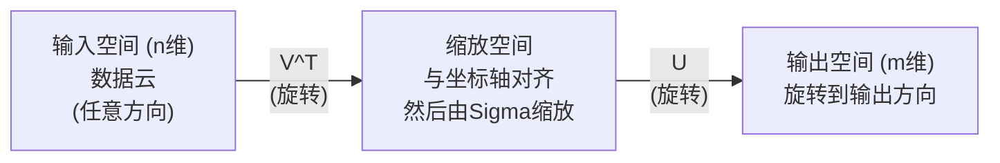
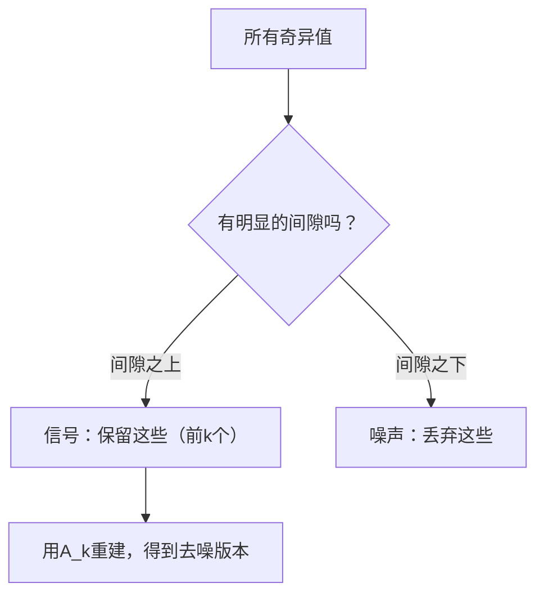

# 奇异值分解

> SVD是线性代数中的瑞士军刀。每个矩阵都有SVD。每个数据科学家都需要它。

**类型：** 构建
**语言：** Python, Julia
**前置要求：** 阶段1，第01课（线性代数直觉）、第02课（向量与矩阵运算）、第03课（矩阵变换）
**时间：** 约120分钟

## 学习目标

- 通过幂迭代实现SVD，并解释U、Sigma和V^T的几何意义
- 应用截断SVD进行图像压缩，并衡量压缩比与重建误差
- 通过SVD计算Moore-Penrose伪逆，求解超定的最小二乘系统
- 将SVD与主成分分析、推荐系统（潜在因子）以及自然语言处理中的潜在语义分析联系起来

## 问题描述

你有一个1000x2000的矩阵。它可能是用户-电影评分矩阵。它可能是文档-词频表。它可能是一幅图像的像素值。你需要压缩它、去噪、发现隐藏结构，或者用它求解最小二乘系统。特征分解只适用于方阵。即使如此，它还需要矩阵有完整的线性无关特征向量集。

SVD适用于任何矩阵。任何形状。任何秩。没有条件。它将矩阵分解为三个因子，揭示了矩阵对空间作用的几何本质。它是整个线性代数中最通用、最有用的分解。

## 核心概念

### SVD的几何意义

每个矩阵，无论形状如何，都执行三个操作：旋转、缩放、旋转。SVD将这一分解显式地表达出来。

```
A = U * Sigma * V^T

      m x n     m x m    m x n    n x n
     （任意）   （旋转）  （缩放）  （旋转）
```

给定任意矩阵A，SVD将其分解为：
- V^T 在输入空间（n维）中旋转向量
- Sigma 沿每个轴进行缩放（拉伸或压缩）
- U 将结果旋转到输出空间（m维）



这样理解：你把一个矩阵交给SVD。它会告诉你："这个矩阵首先通过V^T旋转一个输入球体，然后通过Sigma将其拉伸成一个椭球体，最后通过U旋转这个椭球体。" 奇异值就是椭球体各轴的长度。

### 完整分解

对于一个形状为m x n的矩阵A：

```
A = U * Sigma * V^T

其中：
  U    是 m x m 的正交矩阵（U^T U = I）
  Sigma 是 m x n 的对角矩阵（奇异值在对角线上）
  V    是 n x n 的正交矩阵（V^T V = I）

奇异值 sigma_1 >= sigma_2 >= ... >= sigma_r > 0
其中 r = rank(A)（矩阵的秩）
```

U的列称为左奇异向量。V的列称为右奇异向量。Sigma的对角线元素称为奇异值。它们总是非负的，并按惯例降序排列。

### 左奇异向量、奇异值、右奇异向量

SVD的每个分量都有不同的几何意义。

**右奇异向量（V的列）：** 这些向量构成输入空间（R^n）的标准正交基。它们是输入空间中那些被矩阵映射到输出空间中正交方向的方向。可以把它们看作定义域的"自然坐标系"。

**奇异值（Sigma的对角线）：** 这些是缩放因子。第i个奇异值告诉你矩阵沿第i个右奇异方向拉伸向量的程度。奇异值为零意味着矩阵将该方向完全压扁。

**左奇异向量（U的列）：** 这些向量构成输出空间（R^m）的标准正交基。第i个左奇异向量是第i个右奇异向量（经过缩放后）所落到的输出方向。

它们之间的关系：

```
A * v_i = sigma_i * u_i

矩阵A将第i个右奇异向量 v_i 取出，
按 sigma_i 缩放，然后映射到第i个左奇异向量 u_i。
```

这给出了矩阵作用的逐坐标图像。

### 外积形式

SVD可以写成一系列秩1矩阵的和：

```
A = sigma_1 * u_1 * v_1^T + sigma_2 * u_2 * v_2^T + ... + sigma_r * u_r * v_r^T

每一项 sigma_i * u_i * v_i^T 是一个秩1矩阵（外积）。
整个矩阵是r个这样的矩阵的和，其中r是矩阵的秩。
```

这种形式是低秩近似的基础。每一项增加一层结构。第一项捕获最重要的单一模式。第二项捕获次重要的模式，以此类推。截断这个和，就能得到任意秩下的最佳可能近似。

```
秩1近似：     A_1 = sigma_1 * u_1 * v_1^T
              （捕获主要模式）

秩2近似：     A_2 = sigma_1 * u_1 * v_1^T + sigma_2 * u_2 * v_2^T
              （捕获两个最重要的模式）

秩k近似：     A_k = 前k项的和
              （由Eckart-Young定理保证的最优性）
```

### 与特征分解的关系

SVD与特征分解有着深刻的联系。A的奇异值和奇异向量直接来自A^T A和A A^T的特征值和特征向量。

```
A^T A = V * Sigma^T * U^T * U * Sigma * V^T
      = V * Sigma^T * Sigma * V^T
      = V * D * V^T

其中 D = Sigma^T * Sigma 是对角矩阵，对角线元素为 sigma_i^2。

因此：
- 右奇异向量（V）是A^T A的特征向量
- 奇异值的平方（sigma_i^2）是A^T A的特征值

类似地：
A A^T = U * Sigma * V^T * V * Sigma^T * U^T
      = U * Sigma * Sigma^T * U^T

因此：
- 左奇异向量（U）是A A^T的特征向量
- A A^T的特征值也是 sigma_i^2
```

这个联系告诉我们三件事：
1. 奇异值总是实数且非负（它们是半正定矩阵特征值的平方根）。
2. 你可以通过对A^T A进行特征分解来计算SVD，但这会使条件数平方，损失数值精度。专用的SVD算法避免了这一点。
3. 当A是对称半正定方阵时，SVD和特征分解是相同的。

### 截断SVD：低秩近似

Eckart-Young-Mirsky定理指出，对A的最佳秩k近似（在Frobenius范数和谱范数下）是通过只保留前k个最大的奇异值及其对应的向量得到的：

```
A_k = U_k * Sigma_k * V_k^T

其中：
  U_k     是 m x k（U的前k列）
  Sigma_k 是 k x k（Sigma的左上角k x k子块）
  V_k     是 n x k（V的前k列）

近似误差 = sigma_{k+1}  （谱范数下）
         = sqrt(sigma_{k+1}^2 + ... + sigma_r^2)  （Frobenius范数下）
```

这不仅是一个"好的"近似。它是秩k条件下可证明的最佳近似。没有其他秩k矩阵能比它更接近A。

| 分量 | 相对大小 | 在秩3近似中是否保留？ |
|------|----------|----------------------|
| sigma_1 | 最大 | 是 |
| sigma_2 | 很大 | 是 |
| sigma_3 | 中偏大 | 是 |
| sigma_4 | 中等 | 否（误差） |
| sigma_5 | 中偏小 | 否（误差） |
| sigma_6 | 小 | 否（误差） |
| sigma_7 | 非常小 | 否（误差） |
| sigma_8 | 极小 | 否（误差） |

保留前3个：A_3 捕获三个最大的奇异值。误差 = 剩余的值（sigma_4 到 sigma_8）。

如果奇异值衰减很快，那么一个小的k就能捕获矩阵的大部分信息。如果衰减很慢，说明矩阵没有低秩结构。

### 用SVD进行图像压缩

一幅灰度图像就是一个像素强度矩阵。一张800x600的图像有480,000个数值。SVD可以用少得多的数值来近似它。

```
原始图像：800 x 600 = 480,000 个数值

SVD 秩k：
  U_k:      800 x k 个数值
  Sigma_k:  k 个数值
  V_k:      600 x k 个数值
  总计：    k * (800 + 600 + 1) = k * 1401 个数值

  k=10:   14,010 个数值  （原始数据的2.9%）
  k=50:   70,050 个数值  （原始数据的14.6%）
  k=100: 140,100 个数值  （原始数据的29.2%）

  压缩比随着k变小而提高，
  但视觉质量会下降。
```

关键洞察：自然图像的奇异值衰减很快。前几个奇异值捕获了整体结构（形状、渐变）。后面的奇异值捕获了精细细节和噪声。截断到秩50通常能产生一幅看起来几乎与原图相同的图像，同时减少了85%的存储空间。

### 用于推荐系统的SVD

Netflix大奖赛让这个应用家喻户晓。你有一个用户-电影评分矩阵，其中大部分条目是缺失的。

```
             电影1  电影2  电影3  电影4  电影5
  用户1      [  5      ?      3      ?      1  ]
  用户2      [  ?      4      ?      2      ?  ]
  用户3      [  3      ?      5      ?      ?  ]
  用户4      [  ?      ?      ?      4      3  ]

  ? = 未知评分
```

核心思想：这个评分矩阵是低秩的。用户的口味并非完全独立。存在少数几个潜在因子（动作片 vs. 剧情片，老片 vs. 新片，理智型 vs. 情感型）可以解释大部分偏好。

对（填充后的）评分矩阵进行SVD分解为：
- U：潜在因子空间中的用户画像
- Sigma：每个潜在因子的重要性
- V^T：潜在因子空间中的电影画像

用户对某部电影的预测评分就是他们的用户画像与电影画像的点积（经奇异值加权）。低秩近似填补了缺失的条目。

在实践中，你使用像Simon Funk的增量SVD或ALS（交替最小二乘）这样的变体来直接处理缺失数据。但核心思想是一样的：通过SVD进行潜在因子分解。

### 自然语言处理中的SVD：潜在语义分析

潜在语义分析（LSA，也称LSI）将SVD应用于词项-文档矩阵。

```
             文档1  文档2  文档3  文档4
  "猫"       [  3      0      1      0  ]
  "狗"       [  2      0      0      1  ]
  "鱼"       [  0      4      1      0  ]
  "宠物"     [  1      1      1      1  ]
  "海洋"     [  0      3      0      0  ]

在进行秩k=2的SVD之后：

  每个文档变成2D"概念空间"中的一个点。
  每个词项变成同一个2D空间中的一个点。
  关于相似主题的文档会聚集在一起。
  具有相似含义的词项会聚集在一起。

  "猫"和"狗"会彼此靠近（陆地宠物）。
  "鱼"和"海洋"会彼此靠近（水相关概念）。
  如果文档1和文档3共享相似主题，它们会聚集在一起。
```

LSA是最早成功从原始文本中捕获语义相似性的方法之一。它之所以有效，是因为同义词往往出现在相似的文档中，因此SVD将它们分组到相同的潜在维度中。现代的词嵌入（Word2Vec, GloVe）可以被看作是这一思想的继承者。

### 用于降噪的SVD

噪声数据中，信号集中在前几个大的奇异值上，而噪声分布在所有奇异值上。截断可以去除噪声基底。

**干净信号的奇异值：**

| 分量 | 大小 | 类型 |
|------|------|------|
| sigma_1 | 非常大 | 信号 |
| sigma_2 | 大 | 信号 |
| sigma_3 | 中等 | 信号 |
| sigma_4 | 接近零 | 可忽略 |
| sigma_5 | 接近零 | 可忽略 |

**含噪信号的奇异值（噪声会给所有值增加分量）：**

| 分量 | 大小 | 类型 |
|------|------|------|
| sigma_1 | 非常大 | 信号 |
| sigma_2 | 大 | 信号 |
| sigma_3 | 中等 | 信号 |
| sigma_4 | 小 | 噪声 |
| sigma_5 | 小 | 噪声 |
| sigma_6 | 小 | 噪声 |
| sigma_7 | 小 | 噪声 |



这用于信号处理、科学测量和数据清洗。任何时候，如果你有一个被加性噪声污染的矩阵，截断SVD就是一种从噪声中分离信号的原则性方法。

### 通过SVD计算伪逆

Moore-Penrose伪逆A+将逆矩阵的概念推广到非方阵和奇异矩阵。SVD使其计算变得简单。

```
如果 A = U * Sigma * V^T，那么：

A+ = V * Sigma+ * U^T

其中 Sigma+ 是这样形成的：
  1. 转置 Sigma（交换行和列）
  2. 将每个非零对角线元素 sigma_i 替换为 1/sigma_i
  3. 零保持为零

对于 A (m x n)：      A+ 是 (n x m)
对于 Sigma (m x n)：  Sigma+ 是 (n x m)
```

伪逆用于求解最小二乘问题。如果Ax = b没有精确解（超定系统），那么x = A+ b就是最小二乘解（最小化 ||Ax - b||）。

```
超定系统（方程个数多于未知数个数）：

  [1  1]         [3]
  [2  1] x   =   [5]       没有精确解。
  [3  1]         [6]

  x_ls = A+ b = V * Sigma+ * U^T * b

  这给出了使残差平方和最小的x。
  结果与正规方程 (A^T A)^(-1) A^T b 相同，
  但数值上更稳定。
```

### 数值稳定性优势

计算A^T A的特征分解会使奇异值平方（A^T A的特征值是sigma_i^2）。这会使条件数平方，放大数值误差。

```
示例：
  A 的奇异值为 [1000, 1, 0.001]
  A 的条件数：1000 / 0.001 = 10^6

  A^T A 的特征值为 [10^6, 1, 10^{-6}]
  A^T A 的条件数：10^6 / 10^{-6} = 10^{12}

  直接计算SVD：处理条件数 10^6
  通过 A^T A 计算：处理条件数 10^{12}
                           （损失6位额外精度）
```

现代SVD算法（Golub-Kahan双对角化）直接对A进行操作，从不显式形成A^T A。这就是为什么你总是应该优先使用 `np.linalg.svd(A)` 而不是 `np.linalg.eig(A.T @ A)`。

### 与主成分分析的联系

PCA就是中心化数据上的SVD。这不是一个类比。它们在字面意义上是相同的计算。

```
给定数据矩阵 X（n_samples x n_features），已中心化（减去均值）：

协方差矩阵：C = (1/(n-1)) * X^T X

PCA 寻找 C 的特征向量。但是：

  X = U * Sigma * V^T    （X的SVD）

  X^T X = V * Sigma^2 * V^T

  C = (1/(n-1)) * V * Sigma^2 * V^T

因此，主成分正好就是右奇异向量 V。
每个成分的解释方差是 sigma_i^2 / (n-1)。

在 sklearn 中，PCA 就是使用 SVD 实现的，而不是特征分解。
它更快，数值更稳定。
```

这意味着你在第10课学到的关于降维的一切，本质上都是SVD在起作用。PCA是机器学习中SVD最常见的应用。

## 动手实现

### 步骤1：使用幂迭代从零实现SVD

思路：为了找到最大的奇异值及其向量，对A^T A（或A A^T）使用幂迭代。然后对矩阵进行"收缩"（deflate），重复此过程以找到下一个奇异值。

```python
import numpy as np

def power_iteration(M, num_iters=100):
    n = M.shape[1]
    v = np.random.randn(n)
    v = v / np.linalg.norm(v)

    for _ in range(num_iters):
        Mv = M @ v
        v = Mv / np.linalg.norm(Mv)

    eigenvalue = v @ M @ v
    return eigenvalue, v

def svd_from_scratch(A, k=None):
    m, n = A.shape
    if k is None:
        k = min(m, n)

    sigmas = []
    us = []
    vs = []

    A_residual = A.copy().astype(float)

    for _ in range(k):
        AtA = A_residual.T @ A_residual
        eigenvalue, v = power_iteration(AtA, num_iters=200)

        if eigenvalue < 1e-10:
            break

        sigma = np.sqrt(eigenvalue)
        u = A_residual @ v / sigma

        sigmas.append(sigma)
        us.append(u)
        vs.append(v)

        A_residual = A_residual - sigma * np.outer(u, v)

    U = np.column_stack(us) if us else np.empty((m, 0))
    S = np.array(sigmas)
    V = np.column_stack(vs) if vs else np.empty((n, 0))

    return U, S, V
```

### 步骤2：测试并与NumPy比较

```python
np.random.seed(42)
A = np.random.randn(5, 4)

U_ours, S_ours, V_ours = svd_from_scratch(A)
U_np, S_np, Vt_np = np.linalg.svd(A, full_matrices=False)

print("Our singular values:", np.round(S_ours, 4))
print("NumPy singular values:", np.round(S_np, 4))

A_reconstructed = U_ours @ np.diag(S_ours) @ V_ours.T
print(f"Reconstruction error: {np.linalg.norm(A - A_reconstructed):.8f}")
```

### 步骤3：图像压缩演示

```python
def compress_image_svd(image_matrix, k):
    U, S, Vt = np.linalg.svd(image_matrix, full_matrices=False)
    compressed = U[:, :k] @ np.diag(S[:k]) @ Vt[:k, :]
    return compressed

image = np.random.seed(42)
rows, cols = 200, 300
image = np.random.randn(rows, cols)

for k in [1, 5, 10, 20, 50]:
    compressed = compress_image_svd(image, k)
    error = np.linalg.norm(image - compressed) / np.linalg.norm(image)
    original_size = rows * cols
    compressed_size = k * (rows + cols + 1)
    ratio = compressed_size / original_size
    print(f"k={k:>3d}  error={error:.4f}  storage={ratio:.1%}")
```

### 步骤4：降噪

```python
np.random.seed(42)
clean = np.outer(np.sin(np.linspace(0, 4*np.pi, 100)),
                 np.cos(np.linspace(0, 2*np.pi, 80)))
noise = 0.3 * np.random.randn(100, 80)
noisy = clean + noise

U, S, Vt = np.linalg.svd(noisy, full_matrices=False)
denoised = U[:, :5] @ np.diag(S[:5]) @ Vt[:5, :]

print(f"Noisy error:    {np.linalg.norm(noisy - clean):.4f}")
print(f"Denoised error: {np.linalg.norm(denoised - clean):.4f}")
print(f"Improvement:    {(1 - np.linalg.norm(denoised - clean) / np.linalg.norm(noisy - clean)):.1%}")
```

### 步骤5：伪逆

```python
A = np.array([[1, 1], [2, 1], [3, 1]], dtype=float)
b = np.array([3, 5, 6], dtype=float)

U, S, Vt = np.linalg.svd(A, full_matrices=False)
S_inv = np.diag(1.0 / S)
A_pinv = Vt.T @ S_inv @ U.T

x_svd = A_pinv @ b
x_lstsq = np.linalg.lstsq(A, b, rcond=None)[0]
x_pinv = np.linalg.pinv(A) @ b

print(f"SVD pseudoinverse solution:  {x_svd}")
print(f"np.linalg.lstsq solution:   {x_lstsq}")
print(f"np.linalg.pinv solution:    {x_pinv}")
```

## 使用它

完整的演示代码在 `code/svd.py` 中。运行它可以看到SVD应用于图像压缩、推荐系统、潜在语义分析和降噪。

```bash
python svd.py
```

Julia版本在 `code/svd.jl` 中，演示了使用Julia原生的 `svd()` 函数和 `LinearAlgebra` 包实现相同的概念。

```bash
julia svd.jl
```

## 交付成果

本课程产出：
- `outputs/skill-svd.md` - 关于何时以及如何在真实项目中使用SVD的技能文档

## 练习

1. 不使用幂迭代，从头实现完整的SVD。相反，计算A^T A的特征分解以获得V和奇异值，然后计算U = A V Sigma^{-1}。将数值精度与你的幂迭代版本以及NumPy进行比较。

2. 加载一张真实的灰度图像（或转换一张为灰度图）。在秩为1, 5, 10, 25, 50, 100时对其进行压缩。对每个秩，计算压缩比和相对误差。找到图像在视觉上变得可接受的秩。

3. 构建一个微型的推荐系统。创建一个10x8的用户-电影评分矩阵，其中包含一些已知条目。用行均值填充缺失条目。计算SVD并重建一个秩3近似。使用重建的矩阵来预测缺失的评分。验证预测是否合理。

4. 创建一个100x50的文档-词项矩阵，包含3个合成主题。每个主题关联5个词项。添加噪声。应用SVD，验证前3个奇异值远大于其余的值。将文档投影到3D潜在空间中，并检查来自同一主题的文档是否聚集在一起。

5. 生成一个干净的、低秩的矩阵（秩3，大小50x40），并添加不同级别的高斯噪声（sigma = 0.1, 0.5, 1.0, 2.0）。对每个噪声级别，通过扫描k从1到40并测量相对于干净矩阵的重建误差，找到最优的截断秩。绘制最优k随噪声水平变化的曲线。

## 关键术语

| 术语 | 人们常说的 | 实际含义 |
|------|----------------|----------------------|
| SVD | "分解任何矩阵" | 将A分解为U Sigma V^T，其中U和V是正交矩阵，Sigma是对角矩阵且对角线元素非负。适用于任何形状的矩阵。 |
| 奇异值 | "这个分量有多重要" | Sigma的第i个对角线元素。衡量矩阵沿第i个主方向拉伸的程度。总是非负，按降序排列。 |
| 左奇异向量 | "输出方向" | U的一列。第i个右奇异向量（经sigma_i缩放后）映射到的输出空间方向。 |
| 右奇异向量 | "输入方向" | V的一列。输入空间中，被矩阵映射到第i个左奇异向量（经sigma_i缩放后）的方向。 |
| 截断SVD | "低秩近似" | 只保留前k个奇异值及其对应的向量。产生对原始矩阵的最佳秩k近似（Eckart-Young定理）。 |
| 秩 | "真正的维度数" | 非零奇异值的个数。告诉您矩阵实际使用的独立方向的数量。 |
| 伪逆 | "广义逆" | V Sigma+ U^T。对非零奇异值取倒数，零保持为零。用于求解非方阵或奇异矩阵的最小二乘问题。 |
| 条件数 | "对误差的敏感度" | sigma_max / sigma_min。大的条件数意味着小的输入变化会导致大的输出变化。SVD直接揭示了这一点。 |
| 潜在因子 | "隐藏变量" | SVD发现的低秩空间中的一个维度。在推荐系统中，一个潜在因子可能对应一种类型偏好。在NLP中，它可能对应一个主题。 |
| Frobenius范数 | "矩阵的总大小" | 所有条目平方和的平方根。等于所有奇异值平方和的平方根。用于衡量近似误差。 |
| Eckart-Young定理 | "SVD给出最佳压缩" | 对于任何目标秩k，截断SVD在所有可能的秩k矩阵中最小化近似误差。 |
| 幂迭代 | "找到最大的特征向量" | 将一个随机向量反复乘以矩阵并归一化。收敛到最大特征值对应的特征向量。许多SVD算法的构建块。 |

## 延伸阅读

- [Gilbert Strang: 线性代数及其应用，第7章](https://math.mit.edu/~gs/linearalgebra/) - 对SVD及其应用的深入讲解
- [3Blue1Brown: 但是SVD到底是什么？](https://www.youtube.com/watch?v=vSczTbgc8Rc) - SVD的几何直觉
- [我们推荐奇异值分解](https://www.ams.org/publicoutreach/feature-column/fcarc-svd) - 美国数学学会的通俗概述
- [Netflix大奖赛与矩阵分解](https://sifter.org/~simon/journal/20061211.html) - Simon Funk关于推荐系统中SVD的原始博文
- [潜在语义分析](https://en.wikipedia.org/wiki/Latent_semantic_analysis) - SVD在NLP中的原始应用
- [Trefethen and Bau 数值线性代数](https://people.maths.ox.ac.uk/trefethen/text.html) - 理解SVD算法及其数值特性的黄金标准