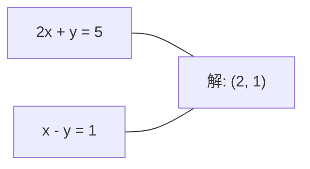
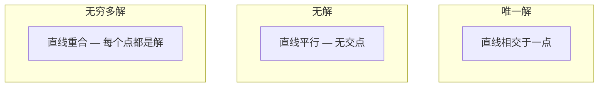

# 线性系统

> 求解 Ax = b 是数学中最古老的问题，至今仍在驱动着你的神经网络运行。

**类型：** 构建
**语言：** Python
**先修知识：** 第一阶段，第01课（线性代数直觉）、第02课（向量与矩阵）、第03课（矩阵变换）
**时间：** 约120分钟

## 学习目标

- 使用带部分主元的高斯消去法和回代法求解 Ax = b
- 使用 LU、QR 和 Cholesky 分解对矩阵进行分解，并解释每种方法的适用场景
- 推导最小二乘法的正规方程，并将其与线性回归和岭回归联系起来
- 使用条件数诊断病态系统，并应用正则化使其稳定

## 问题描述

每次你训练一个线性回归模型，就是在求解一个线性系统。每次你计算一个最小二乘拟合，也是在求解一个线性系统。每次神经网络层计算 `y = Wx + b`，它都在评估一个线性系统的一边。当你添加正则化时，你是在修改这个系统。当你使用高斯过程时，你在分解一个矩阵。当你为了计算马氏距离而求协方差矩阵的逆时，你在求解一个线性系统。

方程 Ax = b 无处不在。A 是已知系数的矩阵，b 是已知输出的向量，x 是你想要求解的未知数向量。在线性回归中，A 是你的数据矩阵，b 是你的目标向量，而 x 是权重向量。整个模型归结为：找到 x，使得 Ax 尽可能接近 b。

本课程将从零开始构建求解该方程的每一种主要方法。你将理解为什么某些方法速度快而另一些方法稳定性好，为什么某些方法仅适用于方阵系统而另一些可以处理超定系统，以及为什么矩阵的条件数决定了你的解是否有意义。

## 核心概念

### Ax = b 的几何意义

一个线性方程组具有几何解释。每个方程定义了一个超平面。解是所有超平面相交的点（或点集）。

```
2x + y = 5          二维空间中的两条直线。
x - y  = 1          它们在 x=2, y=1 处相交。
```



可能发生三种情况：



在矩阵形式中，"唯一解"意味着 A 可逆。"无解"意味着系统不一致（不相容）。"无穷多解"意味着 A 存在零空间。大多数机器学习问题属于"无确切解"的类别，因为你的方程（数据点）比未知数（参数）多。这就是最小二乘法发挥作用的地方。

### 行视角与列视角

有两种理解 Ax = b 的方式。

**行视角：** A 的每一行定义了一个方程，每个方程是一个超平面。解是所有超平面的交点。

**列视角：** A 的每一列是一个向量。问题转化为：A 的列向量的什么线性组合可以产生 b？

```
A = | 2  1 |    b = | 5 |
    | 1 -1 |        | 1 |

行视角：同时求解 2x + y = 5 和 x - y = 1。

列视角：找到 x1, x2 使得：
  x1 * [2, 1] + x2 * [1, -1] = [5, 1]
  2 * [2, 1] + 1 * [1, -1] = [4+1, 2-1] = [5, 1]   验证通过。
```

列视角更为根本。如果 b 位于 A 的列空间中，系统就有解。如果 b 不在其中，你就在列空间中寻找最接近的点。这个最接近的点就是最小二乘解。

### 高斯消去法

高斯消去法将 Ax = b 转化为一个上三角系统 Ux = c，然后通过回代求解。这是最直接的方法。

算法：

```
1. 对于每一列 k（主元列）：
   a. 在第 k 列中，找到第 k 行及以下行中绝对值最大的元素（部分主元）。
   b. 将该行与第 k 行交换。
   c. 对于第 k 行以下的每一行 i：
      - 计算乘数 m = A[i][k] / A[k][k]
      - 从第 i 行减去 m 乘以第 k 行。
2. 回代：从最后一个方程开始向上求解。
```

示例：

```
原始矩阵：
| 2  1  1 | 8 |       第2行 = 第2行 - (2)*第1行     | 2  1   1 |  8 |
| 4  3  3 |20 |  -->  第3行 = 第3行 - (1)*第1行 --> | 0  1   1 |  4 |
| 2  3  1 |12 |                                     | 0  2   0 |  4 |

                       第3行 = 第3行 - (2)*第2行     | 2  1   1 |  8 |
                                                --> | 0  1   1 |  4 |
                                                    | 0  0  -2 | -4 |

回代：
  -2 * x3 = -4    -->  x3 = 2
  x2 + 2  = 4     -->  x2 = 2
  2*x1 + 2 + 2 = 8 --> x1 = 2
```

高斯消去法的计算复杂度为 O(n³)。对于一个 1000x1000 的系统，这大约是十亿次浮点运算。速度很快，但如果需要求解多个具有相同 A 的系统，你可以做得更好。

### 部分主元：为什么它很重要

没有主元选择，高斯消去法可能会失败或产生垃圾结果。如果主元元素为零，你会除以零。如果它很小，你会放大舍入误差。

```
糟糕的主元：                        使用部分主元：
| 0.001  1 | 1.001 |            先交换行：
| 1      1 | 2     |            | 1      1 | 2     |
                                | 0.001  1 | 1.001 |
m = 1/0.001 = 1000              m = 0.001/1 = 0.001
第2行 = 第2行 - 1000*第1行       第2行 = 第2行 - 0.001*第1行
| 0.001  1     | 1.001   |      | 1      1     | 2     |
| 0     -999   | -999.0  |      | 0      0.999 | 0.999 |

x2 = 1.000 (正确)               x2 = 1.000 (正确)
x1 = (1.001 - 1)/0.001          x1 = (2 - 1)/1 = 1.000 (正确)
   = 0.001/0.001 = 1.000        稳定，因为乘数很小。
```

在精度有限的浮点运算中，没有主元选择的版本可能会丢失有效数字。部分主元总是选择可用的最大主元，以最小化误差放大。

### LU 分解

LU 分解将矩阵 A 分解为一个下三角矩阵 L 和一个上三角矩阵 U：A = LU。L 矩阵存储了高斯消去法中的乘数，U 矩阵是消去的结果。

```
A = L @ U

| 2  1  1 |   | 1  0  0 |   | 2  1   1 |
| 4  3  3 | = | 2  1  0 | @ | 0  1   1 |
| 2  3  1 |   | 1  2  1 |   | 0  0  -2 |
```

为什么要分解而不是直接消去？因为一旦你有了 L 和 U，对于任何新的 b，求解 Ax = b 只需要 O(n²) 的时间：

```
Ax = b
LUx = b
令 y = Ux：
  Ly = b    (前向代入，O(n²))
  Ux = y    (回代，O(n²))
```

O(n³) 的代价在分解时只支付一次。每一次后续求解都是 O(n²)。如果你需要求解 1000 个具有相同 A 但不同 b 向量的系统，LU 分解在总工作量上节省了 1000/3 倍。

使用部分主元时，我们得到 PA = LU，其中 P 是一个置换矩阵，记录了行的交换。

### QR 分解

QR 分解将矩阵 A 分解为一个正交矩阵 Q 和一个上三角矩阵 R：A = QR。

正交矩阵具有性质 Q^T Q = I。它的列是标准正交向量。乘以 Q 会保持长度和角度不变。

```
A = Q @ R

Q 具有标准正交列：Q^T Q = I
R 是上三角矩阵

求解 Ax = b：
  QRx = b
  Rx = Q^T b    (只需乘以 Q^T，无需求逆)
  回代得到 x。
```

在求解最小二乘问题时，QR 比 LU 数值稳定性更好。Gram-Schmidt 过程逐列构建 Q：

```
给定 A 的列 a1, a2, ...：

q1 = a1 / ||a1||

q2 = a2 - (a2 · q1) * q1        (减去在 q1 上的投影)
q2 = q2 / ||q2||                (归一化)

q3 = a3 - (a3 · q1) * q1 - (a3 · q2) * q2
q3 = q3 / ||q3||

R[i][j] = qi · aj    对于 i <= j
```

每一步都会移除沿所有先前 q 向量的分量，只留下新的正交方向。

### Cholesky 分解

当 A 是对称的（A = A^T）且正定（所有特征值为正）时，你可以将其分解为 A = L L^T，其中 L 是下三角矩阵。这就是 Cholesky 分解。

```
A = L @ L^T

| 4  2 |   | 2  0 |   | 2  1 |
| 2  5 | = | 1  2 | @ | 0  2 |

L[i][i] = sqrt(A[i][i] - sum(L[i][k]^2 for k < i))
L[i][j] = (A[i][j] - sum(L[i][k]*L[j][k] for k < j)) / L[j][j]    对于 i > j
```

Cholesky 分解的速度是 LU 的两倍，并且只需要一半的存储空间。它只适用于对称正定矩阵，但这类矩阵随处可见：

- 协方差矩阵是对称半正定的（加上正则化后为正定）。
- 高斯过程中的核矩阵是对称正定的。
- 凸函数在最小值处的 Hessian 矩阵是对称正定的。
- A^T A 总是对称半正定的。

在高斯过程中，你会使用 Cholesky 分解核矩阵 K，然后求解 K α = y 以获得预测均值。Cholesky 因子还可以用于计算边际似然的 log 行列式：log det(K) = 2 * sum(log(diag(L)))。

### 最小二乘法：当 Ax = b 没有确切解时

如果 A 是 m x n 且 m > n（方程数多于未知数），系统是超定的。没有确切解。相反，你最小化误差平方和：

```
最小化 ||Ax - b||^2

这是残差平方和：
  sum((A[i,:] @ x - b[i])^2 for i in range(m))
```

极小值点满足正规方程：

```
A^T A x = A^T b
```

推导：展开 ||Ax - b||^2 = (Ax - b)^T (Ax - b) = x^T A^T A x - 2 x^T A^T b + b^T b。对 x 求梯度，设为零：2 A^T A x - 2 A^T b = 0。

```
原始系统（超定，4 个方程，2 个未知数）：
| 1  1 |         | 3 |
| 1  2 | x     = | 5 |       不存在满足所有 4 个方程的精确 x。
| 1  3 |         | 6 |
| 1  4 |         | 8 |

正规方程：
A^T A = | 4  10 |    A^T b = | 22 |
        | 10 30 |            | 63 |

求解：x = [1.5, 1.7]

这就是线性回归。x[0] 是截距，x[1] 是斜率。
```

### 正规方程 = 线性回归

这种联系是精确的。在线性回归中，你的数据矩阵 X 每行是一个样本，每列是一个特征。你的目标向量 y 每个样本对应一个条目。权重向量 w 满足：

```
X^T X w = X^T y
w = (X^T X)^(-1) X^T y
```

这就是线性回归的闭式解。每次调用 `sklearn.linear_model.LinearRegression.fit()` 都会计算这个（或通过 QR 或 SVD 的等价形式）。

在矩阵中加入正则化项 λ * I，就得到了岭回归：

```
(X^T X + λ * I) w = X^T y
w = (X^T X + λ * I)^(-1) X^T y
```

正则化使矩阵条件数更好（更容易精确求逆），并通过将权重向零收缩来防止过拟合。当 λ > 0 时，矩阵 X^T X + λ * I 总是对称正定的，因此你可以使用 Cholesky 分解来求解它。

### 伪逆（Moore-Penrose）

伪逆 A⁺ 将矩阵求逆推广到非方阵和奇异矩阵。对于任何矩阵 A：

```
x = A⁺ b

其中 A⁺ = V Σ⁺ U^T    (通过 SVD 计算)
```

Σ⁺ 是通过取每个非零奇异值的倒数并转置结果形成的。如果 A = U Σ V^T，那么 A⁺ = V Σ⁺ U^T。

```
A = U Σ V^T        (SVD)

Σ = | 5  0 |       Σ⁺ = | 1/5  0  0 |
    | 0  2 |             | 0  1/2  0 |
    | 0  0 |

A⁺ = V Σ⁺ U^T
```

伪逆给出了最小范数最小二乘解。如果系统：
- 有唯一解：A⁺ b 给出该解。
- 无解：A⁺ b 给出最小二乘解。
- 有无穷多解：A⁺ b 给出具有最小 ||x|| 的解。

NumPy 的 `np.linalg.lstsq` 和 `np.linalg.pinv` 都在内部使用 SVD。

### 条件数

条件数度量解对输入微小变化的敏感程度。对于矩阵 A，条件数为：

```
κ(A) = ||A|| * ||A^(-1)|| = σ_max / σ_min
```

其中 σ_max 和 σ_min 是最大和最小奇异值。

```
良态（κ ~ 1）：                    病态（κ ~ 10^15）：
b 的微小变化 -->                   b 的微小变化 -->
x 的微小变化                       x 的巨大变化

| 2  0 |   κ = 2/1 = 2            | 1   1          |   κ ~ 10^15
| 0  1 |   求解安全                 | 1   1+10^(-15) |   解是垃圾
```

经验法则：
- κ < 100：安全，解是准确的。
- κ ~ 10^k：你将损失大约 k 位浮点运算精度。
- κ ~ 10^16（对于 float64）：解毫无意义。矩阵实际上是奇异的。

在机器学习中，当特征几乎共线性时会发生病态问题。正则化（加上 λ * I）将条件数从 σ_max / σ_min 改善为 (σ_max + λ) / (σ_min + λ)。

### 迭代方法：共轭梯度法

对于非常大的稀疏系统（数百万个未知数），像 LU 或 Cholesky 这样的直接方法代价太高。迭代方法通过多次迭代改进猜测值来逼近解。

共轭梯度法（CG）在 A 是对称正定时求解 Ax = b。在精确算术中，它最多在 n 次迭代内找到精确解，但如果 A 的特征值聚集在一起，通常收敛得更快。

```
算法草图：
  x0 = 初始猜测（通常为零）
  r0 = b - A x0           （残差）
  p0 = r0                 （搜索方向）

  对于 k = 0, 1, 2, ...：
    α = (rk · rk) / (pk · A pk)
    x_{k+1} = xk + α * pk
    r_{k+1} = rk - α * A pk
    β = (r_{k+1} · r_{k+1}) / (rk · rk)
    p_{k+1} = r_{k+1} + β * pk
    如果 ||r_{k+1}|| < 容差：停止
```

共轭梯度法用于：
- 大规模优化（Newton-CG 方法）
- 求解偏微分方程离散化
- 核方法，其中核矩阵太大而无法分解
- 其他迭代求解器的预条件

收敛速度取决于条件数。条件数越好的系统收敛越快，这也是正则化有帮助的另一个原因。

### 全貌：何时使用哪种方法

| 方法 | 要求 | 计算代价 | 使用场景 |
|------|------|----------|----------|
| 高斯消去法 | 方阵、非奇异 A | O(n³) | 一次性求解方阵系统 |
| LU 分解 | 方阵、非奇异 A | O(n³) 分解 + O(n²) 求解 | 使用相同 A 进行多次求解 |
| QR 分解 | 任意 A (m >= n) | O(mn²) | 最小二乘，数值稳定 |
| Cholesky | 对称正定 A | O(n³/3) | 协方差矩阵、高斯过程、岭回归 |
| 正规方程 | 超定 (m > n) | O(mn² + n³) | 线性回归（小 n） |
| SVD / 伪逆 | 任意 A | O(mn²) | 秩亏系统、最小范数解 |
| 共轭梯度法 | 对称正定、稀疏 A | O(n * k * nnz) | 大型稀疏系统，k = 迭代次数 |

### 与机器学习的联系

本课程中的每种方法都出现在生产级机器学习中：

**线性回归。** 闭式解法求解正规方程 X^T X w = X^T y。这通过 Cholesky（如果 n 很小）、QR（如果数值稳定性很重要）或 SVD（如果矩阵可能是秩亏的）来完成。

**岭回归。** 在 X^T X 中加入 λ * I。正则化系统 (X^T X + λ * I) w = X^T y 总是可以通过 Cholesky 求解，因为当 λ > 0 时 X^T X + λ * I 是对称正定的。

**高斯过程。** 预测均值需要求解 K α = y，其中 K 是核矩阵。对 K 进行 Cholesky 分解是标准方法。对数边际似然使用 log det(K) = 2 sum(log(diag(L)))。

**神经网络初始化。** 正交初始化使用 QR 分解来创建列标准正交的权重矩阵。这可以防止深度网络中的信号坍塌。

**预条件。** 大规模优化器使用不完全 Cholesky 或不完全 LU 作为共轭梯度求解器的预条件子。

**特征工程。** X^T X 的条件数告诉你特征是否共线性。如果 κ 很大，就丢弃特征或添加正则化。

## 动手构建

### 步骤 1：带部分主元的高斯消去法

```python
import numpy as np

def gaussian_elimination(A, b):
    n = len(b)
    Ab = np.hstack([A.astype(float), b.reshape(-1, 1).astype(float)])

    for k in range(n):
        max_row = k + np.argmax(np.abs(Ab[k:, k]))
        Ab[[k, max_row]] = Ab[[max_row, k]]

        if abs(Ab[k, k]) < 1e-12:
            raise ValueError(f"Matrix is singular or nearly singular at pivot {k}")

        for i in range(k + 1, n):
            m = Ab[i, k] / Ab[k, k]
            Ab[i, k:] -= m * Ab[k, k:]

    x = np.zeros(n)
    for i in range(n - 1, -1, -1):
        x[i] = (Ab[i, -1] - Ab[i, i+1:n] @ x[i+1:n]) / Ab[i, i]

    return x
```

### 步骤 2：LU 分解

```python
def lu_decompose(A):
    n = A.shape[0]
    L = np.eye(n)
    U = A.astype(float).copy()
    P = np.eye(n)

    for k in range(n):
        max_row = k + np.argmax(np.abs(U[k:, k]))
        if max_row != k:
            U[[k, max_row]] = U[[max_row, k]]
            P[[k, max_row]] = P[[max_row, k]]
            if k > 0:
                L[[k, max_row], :k] = L[[max_row, k], :k]

        for i in range(k + 1, n):
            L[i, k] = U[i, k] / U[k, k]
            U[i, k:] -= L[i, k] * U[k, k:]

    return P, L, U

def lu_solve(P, L, U, b):
    n = len(b)
    Pb = P @ b.astype(float)

    y = np.zeros(n)
    for i in range(n):
        y[i] = Pb[i] - L[i, :i] @ y[:i]

    x = np.zeros(n)
    for i in range(n - 1, -1, -1):
        x[i] = (y[i] - U[i, i+1:] @ x[i+1:]) / U[i, i]

    return x
```

### 步骤 3：Cholesky 分解

```python
def cholesky(A):
    n = A.shape[0]
    L = np.zeros_like(A, dtype=float)

    for i in range(n):
        for j in range(i + 1):
            s = A[i, j] - L[i, :j] @ L[j, :j]
            if i == j:
                if s <= 0:
                    raise ValueError("Matrix is not positive definite")
                L[i, j] = np.sqrt(s)
            else:
                L[i, j] = s / L[j, j]

    return L
```

### 步骤 4：通过正规方程的最小二乘法

```python
def least_squares_normal(A, b):
    AtA = A.T @ A
    Atb = A.T @ b
    return gaussian_elimination(AtA, Atb)

def ridge_regression(A, b, lam):
    n = A.shape[1]
    AtA = A.T @ A + lam * np.eye(n)
    Atb = A.T @ b
    L = cholesky(AtA)
    y = np.zeros(n)
    for i in range(n):
        y[i] = (Atb[i] - L[i, :i] @ y[:i]) / L[i, i]
    x = np.zeros(n)
    for i in range(n - 1, -1, -1):
        x[i] = (y[i] - L.T[i, i+1:] @ x[i+1:]) / L.T[i, i]
    return x
```

### 步骤 5：条件数

```python
def condition_number(A):
    U, S, Vt = np.linalg.svd(A)
    return S[0] / S[-1]
```

## 使用示例

将各个部分组合起来，对真实数据进行线性回归和岭回归：

```python
np.random.seed(42)
X_raw = np.random.randn(100, 3)
w_true = np.array([2.0, -1.0, 0.5])
y = X_raw @ w_true + np.random.randn(100) * 0.1

X = np.column_stack([np.ones(100), X_raw])

w_ols = least_squares_normal(X, y)
print(f"OLS 权重 (我们的):    {w_ols}")

w_np = np.linalg.lstsq(X, y, rcond=None)[0]
print(f"OLS 权重 (numpy):   {w_np}")
print(f"最大差异: {np.max(np.abs(w_ols - w_np)):.2e}")

w_ridge = ridge_regression(X, y, lam=1.0)
print(f"Ridge 权重 (我们的):  {w_ridge}")

from sklearn.linear_model import Ridge
ridge_sk = Ridge(alpha=1.0, fit_intercept=False)
ridge_sk.fit(X, y)
print(f"Ridge 权重 (sklearn): {ridge_sk.coef_}")
```

## 交付成果

本课程产出：
- `code/linear_systems.py` 包含从头实现的高斯消去法、LU 分解、Cholesky 分解、最小二乘法和岭回归
- 一个演示程序，证明正规方程和 sklearn 的 LinearRegression 产生相同的权重

## 练习

1. 使用你的高斯消去法、LU 求解器和 `np.linalg.solve` 求解系统 `[[1,2,3],[4,5,6],[7,8,10]] x = [6, 15, 27]`。验证三者给出的答案在浮点容差内一致。

2. 生成一个 50x5 的随机矩阵 X 和目标值 y = X @ w_true + 噪声。使用正规方程、QR（通过 `np.linalg.qr`）、SVD（通过 `np.linalg.svd`）和 `np.linalg.lstsq` 求解 w。比较四种解。计算 X^T X 的条件数，并解释它如何影响你信任哪种方法。

3. 创建一个几乎奇异的矩阵，使两列几乎相同（例如，第 2 列 = 第 1 列 + 1e-10 * 噪声）。计算其条件数。在有正则化（加上 0.01 * I）和没有正则化的情况下求解 Ax = b。比较解和残差。解释为什么正则化有帮助。

4. 为一个 100x100 的随机对称正定矩阵实现共轭梯度算法。统计达到 1e-8 容差所需的迭代次数。与理论上限 n 次迭代进行比较。

5. 在大小为 10、50、200、500 的对称正定矩阵上，对你的 Cholesky 求解器、LU 求解器和 `np.linalg.solve` 进行计时。绘制结果图。验证 Cholesky 大约比 LU 快 2 倍。

## 关键术语

| 术语 | 人们常说的 | 实际含义 |
|------|------------|----------|
| 线性系统 | "求解 x" | 一组线性方程 Ax = b。求解 x 意味着在变换 A 下找到产生输出 b 的输入。 |
| 高斯消去法 | "行化简" | 使用行操作系统地消去对角线以下的元素，产生一个可通过回代求解的上三角系统。O(n³)。 |
| 部分主元 | "交换行以保证稳定性" | 在消去第 k 列之前，将该列中绝对值最大的行交换到主元位置。防止除以小数字。 |
| LU 分解 | "分解为三角形" | 将 A 写为 A = LU，其中 L 是下三角矩阵（存储乘数），U 是上三角矩阵（消去后的矩阵）。将 O(n³) 代价分摊到多次求解中。 |
| QR 分解 | "正交分解" | 将 A 写为 A = QR，其中 Q 具有标准正交列，R 是上三角矩阵。对于最小二乘问题，比 LU 更稳定。 |
| Cholesky 分解 | "矩阵的平方根" | 对于对称正定 A，将其写为 A = LL^T。代价是 LU 的一半。用于协方差矩阵、核矩阵和岭回归。 |
| 最小二乘法 | "无法精确时的最佳拟合" | 当系统超定（方程多于未知数）时，最小化残差平方和 \|\|Ax - b\|\|²。 |
| 正规方程 | "微积分的捷径" | A^T A x = A^T b。将 \|\|Ax - b\|\|² 的梯度设为零。这就是线性回归的闭式解。 |
| 伪逆 | "非方阵的求逆" | A⁺ = V Σ⁺ U^T（通过 SVD）。对于任何矩阵（方或非方、奇异或非奇异），给出最小范数最小二乘解。 |
| 条件数 | "这个答案有多可信" | κ = σ_max / σ_min。度量对输入扰动的敏感性。会损失大约 log10(κ) 位精度。 |
| 岭回归 | "正则化最小二乘" | 求解 (X^T X + λ I) w = X^T y。加上 λ I 可以改善条件数并将权重向零收缩。防止过拟合。 |
| 共轭梯度法 | "大型矩阵的迭代 Ax=b" | 用于对称正定系统的迭代求解器。最多在 n 步内收敛。适用于分解代价过大的大型稀疏系统。 |
| 超定系统 | "数据多于参数" | m × n 系统中 m > n。不存在精确解。最小二乘法找到最佳近似。这就是每一个回归问题。 |
| 回代 | "从下往上求解" | 给定上三角系统，先解最后一个方程，然后向后代入。O(n²)。 |
| 前向代入 | "从上往下求解" | 给定下三角系统，先解第一个方程，然后向前代入。O(n²)。在 LU 求解的 L 步骤中使用。 |

## 延伸阅读

- [MIT 18.06: 线性代数](https://ocw.mit.edu/courses/18-06-linear-algebra-spring-2010/) (Gilbert Strang) —— 关于线性系统和矩阵分解的权威课程
- [数值线性代数](https://people.maths.ox.ac.uk/trefethen/text.html) (Trefethen & Bau) —— 理解数值稳定性、条件数以及算法为何失败的标准参考书
- [矩阵计算](https://www.cs.cornell.edu/cv/GolubVanLoan4/golubandvanloan.htm) (Golub & Van Loan) —— 涵盖每种矩阵算法的百科全书式参考书
- [3Blue1Brown: 逆矩阵](https://www.3blue1brown.com/lessons/inverse-matrices) —— 求解 Ax = b 几何意义的直观可视化