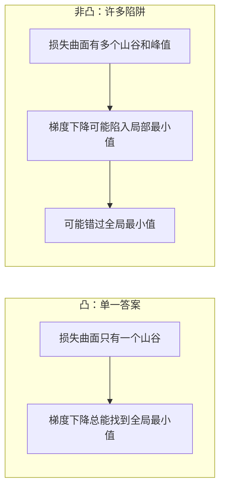
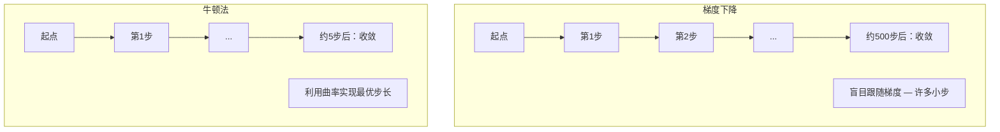
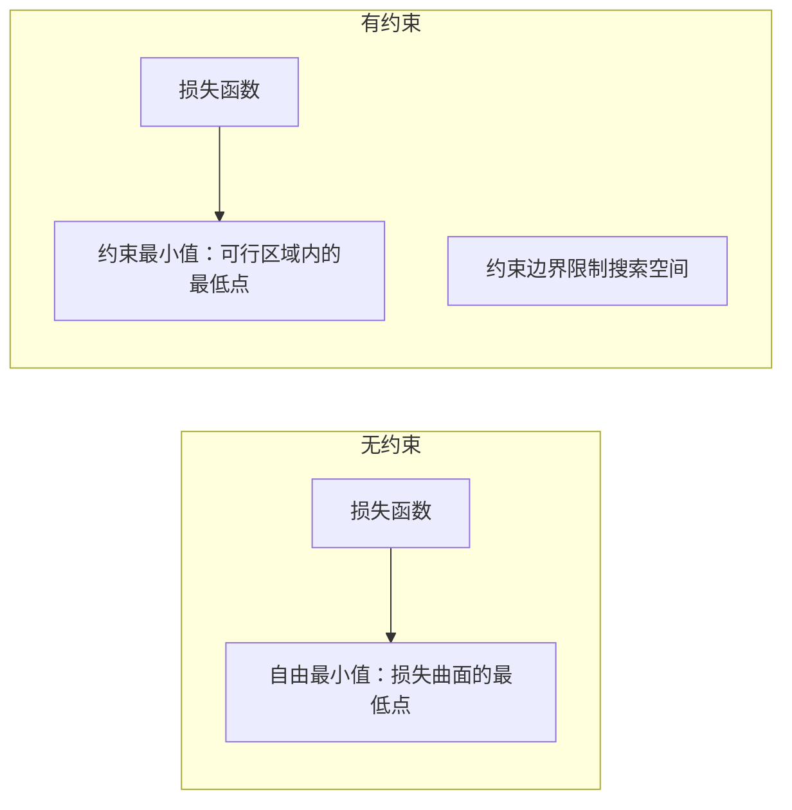
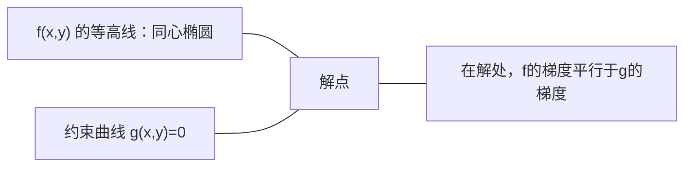

# 凸优化

> 凸问题只有一个山谷。神经网络有数百万个。了解其中的区别至关重要。

**类型：** 构建
**语言：** Python
**先修知识：** 第一阶段，第04课（机器学习的微积分），第08课（优化）
**时间：** 约90分钟

## 学习目标

- 使用定义、二阶导数和海森矩阵准则来测试函数是否为凸函数
- 实现牛顿法并将其二次收敛性与梯度下降进行比较
- 使用拉格朗日乘子法解决约束优化问题，并解读KKT条件
- 解释为什么神经网络损失景观是非凸的，但随机梯度下降仍然能找到好的解

## 问题描述

第08课教你梯度下降、动量和Adam。这些优化器可以在任何曲面上"下山"。但它们没有保证。在非凸地形上的梯度下降可能会陷入糟糕的局部最小值、卡在鞍点上，或者无限振荡。但你仍然使用它，因为神经网络是非凸的，而且没有替代方案。

但机器学习中的许多问题是凸的。线性回归、逻辑回归、支持向量机、LASSO、岭回归。对于这些问题，存在更强大的方法：具有数学保证的优化。一个凸问题只有一个山谷。任何"下山"的算法都会达到全局最小值。不需要重启。不需要学习率调度。不需要祈祷。

理解凸性有三点好处。第一，它告诉你你的问题是容易的（凸的）还是困难的（非凸的）。第二，它为你提供了更快的工具，例如用于凸问题的牛顿法。第三，它解释了机器学习中出现的概念：作为约束的正则化、支持向量机中的对偶性，以及为什么深度学习尽管违反了凸性给你的所有良好性质，但仍然有效。

## 核心概念

### 凸集

如果对于集合S中的任意两点，这两点之间的线段也完全包含在S中，则集合S是凸的。

| 凸集 | 非凸集 |
|---|---|
| **矩形**：内部任意两点连接的线段都保持在内部 | **星形/月牙形**：两个内部点之间的线段可能会穿出集合 |
| **三角形**：对所有内部点都保持相同的性质 | **甜甜圈/圆环**：空洞意味着某些线段会离开集合 |
| 任意两点之间的线段都保持在集合内 | 某些点对之间的线段会离开集合 |

正式检验：对于S中的任意点x, y和任意t∈[0, 1]，点tx + (1-t)y也属于S。

凸集的例子：
- 一条线、一个平面、整个Rⁿ空间
- 一个球（圆、球体、超球体）
- 一个半空间：{x : aᵀx ≤ b}
- 任意数量凸集的交集

非凸集的例子：
- 甜甜圈（圆环）
- 两个不相交圆的并集
- 任何有"凹陷"或"空洞"的集合

### 凸函数

如果函数f的定义域是凸集，并且对于定义域中的任意两点x, y和任意t∈[0, 1]：

```
f(tx + (1-t)y) ≤ t·f(x) + (1-t)·f(y)
```

则称函数f是凸的。

几何意义：图像上任意两点之间的线段位于图像的上方或与图像重合。

| 性质 | 凸函数 | 非凸函数 |
|---|---|---|
| **线段检验** | 图像上任意两点之间的线段位于曲线的**上方或上面** | 图像上某些点之间的线段会下降到曲线的**下方** |
| **形状** | 向上弯曲的单个碗状/山谷 | 具有混合曲率的多个峰值和山谷 |
| **局部最小值** | 每个局部最小值都是全局最小值 | 可能存在多个不同高度的局部最小值 |

常见的凸函数：
- f(x) = x²（抛物线）
- f(x) = |x|（绝对值）
- f(x) = eˣ（指数函数）
- f(x) = max(0, x)（ReLU，虽然是分段线性）
- f(x) = -log(x)（x > 0）（负对数）
- 任何线性函数 f(x) = aᵀx + b（既是凸函数也是凹函数）

### 凸性检验

三种实用检验方法，从最简单到最严格。

**检验1：二阶导数检验（一维）。** 如果对所有x有 f''(x) ≥ 0，则f是凸的。

- f(x) = x²: f''(x) = 2 ≥ 0。凸函数。
- f(x) = x³: f''(x) = 6x。当 x < 0 时为负。不是凸函数。
- f(x) = eˣ: f''(x) = eˣ > 0。凸函数。

**检验2：海森矩阵检验（多维）。** 如果对所有x，海森矩阵H(x)是半正定的，则f是凸的。海森矩阵是二阶偏导数构成的矩阵。

**检验3：定义检验。** 直接检验不等式 f(tx + (1-t)y) ≤ t·f(x) + (1-t)·f(y)。对于难以计算导数的函数很有用。

### 为什么凸性很重要

凸优化的核心定理：

**对于凸函数，每个局部最小值都是全局最小值。**

这意味着梯度下降不会被困住。任何下坡路径都会通向相同的答案。该算法保证收敛到最优解。



意义：
- 不需要随机重启
- 不需要复杂的学习率调度
- 可以证明收敛性（速率取决于函数性质）
- 解是唯一的（除去平坦区域）

### 机器学习中的凸 vs 非凸

| 问题 | 凸？ | 原因 |
|---|---|---|
| 线性回归（MSE） | 是 | 损失函数是权重的二次函数 |
| 逻辑回归 | 是 | 对数损失是权重的凸函数 |
| SVM（铰链损失） | 是 | 线性函数的最大值 |
| LASSO（L1回归） | 是 | 凸函数之和仍是凸函数 |
| 岭回归（L2） | 是 | 二次 + 二次 = 凸函数 |
| 神经网络（任何损失） | 否 | 非线性激活函数产生非凸景观 |
| k-means聚类 | 否 | 离散分配步骤 |
| 矩阵分解 | 否 | 未知数的乘积 |

具有凸损失的线性模型是凸的。一旦你添加带有非线性激活函数的隐藏层，凸性就被破坏了。

### 海森矩阵

函数 f: Rⁿ → R 的海森矩阵 H 是一个 n×n 的二阶偏导数矩阵。

```
H[i][j] = ∂²f / (∂x_i ∂x_j)
```

对于 f(x, y) = x² + 3xy + y²：

```
∂f/∂x = 2x + 3y       ∂²f/∂x² = 2      ∂²f/∂x∂y = 3
∂f/∂y = 3x + 2y       ∂²f/∂y∂x = 3      ∂²f/∂y² = 2

H = [ 2  3 ]
    [ 3  2 ]
```

海森矩阵告诉你曲率信息：
- 特征值全为正：函数在每个方向都向上弯曲（在该点为凸）
- 特征值全为负：在每个方向都向下弯曲（凹的，局部最大值）
- 符号混合：鞍点（在某些方向向上弯曲，在其他方向向下弯曲）
- 特征值为零：在该方向平坦（退化）

对于凸性，海森矩阵必须在所有点（不仅仅是在某一点）都是半正定的（所有特征值 ≥ 0）。

### 牛顿法

梯度下降使用一阶信息（梯度）。牛顿法使用二阶信息（海森矩阵）。它在当前点拟合一个二次近似，然后直接跳到该二次近似的最小值。

```
更新规则：
  x_new = x - H⁻¹ · 梯度

与梯度下降比较：
  x_new = x - lr · 梯度
```

牛顿法用海森矩阵的逆替换了标量学习率。这根据局部曲率自动调整步长和方向。



优点：
- 在最小值附近具有二次收敛性（每一步误差平方）
- 无需调整学习率
- 尺度不变性（无论你如何参数化问题，都能工作）

缺点：
- 计算海森矩阵需要 O(n²) 内存，求逆需要 O(n³)
- 对于一个有100万权重的神经网络，这意味着10¹²个条目和10¹⁸次操作
- 不适用于深度学习

### 约束优化

无约束优化：在所有x上最小化 f(x)。
约束优化：在满足约束的条件下最小化 f(x)。

实际问题都有约束。你想最小化成本但预算有限。你想最小化误差但模型复杂度有限。



### 拉格朗日乘子法

拉格朗日乘子法将约束问题转化为无约束问题。

问题：在约束 g(x) = 0 下最小化 f(x)。

解决方案：引入一个新变量（拉格朗日乘子λ）并求解无约束问题：

```
L(x, λ) = f(x) + λ·g(x)
```

在解处，L的梯度为零：

```
∂L/∂x = ∂f/∂x + λ·∂g/∂x = 0
∂L/∂λ = g(x) = 0
```

几何直观：在约束最小值处，f的梯度必须平行于约束g的梯度。如果它们不平行，你可以沿着约束曲面移动并进一步减小f。



示例：在约束 x + y = 1 下最小化 f(x,y) = x² + y²。

```
L = x² + y² + λ(x + y - 1)

∂L/∂x = 2x + λ = 0  =>  x = -λ/2
∂L/∂y = 2y + λ = 0  =>  y = -λ/2
∂L/∂λ = x + y - 1 = 0

由前两式得：x = y
代入：2x = 1，所以 x = y = 0.5，λ = -1
```

直线 x + y = 1 上距离原点最近的点是 (0.5, 0.5)。

### KKT条件

Karush-Kuhn-Tucker 条件将拉格朗日乘子法推广到不等式约束。

问题：在约束 g_i(x) ≤ 0（i = 1, ..., m）下最小化 f(x)。

KKT条件（最优性的必要条件）：

```
1. 稳定性：    ∂f/∂x + Σ λ_i · ∂g_i/∂x = 0
2. 原始可行性： 对所有 i，g_i(x) ≤ 0
3. 对偶可行性： 对所有 i，λ_i ≥ 0
4. 互补松弛：   对所有 i，λ_i · g_i(x) = 0
```

互补松弛是关键洞察：要么约束是活跃的（g_i=0，解位于边界上），要么乘子为零（该约束无关紧要）。不影响解的约束对应的 λ=0。

KKT条件是支持向量机的核心。支持向量是约束活跃（λ>0）的数据点。所有其他数据点的 λ=0，不影响决策边界。

### 作为约束优化的正则化

L1和L2正则化不是任意的技巧。它们实际上是伪装起来的约束优化问题。

**L2正则化（岭回归）：**

```
最小化  Loss(w)  满足  ||w||² ≤ t

等价的非约束形式：
最小化  Loss(w) + λ·||w||²
```

约束 ||w||² ≤ t 定义了一个球（二维中是圆，三维中是球体）。解是损失等高线首次接触这个球的点。

**L1正则化（LASSO）：**

```
最小化  Loss(w)  满足  ||w||₁ ≤ t

等价的非约束形式：
最小化  Loss(w) + λ·||w||₁
```

约束 ||w||₁ ≤ t 定义了一个菱形（二维中是旋转的正方形）。

| 性质 | L2约束（圆形） | L1约束（菱形） |
|---|---|---|
| **约束形状** | 圆形（高维中是球体） | 菱形（二维中是旋转的正方形） |
| **损失等高线接触点** | 光滑边界 — 圆上的任意点 | 角点 — 与坐标轴对齐 |
| **解的行为** | 权重很小但不为零 | 某些权重恰好为零（稀疏） |
| **结果** | 权重收缩 | 特征选择 |

这解释了为什么L1产生稀疏模型（特征选择），而L2只是收缩权重。菱形有与坐标轴对齐的角点。损失等高线更可能接触角点，使得一个或多个权重恰好为零。

### 对偶性

每个约束优化问题（原始问题）都有一个伴随问题（对偶问题）。对于凸问题，原始问题和对偶问题具有相同的最优值。这就是强对偶性。

拉格朗日对偶函数：

```
原始问题：在约束 g(x) ≤ 0 下最小化 f(x)
拉格朗日函数：L(x, λ) = f(x) + λ·g(x)
对偶函数：d(λ) = min_x L(x, λ)
对偶问题：在约束 λ ≥ 0 下最大化 d(λ)
```

为什么对偶性重要：
- 对偶问题有时比原始问题更容易求解
- 支持向量机在其对偶形式中求解，问题依赖于数据点之间的点积（这使得核技巧成为可能）
- 对偶提供了原始问题最优值的下界，有助于检查解的质量

具体对于支持向量机：

```
原始问题：找到最大化间隔 2/||w|| 的 w, b，满足对所有 i，y_i(w^T x_i + b) ≥ 1

对偶问题：最大化 Σα_i - 0.5·Σ_ij(α_i·α_j·y_i·y_j·x_i^T x_j)
          满足 α_i ≥ 0 且 Σα_i·y_i = 0

对偶问题只涉及点积 x_i^T x_j。
将 x_i^T x_j 替换为 K(x_i, x_j) 就得到了核技巧。
```

### 为什么深度学习即使非凸也能工作

神经网络损失函数是非常非凸的。按照任何经典标准，优化它们都应该失败。然而随机梯度下降却能可靠地找到好的解。有几个因素可以解释这一点。

**大多数局部最小值已经足够好。** 在高维空间中，随机临界点（梯度为零的点）绝大多数是鞍点，而不是局部最小值。存在的少数局部最小值往往具有接近全局最小值的损失值。当参数空间有数百万个维度时，陷入糟糕的局部最小值的可能性极低。

**真正的障碍是鞍点，而不是局部最小值。** 在一个有n个参数的函数中，鞍点具有混合的正曲率和负曲率方向。对于高维空间中的随机临界点，所有n个特征值都为正（局部最小值）的概率大约为2⁻ⁿ。几乎所有的临界点都是鞍点。随机梯度下降的噪声有助于逃离它们。

**过度参数化使景观更平滑。** 参数数量多于训练样本数量的网络具有更平滑、连接更紧密的损失曲面。更宽的网络有更少的糟糕局部最小值。这违反直觉，但经验上是一致的。

**损失景观结构：**

| 性质 | 低维空间 | 高维空间 |
|---|---|---|
| **景观** | 许多孤立的峰和谷 | 平滑连接的山谷 |
| **最小值** | 许多孤立的局部最小值 | 很少的糟糕局部最小值；大多数接近最优 |
| **导航** | 难以找到全局最小值 | 许多路径通向好的解 |
| **临界点** | 局部最小值和鞍点混合 | 绝大多数是鞍点，不是局部最小值 |

**随机噪声充当隐式正则化。** 小批量随机梯度下降添加的噪声可以防止陷入尖锐的最小值。尖锐的最小值会过拟合；平坦的最小值泛化能力更好。噪声将优化偏向损失景观的平坦区域。

### 实践中的二阶方法

纯牛顿法对于大型模型不实用。一些近似方法使得二阶信息可用。

**L-BFGS（有限内存BFGS）：** 使用最后m个梯度差来近似海森矩阵的逆。需要 O(mn) 内存而不是 O(n²)。对于最多约10,000个参数的问题效果很好。用于经典机器学习（逻辑回归、条件随机场），但不用于深度学习。

**自然梯度：** 使用Fisher信息矩阵（对数似然的期望海森矩阵）代替标准海森矩阵。这考虑了概率分布的几何结构。K-FAC（Kronecker因子近似曲率）将Fisher矩阵近似为Kronecker积，使其在神经网络中实用。

**无海森矩阵优化：** 使用共轭梯度法求解 Hx = g，而从不显式形成H。只需要海森-向量积，可以通过自动微分在 O(n) 时间内计算。

**对角近似：** Adam的二阶矩是海森矩阵对角线的对角近似。AdaHessian通过Hutchinson估计量使用实际的海森矩阵对角线元素来扩展这一点。

| 方法 | 内存 | 每步代价 | 使用场景 |
|---|---|---|---|
| 梯度下降 | O(n) | O(n) | 基线，大型模型 |
| 牛顿法 | O(n²) | O(n³) | 小型凸问题 |
| L-BFGS | O(mn) | O(mn) | 中型凸问题 |
| Adam | O(n) | O(n) | 深度学习默认选择 |
| K-FAC | O(n) | 每层 O(n) | 研究，大批量训练 |

## 动手构建

### 步骤1：凸性检查器

构建一个通过采样点并检验定义来经验性地测试凸性的函数。

```python
import random
import math

def check_convexity(f, dim, bounds=(-5, 5), samples=1000):
    violations = 0
    for _ in range(samples):
        x = [random.uniform(*bounds) for _ in range(dim)]
        y = [random.uniform(*bounds) for _ in range(dim)]
        t = random.uniform(0, 1)
        mid = [t * xi + (1 - t) * yi for xi, yi in zip(x, y)]
        lhs = f(mid)
        rhs = t * f(x) + (1 - t) * f(y)
        if lhs > rhs + 1e-10:
            violations += 1
    return violations == 0, violations
```

### 步骤2：二维牛顿法

使用显式海森矩阵实现牛顿法。与梯度下降比较收敛速度。

```python
def newtons_method(f, grad_f, hessian_f, x0, steps=50, tol=1e-12):
    x = list(x0)
    history = [x[:]]
    for _ in range(steps):
        g = grad_f(x)
        H = hessian_f(x)
        det = H[0][0] * H[1][1] - H[0][1] * H[1][0]
        if abs(det) < 1e-15:
            break
        H_inv = [
            [H[1][1] / det, -H[0][1] / det],
            [-H[1][0] / det, H[0][0] / det],
        ]
        dx = [
            H_inv[0][0] * g[0] + H_inv[0][1] * g[1],
            H_inv[1][0] * g[0] + H_inv[1][1] * g[1],
        ]
        x = [x[0] - dx[0], x[1] - dx[1]]
        history.append(x[:])
        if sum(gi ** 2 for gi in g) < tol:
            break
    return history
```

### 步骤3：拉格朗日乘子求解器

通过对拉格朗日函数进行梯度下降来求解约束优化。

```python
def lagrange_solve(f_grad, g_val, g_grad, x0, lr=0.01,
                   lr_lambda=0.01, steps=5000):
    x = list(x0)
    lam = 0.0
    history = []
    for _ in range(steps):
        fg = f_grad(x)
        gv = g_val(x)
        gg = g_grad(x)
        x = [
            xi - lr * (fgi + lam * ggi)
            for xi, fgi, ggi in zip(x, fg, gg)
        ]
        lam = lam + lr_lambda * gv
        history.append((x[:], lam, gv))
    return history
```

### 步骤4：比较一阶和二阶方法

在同一个二次函数上运行梯度下降和牛顿法。统计达到收敛所需的步数。

```python
def quadratic(x):
    return 5 * x[0] ** 2 + x[1] ** 2

def quadratic_grad(x):
    return [10 * x[0], 2 * x[1]]

def quadratic_hessian(x):
    return [[10, 0], [0, 2]]
```

牛顿法将在1步内收敛（对于二次函数是精确的）。梯度下降将需要数百步，因为海森矩阵的特征值相差5倍，产生了一个狭长的山谷。

## 使用示例

凸性分析在选择机器学习模型和求解器时直接适用。

对于凸问题（逻辑回归、支持向量机、LASSO）：
- 使用专用求解器（liblinear、CVXPY、scipy.optimize.minimize 并使用 method='L-BFGS-B'）
- 预期有唯一的全局解
- 二阶方法实用且快速

对于非凸问题（神经网络）：
- 使用一阶方法（随机梯度下降、Adam）
- 接受解依赖于初始化和随机性的事实
- 使用过度参数化、噪声和学习率调度作为隐式正则化
- 不要浪费时间寻找全局最小值。一个好的局部最小值就足够了。

```python
from scipy.optimize import minimize

result = minimize(
    fun=lambda w: sum((y - X @ w) ** 2) + 0.1 * sum(w ** 2),
    x0=np.zeros(d),
    method='L-BFGS-B',
    jac=lambda w: -2 * X.T @ (y - X @ w) + 0.2 * w,
)
```

对于支持向量机，对偶形式让你可以使用核技巧：

```python
from sklearn.svm import SVC

svm = SVC(kernel='rbf', C=1.0)
svm.fit(X_train, y_train)
print(f"支持向量数量: {svm.n_support_}")
```

## 练习

1. **凸性画廊。** 使用检查器测试以下函数的凸性：f(x)=x⁴，f(x)=sin(x)，f(x,y)=x²+y²，f(x,y)=x·y，f(x)=max(x,0)。解释为什么每个结果是有意义的。

2. **牛顿 vs 梯度下降竞赛。** 从起点(10,10)开始在函数 f(x,y)=50x²+y² 上运行两种方法。每种方法需要多少步才能达到损失 < 1e-10？当条件数（海森矩阵最大特征值与最小特征值之比）增加时，梯度下降会发生什么？

3. **拉格朗日乘子几何。** 在约束 x + 2y = 4 下最小化 f(x,y) = (x-3)² + (y-3)²。通过检查在解处 f 的梯度是否平行于 g 的梯度来验证解。

4. **正则化约束。** 实现L1约束优化：在约束 |x| + |y| ≤ 1 下最小化 (x-3)² + (y-2)²。证明解有一个坐标等于零（菱形约束带来的稀疏性）。

5. **海森矩阵特征值分析。** 计算Rosenbrock函数在(1,1)和(-1,1)处的海森矩阵。计算两点的特征值。特征值告诉你关于最小值处与远离最小值处的曲率的什么信息？

## 关键术语

| 术语 | 含义 |
|---|---|
| 凸集 | 集合中任意两点之间的线段仍保持在集合内的集合 |
| 凸函数 | 图像上任意两点之间的线段位于图像上方或上面的函数。等价地，海森矩阵处处半正定 |
| 局部最小值 | 比所有邻近点都低的点。对于凸函数，每个局部最小值都是全局最小值 |
| 全局最小值 | 函数在整个定义域内的最低点 |
| 海森矩阵 | 所有二阶偏导数构成的矩阵。编码曲率信息 |
| 半正定 | 所有特征值非负的矩阵。是"二阶导数 ≥ 0"的多维类比 |
| 条件数 | 海森矩阵最大特征值与最小特征值之比。高条件数意味着狭长的山谷和缓慢的梯度下降 |
| 牛顿法 | 使用海森矩阵的逆来确定步长和方向的二阶优化器。在最小值附近具有二次收敛性 |
| 拉格朗日乘子 | 引入的一个变量，用于将约束优化问题转化为无约束问题 |
| KKT条件 | 具有不等式约束的最优性的必要条件。推广了拉格朗日乘子法 |
| 互补松弛 | 在解处，要么约束是活跃的，要么其乘子为零。永远不会两者都非零 |
| 对偶性 | 每个约束问题都有一个伴随的对偶问题。对于凸问题，两者具有相同的最优值 |
| 强对偶性 | 原始问题和对偶问题的最优值相等。对于满足Slater条件的凸问题成立 |
| L-BFGS | 近似二阶方法，存储最后m个梯度差而不是完整的海森矩阵 |
| 鞍点 | 梯度为零，但在某些方向是极小值，在其他方向是极大值的点 |
| 过度参数化 | 使用比训练样本更多的参数。使损失景观更平滑，减少糟糕的局部最小值 |

## 延伸阅读

- [Boyd & Vandenberghe: Convex Optimization](https://web.stanford.edu/~boyd/cvxbook/) - 标准教科书，可免费在线获取
- [Bottou, Curtis, Nocedal: Optimization Methods for Large-Scale Machine Learning (2018)](https://arxiv.org/abs/1606.04838) - 连接凸优化理论和深度学习实践的桥梁
- [Choromanska et al.: The Loss Surfaces of Multilayer Networks (2015)](https://arxiv.org/abs/1412.0233) - 为什么非凸神经网络景观并没有看起来那么糟糕
- [Nocedal & Wright: Numerical Optimization](https://link.springer.com/book/10.1007/978-0-387-40065-5) - 关于牛顿法、L-BFGS和约束优化的综合参考书