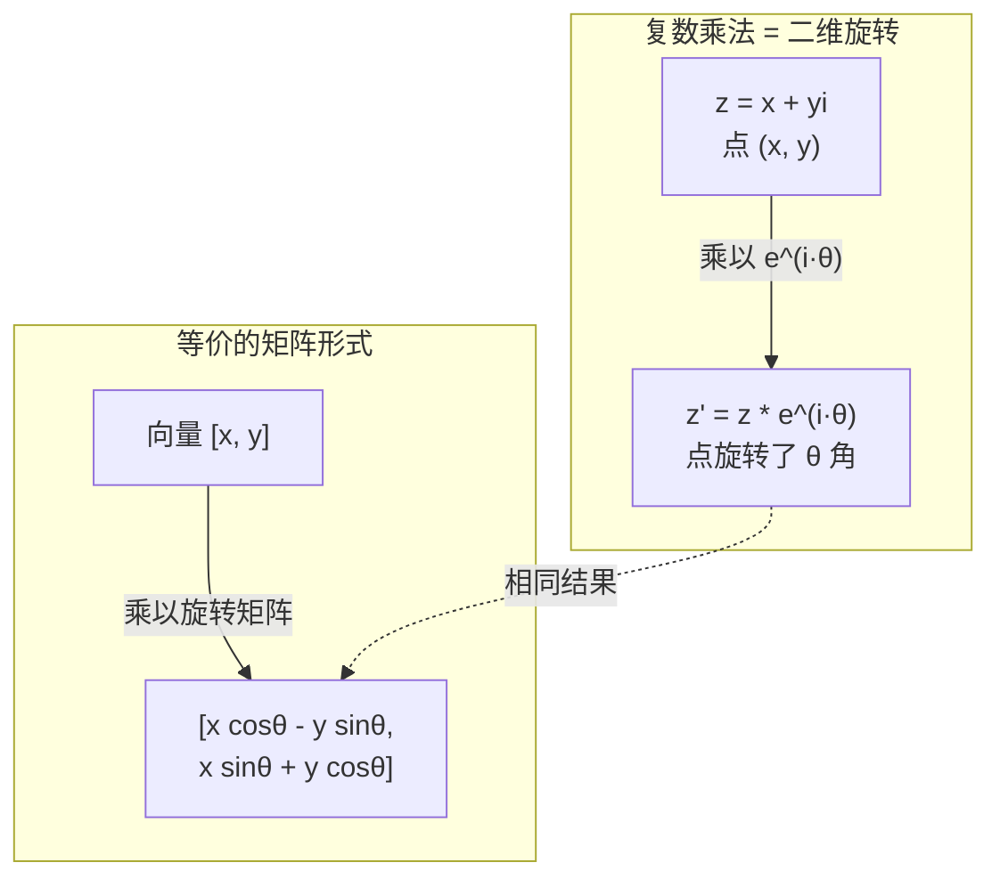
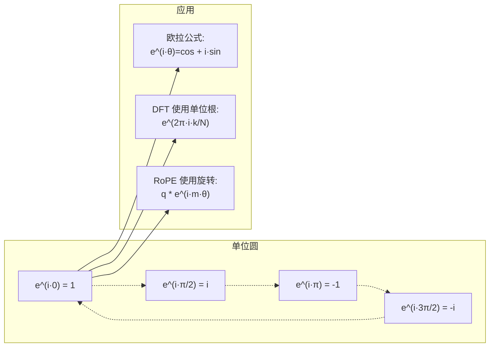

# 面向人工智能的复数

> -1 的平方根不是虚数。它是旋转、频率以及信号处理半壁江山的关键。

**类型：** 学习
**语言：** Python
**先修知识：** 第一阶段，第 01-04 课（线性代数、微积分）
**时间：** 约 60 分钟

## 学习目标

- 使用矩形和极坐标形式执行复数运算（加、减、乘、除、共轭）
- 应用欧拉公式在复指数和三角函数之间进行转换
- 使用单位复根实现离散傅里叶变换 (DFT)
- 解释复数旋转如何构成 Transformer 中的 RoPE（旋转位置编码）和正弦位置编码的基础

## 问题概述

你翻开一篇关于傅里叶变换的论文，到处都看到 `i`。你查看 Transformer 的位置编码，会在不同频率下看到 `sin` 和 `cos`——它们是复指数的实部和虚部。你阅读关于量子计算的文章，发现一切都用复向量空间表示。

复数看起来很抽象。一个建立在 -1 平方根之上的数系感觉像个数学技巧。但它不是技巧。它是旋转和振荡的自然语言。每当有东西在旋转、振动或振荡时，复数就是最合适的工具。

不理解复数，你就无法理解离散傅里叶变换，无法理解快速傅里叶变换 (FFT)，无法理解 RoPE（旋转位置编码）在现代语言模型中是如何工作的，也无法理解原始 Transformer 论文中的正弦位置编码为什么使用那些特定的频率。

本课程将从零开始构建复数运算，将其与几何联系起来，并准确展示复数在机器学习中的应用位置。

## 核心概念

### 什么是复数？

一个复数由两部分组成：实部和虚部。

```
z = a + bi

其中：
  a 是实部
  b 是虚部
  i 是虚数单位，定义为 i² = -1
```

就是这样。你将数轴扩展成一个平面。实数位于一个轴上，虚数位于另一个轴上。每个复数都是这个平面上的一个点。

### 复数运算

**加法：** 实部相加，虚部相加。

```
(a + bi) + (c + di) = (a + c) + (b + d)i

示例：(3 + 2i) + (1 + 4i) = 4 + 6i
```

**乘法：** 使用分配律，并记住 i² = -1。

```
(a + bi)(c + di) = ac + adi + bci + bdi²
                 = ac + adi + bci - bd
                 = (ac - bd) + (ad + bc)i

示例：(3 + 2i)(1 + 4i) = 3 + 12i + 2i + 8i²
                            = 3 + 14i - 8
                            = -5 + 14i
```

**共轭：** 翻转虚部的符号。

```
(a + bi) 的共轭 = a - bi
```

一个复数与其共轭的乘积总是实数：

```
(a + bi)(a - bi) = a² + b²
```

**除法：** 将分子和分母乘以分母的共轭。

```
(a + bi) / (c + di) = (a + bi)(c - di) / (c² + d²)
```

这可以消去分母中的虚部，得到一个整洁的复数。

### 复平面

复平面将每个复数映射到一个二维点。水平轴是实轴，垂直轴是虚轴。

```
z = 3 + 2i  对应于点 (3, 2)
z = -1 + 0i 对应于实轴上的点 (-1, 0)
z = 0 + 4i  对应于虚轴上的点 (0, 4)
```

一个复数同时是一个点和一个从原点出发的向量。这种双重解释使得复数对几何非常有用。

### 极坐标形式

平面上的任何点都可以用其到原点的距离（模长）和与正实轴的夹角（相位）来描述。

```
z = r * (cos(theta) + i*sin(theta))

其中：
  r = |z| = sqrt(a² + b²)     (模长)
  theta = atan2(b, a)          (相位)
```

矩形形式 (a + bi) 适合加法。极坐标形式 (r, theta) 适合乘法。

**极坐标下的乘法：** 模长相乘，角度相加。

```
z1 = r1 * e^(i*theta1)
z2 = r2 * e^(i*theta2)

z1 * z2 = (r1 * r2) * e^(i*(theta1 + theta2))
```

这就是为什么复数非常适合处理旋转。乘以一个模长为 1 的复数就是纯粹的旋转。

### 欧拉公式

连接复指数和三角函数的桥梁：

```
e^(i*theta) = cos(theta) + i*sin(theta)
```

这是本课最重要的公式。当 theta = π 时：

```
e^(i*π) = cos(π) + i*sin(π) = -1 + 0i = -1

因此：e^(i*π) + 1 = 0
```

五个基本常数（e, i, π, 1, 0）被联系在一个等式中。

### 为什么欧拉公式对机器学习很重要

欧拉公式表明，随着 theta 的变化，`e^(i*theta)` 描绘出单位圆。当 theta=0 时，在点 (1, 0)；theta=π/2 时，在点 (0, 1)；theta=π 时，在点 (-1, 0)；theta=3π/2 时，在点 (0, -1)。旋转一整圈对应 theta=2π。

这意味着**复指数就是旋转**。而旋转在信号处理和机器学习中无处不在。

### 与二维旋转的联系

将复数 (x + yi) 乘以 e^(i*theta) 可以将点 (x, y) 绕原点旋转 theta 角。

```
通过复数乘法的旋转：
  (x + yi) * (cos(theta) + i*sin(theta))
  = (x*cos(theta) - y*sin(theta)) + (x*sin(theta) + y*cos(theta))i

通过矩阵乘法的旋转：
  [cos(theta)  -sin(theta)] [x]   [x*cos(theta) - y*sin(theta)]
  [sin(theta)   cos(theta)] [y] = [x*sin(theta) + y*cos(theta)]
```

它们产生相同的结果。**复数乘法就是二维旋转**。旋转矩阵只是用矩阵符号表示的复数乘法。



### 相量和旋转信号

复指数 e^(i*ω*t) 是一个以角频率 ω 绕单位圆旋转的点。随着 t 增加，该点描绘出圆形。

这个旋转点的实部是 cos(ω*t)，虚部是 sin(ω*t)。一个正弦信号是一个旋转复数的投影。

```
e^(i*ω*t) = cos(ω*t) + i*sin(ω*t)

实部:      cos(ω*t)    -- 余弦波
虚部:      sin(ω*t)    -- 正弦波
```

这就是**相量**表示。不必追踪一个来回摆动的正弦波，而是追踪一个平滑旋转的箭头。相移变成角度偏移，幅度变化变成模长变化，信号的相加变成向量的加法。

### 单位根

N 次单位根是单位圆上等间隔的 N 个点：

```
ω_k = e^(2π*i*k/N)    for k = 0, 1, 2, ..., N-1
```

当 N=4 时，单位根为：1, i, -1, -i（四个方位点）。
当 N=8 时，得到四个方位点加上四个对角线点。

单位根是**离散傅里叶变换 (DFT)** 的基础。DFT 将一个信号分解为这些 N 个等间隔频率的分量。

### 与 DFT 的联系

信号 x[0], x[1], ..., x[N-1] 的离散傅里叶变换为：

```
X[k] = Σ_{n=0}^{N-1} x[n] * e^(-2π*i*k*n/N)
```

每个 X[k] 衡量信号与第 k 个单位根（一个频率为 k 的复正弦波）的相关程度。DFT 将一个信号分解为 N 个旋转相量，并告诉你每个相量的幅度和相位。

### 为什么 i 不是虚的

"虚数"这个词是一个历史偶然。笛卡尔轻蔑地使用了它。但 i 并不比负数在人们最初排斥它们时更加"虚"。负数回答了"从 3 减去多少得到 -2？"的问题。虚数单位回答了"什么数的平方是 -1？"的问题。

更有用的是：**i 是一个 90 度的旋转算子**。将一个实数乘以 i 一次，你旋转 90 度到虚轴。再乘以 i（即 i²），再旋转 90 度——现在你指向负实轴方向。这就是为什么 i² = -1。这并不神秘，它是由两个四分之一转构成的一个半转。

这就是为什么复数在工程中无处不在。任何旋转的东西——电磁波、量子态、信号振荡、位置编码——都自然地可以用复数来描述。

### 复指数与三角函数

在欧拉公式之前，工程师将信号表示为 A*cos(ω*t + φ)——幅度 A，频率 ω，相位 φ。这有效，但使算术变得繁琐。将两个具有不同相位的余弦相加需要繁琐的三角恒等式。

使用复指数，同样的信号是 A*e^(i*(ω*t + φ))。相加两个信号只是相加两个复数。相乘（调制）只是模长相乘和角度相加。相移变成角度加法。频移变成与相量相乘。

整个信号处理领域都转向了复指数记法，因为数学更简洁。"真实信号"总是复数表示的实部。虚部作为记账被携带，使得所有代数运算自然地进行。

### 与 Transformer 的联系

**正弦位置编码**（原始 Transformer 论文）：

```
PE(pos, 2i) = sin(pos / 10000^(2i/d))
PE(pos, 2i+1) = cos(pos / 10000^(2i/d))
```

这些 sin 和 cos 对是不同频率下复指数的实部和虚部。每个频率提供了编码位置的不同"分辨率"。低频变化缓慢（粗略位置），高频变化迅速（精细位置）。它们共同为每个位置提供了唯一的频率指纹。

**RoPE（旋转位置嵌入）** 更进一步。它显式地将查询（Query）和键（Key）向量乘以复数旋转矩阵。两个标记之间的相对位置变成一个旋转角度。注意力使用这些旋转后的向量进行计算，通过复数乘法使模型对相对位置敏感。

| 运算 | 代数形式 | 几何意义 |
|---|---|---|
| 加法 | (a+c) + (b+d)i | 平面上的向量加法 |
| 乘法 | (ac-bd) + (ad+bc)i | 旋转和缩放 |
| 共轭 | a - bi | 关于实轴反射 |
| 模长 | sqrt(a² + b²) | 到原点的距离 |
| 相位 | atan2(b, a) | 与正实轴的夹角 |
| 除法 | 乘以共轭 | 反向旋转和重新缩放 |
| 幂 | r^n * e^(i*n*theta) | 旋转 n 次，模长缩放 r^n |



## 动手实现

### 步骤 1：复数类

构建一个支持算术运算、模长、相位以及在矩形和极坐标形式之间转换的复数类。

```python
import math

class Complex:
    def __init__(self, real, imag=0.0):
        self.real = real
        self.imag = imag

    def __add__(self, other):
        return Complex(self.real + other.real, self.imag + other.imag)

    def __mul__(self, other):
        r = self.real * other.real - self.imag * other.imag
        i = self.real * other.imag + self.imag * other.real
        return Complex(r, i)

    def __truediv__(self, other):
        denom = other.real ** 2 + other.imag ** 2
        r = (self.real * other.real + self.imag * other.imag) / denom
        i = (self.imag * other.real - self.real * other.imag) / denom
        return Complex(r, i)

    def magnitude(self):
        return math.sqrt(self.real ** 2 + self.imag ** 2)

    def phase(self):
        return math.atan2(self.imag, self.real)

    def conjugate(self):
        return Complex(self.real, -self.imag)
```

### 步骤 2：极坐标转换和欧拉公式

```python
def to_polar(z):
    return z.magnitude(), z.phase()

def from_polar(r, theta):
    return Complex(r * math.cos(theta), r * math.sin(theta))

def euler(theta):
    return Complex(math.cos(theta), math.sin(theta))
```

验证：`euler(theta).magnitude()` 应始终为 1.0。`euler(0)` 应得到 (1, 0)。`euler(π)` 应得到 (-1, 0)。

### 步骤 3：旋转

将点 (x, y) 旋转 theta 角就是一次复数乘法：

```python
point = Complex(3, 4)
rotated = point * euler(math.pi / 4)
```

模长保持不变，只有角度发生变化。

### 步骤 4：基于复数运算的 DFT

```python
def dft(signal):
    N = len(signal)
    result = []
    for k in range(N):
        total = Complex(0, 0)
        for n in range(N):
            angle = -2 * math.pi * k * n / N
            total = total + Complex(signal[n], 0) * euler(angle)
        result.append(total)
    return result
```

这是复杂度为 O(N²) 的 DFT。每个输出 X[k] 是信号样本乘以单位根后的总和。

### 步骤 5：逆 DFT

逆 DFT 从频谱重建原始信号。与前向 DFT 唯一的不同是：翻转指数的符号并除以 N。

```python
def idft(spectrum):
    N = len(spectrum)
    result = []
    for n in range(N):
        total = Complex(0, 0)
        for k in range(N):
            angle = 2 * math.pi * k * n / N
            total = total + spectrum[k] * euler(angle)
        result.append(Complex(total.real / N, total.imag / N))
    return result
```

这可以完美重建。应用 DFT，然后应用 IDFT，你会得到原始信号（达到机器精度）。没有信息丢失。

### 步骤 6：单位根

```python
def roots_of_unity(N):
    return [euler(2 * math.pi * k / N) for k in range(N)]
```

验证两个性质：
- 每个根的模长恰好为 1。
- 所有 N 个根的和为零（它们对称地抵消）。

这些性质使得 DFT 是可逆的。单位根构成了频域的一组正交基。

## 使用示例

Python 内置了复数支持。字面量 `j` 表示虚数单位。

```python
z = 3 + 2j
w = 1 + 4j

print(z + w)      # (4+6j)
print(z * w)      # (-5+14j)
print(abs(z))     # 3.605551275463989

import cmath
print(cmath.phase(z))          # 0.5880026035475675
print(cmath.exp(1j * cmath.pi)) # (-1+1.2246467991473532e-16j)
```

对于数组，NumPy 原生支持复数：

```python
import numpy as np

z = np.array([1+2j, 3+4j, 5+6j])
print(np.abs(z))   # [2.236 5.    7.81 ]
print(np.angle(z)) # [0.463 0.927 0.876]
print(np.conj(z))  # [1.-2.j 3.-4.j 5.-6.j]
print(np.real(z))  # [1. 3. 5.]
print(np.imag(z))  # [2. 4. 6.]

# 使用 NumPy 的 FFT
signal = np.sin(2 * np.pi * 5 * np.linspace(0, 1, 128))
spectrum = np.fft.fft(signal)
freqs = np.fft.fftfreq(128, d=1/128)
```

## 交付内容

运行 `code/complex_numbers.py` 生成 `outputs/skill-complex-arithmetic.md`。

## 练习

1. **手算复数运算。** 计算 (2 + 3i) * (4 - i) 并用代码验证。然后计算 (5 + 2i) / (1 - 3i)。在复平面上画出两个结果，并验证乘法对第一个数进行了旋转和缩放。

2. **旋转序列。** 从点 (1, 0) 开始。乘以 e^(i·π/6) 十二次。验证 12 次乘法后你回到了 (1, 0)。打印每一步的坐标，并确认它们描绘了一个正十二边形。

3. **已知信号的 DFT。** 创建一个信号，它是 sin(2π·3·t) 和 0.5·sin(2π·7·t) 的和，采样 32 个点。运行你的 DFT。验证幅度谱在频率 3 和 7 处有峰值，并且 7 处的峰值高度是 3 处的一半。

4. **单位根可视化。** 计算 8 次单位根。验证它们的和为零。验证将任何根乘以本原根 e^(2π·i/8) 会得到下一个根。

5. **旋转矩阵等价性。** 对于 10 个随机角度和 10 个随机点，验证复数乘法与使用 2×2 旋转矩阵进行矩阵-向量乘法得到相同的结果。打印最大数值差异。

## 关键术语表

| 术语 | 含义 |
|---|---|
| **复数** | 形式为 a + bi 的数，其中 a 是实部，b 是虚部，且 i² = -1 |
| **虚数单位** | 数 i，定义为 i² = -1。从哲学意义上说不是"虚"的——它是一个旋转算子 |
| **复平面** | 二维平面，x 轴为实轴，y 轴为虚轴。也称为阿尔冈平面 |
| **模长** | 到原点的距离：sqrt(a²+b²)。记作 \|z\| |
| **相位** | 与正实轴的夹角：atan2(b, a)。记作 arg(z) |
| **共轭** | 关于实轴的镜像：a + bi 的共轭是 a - bi |
| **极坐标形式** | 将 z 表示为 r * e^(i·θ) 而不是 a + bi。使乘法变得容易 |
| **欧拉公式** | e^(iθ) = cos θ + i sin θ。连接指数函数和三角函数 |
| **相量** | 一个旋转的复数 e^(i·ω·t)，表示一个正弦信号 |
| **单位根** | 对于 k = 0 到 N-1，N 个复数 e^(2π·i·k/N)。单位圆上 N 个等间隔的点 |
| **DFT** | 离散傅里叶变换。使用单位根将信号分解为复正弦分量 |
| **RoPE** | 旋转位置嵌入。使用复数乘法在 Transformer 注意力中编码相对位置 |

## 延伸阅读

- [Visual Introduction to Euler's Formula](https://betterexplained.com/articles/intuitive-understanding-of-eulers-formula/) - 无需繁琐符号即可建立几何直觉
- [Su et al.: RoFormer (2021)](https://arxiv.org/abs/2104.09864) - 介绍使用复数旋转的旋转位置嵌入 (RoPE) 的论文
- [Vaswani et al.: Attention Is All You Need (2017)](https://arxiv.org/abs/1706.03762) - 原始 Transformer 论文，包含正弦位置编码
- [3Blue1Brown: Euler's formula with introductory group theory](https://www.youtube.com/watch?v=mvmuCPvRoWQ) - 为什么 e^(iπ) = -1 的可视化解释
- [Needham: Visual Complex Analysis](https://global.oup.com/academic/product/visual-complex-analysis-9780198534464) - 最佳的复数可视化处理书籍，充满几何洞察
- [Strang: Introduction to Linear Algebra, Ch. 10](https://math.mit.edu/~gs/linearalgebra/) - 线性代数和特征值上下文中的复数