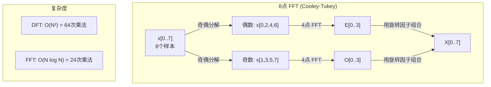
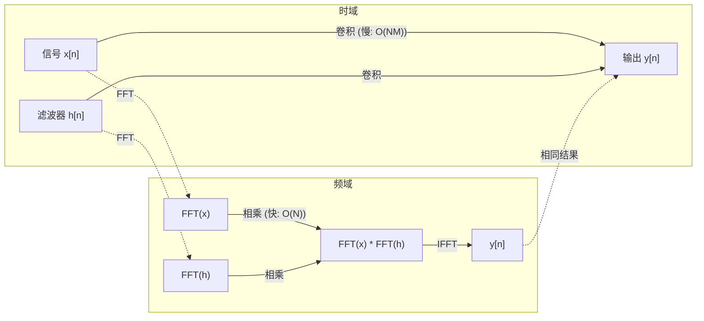

# 傅里叶变换

> 每个信号都是一堆正弦波的和。傅里叶变换告诉你具体是哪些。

**类型：** 构建
**语言：** Python
**先修知识：** 第一阶段，第01-04课，第19课（复数）
**时间：** 约90分钟

## 学习目标

- 从零开始实现离散傅里叶变换 (DFT)，并验证其与 O(N log N) 的 Cooley-Tukey 快速傅里叶变换 (FFT) 结果一致
- 解读频率系数：从信号中提取幅度、相位和功率谱
- 应用卷积定理，通过 FFT 乘法执行卷积运算
- 将傅里叶频率分解与 Transformer 的位置编码和 CNN 的卷积层联系起来

## 问题描述

一段录音是一系列随时间变化的压力测量值。一个股票价格是一系列随时间变化的值。一幅图像是一个在空间上排列的像素强度网格。所有这些数据都属于时域（或空间域）。你看到的是这些值随某个索引的变化。

但许多模式在时域中是隐藏的。这段音频是单音纯音还是和弦？这个股票价格是否有周周期性？这幅图像是否有重复的纹理？这些问题都涉及频率成分，而时域恰恰隐藏了频率信息。

傅里叶变换将数据从时域转换到频域。它接收一个信号，并将其分解为不同频率的正弦波。每个正弦波都有一个幅度（强度）和一个相位（起始点）。傅里叶变换能告诉你这两者。

这对机器学习很重要，因为频域思维无处不在。卷积神经网络 (CNN) 执行卷积运算，这在频域中就是乘法运算。Transformer 的位置编码使用频率分解来表示位置。音频模型（如语音识别、音乐生成）在频谱图上进行操作——频谱图是声音的频率表示。时间序列模型则寻找周期性模式。理解傅里叶变换将为你提供处理所有这些问题的通用语言。

## 核心概念

### DFT 的定义

给定 N 个样本 x[0], x[1], ..., x[N-1]，离散傅里叶变换会生成 N 个频率系数 X[0], X[1], ..., X[N-1]：

```
X[k] = sum_{n=0}^{N-1} x[n] * e^(-2*pi*i*k*n/N)

对于 k = 0, 1, ..., N-1
```

每个 X[k] 都是一个复数。其模 |X[k]| 告诉你频率 k 的幅度。其相位 angle(X[k]) 告诉你该频率的相位偏移。

关键洞察：`e^(-2*pi*i*k*n/N)` 是一个频率为 k 的旋转相量。DFT 计算信号与 N 个等间隔频率中每一个频率的相关性。如果信号在频率 k 处包含能量，相关性就很大；否则，相关性接近于零。

### 每个系数的含义

**X[0]：直流分量。** 这是所有样本的总和——与均值成正比。它代表了信号的恒定（零频率）偏移。

```
X[0] = sum_{n=0}^{N-1} x[n] * e^0 = 所有样本的总和
```

**当 1 <= k <= N/2 时的 X[k]：正频率。** X[k] 表示每 N 个样本中振荡 k 个周期的频率。k 越大，频率越高（振荡越快）。

**X[N/2]：奈奎斯特频率。** 这是在 N 个样本下能表示的最高频率。超过此频率，就会发生混叠——高频伪装成低频。

**当 N/2 < k < N 时的 X[k]：负频率。** 对于实值信号，X[N-k] = conj(X[k])。负频率是正频率的镜像。这就是为什么有用信息集中在前 N/2 + 1 个系数中。

### 逆 DFT

逆 DFT 从频率系数重建原始信号：

```
x[n] = (1/N) * sum_{k=0}^{N-1} X[k] * e^(2*pi*i*k*n/N)

对于 n = 0, 1, ..., N-1
```

与前向 DFT 的唯一区别：指数中的符号为正（而非负），并且多了一个 1/N 的归一化因子。

逆 DFT 可以实现完美的重建。没有任何信息丢失。你可以在时域和频域之间来回转换而不会产生任何误差。DFT 本质上是一种基变换——它只是在一个不同的坐标系中重新表达相同的信息。

### FFT：让它变快

上面定义的 DFT 复杂度为 O(N^2)：对于 N 个输出系数中的每一个，都需要对 N 个输入样本求和。当 N = 100 万时，这就是 10^12 次操作。

快速傅里叶变换 (FFT) 能以 O(N log N) 的复杂度计算出相同的结果。对于 N = 100 万，这大约是 2000 万次操作，而不是一万亿次。这使得频率分析变得实用。

Cooley-Tukey 算法（最常见的 FFT）通过分治法工作：

1.  将信号分解为偶数索引样本和奇数索引样本。
2.  递归计算每一半的 DFT。
3.  使用"旋转因子" e^(-2*pi*i*k/N) 合并两个半尺寸的 DFT。

```
X[k] = E[k] + e^(-2*pi*i*k/N) * O[k]          对于 k = 0, ..., N/2 - 1
X[k + N/2] = E[k] - e^(-2*pi*i*k/N) * O[k]    对于 k = 0, ..., N/2 - 1

其中 E = 对偶数索引样本的 DFT
      O = 对奇数索引样本的 DFT
```

这种对称性意味着递归的每一层都做 O(N) 的工作，总共有 log2(N) 层。总计：O(N log N)。



FFT 要求信号长度是 2 的幂次。在实践中，通常会通过补零将信号填充到下一个 2 的幂次长度。

### 频谱分析

**功率谱** 是 |X[k]|^2——每个频率系数的模的平方。它展示了每个频率上有多少能量。

**相位谱** 是 angle(X[k])——每个频率的相位偏移。对于大多数分析任务，你主要关心功率谱而忽略相位。

```
频率 k 处的功率:  P[k] = |X[k]|^2 = X[k].real^2 + X[k].imag^2
频率 k 处的相位:  phi[k] = atan2(X[k].imag, X[k].real)
```

### 频率分辨率

DFT 的频率分辨率取决于样本数 N 和采样率 fs。

```
频点 k 对应的频率:      f_k = k * fs / N
频率分辨率:            delta_f = fs / N
最大频率:              f_max = fs / 2  (奈奎斯特频率)
```

要分辨两个非常接近的频率，你需要更多的样本。要捕获高频，你需要更高的采样率。

### 卷积定理

这是信号处理中最重要的成果之一，并且与 CNN 直接相关。

**时域的卷积等于频域的点乘。**

```
x * h = IFFT(FFT(x) . FFT(h))

其中 * 是卷积操作，. 是逐元素乘法
```

为什么这很重要：

-   直接对两个长度分别为 N 和 M 的信号进行卷积需要 O(N*M) 次操作。
-   基于 FFT 的卷积只需要 O(N log N) 次操作：对两个信号做 FFT，相乘，再做逆 FFT。
-   对于大核，FFT 卷积会快得多。
-   这正是具有大感受野的卷积层所做的事情。

注意：DFT 计算的是循环卷积（信号会环绕）。对于线性卷积（无环绕），在计算前需要将两个信号补零到长度 N + M - 1。



### 窗函数

DFT 假设信号是周期性的——它将 N 个样本视为一个无限重复信号的一个周期。如果信号的开头和结尾值不相同，就会在边界处产生不连续性，这会在频谱中表现为虚假的高频成分。这被称为频谱泄漏。

通过在计算 DFT 之前将信号两端逐渐锥化至零，窗函数可以减少泄漏。

常见窗函数：

| 窗函数 | 形状 | 主瓣宽度 | 旁瓣电平 | 用途 |
|---|---|---|---|---|
| 矩形窗 | 平坦（无窗） | 最窄 | 最高 (-13 dB) | 信号在 N 个样本内恰好是周期性的 |
| 汉宁窗 | 升余弦 | 中等 | 低 (-31 dB) | 通用频谱分析 |
| 海明窗 | 修正余弦 | 中等 | 更低 (-42 dB) | 音频处理，语音分析 |
| 布莱克曼窗 | 三阶余弦 | 宽 | 非常低 (-58 dB) | 当旁瓣抑制至关重要时 |

```
汉宁窗:    w[n] = 0.5 * (1 - cos(2*pi*n / (N-1)))
海明窗: w[n] = 0.54 - 0.46 * cos(2*pi*n / (N-1))
```

在 DFT 之前，将窗函数与信号逐元素相乘即可应用窗函数：`X = DFT(x * w)`。

### DFT 的性质

| 性质 | 时域 | 频域 |
|---|---|---|
| 线性 | a*x + b*y | a*X + b*Y |
| 时移 | x[n - k] | X[f] * e^(-2*pi*i*f*k/N) |
| 频移 | x[n] * e^(2*pi*i*f0*n/N) | X[f - f0] |
| 卷积 | x * h | X * H (逐点相乘) |
| 乘法 | x * h (逐点相乘) | X * H (循环卷积，缩放 1/N) |
| 帕塞瓦尔定理 | sum \|x[n]\|^2 | (1/N) * sum \|X[k]\|^2 |
| 共轭对称 (实输入) | x[n] 为实数 | X[k] = conj(X[N-k]) |

帕塞瓦尔定理表明，信号的总能量在时域和频域中是相同的。能量在变换中是守恒的。

### 与位置编码的联系

原始的 Transformer 模型使用正弦位置编码：

```
PE(pos, 2i)   = sin(pos / 10000^(2i/d_model))
PE(pos, 2i+1) = cos(pos / 10000^(2i/d_model))
```

每个维度对 (2i, 2i+1) 以不同的频率振荡。这些频率从高（维度 0,1）到低（最后几个维度）呈几何级数分布。这为每个位置在所有频带上提供了一个独特的模式——类似于傅里叶系数如何唯一地标识一个信号。

这提供了几个关键特性：

-   **唯一性：** 没有两个位置具有相同的编码。
-   **值域有界：** sin 和 cos 的值始终在 [-1, 1] 之间。
-   **相对位置：** 位置 p+k 的编码可以表示为位置 p 处编码的线性函数。这使得模型能够学习关注相对位置。

### 与 CNN 的联系

卷积层将学习到的滤波器（核）通过滑窗的方式应用于输入信号或图像。数学上，这就是卷积运算。

根据卷积定理，这等价于：
1.  对输入做 FFT
2.  对卷积核做 FFT
3.  在频域相乘
4.  对结果做 IFFT

标准的 CNN 实现使用直接卷积（对于小的 3x3 核更快）。但对于大核或全局卷积，基于 FFT 的方法会明显更快。一些架构（如 FNet）完全用 FFT 替代了注意力机制，以 O(N log N) 的复杂度（取代了 O(N^2)）实现了有竞争力的精度。

### 频谱图与短时傅里叶变换 (STFT)

单个 FFT 能告诉你整个信号的频率成分，但无法告诉你这些频率何时出现。一个啁啾信号（频率随时间增加的信号）和一个和弦（所有频率同时出现）可以具有相同的幅度谱。

短时傅里叶变换 (STFT) 通过在信号的重叠窗口上计算 FFT 来解决这个问题。其结果是一个**频谱图**：一个二维表示，一维是时间，另一维是频率。每个点的强度表示该频率在该时刻的能量。

```
STFT 过程：
1. 选择窗口大小（例如，1024 个样本）
2. 选择步长（例如，256 个样本——75% 的重叠）
3. 对于每个窗口位置：
   a. 提取窗口内的信号片段
   b. 应用汉宁/海明窗
   c. 计算 FFT
   d. 将幅度谱存储为频谱图的一列
```

频谱图是音频 ML 模型的标准输入表示。语音识别模型（如 Whisper, DeepSpeech）使用**梅尔频谱图**——将频率映射到梅尔刻度的频谱图，这更符合人类的音高感知。

### 混叠

如果信号包含高于 fs/2（奈奎斯特频率）的频率，以 fs 采样就会产生混叠副本。一个 90 Hz 的信号以 100 Hz 采样时，看起来和一个 10 Hz 的信号完全一样。仅从样本中无法区分它们。

```
示例：
  真实信号：90 Hz 正弦波
  采样率：100 Hz
  表观频率：100 - 90 = 10 Hz

  以 100 Hz 采样率采集的 90 Hz 信号的样本，
  与一个 10 Hz 信号的样本是完全相同的。
  任何数学方法都无法恢复原始的 90 Hz 信号。
```

这就是为什么模数转换器包含抗混叠滤波器，在采样前会滤除高于奈奎斯特频率的成分。在机器学习中，当对特征图进行下采样而没有进行适当的低通滤波时，就会出现混叠——一些架构通过使用抗混叠池化层来解决这个问题。

### 补零不能提高分辨率

一个常见的误解：在 FFT 前对信号补零可以提高频率分辨率。这是错误的。补零只是在现有的频率点之间进行插值，使频谱看起来更平滑。但它无法揭示原始样本中不存在的频率细节。

真正的频率分辨率仅取决于观测时长 T = N / fs。要分辨相隔 delta_f 的两个频率，你至少需要 T = 1 / delta_f 秒的数据。任何数量的补零都无法改变这个基本限制。

## 动手实现

### 步骤 1：从零实现 DFT

O(N^2) 的 DFT 直接根据定义实现。

```python
import math

class Complex:
    ...

def dft(x):
    N = len(x)
    result = []
    for k in range(N):
        total = Complex(0, 0)
        for n in range(N):
            angle = -2 * math.pi * k * n / N
            w = Complex(math.cos(angle), math.sin(angle))
            xn = x[n] if isinstance(x[n], Complex) else Complex(x[n])
            total = total + xn * w
        result.append(total)
    return result
```

### 步骤 2：逆 DFT

结构相同，指数为正，最后除以 N。

```python
def idft(X):
    N = len(X)
    result = []
    for n in range(N):
        total = Complex(0, 0)
        for k in range(N):
            angle = 2 * math.pi * k * n / N
            w = Complex(math.cos(angle), math.sin(angle))
            total = total + X[k] * w
        result.append(Complex(total.real / N, total.imag / N))
    return result
```

### 步骤 3：FFT (Cooley-Tukey)

递归的 FFT 要求信号长度是 2 的幂。将其分解为偶数索引和奇数索引部分，递归计算，然后使用旋转因子合并。

```python
def fft(x):
    N = len(x)
    if N <= 1:
        return [x[0] if isinstance(x[0], Complex) else Complex(x[0])]
    if N % 2 != 0:
        # 如果长度不是2的幂，回退到DFT或进行补零处理
        return dft(x)

    even = fft([x[i] for i in range(0, N, 2)])
    odd = fft([x[i] for i in range(1, N, 2)])

    result = [Complex(0, 0)] * N
    for k in range(N // 2):
        angle = -2 * math.pi * k / N
        twiddle = Complex(math.cos(angle), math.sin(angle))
        t = twiddle * odd[k]
        result[k] = even[k] + t
        result[k + N // 2] = even[k] - t
    return result
```

### 步骤 4：频谱分析辅助函数

```python
def power_spectrum(X):
    return [xk.real ** 2 + xk.imag ** 2 for xk in X]

def convolve_fft(x, h):
    N = len(x) + len(h) - 1
    # 找到下一个2的幂次长度
    padded_N = 1
    while padded_N < N:
        padded_N *= 2

    # 补零
    x_padded = x + [0.0] * (padded_N - len(x))
    h_padded = h + [0.0] * (padded_N - len(h))

    X = fft(x_padded)
    H = fft(h_padded)

    # 频域相乘
    Y = [xk * hk for xk, hk in zip(X, H)]

    y = idft(Y)
    return [y[n].real for n in range(N)]
```

## 使用示例

在实际工作中，请使用 numpy 的 FFT，它背后是高度优化的 C 语言库。

```python
import numpy as np

signal = np.sin(2 * np.pi * 5 * np.arange(256) / 256)
spectrum = np.fft.fft(signal)
freqs = np.fft.fftfreq(256, d=1/256)

power = np.abs(spectrum) ** 2

# 只取正频率部分
positive_freqs = freqs[:len(freqs)//2]
positive_power = power[:len(power)//2]
```

用于加窗和更高级的频谱分析：

```python
from scipy.signal import windows, stft

window = windows.hann(256)
windowed_signal = signal * window
spectrum = np.fft.fft(windowed_signal)
```

用于卷积：

```python
from scipy.signal import fftconvolve

result = fftconvolve(signal, kernel, mode='full')
```

用于生成频谱图：

```python
from scipy.signal import stft

frequencies, times, Zxx = stft(signal, fs=sample_rate, nperseg=256)
spectrogram = np.abs(Zxx) ** 2
```

频谱图矩阵的形状为 `(n_frequencies, n_time_frames)`。每一列是某个时间窗口的功率谱。这就是音频 ML 模型作为输入所接收的数据。

## 交付成果

运行 `code/fourier.py` 来生成 `outputs/prompt-spectral-analyzer.md`。

## 练习

1.  **纯音识别。** 创建一个包含单一未知频率（1 到 50 Hz 之间）正弦波的信号，以 128 Hz 采样，持续 1 秒。使用你的 DFT 识别该频率。验证答案是否匹配。然后添加标准差为 0.5 的高斯噪声，并重复实验。噪声如何影响频谱？

2.  **FFT 与 DFT 验证。** 生成长度为 64 的随机信号。计算 DFT (O(N^2)) 和 FFT。验证所有系数在 1e-10 精度内匹配。在长度为 256、512、1024 和 2048 的信号上对两个函数计时。绘制 DFT 时间与 FFT 时间的比率图。

3.  **通过实例验证卷积定理。** 创建信号 x = [1, 2, 3, 4, 0, 0, 0, 0] 和滤波器 h = [1, 1, 1, 0, 0, 0, 0, 0]。通过直接嵌套循环计算它们的循环卷积。然后通过 FFT（变换、相乘、逆变换）计算。验证结果是否匹配。现在，通过适当的补零进行线性卷积。

4.  **窗函数的影响。** 创建一个信号，它是两个非常接近的正弦波（10 Hz 和 12 Hz）的和。以 128 Hz 采样 1 秒。分别使用无窗、汉宁窗和海明窗计算其功率谱。哪个窗函数最容易区分这两个峰值？为什么？

5.  **位置编码分析。** 为 d_model = 128 和 max_pos = 512 生成正弦位置编码。对于每一对位置 (p1, p2)，计算它们编码的点积。证明点积仅取决于 |p1 - p2|，而不是绝对位置。随着距离增加，点积会发生什么变化？

## 关键术语表

| 术语 | 含义 |
|---|---|
| **DFT (离散傅里叶变换)** | 将 N 个时域样本转换为 N 个频域系数。每个系数是信号与该频率复正弦波的相关性 |
| **FFT (快速傅里叶变换)** | 一种 O(N log N) 复杂度的 DFT 算法。Cooley-Tukey 算法递归地拆分奇偶索引 |
| **逆 DFT** | 从频率系数重建时域信号。公式与 DFT 相同，但指数符号相反并带有 1/N 缩放 |
| **频率点** | DFT 输出中的每个索引 k 代表频率 k*fs/N Hz。这个离散的频率槽称为"点" |
| **直流分量** | X[0]，零频率系数。与信号均值成正比 |
| **奈奎斯特频率** | fs/2，在采样率 fs 下能表示的最高频率。高于此的频率会发生混叠 |
| **功率谱** | \|X[k]\|^2，每个频率系数的模的平方。展示能量在频率上的分布 |
| **相位谱** | angle(X[k])，每个频率分量的相位偏移。分析中常被忽略 |
| **频谱泄漏** | 由将非周期信号视为周期性信号处理而产生的虚假频率成分。通过加窗减少 |
| **窗函数** | 在 DFT 前应用的锥形函数（汉宁窗、海明窗、布莱克曼窗），用于减少频谱泄漏 |
| **旋转因子** | 在 FFT 的蝶形运算中用于组合子 DFT 的复指数 e^(-2*pi*i*k/N) |
| **卷积定理** | 时域的卷积等于频域的逐点乘法。是信号处理和 CNN 的基础 |
| **循环卷积** | 信号会环绕的卷积。这是 DFT 自然计算的卷积类型 |
| **线性卷积** | 标准无环绕的卷积。通过在 DFT 前补零实现 |
| **帕塞瓦尔定理** | 总能量在傅里叶变换前后守恒。sum \|x[n]\|^2 = (1/N) sum \|X[k]\|^2 |
| **混叠** | 由于采样率不足，高于奈奎斯特频率的频率会表现为较低频率的现象 |

## 延伸阅读

-   [Cooley & Tukey: An Algorithm for the Machine Calculation of Complex Fourier Series (1965)](https://www.ams.org/journals/mcom/1965-19-090/S0025-5718-1965-0178586-1/) - 改变了计算的原始 FFT 论文
-   [3Blue1Brown: 什么是傅里叶变换？](https://www.youtube.com/watch?v=spUNpyF58BY) - 最好的傅里叶变换可视化介绍
-   [Lee-Thorp et al.: FNet: Mixing Tokens with Fourier Transforms (2021)](https://arxiv.org/abs/2105.03824) - 在 Transformer 中用 FFT 替代自注意力
-   [Smith: The Scientist and Engineer's Guide to Digital Signal Processing](http://www.dspguide.com/) - 免费在线教科书，深入涵盖 FFT、窗函数和频谱分析
-   [Vaswani et al.: Attention Is All You Need (2017)](https://arxiv.org/abs/1706.03762) - 源自傅里叶频率分解的正弦位置编码
-   [Radford et al.: Whisper (2022)](https://arxiv.org/abs/2212.04356) - 使用梅尔频谱图作为输入表示的语音识别