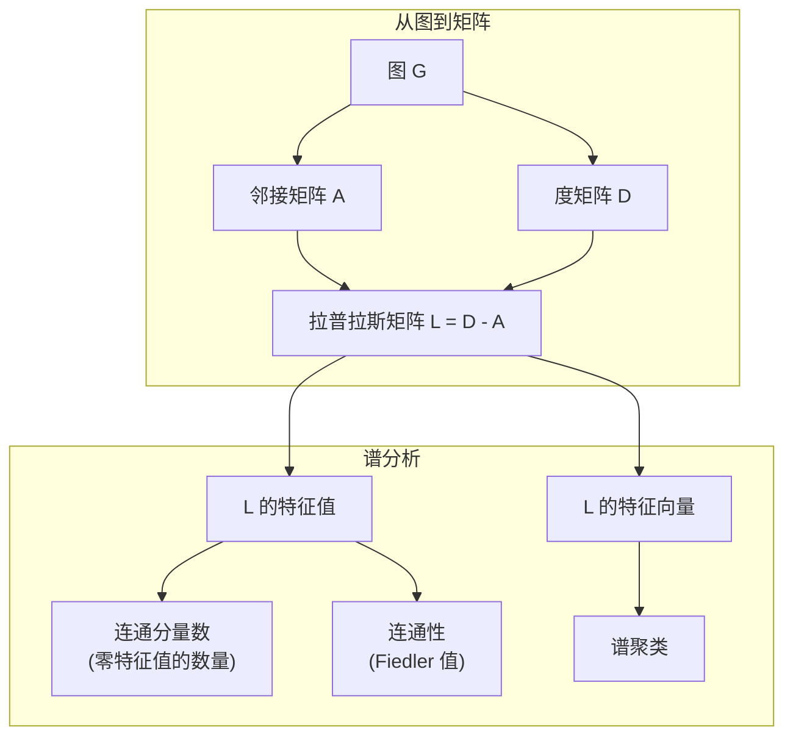
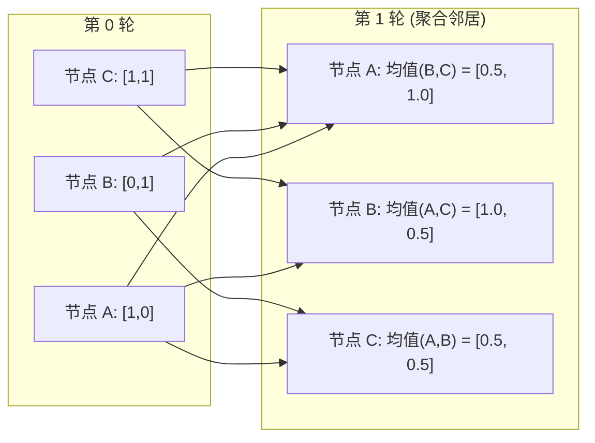

# 面向机器学习的图论

> 图是表达关系的数据结构。如果你的数据存在连接关系，你就需要图论。

**类型：** 构建
**语言：** Python
**先修知识：** 第一阶段，第01-03课（线性代数、矩阵）
**时间：** 约90分钟

## 学习目标

- 构建一个使用邻接矩阵/邻接表表示的图类，并实现广度优先搜索 (BFS) 和深度优先搜索 (DFS) 遍历
- 计算图拉普拉斯矩阵，并利用其特征值检测连通分量并对节点进行聚类
- 将一轮图神经网络 (GNN) 风格的消息传递实现为归一化邻接矩阵乘法
- 应用谱聚类，通过 Fiedler 向量对图进行划分

## 问题描述

社交网络、分子、知识图谱、引文网络、交通路线图——这些都是图。传统的机器学习将数据视为扁平表格，每一行是独立的，每一列是一个特征。但当连接的结构承载着重要信息时，表格就失效了。

考虑一个社交网络。你想预测一个用户会买什么产品。他们自己的购买历史很重要，但朋友的购买历史可能更重要。连接本身携带着信号。

或者考虑一个分子。你想预测它是否能与某种蛋白质结合。原子很重要，但真正关键的是原子之间如何成键。结构本身就是数据。

图神经网络 (GNN) 是深度学习领域发展最快的方向。它们支撑着药物发现、社交推荐、欺诈检测和知识图谱推理。每一个 GNN 都建立在同一个基础之上：基础的图论。

你需要掌握四个核心内容：
1.  一种将图表示为矩阵的方法（以便进行矩阵乘法）
2.  用于探索图结构的遍历算法
3.  拉普拉斯矩阵——谱图理论中最重要的矩阵
4.  消息传递——使 GNN 能够工作的核心运算

## 核心概念

### 图：节点与边

一个图 G = (V, E) 由顶点（节点）V 和边 E 组成。每条边连接两个节点。

**有向图 vs 无向图。** 在无向图中，边 (u, v) 意味着 u 连接到 v，并且 v 也连接到 u。在有向图中，边 (u, v) 意味着 u 指向 v，但反过来不一定成立。

**加权图 vs 无权图。** 在无权图中，边要么存在，要么不存在。在加权图中，每条边都有一个数值权重——可以是距离、成本或强度。

| 图类型 | 示例 |
|---|---|
| 无向、无权 | Facebook 好友网络 |
| 有向、无权 | Twitter 关注网络 |
| 无向、加权 | 公路地图（距离） |
| 有向、加权 | 网页链接（PageRank 分数） |

### 邻接矩阵

邻接矩阵 A 是核心表示。对于一个有 n 个节点的图：

```
A[i][j] = 1    如果存在从节点 i 到节点 j 的边
A[i][j] = 0    否则
```

对于无向图，A 是对称的：A[i][j] = A[j][i]。对于加权图，A[i][j] = 边 (i, j) 的权重。

**示例——一个三角形：**

```
节点: 0, 1, 2
边: (0,1), (1,2), (0,2)

A = [[0, 1, 1],
     [1, 0, 1],
     [1, 1, 0]]
```

邻接矩阵是每个 GNN 的输入。对 A 进行矩阵运算，就相当于对图进行操作。

### 度

一个节点的度是与其相连的边的数量。对于有向图，有入度（指向它的边）和出度（从它出发的边）。

度矩阵 D 是对角矩阵：

```
D[i][i] = 节点 i 的度
D[i][j] = 0    当 i != j
```

对于三角形示例：D = diag(2, 2, 2)，因为每个节点都连接到其他两个节点。

度可以告诉你节点的重要性。高度数 = 枢纽节点。网络的度分布揭示了其结构。社交网络遵循幂律分布（少数枢纽，大量叶子节点）。随机图的度呈泊松分布。

### BFS 与 DFS

这是两个基本的图遍历算法，你都需要掌握。

**广度优先搜索：** 首先探索所有邻居，然后再探索邻居的邻居。使用队列（先进先出）。

```
从节点 0 开始 BFS:
  访问 0
  队列: [1, 2]        (0 的邻居)
  访问 1
  队列: [2, 3]        (加入 1 的邻居)
  访问 2
  队列: [3]           (2 的邻居已访问过)
  访问 3
  队列: []            (完成)
```

BFS 可以找到无权图中的最短路径。从起点到任意节点的距离等于该节点首次被发现时的 BFS 层级。这就是为什么 BFS 被用于社交网络中的跳数距离计算。

**深度优先搜索：** 在回溯之前，尽可能深入地探索。使用栈（后进先出）或递归。

```
从节点 0 开始 DFS:
  访问 0
  栈: [1, 2]          (0 的邻居)
  访问 2              (从栈中弹出)
  栈: [1, 3]          (加入 2 的邻居)
  访问 3              (从栈中弹出)
  栈: [1]
  访问 1              (从栈中弹出)
  栈: []              (完成)
```

DFS 的用途包括：
- 查找连通分量（从未访问的节点开始 DFS）
- 检测环（DFS 树中的反向边）
- 拓扑排序（DFS 完成顺序的反向）

| 算法 | 数据结构 | 查找目标 | 用例 |
|---|---|---|---|
| BFS | 队列 | 最短路径 | 社交网络距离、知识图谱遍历 |
| DFS | 栈 | 连通分量、环 | 连通性分析、拓扑排序 |

### 图拉普拉斯矩阵

L = D - A。这是谱图理论中最重要的矩阵。

对于三角形示例：

```
D = [[2, 0, 0],    A = [[0, 1, 1],    L = [[2, -1, -1],
     [0, 2, 0],         [1, 0, 1],         [-1, 2, -1],
     [0, 0, 2]]         [1, 1, 0]]         [-1, -1,  2]]
```

拉普拉斯矩阵具有非凡的性质：

1.  **L 是半正定的。** 所有特征值都 >= 0。

2.  **零特征值的数量等于连通分量的数量。** 一个连通图恰好有一个零特征值。一个有 3 个不连通分量的图有三个零特征值。

3.  **最小的非零特征值（Fiedler 值）衡量图的连通性。** Fiedler 值大意味着图是良好连通的。Fiedler 值小意味着图存在薄弱点——一个瓶颈。

4.  **Fiedler 值对应的特征向量（Fiedler 向量）揭示了最佳划分方式。** 特征值为正的节点归为一组，为负的节点归为另一组。这就是谱聚类。



### 谱性质

邻接矩阵和拉普拉斯矩阵的特征值无需任何遍历就能揭示图的结构性质。

**谱聚类** 的工作原理如下：
1.  计算拉普拉斯矩阵 L
2.  找到 L 的 k 个最小特征值对应的特征向量（跳过第一个，对于连通图它是全1向量）
3.  将这些特征向量作为每个节点的新坐标
4.  在这些新坐标上运行 k-means 算法

为什么这有效？L 的特征向量编码了图上“最平滑”的函数。连接紧密的节点会得到相似的特征向量值。被瓶颈分隔的节点会得到不同的值。特征向量自然地分离了不同的聚类。

**随机游走联系。** 归一化的拉普拉斯矩阵与图上的随机游走有关。随机游走的平稳分布与节点的度成正比。混合时间（游走收敛的速度）取决于谱间隙。

### 消息传递

这是图神经网络的核心运算。每个节点从其邻居收集消息，聚合它们，并更新自己的状态。

```
h_v^(k+1) = UPDATE(h_v^(k), AGGREGATE({h_u^(k) : u in neighbors(v)}))
```

在最简单的形式中，AGGREGATE 是求均值，UPDATE 是线性变换加激活函数：

```
h_v^(k+1) = sigma(W * mean({h_u^(k) : u in neighbors(v)}))
```

这实际上是矩阵乘法。如果 H 是所有节点特征的矩阵，A 是邻接矩阵：

```
H^(k+1) = sigma(A_norm * H^(k) * W)
```

其中 A_norm 是归一化的邻接矩阵（每行之和为 1）。

一轮消息传递让每个节点能“看到”它的直接邻居。两轮能让它看到邻居的邻居。K 轮后，每个节点就能获得其 K 跳邻域内的信息。



### 核心概念与机器学习应用

| 概念 | 机器学习应用 |
|---|---|
| 邻接矩阵 | GNN 的输入表示 |
| 图拉普拉斯矩阵 | 谱聚类、社区发现 |
| BFS/DFS | 知识图谱遍历、路径查找 |
| 度分布 | 节点重要性、特征工程 |
| 消息传递 | GNN 层 (GCN, GAT, GraphSAGE) |
| L 的特征值 | 社区发现、图分割 |
| 谱聚类 | 无监督节点分组 |
| PageRank | 节点重要性、网页搜索 |

## 动手实现

### 步骤 1：从零开始实现图类

```python
class Graph:
    def __init__(self, n_nodes, directed=False):
        self.n = n_nodes
        self.directed = directed
        self.adj = {i: {} for i in range(n_nodes)}

    def add_edge(self, u, v, weight=1.0):
        self.adj[u][v] = weight
        if not self.directed:
            self.adj[v][u] = weight

    def neighbors(self, node):
        return list(self.adj[node].keys())

    def degree(self, node):
        return len(self.adj[node])

    def adjacency_matrix(self):
        import numpy as np
        A = np.zeros((self.n, self.n))
        for u in range(self.n):
            for v, w in self.adj[u].items():
                A[u][v] = w
        return A

    def degree_matrix(self):
        import numpy as np
        D = np.zeros((self.n, self.n))
        for i in range(self.n):
            D[i][i] = self.degree(i)
        return D

    def laplacian(self):
        return self.degree_matrix() - self.adjacency_matrix()
```

邻接表 `self.adj` 可以高效地存储邻居。邻接矩阵转换使用 numpy，因为所有谱运算都需要它。

### 步骤 2：BFS 和 DFS

```python
from collections import deque

def bfs(graph, start):
    visited = set()
    order = []
    distances = {}
    queue = deque([(start, 0)])
    visited.add(start)
    while queue:
        node, dist = queue.popleft()
        order.append(node)
        distances[node] = dist
        for neighbor in graph.neighbors(node):
            if neighbor not in visited:
                visited.add(neighbor)
                queue.append((neighbor, dist + 1))
    return order, distances


def dfs(graph, start):
    visited = set()
    order = []
    stack = [start]
    while stack:
        node = stack.pop()
        if node in visited:
            continue
        visited.add(node)
        order.append(node)
        for neighbor in reversed(graph.neighbors(node)):
            if neighbor not in visited:
                stack.append(neighbor)
    return order
```

BFS 使用双端队列 (deque) 来实现 O(1) 的左端弹出。DFS 使用列表作为栈。两者都精确访问每个节点一次——时间复杂度为 O(V + E)。

### 步骤 3：连通分量与拉普拉斯特征值

```python
def connected_components(graph):
    visited = set()
    components = []
    for node in range(graph.n):
        if node not in visited:
            order, _ = bfs(graph, node)
            visited.update(order)
            components.append(order)
    return components


def laplacian_eigenvalues(graph):
    import numpy as np
    L = graph.laplacian()
    eigenvalues = np.linalg.eigvalsh(L)
    return eigenvalues
```

`eigvalsh` 用于对称矩阵——无向图的拉普拉斯矩阵总是对称的。它按升序返回特征值。统计零的个数即可得到连通分量的数量。

### 步骤 4：谱聚类

```python
def spectral_clustering(graph, k=2):
    import numpy as np
    L = graph.laplacian()
    eigenvalues, eigenvectors = np.linalg.eigh(L)
    # 使用第1到第k个特征向量（跳过全1向量）
    features = eigenvectors[:, 1:k+1]

    # 对于 k=2，一个简单的划分是基于 Fiedler 向量的符号
    labels = np.zeros(graph.n, dtype=int)
    for i in range(graph.n):
        if features[i, 0] >= 0:
            labels[i] = 0
        else:
            labels[i] = 1
    return labels
```

对于 k=2，Fiedler 向量的符号将图分为两个聚类。对于 k>2，你需要在头 k 个特征向量（不包括平凡的全1特征向量）上运行 k-means 算法。

### 步骤 5：消息传递

```python
def message_passing(graph, features, weight_matrix):
    import numpy as np
    A = graph.adjacency_matrix()
    # 行归一化
    row_sums = A.sum(axis=1, keepdims=True)
    row_sums[row_sums == 0] = 1
    A_norm = A / row_sums
    # 聚合邻居特征
    aggregated = A_norm @ features
    # 线性变换
    output = aggregated @ weight_matrix
    return output
```

这是一轮 GNN 的消息传递。每个节点的新特征是它邻居特征的加权平均值，再经过权重矩阵的线性变换。堆叠多轮可以将信息传播得更远。

## 使用示例

使用 networkx 和 numpy，同样的操作只需一行代码：

```python
import networkx as nx
import numpy as np

G = nx.karate_club_graph()

A = nx.adjacency_matrix(G).toarray()
L = nx.laplacian_matrix(G).toarray()

eigenvalues = np.linalg.eigvalsh(L.astype(float))
print(f"最小的几个特征值: {eigenvalues[:5]}")
print(f"连通分量数: {nx.number_connected_components(G)}")

# 使用贪婪模块度最大化发现社区
communities = nx.community.greedy_modularity_communities(G)
print(f"发现的社区数量: {len(communities)}")

pr = nx.pagerank(G)
top_nodes = sorted(pr.items(), key=lambda x: x[1], reverse=True)[:5]
print(f"PageRank 前 5 的节点: {top_nodes}")
```

networkx 使用优化的 C 后端，可以处理任意规模的图。在生产环境中使用它。而你手写的实现则用于理解其背后的原理。

### 使用 numpy 进行谱分析

```python
import numpy as np

A = np.array([
    [0, 1, 1, 0, 0],
    [1, 0, 1, 0, 0],
    [1, 1, 0, 1, 0],
    [0, 0, 1, 0, 1],
    [0, 0, 0, 1, 0]
])

D = np.diag(A.sum(axis=1))
L = D - A

eigenvalues, eigenvectors = np.linalg.eigh(L)
print(f"特征值: {np.round(eigenvalues, 4)}")
print(f"Fiedler 值: {eigenvalues[1]:.4f}")
print(f"Fiedler 向量: {np.round(eigenvectors[:, 1], 4)}")

fiedler = eigenvectors[:, 1]
group_a = np.where(fiedler >= 0)[0]
group_b = np.where(fiedler < 0)[0]
print(f"聚类 A: {group_a}")
print(f"聚类 B: {group_b}")
```

Fiedler 向量承担了主要工作。正条目分在一组，负条目分在另一组。无需迭代优化——只需一次特征分解。

## 交付成果

本课程产出：
- `outputs/skill-graph-analysis.md` —— 一份用于分析图结构数据的技能参考。

## 关键联系

| 概念 | 应用场景 |
|---|---|
| 邻接矩阵 | GCN, GAT, GraphSAGE 的输入 |
| 拉普拉斯矩阵 | 谱聚类, ChebNet 滤波器 |
| BFS | 知识图谱遍历, 最短路径查询 |
| 消息传递 | 每一层 GNN, 神经消息传递 |
| 谱间隙 | 图连通性, 随机游走的混合时间 |
| 度分布 | 幂律网络, 节点特征工程 |
| 连通分量 | 数据预处理, 处理不连通图 |
| PageRank | 节点重要性排序, 注意力机制初始化 |

GNN 值得特别提及。GCN (Kipf & Welling, 2017) 中的图卷积运算使用了带自环的邻接矩阵，A_hat = A + I：

```text
H^(l+1) = sigma(D_hat^(-1/2) * A_hat * D_hat^(-1/2) * H^(l) * W^(l))
```

其中 A_hat = A + I（邻接矩阵加自环），D_hat 是 A_hat 的度矩阵。自环确保节点在聚合时包含自身的特征。这正是带有对称归一化的消息传递。D_hat^(-1/2) * A_hat * D_hat^(-1/2) 就是归一化的邻接矩阵。拉普拉斯矩阵也出现在这里，因为这个归一化与 L_sym = I - D^(-1/2) * A * D^(-1/2) 有关。理解了拉普拉斯矩阵，就能理解 GCN 为何有效。

## 练习

1.  **从零实现 PageRank。** 从均匀分数开始。每一步：score(v) = (1-d)/n + d * sum(score(u)/out_degree(u))，对所有指向 v 的 u 求和。使用 d=0.85。运行直到收敛（变化 < 1e-6）。在一个小的网页图上测试。

2.  **使用谱聚类发现社区。** 创建一个具有两个明显分离簇的图（例如，两个团块通过一条边连接）。运行谱聚类并验证它找到了正确的划分。当你增加更多跨簇的边时会发生什么？

3.  **实现 Dijkstra 算法** 用于加权图中的最短路径。将结果与在具有均匀权重的同一图上运行的 BFS 进行比较。

4.  **构建一个 2 层消息传递网络。** 使用不同的权重矩阵应用两次消息传递。证明在 2 轮之后，每个节点都从其 2 跳邻域获得了信息。

5.  **分析一个真实世界的图。** 使用空手道俱乐部图（34 个节点，78 条边）。计算度分布、拉普拉斯特征值和谱聚类。将谱聚类结果与已知的真实划分进行比较。

## 关键术语表

| 术语 | 人们通常说 | 实际含义 |
|---|---|---|
| 图 | "节点和边" | 一个数学结构 G=(V,E)，用于编码成对关系 |
| 邻接矩阵 | "连接表" | 一个 n x n 的矩阵，A[i][j] = 1 表示节点 i 和 j 相连 |
| 度 | "节点的连接数" | 与一个节点相连的边的数量 |
| 拉普拉斯矩阵 | "D 减 A" | L = D - A，其特征值揭示图结构的矩阵 |
| Fiedler 值 | "代数连通度" | L 的最小非零特征值，衡量图的整体连通程度 |
| BFS | "逐层搜索" | 在深入探索之前先访问所有邻居的遍历方法，用于寻找最短路径 |
| DFS | "先深后广" | 在回溯之前沿着一条路径尽可能深入的遍历方法 |
| 消息传递 | "节点与邻居通信" | 每个节点从其邻居聚合信息的过程，是 GNN 的核心 |
| 谱聚类 | "通过特征向量聚类" | 使用拉普拉斯矩阵的特征向量来划分图 |
| 连通分量 | "一个独立的片段" | 一个最大的子图，其中任意两个节点都可通过路径相连 |

## 延伸阅读

- **Kipf & Welling (2017)** —— "Semi-Supervised Classification with Graph Convolutional Networks." 这篇论文开启了现代 GNN 的时代。它展示了谱图卷积如何简化为消息传递。
- **Spielman (2012)** —— "Spectral Graph Theory" 讲义。关于拉普拉斯矩阵、谱间隙和图划分的权威介绍。
- **Hamilton (2020)** —— "Graph Representation Learning." 涵盖从基础到应用的 GNN 专著。
- **Bronstein et al. (2021)** —— "Geometric Deep Learning: Grids, Groups, Graphs, Geodesics, and Gauges." 统一几何深度学习框架的论文。
- **Veličković et al. (2018)** —— "Graph Attention Networks." 通过注意力机制扩展消息传递。