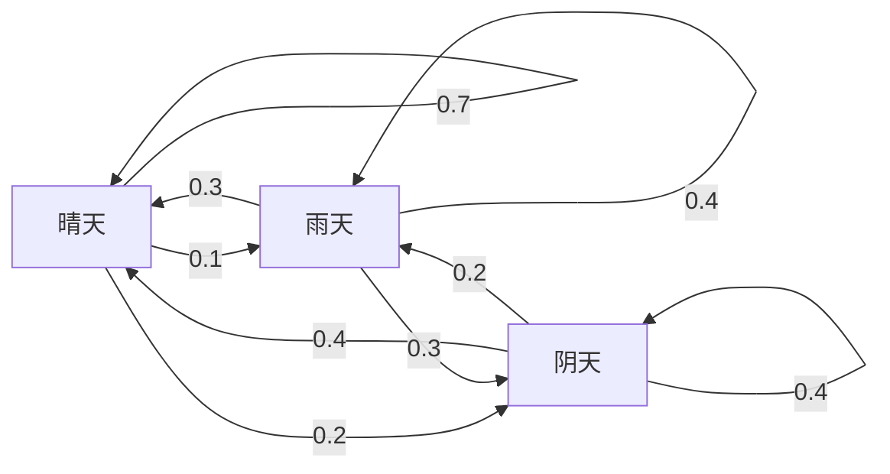
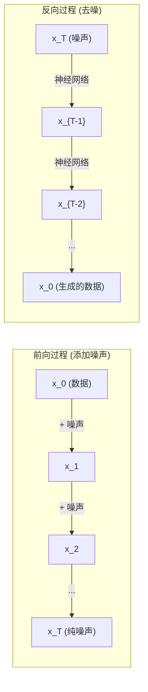

# 随机过程

> 具有结构的随机性。随机游走、马尔可夫链和扩散模型背后的数学。

**类型：** 学习
**语言：** Python
**先修知识：** 第一阶段，第06-07课（概率论、贝叶斯定理）
**时间：** 约75分钟

## 学习目标

- 模拟一维和二维随机游走，并验证位移的平方根（sqrt(n)）标度关系
- 构建马尔可夫链模拟器，并通过特征分解计算其平稳分布
- 实现用于从目标分布中抽样的 Metropolis-Hastings MCMC 和 Langevin 动力学
- 将前向扩散过程与布朗运动联系起来，并解释反向过程如何生成数据

## 问题描述

许多人工智能系统都涉及随时间演变的随机性。这不是静态的随机性，而是结构化的、序列化的随机性，其中每一步都依赖于之前的结果。

语言模型逐个生成标记。每个标记都依赖于之前的上下文。模型输出一个概率分布，从中进行采样，然后继续。这就是一个随机过程。

扩散模型逐步向图像添加噪声，直到其变成纯粹的静态噪声。然后，它们反转这个过程，逐步去噪，直到生成一幅新的图像。前向过程是一个马尔可夫链。反向过程是一个学习到的、逆向运行的马尔可夫链。

强化学习智能体在环境中采取行动。每个行动都会以一定的概率导致一个新状态。智能体在一个随机的世界中遵循一个随机策略。整个过程就是一个马尔可夫决策过程。

MCMC 采样——贝叶斯推断的支柱——构建一个马尔可夫链，其平稳分布就是你想要采样的后验分布。

所有这些都建立在四个基础思想之上：
1.  随机游走——最简单的随机过程
2.  马尔可夫链——具有转移矩阵的结构化随机性
3.  Langevin 动力学——带噪声的梯度下降
4.  Metropolis-Hastings——从任意分布中采样

## 核心概念

### 随机游走

从位置 0 开始。每一步，抛一枚均匀硬币。正面：向右移动 (+1)。反面：向左移动 (-1)。

经过 n 步之后，你的位置是 n 个随机 +/-1 值的总和。期望位置是 0（游走是无偏的）。但与原点的期望距离以 sqrt(n) 的速度增长。

这有违直觉。游走是公平的——不会偏向任何一方。但随着时间的推移，它会越走越远。n 步后的标准差是 sqrt(n)。

```
第 0 步:  位置 = 0
第 1 步:  位置 = +1 或 -1
第 2 步:  位置 = +2, 0, 或 -2
...
第 100 步: 与原点的期望距离 ≈ 10 (sqrt(100))
第 10000 步: 与原点的期望距离 ≈ 100 (sqrt(10000))
```

**在二维中**，游走以相等的概率向上、下、左、右移动。与原点的距离同样遵循 sqrt(n) 标度。路径描绘出类似分形的图案。

**为什么是 sqrt(n)？** 每一步以相等的概率为 +1 或 -1。经过 n 步后，位置 S_n = X_1 + X_2 + ... + X_n，其中每个 X_i 为 +/-1。每一步的方差为 1，且步与步之间独立，因此 Var(S_n) = n。标准差 = sqrt(n)。根据中心极限定理，S_n / sqrt(n) 收敛于标准正态分布。

这种 sqrt(n) 标度在机器学习中随处可见。随机梯度下降的噪声规模与 1/sqrt(batch_size) 成正比。嵌入维度与 sqrt(d) 成正比。平方根是独立随机累加的标志。

**与布朗运动的联系。** 考虑一个随机游走，其步长为 1/sqrt(n)，每单位时间走 n 步。当 n 趋于无穷大时，该游走收敛于布朗运动 B(t)——一个连续时间过程，其中 B(t) 服从均值为 0、方差为 t 的正态分布。

布朗运动是扩散的数学基础。它模拟了流体中粒子的随机抖动、股票价格的波动，以及——至关重要的是——扩散模型中的噪声过程。

**赌徒破产问题。** 一个从位置 k 开始的随机游走者，在 0 和 N 处有吸收壁。它在到达 0 之前到达 N 的概率是多少？对于公平游走：P(到达 N) = k/N。这出奇地简单和优雅。它与鞅理论相关——公平随机游走是一个鞅（未来期望值等于当前值）。

### 马尔可夫链

马尔可夫链是一个根据固定概率在状态之间转换的系统。关键属性：下一个状态仅取决于当前状态，而不取决于历史。

```
P(X_{t+1} = j | X_t = i, X_{t-1} = ...) = P(X_{t+1} = j | X_t = i)
```

这就是马尔可夫性质。这意味着你可以用一个转移矩阵 P 来描述整个动态过程：

```
P[i][j] = 从状态 i 转移到状态 j 的概率
```

P 的每一行之和为 1（必须转移到某个状态）。

**示例——天气：**

```
状态: 晴天 (0), 雨天 (1), 阴天 (2)

P = [[0.7, 0.1, 0.2],    (如果晴天: 70% 晴天, 10% 雨天, 20% 阴天)
     [0.3, 0.4, 0.3],    (如果雨天: 30% 晴天, 40% 雨天, 30% 阴天)
     [0.4, 0.2, 0.4]]    (如果阴天: 40% 晴天, 20% 雨天, 40% 阴天)
```

从任何状态开始。经过多次转移后，状态分布会收敛到平稳分布 π，其中 π * P = π。这是 P 对应特征值为 1 的左特征向量。

对于天气链，平稳分布可能是 [0.53, 0.18, 0.29]——从长远来看，无论初始状态如何，天气有 53% 的时间是晴天。



**计算平稳分布。** 有两种方法：

1.  **幂法：** 将任意初始分布反复乘以 P。经过足够多次迭代后，它会收敛。
2.  **特征值方法：** 找到 P 对应特征值为 1 的左特征向量。即 P^T 对应特征值为 1 的特征向量。

两种方法都需要链满足收敛条件。

**收敛条件。** 如果一个马尔可夫链满足以下条件，则它会收敛到唯一的平稳分布：
-   **不可约：** 每个状态都可以从其他任何状态到达。
-   **非周期性：** 链不会以固定的周期循环。

你在机器学习中遇到的大多数链都满足这两个条件。

**吸收状态。** 如果一个状态一旦进入就再也无法离开，则它是吸收状态（P[i][i] = 1）。吸收马尔可夫链用于建模具有终止状态的过程——游戏结束、客户流失、标记序列遇到结束符。

**混合时间。** 链需要多少步才能"接近"平稳分布？形式化地说，是总变差距离降至某个阈值以下所需的步数。快速混合 = 所需步数少。P 的谱隙（1 减去第二大的特征值）控制着混合时间。隙越大 = 混合越快。

### 与语言模型的联系

语言模型中的标记生成近似于一个马尔可夫过程。给定当前上下文，模型输出下一个标记上的分布。温度参数控制着分布的尖锐程度：

```
P(token_i) = exp(logit_i / temperature) / sum(exp(logit_j / temperature))
```

-   温度 = 1.0：标准分布
-   温度 < 1.0：更尖锐（更确定性）
-   温度 > 1.0：更平坦（更随机）
-   温度 -> 0：取最大值（贪心）

Top-k 采样截断为概率最高的 k 个标记。Top-p（核）采样截断为累积概率超过 p 的最小标记集。两者都修改了马尔可夫的转移概率。

### 布朗运动

随机游走在连续时间下的极限。位置 B(t) 有三个性质：
1.  B(0) = 0
2.  B(t) - B(s) 服从均值为 0、方差为 t - s 的正态分布（对于 t > s）
3.  非重叠区间上的增量是独立的

布朗运动是连续的，但处处不可微——它在每个尺度上都在抖动。其路径在平面上的分形维数为 2。

在离散模拟中，你可以通过以下方式近似布朗运动：

```
B(t + dt) = B(t) + sqrt(dt) * z,    其中 z ~ N(0, 1)
```

sqrt(dt) 的标度很重要。它来自于应用于随机游走的中心极限定理。

### Langevin 动力学

梯度下降用于寻找函数的最小值。Langevin 动力学用于寻找与 exp(-U(x)/T) 成比例的概率分布，其中 U 是能量函数，T 是温度。

```
x_{t+1} = x_t - dt * gradient(U(x_t)) + sqrt(2 * T * dt) * z_t
```

有两股力作用在粒子上：
1.  **梯度力** (-dt * gradient(U))：将粒子推向低能量区域（类似于梯度下降）
2.  **随机力** (sqrt(2*T*dt) * z)：将粒子推向随机方向（探索）

在温度 T = 0 时，这纯粹是梯度下降。在高温下，它几乎是一个随机游走。在合适的温度下，粒子会探索能量景观，并在低能量区域停留更长时间。

**与扩散模型的联系。** 扩散模型的前向过程是：

```
x_t = sqrt(alpha_t) * x_{t-1} + sqrt(1 - alpha_t) * noise
```

这是一个马尔可夫链，逐渐将数据与噪声混合。经过足够多的步骤后，x_T 变成了纯高斯噪声。

反向过程——从噪声回到数据——也是一个马尔可夫链，但其转移概率是由一个神经网络学习得到的。该网络学习预测每一步添加的噪声，然后将其减去。



### MCMC：马尔可夫链蒙特卡洛方法

有时，你需要从一个分布 p(x) 中采样，该分布你可以计算其值（最多差一个常数），但无法直接采样。贝叶斯后验是典型的例子——你知道似然乘以先验，但归一化常数是难以处理的。

**Metropolis-Hastings** 构建了一个马尔可夫链，其平稳分布就是 p(x)：

1.  从某个位置 x 开始
2.  从提议分布 Q(x'|x) 中提议一个新的位置 x'
3.  计算接受率：a = p(x') * Q(x|x') / (p(x) * Q(x'|x))
4.  以概率 min(1, a) 接受 x'。否则停留在 x。
5.  重复。

如果 Q 是对称的（例如，Q(x'|x) = Q(x|x') = N(x, sigma^2)），则该比率简化为 a = p(x') / p(x)。你只需要概率的比率——归一化常数会抵消。

在温和条件下，该链保证收敛到 p(x)。但如果提议步长太小（随机游走行为）或太大（高拒绝率），收敛可能会很慢。调整提议分布是 MCMC 的艺术。

**为什么它能工作。** 接受率确保了细致平衡：处于 x 并移动到 x' 的概率等于处于 x' 并移动到 x 的概率。细致平衡意味着 p(x) 是链的平稳分布。因此，经过足够多的步数后，样本来自 p(x)。

**实践考虑：**
-   **预烧期：** 丢弃前 N 个样本。链需要时间从其起点达到平稳分布。
-   **稀疏化：** 每隔 k 个样本保留一个，以减少自相关性。
-   **多条链：** 从不同的起点运行多条链。如果它们收敛到相同的分布，你就有了收敛的证据。
-   **接受率：** 对于 d 维空间中的高斯提议，最优接受率约为 23%（Roberts & Rosenthal, 2001）。太高意味着链几乎不动。太低意味着它拒绝了一切。

### 人工智能中的随机过程

| 过程 | 人工智能应用 |
|---|---|
| 随机游走 | 强化学习中的探索、Node2Vec 嵌入 |
| 马尔可夫链 | 文本生成、MCMC 采样 |
| 布朗运动 | 扩散模型（前向过程） |
| Langevin 动力学 | 基于分数的生成模型、SGLD |
| 马尔可夫决策过程 | 强化学习 |
| Metropolis-Hastings | 贝叶斯推断、后验采样 |

## 动手实现

### 步骤 1：随机游走模拟器

```python
import numpy as np

def random_walk_1d(n_steps, seed=None):
    rng = np.random.RandomState(seed)
    steps = rng.choice([-1, 1], size=n_steps)
    positions = np.concatenate([[0], np.cumsum(steps)])
    return positions


def random_walk_2d(n_steps, seed=None):
    rng = np.random.RandomState(seed)
    directions = rng.choice(4, size=n_steps)
    dx = np.zeros(n_steps)
    dy = np.zeros(n_steps)
    dx[directions == 0] = 1   # 右
    dx[directions == 1] = -1  # 左
    dy[directions == 2] = 1   # 上
    dy[directions == 3] = -1  # 下
    x = np.concatenate([[0], np.cumsum(dx)])
    y = np.concatenate([[0], np.cumsum(dy)])
    return x, y
```

一维游走存储累积和。每一步是 +1 或 -1。经过 n 步后，位置就是和。方差随 n 线性增长，因此标准差随 sqrt(n) 增长。

### 步骤 2：马尔可夫链

```python
class MarkovChain:
    def __init__(self, transition_matrix, state_names=None):
        self.P = np.array(transition_matrix, dtype=float)
        self.n_states = len(self.P)
        self.state_names = state_names or [str(i) for i in range(self.n_states)]

    def step(self, current_state, rng=None):
        if rng is None:
            rng = np.random.RandomState()
        probs = self.P[current_state]
        return rng.choice(self.n_states, p=probs)

    def simulate(self, start_state, n_steps, seed=None):
        rng = np.random.RandomState(seed)
        states = [start_state]
        current = start_state
        for _ in range(n_steps):
            current = self.step(current, rng)
            states.append(current)
        return states

    def stationary_distribution(self):
        eigenvalues, eigenvectors = np.linalg.eig(self.P.T)
        idx = np.argmin(np.abs(eigenvalues - 1.0))
        stationary = np.real(eigenvectors[:, idx])
        stationary = stationary / stationary.sum()
        return np.abs(stationary)
```

平稳分布是 P 对应特征值为 1 的左特征向量。我们通过计算 P^T（转置将左特征向量变为右特征向量）的特征向量来找到它。

### 步骤 3：Langevin 动力学

```python
def langevin_dynamics(grad_U, x0, dt, temperature, n_steps, seed=None):
    rng = np.random.RandomState(seed)
    x = np.array(x0, dtype=float)
    trajectory = [x.copy()]
    for _ in range(n_steps):
        noise = rng.randn(*x.shape)
        x = x - dt * grad_U(x) + np.sqrt(2 * temperature * dt) * noise
        trajectory.append(x.copy())
    return np.array(trajectory)
```

梯度将 x 推向低能量区域。噪声防止其卡住。在平衡状态下，样本的分布与 exp(-U(x)/温度) 成正比。

### 步骤 4：Metropolis-Hastings

```python
def metropolis_hastings(target_log_prob, proposal_std, x0, n_samples, seed=None):
    rng = np.random.RandomState(seed)
    x = np.array(x0, dtype=float)
    samples = [x.copy()]
    accepted = 0
    for _ in range(n_samples - 1):
        x_proposed = x + rng.randn(*x.shape) * proposal_std
        log_ratio = target_log_prob(x_proposed) - target_log_prob(x)
        if np.log(rng.rand()) < log_ratio:
            x = x_proposed
            accepted += 1
        samples.append(x.copy())
    acceptance_rate = accepted / (n_samples - 1)
    return np.array(samples), acceptance_rate
```

该算法提议一个新点，检查它是否有更高的概率（或以与比率成比例的概率接受），并重复。为了良好的混合，接受率应在 23-50% 左右。

## 使用示例

在实践中，你会使用成熟的库来实现这些算法。但理解其机制对于调试和调优至关重要。

```python
import numpy as np

rng = np.random.RandomState(42)
walk = np.cumsum(rng.choice([-1, 1], size=10000))
print(f"最终位置: {walk[-1]}")
print(f"期望距离: {np.sqrt(10000):.1f}")
print(f"实际距离: {abs(walk[-1])}")
```

### 使用 numpy 处理转移矩阵

```python
import numpy as np

P = np.array([[0.7, 0.1, 0.2],
              [0.3, 0.4, 0.3],
              [0.4, 0.2, 0.4]])

distribution = np.array([1.0, 0.0, 0.0])
for _ in range(100):
    distribution = distribution @ P

print(f"平稳分布: {np.round(distribution, 4)}")
```

将初始分布反复乘以 P。经过足够多次迭代后，无论从何处开始，它都会收敛到平稳分布。这就是用于寻找主左特征向量的幂法。

### 与真实框架的联系

-   **PyTorch 扩散模型：** Hugging Face `diffusers` 库中的 `DDPMScheduler` 实现了前向和反向马尔可夫链。
-   **NumPyro / PyMC：** 使用 MCMC（NUTS 采样器，它改进了 Metropolis-Hastings）进行贝叶斯推断。
-   **Gymnasium (强化学习)：** 环境步骤函数定义了一个马尔可夫决策过程。

### 验证马尔可夫链的收敛性

```python
import numpy as np

P = np.array([[0.9, 0.1], [0.3, 0.7]])

eigenvalues = np.linalg.eigvals(P)
spectral_gap = 1 - sorted(np.abs(eigenvalues))[-2]
print(f"特征值: {eigenvalues}")
print(f"谱隙: {spectral_gap:.4f}")
print(f"近似混合时间: {1/spectral_gap:.1f} 步")
```

谱隙告诉你链遗忘其初始状态的速度有多快。0.2 的隙意味着大约 5 步即可混合。0.01 的隙意味着大约 100 步。在运行长时间模拟之前，务必检查这一点——混合缓慢的链会浪费计算资源。

## 交付成果

本课程产出：
- `outputs/prompt-stochastic-process-advisor.md` —— 一个帮助识别特定问题应使用哪种随机过程框架的提示。

## 关键联系

| 概念 | 应用场景 |
|---|---|
| 随机游走 | Node2Vec 图嵌入、强化学习中的探索 |
| 马尔可夫链 | 大语言模型中的标记生成、MCMC 采样 |
| 布朗运动 | DDPM 中的前向扩散过程、基于 SDE 的模型 |
| Langevin 动力学 | 基于分数的生成模型、随机梯度 Langevin 动力学 (SGLD) |
| 平稳分布 | MCMC 收敛目标、PageRank |
| Metropolis-Hastings | 贝叶斯后验采样、模拟退火 |
| 温度 | 大语言模型采样、强化学习中的玻尔兹曼探索、模拟退火 |
| 混合时间 | MCMC 收敛速度、谱隙分析 |
| 吸收状态 | 序列结束标记、强化学习中的终止状态 |
| 细致平衡 | MCMC 采样器的正确性保证 |

扩散模型值得特别关注。DDPM (Ho et al., 2020) 定义了一个前向马尔可夫链：

```
q(x_t | x_{t-1}) = N(x_t; sqrt(1-beta_t) * x_{t-1}, beta_t * I)
```

其中 beta_t 是一个噪声调度。经过 T 步后，x_T 近似为 N(0, I)。反向过程由一个预测噪声的神经网络参数化：

```
p_theta(x_{t-1} | x_t) = N(x_{t-1}; mu_theta(x_t, t), sigma_t^2 * I)
```

生成的每一步都是学习到的马尔可夫链中的一步。理解马尔可夫链意味着理解扩散模型如何以及为何生成数据。

SGLD（随机梯度 Langevin 动力学）将小批量梯度下降与 Langevin 噪声相结合。你不计算完整梯度，而是使用随机估计并添加校准后的噪声。随着学习率的衰减，SGLD 从优化过渡到采样——你可以免费获得近似的贝叶斯后验样本。这是从神经网络获得不确定性估计的最简单方法之一。

贯穿所有这些联系的关键见解是：随机过程不仅仅是理论工具。它们是现代人工智能系统内部的计算机制。当你调整大语言模型的温度时，你就在调整一个马尔可夫链。当你训练扩散模型时，你就在学习逆转一个类似布朗运动的过程。当你运行贝叶斯推断时，你就在构建一个收敛到后验分布的链。

## 练习

1.  **模拟 1000 次 10000 步的随机游走。** 绘制最终位置的分布图。验证它近似于均值为 0、标准差为 sqrt(10000) = 100 的高斯分布。

2.  **使用马尔可夫链构建一个文本生成器。** 在一个小型语料库上训练：对于每个词，统计到下一个词的转移次数。构建转移矩阵。通过从链中采样生成新句子。

3.  **使用 Metropolis-Hastings 实现模拟退火。** 从高温开始（几乎接受所有提议），然后逐渐冷却（只接受改进）。用它来寻找一个具有多个局部最小值的函数的最小值。

4.  **比较不同温度下的 Langevin 动力学。** 从一个双势阱势能 U(x) = (x^2 - 1)^2 中采样。在低温下，样本聚集在一个势阱中。在高温下，它们会分布在两个势阱中。找到链在势阱之间混合的临界温度。

5.  **实现前向扩散过程。** 从一个一维信号（例如，正弦波）开始。使用线性噪声调度，在 100 步中逐步添加噪声。展示信号如何退化为纯噪声。然后，实现一个简单的去噪器来逆转这个过程（即使是一个简单的、只是减去估计噪声的去噪器也可以）。

## 关键术语表

| 术语 | 人们通常说 | 实际含义 |
|---|---|---|
| 随机游走 | "掷硬币移动" | 一种过程，其中位置在每一步都通过随机增量改变 |
| 马尔可夫性质 | "无记忆性" | 未来仅取决于当前状态，而不取决于历史 |
| 转移矩阵 | "概率表" | P[i][j] = 从状态 i 转移到状态 j 的概率 |
| 平稳分布 | "长期平均" | 满足 π*P = π 的分布 π——链的平衡状态 |
| 布朗运动 | "随机抖动" | 随机游走的连续时间极限，B(t) ~ N(0, t) |
| Langevin 动力学 | "带噪声的梯度下降" | 结合确定性梯度和随机扰动的更新规则 |
| MCMC | "走向目标" | 构建一个马尔可夫链，使其平稳分布就是你想要的分布 |
| Metropolis-Hastings | "提议并决定接受/拒绝" | 使用接受率确保收敛的 MCMC 算法 |
| 温度 | "随机性旋钮" | 控制探索与利用之间权衡的参数 |
| 扩散过程 | "噪声进，噪声出" | 前向：逐步添加噪声。反向：逐步去除噪声。用于生成数据。 |

## 延伸阅读

-   **Ho, Jain, Abbeel (2020)** —— "Denoising Diffusion Probabilistic Models." 引发扩散模型革命的 DDPM 论文。清晰地推导了前向和反向马尔可夫链。
-   **Song & Ermon (2019)** —— "Generative Modeling by Estimating Gradients of the Data Distribution." 使用 Langevin 动力学进行采样的基于分数的方法。
-   **Roberts & Rosenthal (2004)** —— "General state space Markov chains and MCMC algorithms." 关于 MCMC 何时以及为何有效的理论基础。
-   **Norris (1997)** —— "Markov Chains." 标准教科书。涵盖收敛性、平稳分布和击中时。
-   **Welling & Teh (2011)** —— "Bayesian Learning via Stochastic Gradient Langevin Dynamics." 将 SGD 与 Langevin 动力学相结合，实现可扩展的贝叶斯推断。