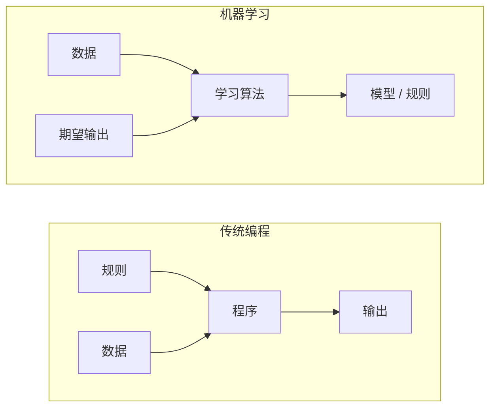
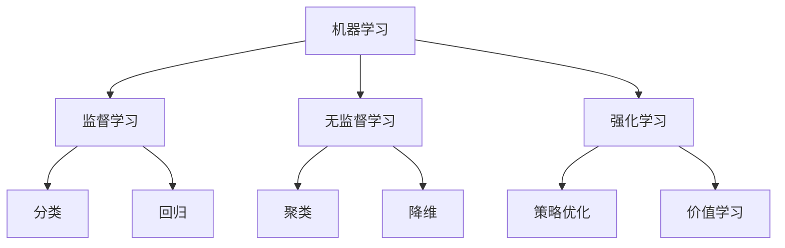
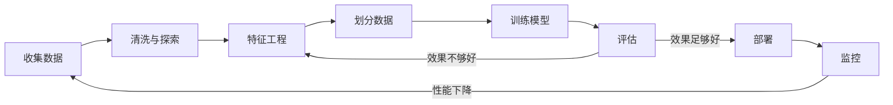
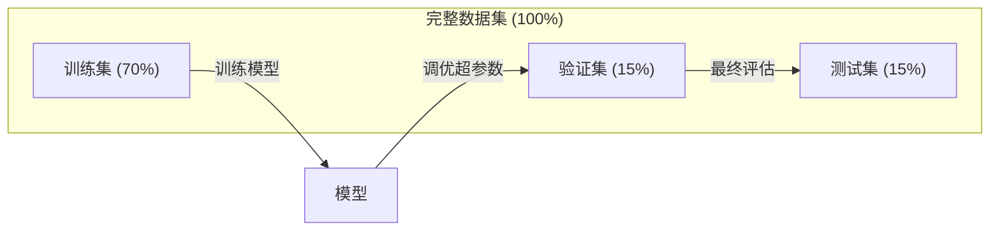
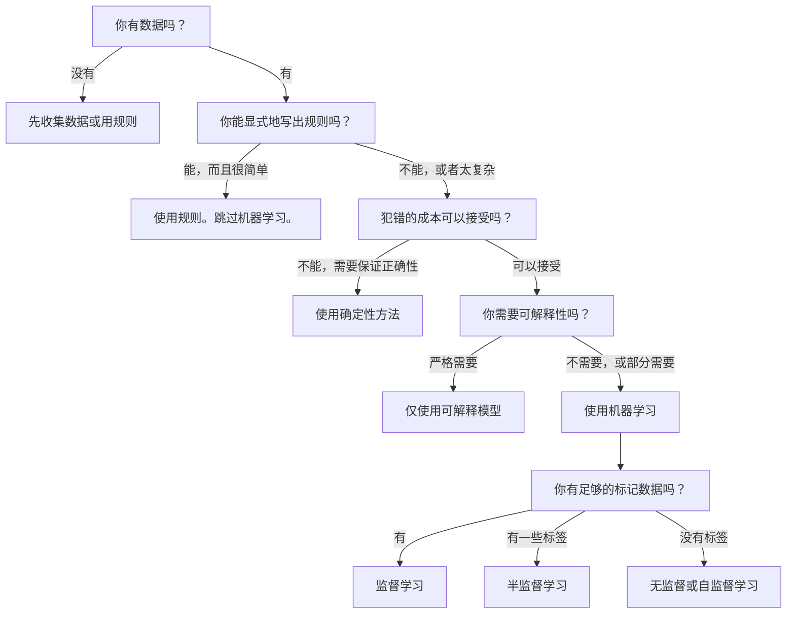

# 什么是机器学习

> 机器学习是教计算机从数据中发现模式，而不是手工编写规则。

**类型：** 学习
**语言：** Python
**先修知识：** 第一阶段（数学基础）
**时间：** 约45分钟

## 学习目标

- 解释监督学习、无监督学习和强化学习之间的区别，并能判断给定问题属于哪种类型
- 从零实现一个最近质心分类器，并与随机基线进行效果对比
- 区分分类任务和回归任务，并为每种任务选择合适的损失函数
- 评估一个给定的商业问题是否适合用机器学习解决，还是用确定性规则更好

## 问题描述

你想构建一个垃圾邮件过滤器。传统方法是：坐下来写下几百条规则。"如果邮件包含'免费送钱'，就标记为垃圾邮件。如果它包含超过3个感叹号，就标记为垃圾邮件。"你花了几周时间编写规则。然后垃圾邮件发送者改变了他们的措辞。你的规则失效了。你写更多的规则。这个循环永无止境。

机器学习颠覆了这种方式。你不是编写规则，而是给计算机成千上万封已标记的邮件（"垃圾邮件"或"非垃圾邮件"），让它自己找出规则。计算机会发现你从未想到过的模式。当垃圾邮件发送者改变策略时，你可以在新数据上重新训练模型，而不是重写代码。

这种从"编程规则"到"从数据中学习"的转变，正是机器学习的核心。每一个推荐引擎、语音助手、自动驾驶汽车和语言模型都是这样工作的。

## 核心概念

### 从数据中学习，而非从规则中学习

传统编程和机器学习以相反的方向解决问题。



传统编程：你编写规则。程序将规则应用于数据以产生输出。

机器学习：你提供数据和期望的输出。算法自己发现规则。

训练后得到的"模型"就是规则，它被编码成数字（权重、参数）。模型从它见过的例子中总结规律，并对从未见过的数据进行预测。

### 机器学习的三种类型



**监督学习：** 你拥有输入-输出对。模型学习从输入映射到输出的函数。
- "这里有10,000张标记为猫或狗的照片。学习区分它们。"
- "这里有房屋特征和价格。学习预测价格。"

**无监督学习：** 你只有输入，没有标签。模型自己发现结构。
- "这里有10,000条客户购买历史。找出自然的群体。"
- "这里有1,000维的数据点。在保持结构的同时，降维到2维。"

**强化学习：** 一个智能体在环境中采取行动，并获得奖励或惩罚。它学习一个策略来最大化总奖励。
- "玩这个游戏。赢了+1分，输了-1分。自己琢磨出策略。"
- "控制这个机械臂。拿起物体+1分，每浪费一秒-0.01分。"

在实践中，你将构建的大部分内容都使用监督学习。无监督学习在预处理和探索中很常见。强化学习为游戏AI、机器人技术和语言模型的RLHF提供动力。

### 三大类型之外的扩展

上面的三个类别很清晰，但现实世界的机器学习常常模糊这些界限。

**半监督学习** 使用少量标记数据和大量未标记数据。你可能有100张标记的医学图像和100,000张未标记的图像。技术包括：

- **标签传播：** 构建一个连接相似数据点的图。标签通过图从标记节点传播到未标记的邻居。
- **伪标记：** 在标记数据上训练一个模型，用它为未标记数据预测标签，然后在所有数据上重新训练。模型通过自举构建自己的训练集。
- **一致性正则化：** 模型对于一个输入及其轻微扰动后的版本，应该给出相同的预测。即使没有标签，这也是有效的。

**自监督学习** 从数据本身创造监督信号。完全不需要人工标签。模型从数据的结构创建自己的预测任务。

- **掩码语言建模（BERT）：** 隐藏句子中15%的词，训练模型预测被掩盖的词。"标签"来自原始文本。
- **对比学习（SimCLR）：** 取一张图像，创建两个增广版本。训练模型识别它们来自同一张图像，同时将它们与其他图像的增广版本区分开。
- **下一个词元预测（GPT）：** 根据之前的所有词预测下一个词。每一份文本文档都变成了一个训练样本。

这些不是独立于三大类型之外的新类别。它们是结合了监督和无监督思想的策略。自监督学习在技术上是监督学习（模型预测某些东西），但标签是自动生成的，而不是由人工标注的。

### 分类 vs 回归

这是监督学习的两个主要任务。

| 方面 | 分类 | 回归 |
|---|---|---|
| 输出 | 离散类别 | 连续数值 |
| 示例 | "这封邮件是垃圾邮件吗？" | "这栋房子的价格会是多少？" |
| 输出空间 | {猫, 狗, 鸟} | 任意实数 |
| 损失函数 | 交叉熵、准确率 | 均方误差、平均绝对误差 |
| 决策 | 类别之间的边界 | 拟合数据的曲线 |

分类回答"是哪个类别？"回归回答"是多少？"

有些问题可以有两种处理方式。预测股票是涨还是跌是分类。预测确切的价格是回归。

### 机器学习工作流

每个机器学习项目都遵循相同的流程，无论使用哪种算法。



**收集数据：** 收集原始数据。更多的数据几乎总是更好，但质量比数量更重要。

**清洗与探索：** 处理缺失值、删除重复项、可视化分布、发现异常。这一步通常占总项目时间的60-80%。

**特征工程：** 将原始数据转换为模型可以使用的特征。将日期转换为星期几。归一化数值列。编码分类变量。好的特征比花哨的算法更重要。

**划分数据：** 将数据划分为训练集、验证集和测试集。模型在训练集上学习，你在验证集上调优超参数，最后在测试集上报告最终性能。

**训练模型：** 将训练数据输入算法。算法调整其内部参数以最小化损失函数。

**评估：** 在验证/测试集上衡量性能。如果性能不可接受，回去尝试不同的特征、算法或超参数。

**部署：** 将模型投入生产，在新数据上进行预测。

**监控：** 跟踪模型随时间推移的性能表现。数据分布会变化（数据漂移），模型性能会下降。当性能下降时，重新训练。

### 训练集、验证集和测试集的划分

这是初学者最容易出错的最重要概念。你必须在模型训练期间从未见过的数据上评估它。否则，你衡量的是记忆能力，而不是学习能力。



| 划分 | 用途 | 使用时机 | 典型大小 |
|---|---|---|---|
| 训练集 | 模型从这里学习数据 | 训练期间 | 60-80% |
| 验证集 | 调优超参数，比较模型 | 每次训练运行后 | 10-20% |
| 测试集 | 最终的无偏性能评估 | 仅一次，在最后 | 10-20% |

测试集是神圣的。你只看它一次。如果你根据测试性能反复调整模型，你实际上是在测试集上训练，你报告的数值将毫无意义。

对于小数据集，使用k折交叉验证：将数据分成k份，在k-1份上训练，在剩下的1份上验证，轮换，并对结果取平均。

### 过拟合 vs 欠拟合


**欠拟合：** 模型太简单，无法捕捉数据中的模式。试图用一条直线去拟合一个曲线关系。训练误差高，测试误差也高。

**过拟合：** 模型太复杂，记住了训练数据，包括其中的噪声。一条扭曲的曲线穿过每一个训练点，但在新数据上失败。训练误差低，测试误差高。

**良好拟合：** 模型捕捉到了真实模式，但没有记忆噪声。训练误差和测试误差都相当低。

过拟合的迹象：
- 训练准确率远高于验证准确率
- 模型在训练数据上表现良好，但在新数据上表现差
- 增加更多训练数据能提高性能（说明模型之前是在记忆，而不是在学习）

解决过拟合的方法：
- 获取更多训练数据
- 降低模型复杂度（更少的参数，更简单的架构）
- 正则化（对大的权重添加惩罚）
- Dropout（在训练期间随机将某些神经元的输出置为零）
- 早停（当验证误差开始增加时停止训练）

解决欠拟合的方法：
- 使用更复杂的模型
- 添加更多特征
- 减少正则化
- 训练更长时间

### 偏差-方差权衡

这是过拟合和欠拟合背后的数学框架。

**偏差：** 由模型中的错误假设导致的误差。当真实关系是非线性时，线性模型会有高偏差。高偏差导致欠拟合。

**方差：** 由对训练数据中微小波动的敏感性导致的误差。一个高方差的模型在不同的数据子集上训练时，会给出非常不同的预测。高方差导致过拟合。

| 模型复杂度 | 偏差 | 方差 | 结果 |
|---|---|---|---|
| 太低（用线性模型拟合曲线数据） | 高 | 低 | 欠拟合 |
| 刚好合适 | 中 | 中 | 良好泛化 |
| 太高（用20次多项式拟合10个点） | 低 | 高 | 过拟合 |

总误差 = 偏差² + 方差 + 不可约噪声

你无法减少不可约噪声（它是数据本身固有的随机性）。你的目标是找到偏差² + 方差最小的最佳平衡点。

### 没有免费的午餐定理

不存在一个对所有问题都最好的算法。在一类问题上表现良好的算法，在另一类问题上可能表现很差。这就是为什么数据科学家会尝试多种算法并比较结果。

在实践中，选择取决于：
- 你拥有多少数据
- 有多少特征
- 关系是线性的还是非线性的
- 你是否需要可解释性
- 你能负担多少计算资源

### 什么时候不应该使用机器学习

机器学习很强大，但并不总是正确的工具。在寻求模型之前，先问问自己是否真的需要一个。

**在以下情况下不要使用机器学习：**

- **规则既简单又明确。** 税务计算、排序算法、单位转换。如果你能用几个if语句写出逻辑，那么添加模型只会增加复杂性而没有任何好处。
- **你没有数据或数据非常少。** 机器学习需要例子来学习。只有10个数据点，你无法训练出任何有意义的模型。先收集数据。
- **犯错代价是灾难性的，并且你需要保证正确性。** 药物剂量计算、核反应堆控制、密码验证。机器学习模型是概率性的，它们有时会犯错。如果"有时犯错"是不可接受的，请使用确定性方法。
- **查找表或启发式规则就能解决问题。** 如果一个简单的阈值或表格能覆盖99%的情况，添加机器学习只会增加维护成本，而不会有实质性的改进。
- **你无法解释决策，而可解释性是必需的。** 受监管的行业（贷款、保险、刑事司法）有时要求每个决策都必须是完全可解释的。一些机器学习模型是可解释的（线性回归、小型决策树）。大多数不是。
- **问题的变化速度快于你重新训练模型的速度。** 如果规则每天都在变，而重新训练需要一周时间，那么模型将永远是过时的。

使用这个决策流程图：



## 动手实现

`code/ml_intro.py` 中的代码从零实现了一个最近质心分类器，这是最简单的机器学习算法。它展示了核心思想：从数据中学习，然后在新数据上进行预测。

### 步骤 1：从零实现最近质心分类器

最近质心分类器计算训练数据中每个类别的中心点（均值）。要进行预测时，它将每个新点分配给其中心最近的那个类别。

```python
class NearestCentroid:
    def fit(self, X, y):
        self.classes = np.unique(y)
        self.centroids = np.array([
            X[y == c].mean(axis=0) for c in self.classes
        ])

    def predict(self, X):
        distances = np.array([
            np.sqrt(((X - c) ** 2).sum(axis=1))
            for c in self.centroids
        ])
        return self.classes[distances.argmin(axis=0)]
```

这就是整个算法。`fit` 计算两个均值。`predict` 计算距离。没有梯度下降，没有迭代，没有超参数。

### 步骤 2：在合成数据上训练

我们生成一个二维分类数据集，其中两个类别有轻微重叠。质心分类器在两个类中心之间画出一条线性决策边界。

```python
rng = np.random.RandomState(42)
X_class0 = rng.randn(100, 2) + np.array([1.0, 1.0])
X_class1 = rng.randn(100, 2) + np.array([-1.0, -1.0])
X = np.vstack([X_class0, X_class1])
y = np.array([0] * 100 + [1] * 100)
```

### 步骤 3：与基线进行比较

每个机器学习模型都应该与一个简单的基线进行比较。在这里，基线是随机预测一个类别。如果你的机器学习模型表现不如随机猜测，那说明有问题。

```python
baseline_preds = rng.choice([0, 1], size=len(y_test))
baseline_acc = np.mean(baseline_preds == y_test)
```

在这个干净的数据集上，质心分类器应该能达到90%以上的准确率。随机基线的准确率约为50%。

### 为什么这很重要

最近质心分类器非常简单。它没有超参数，没有迭代，没有梯度下降。然而，它抓住了机器学习的基本模式：

1.  **学习** 从训练数据中学习一个表示（质心）
2.  **预测** 使用该表示对新数据进行预测（最近距离）
3.  **评估** 与基线进行比较（随机猜测）

从逻辑回归到Transformer，每一个机器学习算法都遵循这个三步模式。表示变得越来越复杂，但工作流程保持不变。

### 步骤 4：质心分类器不能做什么

最近质心分类器假设每个类别形成一个单一的团块。它画出线性的决策边界。在以下情况下它会失败：

- 类别有多个聚类（例如，数字"1"可以有几种不同的写法）
- 决策边界是非线性的（例如，一个类别包裹着另一个类别）
- 特征的尺度差异很大（距离由尺度最大的特征主导）

这些局限性引出了你将学习的其他每一个算法。K近邻处理多个聚类。决策树处理非线性边界。特征缩放解决了尺度问题。每一课都建立在前一课局限性的基础上。

## 使用示例

sklearn 提供了 `NearestCentroid` 和合成数据生成器：

```python
from sklearn.neighbors import NearestCentroid
from sklearn.datasets import make_classification
from sklearn.model_selection import train_test_split

X, y = make_classification(
    n_samples=500, n_features=2, n_redundant=0,
    n_clusters_per_class=1, random_state=42
)
X_train, X_test, y_train, y_test = train_test_split(X, y, test_size=0.3)

clf = NearestCentroid()
clf.fit(X_train, y_train)
print(f"准确率: {clf.score(X_test, y_test):.3f}")
```

## 交付成果

本课程产出 `outputs/prompt-ml-problem-framer.md` —— 一个能将模糊的商业问题转化为具体机器学习任务的提示。给它一个问题描述（如"我们想减少客户流失"或"预测下个季度的需求"），它就能识别学习类型、定义预测目标、列出候选特征、选择成功指标、建立基线，并标记出数据泄露或类别不平衡等陷阱。在任何机器学习项目开始时使用它，以避免构建错误的东西。

## 关键术语表

| 术语 | 人们通常说 | 实际含义 |
|---|---|---|
| 模型 | "那个AI" | 一个带有可学习参数的数学函数，将输入映射到输出 |
| 训练 | "教AI" | 运行一个优化算法来调整模型参数，使预测值与已知输出匹配 |
| 特征 | "一个输入列" | 数据的一个可测量属性，模型用它来进行预测 |
| 标签 | "答案" | 一个训练样本的已知输出，用于计算误差信号 |
| 超参数 | "需要调整的设置" | 在训练前设置的参数，用于控制学习过程（学习率、层数） |
| 损失函数 | "模型错得有多离谱" | 一个衡量预测值与实际值之间差距的函数，训练的目标就是最小化它 |
| 过拟合 | "它把测试题也背下来了" | 模型学到了训练数据特有的噪声，而不是通用模式，因此在新数据上表现不佳 |
| 欠拟合 | "它什么都没学会" | 模型太简单，无法捕捉数据中的真实模式 |
| 泛化 | "它在新数据上也能工作" | 模型对其未训练过的数据做出准确预测的能力 |
| 交叉验证 | "在不同块上测试" | 反复将数据划分为训练/测试折，并取结果的平均值，从而得到更稳健的性能估计 |
| 正则化 | "保持权重很小" | 在损失函数中添加一个惩罚项，以抑制过于复杂的模型 |
| 数据漂移 | "世界变了" | 输入数据的统计分布随时间发生变化，导致模型性能下降 |

## 练习

1.  任意选择一个数据集（例如，鸢尾花数据集、泰坦尼克号数据集）。将其按70/15/15划分为训练集/验证集/测试集。解释为什么你不应该在测试集上调优超参数。
2.  列举三个现实世界的问题。对每个问题，判断它是分类、回归还是聚类，以及它是监督学习还是无监督学习。
3.  一个模型在训练数据上达到99%的准确率，但在测试数据上只有60%。诊断问题，并列出你会尝试解决它的三种方法。

## 延伸阅读

- [An Introduction to Statistical Learning](https://www.statlearning.com/) - 免费教科书，涵盖所有经典机器学习方法并附有实际例子
- [Google's Machine Learning Crash Course](https://developers.google.com/machine-learning/crash-course) - 简洁可视的机器学习概念介绍
- [Scikit-learn User Guide](https://scikit-learn.org/stable/user_guide.html) - 在Python中实现机器学习的实用参考