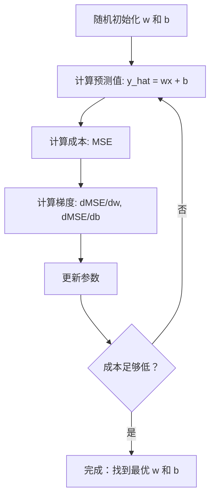

# 线性回归

> 线性回归是在你的数据中绘制出最佳拟合直线。它是机器学习的"Hello World"。

**类型：** 构建
**语言：** Python
**先修知识：** 第一阶段（线性代数、微积分、优化理论），第二阶段第1课
**时间：** 约90分钟

## 学习目标

- 推导均方误差的梯度下降更新规则，并从零实现线性回归
- 比较梯度下降法和正规方程的计算复杂度，并说明各自的使用场景
- 构建带特征标准化的多元线性回归模型，并解读学习到的权重
- 解释岭回归（L2正则化）如何通过惩罚大权重来防止过拟合

## 问题描述

你拥有数据：房屋面积及其售价。你想根据面积预测新房子的价格。你可以在散点图上粗略估计，但你需要一个公式。你需要一条最能拟合数据的直线，这样你就可以输入任意面积，得到价格预测。

线性回归为你提供了这条直线。更重要的是，它引入了整个机器学习训练流程：定义模型、定义成本函数、优化参数。每个机器学习算法都遵循这一相同模式。在这里用最简单的案例掌握它，你就会在任何地方识别出这个模式。

这不仅仅适用于简单问题。线性回归在生产系统中用于需求预测、A/B测试分析、金融建模，并作为所有回归任务的基线。

## 核心概念

### 模型

线性回归假设输入（x）和输出（y）之间存在线性关系：

```
y = wx + b
```

- `w`（权重/斜率）：当 x 增加 1 时，y 的变化量
- `b`（偏置/截距）：当 x = 0 时，y 的值

对于多个输入（特征），这扩展为：

```
y = w1*x1 + w2*x2 + ... + wn*xn + b
```

或者用向量形式表示：`y = w^T * x + b`

目标：找到使预测值 y 在所有训练样本上尽可能接近真实值 y 的 w 和 b 的值。

### 成本函数（均方误差）

你如何衡量"尽可能接近"？你需要一个能反映预测错误程度的单一数字。最常用的选择是均方误差（MSE）：

```
MSE = (1/n) * sum((y_predicted - y_actual)^2)
```

为什么用平方？有两个原因。第一，它对大误差的惩罚大于小误差（10 的误差比 1 的误差严重 100 倍，而不仅仅是 10 倍）。第二，平方函数是光滑且处处可微的，这使得优化变得简单直接。

成本函数创建了一个曲面。对于单个权重 w 和偏置 b，MSE 曲面看起来像一个碗（一个凸的抛物面）。碗的底部是 MSE 最小的地方。训练意味着找到那个底部。

### 梯度下降

梯度下降通过走下坡路来找到碗的底部。



梯度告诉你两件事：每个参数应该移动的方向，以及移动多少。

对于 y_hat = wx + b 的 MSE：

```
dMSE/dw = (2/n) * sum((y_hat - y) * x)
dMSE/db = (2/n) * sum(y_hat - y)
```

更新规则：

```
w = w - learning_rate * dMSE/dw
b = b - learning_rate * dMSE/db
```

学习率控制步长。太大：你会超过最小值而发散。太小：训练需要很长时间。典型的初始值：0.01、0.001 或 0.0001。

### 正规方程（闭式解）

特别对于线性回归，有一个直接的公式可以在无需迭代的情况下给出最优权重：

```
w = (X^T * X)^(-1) * X^T * y
```

这通过一步求逆矩阵来解出 w。它对于小数据集效果完美。对于大数据集（数百万行或数千个特征），首选梯度下降，因为矩阵求逆的复杂度在特征数量上是 O(n^3)。

### 多元线性回归

对于多个特征，模型变为：

```
y = w1*x1 + w2*x2 + ... + wn*xn + b
```

一切工作方式相同：MSE 是成本函数，梯度下降同时更新所有权重。唯一的区别是你拟合的是一个超平面而不是一条直线。

特征缩放在这里很重要。如果一个特征的范围是 0 到 1，而另一个特征的范围是 0 到 1,000,000，梯度下降将会很困难，因为成本曲面变得狭长。在训练前标准化特征（减去均值，除以标准差）。

### 多项式回归

如果关系不是线性的怎么办？你仍然可以通过创建多项式特征来使用线性回归：

```
y = w1*x + w2*x^2 + w3*x^3 + b
```

这仍然是"线性"回归，因为模型在权重（w1, w2, w3）上是线性的。你只是在用 x 的非线性特征。

高次多项式可以拟合更复杂的曲线，但存在过拟合的风险。一个 10 次多项式会穿过 10 个点数据集中的每一个点，但在新数据上预测效果会很差。

### R平方分数

MSE 告诉你错误有多大，但这个数值取决于 y 的尺度。R平方（R^2）提供了一个与尺度无关的度量：

```
R^2 = 1 - (残差平方和) / (离均差平方和)
    = 1 - SS_res / SS_tot
```

- R^2 = 1.0：完美预测
- R^2 = 0.0：模型并不比每次都预测均值好
- R^2 < 0.0：模型比预测均值还差

### 正则化预览（岭回归）

当你有很多特征时，模型可能会分配很大的权重，从而导致过拟合。岭回归（L2正则化）添加了一个惩罚项：

```
Cost = MSE + lambda * sum(w_i^2)
```

这个惩罚项会抑制大的权重。超参数 lambda 控制权衡：lambda 越大意味着权重越小，正则化越强。这将在后面的课程中深入介绍。现在，只需知道它的存在以及它为什么有帮助。

## 动手实现

### 步骤 1：生成样本数据

```python
import random
import math

random.seed(42)

TRUE_W = 3.0
TRUE_B = 7.0
N_SAMPLES = 100

X = [random.uniform(0, 10) for _ in range(N_SAMPLES)]
y = [TRUE_W * x + TRUE_B + random.gauss(0, 2.0) for x in X]

print(f"生成了 {N_SAMPLES} 个样本")
print(f"真实关系: y = {TRUE_W}x + {TRUE_B} (+ 噪声)")
print(f"前5个点: {[(round(X[i], 2), round(y[i], 2)) for i in range(5)]}")
```

### 步骤 2：使用梯度下降从零实现线性回归

```python
class LinearRegression:
    def __init__(self, learning_rate=0.01):
        self.w = 0.0
        self.b = 0.0
        self.lr = learning_rate
        self.cost_history = []

    def predict(self, X):
        return [self.w * x + self.b for x in X]

    def compute_cost(self, X, y):
        predictions = self.predict(X)
        n = len(y)
        cost = sum((pred - actual) ** 2 for pred, actual in zip(predictions, y)) / n
        return cost

    def compute_gradients(self, X, y):
        predictions = self.predict(X)
        n = len(y)
        dw = (2 / n) * sum((pred - actual) * x for pred, actual, x in zip(predictions, y, X))
        db = (2 / n) * sum(pred - actual for pred, actual in zip(predictions, y))
        return dw, db

    def fit(self, X, y, epochs=1000, print_every=200):
        for epoch in range(epochs):
            dw, db = self.compute_gradients(X, y)
            self.w -= self.lr * dw
            self.b -= self.lr * db
            cost = self.compute_cost(X, y)
            self.cost_history.append(cost)
            if epoch % print_every == 0:
                print(f"  轮次 {epoch:4d} | 成本: {cost:.4f} | w: {self.w:.4f} | b: {self.b:.4f}")
        return self

    def r_squared(self, X, y):
        predictions = self.predict(X)
        y_mean = sum(y) / len(y)
        ss_res = sum((actual - pred) ** 2 for actual, pred in zip(y, predictions))
        ss_tot = sum((actual - y_mean) ** 2 for actual in y)
        return 1 - (ss_res / ss_tot)


print("=== 训练线性回归（梯度下降法） ===")
model = LinearRegression(learning_rate=0.005)
model.fit(X, y, epochs=1000, print_every=200)
print(f"\n学习到的: y = {model.w:.4f}x + {model.b:.4f}")
print(f"真实的:    y = {TRUE_W}x + {TRUE_B}")
print(f"R平方: {model.r_squared(X, y):.4f}")
```

### 步骤 3：正规方程（闭式解）

```python
class LinearRegressionNormal:
    def __init__(self):
        self.w = 0.0
        self.b = 0.0

    def fit(self, X, y):
        n = len(X)
        x_mean = sum(X) / n
        y_mean = sum(y) / n
        numerator = sum((X[i] - x_mean) * (y[i] - y_mean) for i in range(n))
        denominator = sum((X[i] - x_mean) ** 2 for i in range(n))
        self.w = numerator / denominator
        self.b = y_mean - self.w * x_mean
        return self

    def predict(self, X):
        return [self.w * x + self.b for x in X]

    def r_squared(self, X, y):
        predictions = self.predict(X)
        y_mean = sum(y) / len(y)
        ss_res = sum((actual - pred) ** 2 for actual, pred in zip(y, predictions))
        ss_tot = sum((actual - y_mean) ** 2 for actual in y)
        return 1 - (ss_res / ss_tot)


print("\n=== 正规方程（闭式解） ===")
model_normal = LinearRegressionNormal()
model_normal.fit(X, y)
print(f"学习到的: y = {model_normal.w:.4f}x + {model_normal.b:.4f}")
print(f"R平方: {model_normal.r_squared(X, y):.4f}")
```

### 步骤 4：多元线性回归

```python
class MultipleLinearRegression:
    def __init__(self, n_features, learning_rate=0.01):
        self.weights = [0.0] * n_features
        self.bias = 0.0
        self.lr = learning_rate
        self.cost_history = []

    def predict_single(self, x):
        return sum(w * xi for w, xi in zip(self.weights, x)) + self.bias

    def predict(self, X):
        return [self.predict_single(x) for x in X]

    def compute_cost(self, X, y):
        predictions = self.predict(X)
        n = len(y)
        return sum((pred - actual) ** 2 for pred, actual in zip(predictions, y)) / n

    def fit(self, X, y, epochs=1000, print_every=200):
        n = len(y)
        n_features = len(X[0])
        for epoch in range(epochs):
            predictions = self.predict(X)
            errors = [pred - actual for pred, actual in zip(predictions, y)]
            for j in range(n_features):
                grad = (2 / n) * sum(errors[i] * X[i][j] for i in range(n))
                self.weights[j] -= self.lr * grad
            grad_b = (2 / n) * sum(errors)
            self.bias -= self.lr * grad_b
            cost = self.compute_cost(X, y)
            self.cost_history.append(cost)
            if epoch % print_every == 0:
                print(f"  轮次 {epoch:4d} | 成本: {cost:.4f}")
        return self

    def r_squared(self, X, y):
        predictions = self.predict(X)
        y_mean = sum(y) / len(y)
        ss_res = sum((actual - pred) ** 2 for actual, pred in zip(y, predictions))
        ss_tot = sum((actual - y_mean) ** 2 for actual in y)
        return 1 - (ss_res / ss_tot)


# 生成数据：房屋面积、卧室数量、房龄
random.seed(42)
N = 100
X_multi = []
y_multi = []
for _ in range(N):
    size = random.uniform(500, 3000)
    bedrooms = random.randint(1, 5)
    age = random.uniform(0, 50)
    price = 50 * size + 10000 * bedrooms - 1000 * age + 50000 + random.gauss(0, 20000)
    X_multi.append([size, bedrooms, age])
    y_multi.append(price)


def standardize(X):
    n_features = len(X[0])
    means = [sum(X[i][j] for i in range(len(X))) / len(X) for j in range(n_features)]
    stds = []
    for j in range(n_features):
        variance = sum((X[i][j] - means[j]) ** 2 for i in range(len(X))) / len(X)
        stds.append(variance ** 0.5)
    X_scaled = []
    for i in range(len(X)):
        row = [(X[i][j] - means[j]) / stds[j] if stds[j] > 0 else 0 for j in range(n_features)]
        X_scaled.append(row)
    return X_scaled, means, stds


y_mean_val = sum(y_multi) / len(y_multi)
y_std_val = (sum((yi - y_mean_val) ** 2 for yi in y_multi) / len(y_multi)) ** 0.5
y_scaled = [(yi - y_mean_val) / y_std_val for yi in y_multi]

X_scaled, x_means, x_stds = standardize(X_multi)

print("\n=== 多元线性回归（3个特征） ===")
print("特征: 房屋面积, 卧室数量, 房龄")
multi_model = MultipleLinearRegression(n_features=3, learning_rate=0.01)
multi_model.fit(X_scaled, y_scaled, epochs=1000, print_every=200)

print(f"\n权重 (标准化后): {[round(w, 4) for w in multi_model.weights]}")
print(f"偏置 (标准化后): {multi_model.bias:.4f}")
print(f"R平方: {multi_model.r_squared(X_scaled, y_scaled):.4f}")
```

### 步骤 5：多项式回归

```python
class PolynomialRegression:
    def __init__(self, degree, learning_rate=0.01):
        self.degree = degree
        self.weights = [0.0] * degree
        self.bias = 0.0
        self.lr = learning_rate

    def make_features(self, X):
        return [[x ** (d + 1) for d in range(self.degree)] for x in X]

    def predict(self, X):
        features = self.make_features(X)
        return [sum(w * f for w, f in zip(self.weights, row)) + self.bias for row in features]

    def fit(self, X, y, epochs=1000, print_every=200):
        features = self.make_features(X)
        n = len(y)
        for epoch in range(epochs):
            predictions = [sum(w * f for w, f in zip(self.weights, row)) + self.bias for row in features]
            errors = [pred - actual for pred, actual in zip(predictions, y)]
            for j in range(self.degree):
                grad = (2 / n) * sum(errors[i] * features[i][j] for i in range(n))
                self.weights[j] -= self.lr * grad
            grad_b = (2 / n) * sum(errors)
            self.bias -= self.lr * grad_b
            if epoch % print_every == 0:
                cost = sum(e ** 2 for e in errors) / n
                print(f"  轮次 {epoch:4d} | 成本: {cost:.6f}")
        return self

    def r_squared(self, X, y):
        predictions = self.predict(X)
        y_mean = sum(y) / len(y)
        ss_res = sum((actual - pred) ** 2 for actual, pred in zip(y, predictions))
        ss_tot = sum((actual - y_mean) ** 2 for actual in y)
        return 1 - (ss_res / ss_tot)


random.seed(42)
X_poly = [x / 10.0 for x in range(0, 50)]
y_poly = [0.5 * x ** 2 - 2 * x + 3 + random.gauss(0, 1.0) for x in X_poly]

x_max = max(abs(x) for x in X_poly)
X_poly_norm = [x / x_max for x in X_poly]
y_poly_mean = sum(y_poly) / len(y_poly)
y_poly_std = (sum((yi - y_poly_mean) ** 2 for yi in y_poly) / len(y_poly)) ** 0.5
y_poly_norm = [(yi - y_poly_mean) / y_poly_std for yi in y_poly]

print("\n=== 多项式回归（2次 vs 5次） ===")
print("真实关系: y = 0.5x^2 - 2x + 3")

print("\n2次多项式:")
poly2 = PolynomialRegression(degree=2, learning_rate=0.1)
poly2.fit(X_poly_norm, y_poly_norm, epochs=2000, print_every=500)
print(f"  R平方: {poly2.r_squared(X_poly_norm, y_poly_norm):.4f}")

print("\n5次多项式:")
poly5 = PolynomialRegression(degree=5, learning_rate=0.1)
poly5.fit(X_poly_norm, y_poly_norm, epochs=2000, print_every=500)
print(f"  R平方: {poly5.r_squared(X_poly_norm, y_poly_norm):.4f}")

print("\n2次多项式很好地拟合了真实曲线。5次多项式对训练数据的拟合略好一些，")
print("但在新数据上存在过拟合的风险。")
```

### 步骤 6：岭回归（L2正则化）

```python
class RidgeRegression:
    def __init__(self, n_features, learning_rate=0.01, alpha=1.0):
        self.weights = [0.0] * n_features
        self.bias = 0.0
        self.lr = learning_rate
        self.alpha = alpha

    def predict_single(self, x):
        return sum(w * xi for w, xi in zip(self.weights, x)) + self.bias

    def predict(self, X):
        return [self.predict_single(x) for x in X]

    def fit(self, X, y, epochs=1000, print_every=200):
        n = len(y)
        n_features = len(X[0])
        for epoch in range(epochs):
            predictions = self.predict(X)
            errors = [pred - actual for pred, actual in zip(predictions, y)]
            mse = sum(e ** 2 for e in errors) / n
            reg_term = self.alpha * sum(w ** 2 for w in self.weights)
            cost = mse + reg_term
            for j in range(n_features):
                grad = (2 / n) * sum(errors[i] * X[i][j] for i in range(n))
                grad += 2 * self.alpha * self.weights[j]
                self.weights[j] -= self.lr * grad
            grad_b = (2 / n) * sum(errors)
            self.bias -= self.lr * grad_b
            if epoch % print_every == 0:
                print(f"  轮次 {epoch:4d} | 成本: {cost:.4f} | L2惩罚项: {reg_term:.4f}")
        return self


print("\n=== 岭回归（L2正则化） ===")
print("与多元回归相同的数据，alpha=0.1")
ridge = RidgeRegression(n_features=3, learning_rate=0.01, alpha=0.1)
ridge.fit(X_scaled, y_scaled, epochs=1000, print_every=200)
print(f"\n岭回归权重: {[round(w, 4) for w in ridge.weights]}")
print(f"普通权重: {[round(w, 4) for w in multi_model.weights]}")
print("由于L2惩罚项，岭回归的权重更小（向零收缩）。")
```

## 使用示例

现在使用 scikit-learn 做同样的事情，这才是你在生产环境中实际会用的。

```python
from sklearn.linear_model import LinearRegression as SklearnLR
from sklearn.linear_model import Ridge
from sklearn.preprocessing import PolynomialFeatures, StandardScaler
from sklearn.model_selection import train_test_split
from sklearn.metrics import mean_squared_error, r2_score
import numpy as np

np.random.seed(42)
X_sk = np.random.uniform(0, 10, (100, 1))
y_sk = 3.0 * X_sk.squeeze() + 7.0 + np.random.normal(0, 2.0, 100)

X_train, X_test, y_train, y_test = train_test_split(X_sk, y_sk, test_size=0.2, random_state=42)

lr = SklearnLR()
lr.fit(X_train, y_train)
y_pred = lr.predict(X_test)

print("=== Scikit-learn 线性回归 ===")
print(f"系数 (w): {lr.coef_[0]:.4f}")
print(f"截距 (b): {lr.intercept_:.4f}")
print(f"R平方 (测试集): {r2_score(y_test, y_pred):.4f}")
print(f"均方误差 (测试集): {mean_squared_error(y_test, y_pred):.4f}")

poly = PolynomialFeatures(degree=2, include_bias=False)
X_poly_sk = poly.fit_transform(X_train)
X_poly_test = poly.transform(X_test)

lr_poly = SklearnLR()
lr_poly.fit(X_poly_sk, y_train)
print(f"\n多项式（2次）R平方: {r2_score(y_test, lr_poly.predict(X_poly_test)):.4f}")

scaler = StandardScaler()
X_train_scaled = scaler.fit_transform(X_train)
X_test_scaled = scaler.transform(X_test)

ridge = Ridge(alpha=1.0)
ridge.fit(X_train_scaled, y_train)
print(f"岭回归 R平方: {r2_score(y_test, ridge.predict(X_test_scaled)):.4f}")
print(f"岭回归 系数: {ridge.coef_[0]:.4f}")
```

你手动实现的版本和 scikit-learn 会产生相同的结果。区别在于：scikit-learn 处理了边缘情况、数值稳定性和性能优化。在生产环境中使用库。使用手动实现的版本来理解背后发生的事情。

## 交付成果

本课程产出：
- `outputs/skill-regression.md` —— 一个根据问题选择正确回归方法的技能

## 练习

1. 实现批量梯度下降、随机梯度下降（SGD）和小批量梯度下降。在相同数据集上比较它们的收敛速度。哪个收敛最快？哪个的成本曲线最平滑？
2. 从一个三次函数（y = ax^3 + bx^2 + cx + d + 噪声）生成数据。拟合 1次、3次和 10次多项式。比较训练 R平方和测试 R平方。在多少次时过拟合变得明显？
3. 实现套索回归（L1正则化：惩罚项 = alpha * sum(|w_i|)）。在多特征房价数据上训练。比较哪些权重变为零，与岭回归对比。为什么 L1 产生稀疏解而 L2 不能？

## 关键术语表

| 术语 | 人们通常说 | 实际含义 |
|---|---|---|
| 线性回归 | "在数据中画一条线" | 找到权重 w 和偏置 b，最小化 wx+b 与实际 y 值之间的平方差之和 |
| 成本函数 | "模型有多糟糕" | 一个将模型参数映射到一个测量预测误差的数值的函数，优化过程会最小化它 |
| 均方误差 | "误差平方的平均值" | (1/n) * sum（预测值 - 实际值)^2，对较大的误差给予不成比例的惩罚 |
| 梯度下降 | "走下坡路" | 迭代地沿着降低成本函数的方向调整参数，使用偏导数 |
| 学习率 | "步长" | 一个标量，控制每次梯度下降步骤中参数变化的幅度 |
| 正规方程 | "直接求解" | 闭式解 w = (X^T X)^-1 X^T y，无需迭代即可给出最优权重 |
| R平方 | "拟合效果有多好" | y 中能被模型解释的方差比例，范围从负无穷到 1.0 |
| 特征缩放 | "使特征具有可比性" | 将特征转换到相似的范围（例如，零均值、单位方差），以便梯度下降收敛更快 |
| 正则化 | "惩罚复杂度" | 在成本函数中添加一项来收缩权重，防止过拟合 |
| 岭回归 | "L2正则化" | 在线性回归的 MSE 上添加 lambda * sum(w_i^2) 惩罚项 |
| 多项式回归 | "用线性数学拟合曲线" | 在多项式特征（x, x^2, x^3, ...）上进行线性回归，在权重上仍然是线性的 |
| 过拟合 | "记忆训练数据" | 使用过于复杂的模型，导致它拟合了训练数据中的噪声，而在新数据上失效 |

## 延伸阅读

- [An Introduction to Statistical Learning (ISLR)](https://www.statlearning.com/) —— 免费 PDF，第3章和第6章用实用的 R 语言示例涵盖了线性回归和正则化
- [The Elements of Statistical Learning (ESL)](https://hastie.su.domains/ElemStatLearn/) —— 免费 PDF，ISLR 的数学进阶版，对岭回归和套索有更深入的阐述
- [Stanford CS229 Lecture Notes on Linear Regression](https://cs229.stanford.edu/main_notes.pdf) —— 吴恩达的讲义，从基本原理推导正规方程和梯度下降
- [scikit-learn LinearRegression documentation](https://scikit-learn.org/stable/modules/linear_model.html) —— 包含代码示例的 LinearRegression、Ridge、Lasso 和 ElasticNet 实用参考