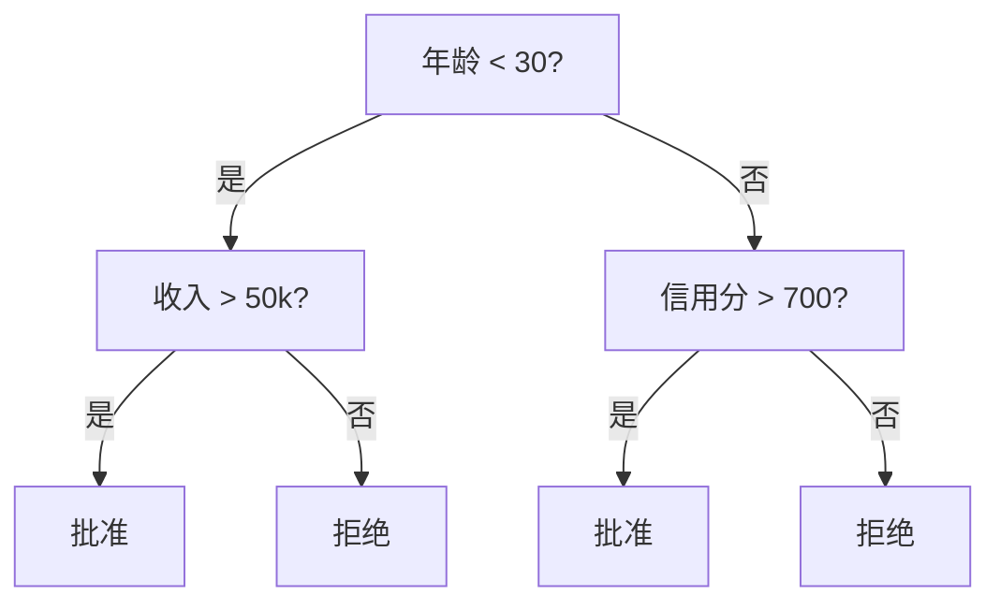
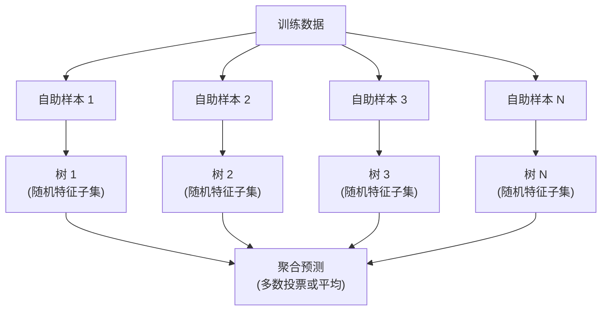

# 决策树与随机森林

> 一棵决策树就是一个流程图。但一片森林却是机器学习中最强大的工具之一。

**类型：** 构建
**语言：** Python
**先修知识：** 第一阶段（第09课 信息论，第06课 概率论）
**时间：** 约90分钟

## 学习目标

- 实现基尼不纯度、熵和信息增益的计算，以找到最优的决策树分裂
- 从零开始构建一个带有预剪枝控制（最大深度、最小样本数）的决策树分类器
- 使用自助采样和特征随机化构建随机森林，并解释为什么它能减少方差
- 比较基于 MDI 的特征重要性与基于排列的特征重要性，并识别 MDI 何时存在偏差

## 问题描述

你手头有表格数据。行是样本，列是特征，还有一列你想预测的目标变量。你可能会尝试用神经网络。但对于表格数据，基于树的模型（决策树、随机森林、梯度提升树）的表现 consistently 优于深度学习。在结构化数据的 Kaggle 竞赛中，XGBoost 和 LightGBM 占据主导地位，而不是 Transformer。

为什么？树模型无需预处理就能处理混合类型特征（数值型和类别型）。它们无需特征工程就能处理非线性关系。它们是可解释的：你可以查看树的结构，准确地知道为什么做出某个预测。而随机森林通过平均多棵树，能在中等规模的数据集上高度抵抗过拟合。

本课程将通过递归分裂从零构建决策树，然后在此基础上构建随机森林。你将实现分裂准则（基尼不纯度、熵、信息增益）背后的数学原理，并理解为什么弱学习器的集成会变得强大。

## 核心概念

### 决策树的作用

决策树通过一系列的是/否问题将特征空间划分为矩形区域。



每个内部节点用一个特征与一个阈值进行比较。每个叶子节点做出一个预测。要对一个新数据点进行分类，你从根节点开始，沿着分支走，直到到达一个叶子节点。

树是自顶向下构建的，在每个节点处，选择能够最好地区分数据的特征和阈值。"最好"是由分裂准则定义的。

### 分裂准则：衡量不纯度

在每个节点，我们有一组样本。我们希望分割它们，使得得到的子节点尽可能"纯"，即每个子节点主要包含一个类别。

**基尼不纯度** 衡量的是，如果一个随机选择的样本根据该节点的类别分布被标记，它被错误分类的概率。

```
Gini(S) = 1 - sum(p_k^2)

其中 p_k 是集合 S 中类别 k 的比例。
```

对于一个纯节点（所有样本属于同一类别），基尼不纯度为 0。对于一个 50/50 的二分类分裂，基尼不纯度为 0.5。值越低越好。

```
例子：6只猫，4只狗

Gini = 1 - (0.6^2 + 0.4^2) = 1 - (0.36 + 0.16) = 0.48
```

**熵** 衡量一个节点中的信息量（无序程度）。在第一阶段第09课中已介绍。

```
Entropy(S) = -sum(p_k * log2(p_k))
```

对于一个纯节点，熵为 0。对于一个 50/50 的二分类分裂，熵为 1.0。值越低越好。

```
例子：6只猫，4只狗

Entropy = -(0.6 * log2(0.6) + 0.4 * log2(0.4))
        = -(0.6 * -0.737 + 0.4 * -1.322)
        = 0.442 + 0.529
        = 0.971 bits
```

**信息增益** 是分裂后不纯度（熵或基尼不纯度）的减少量。

```
IG(S, 特征, 阈值) = 不纯度(S) - 加权平均(不纯度(S_左), 不纯度(S_右))

其中权重是每个子节点中样本的比例。
```

每个节点处的贪心算法：尝试每个特征和每个可能的阈值。选择能够最大化信息增益的（特征，阈值）对。

### 分裂如何工作

对于当前节点处有 n 个特征和 m 个样本的数据集：

1.  对于每个特征 j（j = 1 到 n）：
    -   按特征 j 对样本进行排序
    -   尝试连续不同值之间的每个中点作为阈值
    -   计算每个阈值的信息增益
2.  选择信息增益最高的特征和阈值
3.  将数据分割为左子集（特征 <= 阈值）和右子集（特征 > 阈值）
4.  在每个子节点上递归执行

这种贪心方法不能保证得到全局最优的树。找到最优树是 NP 难问题。但贪心分裂在实践中效果很好。

### 停止条件

如果没有停止条件，树会一直生长，直到每个叶子都是纯的（每个叶子一个样本）。这完美地记住了训练数据，但泛化能力极差。

**预剪枝** 在树完全生长之前停止：
- 最大深度：当树达到设定深度时停止分裂
- 叶子节点的最小样本数：如果一个节点的样本数少于 k 个，则停止
- 最小信息增益：如果最佳分裂对不纯度的改善小于阈值，则停止
- 最大叶子节点数：限制叶子的总数

**后剪枝** 先让树完全生长，然后进行修剪：
- 成本复杂度剪枝（scikit-learn 使用）：添加一个与叶子节点数成比例的惩罚项。增加惩罚项以获得更小的树
- 减少误差剪枝：如果移除一个子树不会使验证误差增加，则将其移除

预剪枝更简单、更快。后剪枝通常能产生更好的树，因为它不会过早停止那些可能导致后续有用分裂的分裂。

### 用于回归的决策树

对于回归，叶子节点的预测是该叶子中目标值的均值。分裂准则也会改变：

**方差减少** 取代了信息增益：

```
VR(S, 特征, 阈值) = Var(S) - 加权平均(Var(S_左), Var(S_右))
```

选择能最大程度减少方差的分裂。树将输入空间划分为多个区域，并在每个区域中预测一个常数（均值）。

### 随机森林：集成的力量

单棵决策树具有高方差。数据中的微小变化可能会产生完全不同的树。随机森林通过平均多棵树来解决这个问题。



两种随机性来源使树变得多样化：

**Bagging（自助聚合）：** 每棵树都在一个自助样本上训练，即从训练数据中有放回地随机抽取的样本。每个自助样本中约有 63% 的原始样本（其余的是袋外样本，可用于验证）。

**特征随机化：** 在每次分裂时，只考虑一个随机的特征子集。对于分类，默认值是 sqrt(n_features)。对于回归，是 n_features/3。这可以防止所有树都在同一个主导特征上分裂。

关键见解：平均许多去相关的树可以在不增加偏差的情况下减少方差。每棵单独的树可能表现平平，但集成是强大的。

### 特征重要性

随机森林自然地提供特征重要性分数。最常见的方法是：

**平均不纯度减少 (MDI)：** 对于每个特征，在所有树和所有使用该特征的节点上，对该特征带来的不纯度总减少量求和。在早期分裂中产生更大不纯度减少的特征更为重要。

```
重要性(特征_j) = 对使用特征_j的所有节点求和：
    (节点处的样本数 / 总样本数) * 不纯度减少量
```

这种方法速度快（在训练期间计算），但偏向于高基数特征和具有许多可能分裂点的特征。

**排列重要性** 是另一种方法：打乱一个特征的值，并衡量模型准确率下降了多少。这种方法更可靠，但速度较慢。

### 什么时候树模型优于神经网络

在表格数据上，树模型和随机森林的表现 consistently 优于神经网络。原因如下：

| 因素 | 树模型 | 神经网络 |
|---|---|---|
| 混合类型（数值+类别） | 原生支持 | 需要编码 |
| 小数据集（< 1万行） | 效果好 | 容易过拟合 |
| 特征交互 | 通过分裂发现 | 需要架构设计 |
| 可解释性 | 完全透明 | 黑盒 |
| 训练时间 | 几分钟 | 几小时 |
| 超参数敏感性 | 低 | 高 |

当数据具有空间或序列结构（图像、文本、音频）时，神经网络获胜。对于平坦的特征表，树模型是默认选择。

## 动手实现

### 步骤 1：基尼不纯度和熵

从头构建这两种分裂准则，并验证它们在评判分裂优劣上的一致性。

```python
import math

def gini_impurity(labels):
    n = len(labels)
    if n == 0:
        return 0.0
    counts = {}
    for label in labels:
        counts[label] = counts.get(label, 0) + 1
    return 1.0 - sum((c / n) ** 2 for c in counts.values())

def entropy(labels):
    n = len(labels)
    if n == 0:
        return 0.0
    counts = {}
    for label in labels:
        counts[label] = counts.get(label, 0) + 1
    return -sum(
        (c / n) * math.log2(c / n) for c in counts.values() if c > 0
    )
```

### 步骤 2：找到最佳分裂

尝试每个特征和每个阈值。返回信息增益最高的那个。

```python
def information_gain(parent_labels, left_labels, right_labels, criterion="gini"):
    measure = gini_impurity if criterion == "gini" else entropy
    n = len(parent_labels)
    n_left = len(left_labels)
    n_right = len(right_labels)
    if n_left == 0 or n_right == 0:
        return 0.0
    parent_impurity = measure(parent_labels)
    child_impurity = (
        (n_left / n) * measure(left_labels) +
        (n_right / n) * measure(right_labels)
    )
    return parent_impurity - child_impurity
```

### 步骤 3：构建 DecisionTree 类

递归分裂、预测和特征重要性跟踪。

```python
class DecisionTree:
    def __init__(self, max_depth=None, min_samples_split=2,
                 min_samples_leaf=1, criterion="gini",
                 max_features=None):
        self.max_depth = max_depth
        self.min_samples_split = min_samples_split
        self.min_samples_leaf = min_samples_leaf
        self.criterion = criterion
        self.max_features = max_features
        self.tree = None
        self.feature_importances_ = None

    def fit(self, X, y):
        self.n_features = len(X[0])
        self.feature_importances_ = [0.0] * self.n_features
        self.n_samples = len(X)
        self.tree = self._build(X, y, depth=0)
        # 归一化特征重要性
        total = sum(self.feature_importances_)
        if total > 0:
            self.feature_importances_ = [
                fi / total for fi in self.feature_importances_
            ]

    def predict(self, X):
        return [self._predict_one(x, self.tree) for x in X]
```

### 步骤 4：构建 RandomForest 类

自助采样、特征随机化和多数投票。

```python
class RandomForest:
    def __init__(self, n_trees=100, max_depth=None,
                 min_samples_split=2, max_features="sqrt",
                 criterion="gini"):
        self.n_trees = n_trees
        self.max_depth = max_depth
        self.min_samples_split = min_samples_split
        self.max_features = max_features
        self.criterion = criterion
        self.trees = []

    def fit(self, X, y):
        n = len(X)
        for _ in range(self.n_trees):
            # 自助采样
            indices = [random.randint(0, n - 1) for _ in range(n)]
            X_boot = [X[i] for i in indices]
            y_boot = [y[i] for i in indices]
            # 训练决策树
            tree = DecisionTree(
                max_depth=self.max_depth,
                min_samples_split=self.min_samples_split,
                max_features=self.max_features,
                criterion=self.criterion,
            )
            tree.fit(X_boot, y_boot)
            self.trees.append(tree)

    def predict(self, X):
        all_preds = [tree.predict(X) for tree in self.trees]
        predictions = []
        for i in range(len(X)):
            votes = {}
            for preds in all_preds:
                v = preds[i]
                votes[v] = votes.get(v, 0) + 1
            predictions.append(max(votes, key=votes.get))
        return predictions
```

完整的实现（包含所有辅助方法）请参见 `code/trees.py`。

## 使用示例

使用 scikit-learn，训练随机森林只需三行代码：

```python
from sklearn.ensemble import RandomForestClassifier
from sklearn.datasets import load_iris
from sklearn.model_selection import train_test_split

X, y = load_iris(return_X_y=True)
X_train, X_test, y_train, y_test = train_test_split(X, y, random_state=42)

rf = RandomForestClassifier(n_estimators=100, random_state=42)
rf.fit(X_train, y_train)
print(f"准确率: {rf.score(X_test, y_test):.4f}")
print(f"特征重要性: {rf.feature_importances_}")
```

在实践中，梯度提升树（XGBoost、LightGBM、CatBoost）通常比随机森林更强大，因为它们顺序构建树，每棵树都纠正前一棵树的错误。但随机森林更难配置错误，并且几乎不需要超参数调优。

## 交付成果

本课程产出 `outputs/prompt-tree-interpreter.md` —— 一个为业务干系人解释决策树分裂的提示。输入一个已训练树的结构（深度、特征、分裂阈值、准确率），它会将模型转化为通俗易懂的语言规则，对特征重要性进行排序，标记过拟合或数据泄露，并推荐后续步骤。任何时候你需要向不读代码的人解释基于树的模型时，都可以使用它。

## 练习

1.  在一个包含 3 个类别的二维数据集上训练一棵单决策树。手动追踪分裂过程，并画出矩形的决策边界。比较 `max_depth=2` 和 `max_depth=10` 时的边界。

2.  为回归树实现方差减少分裂。生成 y = sin(x) + 噪声的 200 个点，并拟合你的回归树。将树的分段常数预测与真实曲线进行对比绘图。

3.  构建包含 1, 5, 10, 50 和 200 棵树的随机森林。绘制训练准确率和测试准确率与树数量的关系图。观察测试准确率趋于平稳但不会下降（森林能够抵抗过拟合）。

4.  在 5 个不同的数据集上比较基尼不纯度和熵作为分裂准则。测量准确率和树的深度。在大多数情况下，它们产生几乎相同的结果。解释原因。

5.  实现排列重要性。在一个数据集中，一个特征是随机噪声但具有高基数，将排列重要性与 MDI 重要性进行比较。MDI 会将噪声特征排得很高，而排列重要性不会。

## 关键术语表

| 术语 | 人们通常说 | 实际含义 |
|---|---|---|
| 决策树 | "用于预测的流程图" | 通过学习一系列 if/else 分裂，将特征空间划分为矩形区域的模型 |
| 基尼不纯度 | "节点的混合程度" | 在一个节点处随机分类一个样本的错误概率。0 = 纯，0.5 = 二分类的最大不纯度 |
| 熵 | "节点的无序程度" | 一个节点的信息量。0 = 纯，1.0 = 二分类的最大不确定性。源自信息论 |
| 信息增益 | "分裂有多好" | 分裂后不纯度的减少量。选择分裂的贪心准则 |
| 预剪枝 | "提前停止树生长" | 通过设置最大深度、最小样本数或最小增益阈值来提前停止树的生长 |
| 后剪枝 | "之后修剪树" | 先让树完全生长，然后移除不能提高验证性能的子树 |
| Bagging | "在随机子集上训练" | 自助聚合。在每个不同的有放回随机样本上训练每个模型 |
| 随机森林 | "一堆树" | 决策树的集成，每棵树在自助样本上训练，并在每个分裂处使用随机特征子集 |
| 特征重要性 (MDI) | "哪些特征重要" | 每个特征在所有树和节点上贡献的不纯度总减少量 |
| 排列重要性 | "打乱后检查" | 当随机打乱一个特征的值时，模型准确率的下降量。对于噪声特征，比 MDI 更可靠 |
| 方差减少 | "回归版的 info gain" | 回归树中信息增益的类似物。选择能最大程度减少目标方差的分裂 |
| 自助样本 | "有放回的随机样本" | 从原始数据集中有放回地抽取的随机样本。大小相同，但会有重复 |

## 延伸阅读

- [Breiman: Random Forests (2001)](https://link.springer.com/article/10.1023/A:1010933404324) - 原始的随机森林论文
- [Grinsztajn et al.: Why do tree-based models still outperform deep learning on tabular data? (2022)](https://arxiv.org/abs/2207.08815) - 在表格任务上树模型与神经网络的严谨比较
- [scikit-learn Decision Trees documentation](https://scikit-learn.org/stable/modules/tree.html) - 包含可视化工具的实用指南
- [XGBoost: A Scalable Tree Boosting System (Chen & Guestrin, 2016)](https://arxiv.org/abs/1603.02754) - 主导 Kaggle 的梯度提升论文