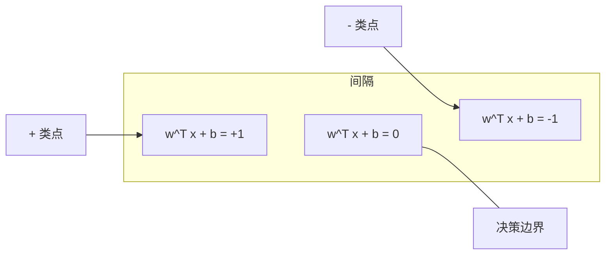
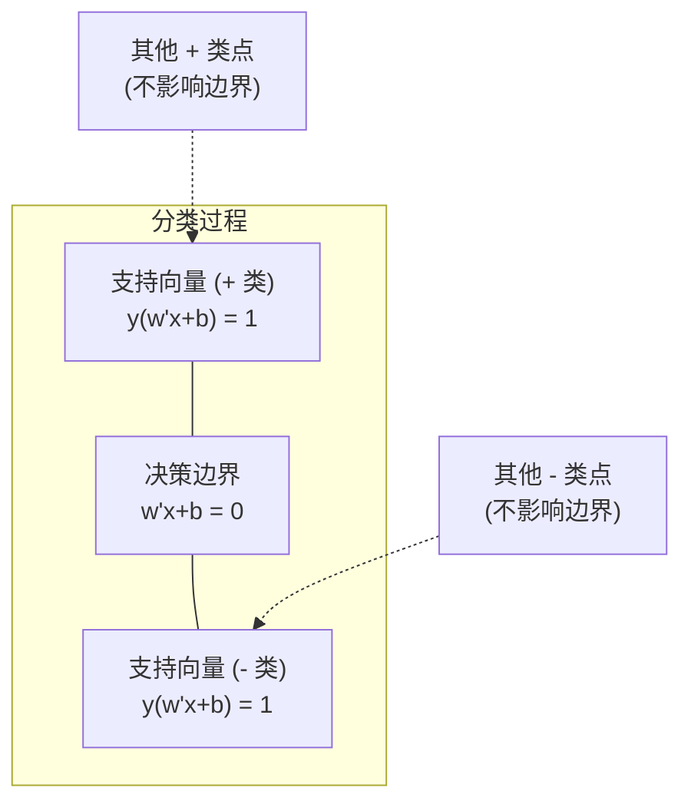
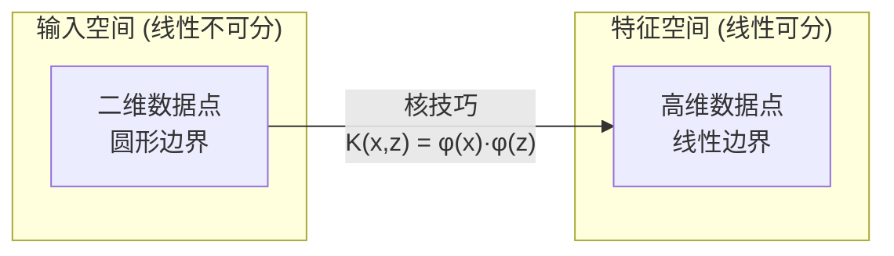

# 支持向量机

> 在两个类别之间找到最宽的街道。这就是全部思想。

**类型：** 构建
**语言：** Python
**先修知识：** 第一阶段（第08课 优化理论，第14课 范数与距离，第18课 凸优化）
**时间：** 约90分钟

## 学习目标

- 使用合页损失和基于原始问题的梯度下降，从零开始实现线性 SVM
- 解释最大间隔原理，并从训练好的模型中识别出支持向量
- 比较线性核、多项式核和 RBF 核，并解释核技巧如何避免显式的高维映射
- 评估 C 参数在间隔宽度和分类误差之间的权衡

## 问题描述

你有两类数据点，需要画一条直线（或超平面）将它们分开。理论上存在无数条可行的直线。你应该选择哪一条？

答案是：间隔最大的那一条。**间隔**是指决策边界到两侧最近数据点之间的距离。间隔越大，意味着分类器越可信，对未见过的数据的泛化能力也越好。

这一直觉引出了支持向量机 (SVM)，它是机器学习中数学上最优美的算法之一。在深度学习兴起之前，SVM 是主流的分类方法，并且至今仍然是处理小型数据集、高维数据以及需要具有理论保证的、原理清晰、易于理解的模型的问题时的最佳选择。

SVM 直接与第一阶段的知识点相连：其优化问题是凸的（第18课），间隔使用范数衡量（第14课），而核技巧利用点积来处理非线性边界，而无需在高维空间中直接进行计算。

## 核心概念

### 最大间隔分类器

给定标签 y_i ∈ {-1, +1} 和特征向量 x_i 的线性可分数据，我们想要一个超平面 w^T x + b = 0 来分隔这些类别。

点 x_i 到超平面的距离为：

```
distance = |w^T x_i + b| / ||w||
```

对于一个正确分类的点：y_i * (w^T x_i + b) > 0。间隔是超平面到两侧最近点距离的两倍。



优化问题可以表述为：

```
最大化    2 / ||w||     (间隔宽度)
约束条件  y_i * (w^T x_i + b) >= 1  for all i
```

等价地（最小化 ||w||^2 更易于优化）：

```
最小化    (1/2) ||w||^2
约束条件  y_i * (w^T x_i + b) >= 1  for all i
```

这是一个凸二次规划问题。它具有唯一的全局解。那些恰好位于间隔边界上的数据点（即 y_i * (w^T x_i + b) = 1 的点）被称为**支持向量**。它们是唯一决定决策边界的点。移动或移除任何非支持向量点，决策边界都不会改变。

### 支持向量：关键的少数



大多数训练点都是无关紧要的。只有支持向量才重要。这就是为什么 SVM 在预测时非常节省内存：你只需要存储支持向量，而不是整个训练集。

支持向量的数量也给出了泛化误差的一个界限。相对于数据集大小，支持向量的数量越少，意味着泛化能力越好。

### 软间隔：用 C 参数处理噪声

真实数据很少是完美线性可分的。有些点可能位于边界的错误一侧，或者落在间隔内部。软间隔 (Soft Margin) 公式通过引入**松弛变量**来允许这些违规情况。

```
最小化    (1/2) ||w||^2 + C * sum(xi_i)
约束条件  y_i * (w^T x_i + b) >= 1 - xi_i
          xi_i >= 0  for all i
```

松弛变量 xi_i 衡量了第 i 个点违反间隔的程度。参数 C 控制着权衡：

| C 值 | 行为 |
|---|---|
| C 值大 | 严惩违规。间隔窄，误分类少。容易过拟合 |
| C 值小 | 允许更多违规。间隔宽，误分类多。容易欠拟合 |

C 是正则化强度的倒数。C 大 = 正则化弱。C 小 = 正则化强。

### 合页损失：SVM 的损失函数

软间隔 SVM 可以重新表述为一个无约束优化问题：

```
最小化    (1/2) ||w||^2 + C * sum(max(0, 1 - y_i * (w^T x_i + b)))
```

其中 max(0, 1 - y_i * f(x_i)) 这一项就是**合页损失 (Hinge Loss)**。当点被正确分类且位于间隔之外时，损失为零。当点位于间隔内部或分类错误时，损失呈线性增长。

```
单个点的合页损失：

损失
  |
  | \
  |  \
  |   \
  |    \
  |     \_______________
  |
  +-----|-----|-------->  y * f(x)
       0     1

当 y*f(x) >= 1 时损失为零（正确分类，在间隔外）。
当 y*f(x) < 1 时线性惩罚。
```

与逻辑损失（逻辑回归）的比较：

```
合页损失:     max(0, 1 - y*f(x))          在间隔处有硬性截断
逻辑损失:     log(1 + exp(-y*f(x)))        平滑，永不严格为零
```

合页损失产生稀疏解（只有支持向量的贡献非零）。逻辑损失使用所有数据点。这使得 SVM 在预测时更节省内存。

### 使用梯度下降训练线性 SVM

你可以通过基于合页损失和 L2 正则化的梯度下降来训练线性 SVM，而无需求解带约束的二次规划问题：

```
L(w, b) = (λ/2) * ||w||^2 + (1/n) * sum(max(0, 1 - y_i * (w^T x_i + b)))

关于 w 的梯度：
  如果 y_i * (w^T x_i + b) >= 1:  dL/dw = λ * w
  如果 y_i * (w^T x_i + b) < 1:   dL/dw = λ * w - y_i * x_i

关于 b 的梯度：
  如果 y_i * (w^T x_i + b) >= 1:  dL/db = 0
  如果 y_i * (w^T x_i + b) < 1:   dL/db = -y_i
```

这被称为**原始问题 (Primal Formulation)**。它每轮的复杂度为 O(n * d)，其中 n 是样本数，d 是特征数。对于大型、稀疏、高维的数据（如文本分类），这个方法非常快。

### 对偶问题与核技巧

SVM 问题的拉格朗日对偶问题（来自第一阶段第18课的 KKT 条件）是：

```
最大化    sum(alpha_i) - (1/2) * sum_ij(alpha_i * alpha_j * y_i * y_j * (x_i . x_j))
约束条件  0 <= alpha_i <= C
          sum(alpha_i * y_i) = 0
```

对偶问题只涉及数据点之间的点积 x_i . x_j。这是关键洞察。用**核函数 K(x_i, x_j)** 替换每个点积，SVM 就能够学习非线性决策边界，而无需显式地进行高维变换。

```
线性核:      K(x, z) = x . z
多项式核:    K(x, z) = (x . z + c)^d
RBF (高斯核): K(x, z) = exp(-γ * ||x - z||^2)
```

RBF 核能将数据映射到无限维空间。在输入空间中接近的点，其核函数值接近 1。相距较远的点，其核函数值接近 0。它可以学习任意平滑的决策边界。



核技巧计算的是高维空间中的点积，但从未真正进入那个空间。对于 D 维空间中的 d 次多项式核，显式的特征空间维度是 O(D^d)。但是 K(x, z) 可以在 O(D) 时间内计算出来。

### 用于回归的 SVM (SVR)

支持向量回归 (SVR) 在数据周围拟合一个宽度为 epsilon 的管道。管道内部的点损失为零，外部的点则受到线性惩罚。

```
最小化    (1/2) ||w||^2 + C * sum(xi_i + xi_i*)
约束条件  y_i - (w^T x_i + b) <= epsilon + xi_i
          (w^T x_i + b) - y_i <= epsilon + xi_i*
          xi_i, xi_i* >= 0
```

epsilon 参数控制管道的宽度。管道越宽 = 支持向量越少 = 拟合越平滑。管道越窄 = 支持向量越多 = 拟合越紧密。

### 为什么 SVM 败给了深度学习（以及何时它们仍然胜出）

从 1990 年代末到 2010 年代初，SVM 主导了机器学习。深度学习超越它们有几个原因：

| 因素 | SVM | 深度学习 |
|---|---|---|
| 特征工程 | 需要 | 自动学习特征 |
| 可扩展性 | 核方法 O(n²) 到 O(n³) | 每轮 SGD 为 O(n) |
| 图像/文本/音频 | 需要手工设计特征 | 从原始数据中学习 |
| 大型数据集 (>10万) | 慢 | 扩展性好 |
| GPU 加速 | 收益有限 | 大幅加速 |

在以下情况下，SVM 仍然胜出：
- 小型数据集（数百到低数千个样本）
- 高维稀疏数据（例如，使用 TF-IDF 特征的文本）
- 当你需要数学保证时（如间隔界限）
- 当训练时间必须最小时（线性 SVM 非常快）
- 具有清晰间隔结构的二分类问题
- 异常检测（一类 SVM）

## 动手实现

### 步骤 1：合页损失及其梯度

这是基础。计算一个批次的合页损失及其梯度。

```python
def hinge_loss(X, y, w, b):
    n = len(X)
    total_loss = 0.0
    for i in range(n):
        margin = y[i] * (dot(w, X[i]) + b)
        total_loss += max(0.0, 1.0 - margin)
    return total_loss / n
```

### 步骤 2：基于梯度下降的线性 SVM

通过最小化正则化的合页损失来训练模型。不需要 QP 求解器。

```python
class LinearSVM:
    def __init__(self, lr=0.001, lambda_param=0.01, n_epochs=1000):
        self.lr = lr
        self.lambda_param = lambda_param
        self.n_epochs = n_epochs
        self.w = None
        self.b = 0.0

    def fit(self, X, y):
        n_features = len(X[0])
        self.w = [0.0] * n_features
        self.b = 0.0

        for epoch in range(self.n_epochs):
            for i in range(len(X)):
                margin = y[i] * (dot(self.w, X[i]) + self.b)
                if margin >= 1:
                    # 点分类正确且在间隔外，仅应用正则化项
                    self.w = [wj - self.lr * self.lambda_param * wj
                              for wj in self.w]
                else:
                    # 点违反间隔，应用合页损失梯度和正则化
                    self.w = [wj - self.lr * (self.lambda_param * wj - y[i] * X[i][j])
                              for j, wj in enumerate(self.w)]
                    self.b -= self.lr * (-y[i])

    def predict(self, X):
        return [1 if dot(self.w, x) + self.b >= 0 else -1 for x in X]
```

### 步骤 3：核函数

实现线性核、多项式核和 RBF 核。

```python
def linear_kernel(x, z):
    return dot(x, z)

def polynomial_kernel(x, z, degree=3, c=1.0):
    return (dot(x, z) + c) ** degree

def rbf_kernel(x, z, gamma=0.5):
    diff = [xi - zi for xi, zi in zip(x, z)]
    return math.exp(-gamma * dot(diff, diff))
```

### 步骤 4：识别间隔与支持向量

训练完成后，识别哪些点是支持向量并计算间隔宽度。

```python
def find_support_vectors(X, y, w, b, tol=1e-3):
    support_vectors = []
    for i in range(len(X)):
        margin = y[i] * (dot(w, X[i]) + b)
        if abs(margin - 1.0) < tol:
            support_vectors.append(i)
    return support_vectors
```

完整的实现及所有演示代码请参见 `code/svm.py`。

## 使用示例

使用 scikit-learn：

```python
from sklearn.svm import SVC, LinearSVC, SVR
from sklearn.preprocessing import StandardScaler
from sklearn.pipeline import Pipeline

# 使用 RBF 核的 SVM 分类器
clf = Pipeline([
    ("scaler", StandardScaler()),
    ("svm", SVC(kernel="rbf", C=1.0, gamma="scale")),
])
clf.fit(X_train, y_train)
print(f"准确率: {clf.score(X_test, y_test):.4f}")
print(f"支持向量数量: {clf['svm'].n_support_}")
```

**重要提示：** 在训练 SVM 之前，务必缩放你的特征。SVM 对特征的量级非常敏感，因为间隔依赖于 ||w||，而未缩放的特征会扭曲几何结构。

对于大型数据集，使用 `LinearSVC`（原始问题，每轮复杂度 O(n)）而不是 `SVC`（对偶问题，复杂度 O(n²) 到 O(n³)）：

```python
from sklearn.svm import LinearSVC

clf = Pipeline([
    ("scaler", StandardScaler()),
    ("svm", LinearSVC(C=1.0, max_iter=10000)),
])
```

## 练习

1.  生成一个二维线性可分的数据集。训练你的 LinearSVM 并识别出支持向量。验证这些支持向量确实是距离决策边界最近的点。

2.  在一个有噪声的数据集上，将 C 值从 0.001 变化到 1000。为每个 C 值绘制决策边界。观察从宽间隔（欠拟合）到窄间隔（过拟合）的转变。

3.  创建一个类别边界是圆形（非线性）的数据集。证明线性 SVM 会失败。然后计算 RBF 核矩阵，并证明在核函数诱导的特征空间中，这些类别变得线性可分。

4.  在同一个数据集上比较合页损失和逻辑损失。训练一个线性 SVM 和一个逻辑回归模型。统计有多少训练点对各自的决策边界有贡献（比较支持向量 vs 所有点）。

5.  实现 SVR（epsilon-不敏感损失）。将其拟合到 y = sin(x) + 噪声的数据上。绘制围绕预测值的 epsilon 管道，并突出显示支持向量（管道外部的点）。

## 关键术语表

| 术语 | 实际含义 |
|---|---|
| 支持向量 | 最靠近决策边界的训练点。唯一决定超平面的点 |
| 间隔 | 决策边界与最近支持向量之间的距离。SVM 的目标是最大化这个距离 |
| 合页损失 | max(0, 1 - y*f(x))。当点被正确分类且位于间隔外时损失为零，否则线性惩罚 |
| C 参数 | 在间隔宽度和分类误差之间进行权衡。C大=窄间隔，C小=宽间隔 |
| 软间隔 | 通过松弛变量允许间隔违规的 SVM 公式化方法。用于处理线性不可分数据 |
| 核技巧 | 计算高维特征空间中的点积，而无需显式地映射到该空间 |
| 线性核 | K(x, z) = x . z。等价于标准点积。用于线性可分数据 |
| RBF 核 | K(x, z) = exp(-γ * \|\|x-z\|\|²)。映射到无限维空间。可以学习任意平滑边界 |
| 多项式核 | K(x, z) = (x . z + c)^d。映射到多项式组合的特征空间 |
| 对偶问题 | 将 SVM 问题重新表述为仅依赖于数据点之间的点积。这使得核技巧成为可能 |
| SVR | 支持向量回归。在数据周围拟合一个 epsilon 管道。管道内部的点损失为零 |
| 松弛变量 | ξ_i：衡量一个点违反间隔的程度。对于间隔外正确分类的点为零 |
| 最大间隔 | 选择能使到每类最近点的距离最大化的超平面的原则 |

## 延伸阅读

- [Vapnik: The Nature of Statistical Learning Theory (1995)](https://link.springer.com/book/10.1007/978-1-4757-3264-1) - 关于 SVM 和统计学习理论的基础著作
- [Cortes & Vapnik: Support-vector networks (1995)](https://link.springer.com/article/10.1007/BF00994018) - 原始的 SVM 论文
- [Platt: Sequential Minimal Optimization (1998)](https://www.microsoft.com/en-us/research/publication/sequential-minimal-optimization-a-fast-algorithm-for-training-support-vector-machines/) - 使得 SVM 训练变得实用的 SMO 算法
- [scikit-learn SVM documentation](https://scikit-learn.org/stable/modules/svm.html) - 带有实现细节的实用指南
- [LIBSVM: A Library for Support Vector Machines](https://www.csie.ntu.edu.tw/~cjlin/libsvm/) - 大多数 SVM 实现背后的 C++ 库