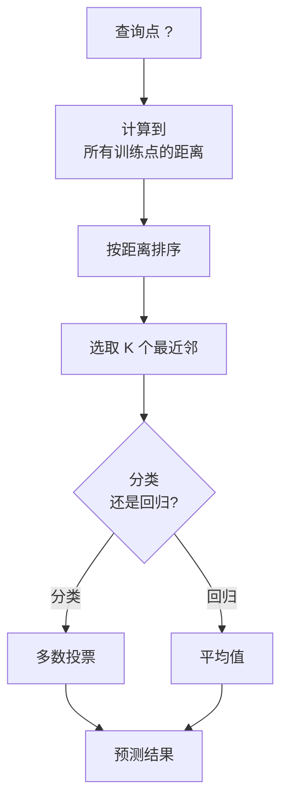
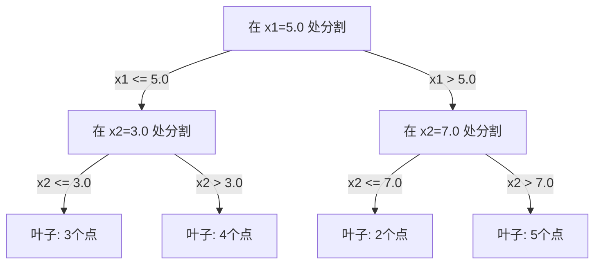

# K近邻与距离度量

> 存储一切。通过观察邻居进行预测。这是最简单且真正有效的算法。

**类型：** 构建
**语言：** Python
**先修知识：** 第一阶段（第14课 范数与距离）
**时间：** 约90分钟

## 学习目标

- 从零实现可配置 K 值和距离加权投票的 KNN 分类与回归
- 比较 L1、L2、余弦和明可夫斯基距离度量，并为给定数据类型选择合适的度量
- 解释维度灾难，并演示为什么 KNN 在高维空间中性能会下降
- 构建用于高效近邻搜索的 KD 树，并分析其何时优于暴力搜索

## 问题描述

你有一个数据集。一个新的数据点到来。你需要对其进行分类或预测其数值。与从数据中学习参数（如线性回归或 SVM）不同，你只需找到离新点最近的 K 个训练点，然后让它们投票决定。

这就是 K 近邻算法。它没有训练阶段。没有需要学习的参数。没有需要最小化的损失函数。你只需要存储整个训练集，并在预测时计算距离。

这听起来简单得不像能工作。但 KNN 在许多问题上表现得出奇地好，特别是中小型数据集。深入理解它能揭示出基本概念：距离度量的选择（连接到第一阶段第14课）、维度灾难，以及懒惰学习与急切学习之间的区别。

KNN 在现代 AI 中也随处可见，只是换了个名字。向量数据库在嵌入上执行 KNN 搜索。检索增强生成 (RAG) 寻找 K 个最相关的文档块。推荐系统寻找相似的用户或物品。算法是相同的，只是规模和数据结构不同。

## 核心概念

### KNN 的工作原理

给定一个带标签点的数据集和一个新的查询点：

1.  计算查询点到数据集中每个点的距离
2.  按距离排序
3.  选取距离最近的 K 个点
4.  对于分类：K 个邻居进行多数投票
5.  对于回归：取 K 个邻居值的平均值（或加权平均值）



这就是整个算法。没有拟合过程。没有梯度下降。没有迭代轮次。

### 选择 K 值

K 是唯一的超参数。它控制着偏差-方差的权衡：

| K 值 | 行为 |
|---|---|
| K = 1 | 决策边界紧贴每个点。训练误差为零。高方差。过拟合 |
| K 较小 (3-5) | 对局部结构敏感。能捕捉复杂边界 |
| K 较大 | 边界更平滑。对噪声更鲁棒。可能欠拟合 |
| K = N | 对所有点预测多数类。偏差最大 |

对于包含 N 个点的数据集，一个常见的起始点是 K = sqrt(N)。对于二分类问题，使用奇数 K 可以避免平局。


### 距离度量

距离函数定义了“近”的含义。不同的度量会产生不同的邻居和不同的预测。

**L2 (欧几里得距离)** 是默认选择。直线距离。

```
d(a, b) = sqrt(sum((a_i - b_i)^2))
```

对特征的尺度敏感。在将 L2 与 KNN 一起使用之前，务必标准化特征。

**L1 (曼哈顿距离)** 计算绝对差值之和。与 L2 相比，它对离群值更鲁棒，因为它不平方差值。

```
d(a, b) = sum(|a_i - b_i|)
```

**余弦距离** 测量向量之间的角度，忽略其大小。对于文本和嵌入数据至关重要。

```
d(a, b) = 1 - (a . b) / (||a|| * ||b||)
```

**明可夫斯基距离** 用参数 p 推广了 L1 和 L2。

```
d(a, b) = (sum(|a_i - b_i|^p))^(1/p)

p=1: 曼哈顿距离
p=2: 欧几里得距离
p->∞: 切比雪夫距离 (最大绝对差)
```

使用哪种度量取决于数据类型：

| 数据类型 | 最佳度量 | 原因 |
|---|---|---|
| 数值特征，尺度相似 | L2 (欧几里得) | 默认选项，适用于空间数据 |
| 数值特征，存在离群值 | L1 (曼哈顿) | 鲁棒，不会放大大的差异 |
| 文本嵌入 | 余弦 | 大小是噪声，方向才是意义 |
| 高维稀疏数据 | 余弦或 L1 | L2 在维度灾难下表现不佳 |
| 混合类型 | 自定义距离 | 根据特征类型组合度量 |

### 加权 KNN

标准 KNN 对所有 K 个邻居赋予相同的权重。但是，距离为 0.1 的邻居应该比距离为 5.0 的邻居更重要。

**距离加权 KNN** 使用距离的倒数来加权每个邻居：

```
weight_i = 1 / (distance_i + epsilon)

对于分类：加权投票
对于回归：加权平均 = sum(w_i * y_i) / sum(w_i)
```

epsilon 用于防止当查询点与训练点完全匹配时出现除零错误。

加权 KNN 对 K 值的选择不那么敏感，因为无论 K 值如何，远处的邻居贡献都非常小。

### 维度灾难

KNN 的性能在高维空间中会下降。这不是一个模糊的担忧，而是一个数学事实。

**问题 1：距离收敛。** 随着维度的增加，最大距离与最小距离的比值趋近于 1。所有点相对于查询点都变得同样“远”。

```
在 d 维空间中，对于随机的均匀点：

d=2:    max_dist / min_dist = 变化很大
d=100:  max_dist / min_dist ~ 1.01
d=1000: max_dist / min_dist ~ 1.001

当所有距离几乎相等时，“最近”就变得毫无意义。
```

**问题 2：体积爆炸。** 为了在数据的固定比例内捕获 K 个邻居，你需要将搜索半径扩大到覆盖特征空间的更大比例。在高维空间中，“邻域”会囊括大部分空间。

**问题 3：角落主导。** 在 d 维单位超立方体中，大部分体积集中在角落附近，而不是中心。随着 d 的增长，内切于立方体的球体所占的体积趋近于零。

实际后果：KNN 在大约 20-50 个特征以内表现良好。超过这个范围，你需要在应用 KNN 之前进行降维（PCA, UMAP, t-SNE），或者需要使用能够利用数据内在低维度的基于树的搜索结构。

### KD 树：快速近邻搜索

暴力搜索 KNN 需要计算查询点到每个训练点的距离。每次查询的复杂度是 O(n * d)。对于大型数据集，这太慢了。

KD 树（K-维树）沿着特征轴递归地划分空间。在每一层，它沿着一个维度在中间值处进行分割。



为了找到最近邻，遍历树到达包含查询点的叶子节点，然后回溯，只有当相邻分区可能包含更近的点时才进行检查。

平均查询时间：在低维空间中为 O(log n)。但在高维空间（d > 20）中，KD 树的性能会退化到 O(n)，因为回溯能剪除的分支越来越少。

### 球树：更适合中等维度

球树将数据划分为嵌套的超球体，而不是与轴对齐的盒子。每个节点定义一个包含其子树中所有点的球体（中心 + 半径）。

相对于 KD 树的优势：
- 在中等维度（最多约 50 维）下表现更好
- 能处理非轴对齐的结构
- 更紧凑的边界体积意味着在搜索过程中可以修剪更多分支

KD 树和球树都是精确算法。对于真正的大规模搜索（数百万个点，数百个维度），会使用近似近邻方法（HNSW, IVF, 乘积量化）。这些内容在第一阶段第14课中介绍。

### 懒惰学习 vs 急切学习

KNN 是一种**懒惰学习器**：它在训练时不进行任何工作，所有工作都在预测时完成。大多数其他算法（线性回归、SVM、神经网络）是**急切学习器**：它们在训练时进行大量计算以构建一个紧凑的模型，然后预测很快。

| 方面 | 懒惰学习 (KNN) | 急切学习 (SVM, 神经网络) |
|---|---|---|
| 训练时间 | O(1) 只需存储数据 | O(n * 轮次) |
| 预测时间 | 每次查询 O(n * d) | O(d) 或 O(参数量) |
| 预测时内存 | 存储整个训练集 | 仅存储模型参数 |
| 适应新数据 | 即时添加点 | 重新训练模型 |
| 决策边界 | 隐式，即时计算 | 显式，训练后固定 |

懒惰学习适用于以下情况：
- 数据集频繁更改（无需重新训练即可增删点）
- 只需要对极少数查询进行预测
- 希望训练时间为零
- 数据集足够小，暴力搜索也很快

### 用于回归的 KNN

KNN 回归不是进行多数投票，而是对 K 个邻居的目标值取平均。

```
prediction = (1/K) * sum(y_i for i in K nearest neighbors)

或者使用距离加权：
prediction = sum(w_i * y_i) / sum(w_i)
其中 w_i = 1 / distance_i
```

KNN 回归产生分段常数（或带权重的分段平滑）预测。它不能外推到训练数据范围之外。如果训练目标值都在 0 到 100 之间，KNN 永远不会预测 200。

## 动手实现

### 步骤 1：距离函数

实现 L1、L2、余弦和明可夫斯基距离。这些直接连接到第一阶段第14课。

```python
import math

def l2_distance(a, b):
    return math.sqrt(sum((ai - bi) ** 2 for ai, bi in zip(a, b)))

def l1_distance(a, b):
    return sum(abs(ai - bi) for ai, bi in zip(a, b))

def cosine_distance(a, b):
    dot_val = sum(ai * bi for ai, bi in zip(a, b))
    norm_a = math.sqrt(sum(ai ** 2 for ai in a))
    norm_b = math.sqrt(sum(bi ** 2 for bi in b))
    if norm_a == 0 or norm_b == 0:
        return 1.0
    return 1.0 - dot_val / (norm_a * norm_b)

def minkowski_distance(a, b, p=2):
    if p == float('inf'):
        return max(abs(ai - bi) for ai, bi in zip(a, b))
    return sum(abs(ai - bi) ** p for ai, bi in zip(a, b)) ** (1 / p)
```

### 步骤 2：KNN 分类器和回归器

构建具有可配置 K 值、距离度量和可选距离加权的完整 KNN。

```python
class KNN:
    def __init__(self, k=5, distance_fn=l2_distance, weighted=False,
                 task="classification"):
        self.k = k
        self.distance_fn = distance_fn
        self.weighted = weighted
        self.task = task
        self.X_train = None
        self.y_train = None

    def fit(self, X, y):
        self.X_train = X
        self.y_train = y

    def predict(self, X):
        return [self._predict_one(x) for x in X]

    def _predict_one(self, x):
        # 计算所有距离
        distances = [(self.distance_fn(x, x_train), y_train)
                     for x_train, y_train in zip(self.X_train, self.y_train)]
        # 按距离排序
        distances.sort(key=lambda t: t[0])
        # 选取 K 个最近邻
        nearest = distances[:self.k]
        # 预测
        if self.task == "classification":
            return self._classification_vote(nearest)
        else:
            return self._regression_average(nearest)
```

### 步骤 3：用于高效搜索的 KD 树

从头开始构建一个 KD 树，在每个维度上按中位数递归地分割数据。

```python
class KDTree:
    def __init__(self, X, indices=None, depth=0):
        # 递归地分割数据
        self.axis = depth % len(X[0])
        # 在当前轴上按中位数分割
        ...

    def query(self, point, k=1):
        # 遍历到叶子节点，然后回溯
        ...
```

完整的实现及所有辅助方法和演示代码请参见 `code/knn.py`。

### 步骤 4：特征缩放

KNN 需要特征缩放，因为距离对特征的量级很敏感。一个范围为 0 到 1000 的特征将主导一个范围为 0 到 1 的特征。

```python
def standardize(X):
    n = len(X)
    d = len(X[0])
    means = [sum(X[i][j] for i in range(n)) / n for j in range(d)]
    stds = [
        max(1e-10, (sum((X[i][j] - means[j]) ** 2 for i in range(n)) / n) ** 0.5)
        for j in range(d)
    ]
    return [[((X[i][j] - means[j]) / stds[j]) for j in range(d)] for i in range(n)], means, stds
```

## 使用示例

使用 scikit-learn：

```python
from sklearn.neighbors import KNeighborsClassifier
from sklearn.preprocessing import StandardScaler
from sklearn.pipeline import Pipeline

clf = Pipeline([
    ("scaler", StandardScaler()),
    ("knn", KNeighborsClassifier(n_neighbors=5, metric="euclidean")),
])
clf.fit(X_train, y_train)
print(f"准确率: {clf.score(X_test, y_test):.4f}")
```

当数据集足够大且维度足够低时，scikit-learn 会自动使用 KD 树或球树。对于高维数据，它会回退到暴力搜索。你可以通过 `algorithm` 参数来控制。

对于大规模近邻搜索（数百万个向量），使用 FAISS、Annoy 或向量数据库：

```python
import faiss

index = faiss.IndexFlatL2(dimension)
index.add(embeddings)
distances, indices = index.search(query_vectors, k=5)
```

## 练习

1.  在一个包含 3 个类别的二维数据集上实现 KNN 分类。绘制 K=1, K=5, K=15 和 K=N 时的决策边界。观察从过拟合到欠拟合的转变。

2.  在 2、5、10、50、100 和 500 维空间中各生成 1000 个随机点。对每个维度，计算所有点对的最大距离与最小距离之比。绘制比值与维度的关系图，以可视化维度灾难。

3.  在一个文本分类问题上，比较 L1、L2 和余弦距离在 KNN 上的表现（使用 TF-IDF 向量）。哪种度量能得到最高的准确率？为什么余弦距离通常在文本上表现更好？

4.  实现一个 KD 树，并在包含 1k、10k 和 100k 个点且维度分别为 2D、10D 和 50D 的数据集上，测量其查询时间与暴力搜索的对比。在哪个维度下，KD 树不再比暴力搜索快？

5.  为 y = sin(x) + 噪声数据构建一个加权 KNN 回归器。对于 K=3, 10, 30，将其与未加权的 KNN 进行比较。证明加权能产生更平滑的预测，特别是对于较大的 K 值。

## 关键术语表

| 术语 | 实际含义 |
|---|---|
| K近邻 | 一种非参数算法，通过寻找离查询点最近的 K 个训练点来进行预测 |
| 懒惰学习 | 训练时不进行计算，所有工作在预测时完成。KNN 是典型例子 |
| 急切学习 | 训练时进行大量计算以构建一个紧凑的模型。大多数机器学习算法都是急切学习 |
| 维度灾难 | 在高维空间中，距离趋同，邻域膨胀到覆盖大部分空间，使得 KNN 失效 |
| KD树 | 沿着特征轴递归划分空间的二叉树。在低维空间中查询复杂度为 O(log n) |
| 球树 | 嵌套超球体的树结构。在中等维度（最多约 50）下比 KD 树表现更好 |
| 加权 KNN | 邻居按距离倒数加权。更近的邻居对预测有更大的影响 |
| 特征缩放 | 将特征归一化到可比较的范围。对于 KNN 这类基于距离的方法至关重要 |
| 多数投票 | 通过统计 K 个邻居中最常见的类别进行分类 |
| 暴力搜索 | 计算到每个训练点的距离。每次查询 O(n*d)。精确但对于大型 n 来说速度慢 |
| 近似近邻 | 算法（HNSW, LSH, IVF）能够比精确搜索快得多地找到近似的最近点 |
| 维诺图 | 空间的一种划分，其中每个区域包含所有离该区域训练点比其他任何点都近的点。K=1 的 KNN 产生维诺边界 |

## 延伸阅读

- [Cover & Hart: Nearest Neighbor Pattern Classification (1967)](https://ieeexplore.ieee.org/document/1053964) - 基础的 KNN 论文，证明其误差率最多是贝叶斯最优的两倍
- [Friedman, Bentley, Finkel: An Algorithm for Finding Best Matches in Logarithmic Expected Time (1977)](https://dl.acm.org/doi/10.1145/355744.355745) - 原始的 KD 树论文
- [Beyer et al.: When Is "Nearest Neighbor" Meaningful? (1999)](https://link.springer.com/chapter/10.1007/3-540-49257-7_15) - 关于近邻算法中维度灾难的正式分析
- [scikit-learn Nearest Neighbors documentation](https://scikit-learn.org/stable/modules/neighbors.html) - 包含算法选择的实用指南
- [FAISS: A Library for Efficient Similarity Search](https://github.com/facebookresearch/faiss) - Meta 的用于十亿级规模近似近邻搜索的库