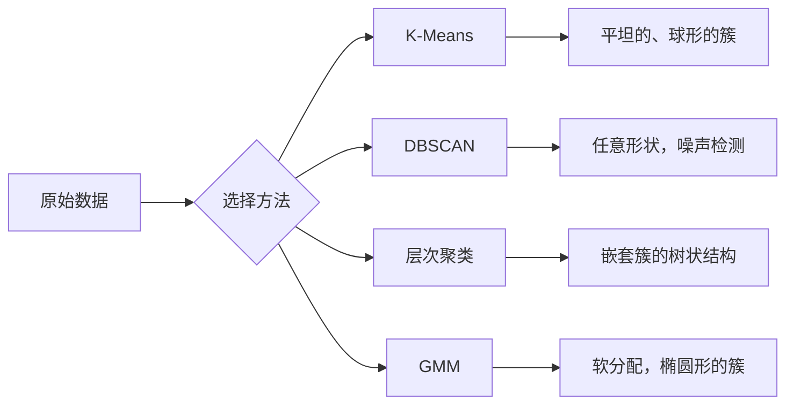

# 无监督学习

> 没有标签，没有老师。算法自己发现结构。

**类型：** 构建
**语言：** Python
**先修知识：** 第一阶段（范数与距离、概率与分布），第二阶段第 1-6 课
**时间：** 约 90 分钟

## 学习目标

- 从零实现 K-Means、DBSCAN 和高斯混合模型，并比较它们的聚类行为
- 使用轮廓系数和肘部法则评估聚类质量，以选择最优的 K 值
- 解释 DBSCAN 何时优于 K-Means，并识别哪种算法能处理非球形簇和离群值
- 使用聚类方法构建异常检测流程，标记偏离正常模式的点

## 问题描述

到目前为止，每节机器学习课程都假设数据带有标签："这是一个输入，这是正确的输出。"在现实世界中，获取标签的成本很高。一家医院有数百万份病历，但没有人手动给每份病历标注疾病类别。一个电子商务网站有数百万次用户会话，但没有人给客户细分手工打标签。一个安全团队有网络日志，但没有人标记每一个异常。

无监督学习无需被告知寻找什么，就能发现模式。它将相似的数据点分组，发现隐藏的结构，并找出异常。如果说监督学习是拿着有答案的课本学习，那么无监督学习就是盯着原始数据，直到模式自己显现出来。

难点在于：没有标签，你就无法直接衡量"对"或"错"。你需要不同的工具来评估你的算法发现的结构是否有意义。

## 核心概念

### 聚类：将相似的事物分组

聚类将每个数据点分配到一个组（簇）中，使得同一组内的点比不同组之间的点更相似。问题始终是："相似"意味着什么？



### K-Means：主力算法

K-Means 将数据划分为恰好 K 个簇。每个簇有一个质心（其中心点），每个点属于离它最近的质心。

劳埃德算法：

1.  随机选择 K 个点作为初始质心
2.  将每个数据点分配到最近的质心
3.  将每个质心重新计算为其分配点的均值
4.  重复步骤 2-3，直到分配不再改变

目标函数（惯性）衡量每个点到其分配质心的总平方距离。K-Means 最小化这个值，但只找到局部最小值。不同的初始化会产生不同的结果。

### 选择 K 值

两种标准方法：

**肘部法则：** 对 K = 1, 2, 3, ..., n 运行 K-Means。绘制惯性值对 K 的曲线。寻找"肘部"点，即增加更多簇不再显著减少惯性值的点。

**轮廓系数：** 对于每个点，测量它与自身簇的相似度 (a) 与最近的其他簇的相似度 (b) 的对比。轮廓系数为 (b - a) / max(a, b)，范围从 -1（错误簇）到 +1（聚类良好）。对所有点取平均得到全局分数。

### DBSCAN：基于密度的聚类

K-Means 假设簇是球形的，并且需要你预先选择 K。DBSCAN 两者都不假设。它将簇视为由稀疏区域分隔开的稠密区域。

两个参数：
- **eps**：邻域的半径
- **min_samples**：形成一个稠密区域所需的最少点数

三种类型的点：
- **核心点**：在 eps 距离内至少有 min_samples 个点
- **边界点**：在 eps 距离内靠近一个核心点，但本身不是核心点
- **噪声点**：既不是核心点也不是边界点。这些是离群值。

DBSCAN 将彼此在 eps 距离内的核心点连接到同一个簇中。边界点加入附近核心点的簇。噪声点不属于任何簇。

优点：能发现任意形状的簇，自动确定簇的数量，识别离群值。缺点：难以处理密度变化的簇。

### 层次聚类

构建一个嵌套簇的树状图（树状图）。

凝聚法（自底向上）：
1.  开始时每个点自成一个簇
2.  合并最近的两个簇
3.  重复直到只剩下一个簇
4.  在所需层级切割树状图以获得 K 个簇

簇之间的"接近度"可以通过以下方式衡量：
- **单链接**：两个簇中任意两点之间的最小距离
- **全链接**：任意两点之间的最大距离
- **平均链接**：所有点对之间的平均距离
- **沃德法**：选择使得簇内总方差增加最小的合并

### 高斯混合模型 (GMM)

K-Means 给出硬分配：每个点恰好属于一个簇。GMM 给出软分配：每个点有一定概率属于每个簇。

GMM 假设数据是由 K 个高斯分布的混合生成的，每个高斯分布有自己的均值和协方差。期望最大化算法交替进行：

- **E 步**：计算每个点属于每个高斯分布的概率
- **M 步**：更新每个高斯分布的均值、协方差和混合权重，以最大化数据的似然

GMM 可以建模椭圆形簇（不仅仅是 K-Means 那样的球形），并且自然地处理重叠的簇。

### 何时使用哪种方法

| 方法 | 最佳适用场景 | 避免使用场景 |
|---|---|---|
| K-Means | 大型数据集，球形簇，K 已知 | 不规则形状，存在离群值 |
| DBSCAN | K 未知，任意形状，离群值检测 | 密度变化大，维度非常高 |
| 层次聚类 | 小型数据集，需要树状图，K 未知 | 大型数据集 (O(n²) 内存) |
| GMM | 重叠簇，需要软分配 | 非常大的数据集，维度过高 |

### 使用聚类进行异常检测

聚类自然地支持异常检测：
- **K-Means**：远离任何质心的点是异常点
- **DBSCAN**：噪声点本质上就是异常点
- **GMM**：在所有高斯分布下概率都很低的点是异常点

## 动手实现

### 步骤 1：从零实现 K-Means

```python
import math
import random


def euclidean_distance(a, b):
    return math.sqrt(sum((ai - bi) ** 2 for ai, bi in zip(a, b)))


def kmeans(data, k, max_iterations=100, seed=42):
    random.seed(seed)
    n_features = len(data[0])

    # 初始化：随机选择 k 个点作为质心
    centroids = random.sample(data, k)

    for iteration in range(max_iterations):
        clusters = [[] for _ in range(k)]
        assignments = []

        # 分配步骤：将每个点分配到最近的质心
        for point in data:
            distances = [euclidean_distance(point, c) for c in centroids]
            nearest = distances.index(min(distances))
            clusters[nearest].append(point)
            assignments.append(nearest)

        # 更新步骤：重新计算每个簇的质心
        new_centroids = []
        for cluster in clusters:
            if len(cluster) == 0:
                new_centroids.append(random.choice(data))
                continue
            centroid = [
                sum(point[j] for point in cluster) / len(cluster)
                for j in range(n_features)
            ]
            new_centroids.append(centroid)

        # 检查收敛
        if all(
            euclidean_distance(old, new) < 1e-6
            for old, new in zip(centroids, new_centroids)
        ):
            print(f"  在第 {iteration + 1} 次迭代时收敛")
            break

        centroids = new_centroids

    return assignments, centroids
```

### 步骤 2：肘部法则和轮廓系数

```python
def compute_inertia(data, assignments, centroids):
    total = 0.0
    for point, cluster_id in zip(data, assignments):
        total += euclidean_distance(point, centroids[cluster_id]) ** 2
    return total


def silhouette_score(data, assignments):
    n = len(data)
    if n < 2:
        return 0.0

    # 按簇组织索引
    clusters = {}
    for i, c in enumerate(assignments):
        clusters.setdefault(c, []).append(i)

    if len(clusters) < 2:
        return 0.0

    scores = []
    for i in range(n):
        own_cluster = assignments[i]
        own_members = [j for j in clusters[own_cluster] if j != i]

        if len(own_members) == 0:
            scores.append(0.0)
            continue

        # 计算到自身簇的平均距离 (a)
        a = sum(euclidean_distance(data[i], data[j]) for j in own_members) / len(own_members)

        # 计算到最近其他簇的平均距离 (b)
        b = float("inf")
        for cluster_id, members in clusters.items():
            if cluster_id == own_cluster:
                continue
            avg_dist = sum(euclidean_distance(data[i], data[j]) for j in members) / len(members)
            b = min(b, avg_dist)

        # 计算轮廓系数
        if max(a, b) == 0:
            scores.append(0.0)
        else:
            scores.append((b - a) / max(a, b))

    return sum(scores) / len(scores)


def find_best_k(data, max_k=10):
    print("肘部法则:")
    inertias = []
    for k in range(1, max_k + 1):
        assignments, centroids = kmeans(data, k)
        inertia = compute_inertia(data, assignments, centroids)
        inertias.append(inertia)
        print(f"  K={k}: 惯性={inertia:.2f}")

    print("\n轮廓系数:")
    for k in range(2, max_k + 1):
        assignments, centroids = kmeans(data, k)
        score = silhouette_score(data, assignments)
        print(f"  K={k}: 轮廓系数={score:.4f}")

    return inertias
```

### 步骤 3：从零实现 DBSCAN

```python
def dbscan(data, eps, min_samples):
    n = len(data)
    labels = [-1] * n  # -1 表示未分类或噪声
    cluster_id = 0

    def region_query(point_idx):
        neighbors = []
        for i in range(n):
            if euclidean_distance(data[point_idx], data[i]) <= eps:
                neighbors.append(i)
        return neighbors

    visited = [False] * n

    for i in range(n):
        if visited[i]:
            continue
        visited[i] = True

        neighbors = region_query(i)

        if len(neighbors) < min_samples:
            labels[i] = -1  # 标记为噪声（可能后来变成边界点）
            continue

        # 开始一个新的簇
        labels[i] = cluster_id
        seed_set = list(neighbors)
        seed_set.remove(i)

        j = 0
        while j < len(seed_set):
            q = seed_set[j]

            if not visited[q]:
                visited[q] = True
                q_neighbors = region_query(q)
                if len(q_neighbors) >= min_samples:
                    for nb in q_neighbors:
                        if nb not in seed_set:
                            seed_set.append(nb)

            if labels[q] == -1:
                labels[q] = cluster_id

            j += 1

        cluster_id += 1

    return labels
```

### 步骤 4：高斯混合模型（EM 算法）

```python
def gmm(data, k, max_iterations=100, seed=42):
    random.seed(seed)
    n = len(data)
    d = len(data[0])

    # 初始化：随机选择 k 个点作为均值，方差和权重均匀初始化
    indices = random.sample(range(n), k)
    means = [list(data[i]) for i in indices]
    variances = [1.0] * k
    weights = [1.0 / k] * k

    def gaussian_pdf(x, mean, variance):
        d = len(x)
        coeff = 1.0 / ((2 * math.pi * variance) ** (d / 2))
        exponent = -sum((xi - mi) ** 2 for xi, mi in zip(x, mean)) / (2 * variance)
        return coeff * math.exp(max(exponent, -500))

    for iteration in range(max_iterations):
        # E 步：计算责任（responsibility）
        responsibilities = []
        for i in range(n):
            probs = []
            for j in range(k):
                probs.append(weights[j] * gaussian_pdf(data[i], means[j], variances[j]))
            total = sum(probs)
            if total == 0:
                total = 1e-300
            responsibilities.append([p / total for p in probs])

        old_means = [list(m) for m in means]

        # M 步：更新参数
        for j in range(k):
            r_sum = sum(responsibilities[i][j] for i in range(n))
            if r_sum < 1e-10:
                continue

            weights[j] = r_sum / n

            for dim in range(d):
                means[j][dim] = sum(
                    responsibilities[i][j] * data[i][dim] for i in range(n)
                ) / r_sum

            variances[j] = sum(
                responsibilities[i][j]
                * sum((data[i][dim] - means[j][dim]) ** 2 for dim in range(d))
                for i in range(n)
            ) / (r_sum * d)
            variances[j] = max(variances[j], 1e-6)

        shift = sum(
            euclidean_distance(old_means[j], means[j]) for j in range(k)
        )
        if shift < 1e-6:
            print(f"  GMM 在第 {iteration + 1} 次迭代时收敛")
            break

    assignments = []
    for i in range(n):
        assignments.append(responsibilities[i].index(max(responsibilities[i])))

    return assignments, means, weights, responsibilities
```

### 步骤 5：生成测试数据并运行所有算法

```python
def make_blobs(centers, n_per_cluster=50, spread=0.5, seed=42):
    random.seed(seed)
    data = []
    true_labels = []
    for label, (cx, cy) in enumerate(centers):
        for _ in range(n_per_cluster):
            x = cx + random.gauss(0, spread)
            y = cy + random.gauss(0, spread)
            data.append([x, y])
            true_labels.append(label)
    return data, true_labels


def make_moons(n_samples=200, noise=0.1, seed=42):
    random.seed(seed)
    data = []
    labels = []
    n_half = n_samples // 2
    # 上弦月
    for i in range(n_half):
        angle = math.pi * i / n_half
        x = math.cos(angle) + random.gauss(0, noise)
        y = math.sin(angle) + random.gauss(0, noise)
        data.append([x, y])
        labels.append(0)
    # 下弦月
    for i in range(n_half):
        angle = math.pi * i / n_half
        x = 1 - math.cos(angle) + random.gauss(0, noise)
        y = 1 - math.sin(angle) - 0.5 + random.gauss(0, noise)
        data.append([x, y])
        labels.append(1)
    return data, labels


if __name__ == "__main__":
    centers = [[2, 2], [8, 3], [5, 8]]
    data, true_labels = make_blobs(centers, n_per_cluster=50, spread=0.8)

    print("=== 在 3 个团块数据上运行 K-Means ===")
    assignments, centroids = kmeans(data, k=3)
    print(f"  质心: {[[round(c, 2) for c in cent] for cent in centroids]}")
    sil = silhouette_score(data, assignments)
    print(f"  轮廓系数: {sil:.4f}")

    print("\n=== 肘部法则 ===")
    find_best_k(data, max_k=6)

    print("\n=== 在 3 个团块数据上运行 DBSCAN ===")
    db_labels = dbscan(data, eps=1.5, min_samples=5)
    n_clusters = len(set(db_labels) - {-1})
    n_noise = db_labels.count(-1)
    print(f"  发现 {n_clusters} 个簇, {n_noise} 个噪声点")

    print("\n=== 在 3 个团块数据上运行 GMM ===")
    gmm_assignments, gmm_means, gmm_weights, _ = gmm(data, k=3)
    print(f"  均值: {[[round(m, 2) for m in mean] for mean in gmm_means]}")
    print(f"  权重: {[round(w, 3) for w in gmm_weights]}")
    gmm_sil = silhouette_score(data, gmm_assignments)
    print(f"  轮廓系数: {gmm_sil:.4f}")

    print("\n=== 在月亮形数据上运行 DBSCAN (非球形簇) ===")
    moon_data, moon_labels = make_moons(n_samples=200, noise=0.1)
    moon_db = dbscan(moon_data, eps=0.3, min_samples=5)
    n_moon_clusters = len(set(moon_db) - {-1})
    n_moon_noise = moon_db.count(-1)
    print(f"  发现 {n_moon_clusters} 个簇, {n_moon_noise} 个噪声点")

    print("\n=== 在月亮形数据上运行 K-Means (将无法正确分离) ===")
    moon_km, moon_centroids = kmeans(moon_data, k=2)
    moon_sil = silhouette_score(moon_data, moon_km)
    print(f"  轮廓系数: {moon_sil:.4f}")
    print("  K-Means 对月亮形数据分割效果差，因为它们不是球形的")

    print("\n=== 使用 DBSCAN 进行异常检测 ===")
    anomaly_data = list(data)
    anomaly_data.append([20.0, 20.0])  # 明显异常点
    anomaly_data.append([-5.0, -5.0])  # 明显异常点
    anomaly_data.append([15.0, 0.0])   # 异常点
    anomaly_labels = dbscan(anomaly_data, eps=1.5, min_samples=5)
    anomalies = [
        anomaly_data[i]
        for i in range(len(anomaly_labels))
        if anomaly_labels[i] == -1
    ]
    print(f"  检测到 {len(anomalies)} 个异常点")
    for a in anomalies[-3:]:
        print(f"    点 {[round(v, 2) for v in a]}")
```

## 使用示例

使用 scikit-learn，同样的算法只需一行代码：

```python
from sklearn.cluster import KMeans, DBSCAN, AgglomerativeClustering
from sklearn.mixture import GaussianMixture
from sklearn.metrics import silhouette_score as sklearn_silhouette

km = KMeans(n_clusters=3, random_state=42).fit(data)
db = DBSCAN(eps=1.5, min_samples=5).fit(data)
agg = AgglomerativeClustering(n_clusters=3).fit(data)
gmm_model = GaussianMixture(n_components=3, random_state=42).fit(data)
```

从零实现的版本精确地展示了这些库计算的内容。K-Means 在分配和重新计算之间迭代。DBSCAN 从稠密种子点生长出簇。GMM 在期望和最大化步骤之间交替。库版本增加了数值稳定性、更智能的初始化（K-Means++）和 GPU 加速，但核心逻辑是相同的。

## 交付成果

本课程提供了从零实现的 K-Means、DBSCAN 和 GMM 的工作代码。这些聚类代码可以作为更高级无监督方法的基础。

## 练习

1.  实现 K-Means++ 初始化：不是随机选择质心，而是随机选择第一个质心，然后每个后续质心的选择概率与其到最近已选质心的平方距离成正比。与随机初始化相比，它的收敛速度如何？

2.  将层次凝聚聚类添加到代码中。实现沃德链接并生成树状图（作为合并的嵌套列表）。在不同层级切割它，并与 K-Means 结果进行比较。

3.  构建一个简单的异常检测流程：在同一数据上运行 DBSCAN 和 GMM，标记两种方法都认为是异常的点（DBSCAN 中的噪声，GMM 中的低概率）。衡量重叠部分，并讨论两种方法何时会不一致。

## 关键术语表

| 术语 | 人们通常说 | 实际含义 |
|---|---|---|
| 聚类 | "将相似的事物分组" | 将数据划分成子集，使得组内相似性大于组间相似性，相似性由特定的距离度量定义 |
| 质心 | "簇的中心" | 分配给某个簇的所有点的均值；K-Means 用它作为簇的代表 |
| 惯性 | "簇的紧密程度" | 从每个点到其分配质心的平方距离之和；值越低表示簇越紧密 |
| 轮廓系数 | "簇的分离程度" | 对于每个点，(b - a) / max(a, b)，其中 a 是到自身簇的平均距离，b 是到最近其他簇的平均距离 |
| 核心点 | "稠密区域中的点" | 在 DBSCAN 中，一个点在 eps 距离内至少有 min_samples 个邻居 |
| EM 算法 | "软 K-Means" | 期望最大化：迭代计算成员概率（E 步）和更新分布参数（M 步） |
| 树状图 | "簇的树状结构" | 一个树状图，显示了层次聚类中簇被合并的顺序和距离 |
| 异常点 | "离群值" | 一个不符合预期模式的数据点，被 DBSCAN 识别为噪声或被 GMM 识别为低概率点 |

## 延伸阅读

- [Stanford CS229 - Unsupervised Learning](https://cs229.stanford.edu/notes2022fall/main_notes.pdf) - 吴恩达关于聚类和 EM 算法的讲义
- [scikit-learn Clustering Guide](https://scikit-learn.org/stable/modules/clustering.html) - 所有聚类算法的实用比较，包含可视化示例
- [DBSCAN original paper (Ester et al., 1996)](https://www.aaai.org/Papers/KDD/1996/KDD96-037.pdf) - 介绍基于密度的聚类的原始论文


## 大量的非机构化文档聚类，如何去做？
针对你描述的任务——**大量非结构化文档的摘要，需要分领域**，结合你给出的四种方法对比，最推荐的是 **K-Means**。理由如下：

---

## 推荐：K-Means

### 为什么适合？
- **数据规模大**：K-Means 的时间复杂度近似 O(n·k·d·iter)，对几十万到百万级文档都可接受。有 `MiniBatchK-Means` 变体进一步支持超大规模。
- **“领域”通常对应有中心的簇**：虽然文本摘要的语义分布不一定严格球形，但预训练嵌入（如 Sentence‑BERT、text2vec、OpenAI embeddings）会将相似主题的文档聚成近似高斯团簇，K‑Means 在这样的空间里效果很好。
- **需要预先知道 K？** 分领域时，你往往可以近似估计领域数量（比如 10‑20 个），或通过肘部法则、轮廓系数快速确定。若不准确，可以先用大 K 再合并，或使用层次 K‑Means。
- **可解释性与后处理**：每个领域的中心（质心）可以抽取最靠近中心的摘要作为领域代表，便于人工标注领域名称。

### 注意事项
- **文本摘要原始文本不能直接输入 K‑Means**，必须先转换成固定维度的向量（嵌入）。推荐方案：
  1. 使用预训练模型（`all‑MiniLM‑L6‑v2`、`text‑embedding‑3‑small` 等）为每个摘要生成 384~1536 维的稠密向量。
  2. 对这些向量做 L2 归一化（可选，取决于你后面使用的相似度）。
  3. 运行 `MiniBatchKMeans` 或标准 `KMeans`。
- 如果各领域的文档数量悬殊很大，或者簇是细长的非球形，K‑Means 效果会下降，此时可考虑 **HDBSCAN**（不在你给出的选项中，但它是 DBSCAN 的改进，对高维嵌入相对友好）。

---

## 为什么不选其他方法？

| 方法 | 不适用的原因 |
|------|--------------|
| **DBSCAN** | 对高维数据（文本嵌入通常几百维）非常敏感，eps 参数极难调，且容易将大部分点判为噪声。摘要长度短，嵌入空间密度不均匀，DBSCAN 几乎得不到有意义的领域划分。 |
| **层次聚类** | 计算复杂度 O(n²) 内存及时间，对于“大量”文档完全不现实。即使只用 1 万篇，也需要构建 1 亿个相似度。 |
| **GMM** | 在高维（>50 维）下协方差矩阵参数爆炸，且 EM 算法收敛慢，对于大量数据训练极慢。另外 GMM 假设每个簇是高斯分布，在文本嵌入空间并不比 K‑Means 的假设更优，而开销却大得多。 |

---

## 操作步骤建议（Python 示例）

```python
from sentence_transformers import SentenceTransformer
from sklearn.cluster import MiniBatchKMeans
import numpy as np

# 1. 加载 embedding 模型（一次，缓存）
model = SentenceTransformer('all-MiniLM-L6-v2')

# 2. 为所有摘要生成向量
summaries = [...]   # 你的摘要列表，list of str
embeddings = model.encode(summaries, show_progress_bar=True)

# 3. 可选：归一化（使距离等价于余弦相似度）
embeddings = embeddings / np.linalg.norm(embeddings, axis=1, keepdims=True)

# 4. 确定 K（领域数）—— 先尝试 20
k = 20
km = MiniBatchKMeans(n_clusters=k, batch_size=10000, random_state=42)
labels = km.fit_predict(embeddings)

# 5. 查看每个领域的中心摘要
for cluster_id in range(k):
    idx = np.where(labels == cluster_id)[0]
    # 找到距离质心最近的摘要
    center = km.cluster_centers_[cluster_id]
    distances = np.linalg.norm(embeddings[idx] - center, axis=1)
    nearest = idx[np.argmin(distances)]
    print(f"领域 {cluster_id}: {summaries[nearest][:100]}...")
```

---

## 如果 K‑Means 效果仍不理想（聚类重叠多）的备选

- 先降维（UMAP 或 PCA 至 50 维），然后运行 **HDBSCAN**（min_cluster_size 设小一点），自动发现簇数，且能识别离群值。
- 或者直接使用 **Top2Vec** / **BERTopic**（两者底层也依赖 UMAP + HDBSCAN 或 K‑Means），它们专门为文档主题建模设计，能给出领域关键词。

总结：**在大规模非结构化文本摘要上分领域，K‑Means + 预训练嵌入是最简单、最成熟、最可扩展的选择。**