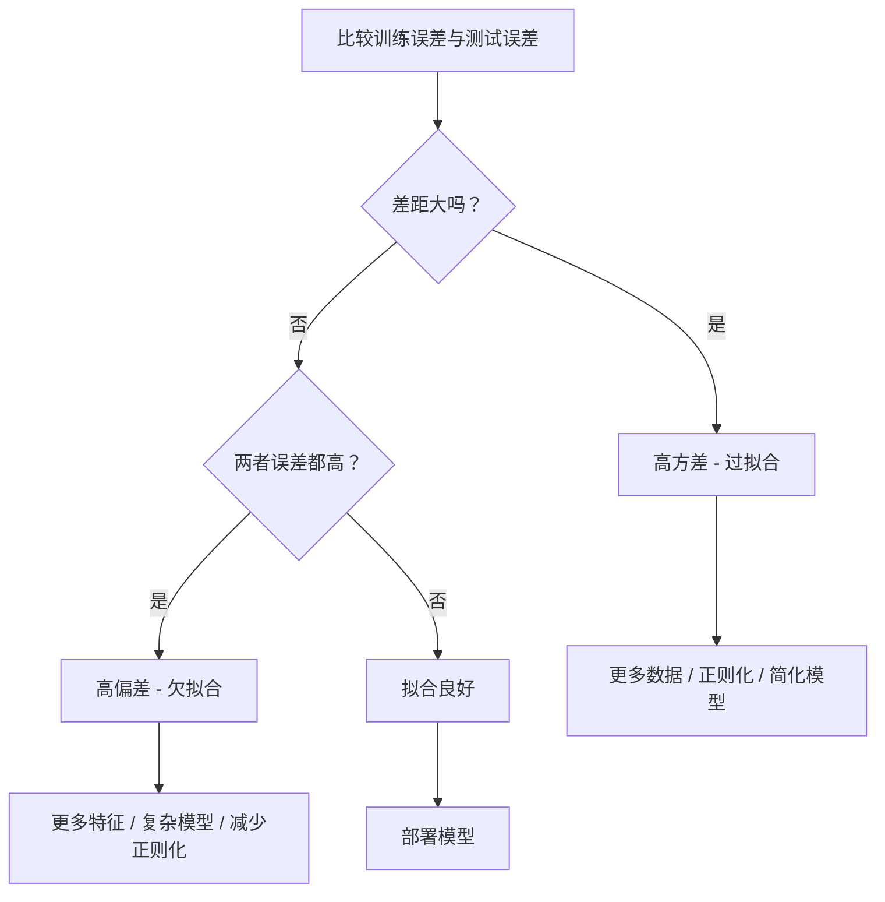
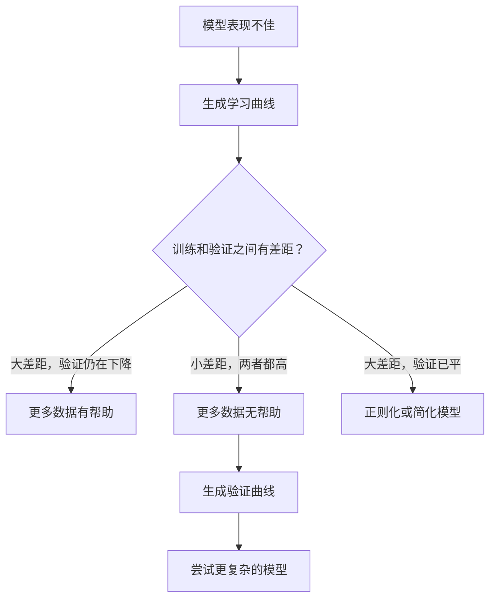

# 偏差-方差权衡

> 每一个模型误差都来自三个来源之一：偏差、方差或噪声。你只能控制前两个。

**类型：** 学习
**语言：** Python
**先修知识：** 第二阶段，第 01-09 课（ML 基础、回归、分类、评估）
**时间：** 约 75 分钟

## 学习目标

- 推导期望预测误差的偏差-方差分解，并解释不可约噪声的作用
- 使用训练误差和测试误差的模式诊断模型是高偏差还是高方差
- 解释正则化技术（L1、L2、Dropout、早停）如何在偏差和方差之间进行权衡
- 实现实验，在不同复杂度的模型上可视化偏差-方差权衡

## 问题描述

你训练了一个模型。它在测试数据上有一些误差。这些误差从何而来？

如果你的模型过于简单（在曲线数据集上进行线性回归），它将总是无法捕捉到真实的模式。这就是**偏差**。如果你的模型过于复杂（在 15 个数据点上拟合 20 次多项式），它将完美拟合训练数据，但在新数据上的预测却大相径庭。这就是**方差**。

对于固定的模型容量，你无法同时最小化两者。降低偏差，方差就会上升。降低方差，偏差就会上升。理解这种权衡是机器学习中最有用的诊断技能。它能告诉你，是应该让模型变得更复杂还是更简单，是应该获取更多数据还是设计更好的特征，是应该增加还是减少正则化。

## 核心概念

### 偏差：系统性误差

偏差衡量模型平均预测值与真实值的偏离程度。如果你在从同一分布中抽取的许多不同训练集上训练同一个模型，并对预测值取平均，偏差就是这个平均值与真实值之间的差距。

高偏差意味着模型过于僵化，无法捕捉真实模式。无论你给多少数据，一条拟合抛物线的直线总会错过曲线。这就是**欠拟合**。

```
高偏差（欠拟合）：
  模型总是预测大致相同的错误结果。
  训练误差：高
  测试误差：高
  两者之间的差距：小
```

### 方差：对训练数据的敏感性

方差衡量当你使用不同数据子集进行训练时，预测值的变化程度。如果训练集的微小变化会引起模型的巨大变化，那么方差就高。

高方差意味着模型在拟合训练数据中的噪声，而非底层信号。一个 20 次多项式会穿过每一个训练点，但在点之间会剧烈震荡。这就是**过拟合**。

```
高方差（过拟合）：
  模型完美拟合训练数据，但在新数据上表现糟糕。
  训练误差：低
  测试误差：高
  两者之间的差距：大
```

### 偏差-方差分解

对于任何点 x，在平方损失下的期望预测误差可以精确分解为：

```
期望误差 = 偏差² + 方差 + 不可约噪声

其中：
  偏差²   = (E[f_hat(x)] - f(x))²
  方差 = E[(f_hat(x) - E[f_hat(x)])²]
  噪声    = E[(y - f(x))²]             (σ²)
```

- `f(x)` 是真实函数
- `f_hat(x)` 是你的模型的预测值
- `E[...]` 是对不同训练集取期望
- `y` 是观察到的标签（真实函数加噪声）

噪声项是不可约的。在带噪声的数据上，没有任何模型能做得比 σ² 更好。你的工作是在偏差² 和方差之间找到正确的平衡。

### 模型复杂度 vs 误差


经典的 U 形曲线：

| 复杂度 | 偏差 | 方差 | 总误差 |
|---|---|---|---|
| 过低 | 高 | 低 | 高 (欠拟合) |
| 刚好合适 | 中等 | 中等 | 最低 |
| 过高 | 低 | 高 | 高 (过拟合) |

### 正则化作为偏差-方差控制手段

正则化有意地增加偏差以减少方差。它约束模型，使其无法追逐噪声。

- **L2 (岭回归)**：将所有权重向零收缩。保留所有特征，但降低它们的影响力。
- **L1 (套索回归)**：将某些权重精确地推到零。执行特征选择。
- **Dropout**：在训练期间随机禁用神经元。强制产生冗余表示。
- **早停**：在模型完全拟合训练数据之前停止训练。

正则化强度（λ、丢弃率、训练轮数）直接控制你在偏差-方差曲线上的位置。更多的正则化意味着更多的偏差，更少的方差。

### 双重下降：现代视角

经典理论认为：过了最佳平衡点后，增加复杂度只会带来坏处。但自 2019 年以来的研究显示了一些意想不到的结果。如果你继续增加模型容量，远远超过插值阈值（模型拥有足以完美拟合训练数据的参数数量），测试误差可能会再次下降。


这种"双重下降"现象解释了为什么过度参数化的神经网络（参数数量远超训练样本）仍然具有良好的泛化能力。经典的偏差-方差权衡并没有错，但对于现代深度学习来说，它是不完整的。

关于双重下降的关键观察：
- 它发生在线性模型、决策树和神经网络中
- 在插值区域，更多的数据实际上可能有害（样本层面的双重下降）
- 更多的训练轮次也可能导致它（轮次层面的双重下降）
- 正则化会平滑峰值，但不会消除它

为什么会发生这种情况？在插值阈值处，模型恰好有足够的能力拟合所有训练点。它被迫找到一个精确穿过每个点的非常特定的解，数据中的微小扰动会导致拟合的巨大变化。这是方差峰值的地方。超过阈值后，模型有许多可能的解可以完美拟合数据。学习算法（例如，带有隐式正则化的梯度下降）倾向于选择其中最简的那个。这种对简单解的隐式偏好是过度参数化模型能够泛化的原因。

| 阶段 | 参数 vs 样本 | 行为 |
|---|---|---|
| 欠参数化 | p << n | 经典权衡适用 |
| 插值阈值 | p ~ n | 方差达到峰值，测试误差激增 |
| 过参数化 | p >> n | 隐式正则化生效，测试误差下降 |

实际应用：如果你使用神经网络或大型树集成，不要在插值阈值处停止。要么停留在远低于它的地方（使用显式正则化），要么远远超过它。最糟糕的地方是正好在阈值上。

### 诊断你的模型



| 症状 | 诊断 | 解决方案 |
|---|---|---|
| 训练误差高，测试误差高 | 偏差 | 更多特征，更复杂的模型，减少正则化 |
| 训练误差低，测试误差高 | 方差 | 更多数据，正则化，简化模型，Dropout |
| 训练误差低，测试误差低 | 拟合良好 | 部署 |
| 训练误差下降，测试误差上升 | 正在过拟合 | 早停 |

### 实用策略

**当问题是偏差时：**
- 添加多项式或交互特征
- 使用更灵活的模型（如树集成替代线性模型）
- 减少正则化强度
- 训练更长时间（如果尚未收敛）

**当问题是方差时：**
- 获取更多训练数据
- 使用 Bagging（随机森林）
- 增加正则化（更高的 λ，更多的 Dropout）
- 特征选择（移除噪声特征）
- 使用交叉验证及早发现

### 集成方法与方差减少

集成方法是对抗方差最实用的工具。

**Bagging（自助聚合）** 在训练数据的不同自助样本上训练多个模型，然后平均它们的预测值。每个单独的模型都有高方差，但平均值的方差要低得多。随机森林就是将 Bagging 应用于决策树。

为什么它在数学上有效：如果你平均 N 个独立的预测值，每个预测值的方差为 σ²，那么平均值的方差为 σ² / N。这些模型并非完全独立（它们都看到相似的数据），因此减少量小于 1/N，但仍然相当可观。

**Boosting** 通过顺序构建模型来减少偏差，每个新模型都专注于集成模型到目前为止的误差。梯度提升和 AdaBoost 是主要的例子。如果添加过多模型，Boosting 可能会过拟合，因此你需要早停或正则化。

| 方法 | 主要效果 | 偏差变化 | 方差变化 |
|---|---|---|---|
| Bagging | 减少方差 | 无变化 | 减少 |
| Boosting | 减少偏差 | 减少 | 可能增加 |
| Stacking | 同时减少 | 取决于元学习器 | 取决于基模型 |
| Dropout | 隐式 Bagging | 轻微增加 | 减少 |

**实用规则：** 如果你的基模型具有高方差（如深层树、高次多项式），使用 Bagging。如果你的基模型具有高偏差（如浅层决策树桩、简单线性模型），使用 Boosting。

### 学习曲线

学习曲线绘制了作为训练集大小函数的训练误差和验证误差。这是你拥有的最实用的诊断工具。与单次训练/测试比较不同，学习曲线向你展示了模型的轨迹，并告诉你更多数据是否有帮助。


如何解读：

| 场景 | 训练误差 | 验证误差 | 差距 | 含义 | 做什么 |
|---|---|---|---|---|---|
| 高偏差 | 高 | 高 | 小 | 模型无法捕捉模式 | 更多特征，复杂模型，减少正则化 |
| 高方差 | 低 | 高 | 大 | 模型记忆训练数据 | 更多数据，正则化，简化模型 |
| 拟合良好 | 中等 | 中等 | 小 | 模型泛化良好 | 部署 |
| 高方差，有改善 | 低 | 随数据增加而下降 | 缩小 | 可通过数据修复的方差问题 | 收集更多数据 |
| 高偏差，平坦 | 高 | 高且平坦 | 平坦 | 更多数据无帮助 | 改变模型架构 |

关键洞察：如果两条曲线都已趋于平缓，差距很小但误差都高，那么更多数据是无用的。你需要一个更好的模型。如果差距很大且仍在缩小，更多数据会有帮助。

### 如何生成学习曲线

有两种方法：

**方法 1：改变训练集大小，固定模型。** 保持模型和超参数不变。在训练数据的递增子集上训练。在每个大小上测量训练误差和验证误差。这是标准的学习曲线。

**方法 2：改变模型复杂度，固定数据。** 保持数据不变。扫描一个复杂度参数（多项式次数、树深度、层数）。在每个复杂度上测量训练误差和验证误差。这是一条验证曲线，直接显示了偏差-方差的权衡。

这两种方法相互补充。第一种告诉你更多数据是否有帮助。第二种告诉你不同的模型是否有帮助。在决定下一步之前，两者都应运行。



## 动手实现

`code/bias_variance.py` 中的代码运行了完整的偏差-方差分解实验。以下是逐步说明。

### 步骤 1：从已知函数生成合成数据

我们使用 `f(x) = sin(1.5x) + 0.5x` 并添加高斯噪声。知道真实函数使我们能够精确计算偏差和方差。

```python
def true_function(x):
    return np.sin(1.5 * x) + 0.5 * x

def generate_data(n_samples=30, noise_std=0.5, x_range=(-3, 3), seed=None):
    rng = np.random.RandomState(seed)
    x = rng.uniform(x_range[0], x_range[1], n_samples)
    y = true_function(x) + rng.normal(0, noise_std, n_samples)
    return x, y
```

### 步骤 2：自助采样和多项式拟合

对于每个多项式次数，我们抽取许多自助训练集，拟合多项式，并在固定的测试网格上记录预测值。这给了我们在每个测试点上的预测分布。

```python
def fit_polynomial(x_train, y_train, degree, lam=0.0):
    X = np.column_stack([x_train ** d for d in range(degree + 1)])
    if lam > 0:
        penalty = lam * np.eye(X.shape[1])
        penalty[0, 0] = 0
        w = np.linalg.solve(X.T @ X + penalty, X.T @ y_train)
    else:
        w = np.linalg.lstsq(X, y_train, rcond=None)[0]
    return w
```

我们在 200 个不同的自助样本上进行拟合。每个自助样本来自相同的底层分布，但包含不同的点。

### 步骤 3：计算偏差²、方差分解

在每个测试点上有 200 组预测值，我们可以根据定义直接计算分解：

```python
mean_pred = predictions.mean(axis=0)
bias_sq = np.mean((mean_pred - y_true) ** 2)
variance = np.mean(predictions.var(axis=0))
total_error = np.mean(np.mean((predictions - y_true) ** 2, axis=1))
```

- `mean_pred` 是通过自助样本估计的 E[f_hat(x)]
- `bias_sq` 是平均预测值与真实值之间的平方差距
- `variance` 是跨自助样本的预测值的平均散布程度
- `total_error` 应近似等于 bias² + variance + 噪声

### 步骤 4：学习曲线

学习曲线在保持模型复杂度固定的同时扫描训练集大小。它们显示你的模型是受数据限制还是受容量限制。

```python
def demo_learning_curves():
    sizes = [10, 15, 20, 30, 50, 75, 100, 150, 200, 300]
    degree = 5

    for n in sizes:
        train_errors = []
        test_errors = []
        for seed in range(50):
            x_train, y_train = generate_data(n_samples=n, seed=seed * 100)
            w = fit_polynomial(x_train, y_train, degree)
            train_pred = predict_polynomial(x_train, w)
            train_mse = np.mean((train_pred - y_train) ** 2)
            test_pred = predict_polynomial(x_test, w)
            test_mse = np.mean((test_pred - y_test) ** 2)
            train_errors.append(train_mse)
            test_errors.append(test_mse)
        # 多次运行的平均值给出学习曲线上的点
```

对于一个高方差模型（小数据时的 5 次多项式），你会看到：
- 训练误差开始时较低，随着更多数据使记忆变得更困难而增加
- 测试误差开始时较高，随着模型获得更多信号而降低
- 差距随着更多数据而缩小

对于一个高偏差模型（1 次多项式），两条曲线都迅速收敛到相同的高值，更多数据也无济于事。

### 步骤 5：正则化扫描

代码中还包含 `demo_regularization_sweep()`，它固定一个高次多项式（15 次），并扫描岭回归的正则化强度从 0.001 到 100。这从另一个角度展示了偏差-方差权衡：不是改变模型复杂度，而是改变约束强度。

```python
def demo_regularization_sweep():
    alphas = [0.001, 0.005, 0.01, 0.05, 0.1, 0.5, 1.0, 5.0, 10.0, 50.0, 100.0]
    for alpha in alphas:
        results = bias_variance_decomposition([15], lam=alpha)
        r = results[15]
        print(f"alpha={alpha:.3f}  bias={r['bias_sq']:.4f}  var={r['variance']:.4f}")
```

当 alpha 低时，15 次多项式几乎不受约束。方差占主导地位，因为模型在每个自助样本中追逐噪声。当 alpha 高时，惩罚如此之强，以至于模型实际上变成了一个接近常数的函数。偏差占主导地位。最优的 alpha 位于这两个极端之间。

这与改变多项式次数的 U 形曲线相同，但由一个连续的旋钮而非离散的旋钮控制。在实践中，正则化是控制权衡的首选方法，因为它允许在不改变特征集的情况下进行精细控制。

## 使用示例

sklearn 提供了 `learning_curve` 和 `validation_curve` 来自动化这些诊断，无需编写自助采样循环。

### 验证曲线：扫描模型复杂度

```python
from sklearn.model_selection import validation_curve
from sklearn.pipeline import make_pipeline
from sklearn.preprocessing import PolynomialFeatures
from sklearn.linear_model import Ridge

degrees = list(range(1, 16))
train_scores_all = []
val_scores_all = []

for d in degrees:
    pipe = make_pipeline(PolynomialFeatures(d), Ridge(alpha=0.01))
    train_scores, val_scores = validation_curve(
        pipe, X, y, param_name="polynomialfeatures__degree",
        param_range=[d], cv=5, scoring="neg_mean_squared_error"
    )
    train_scores_all.append(-train_scores.mean())
    val_scores_all.append(-val_scores.mean())
```

这直接给出了偏差-方差权衡曲线。在验证分数相对于训练分数最差的地方，方差占主导地位。在两者都差的地方，偏差占主导地位。

### 学习曲线：扫描训练集大小

```python
from sklearn.model_selection import learning_curve

pipe = make_pipeline(PolynomialFeatures(5), Ridge(alpha=0.01))
train_sizes, train_scores, val_scores = learning_curve(
    pipe, X, y, train_sizes=np.linspace(0.1, 1.0, 10),
    cv=5, scoring="neg_mean_squared_error"
)
train_mse = -train_scores.mean(axis=1)
val_mse = -val_scores.mean(axis=1)
```

绘制 `train_mse` 和 `val_mse` 对 `train_sizes` 的图。曲线的形状告诉你关于模型的一切。

### 用交叉验证扫描正则化

```python
from sklearn.model_selection import cross_val_score

alphas = [0.001, 0.01, 0.1, 1.0, 10.0, 100.0]
for alpha in alphas:
    pipe = make_pipeline(PolynomialFeatures(10), Ridge(alpha=alpha))
    scores = cross_val_score(pipe, X, y, cv=5, scoring="neg_mean_squared_error")
    print(f"alpha={alpha:>7.3f}  MSE={-scores.mean():.4f} +/- {scores.std():.4f}")
```

这对于固定模型复杂度扫描正则化强度。你会看到相同的偏差-方差权衡：低 alpha 意味着高方差，高 alpha 意味着高偏差。

### 整合：完整的诊断工作流

在实践中，你按顺序运行这些诊断：

1.  训练你的模型。计算训练误差和测试误差。
2.  如果两者都高：你有一个偏差问题。跳到第 4 步。
3.  如果训练低但测试高：你有一个方差问题。生成学习曲线，看看更多数据是否有帮助。如果没有，进行正则化。
4.  生成一个扫描主要复杂度参数的验证曲线。找到最佳平衡点。
5.  在最佳平衡点，生成学习曲线。如果差距仍然很大，你需要更多数据或正则化。
6.  使用 `cross_val_score` 尝试不同 alpha 值的岭回归/套索回归。选择交叉验证误差最低的 alpha。

对于大多数表格数据集，这需要 10-15 分钟的计算时间，却能节省数小时的猜测时间。

## 交付成果

本课程产出：`outputs/prompt-model-diagnostics.md`

## 练习

1.  使用 `noise_std=0`（无噪声）运行分解。不可约误差项会发生什么？最优复杂度会改变吗？

2.  将训练集大小从 30 增加到 300。这对方差分量有何影响？最优多项式次数会变化吗？

3.  向实验中添加 L2 正则化（岭回归）。对于固定的高次多项式（15 次），将 λ 从 0 扫描到 100。绘制偏差² 和方差随 λ 变化的图。

4.  将真实函数从多项式修改为 `sin(x)`。偏差-方差分解会如何变化？是否仍然存在一个清晰的最优次数？

5.  实现一个简单的自助聚合（Bagging）包装器：在自助样本上训练 10 个模型并平均预测值。证明这可以在不明显增加偏差的情况下减少方差。

## 关键术语表

| 术语 | 人们通常说 | 实际含义 |
|---|---|---|
| 偏差 | "模型太简单了" | 来自错误假设的系统性误差。模型平均预测值与真实值之间的差距。 |
| 方差 | "模型过拟合了" | 来自对训练数据敏感性的误差。预测值在不同训练集之间的变化程度。 |
| 不可约误差 | "数据中的噪声" | 来自真实数据生成过程中随机性的误差。任何模型都无法消除它。 |
| 欠拟合 | "学习不足" | 模型具有高偏差。即使在训练数据上也未能捕捉到真实模式。 |
| 过拟合 | "记忆数据" | 模型具有高方差。它拟合了训练数据中的噪声，而这些噪声无法泛化。 |
| 正则化 | "约束模型" | 添加惩罚项以降低模型复杂度，用偏差换取更低的方差。 |
| 双重下降 | "更多参数反而有帮助" | 当模型容量远超过插值阈值时，测试误差再次下降。 |
| 模型复杂度 | "模型的灵活性" | 模型拟合任意模式的能力。由架构、特征或正则化控制。 |

## 延伸阅读

- [Hastie, Tibshirani, Friedman: The Elements of Statistical Learning, Ch. 7](https://hastie.su.domains/ElemStatLearn/) —— 关于偏差-方差分解的权威论述
- [Belkin et al., Reconciling modern machine learning practice and the bias-variance trade-off (2019)](https://arxiv.org/abs/1812.11118) —— 双重下降论文
- [Nakkiran et al., Deep Double Descent (2019)](https://arxiv.org/abs/1912.02292) —— 关于轮次层面和样本层面的双重下降
- [Scott Fortmann-Roe: Understanding the Bias-Variance Tradeoff](http://scott.fortmann-roe.com/docs/BiasVariance.html) —— 清晰的可视化解释