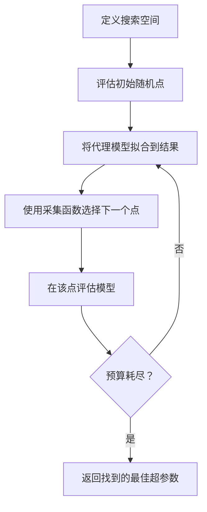
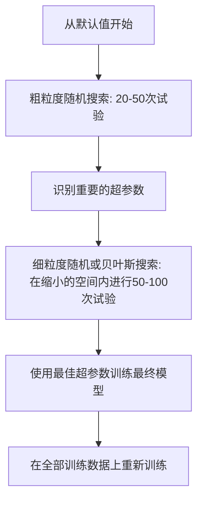
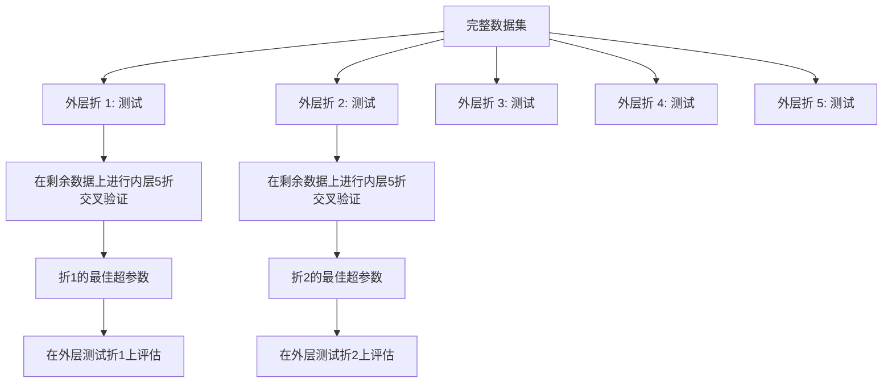

# 超参数调优

> 超参数是你在训练开始前需要调节的旋钮。能否调好它们，决定了模型是表现平平还是性能卓越。

**类型：** 构建
**语言：** Python
**先修知识：** 第二阶段，第11课（集成方法）
**时间：** 约90分钟

## 学习目标

- 从零实现网格搜索、随机搜索和贝叶斯优化，并比较它们的采样效率
- 解释为什么当大多数超参数的有效维度较低时，随机搜索优于网格搜索
- 构建一个使用代理模型和采集函数来指导搜索的贝叶斯优化循环
- 设计一种超参数调优策略，通过恰当的交叉验证来避免对验证集过拟合

## 问题描述

你的梯度提升模型包含多个超参数：学习率、树的数量、最大深度、每片叶子最小样本数、子采样比例、列采样比例。这就有六个超参数。如果每个参数有5个合理取值，网格就有5⁶ = 15,625种组合。每训练一次需要10秒，那么尝试所有组合需要43小时的计算量。

网格搜索是显而易见的做法，但也是在大规模调优中最糟糕的做法。随机搜索用更少的计算量做得更好。贝叶斯优化则更进一步，能从过去的评估中学习。知道该用哪种策略，以及哪些超参数真正重要，可以节省数天的GPU浪费时间。

## 核心概念

### 参数 vs 超参数

**参数**是在训练过程中学习到的（权重、偏置、分裂阈值）。**超参数**是在训练开始前设定的，用于控制学习过程。

| 超参数 | 控制内容 | 典型范围 |
|---|---|---|
| 学习率 | 每次更新的步长 | 0.001 到 1.0 |
| 树/轮次数量 | 训练时长 | 10 到 10,000 |
| 最大深度 | 模型复杂度 | 1 到 30 |
| 正则化系数 (λ) | 防止过拟合 | 0.0001 到 100 |
| 批量大小 | 梯度估计噪声 | 16 到 512 |
| Dropout比率 | 丢弃神经元的比例 | 0.0 到 0.5 |

### 网格搜索

网格搜索会评估所有指定值的组合。它详尽无遗且易于理解，但其计算量会随着超参数数量的增加而呈指数级增长。

```
2个超参数的网格：

  learning_rate: [0.01, 0.1, 1.0]
  max_depth:     [3, 5, 7]

  评估次数: 3 x 3 = 9 种组合

  (0.01, 3)  (0.01, 5)  (0.01, 7)
  (0.1,  3)  (0.1,  5)  (0.1,  7)
  (1.0,  3)  (1.0,  5)  (1.0,  7)
```

网格搜索有一个根本缺陷：如果其中一个超参数很重要而另一个不重要，那么大部分评估都会被浪费。使用9次评估，你只能得到重要参数的3个唯一值。

### 随机搜索

随机搜索从分布中采样超参数，而不是使用固定的网格。在同样9次评估的预算下，你可以得到每个超参数的9个唯一值。


为什么随机搜索优于网格搜索（Bergstra & Bengio, 2012）：

- 大多数超参数的有效维度较低。对于一个给定的问题，6个超参数中通常只有1-2个是真正重要的。
- 网格搜索在不重要的维度上浪费了评估机会。
- 在相同预算下，随机搜索能更密集地覆盖重要维度。
- 进行60次随机试验，你有95%的机会找到一个距离最优解5%以内的点（如果该解在搜索空间内存在）。

### 贝叶斯优化

随机搜索忽略了过去的结果。它无法学到"高学习率会导致发散"或"深度3 consistently 优于深度10"这样的规律。贝叶斯优化利用过去的评估来决定下一步在哪里搜索。



两个关键组成部分：

**代理模型：** 一个评估成本低廉的模型（通常是高斯过程），用于近似代价高昂的目标函数。它能在搜索空间中的任意点给出预测值和不确定性估计。

**采集函数：** 通过在探索（在已知好点附近搜索）和利用（在不确定性高的区域搜索）之间取得平衡，决定下一个评估点。常见的选择包括：

- **期望提升：** 在这个点，我们预期相比当前最优值能提升多少？
- **上置信界：** 预测值加上一定倍数的不确定性。UCB值高意味着要么该点有希望，要么尚未被探索。
- **改进概率：** 这个点超过当前最优值的概率是多少？

贝叶斯优化通常能以比随机搜索少2-5倍的评估次数找到更好的超参数。与训练实际模型相比，拟合代理模型的开销可以忽略不计。

### 早停

并非每次训练都需要跑完。如果一个配置在10轮后明显表现不佳，就应该停止它并继续下一个。这就是超参数搜索语境下的早停。

策略：
- **基于耐心：** 如果验证损失连续 N 轮没有改善，则停止。
- **中位数剪枝：** 如果某次试验的中间结果比所有已完成试验在同一阶段的中位数还差，则停止。
- **Hyperband：** 为许多配置分配少量预算，然后逐步为表现最好的配置增加预算。

Hyperband 尤其有效。它从81个配置开始，每个只跑1轮，保留排名前三分之一的配置，给它们3轮，再保留前三分之一，依此类推。这比用全额预算评估所有配置快10-50倍找到好配置。

### 学习率调度器

学习率几乎总是最重要的超参数。与其保持固定不变，调度器可以在训练过程中调整它。

| 调度器 | 公式 | 使用场景 |
|---|---|---|
| 阶梯式衰减 | 每 N 轮乘以 0.1 | 经典的 CNN 训练 |
| 余弦退火 | lr * 0.5 * (1 + cos(pi * t / T)) | 现代默认选择 |
| 预热 + 衰减 | 线性上升，然后余弦衰减 | Transformer |
| 单周期 | 在一个周期内先升后降 | 实现快速收敛 |
| 基于平台下降 | 当指标停滞时按因子减少 | 安全的默认选择 |

### 超参数重要性

并非所有超参数都同等重要。关于随机森林（Probst et al., 2019）和梯度提升的研究显示了一致的规律：

**重要性高：**
- 学习率（始终首先调优）
- 估计器/轮次数量（用早停替代调优）
- 正则化强度

**重要性中等：**
- 最大深度 / 层数
- 叶子节点最小样本数 / 权重衰减
- 子采样比例

**重要性低：**
- 最大特征数（对于随机森林）
- 具体的激活函数选择
- 批量大小（在合理范围内）

先调优重要的参数，其余保持默认值。

### 实践策略



具体工作流：

1.  **从库的默认值开始。** 这些是经验丰富的从业者选择的，通常能达到80%的效果。
2.  **粗粒度随机搜索。** 设定宽泛的范围，进行20-50次试验。使用早停快速终止差的试验。
3.  **分析结果。** 哪些超参数与性能相关？缩小搜索空间。
4.  **细粒度搜索。** 在缩小的空间内进行贝叶斯优化或聚焦的随机搜索。进行50-100次试验。
5.  **使用找到的最佳超参数，在所有训练数据上重新训练模型。**

### 与交叉验证的集成

在单个验证集上调优超参数是有风险的。最佳超参数可能会过拟合到特定的验证集。**嵌套交叉验证**通过使用两层循环来解决这个问题：

- **外层循环**（评估）：将数据划分为训练+验证集和测试集。报告无偏的性能。
- **内层循环**（调优）：将训练+验证集划分为训练集和验证集。找到最佳超参数。



每个外层折独立地找到它自己的最佳超参数。外层分数是对泛化性能的无偏估计。

使用 sklearn：

```python
from sklearn.model_selection import cross_val_score, GridSearchCV
from sklearn.ensemble import GradientBoostingRegressor

inner_cv = GridSearchCV(
    GradientBoostingRegressor(),
    param_grid={
        "learning_rate": [0.01, 0.05, 0.1],
        "max_depth": [2, 3, 5],
        "n_estimators": [50, 100, 200],
    },
    cv=5,
    scoring="neg_mean_squared_error",
)

outer_scores = cross_val_score(
    inner_cv, X, y, cv=5, scoring="neg_mean_squared_error"
)

print(f"Nested CV MSE: {-outer_scores.mean():.4f} +/- {outer_scores.std():.4f}")
```

这种方法计算量很大（5个外层折 × 5个内层折 × 27个网格点 = 675次模型拟合），但它能给你一个可靠的性能估计。当你在论文中报告最终结果，或者决策事关重大时，应使用此方法。

### 实用技巧

**从学习率开始。** 对于基于梯度的方法，它始终是最重要的超参数。糟糕的学习率会让其他一切变得无关紧要。先将其他超参数固定为默认值，扫描学习率。

**为学习率和正则化使用对数均匀分布。** 0.001 和 0.01 之间的差异与 0.1 和 1.0 之间的差异同等重要。线性搜索会在大端值上浪费预算。

**使用早停而不是调优 n_estimators。** 对于提升和神经网络，将 n_estimators 或轮次设得足够高，让早停决定何时停止。这样可以从搜索中移除一个超参数。

**预算分配。** 将 60% 的调优预算分配给最重要的前两个超参数，剩下的 40% 分配给其他所有参数。前两个参数贡献了大部分的性能差异。

**尺度很重要。** 永远不要在对数尺度上搜索批量大小（16、32、64 即可）。始终在对数尺度上搜索学习率。让搜索分布与超参数影响模型的方式相匹配。

| 模型类型 | 最重要的超参数 | 推荐搜索方式 | 预算 |
|---|---|---|---|
| 随机森林 | n_estimators, max_depth, min_samples_leaf | 随机搜索，50次试验 | 低（训练快） |
| 梯度提升 | learning_rate, n_estimators, max_depth | 贝叶斯优化，100次试验 + 早停 | 中等 |
| 神经网络 | learning_rate, weight_decay, batch_size | 贝叶斯或随机搜索，100+次试验 | 高（训练慢） |
| SVM | C, gamma (RBF核) | 对数尺度网格搜索，25-50次试验 | 低（2个参数） |
| Lasso/Ridge | alpha | 对数尺度一维搜索，20次试验 | 非常低 |
| XGBoost | learning_rate, max_depth, subsample, colsample | 贝叶斯优化，100-200次试验 + 早停 | 中等 |

**不确定时：** 随机搜索，试验次数设置为超参数数量的2倍（例如，6个超参数，至少12次试验）。你会惊讶于50次随机搜索试验常常能击败精心设计的网格搜索。

## 动手实现

### 步骤 1：从零实现网格搜索

`code/tuning.py` 中的代码从零实现了网格搜索、随机搜索和一个简单的贝叶斯优化器。

```python
def grid_search(model_fn, param_grid, X_train, y_train, X_val, y_val):
    keys = list(param_grid.keys())
    values = list(param_grid.values())
    best_score = -float("inf")
    best_params = None
    n_evals = 0

    for combo in itertools.product(*values):
        params = dict(zip(keys, combo))
        model = model_fn(**params)
        model.fit(X_train, y_train)
        score = evaluate(model, X_val, y_val)
        n_evals += 1

        if score > best_score:
            best_score = score
            best_params = params

    return best_params, best_score, n_evals
```

### 步骤 2：从零实现随机搜索

```python
def random_search(model_fn, param_distributions, X_train, y_train,
                  X_val, y_val, n_iter=50, seed=42):
    rng = np.random.RandomState(seed)
    best_score = -float("inf")
    best_params = None

    for _ in range(n_iter):
        params = {k: sample(v, rng) for k, v in param_distributions.items()}
        model = model_fn(**params)
        model.fit(X_train, y_train)
        score = evaluate(model, X_val, y_val)

        if score > best_score:
            best_score = score
            best_params = params

    return best_params, best_score, n_iter
```

### 步骤 3：贝叶斯优化（简化版）

核心思想：将高斯过程拟合到观察到的（超参数，得分）对上，然后使用采集函数决定下一步在哪里搜索。

```python
class SimpleBayesianOptimizer:
    def __init__(self, search_space, n_initial=5):
        self.search_space = search_space
        self.n_initial = n_initial
        self.X_observed = []
        self.y_observed = []

    def _kernel(self, x1, x2, length_scale=1.0):
        dists = np.sum((x1[:, None, :] - x2[None, :, :]) ** 2, axis=2)
        return np.exp(-0.5 * dists / length_scale ** 2)

    def _fit_gp(self, X_new):
        X_obs = np.array(self.X_observed)
        y_obs = np.array(self.y_observed)
        y_mean = y_obs.mean()
        y_centered = y_obs - y_mean

        K = self._kernel(X_obs, X_obs) + 1e-4 * np.eye(len(X_obs))
        K_star = self._kernel(X_new, X_obs)

        L = np.linalg.cholesky(K)
        alpha = np.linalg.solve(L.T, np.linalg.solve(L, y_centered))
        mu = K_star @ alpha + y_mean

        v = np.linalg.solve(L, K_star.T)
        var = 1.0 - np.sum(v ** 2, axis=0)
        var = np.maximum(var, 1e-6)

        return mu, var

    def _expected_improvement(self, mu, var, best_y):
        sigma = np.sqrt(var)
        z = (mu - best_y) / (sigma + 1e-10)
        ei = sigma * (z * norm_cdf(z) + norm_pdf(z))
        return ei

    def suggest(self):
        if len(self.X_observed) < self.n_initial:
            return sample_random(self.search_space)

        candidates = [sample_random(self.search_space) for _ in range(500)]
        X_cand = np.array([to_vector(c) for c in candidates])
        mu, var = self._fit_gp(X_cand)
        ei = self._expected_improvement(mu, var, max(self.y_observed))
        return candidates[np.argmax(ei)]

    def observe(self, params, score):
        self.X_observed.append(to_vector(params))
        self.y_observed.append(score)
```

GP 代理在每个候选点给出两样东西：预测得分和不确定性。期望提升平衡这两者：它倾向于模型预测得分高或者不确定性高的点。早期，大多数点不确定性高，所以优化器会进行探索。后期，它会聚焦于最有希望的区域。

### 步骤 4：比较所有方法

在相同合成目标上运行所有三种方法并进行比较。此比较使用一个简化的包装器，直接调用目标函数（不涉及模型训练），因此其 API 与上述基于模型的实现有所不同：

```python
def synthetic_objective(params):
    lr = params["learning_rate"]
    depth = params["max_depth"]
    return -(np.log10(lr) + 2) ** 2 - (depth - 4) ** 2 + 10

param_grid = {
    "learning_rate": [0.001, 0.01, 0.1, 1.0],
    "max_depth": [2, 3, 4, 5, 6, 7, 8],
}

grid_best = None
grid_score = -float("inf")
grid_history = []
for combo in itertools.product(*param_grid.values()):
    params = dict(zip(param_grid.keys(), combo))
    score = synthetic_objective(params)
    grid_history.append((params, score))
    if score > grid_score:
        grid_score = score
        grid_best = params

param_dist = {
    "learning_rate": ("log_float", 0.001, 1.0),
    "max_depth": ("int", 2, 8),
}

rand_best = None
rand_score = -float("inf")
rand_history = []
rng = np.random.RandomState(42)
for _ in range(28): # 与网格搜索评估次数大致相同
    params = {k: sample(v, rng) for k, v in param_dist.items()}
    score = synthetic_objective(params)
    rand_history.append((params, score))
    if score > rand_score:
        rand_score = score
        rand_best = params

optimizer = SimpleBayesianOptimizer(param_dist, n_initial=5)
bayes_history = []
for _ in range(28):
    params = optimizer.suggest()
    score = synthetic_objective(params)
    optimizer.observe(params, score)
    bayes_history.append((params, score))
bayes_score = max(s for _, s in bayes_history)

print(f"{'方法':<20} {'最佳得分':>12} {'评估次数':>12}")
print("-" * 50)
print(f"{'网格搜索':<20} {grid_score:>12.4f} {len(grid_history):>12}")
print(f"{'随机搜索':<20} {rand_score:>12.4f} {len(rand_history):>12}")
print(f"{'贝叶斯优化':<20} {bayes_score:>12.4f} {len(bayes_history):>12}")
```

在相同预算下，贝叶斯优化通常能最快找到最佳得分，因为它不会在明显糟糕的区域浪费评估。随机搜索比网格搜索覆盖更广。网格搜索只有在超参数很少且可以进行穷举时才会胜出。

## 使用示例

### 实际使用中的 Optuna

Optuna 是推荐的超参数调优库。它原生支持剪枝、分布式搜索和可视化。

```python
import optuna

def objective(trial):
    lr = trial.suggest_float("learning_rate", 1e-4, 1e-1, log=True)
    n_est = trial.suggest_int("n_estimators", 50, 500)
    max_depth = trial.suggest_int("max_depth", 2, 10)

    model = GradientBoostingRegressor(
        learning_rate=lr,
        n_estimators=n_est,
        max_depth=max_depth,
    )
    model.fit(X_train, y_train)
    return mean_squared_error(y_val, model.predict(X_val))

study = optuna.create_study(direction="minimize")
study.optimize(objective, n_trials=100)

print(f"最佳参数: {study.best_params}")
print(f"最佳 MSE: {study.best_value:.4f}")
```

Optuna 的关键特性：
- `suggest_float(..., log=True)` 用于最适合在对数尺度上搜索的参数（学习率、正则化）
- `suggest_int` 用于整数参数
- `suggest_categorical` 用于离散选项
- 内置的 MedianPruner 用于对表现差的试验进行早停
- `study.trials_dataframe()` 用于分析

### 带剪枝的 Optuna

剪枝会在早期停止没有希望的试验，从而节省大量计算量。模式如下：

```python
import optuna
from sklearn.model_selection import cross_val_score

def objective(trial):
    params = {
        "learning_rate": trial.suggest_float("lr", 1e-4, 0.5, log=True),
        "max_depth": trial.suggest_int("max_depth", 2, 10),
        "n_estimators": trial.suggest_int("n_estimators", 50, 500),
        "subsample": trial.suggest_float("subsample", 0.5, 1.0),
    }

    model = GradientBoostingRegressor(**params)
    scores = cross_val_score(model, X_train, y_train, cv=3,
                             scoring="neg_mean_squared_error")
    mean_score = -scores.mean()

    trial.report(mean_score, step=0)
    if trial.should_prune():
        raise optuna.TrialPruned()

    return mean_score

pruner = optuna.pruners.MedianPruner(n_startup_trials=10, n_warmup_steps=5)
study = optuna.create_study(direction="minimize", pruner=pruner)
study.optimize(objective, n_trials=200)
```

`MedianPruner` 会在试验的中间结果比所有已完成试验在同一步骤的中位数还差时停止它。`n_startup_trials=10` 确保在剪枝开始前至少有 10 次试验完整运行。这通常能节省 40-60% 的总计算量。

### sklearn 内置的调优器

对于快速实验，sklearn 提供了 `GridSearchCV`, `RandomizedSearchCV` 和 `HalvingRandomSearchCV`:

```python
from sklearn.model_selection import RandomizedSearchCV
from scipy.stats import loguniform, randint

param_dist = {
    "learning_rate": loguniform(1e-4, 0.5),
    "max_depth": randint(2, 10),
    "n_estimators": randint(50, 500),
}

search = RandomizedSearchCV(
    GradientBoostingRegressor(),
    param_dist,
    n_iter=100,
    cv=5,
    scoring="neg_mean_squared_error",
    random_state=42,
    n_jobs=-1,
)
search.fit(X_train, y_train)
print(f"最佳参数: {search.best_params_}")
print(f"最佳交叉验证 MSE: {-search.best_score_:.4f}")
```

使用 scipy 的 `loguniform` 用于学习率和正则化。使用 `randint` 用于整数超参数。`n_jobs=-1` 标志可以在所有 CPU 核心上并行计算。

### 超参数调优中的常见错误

**预处理导致的数据泄露。** 如果在交叉验证之前对整个数据集拟合缩放器，那么验证集的信息就会泄露到训练中。始终将预处理放在 `Pipeline` 中，使其仅在训练折上拟合。

**对验证集过拟合。** 运行数千次试验实际上是在验证集上训练。对于最终性能评估，使用嵌套交叉验证，或者留出一个在调优期间绝不碰的独立测试集。

**搜索范围太窄。** 如果你的最佳值出现在搜索空间的边界上，说明你搜索的范围不够广。最优值可能还在范围之外。始终检查最佳参数是否在边界上。

**忽略交互效应。** 在提升算法中，学习率和估计器数量有很强的交互作用。低学习率需要更多的估计器。独立调优它们比一起调优效果差。

**不对迭代模型使用早停。** 对于梯度提升和神经网络，将 n_estimators 或轮次设得足够高，然后使用早停。这绝对比将迭代次数作为超参数来调优要好。

## 练习

1.  使用相同的总预算（例如，50次评估）运行网格搜索和随机搜索。比较它们找到的最佳得分。用不同的随机种子重复实验10次。随机搜索赢的次数是多少？

2.  从零实现 Hyperband。从 81 个配置开始，每个训练 1 轮。每轮保留前三分之一的配置，并将它们的预算增加三倍。比较总计算量（所有配置所有轮次的总和）与用全额预算运行 81 个配置的计算量。

3.  为第 11 课的梯度提升实现添加一个学习率调度器（余弦退火）。与固定的学习率相比，它有帮助吗？

4.  使用 Optuna 在真实数据集（例如，sklearn 的乳腺癌数据集）上调优 RandomForestClassifier。使用 `optuna.visualization.plot_param_importances(study)` 查看哪些超参数最重要。这与本课中的重要性排序相符吗？

5.  实现一个简单的采集函数（期望提升），并演示探索与利用的权衡。绘制代理模型的均值和不确定性，并展示 EI 会选择哪里作为下一个评估点。

## 关键术语表

| 术语 | 人们通常说 | 实际含义 |
|---|---|---|
| 超参数 | "你选择的设置" | 在训练前设置的、控制学习过程的值，不是从数据中学习的 |
| 网格搜索 | "尝试所有组合" | 在指定的参数网格上进行穷举搜索。成本呈指数级增长 |
| 随机搜索 | "随机采样" | 从分布中采样超参数。比网格搜索更好地覆盖重要维度 |
| 贝叶斯优化 | "智能搜索" | 使用目标函数的代理模型来决定下一步在哪里评估，平衡探索与利用 |
| 代理模型 | "一个廉价的近似" | 一个模型（通常是高斯过程），用于根据观察到的评估来近似昂贵的目标函数 |
| 采集函数 | "下一步看哪里" | 通过平衡期望提升与不确定性来为候选点打分。EI 和 UCB 是常见选择 |
| 早停 | "停止浪费时间" | 当验证性能停止提升时，提前终止训练 |
| Hyperband | "超参数比赛" | 自适应资源分配：用少量预算启动许多配置，保留最好的并增加其预算 |
| 学习率调度器 | "在训练中改变学习率" | 一个函数，在训练过程中调整学习率以获得更好的收敛性 |

## 延伸阅读

- [Bergstra & Bengio: Random Search for Hyper-Parameter Optimization (2012)](https://jmlr.org/papers/v13/bergstra12a.html) —— 证明随机优于网格的论文
- [Snoek et al., Practical Bayesian Optimization of Machine Learning Algorithms (2012)](https://arxiv.org/abs/1206.2944) —— 机器学习中的贝叶斯优化
- [Li et al., Hyperband: A Novel Bandit-Based Approach (2018)](https://jmlr.org/papers/v18/16-558.html) —— Hyperband 论文
- [Optuna: A Next-generation Hyperparameter Optimization Framework](https://arxiv.org/abs/1907.10902) —— Optuna 论文
- [Probst et al., Tunability: Importance of Hyperparameters (2019)](https://jmlr.org/papers/v20/18-444.html) —— 哪些超参数重要