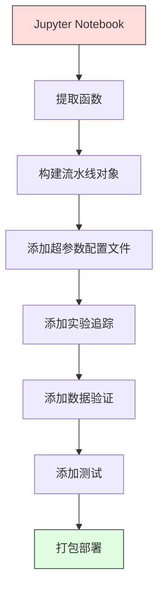

# 机器学习流水线

> 模型不是产品。流水线才是。流水线涵盖了从原始数据到部署预测的所有环节，并且每个步骤都必须是可复现的。

**类型：** 构建
**语言：** Python
**先修知识：** 第二阶段，第12课（超参数调优）
**时间：** 约120分钟

## 学习目标

- 从零构建一个机器学习流水线，将填充、缩放、编码和模型训练串联成一个可复现的对象
- 识别数据泄露场景，并解释流水线如何通过仅在训练数据上拟合转换器来防止数据泄露
- 构建一个能对数值特征和类别特征应用不同预处理流程的 ColumnTransformer
- 实现流水线序列化，并演示训练好的流水线在训练和生产环境中能产生相同的结果

## 问题描述

你有一个用于加载数据、用中位数填充缺失值、缩放特征、训练模型并打印准确率的 Jupyter Notebook。它能工作。你将模型部署上线。

一个月后，有人重新训练了模型，却得到了不同的结果。原因在于：计算中位数时用了包含测试数据的完整数据集（数据泄露）。缩放参数没有被保存，导致推理时使用了不同的统计量。特征工程的代码在训练和服务环节被复制粘贴，导致两份代码产生了差异。生产环境中的某个类别列出现了一个编码器从未见过的新值。

这些并非假设。它们是机器学习系统在生产环境中失败的最常见原因。流水线通过将每个转换步骤打包成一个单一的、有序的、可复现的对象，解决了所有这些问题。

## 核心概念

### 什么是流水线

一个流水线是由一系列有序的数据转换步骤，后接一个模型组成。每个步骤将上一步的输出作为输入。整个流水线在训练数据上拟合一次。在推理时，同一个已拟合的流水线会转换新数据并产生预测。


流水线保证了：
- 转换器仅在训练数据上拟合（无数据泄露）
- 在推理时应用相同的转换
- 整个对象可以被序列化并作为一个工件进行部署
- 交叉验证会按折应用流水线，防止微妙的泄露

### 数据泄露：无声的杀手

当测试集或未来数据的信息污染了训练过程时，就会发生数据泄露。流水线能防止最常见的数据泄露形式。

**有数据泄露的错误做法：**
```python
X = df.drop("target", axis=1)
y = df["target"]

scaler = StandardScaler()
X_scaled = scaler.fit_transform(X)  # ❌ 缩放器看到了所有数据

X_train, X_test = X_scaled[:800], X_scaled[800:]
y_train, y_test = y[:800], y[800:]
```

缩放器看到了测试数据。均值和标准差包含了测试样本。这会夸大准确率评估。

**正确做法：**
```python
X_train, X_test = X[:800], X[800:]  # ✅ 先划分

scaler = StandardScaler()
X_train_scaled = scaler.fit_transform(X_train)  # 只在训练集上拟合
X_test_scaled = scaler.transform(X_test)        # 只在测试集上转换
```

使用流水线，你无需操心这些问题，流水线会自动处理。

### sklearn 流水线

sklearn 的 `Pipeline` 将转换器和一个估计器串联起来。它提供 `.fit()`、`.predict()` 和 `.score()` 方法，这些方法会按顺序应用所有步骤。

```python
from sklearn.pipeline import Pipeline
from sklearn.preprocessing import StandardScaler
from sklearn.linear_model import LogisticRegression

pipe = Pipeline([
    ("scaler", StandardScaler()),
    ("model", LogisticRegression()),
])

pipe.fit(X_train, y_train)
predictions = pipe.predict(X_test)
```

当你调用 `pipe.fit(X_train, y_train)` 时：
1. 缩放器在 X_train 上调用 `fit_transform`
2. 模型在缩放后的 X_train 上调用 `fit`

当你调用 `pipe.predict(X_test)` 时：
1. 缩放器在 X_test 上调用 `transform`（而非 `fit_transform`）
2. 模型在缩放后的 X_test 上调用 `predict`

缩放器在拟合期间从未看到测试数据。这正是流水线的核心意义。

### ColumnTransformer：为不同列使用不同流程

真实数据集拥有需要不同预处理方式的数值列和类别列。`ColumnTransformer` 专为处理此情况设计。

```python
from sklearn.compose import ColumnTransformer
from sklearn.preprocessing import StandardScaler, OneHotEncoder
from sklearn.impute import SimpleImputer

numeric_pipe = Pipeline([
    ("impute", SimpleImputer(strategy="median")),
    ("scale", StandardScaler()),
])

categorical_pipe = Pipeline([
    ("impute", SimpleImputer(strategy="most_frequent")),
    ("encode", OneHotEncoder(handle_unknown="ignore")),
])

preprocessor = ColumnTransformer([
    ("num", numeric_pipe, ["age", "income", "score"]),
    ("cat", categorical_pipe, ["city", "gender", "plan"]),
])

full_pipeline = Pipeline([
    ("preprocess", preprocessor),
    ("model", GradientBoostingClassifier()),
])
```

OneHotEncoder 中的 `handle_unknown="ignore"` 对于生产环境至关重要。当出现一个新类别时（模型从未见过的城市），它会生成一个零向量而不是直接崩溃。

### 实验追踪

流水线使训练过程可复现，但你还需要追踪不同实验中发生的事情：使用了哪些超参数、哪个版本的数据集、指标是多少、运行的是哪份代码。

**MLflow** 是最常见的开源解决方案：

```python
import mlflow

with mlflow.start_run():
    mlflow.log_param("max_depth", 5)
    mlflow.log_param("n_estimators", 100)
    mlflow.log_param("learning_rate", 0.1)

    pipe.fit(X_train, y_train)
    accuracy = pipe.score(X_test, y_test)

    mlflow.log_metric("accuracy", accuracy)
    mlflow.sklearn.log_model(pipe, "model")
```

每次运行都记录了参数、指标、工件和完整的模型。你可以比较不同的运行结果，复现任何实验，并部署任意版本的模型。

**Weights & Biases (wandb)** 提供了类似的功能以及托管仪表板：

```python
import wandb

wandb.init(project="my-pipeline")
wandb.config.update({"max_depth": 5, "n_estimators": 100})

pipe.fit(X_train, y_train)
accuracy = pipe.score(X_test, y_test)

wandb.log({"accuracy": accuracy})
```

### 模型版本管理

在实验追踪之后，你需要管理模型版本。哪个模型在生产环境中？哪个在预发布环境中？上周的是哪个？

MLflow 的模型注册表提供：
- **版本追踪：** 每个保存的模型都有一个版本号
- **阶段转换：** "预发布"、"生产"、"归档"
- **审批流程：** 模型必须被明确提升到生产阶段
- **回滚：** 可以立即切换回之前的版本

### 使用 DVC 进行数据版本管理

代码使用 git 进行版本管理。数据也应该进行版本管理，但 git 无法处理大文件。DVC（Data Version Control）解决了这个问题。

```bash
dvc init
dvc add data/training.csv
git add data/training.csv.dvc data/.gitignore
git commit -m "Track training data"
dvc push
```

DVC 将实际数据存储在远程存储（S3、GCS、Azure）中，并在 git 中保留一个记录哈希值的小型 `.dvc` 文件。当你检出一个 git 提交时，`dvc checkout` 会恢复当时使用的确切数据。

这意味着每个 git 提交都同时固定了代码和数据。实现了完全的可复现性。

### 可复现的实验

一个可复现的实验需要四样东西：

1.  **固定的随机种子：** 为 numpy、random 和框架（torch、sklearn）设置种子
2.  **固定的依赖项：** 包含精确版本号的 requirements.txt 或 poetry.lock
3.  **版本化的数据：** DVC 或类似工具
4.  **配置文件：** 所有超参数都在配置文件中，而不是硬编码

```python
import numpy as np
import random

def set_seed(seed=42):
    random.seed(seed)
    np.random.seed(seed)
    try:
        import torch
        torch.manual_seed(seed)
        torch.cuda.manual_seed_all(seed)
        torch.backends.cudnn.deterministic = True
    except ImportError:
        pass
```

### 从 Notebook 到生产流水线



典型的演进路径：

1.  **Notebook 探索：** 快速实验、可视化、特征构思
2.  **提取函数：** 将预处理、特征工程、评估移到模块中
3.  **构建流水线：** 将转换步骤链式组合成 sklearn 流水线或自定义类
4.  **配置管理：** 将所有超参数移到 YAML/JSON 配置文件中
5.  **实验追踪：** 添加 MLflow 或 wandb 记录
6.  **数据验证：** 在训练前检查数据模式、分布和缺失值模式
7.  **测试：** 为转换器编写单元测试，为整个流水线编写集成测试
8.  **部署：** 序列化流水线，将其包装成 API（FastAPI、Flask），然后容器化

### 常见的流水线错误

| 错误 | 为什么有害 | 修复方法 |
|---|---|---|
| 在划分前对整个数据集拟合 | 数据泄露 | 使用带 `cross_val_score` 的流水线 |
| 在流水线外部进行特征工程 | 训练和服务时的转换不一致 | 将所有转换放入流水线 |
| 未处理未知类别 | 新值导致生产环境崩溃 | `OneHotEncoder(handle_unknown="ignore")` |
| 硬编码列名 | 模式更改时代码失效 | 使用配置文件中的列名列表 |
| 没有数据验证 | 对错误数据静默产生错误预测 | 在预测前添加模式检查 |
| 训练/服务偏差 | 模型在生产环境看到不同特征 | 使用同一个流水线对象 |

## 动手实现

`code/pipeline.py` 中的代码从头构建了一个完整的机器学习流水线：

### 步骤 1：自定义转换器

```python
class CustomTransformer:
    def __init__(self):
        self.means = None
        self.stds = None

    def fit(self, X):
        self.means = np.mean(X, axis=0)
        self.stds = np.std(X, axis=0)
        self.stds[self.stds == 0] = 1.0
        return self

    def transform(self, X):
        return (X - self.means) / self.stds

    def fit_transform(self, X):
        return self.fit(X).transform(X)
```

### 步骤 2：从零实现流水线

```python
class PipelineFromScratch:
    def __init__(self, steps):
        self.steps = steps

    def fit(self, X, y=None):
        X_current = X.copy()
        for name, step in self.steps[:-1]:
            X_current = step.fit_transform(X_current)
        name, model = self.steps[-1]
        model.fit(X_current, y)
        return self

    def predict(self, X):
        X_current = X.copy()
        for name, step in self.steps[:-1]:
            X_current = step.transform(X_current)
        name, model = self.steps[-1]
        return model.predict(X_current)
```

### 步骤 3：使用流水线进行交叉验证

代码演示了使用流水线进行交叉验证如何防止数据泄露：缩放器在每个折的训练数据上单独拟合。

### 步骤 4：使用 sklearn 构建完整生产流水线

一个完整的流水线，包含 `ColumnTransformer`、多个预处理路径和一个模型，并通过适当的交叉验证和实验日志进行训练。

## 交付成果

本课程产出：
- `outputs/prompt-ml-pipeline.md` —— 构建和调试 ML 流水线的技能
- `code/pipeline.py` —— 从零实现到 sklearn 的完整流水线

## 练习

1.  构建一个能处理包含 3 个数值列和 2 个类别列的数据集的流水线。使用 `ColumnTransformer` 对数值列应用中位数填充和缩放，对类别列应用众数填充和独热编码。使用 5 折交叉验证进行训练。

2.  故意引入数据泄露：在划分数据集之前，对整个数据集拟合缩放器。比较有数据泄露的交叉验证分数与使用流水线的无泄露交叉验证分数。差异有多大？

3.  使用 `joblib.dump` 序列化你的流水线。在一个单独的脚本中加载它并运行预测。验证两次预测的结果完全相同。

4.  向流水线添加一个自定义转换器，为两个最重要的数值列创建多项式特征（2 次）。它应该放在流水线的什么位置？

5.  为流水线设置 MLflow 追踪。使用不同的超参数运行 5 次实验。使用 MLflow UI (`mlflow ui`) 比较运行结果并选出最佳模型。

## 关键术语表

| 术语 | 人们通常说 | 实际含义 |
|---|---|---|
| 流水线 | "转换链 + 模型" | 一个有序的、由已拟合的转换器和一个模型组成的序列，作为一个整体应用以防止数据泄露 |
| 数据泄露 | "测试信息泄露到训练中" | 使用训练集之外的信息来构建模型，导致性能评估过于乐观 |
| ColumnTransformer | "每列不同预处理" | 对不同的列子集应用不同的流水线，并合并结果 |
| 实验追踪 | "记录你的运行" | 为每次训练运行记录参数、指标、工件和代码版本 |
| MLflow | "追踪和部署模型" | 用于实验追踪、模型注册和部署的开源平台 |
| DVC | "用于数据的 Git" | 针对大文件的版本控制系统，在 git 中存储哈希值，在远程存储中存储数据 |
| 模型注册表 | "模型版本目录" | 一个系统，用于跟踪模型版本并带有阶段标签（预发布、生产、归档） |
| 训练/服务偏差 | "在 Notebook 里是好的" | 训练和推理时数据处理方式的不同，导致静默的错误 |
| 可复现性 | "相同代码，相同结果" | 使用相同的代码、数据和配置获得相同结果的能力 |

## 延伸阅读

- [scikit-learn Pipeline docs](https://scikit-learn.org/stable/modules/compose.html) —— 官方流水线参考
- [MLflow documentation](https://mlflow.org/docs/latest/index.html) —— 实验追踪和模型注册表
- [DVC documentation](https://dvc.org/doc) —— 数据版本管理
- [Sculley et al., Hidden Technical Debt in Machine Learning Systems (2015)](https://papers.nips.cc/paper/2015/hash/86df7dcfd896fcaf2674f757a2463eba-Abstract.html) —— 关于机器学习系统复杂性的开创性论文
- [Google ML Best Practices: Rules of ML](https://developers.google.com/machine-learning/guides/rules-of-ml) —— 实用的生产级机器学习建议