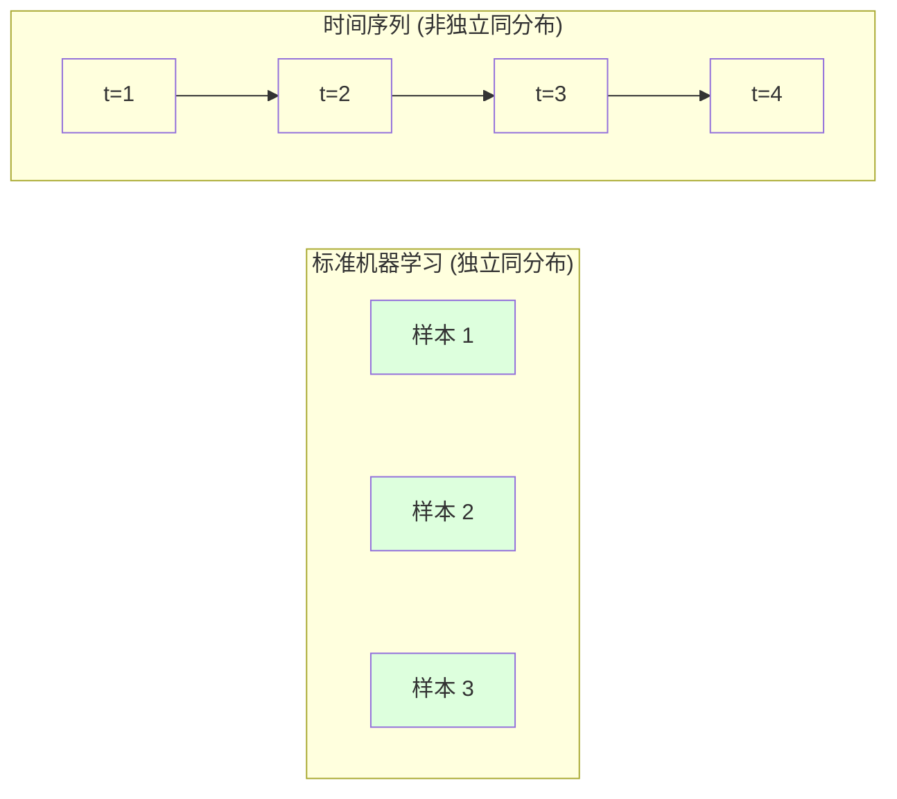
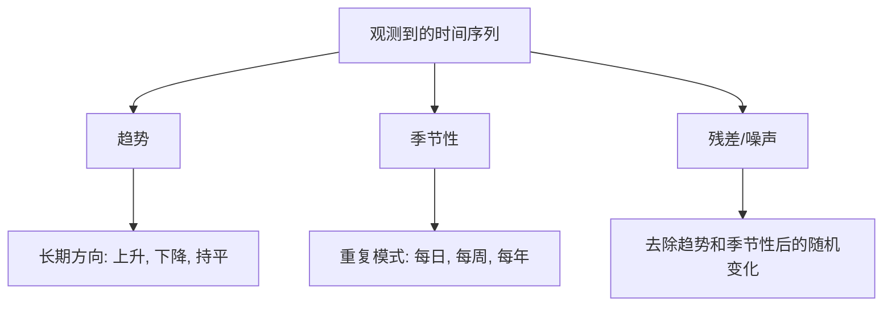
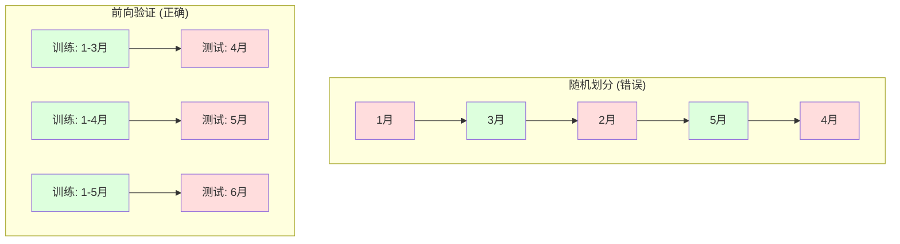

# 时间序列基础

> 过去的业绩确实能预测未来的结果——前提是你先检查了平稳性。

**类型：** 构建
**语言：** Python
**先修知识：** 第二阶段，第01-09课
**时间：** 约90分钟

## 学习目标

- 将时间序列分解为趋势、季节性和残差分量，并检验其平稳性
- 实现滞后特征和滚动统计，将时间序列转换为监督学习问题
- 构建一个前向验证框架，防止未来数据泄露到训练过程中
- 解释为什么随机的训练/测试划分对时间序列无效，并演示其与正确时间划分之间的性能差距

## 问题描述

你拥有按时间排序的数据：每日销售额、每小时温度、每分钟CPU使用率、每周股票价格。你想预测下一个值、下一周、下个季度。

你拿起标准的机器学习工具包：随机训练/测试划分、交叉验证、构建特征矩阵进行预测。每一步都是错的。

时间序列打破了标准机器学习所依赖的假设。样本并非独立——今天的温度取决于昨天。随机划分将未来的信息泄露到了过去。在回测中看起来很棒的特征，在生产中却会失败，因为它们依赖于随时间变化的模式。

一个使用随机交叉验证能达到95%准确率的模型，在基于时间的正确评估下可能只有55%的准确率。这种差异不是技术细节问题。它是纸上谈兵的模型与能投入生产的模型之间的区别。

本课程涵盖基础知识：时间数据有何不同、如何诚实评估模型，以及如何将时间序列转化为标准机器学习模型可以使用的特征。

## 核心概念

### 时间序列的特殊之处

标准机器学习假设数据是独立同分布的。每个样本独立于其他样本，且来自同一分布。时间序列则违反了两者：

- **非独立。** 今天的股价依赖于昨天。本周的销售额与上周相关。
- **非同分布。** 分布随时间变化。12月的销售额看起来与3月不同。

这些违反并非小事。它们会改变你构建特征的方式、评估模型的方式，以及哪些算法有效。



在标准机器学习中，样本是可互换的。打乱它们不会改变任何东西。在时间序列中，顺序就是一切。打乱会破坏信号。

### 时间序列的组成部分

每个时间序列都是以下部分的组合：



- **趋势**：长期方向。收入每年增长10%。全球气温上升。
- **季节性**：在固定间隔重复的模式。零售额在12月飙升。空调使用量在7月达到峰值。
- **残差**：去除趋势和季节性后剩下的部分。如果残差看起来像白噪声，那么分解就捕捉到了信号。

### 平稳性

如果一个时间序列的统计特性（均值、方差、自相关）不随时间变化，则称其是平稳的。大多数预测方法都假设平稳性。

**为什么重要：** 非平稳序列的均值会漂移。一个在一月份数据上训练的模型，其学习到的均值与二月份的数据不同。它会产生系统性错误。

**如何检查：** 计算滚动窗口上的滚动均值和滚动标准差。如果它们漂移，则该序列是非平稳的。

**如何修复：** 差分。不建模原始值，而是建模连续值之间的变化：

```
diff[t] = value[t] - value[t-1]
```

如果一轮差分不能使序列平稳，则再次应用差分（二阶差分）。大多数现实世界的序列最多需要两轮差分。

**示例：**

原始序列: [100, 102, 106, 112, 120]
一阶差分:  [2, 4, 6, 8] (仍在上升)
二阶差分:  [2, 2, 2] (常数——平稳)

原始序列具有二次趋势。一阶差分将其变为线性趋势。二阶差分使其平坦。在实践中，你很少需要超过两轮差分。

**正式检验：** 扩展迪基-福勒检验是检验平稳性的标准统计检验。其原假设是"序列非平稳"。p值低于0.05意味着你可以拒绝原假设并得出平稳的结论。我们不从头实现扩展迪基-福勒检验（它需要渐近分布表），但我们代码中的滚动统计方法提供了一个实用的可视化检查。

### 自相关

自相关衡量时间 t 的值与时间 t-k（过去 k 步）的值相关的程度。自相关函数绘制了每个滞后 k 的这个相关性。

**自相关函数能告诉你：**
- 序列的"记忆"有多远。如果自相关函数在滞后5之后降至零，那么5步之前的值就无关紧要了。
- 是否存在季节性。如果自相关函数在滞后12处（月度数据）出现峰值，则存在年度季节性。
- 创建多少个滞后特征。使用到自相关函数变得可忽略为止的滞后。

**偏自相关函数** 去除了间接相关性。如果今天与3天前相关，仅仅是因为它们都与昨天相关，那么在滞后3处的偏自相关函数将为零，而自相关函数则不为零。

### 滞后特征：将时间序列转化为监督学习

标准的机器学习模型需要一个特征矩阵 X 和一个目标 y。时间序列只给你一列值。桥梁就是滞后特征。

取序列 [10, 12, 14, 13, 15] 并创建滞后1和滞后2特征：

| lag_2 | lag_1 | target |
|-------|-------|--------|
| 10    | 12    | 14     |
| 12    | 14    | 13     |
| 14    | 13    | 15     |

现在你有一个标准的回归问题了。任何机器学习模型（线性回归、随机森林、梯度提升）都可以根据滞后特征来预测目标。

您可以构建的其他特征：
- **滚动统计：** 过去 k 个值的均值、标准差、最小值、最大值
- **日历特征：** 星期几、月份、是否为节假日、是否为周末
- **差分值：** 与前一步的变化量
- **扩展统计：** 累积均值、累积和
- **比率特征：** 当前值 / 滚动均值（偏离近期平均值的程度）
- **交互特征：** lag_1 * 星期几（动量在不同工作日的效应）

**需要多少个滞后？** 使用自相关函数。如果自相关函数在滞后10之前都是显著的，则至少使用10个滞后。如果存在周季节性，则包含滞后7（可能还有14）。更多的滞后为模型提供了更多的历史信息，但也意味着更多的特征需要拟合，增加了过拟合的风险。

**目标对齐陷阱。** 在创建滞后特征时，目标必须是时间 t 的值，而所有特征必须使用时间 t-1 或更早的值。如果你不小心将时间 t 的值作为特征包含进来，你就有了一个完美的预测器——和一个完全无用的模型。这是时间序列特征工程中最常见的错误。

### 前向验证

这是本课程最重要的概念。标准的 k 折交叉验证会将样本随机分配到训练集和测试集。对于时间序列，这会泄露未来的信息。



前向验证：
1.  使用截至时间 t 的数据进行训练
2.  预测时间 t+1（或 t+1 到 t+k 的多步预测）
3.  向前滑动窗口
4.  重复

每个测试折仅包含严格位于所有训练数据之后的数据。没有未来数据泄露。这能让你对模型部署后的性能有一个诚实的估计。

**扩展窗口** 使用所有历史数据进行训练（窗口增长）。**滑动窗口** 使用固定大小的训练窗口（窗口滑动）。当你认为旧数据仍然相关时，使用扩展窗口。当世界发生变化，旧数据有害时，使用滑动窗口。

### ARIMA 直观理解

ARIMA 是经典的时间序列模型。它包含三个部分：

- **AR (自回归)：** 根据过去的值进行预测。AR(p) 使用最后 p 个值。
- **I (整合)：** 差分以实现平稳性。I(d) 应用 d 轮差分。
- **MA (移动平均)：** 根据过去的预测误差进行预测。MA(q) 使用最后 q 个误差。

ARIMA(p, d, q) 结合了这三者。你可以基于自相关函数/偏自相关函数分析或自动搜索（auto-ARIMA）来选择 p、d、q。

我们不会从头实现 ARIMA——它需要超出本课程范围的数值优化。关键是要理解每个部分的作用，以便你能解读 ARIMA 的结果并知道何时使用它。

### 何时使用何种方法

| 方法 | 最佳适用场景 | 处理季节性 | 处理外部特征 |
|---|---|---|---|
| 滞后特征 + 机器学习 | 表格数据，许多外部特征 | 配合日历特征 | 是 |
| ARIMA | 单变量序列，短期预测 | SARIMA 变体 | 否 (有限支持) |
| 指数平滑 | 简单趋势 + 季节性 | 是 (Holt-Winters) | 否 |
| Prophet | 商业预测，节假日 | 是 (傅里叶项) | 有限 |
| 神经网络 (LSTM, Transformer) | 长序列，多个序列 | 自学习 | 是 |

对于大多数实际问题，滞后特征 + 梯度提升是最强的起点。它自然地处理外部特征，不需要平稳性，并且易于调试。

### 预测范围与策略

单步预测预测未来一步。多步预测预测未来多步。有三种策略：

**递归（迭代）：** 预测下一步，将预测值作为下一步的输入。简单但误差会累积——每次预测都依赖于上一次的预测，因此错误会不断放大。

**直接：** 为每个预测范围训练一个单独的模型。模型1预测 t+1，模型5预测 t+5。没有误差累积，但每个模型的训练样本更少，且它们之间不共享信息。

**多输出：** 训练一个模型同时输出所有范围的预测值。跨范围共享信息，但需要一个支持多输出的模型（或自定义损失函数）。

对于大多数实际问题，短期范围（1-5步）从递归开始，长期范围则使用直接法。

### 时间序列中的常见错误

| 错误 | 原因 | 如何修复 |
|---|---|---|
| 随机训练/测试划分 | 标准机器学习的习惯 | 使用前向验证或时间划分 |
| 使用未来特征 | 错误地包含了时间 t 的特征 | 审核每个特征的时间对齐 |
| 对季节性过拟合 | 模型记住了日历模式 | 在测试集中留出完整的季节周期 |
| 忽略尺度变化 | 收入翻倍但模式不变 | 对百分比变化建模，而非绝对值 |
| 滞后特征过多 | "历史越多越好" | 使用自相关函数确定相关滞后 |
| 不使用差分 | "模型自己会搞定" | 树模型处理趋势；线性模型需要平稳性 |

## 动手实现

`code/time_series.py` 中的代码从零实现了核心构建块。

### 滞后特征创建器

```python
def make_lag_features(series, n_lags):
    n = len(series)
    X = np.full((n, n_lags), np.nan)
    for lag in range(1, n_lags + 1):
        X[lag:, lag - 1] = series[:-lag]
    valid = ~np.isnan(X).any(axis=1)
    return X[valid], series[valid]
```

这将一个一维序列转换为一个特征矩阵，其中每一行将最后 `n_lags` 个值作为特征，当前值作为目标。

### 前向交叉验证

```python
def walk_forward_split(n_samples, n_splits=5, min_train=50):
    assert min_train < n_samples, "min_train must be less than n_samples"
    step = max(1, (n_samples - min_train) // n_splits)
    for i in range(n_splits):
        train_end = min_train + i * step
        test_end = min(train_end + step, n_samples)
        if train_end >= n_samples:
            break
        yield slice(0, train_end), slice(train_end, test_end)
```

每次划分确保训练数据严格在测试数据之前。训练窗口随着每次划分而扩大。

### 简单的自回归模型

一个纯粹的 AR 模型本质上就是在线性回归应用于滞后特征：

```python
class SimpleAR:
    def __init__(self, n_lags=5):
        self.n_lags = n_lags
        self.weights = None
        self.bias = None

    def fit(self, series):
        X, y = make_lag_features(series, self.n_lags)
        # 通过正规方程求解
        X_b = np.column_stack([np.ones(len(X)), X])
        theta = np.linalg.lstsq(X_b, y, rcond=None)[0]
        self.bias = theta[0]
        self.weights = theta[1:]
        return self
```

这在概念上与第02课的线性回归相同，但应用于同一变量的时间滞后版本。

### 平稳性检验

代码计算滚动统计，以可视化和数值方式评估平稳性：

```python
def check_stationarity(series, window=50):
    rolling_mean = np.array([
        series[max(0, i - window):i].mean()
        for i in range(1, len(series) + 1)
    ])
    rolling_std = np.array([
        series[max(0, i - window):i].std()
        for i in range(1, len(series) + 1)
    ])
    return rolling_mean, rolling_std
```

如果滚动均值漂移或滚动标准差变化，则该序列是非平稳的。应用差分并再次检查。

代码还通过比较序列的前半部分和后半部分来检查平稳性。如果均值差异超过半个标准差，或方差比率超过2倍，则该序列被标记为非平稳。

### 自相关函数

```python
def autocorrelation(series, max_lag=20):
    n = len(series)
    mean = series.mean()
    var = series.var()
    acf = np.zeros(max_lag + 1)
    for k in range(max_lag + 1):
        cov = np.mean((series[:n-k] - mean) * (series[k:] - mean))
        acf[k] = cov / var if var > 0 else 0
    return acf
```

## 使用示例

使用 sklearn，你可以直接将滞后特征与任何回归器一起使用：

```python
from sklearn.linear_model import Ridge
from sklearn.ensemble import GradientBoostingRegressor

X, y = make_lag_features(series, n_lags=10)

for train_idx, test_idx in walk_forward_split(len(X)):
    model = Ridge(alpha=1.0)
    model.fit(X[train_idx], y[train_idx])
    predictions = model.predict(X[test_idx])
```

对于 ARIMA，使用 statsmodels：

```python
from statsmodels.tsa.arima.model import ARIMA

model = ARIMA(train_series, order=(5, 1, 2))
fitted = model.fit()
forecast = fitted.forecast(steps=30)
```

`time_series.py` 中的代码展示了这两种方法，并使用前向验证对它们进行了比较。

### sklearn 的 TimeSeriesSplit

sklearn 提供了 `TimeSeriesSplit`，它实现了前向验证：

```python
from sklearn.model_selection import TimeSeriesSplit

tscv = TimeSeriesSplit(n_splits=5)
for train_index, test_index in tscv.split(X):
    X_train, X_test = X[train_index], X[test_index]
    y_train, y_test = y[train_index], y[test_index]
    model.fit(X_train, y_train)
    score = model.score(X_test, y_test)
```

这等同于我们从头实现的 `walk_forward_split`，但已集成到 sklearn 的交叉验证框架中。你可以将其与 `cross_val_score` 一起使用：

```python
from sklearn.model_selection import cross_val_score

scores = cross_val_score(model, X, y, cv=TimeSeriesSplit(n_splits=5))
print(f"平均得分: {scores.mean():.4f} +/- {scores.std():.4f}")
```

### 评估指标

时间序列预测使用回归指标，但需结合时间感知的上下文：

- **MAE (平均绝对误差)：** |y_true - y_pred| 的平均值。易于以原始单位解释。"预测平均偏差3.2度。"
- **RMSE (均方根误差)：** 均方误差的平方根。比 MAE 对大误差的惩罚更大。当大误差比许多小误差更糟糕时使用。
- **MAPE (平均绝对百分比误差)：** |误差 / 真实值| * 100 的平均值。与尺度无关，有助于比较不同序列。但当真实值为零时无定义。
- **朴素基线比较：** 始终与简单的基线进行比较。季节性朴素基线预测与一个周期前（昨天、上周）相同的值。如果你的模型无法击败朴素基线，那就有问题。

### 滚动特征

代码演示了将滚动统计（7天和14天窗口上的均值、标准差、最小值、最大值）添加到滞后特征中。这些为模型提供了关于近期趋势和波动性的信息，而单独的滞后特征无法捕捉到这些信息。

例如，如果滚动均值在上升，则表明存在上升趋势。如果滚动标准差在增加，则表明波动性在增长。这是基于树的模型可以学习到而线性模型无法学习的模式类型。

## 交付成果

本课程产出：
- `outputs/prompt-time-series-advisor.md` —— 用于构建时间序列问题的提示
- `code/time_series.py` —— 滞后特征、前向验证、自回归模型、平稳性检验

### 必须击败的基线

在构建任何模型之前，先建立基线：

1.  **最后值（持久性）。** 预测明天和今天一样。对于许多序列来说，这出人意料地难以超越。
2.  **季节性朴素。** 预测今天与上周同一天（或去年同一天）相同。如果你的模型无法击败这个，说明它除了季节性之外没有学到任何有用的模式。
3.  **移动平均。** 预测过去 k 个值的平均值。可以平滑噪声，但无法捕捉突变。

如果你花哨的机器学习模型输给了季节性朴素基线，那你肯定有 bug。最常见的是：特征中的未来数据泄露、错误的评估方法，或者该序列确实是随机的且不可预测。

### 实用技巧

1.  **从绘图开始。** 在进行任何建模之前，先绘制原始序列。观察趋势、季节性、异常值、结构性断裂（行为的突然变化）。30秒的可视化检查往往比一小时的自动分析能告诉你更多。

2.  **先差分，后建模。** 如果序列有明显趋势，在创建滞后特征之前先对其进行差分。基于树的模型可以处理趋势，但线性模型不能，而且差分从来无害。

3.  **至少留出一个完整的季节周期。** 如果你有周季节性，你的测试集至少需要一整周的数据。如果是月度，至少需要一整月。否则你无法评估模型是否捕捉到了季节性模式。

4.  **在生产环境中监控。** 时间序列模型会随着世界的改变而随时间退化。在滚动基础上跟踪预测误差。当误差开始增加时，使用近期数据重新训练模型。

5.  **警惕体制变化。** 在疫情前数据上训练的模型无法预测疫情后的行为。将已知体制变化的指示器作为特征包含进来，或者使用会遗忘旧数据的滑动窗口。

6.  **对偏斜序列进行对数变换。** 收入、价格和计数通常是右偏的。取对数可以稳定方差，并使乘性模式变为加性，线性模型可以处理这种模式。在对数空间进行预测，然后取指数恢复到原始单位。

## 练习

1.  **平稳性实验。** 生成一个具有线性趋势的序列。使用滚动统计检查平稳性。应用一阶差分。再次检查。对于一个二次趋势，需要多少轮差分？

2.  **滞后选择。** 在一个季节性序列（周期=7）上计算自相关函数。哪些滞后的自相关性最高？仅使用这些滞后（而非连续的1到7）创建滞后特征。与使用滞后1到7相比，准确率有提高吗？

3.  **前向验证 vs 随机划分。** 在滞后特征上训练岭回归。使用随机80/20划分和前向验证进行评估。随机划分会高估多少性能？

4.  **特征工程。** 将滚动均值（窗口=7）、滚动标准差（窗口=7）和星期几特征添加到滞后特征中。使用前向验证比较有和没有这些额外特征时的准确率。

5.  **多步预测。** 修改自回归模型，预测未来5步而不是1步。比较两种策略：(a) 预测一步，将预测值作为下一步的输入（递归），和 (b) 为每个范围训练单独的模型（直接）。哪种更准确？

## 关键术语表

| 术语 | 人们通常说 | 实际含义 |
|---|---|---|
| 平稳性 | "统计量不随时间变化" | 一个序列的均值、方差和自相关结构随时间保持恒定 |
| 差分 | "减去连续值" | 计算 y[t] - y[t-1] 以去除趋势并实现平稳性 |
| 自相关 | "序列与自身的相关性" | 时间序列与其自身滞后副本之间的相关性，作为滞后的函数 |
| 偏自相关 | "仅直接相关性" | 去除所有更短滞后影响后，滞后 k 处的自相关 |
| 滞后特征 | "过去的值作为输入" | 使用 y[t-1], y[t-2], ..., y[t-k] 作为特征来预测 y[t] |
| 前向验证 | "尊重时间的交叉验证" | 训练数据在时间上始终早于测试数据的评估方式 |
| ARIMA | "经典的时间序列模型" | 自回归整合移动平均模型：结合了过去值 (AR)、差分 (I) 和过去误差 (MA) |
| 季节性 | "重复的日历模式" | 时间序列中与日历周期（每日、每周、每年）相关的有规律、可预测的周期 |
| 趋势 | "长期方向" | 序列水平随时间持续上升或下降 |
| 扩展窗口 | "使用所有历史" | 训练集随每次划分而增长的前向验证 |
| 滑动窗口 | "固定大小的历史" | 训练集是固定长度窗口且向前滑动的前向验证 |

## 延伸阅读

- [Hyndman and Athanasopoulos, Forecasting: Principles and Practice (3rd ed.)](https://otexts.com/fpp3/) —— 最好的免费时间序列预测教科书
- [scikit-learn Time Series Split](https://scikit-learn.org/stable/modules/generated/sklearn.model_selection.TimeSeriesSplit.html) —— sklearn 的前向划分器
- [statsmodels ARIMA docs](https://www.statsmodels.org/stable/generated/statsmodels.tsa.arima.model.ARIMA.html) —— 带有诊断功能的 ARIMA 实现
- [Makridakis et al., The M5 Competition (2022)](https://www.sciencedirect.com/science/article/pii/S0169207021001874) —— 展示机器学习方法与统计方法对比的大规模预测竞赛