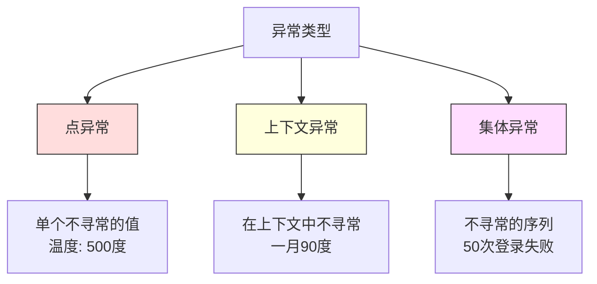
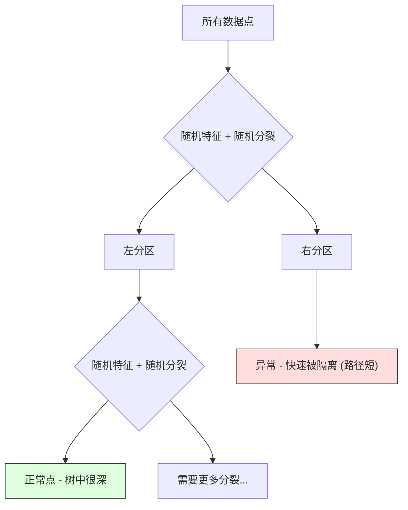

# 异常检测

> 定义"正常"很容易。异常就是任何不符合定义的东西。

**类型：** 构建
**语言：** Python
**先修知识：** 第二阶段，第01-09课
**时间：** 约75分钟

## 学习目标

- 从零实现 Z-score、IQR 和隔离森林异常检测方法
- 区分点异常、上下文异常和集体异常，并为每种类型选择合适的检测方法
- 解释为什么异常检测被构建为对正常数据建模，而不是对异常进行分类
- 比较无监督异常检测与监督分类，并评估新异常覆盖率与精确率之间的权衡

## 问题描述

一张信用卡下午2点在纽约使用，然后在下午2:05在东京使用。一个工厂传感器读数为150度，而正常范围是80-120。一台服务器每秒发送5万个请求，而日平均值为200。

这些都是异常。找到它们很重要。欺诈造成数十亿损失。设备故障导致停机。网络入侵导致数据泄露。

挑战在于：你很少会有标记好的异常样本。欺诈仅占交易的0.1%。设备故障每年发生几次。你无法训练一个标准的分类器，因为"异常"类别中几乎没有可学习的样本。即使你有一些标签，你见过的异常类型也不是你会遇到的全部。明天的欺诈手段与今天不同。

异常检测将问题反过来。不是学习什么是异常的，而是学习什么是正常的。任何偏离正常的事物都是可疑的。这可以在没有标签的情况下工作，能适应新型异常，并能扩展到大规模数据集。

## 核心概念

### 异常的类型

并非所有异常都一样：

- **点异常。** 单个数据点，无论上下文如何都是不寻常的。500度的温度读数。一个通常只花50美元的账户出现50,000美元的交易。
- **上下文异常。** 给定其上下文，一个数据点是不寻常的。90度的温度在夏天是正常的，在冬天是异常的。相同的值，不同的上下文。
- **集体异常。** 一组数据点作为一个整体是不寻常的，尽管每个单独的点可能是正常的。5次登录失败是正常的。连续50次登录失败是暴力破解攻击。

大多数方法检测点异常。上下文异常需要时间或位置特征。集体异常需要序列感知的方法。



### 无监督的框架

在标准分类中，两个类别都有标签。在异常检测中，通常有以下三种情况之一：

1.  **完全无监督。** 完全没有标签。你在所有数据上拟合检测器，并希望异常足够少，不会破坏"正常"模型。
2.  **半监督。** 你拥有一个仅包含正常数据的干净数据集。你在这个干净集上拟合，并对其他所有数据进行评分。这是可能情况下最强的设置。
3.  **弱监督。** 你有少量标记的异常。将它们用于评估，而不是训练。进行无监督训练，然后在标记的子集上测量精确率/召回率。

关键洞察：异常检测与分类根本不同。你是在建模正常数据的分布，而不是两个类别之间的决策边界。

### 监督 vs 无监督：权衡

如果你确实有标记的异常，你是应该用它们进行训练（监督分类）还是仅用于评估（无监督检测）？

**监督（视为分类）：**
- 能捕捉到之前见过的确切异常类型
- 对已知异常类型的精确率更高
- 会完全错过新型异常
- 当出现新异常类型时需要重新训练
- 需要足够的异常样本（通常太少）

**无监督（建模正常，标记偏差）：**
- 能捕捉到任何偏离正常的偏差，包括新型异常
- 不需要标记的异常
- 误报率较高（不寻常的不一定是坏的）
- 对分布偏移更鲁棒

在实践中，最好的系统会结合两者：无监督检测以获得广泛覆盖率，监督模型用于已知的高优先级异常类型，并对模糊情况进行人工审核。

### Z-score 方法

最简单的方法。计算每个特征的均值和标准差。标记任何偏离均值超过 k 个标准差的点。

```text
z_score = (x - 均值) / 标准差
如果 |z_score| > 阈值，则为异常
```

默认阈值是 3.0（对于高斯分布，99.7% 的正常数据落在 3 个标准差以内）。

**优点：** 简单。快速。可解释（"这个值偏离正常 4.5 个标准差"）。

**缺点：** 假设数据呈正态分布。对训练数据中的离群值敏感（离群值会移动均值和增大标准差，使它们更难被检测到）。在多模态分布上失败。

**何时效果好：** 单特征监控，数据大致呈钟形分布。服务器响应时间、制造公差、基线稳定的传感器读数。

**何时失效：** 多簇数据（两个办公室位置有不同的基线温度）、偏斜数据（1000美元的交易虽少见但非异常）、训练集中存在离群值的数据。

### IQR 方法

比 Z-score 更鲁棒。使用四分位距而不是均值和标准差。

```
Q1 = 第25百分位数
Q3 = 第75百分位数
IQR = Q3 - Q1
下限 = Q1 - 因子 * IQR
上限 = Q3 + 因子 * IQR
如果 x < 下限 或 x > 上限，则为异常
```

默认因子是 1.5。

**优点：** 对离群值鲁棒（百分位数不受极端值影响）。适用于偏斜分布。无正态性假设。

**缺点：** 仅限单变量（按特征独立应用）。无法检测仅当特征组合在一起时才不寻常的异常（一个点可能在每个单独特征上都正常，但在联合空间中异常）。

**实践说明：** IQR 中的 1.5 因子对应于箱线图中的须。须外的点是潜在的离群值。使用 3.0 而不是 1.5 会使检测器更保守（更少标记，更少误报）。正确的因子取决于你对误报的容忍度。

### 隔离森林

关键洞察：异常是稀少且不同的。在数据的随机划分中，异常更容易被隔离——它们需要更少的随机分裂就能与其余数据分开。



**工作原理：**
1.  构建许多随机树（一个隔离森林）
2.  在每个节点，随机选择一个特征，并在该特征的最小值和最大值之间随机选择一个分裂值
3.  继续分裂，直到每个点都被隔离（在自己的叶子节点中）
4.  异常在所有树中具有更短的平均路径长度

**为什么有效：** 正常点位于稠密区域。需要许多随机分裂才能将一个点与其邻居隔离开。异常点位于稀疏区域。一两次随机分裂就足以隔离它们。

异常分数基于所有树的平均路径长度，并通过随机二叉搜索树的期望路径长度进行归一化：

```
score(x) = 2^(-平均路径长度(x) / c(n))
```

其中 `c(n)` 是 n 个样本的期望路径长度。分数接近 1 意味着异常。分数接近 0.5 意味着正常。分数接近 0 意味着非常正常（在稠密簇中很深）。

**优点：** 无分布假设。适用于高维。可扩展性好（由于每棵树使用子样本，复杂度亚线性于样本量）。处理混合特征类型。

**缺点：** 在密集区域中的异常难以检测（掩蔽效应）。当许多特征不相关时，随机分裂效果较差。

**关键超参数：**
- `n_estimators`：树的数量。100通常足够。更多树分数更稳定，但计算更慢。
- `max_samples`：每棵树的样本数。原始论文中默认为256。更小的值使单棵树准确性降低，但增加了多样性。子采样是隔离森林快速的原因——每棵树只看到一小部分数据。
- `contamination`：预期的异常比例。仅用于设置阈值。不影响分数本身。

### 局部离群因子

LOF 比较一个点周围的局部密度与其邻居周围的密度。一个位于稀疏区域但被密集区域包围的点是异常的。

**工作原理：**
1.  对于每个点，找到其 k 个最近邻
2.  计算局部可达密度（邻域有多密集）
3.  将每个点的密度与其邻居的密度进行比较
4.  如果一个点的密度明显低于其邻居，则该点是离群值

**LOF 分数：**
- LOF 接近 1.0 表示与邻居密度相似（正常）
- LOF 大于 1.0 表示密度低于邻居（可能是异常）
- LOF 远大于 1.0（例如 >= 2.0）表示密度显著较低（很可能是异常）

"局部"部分是关键。考虑一个有两个簇的数据集：一个包含1000个点的密集簇和一个包含50个点的稀疏簇。稀疏簇边缘的一个点并非全局不寻常——它有50个邻居。但如果它的直接邻居比它更密集，那么它在局部是不寻常的。LOF 捕捉到了这种全局方法会遗漏的细微差别。

**优点：** 检测局部异常（在其邻域中不寻常的点，即使全局来看并不异常）。适用于不同密度的簇。

**缺点：** 在大数据集上慢（朴素实现 O(n²)）。对 k 的选择敏感。在非常高维的空间中效果不佳（维度灾难影响距离计算）。

### 方法比较

| 方法 | 假设 | 速度 | 处理高维 | 检测局部异常 |
|---|---|---|---|---|
| Z-score | 正态分布 | 非常快 | 是（按特征） | 否 |
| IQR | 无（按特征） | 非常快 | 是（按特征） | 否 |
| 隔离森林 | 无 | 快 | 是 | 部分 |
| LOF | 距离有意义 | 慢 | 差 | 是 |

### 评估挑战

评估异常检测器比评估分类器更难：

- **极端类别不平衡。** 只有 0.1% 的异常，如果将所有预测为"正常"，准确率也能达到 99.9%。准确率无用。
- **AUROC 有误导性。** 在严重不平衡的情况下，即使模型在实际阈值下漏掉了大多数异常，AUROC 看起来也可能不错。
- **更好的指标：** Precision@k（在前 k 个标记项中，有多少是真正的异常）、AUPRC（精确率-召回率曲线下面积），以及在固定假正例率下的召回率。

```mermaid
flowchart LR
    A[原始数据] --> B[仅基于正常数据训练]
    B --> C[对所有测试数据评分]
    C --> D[按异常分数排序]
    D --> E[评估前 K 个标记项]
    E --> F[Precision@K / AUPRC]

    style A fill:#f9f,stroke:#333
    style F fill:#9f9,stroke:#333
```

### 异常检测流程

在实践中，异常检测遵循以下工作流：

1.  **收集基线数据。** 理想情况下，是一个你知道没有（或极少）异常的时期。
2.  **特征工程。** 原始特征加上衍生特征（滚动统计、时间特征、比率）。
3.  **训练检测器。** 在基线数据上拟合。模型学习"正常"的样子。
4.  **对新数据评分。** 每个新观测值获得一个异常分数。
5.  **阈值选择。** 选择分数截断点。这是一个业务决策：更高的阈值意味着更少的误报，但会漏掉更多异常。
6.  **告警与调查。** 被标记的点进入人工审核或自动响应流程。
7.  **反馈收集。** 记录标记项是真正的异常还是误报。使用这些数据来评估检测器并随时间调整阈值。

这个流程永远不会"完成"。数据分布会变化，新型异常会出现，阈值需要调整。将异常检测视为一个活的系统，而不是一次性的模型。

## 动手实现

`code/anomaly_detection.py` 中的代码从零实现了 Z-score、IQR 和隔离森林。

### Z-score 检测器

```python
def zscore_detect(X, threshold=3.0):
    mean = X.mean(axis=0)
    std = X.std(axis=0)
    std[std == 0] = 1.0
    z = np.abs((X - mean) / std)
    return z.max(axis=1) > threshold
```

简单且向量化。如果任何特征超过阈值，则标记该点。

### IQR 检测器

```python
def iqr_detect(X, factor=1.5):
    q1 = np.percentile(X, 25, axis=0)
    q3 = np.percentile(X, 75, axis=0)
    iqr = q3 - q1
    iqr[iqr == 0] = 1.0
    lower = q1 - factor * iqr
    upper = q3 + factor * iqr
    outside = (X < lower) | (X > upper)
    return outside.any(axis=1)
```

### 从零实现隔离森林

从头实现构建随机划分特征空间的隔离树：

```python
class IsolationTree:
    def __init__(self, max_depth):
        self.max_depth = max_depth

    def fit(self, X, depth=0):
        n, p = X.shape
        if depth >= self.max_depth or n <= 1:
            self.is_leaf = True
            self.size = n
            return self
        self.is_leaf = False
        self.feature = np.random.randint(p)
        x_min = X[:, self.feature].min()
        x_max = X[:, self.feature].max()
        if x_min == x_max:
            self.is_leaf = True
            self.size = n
            return self
        self.threshold = np.random.uniform(x_min, x_max)
        left_mask = X[:, self.feature] < self.threshold
        self.left = IsolationTree(self.max_depth).fit(X[left_mask], depth + 1)
        self.right = IsolationTree(self.max_depth).fit(X[~left_mask], depth + 1)
        return self
```

隔离一个点的路径长度决定了其异常分数。路径越短意味着越异常。

`IsolationForest` 类包装了多棵树：

```python
class IsolationForest:
    def __init__(self, n_estimators=100, max_samples=256, seed=42):
        self.n_estimators = n_estimators
        self.max_samples = max_samples

    def fit(self, X):
        sample_size = min(self.max_samples, X.shape[0])
        max_depth = int(np.ceil(np.log2(sample_size)))
        for _ in range(self.n_estimators):
            idx = rng.choice(X.shape[0], size=sample_size, replace=False)
            tree = IsolationTree(max_depth=max_depth)
            tree.fit(X[idx])
            self.trees.append(tree)

    def anomaly_score(self, X):
        avg_path = average path length across all trees
        scores = 2.0 ** (-avg_path / c(max_samples))
        return scores
```

归一化因子 `c(n)` 是含有 n 个元素的二叉搜索树中不成功搜索的期望路径长度。它等于 `2 * H(n-1) - 2*(n-1)/n`，其中 `H` 是调和数。这种归一化确保了分数在不同大小的数据集之间具有可比性。

### 演示场景

代码生成了多个测试场景：

1.  **带离群值的单簇。** 一个二维高斯簇，在远离中心的位置注入异常点。所有方法在这里应该都能工作。
2.  **多模态数据。** 三个不同大小和密度的簇。簇之间的点是异常的。Z-score 在这里会遇到困难，因为按特征划分的范围很宽。
3.  **高维数据。** 50个特征，但异常仅在其中的5个特征上不同。测试方法能否在特征子集中找到异常。

每个演示使用精确率、召回率、F1 和 Precision@k 比较所有方法。

## 使用示例

使用 sklearn（使用库实现，而非从头实现）：

```python
from sklearn.ensemble import IsolationForest
from sklearn.neighbors import LocalOutlierFactor

iso = IsolationForest(n_estimators=100, contamination=0.05, random_state=42)
iso.fit(X_train)
predictions = iso.predict(X_test)

lof = LocalOutlierFactor(n_neighbors=20, contamination=0.05, novelty=True)
lof.fit(X_train)
predictions = lof.predict(X_test)
```

注意 `contamination` 设置了预期的异常比例。设置正确很重要——太低会漏掉异常，太高会产生误报。

`anomaly_detection.py` 中的代码将从头实现与 sklearn 在相同数据上进行比较。

### sklearn 的 contamination 参数

sklearn 中的 `contamination` 参数决定了将连续异常分数转换为二元预测的阈值。它不改变底层分数。

```python
iso_5 = IsolationForest(contamination=0.05)
iso_10 = IsolationForest(contamination=0.10)
```

两者产生相同的异常分数。但 `iso_5` 标记前5%的点，而 `iso_10` 标记前10%的点。如果你不知道真实的异常率（通常你不知道），将 `contamination` 设置为 "auto"，并直接使用原始分数。根据误报和漏报之间的成本权衡设置你自己的阈值。

### 一类 SVM

另一个值得了解的无监督异常检测器。一类 SVM 在高维特征空间（使用核技巧）中围绕正常数据拟合一个边界。

```python
from sklearn.svm import OneClassSVM

oc_svm = OneClassSVM(kernel="rbf", gamma="auto", nu=0.05)
oc_svm.fit(X_train)
predictions = oc_svm.predict(X_test)
```

`nu` 参数近似表示异常的比例。一类 SVM 在中小型数据集上效果很好，但不能扩展到非常大的数据（核矩阵呈二次增长）。

### 自编码器方法（预览）

自编码器是学习压缩和重建数据的神经网络。在正常数据上训练。在测试时，异常具有很高的重建误差，因为网络只学会了重建正常模式。

这将在第三阶段（深度学习）中介绍，但其原理相同：建模正常的事物，标记偏离的事物。

### 集成异常检测

就像集成方法改进了分类（第11课）一样，组合多个异常检测器也能改进检测效果。最简单的方法：

1.  运行多个检测器（Z-score、IQR、隔离森林、LOF）
2.  将每个检测器的分数归一化到 [0, 1]
3.  平均归一化后的分数
4.  根据平均分数标记超过阈值的点

这减少了误报，因为不同的方法有不同的失效模式。被所有四种方法标记的点几乎肯定是异常的。仅被一种方法标记的点可能是该方法本身的问题。

更复杂的集成会根据每个检测器的估计可靠性（在有已知异常的训练集上测量，如果可用）对其进行加权。

### 生产环境注意事项

1.  **阈值漂移。** 随着数据分布变化，固定阈值会过时。监控异常分数的分布并定期调整。
2.  **告警疲劳。** 过多的误报会导致操作员不再关注。从高阈值（更少、更可靠的告警）开始，随着信任建立降低阈值。
3.  **集成方法。** 在生产环境中，组合多个检测器。仅当多种方法都认为异常时才标记一个点。这能显著减少误报。
4.  **特征工程。** 原始特征通常不够。添加滚动统计量、比率、距离上次事件的时间，以及特定领域的特征。好的特征集比检测器的选择更重要。
5.  **反馈循环。** 当操作员调查标记项并确认或驳回它们时，将此反馈回系统。随时间积累标记数据以评估和改进检测器。

## 交付成果

本课程产出：
- `outputs/skill-anomaly-detector.md` —— 用于选择正确检测器的决策技能
- `code/anomaly_detection.py` —— 从头实现的 Z-score、IQR 和隔离森林，与 sklearn 比较

### 选择阈值

异常分数是连续的。你需要一个阈值来做出二元决策。这是一个业务决策，而不是技术决策。

考虑两个场景：
- **欺诈检测。** 漏掉欺诈代价高昂（拒付、客户信任）。误报花费分析师5分钟调查。设置较低的阈值以捕获更多欺诈，接受更多误报。
- **设备维护。** 一次误报意味着一次不必要的停机，花费50,000美元。一次漏报意味着一次500,000美元的维修。设置阈值以平衡这些成本。

在这两种情况下，最优阈值取决于假正例与假负例的成本比率。绘制不同阈值下的精确率和召回率，叠加成本函数，并选择成本最低的点。

### 扩展到生产环境

对于生产环境中的实时异常检测：

1.  **批量训练，在线评分。** 定期（每日、每周）在最近的正常数据上训练模型。在每个新观测值到达时进行评分。
2.  **特征计算必须匹配。** 如果你使用30天的滚动统计进行训练，你需要30天的历史数据来计算一个新观测值的特征。缓冲所需的历史数据。
3.  **分数分布监控。** 跟踪异常分数随时间的变化。如果中位数分数向上漂移，要么是数据在变化，要么是模型过时了。
4.  **可解释性。** 当标记异常时，说明原因。Z-score："特征 X 偏离正常 4.2 个标准差。" 隔离森林："这个点平均在 3.1 次分裂内被隔离（正常点需要 8.5 次）。"

## 练习

1.  **阈值调优。** 使用阈值从 1.0 到 5.0，步长 0.5 运行 Z-score 检测器。绘制每个阈值下的精确率和召回率。你的数据的平衡点在哪里？

2.  **多变量异常。** 创建每个单独特征看起来正常，但组合起来异常的二维数据（例如，远离主簇对角线上的点）。证明按特征的 Z-score 会遗漏这些，但隔离森林能捕捉到它们。

3.  **从头实现 LOF。** 使用 k 近邻实现局部离群因子。在相同数据上比较与 sklearn 的 LocalOutlierFactor。使用 k=10 和 k=50——k 的选择如何影响结果？

4.  **流式异常检测。** 修改 Z-score 检测器以在流式环境下工作：随着新点的到达更新运行均值和方差（韦尔福德在线算法）。在相同数据上与批量 Z-score 进行比较。

5.  **真实世界评估。** 使用一个已知异常的数据集（例如，Kaggle 上的信用卡欺诈）。使用 precision@100, precision@500 和 AUPRC 评估所有四种方法。哪种方法效果最好？为什么？

## 关键术语表

| 术语 | 人们通常说 | 实际含义 |
|---|---|---|
| 异常 | "离群值，不寻常的点" | 一个显著偏离正常数据预期模式的数据点 |
| 点异常 | "一个单独的奇怪值" | 无论上下文如何都不寻常的单个观测值 |
| 上下文异常 | "值正常，但上下文错了" | 给定其上下文（时间、位置等）是不寻常的，但在另一个上下文中可能是正常的观测值 |
| 隔离森林 | "随机分裂找离群值" | 一种随机树的集成，通过比正常点更少的分裂来隔离异常 |
| 局部离群因子 | "将密度与邻居比较" | 一种标记其局部密度远低于其邻居密度的点的方法 |
| Z-score | "偏离均值的标准差数" | (x - 均值) / 标准差，以标准差为单位衡量点偏离中心的距离 |
| IQR | "四分位距" | Q3 - Q1，衡量中间 50% 数据的散布，用于鲁棒的离群值检测 |
| contamination | "预期的异常比例" | 一个超参数，告诉检测器它应该将多大比例的数据标记为异常 |
| Precision@k | "在前 k 个标记项中，有多少是真的" | 仅在最可疑的前 k 个点上计算的精确率，对不平衡的异常检测有用 |
| AUPRC | "精确率-召回率曲线下面积" | 一个汇总所有阈值下精确率-召回率性能的指标，在不平衡数据上优于 AUROC |

## 延伸阅读

- [Liu et al., Isolation Forest (2008)](https://cs.nju.edu.cn/zhouzh/zhouzh.files/publication/icdm08b.pdf) —— 原始的隔离森林论文
- [Breunig et al., LOF: Identifying Density-Based Local Outliers (2000)](https://dl.acm.org/doi/10.1145/342009.335388) —— 原始的 LOF 论文
- [scikit-learn Outlier Detection docs](https://scikit-learn.org/stable/modules/outlier_detection.html) —— 所有 sklearn 异常检测器的概述
- [Chandola et al., Anomaly Detection: A Survey (2009)](https://dl.acm.org/doi/10.1145/1541880.1541882) —— 异常检测方法的全面综述
- [Goldstein and Uchida, A Comparative Evaluation of Unsupervised Anomaly Detection Algorithms (2016)](https://journals.plos.org/plosone/article?id=10.1371/journal.pone.0152173) —— 在真实数据集上对10种方法的实证比较