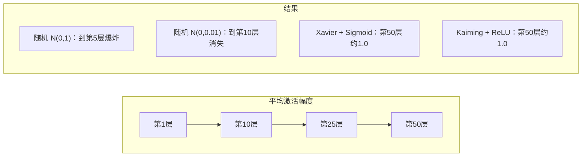
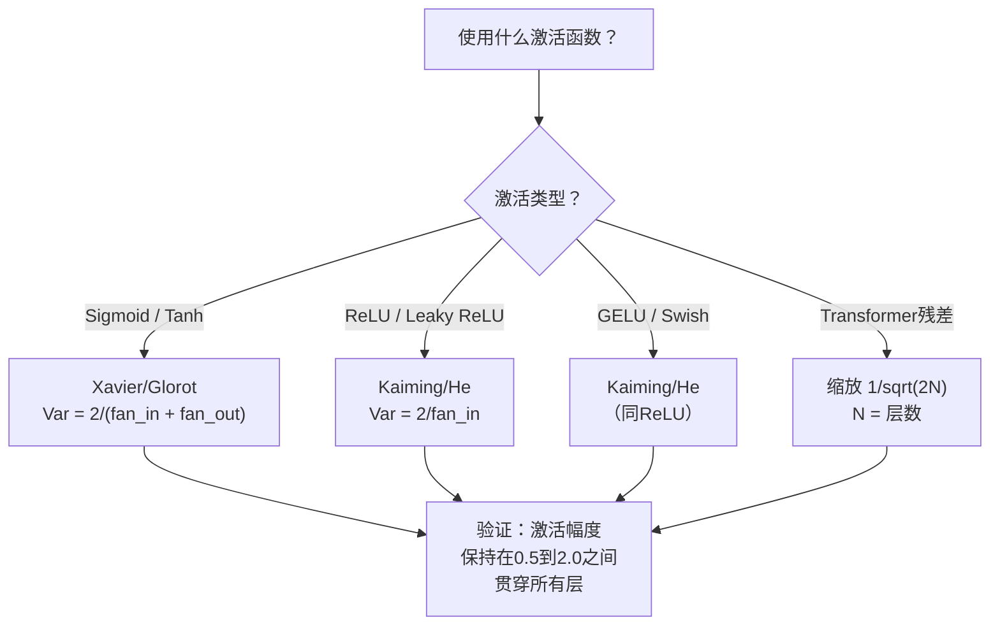

# 权重初始化与训练稳定性

> 初始化错了，训练永远不会开始。初始化对了，50层网络和3层网络一样训练得平滑。

**类型：** 构建  
**语言：** Python  
**前置条件：** 第03.04课（激活函数），第03.07课（正则化）  
**时间：** 约90分钟

## 学习目标

- 实现零初始化、随机初始化、Xavier/Glorot初始化和Kaiming/He初始化策略，并通过50层网络测量它们对激活幅度的影响
- 推导为什么Xavier初始化使用Var(w) = 2/(fan_in + fan_out)，而Kaiming初始化使用Var(w) = 2/fan_in
- 演示零初始化的对称性问题，并解释为什么仅靠随机尺度是不够的
- 将正确的初始化策略与激活函数匹配：sigmoid/tanh用Xavier，ReLU/GELU用Kaiming

## 问题

将所有权重初始化为零。什么都学不到。每个神经元计算相同的函数，接收相同的梯度，并做相同的更新。经过10000轮训练，你的512神经元隐藏层仍然是同一个神经元的512个副本。你付了512个参数的钱，却只得到了1个。

将它们初始化得太大。激活值在网络中爆炸。到第10层，数值达到1e15。到第20层，它们溢出到无穷大。梯度在反向传播中沿着同样的轨迹。

从标准正态分布中随机初始化它们。对3层网络有效。在50层时，信号要么坍缩到零，要么爆炸到无穷大，取决于随机尺度是略小还是略大。“有效”和“失效”之间的边界极其狭窄。

权重初始化是深度学习中最被低估的决策。架构能发论文。优化器能写博客。初始化只能得到一个脚注。但搞错了，其他一切都不重要了——你的网络在训练开始之前就已经死了。

## 概念

### 对称性问题

一层中的每个神经元都有相同的结构：将输入乘以权重，加上偏置，应用激活函数。如果所有权重都以相同的值开始（零是最极端的情况），每个神经元计算相同的输出。在反向传播期间，每个神经元接收相同的梯度。在更新步骤中，每个神经元的改变量相同。

你被困住了。网络有数百个参数，但它们都步调一致地移动。这叫做对称性，随机初始化是打破它的强力方式。每个神经元从权重空间中的不同点开始，因此每个神经元学习不同的特征。

但“随机”还不够。随机性的**尺度**决定了网络是否能训练。

### 方差在层间的传播

考虑一个具有fan_in个输入的单层：

```
z = w1*x1 + w2*x2 + ... + w_n*x_n
```

如果每个权重wi从方差为Var(w)的分布中抽取，每个输入xi的方差为Var(x)，则输出方差为：

```
Var(z) = fan_in * Var(w) * Var(x)
```

如果Var(w) = 1且fan_in = 512，输出方差是输入方差的512倍。经过10层：512^10 = 1.2e27。你的信号爆炸了。

如果Var(w) = 0.001，输出方差每层缩小0.001 * 512 = 0.512倍。经过10层：0.512^10 = 0.00013。你的信号消失了。

目标：选择Var(w)使得Var(z) = Var(x)。信号幅度在各层之间保持恒定。

### Xavier/Glorot初始化

Glorot和Bengio（2010）推导出了sigmoid和tanh激活函数的解法。为了在前向和反向传播中保持方差恒定：

```
Var(w) = 2 / (fan_in + fan_out)
```

在实践中，权重从以下分布中抽取：

```
w ~ Uniform(-limit, limit)  其中 limit = sqrt(6 / (fan_in + fan_out))
```

或：

```
w ~ Normal(0, sqrt(2 / (fan_in + fan_out)))
```

这之所以有效，是因为sigmoid和tanh在零点附近大致呈线性，而正确初始化的激活值恰好落在这个区域。方差在数十层中保持稳定。

### Kaiming/He初始化

ReLU会杀死一半的输出（所有负数变为零）。有效的fan_in减半，因为平均而言一半的输入被置零。Xavier初始化没有考虑到这一点——它低估了所需的方差。

He等人（2015）调整了公式：

```
Var(w) = 2 / fan_in
```

权重从以下分布中抽取：

```
w ~ Normal(0, sqrt(2 / fan_in))
```

因子2补偿了ReLU将一半激活值置零的影响。没有它，信号每层收缩约0.5倍。50层后：0.5^50 = 8.8e-16。Kaiming初始化防止了这种情况。

### Transformer初始化

GPT-2引入了一种不同的模式。残差连接将每个子层的输出加到其输入上：

```
x = x + sublayer(x)
```

每次加法都会增加方差。对于N个残差层，方差与N成比例增长。GPT-2将残差层的权重缩放1/sqrt(2N)，其中N是层数。这使累积的信号幅度保持稳定。

Llama 3（405B参数，126层）使用了类似的方案。没有这种缩放，残差流将通过126层注意力和前馈块无限制地增长。

```mermaid
flowchart TD
    subgraph "零初始化"
        Z1["第1层<br/>所有权重 = 0"] --> Z2["第2层<br/>所有神经元相同"]
        Z2 --> Z3["第3层<br/>仍然相同"]
        Z3 --> ZR["结果：1个有效神经元<br/>无论宽度多大"]
    end

    subgraph "Xavier初始化"
        X1["第1层<br/>Var = 2/(fan_in+fan_out)"] --> X2["第2层<br/>信号稳定"]
        X2 --> X3["第50层<br/>信号稳定"]
        X3 --> XR["结果：能用sigmoid/tanh训练"]
    end

    subgraph "Kaiming初始化"
        K1["第1层<br/>Var = 2/fan_in"] --> K2["第2层<br/>信号稳定"]
        K2 --> K3["第50层<br/>信号稳定"]
        K3 --> KR["结果：能用ReLU/GELU训练"]
    end
```



### 通过50层的激活幅度



### 选择正确的初始化



## 动手实现

### 第1步：初始化策略

四种初始化权重矩阵的方法。每个返回一个列表的列表（二维矩阵），具有fan_in列和fan_out行。

```python
import math
import random


def zero_init(fan_in, fan_out):
    return [[0.0 for _ in range(fan_in)] for _ in range(fan_out)]


def random_init(fan_in, fan_out, scale=1.0):
    return [[random.gauss(0, scale) for _ in range(fan_in)] for _ in range(fan_out)]


def xavier_init(fan_in, fan_out):
    std = math.sqrt(2.0 / (fan_in + fan_out))
    return [[random.gauss(0, std) for _ in range(fan_in)] for _ in range(fan_out)]


def kaiming_init(fan_in, fan_out):
    std = math.sqrt(2.0 / fan_in)
    return [[random.gauss(0, std) for _ in range(fan_in)] for _ in range(fan_out)]
```

### 第2步：激活函数

我们需要sigmoid、tanh和ReLU来测试每种初始化策略与其预期激活函数的搭配。

```python
def sigmoid(x):
    x = max(-500, min(500, x))
    return 1.0 / (1.0 + math.exp(-x))


def tanh_act(x):
    return math.tanh(x)


def relu(x):
    return max(0.0, x)
```

### 第3步：通过50层的前向传播

将随机数据传入深层网络，并测量每一层的平均激活幅度。

```python
def forward_deep(init_fn, activation_fn, n_layers=50, width=64, n_samples=100):
    random.seed(42)
    layer_magnitudes = []

    inputs = [[random.gauss(0, 1) for _ in range(width)] for _ in range(n_samples)]

    for layer_idx in range(n_layers):
        weights = init_fn(width, width)
        biases = [0.0] * width

        new_inputs = []
        for sample in inputs:
            output = []
            for neuron_idx in range(width):
                z = sum(weights[neuron_idx][j] * sample[j] for j in range(width)) + biases[neuron_idx]
                output.append(activation_fn(z))
            new_inputs.append(output)
        inputs = new_inputs

        magnitudes = []
        for sample in inputs:
            magnitudes.append(sum(abs(v) for v in sample) / width)
        mean_mag = sum(magnitudes) / len(magnitudes)
        layer_magnitudes.append(mean_mag)

    return layer_magnitudes
```

### 第4步：实验

运行所有组合：零初始化、随机N(0,1)、随机N(0,0.01)、Xavier+sigmoid、Xavier+tanh、Kaiming+ReLU。打印关键层的幅度。

```python
def run_experiment():
    configs = [
        ("零初始化 + Sigmoid", lambda fi, fo: zero_init(fi, fo), sigmoid),
        ("随机 N(0,1) + ReLU", lambda fi, fo: random_init(fi, fo, 1.0), relu),
        ("随机 N(0,0.01) + ReLU", lambda fi, fo: random_init(fi, fo, 0.01), relu),
        ("Xavier + Sigmoid", xavier_init, sigmoid),
        ("Xavier + Tanh", xavier_init, tanh_act),
        ("Kaiming + ReLU", kaiming_init, relu),
    ]

    print(f"{'策略':<30} {'L1':>10} {'L5':>10} {'L10':>10} {'L25':>10} {'L50':>10}")
    print("-" * 80)

    for name, init_fn, act_fn in configs:
        mags = forward_deep(init_fn, act_fn)
        row = f"{name:<30}"
        for idx in [0, 4, 9, 24, 49]:
            val = mags[idx]
            if val > 1e6:
                row += f" {'爆炸':>10}"
            elif val < 1e-6:
                row += f" {'消失':>10}"
            else:
                row += f" {val:>10.4f}"
        print(row)
```

### 第5步：对称性演示

展示零初始化产生相同的神经元。

```python
def symmetry_demo():
    random.seed(42)
    weights = zero_init(2, 4)
    biases = [0.0] * 4

    inputs = [0.5, -0.3]
    outputs = []
    for neuron_idx in range(4):
        z = sum(weights[neuron_idx][j] * inputs[j] for j in range(2)) + biases[neuron_idx]
        outputs.append(sigmoid(z))

    print("\n对称性演示（4个神经元，零初始化）：")
    for i, out in enumerate(outputs):
        print(f"  神经元 {i}: 输出 = {out:.6f}")
    all_same = all(abs(outputs[i] - outputs[0]) < 1e-10 for i in range(len(outputs)))
    print(f"  全部相同: {all_same}")
    print(f"  有效参数: 1（而不是 {len(weights) * len(weights[0])}）")
```

### 第6步：逐层幅度报告

打印通过50层的激活幅度视觉条形图。

```python
def magnitude_report(name, magnitudes):
    print(f"\n{name}:")
    for i, mag in enumerate(magnitudes):
        if i % 5 == 0 or i == len(magnitudes) - 1:
            if mag > 1e6:
                bar = "X" * 50 + " 爆炸"
            elif mag < 1e-6:
                bar = "." + " 消失"
            else:
                bar_len = min(50, max(1, int(mag * 10)))
                bar = "#" * bar_len
            print(f"  第 {i+1:3d} 层: {bar} ({mag:.6f})")
```

## 如何使用（PyTorch）

PyTorch 将这些作为内置函数提供：

```python
import torch
import torch.nn as nn

layer = nn.Linear(512, 256)

nn.init.xavier_uniform_(layer.weight)
nn.init.xavier_normal_(layer.weight)

nn.init.kaiming_uniform_(layer.weight, nonlinearity='relu')
nn.init.kaiming_normal_(layer.weight, nonlinearity='relu')

nn.init.zeros_(layer.bias)
```

当你调用 `nn.Linear(512, 256)` 时，PyTorch 默认使用 Kaiming 均匀初始化。这就是为什么大多数简单网络“开箱即用”——PyTorch 已经做出了正确的选择。但当你构建自定义架构或超过 20 层深度时，你需要理解发生了什么，并可能需要覆盖默认值。

对于 Transformer，HuggingFace 模型通常在其 `_init_weights` 方法中处理初始化。GPT-2 的实现将残差投影缩放 1/sqrt(N)。如果你从头构建 Transformer，你需要自己添加这个。

## 交付内容

本课程产出：
- `outputs/prompt-init-strategy.md` —— 一个诊断权重初始化问题并推荐正确策略的提示

## 练习

1. 添加 LeCun 初始化（Var = 1/fan_in，为 SELU 激活设计）。使用 LeCun 初始化 + tanh 运行 50 层实验，并与 Xavier + tanh 进行比较。

2. 实现 GPT-2 残差缩放：在将每层的输出加到残差流之前，乘以 1/sqrt(2*N)。运行 50 层，比较有无缩放，测量残差幅度增长的速度。

3. 创建一个“初始化健康检查”函数，接收网络的层维度和激活类型，然后推荐正确的初始化，并在当前初始化会导致问题时发出警告。

4. 使用 fan_in = 16 与 fan_in = 1024 运行实验。Xavier 和 Kaiming 会适应 fan_in，但随机初始化不会。展示随着层变大，“有效”与“失效”之间的差距如何扩大。

5. 实现正交初始化（生成随机矩阵，计算其 SVD，使用正交矩阵 U）。在 50 层的 ReLU 网络中与 Kaiming 进行比较。

## 关键术语

| 术语 | 人们常说的话 | 实际含义 |
|------|----------------|----------------------|
| 权重初始化 | “随机设置初始权重” | 选择初始权重值的策略，决定了网络是否能够训练 |
| 对称破缺 | “让神经元不同” | 使用随机初始化确保神经元学习不同的特征，而不是计算相同的函数 |
| 扇入 | “神经元的输入数量” | 传入连接的数量，决定了输入方差在加权和中如何累积 |
| 扇出 | “神经元的输出数量” | 传出连接的数量，与反向传播期间保持梯度方差有关 |
| Xavier/Glorot 初始化 | “sigmoid 初始化” | Var(w) = 2/(fan_in + fan_out)，设计用于通过 sigmoid 和 tanh 激活保持方差 |
| Kaiming/He 初始化 | “ReLU 初始化” | Var(w) = 2/fan_in，考虑了 ReLU 将一半激活值置零 |
| 方差传播 | “信号如何通过层增长或收缩” | 基于权重尺度，激活方差如何逐层变化的数学分析 |
| 残差缩放 | “GPT-2 的初始化技巧” | 将残差连接权重缩放 1/sqrt(2N)，防止方差通过 N 个 Transformer 层增长 |
| 死亡网络 | “什么都训练不了” | 由于初始化不当，导致所有梯度为零或所有激活值饱和的网络 |
| 激活爆炸 | “数值趋向无穷大” | 当权重方差过高时，激活幅度通过层呈指数增长 |

## 进一步阅读

- Glorot & Bengio, "Understanding the difficulty of training deep feedforward neural networks" (2010) —— 原始的 Xavier 初始化论文，包含方差分析
- He et al., "Delving Deep into Rectifiers" (2015) —— 为 ReLU 网络引入了 Kaiming 初始化
- Radford et al., "Language Models are Unsupervised Multitask Learners" (2019) —— GPT-2 论文，包含残差缩放初始化
- Mishkin & Matas, "All You Need is a Good Init" (2016) —— 层序列单位方差初始化，是解析公式的经验替代方案