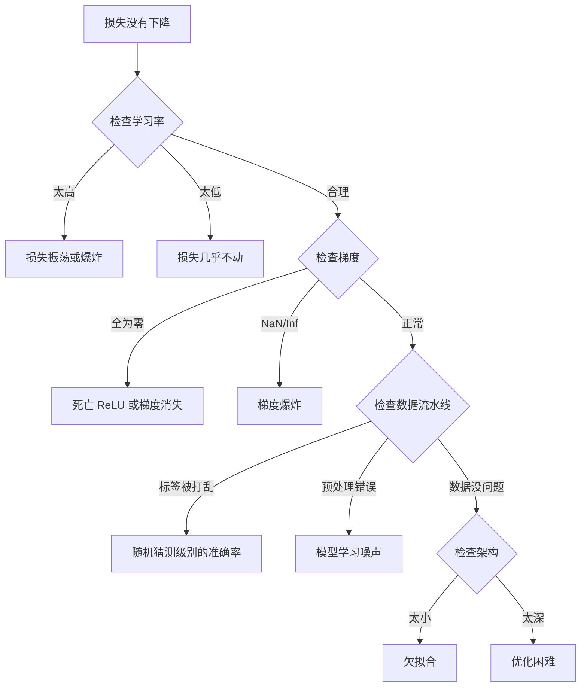
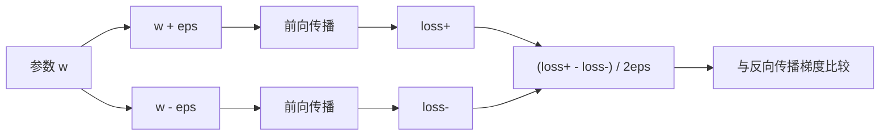
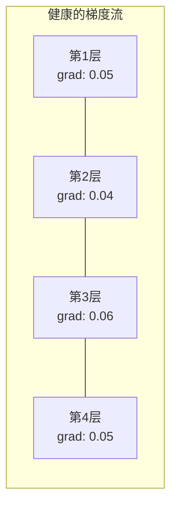
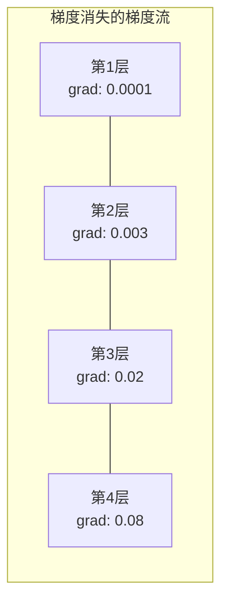
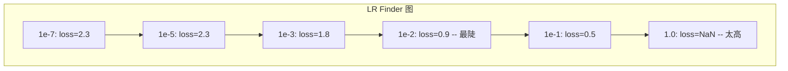

# 调试神经网络

> 你的网络编译通过了。它运行了。它产生了一个数字。这个数字是错的，而且没有任何东西崩溃。欢迎来到最难的那种调试——没有错误信息的调试。

**类型：** 实践
**语言：** Python, PyTorch
**前置条件：** 第三阶段第 01–10 课（特别是反向传播、损失函数、优化器）
**时间：** 约 90 分钟

## 学习目标

- 使用系统性的调试策略诊断常见的神经网络故障（NaN 损失、损失曲线平坦、过拟合、振荡）
- 应用“过拟合一个批次”技术来验证你的模型架构和训练循环是否正确
- 检查梯度幅度、激活分布和权重范数，以识别梯度消失/爆炸问题
- 构建一份涵盖数据流水线、模型架构、损失函数、优化器和学习率问题的调试清单

## 问题

传统软件在出问题时会崩溃。空指针会抛出异常。类型不匹配会在编译时失败。差一错误会产生明显错误的输出。

神经网络不会给你这种奢侈。

一个出问题的神经网络会运行到结束，打印一个损失值，并输出预测结果。损失可能会下降。预测结果可能看起来合理。但模型在静默地出错——学习捷径、记忆噪声，或收敛到无用的局部最小值。Google 研究人员估计，60-70% 的 ML 调试时间都花在了“静默”错误上，这些错误不会产生错误信息，但会降低模型质量。

一个能工作的模型和一个坏掉的模型之间的区别，往往就是一行放错位置的代码：缺少的 `zero_grad()`、转置的维度、大了 10 倍的学习率。Andrej Karpathy 的经典文章 "A Recipe for Training Neural Networks"（2019）开篇就是这样写的：“最常见的神经网络错误是不会崩溃的 bug。”

本课程教你如何找到这些 bug。

## 概念

### 调试思维模式

忘掉“打印+祈祷”式的调试。神经网络调试需要系统性的方法，因为反馈循环很慢（每次训练运行需要几分钟到几小时），而且症状很模糊（损失很差可能意味着 20 种不同的问题）。

黄金法则：**从简单开始，一次添加一个复杂度，并独立验证每个部分。**



### 症状 1：损失不下降

这是最常见的抱怨。训练循环在运行，轮次在增加，但损失保持平坦或剧烈振荡。

**学习率不对。** 太高：损失振荡或跳到 NaN。太低：损失下降得太慢，看起来像平的。对于 Adam，从 1e-3 开始。对于 SGD，从 1e-1 或 1e-2 开始。在断定其他问题之前，总是先尝试跨越 10 倍的 3 个学习率（例如 1e-2、1e-3、1e-4）。

**死亡 ReLU。** 如果一个 ReLU 神经元接收到一个大的负输入，它输出 0，其梯度为 0。它再也不会激活。如果有足够多的神经元死亡，网络就无法学习。检查：打印每个 ReLU 层之后恰好为 0 的激活比例。如果 >50% 死亡，切换到 LeakyReLU 或降低学习率。

**梯度消失。** 在带有 sigmoid 或 tanh 激活的深层网络中，梯度在反向传播时呈指数收缩。当它们到达第一层时，已经接近 0。前面的层停止学习。解决方法：使用 ReLU/GELU、添加残差连接，或使用批归一化。

**梯度爆炸。** 相反的问题——梯度呈指数增长。常见于 RNN 和非常深的网络。损失跳到 NaN。解决方法：梯度裁剪（`torch.nn.utils.clip_grad_norm_`）、降低学习率，或添加归一化。

### 症状 2：损失下降但模型很差

损失在下降。训练准确率达到 99%。但测试准确率只有 55%。或者模型在真实数据上产生无意义的输出。

**过拟合。** 模型记忆训练数据而不是学习模式。训练和验证损失之间的差距随时间增长。解决方法：更多数据、dropout、权重衰减、早停、数据增强。

**数据泄露。** 测试数据泄露到训练中。准确率高得可疑。常见原因：在划分之前打乱数据、使用完整数据集的统计量进行预处理、跨划分的重复样本。解决方法：先划分，再预处理，检查重复项。

**标签错误。** 大多数真实数据集中 5-10% 的标签是错误的（Northcutt 等人，2021——“测试集中普遍存在的标签错误”）。模型学习的是噪声。解决方法：使用置信学习来发现和修复标记错误的样本，或使用损失截断来忽略高损失样本。

### 症状 3：损失中出现 NaN 或 Inf

损失值变成 `nan` 或 `inf`。训练已死亡。

**学习率太高。** 梯度更新过冲太多，导致权重爆炸。解决方法：降低 10 倍。

**log(0) 或 log(负数)。** 交叉熵损失计算 `log(p)`。如果你的模型输出恰好为 0 或负概率，log 会爆炸。解决方法：将预测值限制在 `[eps, 1-eps]`，其中 `eps=1e-7`。

**除以零。** 批归一化除以标准差。一个具有恒定值的批次其 std=0。解决方法：在分母中添加 epsilon（PyTorch 默认会这样做，但自定义实现可能不会）。

**数值溢出。** 大的激活值被送入 `exp()` 会产生 Inf。Softmax 尤其容易出这个问题。解决方法：在取指数之前减去最大值（log-sum-exp 技巧）。

### 技术 1：梯度检查

将你的解析梯度（来自反向传播）与数值梯度（来自有限差分）进行比较。如果它们不一致，你的反向传播有 bug。

参数 `w` 的数值梯度：

```
grad_numerical = (loss(w + eps) - loss(w - eps)) / (2 * eps)
```

一致性度量（相对差异）：

```
rel_diff = |grad_analytical - grad_numerical| / max(|grad_analytical|, |grad_numerical|, 1e-8)
```

如果 `rel_diff < 1e-5`：正确。如果 `rel_diff > 1e-3`：几乎肯定有 bug。



### 技术 2：激活统计

在训练期间监控每层之后激活的均值和标准差。健康的网络保持激活值均值接近 0、标准差接近 1（在归一化之后），或至少是有界的。

| 健康指标 | 均值 | 标准差 | 诊断 |
|-----------------|------|-----|-----------|
| 健康 | ~0 | ~1 | 网络正常学习 |
| 饱和 | >>0 或 <<0 | ~0 | 激活值卡在极端值 |
| 死亡 | 0 | 0 | 神经元死亡（全为零） |
| 爆炸 | >>10 | >>10 | 激活值无界增长 |

### 技术 3：梯度流可视化

绘制每层的平均梯度幅度。在健康的网络中，各层的梯度幅度应该大致相似。如果浅层的梯度比深层小 1000 倍，你就遇到了梯度消失。





### 技术 4：过拟合一个批次测试

深度学习中最重要的单次调试技术。

取一个小批次（8-32 个样本）。在上面训练 100+ 次迭代。损失应该降到接近零，训练准确率应该达到 100%。如果不能，你的模型或训练循环有根本性的 bug——不要进行完整训练。

这个测试能捕获：
- 损坏的损失函数
- 损坏的反向传播
- 架构太小，无法表示数据
- 优化器没有连接到模型参数
- 数据和标签错位

运行这个测试只需 30 秒，却能节省数小时调试完整训练运行的时间。

### 技术 5：学习率查找器

Leslie Smith（2017）提出在一个轮次内将学习率从非常小（1e-7）扫到非常大（10），同时记录损失。绘制损失 vs 学习率的图。最优学习率大约比损失开始最快下降时的速率小 10 倍。



此示例中的最佳学习率：约 1e-3（在最陡点之前一个数量级）。

### 常见 PyTorch Bug

这些是 PyTorch 社区中浪费集体时间最多的 bug：

| Bug | 症状 | 修复 |
|-----|---------|-----|
| 忘记 `optimizer.zero_grad()` | 梯度跨批次累积，损失振荡 | 在 `loss.backward()` 之前添加 `optimizer.zero_grad()` |
| 测试时忘记 `model.eval()` | Dropout 和批归一化行为不同，测试准确率在运行间变化 | 添加 `model.eval()` 和 `torch.no_grad()` |
| 错误的张量形状 | 静默广播产生错误结果，无错误信息 | 调试期间在每个操作后打印形状 |
| CPU/GPU 不匹配 | `RuntimeError: expected CUDA tensor` | 对模型和数据都使用 `.to(device)` |
| 未分离张量 | 计算图无限增长，OOM | 使用 `.detach()` 或 `with torch.no_grad()` |
| 原地操作破坏 autograd | `RuntimeError: modified by in-place operation` | 将 `x += 1` 替换为 `x = x + 1` |
| 数据未归一化 | 损失卡在随机猜测水平 | 将输入归一化为 mean=0, std=1 |
| 标签数据类型错误 | 交叉熵期望 `Long`，收到 `Float` | 转换标签：`labels.long()` |

### 主调试表

| 症状 | 可能原因 | 首先要尝试的 |
|---------|-------------|-------------------|
| 损失卡在 -log(1/num_classes) | 模型预测均匀分布 | 检查数据流水线，验证标签与输入匹配 |
| 几步后损失变为 NaN | 学习率太高 | 将 LR 降低 10 倍 |
| 立即变为 NaN | log(0) 或除以零 | 在 log/除法操作中添加 epsilon |
| 损失剧烈振荡 | LR 太高或批次太小 | 降低 LR，增大批次 |
| 损失下降然后平台期 | 对微调阶段 LR 太高 | 添加 LR 调度（余弦或阶梯衰减） |
| 训练准确率高，测试准确率低 | 过拟合 | 添加 dropout、权重衰减、更多数据 |
| 训练准确率 = 测试准确率 = 随机猜测 | 模型什么都没学到 | 运行过拟合一个批次测试 |
| 训练准确率 = 测试准确率但都低 | 欠拟合 | 更大的模型、更多层、更多特征 |
| 梯度全为零 | 死亡 ReLU 或分离的计算图 | 切换到 LeakyReLU，检查 `.requires_grad` |
| 训练期间内存不足 | 批次太大或图未释放 | 减少批次，对评估使用 `torch.no_grad()` |

## 动手实现

一个诊断工具包，用于监控激活、梯度和损失曲线。你将故意破坏一个网络，并使用该工具包诊断每个问题。

### 第 1 步：NetworkDebugger 类

向 PyTorch 模型添加钩子，以记录每层的激活和梯度统计信息。

```python
import torch
import torch.nn as nn
import math


class NetworkDebugger:
    def __init__(self, model):
        self.model = model
        self.activation_stats = {}
        self.gradient_stats = {}
        self.loss_history = []
        self.lr_losses = []
        self.hooks = []
        self._register_hooks()

    def _register_hooks(self):
        for name, module in self.model.named_modules():
            if isinstance(module, (nn.Linear, nn.Conv2d, nn.ReLU, nn.LeakyReLU)):
                hook = module.register_forward_hook(self._make_activation_hook(name))
                self.hooks.append(hook)
                hook = module.register_full_backward_hook(self._make_gradient_hook(name))
                self.hooks.append(hook)

    def _make_activation_hook(self, name):
        def hook(module, input, output):
            with torch.no_grad():
                out = output.detach().float()
                self.activation_stats[name] = {
                    "mean": out.mean().item(),
                    "std": out.std().item(),
                    "fraction_zero": (out == 0).float().mean().item(),
                    "min": out.min().item(),
                    "max": out.max().item(),
                }
        return hook

    def _make_gradient_hook(self, name):
        def hook(module, grad_input, grad_output):
            if grad_output[0] is not None:
                with torch.no_grad():
                    grad = grad_output[0].detach().float()
                    self.gradient_stats[name] = {
                        "mean": grad.mean().item(),
                        "std": grad.std().item(),
                        "abs_mean": grad.abs().mean().item(),
                        "max": grad.abs().max().item(),
                    }
        return hook

    def record_loss(self, loss_value):
        self.loss_history.append(loss_value)

    def check_loss_health(self):
        if len(self.loss_history) < 2:
            return "数据不足"
        recent = self.loss_history[-10:]
        if any(math.isnan(v) or math.isinf(v) for v in recent):
            return "存在 NaN 或 Inf"
        if len(self.loss_history) >= 20:
            first_half = sum(self.loss_history[:10]) / 10
            second_half = sum(self.loss_history[-10:]) / 10
            if second_half >= first_half * 0.99:
                return "未下降"
        if len(recent) >= 5:
            diffs = [recent[i+1] - recent[i] for i in range(len(recent)-1)]
            if max(diffs) - min(diffs) > 2 * abs(sum(diffs) / len(diffs)):
                return "振荡"
        return "健康"

    def check_activations(self):
        issues = []
        for name, stats in self.activation_stats.items():
            if stats["fraction_zero"] > 0.5:
                issues.append(f"死亡神经元: {name} 有 {stats['fraction_zero']:.0%} 的零激活")
            if abs(stats["mean"]) > 10:
                issues.append(f"激活爆炸: {name} mean={stats['mean']:.2f}")
            if stats["std"] < 1e-6:
                issues.append(f"激活坍缩: {name} std={stats['std']:.2e}")
        return issues if issues else ["健康"]

    def check_gradients(self):
        issues = []
        grad_magnitudes = []
        for name, stats in self.gradient_stats.items():
            grad_magnitudes.append((name, stats["abs_mean"]))
            if stats["abs_mean"] < 1e-7:
                issues.append(f"梯度消失: {name} abs_mean={stats['abs_mean']:.2e}")
            if stats["abs_mean"] > 100:
                issues.append(f"梯度爆炸: {name} abs_mean={stats['abs_mean']:.2e}")
        if len(grad_magnitudes) >= 2:
            first_mag = grad_magnitudes[0][1]
            last_mag = grad_magnitudes[-1][1]
            if last_mag > 0 and first_mag / last_mag > 100:
                issues.append(f"梯度比例: 首层/末层 = {first_mag/last_mag:.0f}x (梯度消失)")
        return issues if issues else ["健康"]

    def print_report(self):
        print("\n=== 网络调试报告 ===")
        print(f"\n损失健康: {self.check_loss_health()}")
        if self.loss_history:
            print(f"  最近 5 个损失值: {[f'{v:.4f}' for v in self.loss_history[-5:]]}")
        print("\n激活诊断:")
        for item in self.check_activations():
            print(f"  {item}")
        print("\n梯度诊断:")
        for item in self.check_gradients():
            print(f"  {item}")
        print("\n逐层激活统计:")
        for name, stats in self.activation_stats.items():
            print(f"  {name}: mean={stats['mean']:.4f} std={stats['std']:.4f} zero={stats['fraction_zero']:.1%}")
        print("\n逐层梯度统计:")
        for name, stats in self.gradient_stats.items():
            print(f"  {name}: abs_mean={stats['abs_mean']:.2e} max={stats['max']:.2e}")

    def remove_hooks(self):
        for hook in self.hooks:
            hook.remove()
        self.hooks.clear()
```

### 第 2 步：过拟合一个批次测试

```python
def overfit_one_batch(model, x_batch, y_batch, criterion, lr=0.01, steps=200):
    optimizer = torch.optim.Adam(model.parameters(), lr=lr)
    model.train()
    print("\n=== 过拟合一个批次测试 ===")
    print(f"批次大小: {x_batch.shape[0]}, 步数: {steps}")

    for step in range(steps):
        optimizer.zero_grad()
        output = model(x_batch)
        loss = criterion(output, y_batch)
        loss.backward()
        optimizer.step()

        if step % 50 == 0 or step == steps - 1:
            with torch.no_grad():
                preds = (output > 0).float() if output.shape[-1] == 1 else output.argmax(dim=1)
                targets = y_batch if y_batch.dim() == 1 else y_batch.squeeze()
                acc = (preds.squeeze() == targets).float().mean().item()
            print(f"  第 {step:3d} 步 | 损失: {loss.item():.6f} | 准确率: {acc:.1%}")

    final_loss = loss.item()
    if final_loss > 0.1:
        print(f"\n  失败: 损失未收敛 ({final_loss:.4f})。模型或训练循环有问题。")
        return False
    print(f"\n  通过: 损失收敛至 {final_loss:.6f}")
    return True
```

### 第 3 步：学习率查找器

```python
def find_learning_rate(model, x_data, y_data, criterion, start_lr=1e-7, end_lr=10, steps=100):
    import copy
    original_state = copy.deepcopy(model.state_dict())
    optimizer = torch.optim.SGD(model.parameters(), lr=start_lr)
    lr_mult = (end_lr / start_lr) ** (1 / steps)

    model.train()
    results = []
    best_loss = float("inf")
    current_lr = start_lr

    print("\n=== 学习率查找器 ===")

    for step in range(steps):
        optimizer.zero_grad()
        output = model(x_data)
        loss = criterion(output, y_data)

        if math.isnan(loss.item()) or loss.item() > best_loss * 10:
            break

        best_loss = min(best_loss, loss.item())
        results.append((current_lr, loss.item()))

        loss.backward()
        optimizer.step()

        current_lr *= lr_mult
        for param_group in optimizer.param_groups:
            param_group["lr"] = current_lr

    model.load_state_dict(original_state)

    if len(results) < 10:
        print("  无法完成 LR 扫描——损失发散太快")
        return results

    min_loss_idx = min(range(len(results)), key=lambda i: results[i][1])
    suggested_lr = results[max(0, min_loss_idx - 10)][0]

    print(f"  从 {start_lr:.0e} 到 {results[-1][0]:.0e} 扫描了 {len(results)} 步")
    print(f"  最小损失 {results[min_loss_idx][1]:.4f} 在 lr={results[min_loss_idx][0]:.2e}")
    print(f"  建议学习率: {suggested_lr:.2e}")

    return results
```

### 第 4 步：梯度检查器

```python
def _flat_to_multi_index(flat_idx, shape):
    multi_idx = []
    remaining = flat_idx
    for dim in reversed(shape):
        multi_idx.insert(0, remaining % dim)
        remaining //= dim
    return tuple(multi_idx)


def gradient_check(model, x, y, criterion, eps=1e-4):
    model.train()
    x_double = x.double()
    y_double = y.double()
    model_double = model.double()

    print("\n=== 梯度检查 ===")
    overall_max_diff = 0
    checked = 0

    for name, param in model_double.named_parameters():
        if not param.requires_grad:
            continue

        layer_max_diff = 0

        model_double.zero_grad()
        output = model_double(x_double)
        loss = criterion(output, y_double)
        loss.backward()
        analytical_grad = param.grad.clone()

        num_checks = min(5, param.numel())
        for i in range(num_checks):
            idx = _flat_to_multi_index(i, param.shape)
            original = param.data[idx].item()

            param.data[idx] = original + eps
            with torch.no_grad():
                loss_plus = criterion(model_double(x_double), y_double).item()

            param.data[idx] = original - eps
            with torch.no_grad():
                loss_minus = criterion(model_double(x_double), y_double).item()

            param.data[idx] = original

            numerical = (loss_plus - loss_minus) / (2 * eps)
            analytical = analytical_grad[idx].item()

            denom = max(abs(numerical), abs(analytical), 1e-8)
            rel_diff = abs(numerical - analytical) / denom

            layer_max_diff = max(layer_max_diff, rel_diff)
            checked += 1

        overall_max_diff = max(overall_max_diff, layer_max_diff)
        status = "OK" if layer_max_diff < 1e-5 else "不匹配"
        print(f"  {name}: max_rel_diff={layer_max_diff:.2e} [{status}]")

    model.float()

    print(f"\n  检查了 {checked} 个参数")
    if overall_max_diff < 1e-5:
        print("  通过: 梯度匹配 (rel_diff < 1e-5)")
    elif overall_max_diff < 1e-3:
        print("  警告: 存在微小差异 (1e-5 < rel_diff < 1e-3)")
    else:
        print("  失败: 检测到梯度不匹配 (rel_diff > 1e-3)")
    return overall_max_diff
```

### 第 5 步：故意破坏的网络

现在将工具包应用于被破坏的网络，并诊断每一个。

```python
def demo_broken_networks():
    torch.manual_seed(42)
    x = torch.randn(64, 10)
    y = (x[:, 0] > 0).long()

    print("\n" + "=" * 60)
    print("BUG 1: 学习率太高 (lr=10)")
    print("=" * 60)
    model1 = nn.Sequential(nn.Linear(10, 32), nn.ReLU(), nn.Linear(32, 2))
    debugger1 = NetworkDebugger(model1)
    optimizer1 = torch.optim.SGD(model1.parameters(), lr=10.0)
    criterion = nn.CrossEntropyLoss()
    for step in range(20):
        optimizer1.zero_grad()
        out = model1(x)
        loss = criterion(out, y)
        debugger1.record_loss(loss.item())
        loss.backward()
        optimizer1.step()
    debugger1.print_report()
    debugger1.remove_hooks()

    print("\n" + "=" * 60)
    print("BUG 2: 不良初始化导致的死亡 ReLU")
    print("=" * 60)
    model2 = nn.Sequential(nn.Linear(10, 32), nn.ReLU(), nn.Linear(32, 32), nn.ReLU(), nn.Linear(32, 2))
    with torch.no_grad():
        for m in model2.modules():
            if isinstance(m, nn.Linear):
                m.weight.fill_(-1.0)
                m.bias.fill_(-5.0)
    debugger2 = NetworkDebugger(model2)
    optimizer2 = torch.optim.Adam(model2.parameters(), lr=1e-3)
    for step in range(50):
        optimizer2.zero_grad()
        out = model2(x)
        loss = criterion(out, y)
        debugger2.record_loss(loss.item())
        loss.backward()
        optimizer2.step()
    debugger2.print_report()
    debugger2.remove_hooks()

    print("\n" + "=" * 60)
    print("BUG 3: 缺少 zero_grad（梯度累积）")
    print("=" * 60)
    model3 = nn.Sequential(nn.Linear(10, 32), nn.ReLU(), nn.Linear(32, 2))
    debugger3 = NetworkDebugger(model3)
    optimizer3 = torch.optim.SGD(model3.parameters(), lr=0.01)
    for step in range(50):
        out = model3(x)
        loss = criterion(out, y)
        debugger3.record_loss(loss.item())
        loss.backward()
        optimizer3.step()
    debugger3.print_report()
    debugger3.remove_hooks()

    print("\n" + "=" * 60)
    print("健康网络：用于对比的正确设置")
    print("=" * 60)
    model_good = nn.Sequential(nn.Linear(10, 32), nn.ReLU(), nn.Linear(32, 2))
    debugger_good = NetworkDebugger(model_good)
    optimizer_good = torch.optim.Adam(model_good.parameters(), lr=1e-3)
    for step in range(50):
        optimizer_good.zero_grad()
        out = model_good(x)
        loss = criterion(out, y)
        debugger_good.record_loss(loss.item())
        loss.backward()
        optimizer_good.step()
    debugger_good.print_report()
    debugger_good.remove_hooks()

    print("\n" + "=" * 60)
    print("过拟合一个批次测试（健康模型）")
    print("=" * 60)
    model_test = nn.Sequential(nn.Linear(10, 32), nn.ReLU(), nn.Linear(32, 2))
    overfit_one_batch(model_test, x[:8], y[:8], criterion)

    print("\n" + "=" * 60)
    print("学习率查找器")
    print("=" * 60)
    model_lr = nn.Sequential(nn.Linear(10, 32), nn.ReLU(), nn.Linear(32, 2))
    find_learning_rate(model_lr, x, y, criterion)

    print("\n" + "=" * 60)
    print("梯度检查")
    print("=" * 60)
    model_grad = nn.Sequential(nn.Linear(10, 8), nn.ReLU(), nn.Linear(8, 2))
    gradient_check(model_grad, x[:4], y[:4], criterion)
```

## 如何使用（PyTorch）

### PyTorch 内置工具

```python
import torch
import torch.nn as nn

model = nn.Sequential(
    nn.Linear(768, 256),
    nn.ReLU(),
    nn.Linear(256, 10),
)

with torch.autograd.detect_anomaly():
    output = model(input_tensor)
    loss = criterion(output, target)
    loss.backward()

for name, param in model.named_parameters():
    if param.grad is not None:
        print(f"{name}: grad_mean={param.grad.abs().mean():.2e}")
```

### Weights & Biases 集成

```python
import wandb

wandb.init(project="debug-training")

for epoch in range(100):
    loss = train_one_epoch()
    wandb.log({
        "loss": loss,
        "lr": optimizer.param_groups[0]["lr"],
        "grad_norm": torch.nn.utils.clip_grad_norm_(model.parameters(), float("inf")),
    })

    for name, param in model.named_parameters():
        if param.grad is not None:
            wandb.log({f"grad/{name}": wandb.Histogram(param.grad.cpu().numpy())})
```

### TensorBoard

```python
from torch.utils.tensorboard import SummaryWriter

writer = SummaryWriter("runs/debug_experiment")

for epoch in range(100):
    loss = train_one_epoch()
    writer.add_scalar("Loss/train", loss, epoch)

    for name, param in model.named_parameters():
        writer.add_histogram(f"weights/{name}", param, epoch)
        if param.grad is not None:
            writer.add_histogram(f"gradients/{name}", param.grad, epoch)
```

### 调试清单（在完整训练之前）

1. 运行过拟合一个批次测试。如果失败，停止。
2. 打印模型摘要——验证参数数量是否合理。
3. 用随机数据进行一次前向传播——检查输出形状。
4. 训练 5 个轮次——验证损失是否下降。
5. 检查激活统计——无死亡层，无爆炸。
6. 检查梯度流——无消失，无爆炸。
7. 验证数据流水线——打印 5 个带标签的随机样本。

## 交付内容

本课程产出：
- `outputs/prompt-nn-debugger.md` —— 一个用于诊断神经网络训练失败的提示
- `outputs/skill-debug-checklist.md` —— 一份用于调试训练问题的决策树清单

生产调试的关键部署模式：
- 向生产训练脚本添加监控钩子
- 每 N 步将激活和梯度统计记录到 W&B 或 TensorBoard
- 实现针对 NaN 损失、死亡神经元（>80% 零）或梯度爆炸的自动告警
- 在更改架构或数据流水线时始终运行过拟合一个批次测试

## 练习

1. **添加梯度爆炸检测器。** 修改 `NetworkDebugger`，使其在梯度超过阈值时检测到并自动建议梯度裁剪值。在一个没有归一化的 20 层网络上测试它。

2. **构建一个死亡神经元复活器。** 编写一个函数，识别死亡的 ReLU 神经元（始终输出 0），并用 Kaiming 初始化重新初始化它们的传入权重。证明这能恢复一个 >70% 神经元死亡的网络。

3. **实现带绘图功能的学习率查找器。** 扩展 `find_learning_rate` 以将结果保存为 CSV，并编写一个单独的脚本来读取 CSV 并使用 matplotlib 显示 LR vs loss 曲线。为 ResNet-18 在 CIFAR-10 上确定最优 LR。

4. **创建一个数据流水线验证器。** 编写一个函数检查：训练/测试划分中的重复样本、标签分布不平衡（>10:1 比例）、输入归一化（mean 接近 0，std 接近 1）以及数据中的 NaN/Inf 值。在一个故意损坏的数据集上运行它。

5. **调试一个真实的故障。** 取第 10 课的迷你框架，引入一个微妙的 bug（例如，在 backward 中转置权重矩阵），并使用梯度检查来精确定位哪个参数的梯度不正确。记录调试过程。

## 关键术语

| 术语 | 人们常说的话 | 实际含义 |
|------|----------------|----------------------|
| 静默错误 | “它能运行但结果很差” | 一种不产生错误但降低模型质量的 bug——ML 中的主要失效模式 |
| 死亡 ReLU | “神经元死亡了” | 一个输入始终为负的 ReLU 神经元，因此它输出 0 并永久接收 0 梯度 |
| 梯度消失 | “浅层停止学习” | 梯度通过层呈指数收缩，使得浅层的权重实际上被冻结 |
| 梯度爆炸 | “损失变成了 NaN” | 梯度通过层呈指数增长，导致权重更新太大以至于溢出 |
| 梯度检查 | “验证反向传播是否正确” | 将来自反向传播的解析梯度与来自有限差分的数值梯度进行比较 |
| 过拟合一个批次 | “最重要的调试测试” | 在单个小批次上训练以验证模型**能够**学习——如果它不能，说明有根本性的问题 |
| LR 查找器 | “扫描以找到正确的学习率” | 在一个轮次内指数增加学习率，并在损失发散之前选择该速率 |
| 数据泄露 | “测试数据泄露到训练中” | 当来自测试集的信息污染训练时，产生人为的高准确率 |
| 激活统计 | “监控层健康” | 跟踪每层输出的均值、标准差和零比例，以检测死亡、饱和或爆炸的神经元 |
| 梯度裁剪 | “限制梯度幅度” | 当梯度范数超过阈值时将其缩小，以防止梯度爆炸更新 |

## 进一步阅读

- Smith, "Cyclical Learning Rates for Training Neural Networks" (2017) —— 引入学习率范围测试（LR 查找器）的论文
- Northcutt et al., "Pervasive Label Errors in Test Sets Destabilize Machine Learning Benchmarks" (2021) —— 表明 ImageNet、CIFAR-10 等主要基准测试中 3-6% 的标签是错误的
- Zhang et al., "Understanding Deep Learning Requires Rethinking Generalization" (2017) —— 表明神经网络可以记忆随机标签的论文，这也是过拟合一个批次测试有效的原因
- PyTorch 文档中关于 `torch.autograd.detect_anomaly` 和 `torch.autograd.set_detect_anomaly` 的内置 NaN/Inf 检测功能