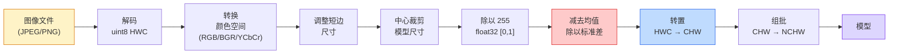
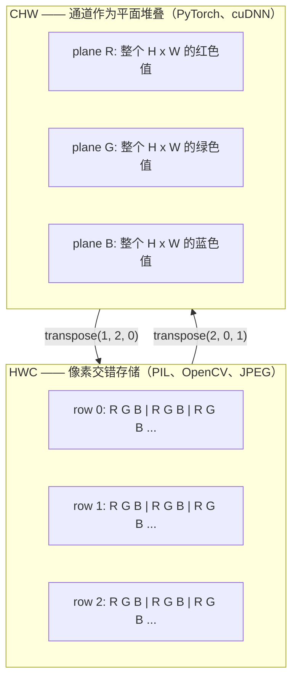

# 图像基础 —— 像素、通道与颜色空间

> 图像是光样本的张量。每一个你将使用的视觉模型，都始于这一个事实。

**类型：** Build
**语言：** Python
**前置知识：** 第 1 阶段第 12 课（张量操作），第 3 阶段第 11 课（PyTorch 入门）
**时间：** 约 45 分钟

## 学习目标

- 解释连续场景如何被离散化为像素，以及采样/量化决策如何决定下游模型的上限
- 以 NumPy 数组形式读取、切片和检查图像，并在 HWC 与 CHW 布局之间熟练切换
- 在 RGB、灰度、HSV 和 YCbCr 之间转换，并说明每种颜色空间存在的理由
- 应用像素级预处理（归一化、标准化、调整大小、通道优先），完全按照 torchvision 的期望执行

## 问题所在

你读的每一篇论文、下载的每一个预训练权重、调用的每一个视觉 API，都假定输入采用某种特定编码。传入模型想要 `float32` 的地方你给 `uint8`，它仍然会运行——然后默默地输出垃圾。把 BGR 喂给在 RGB 上训练的网络，准确率会暴跌十个点。在模型期望 channels-first 时给它 channels-last，第一个卷积层会把高度当成特征通道。这些都不会报错。它只会毁掉你的指标，然后你花一周时间去 hunt 一个 bug，而这个 bug 其实藏在你加载文件的方式里。

卷积本身一旦你知道它在什么上面滑动，其实并不复杂。困难之处在于，“图像”对相机、JPEG 解码器、PIL、OpenCV、torchvision 和 CUDA 内核来说意味着不同的东西。每一层栈都有自己的轴顺序、字节范围和通道约定。一个无法把这些搞清楚的视觉工程师，会交付损坏的流水线。

本课夯实基础，让本阶段其余内容能够在此基础上构建。到结尾你会知道：像素是什么、为什么每个像素有三个数字而不是一个、“用 ImageNet 统计量归一化”到底在做什么，以及如何在本阶段其他每一课都会假设的两三种布局之间切换。

## 核心概念

### 完整预处理流水线一览

每一个生产级视觉系统都是同一串可逆变换。只要其中一步出错，模型看到的输入就与训练时不同。



红色和蓝色框是 80% 静默故障的来源：漏掉标准化和布局错误。

### 像素是样本，不是方块

相机传感器统计落在细密探测器网格上的光子。每个探测器在一小段时间内积分光线，并输出与击中它的光子数成正比的电压。然后传感器把电压离散化为整数。一个探测器变成一个像素。

```
连续场景                传感器网格              数字图像
（无限细节）            (H x W 个探测器)        (H x W 个整数)

    ~~~~~              +--+--+--+--+--+        210 198 180 155 120
   ~   ~   ~           |  |  |  |  |  |        205 195 178 152 118
  ~ 光  ~      ---->   +--+--+--+--+--+  ---->  200 190 175 150 115
   ~~~~~               |  |  |  |  |  |        195 185 170 148 112
                       +--+--+--+--+--+        188 180 165 145 108
```

这一步发生两个选择，它们固定了后续所有步骤的上限：

- **空间采样** 决定每度视野有多少探测器。太少，边缘会出现锯齿（混叠）。太多，存储和计算会爆炸。
- **强度量化** 决定电压被划分得多细。8 位给出 256 级，是显示的标准。10、12、16 位提供更平滑的渐变，对医学影像、HDR 和原始传感器流水线很重要。

像素不是带面积的有色方块。它是一个单独的测量值。当你调整大小或旋转时，你是在重新采样那个测量网格。

### 为什么是三个通道

一个探测器统计整个可见光谱范围内的光子——这就是灰度。要得到颜色，传感器会用红、绿、蓝滤镜的马赛克覆盖整个网格。去马赛克之后，每个空间位置都有三个整数：红滤镜探测器的响应、绿滤镜探测器的响应、附近蓝滤镜探测器的响应。这三个整数就是像素的 RGB 三元组。

```
内存中的一个像素：

    (R, G, B) = (210, 140, 30)   <- 偏红的橙色

一个 H x W 的 RGB 图像：

    shape (H, W, 3)     存储为   H 行 W 列像素，每个像素 3 个值
                                   每个值在 [0, 255] 范围内（uint8）
```

三个并不神奇。深度相机会增加 Z 通道。卫星会增加红外和紫外波段。医学扫描通常只有一个通道（X 光、CT）或很多通道（高光谱）。通道数就是最后一个轴；卷积层会学习跨通道混合。

### 两种布局约定：HWC 与 CHW

同一个张量，两种排序。每个库都选择其中一种。

```
HWC（高、宽、通道）              CHW（通道、高、宽）

   W ->                            H ->
  +-----+-----+-----+             +-----+-----+
H |R G B|R G B|R G B|           C |R R R R R R|
| +-----+-----+-----+           | +-----+-----+
v |R G B|R G B|R G B|           v |G G G G G G|
  +-----+-----+-----+             +-----+-----+
                                  |B B B B B B|
                                  +-----+-----+

   PIL、OpenCV、matplotlib、      PyTorch、大多数深度学习
   几乎所有磁盘上的图像文件        框架、cuDNN 内核
```

CHW 存在的原因在于卷积核在 H 和 W 上滑动。把通道轴放在最前面意味着每个核在每个通道上看到的是连续的二维平面，向量化效果干净。磁盘格式保持 HWC，因为这与扫描行从传感器输出的方式一致。

你会写一千次的一行转换：

```
img_chw = img_hwc.transpose(2, 0, 1)      # NumPy
img_chw = img_hwc.permute(2, 0, 1)        # PyTorch 张量
```

内存布局可视化：



### 字节范围与 dtype

三种约定占主导：

| 约定 | dtype | 范围 | 常见场景 |
|------|-------|------|----------|
| 原始 | `uint8` | [0, 255] | 磁盘文件、PIL、OpenCV 输出 |
| 归一化 | `float32` | [0.0, 1.0] | 执行 `img.astype('float32') / 255` 后 |
| 标准化 | `float32` | 大致 [-2, +2] | 减去均值并除以标准差后 |

卷积网络是在标准化输入上训练的。ImageNet 统计量 `mean=[0.485, 0.456, 0.406]`、`std=[0.229, 0.224, 0.225]` 是三个通道在整个 ImageNet 训练集上的算术均值和标准差，基于 [0, 1] 归一化后的像素计算。把原始 `uint8` 喂给期望标准化浮点数的模型，是应用视觉中最常见的单一静默失败。

### 颜色空间及其存在理由

RGB 是采集格式，但它并不总是对模型最有用的表示。

```
 RGB               HSV                       YCbCr / YUV

 R 红色            H 色调（角度 0-360）       Y 亮度（明度）
 G 绿色            S 饱和度（0-1）            Cb 蓝-黄色度
 B 蓝色            V 明度/亮度（0-1）         Cr 红-绿色度

 与传感器输出       将颜色与亮度分离。          将亮度与颜色分离。
 呈线性关系         适用于颜色阈值、            JPEG 和大多数视频
                   UI 滑块、简单滤镜           编码器对色度通道
                                                 压缩更狠，因为人眼
                                                 对色度细节不如对 Y 敏感。
```

对大多数现代 CNN，你喂入 RGB。你会在其他场景遇到别的空间：

- **HSV** —— 传统 CV 代码、基于颜色的分割、白平衡。
- **YCbCr** —— 读取 JPEG 内部、视频流水线、只在 Y 上操作的超分辨率模型。
- **Grayscale（灰度）** —— OCR、文档模型，以及任何颜色是干扰变量而非信号的场景。

RGB 转灰度是加权求和，而不是简单平均，因为人眼对绿色比红色和蓝色更敏感：

```
Y = 0.299 R + 0.587 G + 0.114 B       (ITU-R BT.601，经典权重)
```

### 长宽比、缩放与插值

每个模型都有固定输入尺寸（大多数 ImageNet 分类器是 224x224，现代检测器是 384x384 或 512x512）。你的图像很少正好匹配。三种重要的缩放选择：

- **短边缩放，然后中心裁剪** —— 标准 ImageNet 做法。保持长宽比，丢弃边缘一条像素。
- **缩放并填充** —— 保持长宽比，保留每个像素，添加黑边。检测和 OCR 的标准做法。
- **直接缩放到目标尺寸** —— 拉伸图像。便宜，会扭曲几何，对许多分类任务可接受。

当新网格与旧网格不对齐时，插值方法决定中间像素如何计算：

```
最近邻       最快，块状，掩膜/标签的唯一选择
双线性       快，平滑，大多数图像缩放的默认选择
双三次       较慢，放大时更清晰
Lanczos     最慢，质量最好，用于最终展示
```

经验法则：训练用双线性，要看的资源用双三次或 Lanczos，任何包含整数类别 ID 的内容用最近邻。

## 动手实现

### 第 1 步：加载图像并检查形状

用 Pillow 加载任意 JPEG 或 PNG，转成 NumPy，并打印你得到的东西。为了离线也能运行的确定性示例，可以合成一张。

```python
import numpy as np
from PIL import Image

def synthetic_rgb(h=128, w=192, seed=0):
    rng = np.random.default_rng(seed)
    yy, xx = np.meshgrid(np.linspace(0, 1, h), np.linspace(0, 1, w), indexing="ij")
    r = (np.sin(xx * 6) * 0.5 + 0.5) * 255
    g = yy * 255
    b = (1 - yy) * xx * 255
    rgb = np.stack([r, g, b], axis=-1) + rng.normal(0, 6, (h, w, 3))
    return np.clip(rgb, 0, 255).astype(np.uint8)

arr = synthetic_rgb()
# 或从磁盘加载：
# arr = np.asarray(Image.open("your_image.jpg").convert("RGB"))

print(f"type:   {type(arr).__name__}")
print(f"dtype:  {arr.dtype}")
print(f"shape:  {arr.shape}     # (H, W, C)")
print(f"min:    {arr.min()}")
print(f"max:    {arr.max()}")
print(f"pixel at (0, 0): {arr[0, 0]}")
```

预期输出：`shape: (H, W, 3)`、`dtype: uint8`、范围 `[0, 255]`。无论字节来自相机、JPEG 解码器还是合成生成器，这都是标准的磁盘表示。

### 第 2 步：分离通道并重新排序布局

分别取出 R、G、B，然后把 HWC 转成 PyTorch 所需的 CHW。

```python
R = arr[:, :, 0]
G = arr[:, :, 1]
B = arr[:, :, 2]
print(f"R shape: {R.shape}, mean: {R.mean():.1f}")
print(f"G shape: {G.shape}, mean: {G.mean():.1f}")
print(f"B shape: {B.shape}, mean: {B.mean():.1f}")

arr_chw = arr.transpose(2, 0, 1)
print(f"\nHWC shape: {arr.shape}")
print(f"CHW shape: {arr_chw.shape}")
```

三个灰度平面，每个通道一个。CHW 只是重新排列轴；当内存布局允许时，严格来说不需要复制数据。

### 第 3 步：灰度与 HSV 转换

加权求和灰度，然后是手动的 RGB 转 HSV。

```python
def rgb_to_grayscale(rgb):
    weights = np.array([0.299, 0.587, 0.114], dtype=np.float32)
    return (rgb.astype(np.float32) @ weights).astype(np.uint8)

def rgb_to_hsv(rgb):
    rgb_f = rgb.astype(np.float32) / 255.0
    r, g, b = rgb_f[..., 0], rgb_f[..., 1], rgb_f[..., 2]
    cmax = np.max(rgb_f, axis=-1)
    cmin = np.min(rgb_f, axis=-1)
    delta = cmax - cmin

    h = np.zeros_like(cmax)
    mask = delta > 0
    rmax = mask & (cmax == r)
    gmax = mask & (cmax == g)
    bmax = mask & (cmax == b)
    h[rmax] = ((g[rmax] - b[rmax]) / delta[rmax]) % 6
    h[gmax] = ((b[gmax] - r[gmax]) / delta[gmax]) + 2
    h[bmax] = ((r[bmax] - g[bmax]) / delta[bmax]) + 4
    h = h * 60.0

    s = np.where(cmax > 0, delta / cmax, 0)
    v = cmax
    return np.stack([h, s, v], axis=-1)

gray = rgb_to_grayscale(arr)
hsv = rgb_to_hsv(arr)
print(f"gray shape: {gray.shape}, range: [{gray.min()}, {gray.max()}]")
print(f"hsv   shape: {hsv.shape}")
print(f"hue range: [{hsv[..., 0].min():.1f}, {hsv[..., 0].max():.1f}] degrees")
print(f"sat range: [{hsv[..., 1].min():.2f}, {hsv[..., 1].max():.2f}]")
print(f"val range: [{hsv[..., 2].min():.2f}, {hsv[..., 2].max():.2f}]")
```

色调以角度输出，饱和度和明度在 [0, 1]。这与 OpenCV 的 `hsv_full` 约定一致。

### 第 4 步：归一化、标准化并还原

从原始字节到预训练 ImageNet 模型期望的确切张量，然后再还原。

```python
mean = np.array([0.485, 0.456, 0.406], dtype=np.float32)
std = np.array([0.229, 0.224, 0.225], dtype=np.float32)

def preprocess_imagenet(rgb_uint8):
    x = rgb_uint8.astype(np.float32) / 255.0
    x = (x - mean) / std
    x = x.transpose(2, 0, 1)
    return x

def deprocess_imagenet(chw_float32):
    x = chw_float32.transpose(1, 2, 0)
    x = x * std + mean
    x = np.clip(x * 255.0, 0, 255).astype(np.uint8)
    return x

x = preprocess_imagenet(arr)
print(f"preprocessed shape: {x.shape}     # (C, H, W)")
print(f"preprocessed dtype: {x.dtype}")
print(f"preprocessed mean per channel:  {x.mean(axis=(1, 2)).round(3)}")
print(f"preprocessed std  per channel:  {x.std(axis=(1, 2)).round(3)}")

roundtrip = deprocess_imagenet(x)
max_diff = np.abs(roundtrip.astype(int) - arr.astype(int)).max()
print(f"roundtrip max pixel diff: {max_diff}    # should be 0 or 1")
```

每通道均值应接近零，标准差接近一。preprocess/deprocess 这对函数正是每个 torchvision `transforms.Normalize` 调用在底层做的事情。

### 第 5 步：用三种插值方法缩放

在放大时比较最近邻、双线性和双三次，差异会清晰可见。

```python
target = (arr.shape[0] * 3, arr.shape[1] * 3)

nearest = np.asarray(Image.fromarray(arr).resize(target[::-1], Image.NEAREST))
bilinear = np.asarray(Image.fromarray(arr).resize(target[::-1], Image.BILINEAR))
bicubic = np.asarray(Image.fromarray(arr).resize(target[::-1], Image.BICUBIC))

def local_roughness(x):
    gy = np.diff(x.astype(float), axis=0)
    gx = np.diff(x.astype(float), axis=1)
    return float(np.abs(gy).mean() + np.abs(gx).mean())

for name, out in [("nearest", nearest), ("bilinear", bilinear), ("bicubic", bicubic)]:
    print(f"{name:>8}  shape={out.shape}  roughness={local_roughness(out):6.2f}")
```

最近邻的粗糙度最高，因为它保持硬边。双线性最平滑。双三次居中，在保持感知锐度的同时没有阶梯状伪影。

## 实际使用

`torchvision.transforms` 把上面所有内容打包成一个可组合的单一流水线。下面代码精确复现了 `preprocess_imagenet` 所做的，外加缩放和裁剪。

```python
import torch
from torchvision import transforms
from PIL import Image

img = Image.fromarray(synthetic_rgb(256, 256))

pipeline = transforms.Compose([
    transforms.Resize(256),
    transforms.CenterCrop(224),
    transforms.ToTensor(),
    transforms.Normalize(mean=[0.485, 0.456, 0.406], std=[0.229, 0.224, 0.225]),
])

x = pipeline(img)
print(f"tensor type:  {type(x).__name__}")
print(f"tensor dtype: {x.dtype}")
print(f"tensor shape: {tuple(x.shape)}      # (C, H, W)")
print(f"per-channel mean: {x.mean(dim=(1, 2)).tolist()}")
print(f"per-channel std:  {x.std(dim=(1, 2)).tolist()}")

batch = x.unsqueeze(0)
print(f"\nbatched shape: {tuple(batch.shape)}   # (N, C, H, W) — 已准备好喂给模型")
```

四步，顺序必须如此：`Resize(256)` 把短边缩放到 256；`CenterCrop(224)` 从中间取 224x224 一块；`ToTensor()` 除以 255 并把 HWC 换为 CHW；`Normalize` 减去 ImageNet 均值并除以标准差。颠倒这个顺序会悄悄地改变到达模型的内容。

## 交付成果

本课产出：

- `outputs/prompt-vision-preprocessing-audit.md` —— 一个 prompt，能把任意模型卡或数据集卡变成团队必须遵守的确切预处理不变量清单。
- `outputs/skill-image-tensor-inspector.md` —— 一个 skill，给定任意图像形状的张量或数组，报告 dtype、布局、范围，以及它看起来是原始、归一化还是标准化。

## 练习

1. **（简单）** 用 OpenCV（`cv2.imread`）和 Pillow 各加载一张 JPEG。打印两者形状和 `(0, 0)` 处像素。解释通道顺序差异，然后写一行转换让 OpenCV 数组与 Pillow 数组完全一致。
2. **（中等）** 编写 `standardize(img, mean, std)` 及其逆函数，使其在任意 uint8 图像上通过 `roundtrip_max_diff <= 1` 测试。函数必须对单张 HWC 图像和 NCHW 批次使用同一调用即可工作。
3. **（困难）** 取一个 3 通道 ImageNet 标准化张量，用一个 1x1 卷积将 RGB 的加权混合学成一个灰度通道。把权重初始化为 `[0.299, 0.587, 0.114]`，冻结它们，并验证输出与手动的 `rgb_to_grayscale` 在浮点误差范围内一致。还有哪些经典颜色空间变换可以写成 1x1 卷积？

## 关键术语

| 术语 | 人们常说 | 实际含义 |
|------|----------|----------|
| 像素（Pixel） | “一个有色方块” | 一个网格位置上的光强度样本——彩色为三个数字，灰度为一个数字 |
| 通道（Channel） | “颜色” | 堆叠成图像张量的并行空间网格之一；HWC 中是最后一个轴，CHW 中是最前面一个轴 |
| HWC / CHW | “形状” | 图像张量的轴顺序；磁盘和 PIL 用 HWC，PyTorch 和 cuDNN 用 CHW |
| 归一化（Normalize） | “缩放图像” | 除以 255，使像素落在 [0, 1] —— 必要但不充分 |
| 标准化（Standardize） | “零均值化” | 每通道减去均值并除以标准差，使输入分布与模型训练时一致 |
| 灰度转换 | “对通道取平均” | 按系数 0.299/0.587/0.114 的加权求和，匹配人类亮度感知 |
| 插值（Interpolation） | “缩放怎么选像素” | 当新网格与旧网格不对齐时决定输出值的规则——标签用最近邻，训练用双线性，展示用双三次 |
| 长宽比（Aspect ratio） | “宽除以高” | 区分“缩放并填充”与“缩放并拉伸”的比例 |

## 延伸阅读

- [Charles Poynton — A Guided Tour of Color Space](https://poynton.ca/PDFs/Guided_tour.pdf) —— 关于为什么有这么多颜色空间以及何时使用哪一个的最清晰技术讲解
- [PyTorch Vision Transforms Docs](https://pytorch.org/vision/stable/transforms.html) —— 你将在生产中实际组合使用的完整变换流水线
- [How JPEG Works (Colt McAnlis)](https://www.youtube.com/watch?v=F1kYBnY6mwg) —— 关于色度子采样、DCT 以及 JPEG 为何编码 YCbCr 而非 RGB 的精彩可视化讲解
- [ImageNet Preprocessing Conventions (torchvision models)](https://pytorch.org/vision/stable/models.html) —— `mean=[0.485, 0.456, 0.406]` 的权威来源，以及为什么模型库中每个模型都期望它
