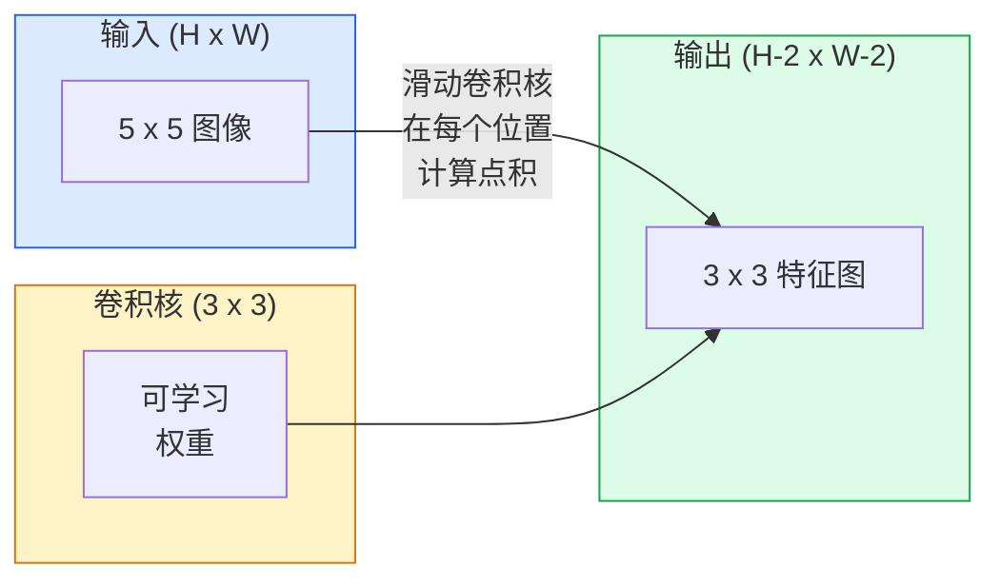
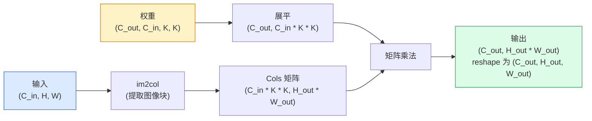

# 从零实现卷积

> 卷积就是一个微小的全连接层，你在图像上滑动它，并在每个位置共享相同的权重。

**类型：** 构建
**语言：** Python
**前置知识：** 阶段 3（深度学习核心），阶段 4 第 01 课（图像基础）
**时间：** ~75 分钟

## 学习目标

- 仅使用 NumPy 从零实现 2D 卷积，包括嵌套循环版本和基于向量化 `im2col` 的版本
- 针对任意输入尺寸、卷积核尺寸、填充和步长的组合计算输出空间尺寸，并推导 `(H - K + 2P) / S + 1` 公式
- 手工设计卷积核（边缘、模糊、锐化、Sobel），并解释为什么每个卷积核会产生相应的激活模式
- 将卷积堆叠成特征提取器，并将堆叠深度与感受野大小联系起来

## 问题背景

一个作用在 224x224 RGB 图像上的全连接层，每个神经元需要 224 * 224 * 3 = 150,528 个输入权重。一个只有 1,000 个单元的隐藏层就已经有 1.5 亿参数——在你学到任何有用的东西之前。更糟的是，这一层没有意识到左上角的狗和右下角的狗是同一个模式。它把每个像素位置都当作独立的，而这对于图像来说是完全错误的：把一只猫平移三个像素，不应该迫使网络重新学习这个概念。

图像模型需要的两个特性是**平移等变性**（输入平移时输出也平移）和**参数共享**（相同的特征检测器在所有位置运行）。全连接层两者都不具备。卷积则同时免费提供了这两者。

卷积并非为深度学习而发明。它是 JPEG 压缩、Photoshop 中的高斯模糊、工业视觉中的边缘检测以及所有已发布的音频滤波器背后的同一操作。CNN 从 2012 年到 2020 年主导 ImageNet 的原因是，卷积对于“相邻值相关且同一模式可能出现在任何位置”的数据来说是正确的先验。

## 核心概念

### 一个卷积核，滑动

2D 卷积取一个称为卷积核（或滤波器）的小权重矩阵，在输入上滑动，并在每个位置计算逐元素乘积之和。这个和就是一个输出像素。



一个具体的 5x5 输入、3x3 卷积核的例子（无填充，步长 1）：

```
输入 X (5 x 5):                卷积核 W (3 x 3):

  1  2  0  1  2                   1  0 -1
  0  1  3  1  0                   2  0 -2
  2  1  0  2  1                   1  0 -1
  1  0  2  1  3
  2  1  1  0  1

卷积核滑过每一个有效的 3 x 3 窗口。输出 Y 是 3 x 3：

 Y[0,0] = sum( W * X[0:3, 0:3] )
 Y[0,1] = sum( W * X[0:3, 1:4] )
 Y[0,2] = sum( W * X[0:3, 2:5] )
 Y[1,0] = sum( W * X[1:4, 0:3] )
 ... 以此类推
```

就这一个公式——**共享权重、局部性、滑动窗口**——就是全部思想。其余都是工程实现细节。

### 输出尺寸公式

给定输入空间尺寸 `H`、卷积核尺寸 `K`、填充 `P`、步长 `S`：

```
H_out = floor( (H - K + 2P) / S ) + 1
```

记住它。你在设计架构时会反复计算这个公式。

| 场景 | H | K | P | S | H_out |
|----------|---|---|---|---|-------|
| Valid 卷积，无填充 | 32 | 3 | 0 | 1 | 30 |
| Same 卷积（保持尺寸） | 32 | 3 | 1 | 1 | 32 |
| 2 倍下采样 | 32 | 3 | 1 | 2 | 16 |
| 2x2 池化 | 32 | 2 | 0 | 2 | 16 |
| 大感受野 | 32 | 7 | 3 | 2 | 16 |

"Same padding" 是指当 `S == 1` 时，选择 `P` 使得 `H_out == H`。对于奇数 `K`，即 `P = (K - 1) / 2`。这就是为什么 3x3 卷积核占主导地位——它们是仍然具有中心的最小奇数卷积核。

### 填充

没有填充时，每次卷积都会缩小特征图。堆叠 20 层后，224x224 的图像会变成 184x184，这会在边界浪费计算，并且使需要匹配形状残差连接变得复杂。

```
对 5 x 5 输入进行零填充 (P = 1)：

  0  0  0  0  0  0  0
  0  1  2  0  1  2  0
  0  0  1  3  1  0  0
  0  2  1  0  2  1  0       现在卷积核可以中心对准像素
  0  1  0  2  1  3  0       (0, 0)，并且仍然有三行和
  0  2  1  1  0  1  0       三列的值可以相乘。
  0  0  0  0  0  0  0
```

实践中常见的模式：`zero`（最常见）、`reflect`（镜像边缘，避免生成模型中的硬边界）、`replicate`（复制边缘）、`circular`（环绕，用于环形问题）。

### 步长

步长是滑动时的步幅。`stride=1` 是默认值。`stride=2` 将空间维度减半，是 CNN 中下采样的经典方式，无需单独的池化层——每个现代架构（ResNet、ConvNeXt、MobileNet）都会在某个地方用步长卷积代替最大池化。

```
5 x 5 输入、3 x 3 卷积核上的步长 1：

  起点: (0,0) (0,1) (0,2)        -> 输出行 0
        (1,0) (1,1) (1,2)        -> 输出行 1
        (2,0) (2,1) (2,2)        -> 输出行 2

  输出: 3 x 3

同一输入上的步长 2：

  起点: (0,0) (0,2)              -> 输出行 0
        (2,0) (2,2)              -> 输出行 1

  输出: 2 x 2
```

### 多个输入通道

真实图像有三个通道。作用在 RGB 输入上的 3x3 卷积实际上是一个 3x3x3 的体积：每个输入通道对应一个 3x3 切片。在每个空间位置，你在所有三个切片上相乘并求和，然后加上偏置。

```
输入:   (C_in,  H,  W)        3 x 5 x 5
卷积核: (C_in,  K,  K)        3 x 3 x 3 (一个卷积核)
输出:   (1,     H', W')       2D 特征图

对于产生 C_out 个输出通道的层，你堆叠 C_out 个卷积核：

权重:   (C_out, C_in, K, K)   例如 64 x 3 x 3 x 3
输出:   (C_out, H', W')       64 x 3 x 3

参数量: C_out * C_in * K * K + C_out   (+ C_out 是偏置)
```

最后一行是你在规划模型时会计算的。一个 64 通道、3x3 的卷积作用在 3 通道输入上，有 `64 * 3 * 3 * 3 + 64 = 1,792` 个参数。很便宜。

### im2col 技巧

嵌套循环容易阅读但很慢。GPU 喜欢大的矩阵乘法。技巧是：将输入的每个感受野窗口展平成大矩阵的一列，将卷积核展平成一行，整个卷积就变成了一次矩阵乘法。



每个生产环境的卷积实现都是这个方法的某种变体，加上缓存分块技巧（直接卷积、Winograd、大卷积核的 FFT 卷积）。理解了 im2col，你就理解了核心。

### 感受野

一个 3x3 卷积看到 9 个输入像素。堆叠两个 3x3 卷积，第二层中的一个神经元看到 5x5 的输入像素。三个 3x3 卷积得到 7x7。一般来说：

```
经过 L 个堆叠的 K x K 卷积（步长 1）后的感受野 = 1 + L * (K - 1)

考虑步长时:   感受野随每层的步长呈乘法增长。
```

"一路 3x3 到底"（VGG、ResNet、ConvNeXt）之所以有效，是因为两个 3x3 卷积看到与一个 5x5 卷积相同的输入区域，但参数更少，并且中间多了一层非线性。

## 动手实现

### 第 1 步：对数组进行填充

从最小的原语开始：一个对 H x W 数组周围进行零填充的函数。

```python
import numpy as np

def pad2d(x, p):
    if p == 0:
        return x
    h, w = x.shape[-2:]
    out = np.zeros(x.shape[:-2] + (h + 2 * p, w + 2 * p), dtype=x.dtype)
    out[..., p:p + h, p:p + w] = x
    return out

x = np.arange(9).reshape(3, 3)
print(x)
print()
print(pad2d(x, 1))
```

`x.shape[:-2]` 这个尾部轴技巧意味着同一个函数可以处理 `(H, W)`、`(C, H, W)` 或 `(N, C, H, W)`，无需修改。

### 第 2 步：用嵌套循环实现 2D 卷积

参考实现——慢，但含义明确。这本质上是 `torch.nn.functional.conv2d` 做的事情。

```python
def conv2d_naive(x, w, b=None, stride=1, padding=0):
    c_in, h, w_in = x.shape
    c_out, c_in_w, kh, kw = w.shape
    assert c_in == c_in_w

    x_pad = pad2d(x, padding)
    h_out = (h + 2 * padding - kh) // stride + 1
    w_out = (w_in + 2 * padding - kw) // stride + 1

    out = np.zeros((c_out, h_out, w_out), dtype=np.float32)
    for oc in range(c_out):
        for i in range(h_out):
            for j in range(w_out):
                hs = i * stride
                ws = j * stride
                patch = x_pad[:, hs:hs + kh, ws:ws + kw]
                out[oc, i, j] = np.sum(patch * w[oc])
        if b is not None:
            out[oc] += b[oc]
    return out
```

四层嵌套循环（输出通道、行、列，加上对 C_in、kh、kw 的隐式求和）。这是你用来检验每一个更快实现的基准真值。

### 第 3 步：用人工设计的卷积核验证

构造一个垂直 Sobel 卷积核，将其应用到一个合成的阶跃图像上，观察垂直边缘如何被点亮。

```python
def synthetic_step_image():
    img = np.zeros((1, 16, 16), dtype=np.float32)
    img[:, :, 8:] = 1.0
    return img

sobel_x = np.array([
    [[-1, 0, 1],
     [-2, 0, 2],
     [-1, 0, 1]]
], dtype=np.float32)[None]

x = synthetic_step_image()
y = conv2d_naive(x, sobel_x, padding=1)
print(y[0].round(1))
```

期望在第 7 列出现较大的正值（从左到右亮度增加），其他地方为零。这一行打印就是你对数学正确性的快速检查。

### 第 4 步：im2col

将输入中的每个卷积核大小窗口转换为矩阵的一列。对于 `C_in=3, K=3`，每一列是 27 个数。

```python
def im2col(x, kh, kw, stride=1, padding=0):
    c_in, h, w = x.shape
    x_pad = pad2d(x, padding)
    h_out = (h + 2 * padding - kh) // stride + 1
    w_out = (w + 2 * padding - kw) // stride + 1

    cols = np.zeros((c_in * kh * kw, h_out * w_out), dtype=x.dtype)
    col = 0
    for i in range(h_out):
        for j in range(w_out):
            hs = i * stride
            ws = j * stride
            patch = x_pad[:, hs:hs + kh, ws:ws + kw]
            cols[:, col] = patch.reshape(-1)
            col += 1
    return cols, h_out, w_out
```

它仍然是 Python 循环，但繁重的计算将是一次向量化矩阵乘法。

### 第 5 步：通过 im2col + 矩阵乘法实现快速卷积

用一次矩阵乘法替换四重循环。

```python
def conv2d_im2col(x, w, b=None, stride=1, padding=0):
    c_out, c_in, kh, kw = w.shape
    cols, h_out, w_out = im2col(x, kh, kw, stride, padding)
    w_flat = w.reshape(c_out, -1)
    out = w_flat @ cols
    if b is not None:
        out += b[:, None]
    return out.reshape(c_out, h_out, w_out)
```

正确性检查：运行两个实现并比较。

```python
rng = np.random.default_rng(0)
x = rng.normal(0, 1, (3, 16, 16)).astype(np.float32)
w = rng.normal(0, 1, (8, 3, 3, 3)).astype(np.float32)
b = rng.normal(0, 1, (8,)).astype(np.float32)

y_naive = conv2d_naive(x, w, b, padding=1)
y_im2col = conv2d_im2col(x, w, b, padding=1)

print(f"max abs diff: {np.max(np.abs(y_naive - y_im2col)):.2e}")
```

`max abs diff` 应该在 `1e-5` 左右——差异来自浮点数累加顺序，不是 bug。

### 第 6 步：一组人工设计的卷积核

五个滤波器，展示单个卷积层在训练前能表达什么。

```python
KERNELS = {
    "identity": np.array([[0, 0, 0], [0, 1, 0], [0, 0, 0]], dtype=np.float32),
    "blur_3x3": np.ones((3, 3), dtype=np.float32) / 9.0,
    "sharpen": np.array([[0, -1, 0], [-1, 5, -1], [0, -1, 0]], dtype=np.float32),
    "sobel_x": np.array([[-1, 0, 1], [-2, 0, 2], [-1, 0, 1]], dtype=np.float32),
    "sobel_y": np.array([[-1, -2, -1], [0, 0, 0], [1, 2, 1]], dtype=np.float32),
}

def apply_kernel(img2d, kernel):
    x = img2d[None].astype(np.float32)
    w = kernel[None, None]
    return conv2d_im2col(x, w, padding=1)[0]
```

应用到任何灰度图像上：模糊会柔化，锐化会增强边缘，Sobel-x 会点亮垂直边缘，Sobel-y 会点亮水平边缘。这些正是 AlexNet 和 VGG 的*第一层*训练卷积层最终学到的模式——因为一个好的图像模型无论后续任务是什么，都需要边缘和 blob 检测器。

## 使用它

PyTorch 的 `nn.Conv2d` 包装了相同的操作，并带有 autograd、CUDA 核和 cuDNN 优化。形状语义完全相同。

```python
import torch
import torch.nn as nn

conv = nn.Conv2d(in_channels=3, out_channels=64, kernel_size=3, stride=1, padding=1)
print(conv)
print(f"weight shape: {tuple(conv.weight.shape)}   # (C_out, C_in, K, K)")
print(f"bias shape:   {tuple(conv.bias.shape)}")
print(f"param count:  {sum(p.numel() for p in conv.parameters())}")

x = torch.randn(8, 3, 224, 224)
y = conv(x)
print(f"\ninput  shape: {tuple(x.shape)}")
print(f"output shape: {tuple(y.shape)}")
```

将 `padding=1` 换成 `padding=0`，输出会降到 222x222。将 `stride=1` 换成 `stride=2`，输出会降到 112x112。和上面你记住的公式一样。

## 交付物

本节课产出：

- `outputs/prompt-cnn-architect.md` —— 一个 prompt，给定输入尺寸、参数预算和目标感受野，设计每一步都具有正确 K/S/P 的 `Conv2d` 层堆叠。
- `outputs/skill-conv-shape-calculator.md` —— 一个 skill，逐层遍历网络规格，返回每个块的输出形状、感受野和参数量。

## 练习题

1. **（简单）** 给定 128x128 的灰度输入和堆叠 `[Conv3x3(s=1,p=1), Conv3x3(s=2,p=1), Conv3x3(s=1,p=1), Conv3x3(s=2,p=1)]`，手算每一层的输出空间尺寸和感受野。用 PyTorch 的 `nn.Sequential` 虚拟卷积验证。
2. **（中等）** 扩展 `conv2d_naive` 和 `conv2d_im2col`，使其接受 `groups` 参数。证明 `groups=C_in=C_out` 可复现深度可分离卷积，并且其参数量为 `C * K * K` 而非 `C * C * K * K`。
3. **（困难）** 手动实现 `conv2d_im2col` 的反向传播：给定输出梯度，计算 `x` 和 `w` 的梯度。用相同输入和权重与 `torch.autograd.grad` 验证。技巧：im2col 的梯度是 `col2im`，并且它需要累加重叠的窗口。

## 关键术语

| 术语 | 人们怎么说 | 实际含义 |
|------|------------|----------|
| 卷积 (Convolution) | "滑动一个滤波器" | 在每个空间位置应用可学习的点积并共享权重；数学上是互相关，但大家都叫它卷积 |
| 卷积核 / 滤波器 (Kernel / filter) | "特征检测器" | 形状为 (C_in, K, K) 的小权重张量，与输入窗口的点积产生一个输出像素 |
| 步长 (Stride) | "跳多远" | 连续卷积核位置之间的步长；stride 2 将每个空间维度减半 |
| 填充 (Padding) | "边缘补零" | 在输入周围添加的额外值，使卷积核能够中心对准边界像素；`same` 填充保持输出尺寸等于输入尺寸 |
| 感受野 (Receptive field) | "神经元看到多少" | 给定输出激活依赖的原始输入区域，随深度和步长增长 |
| im2col | "GEMM 技巧" | 将每个感受窗口重排为列，使卷积变成一次大矩阵乘法——每个快速卷积核的核心 |
| 深度可分离卷积 (Depthwise conv) | "每个通道一个卷积核" | `groups == C_in` 的卷积，每个输出通道只由其对应的输入通道计算；MobileNet 和 ConvNeXt 的骨干 |
| 平移等变性 (Translation equivariance) | "输入平移，输出也平移" | 将输入平移 k 个像素会使输出也平移 k 个像素的性质；由权重共享免费提供 |

## 延伸阅读

- [A guide to convolution arithmetic for deep learning (Dumoulin & Visin, 2016)](https://arxiv.org/abs/1603.07285) —— 填充/步长/扩张率 definitive 图示，每个课程都在悄悄复制
- [CS231n: Convolutional Neural Networks for Visual Recognition](https://cs231n.github.io/convolutional-networks/) —— 经典讲义，包含原始的 im2col 解释
- [The Annotated ConvNet (fast.ai)](https://nbviewer.org/github/fastai/fastbook/blob/master/13_convolutions.ipynb) —— 一个从手动卷积到训练好的数字分类器的 notebook
- [Receptive Field Arithmetic for CNNs (Dang Ha The Hien)](https://distill.pub/2019/computing-receptive-fields/) —— 论文级交互式感受野计算讲解
