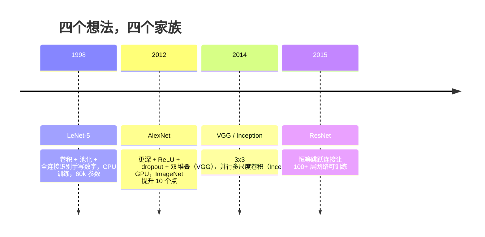
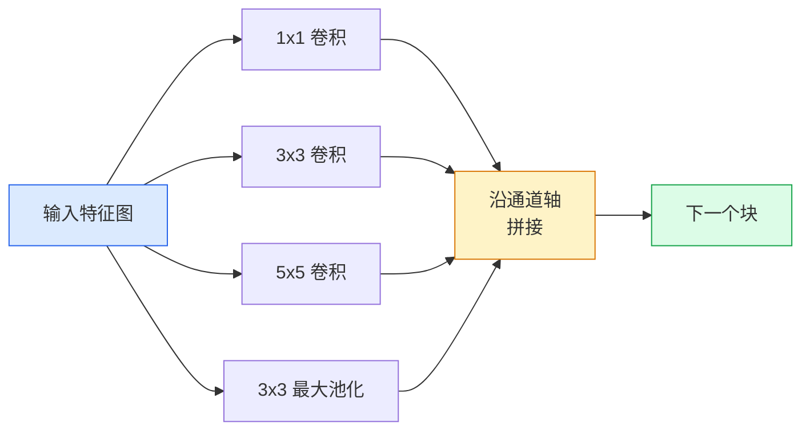
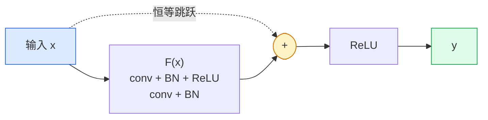

# 卷积神经网络——从 LeNet 到 ResNet

> 过去三十年里，每一代重要 CNN 都是“卷积—非线性—降采样”这一配方再加一个新点子。按顺序学会这些点子。

**类型：** 学习 + 构建
**语言：** Python
**前置知识：** 阶段 3 第 11 课（PyTorch）、阶段 4 第 01 课（图像基础）、阶段 4 第 02 课（从零实现卷积）
**时间：** 约 75 分钟

## 学习目标

- 梳理 LeNet-5 → AlexNet → VGG → Inception → ResNet 的架构谱系，并说出每个家族贡献的单一新想法
- 用 PyTorch 分别实现 LeNet-5、VGG 风格块和 ResNet BasicBlock，每个都控制在 40 行以内
- 解释为什么残差连接能把一个 1000 层的网络从“不可训练”变成“最先进”
- 阅读现代骨干网络（ResNet-18、ResNet-50）的源码前，先预测其输出形状、感受野和参数量

## 问题背景

2011 年，最好的 ImageNet 分类器 top-5 准确率约为 74%。2012 年 AlexNet 达到 85%。2015 年 ResNet 达到 96%。没有新数据，没有新一代 GPU。这些提升来自架构思想。一名能落地的视觉工程师必须知道每个想法来自哪篇论文，因为你在 2026 年部署的每一个生产骨干网络都是这些模块的重新组合——而且这些思想还在不断迁移：分组卷积从 CNN 走到了 Transformer，残差连接从 ResNet 走到了当今每一个大语言模型，批归一化也存在于扩散模型中。

按顺序学习这些网络还能帮你避免一个常见错误：明明用 LeNet 级别的网络就能解决的问题，却去搬最大的现成模型。MNIST 不需要 ResNet。了解每个家族的缩放曲线，才能知道该坐在曲线的哪个位置。

## 核心概念

### 改变视觉领域的四个想法



在传统视觉领域，没有什么比这四步跨越更重要。

### LeNet-5（1998）

Yann LeCun 的数字识别器。60,000 个参数。两个卷积—池化块，两个全连接层，tanh 激活。它定义了每一个 CNN 都继承的模板：

```
input (1, 32, 32)
  conv 5x5 -> (6, 28, 28)
  avg pool 2x2 -> (6, 14, 14)
  conv 5x5 -> (16, 10, 10)
  avg pool 2x2 -> (16, 5, 5)
  flatten -> 400
  dense -> 120
  dense -> 84
  dense -> 10
```

现代世界所说的 CNN——交替卷积与降采样，最后接一个小分类头——本质上就是层数更多、通道更宽、激活更好的 LeNet。

### AlexNet（2012）

三个改动共同打破了 ImageNet 纪录：

1. **ReLU** 替代 tanh。梯度不再消失。训练速度提升约六倍。
2. **Dropout** 用于全连接头。正则化从一个技巧变成了一层。
3. **深度与宽度**。五个卷积层、三个全连接层、6000 万参数，在两个 GPU 上训练，模型被切分到两块卡上。

论文中的图 2 至今仍显示这种双 GPU 并行的两条流。这种并行是硬件层面的权宜之计，而非架构洞见——但上面三点至今仍存在于你使用的每一个模型中。

### VGG（2014）

VGG 的问题是：如果只用 3x3 卷积，并且不断加深，会发生什么？

```
stack:   conv 3x3 -> conv 3x3 -> pool 2x2
repeat:  16 or 19 conv layers
```

两个 3x3 卷积的感受野与单个 5x5 卷积相同，但参数更少（2*9*C^2 = 18C^2 对比 25*C^2），中间还多了一个 ReLU。VGG 把这一观察变成了整套架构。它的简洁——一种块类型，重复堆叠——使其成为此后所有工作的基准参照。

代价：1.38 亿参数，训练慢，推理贵。

### Inception（2014，同年）

Google 对“该用多大卷积核？”的答案是：全都要，并行使用。



每个分支各有所长——1x1 负责通道混合，3x3 负责局部纹理，5x5 负责更大模式，池化负责平移不变特征——拼接后让下一层选择有用的分支。Inception v1 在每个分支内部用 1x1 卷积做瓶颈，以控制参数量。

### 退化问题

到 2015 年，VGG-19 能训练，VGG-32 不行。深度本该带来帮助，但超过约 20 层后，训练 loss 和测试 loss 都开始变差。这不是过拟合，而是优化器找不到有用的权重，因为梯度会逐层乘法衰减。

```
Plain deep network:
  y = f_L( f_{L-1}( ... f_1(x) ... ) )

Gradient wrt early layer:
  dL/dW_1 = dL/dy * df_L/df_{L-1} * ... * df_2/df_1 * df_1/dW_1

Each multiplicative term has magnitude roughly (weight magnitude) * (activation gain).
Stack 100 of them with gains < 1 and the gradient is effectively zero.
```

VGG 在 19 层能工作，是因为同时期发表的批归一化（batch norm）让激活保持合理尺度。但即便有批归一化，超过约 30 层的深度也救不回来。

### ResNet（2015）

He、Zhang、Ren、Sun 四人提出了一个改动，解决了所有问题：

```
standard block:   y = F(x)
residual block:   y = F(x) + x
```

`+ x` 意味着层总可以通过让 `F(x)` 趋近于零来选择“什么都不做”。于是 1000 层的 ResNet 最多也只和 1 层网络一样差，因为每个额外块都有一条 trivial 的逃生通道。有了这个保证，优化器愿意让每个块都*略微*有用——而略微有用堆叠 100 次，就是最先进水平。



两种变体无处不在：

- **BasicBlock**（ResNet-18、ResNet-34）：两个 3x3 卷积，跳跃环绕二者。
- **Bottleneck**（ResNet-50、-101、-152）：1x1 降维、3x3 中间、1x1 升维，跳跃环绕这三个卷积。通道数高时更省计算。

当跳跃需要跨过一个降采样（stride=2）时，恒等路径会被替换为一个 1x1 stride=2 的卷积，以匹配形状。

### 为什么残差思想超越视觉

这个想法其实并不针对图像分类。它是要把深度网络从“祈祷梯度能活下来”变成一种可靠、可扩展的工程工具。你下一阶段要读的每一个 Transformer，每个块里都有完全一样的跳跃连接。没有 ResNet，就没有 GPT。

## 动手构建

### 步骤 1：LeNet-5

一个最小而忠实的 LeNet。Tanh 激活，平均池化。唯一向现代做法妥协的是：下游使用 `nn.CrossEntropyLoss`，而不是原始论文中的高斯连接。

```python
import torch
import torch.nn as nn
import torch.nn.functional as F

class LeNet5(nn.Module):
    def __init__(self, num_classes=10):
        super().__init__()
        self.conv1 = nn.Conv2d(1, 6, kernel_size=5)
        self.conv2 = nn.Conv2d(6, 16, kernel_size=5)
        self.pool = nn.AvgPool2d(2)
        self.fc1 = nn.Linear(16 * 5 * 5, 120)
        self.fc2 = nn.Linear(120, 84)
        self.fc3 = nn.Linear(84, num_classes)

    def forward(self, x):
        x = self.pool(torch.tanh(self.conv1(x)))
        x = self.pool(torch.tanh(self.conv2(x)))
        x = torch.flatten(x, 1)
        x = torch.tanh(self.fc1(x))
        x = torch.tanh(self.fc2(x))
        return self.fc3(x)

net = LeNet5()
x = torch.randn(1, 1, 32, 32)
print(f"output: {net(x).shape}")
print(f"params: {sum(p.numel() for p in net.parameters()):,}")
```

预期输出：`output: torch.Size([1, 10])`、`params: 61,706`。这就是开启现代视觉领域的整个数字分类器。

### 步骤 2：VGG 块

一个可复用块：两个 3x3 卷积、ReLU、批归一化、最大池化。

```python
class VGGBlock(nn.Module):
    def __init__(self, in_c, out_c):
        super().__init__()
        self.conv1 = nn.Conv2d(in_c, out_c, kernel_size=3, padding=1)
        self.bn1 = nn.BatchNorm2d(out_c)
        self.conv2 = nn.Conv2d(out_c, out_c, kernel_size=3, padding=1)
        self.bn2 = nn.BatchNorm2d(out_c)
        self.pool = nn.MaxPool2d(2)

    def forward(self, x):
        x = F.relu(self.bn1(self.conv1(x)))
        x = F.relu(self.bn2(self.conv2(x)))
        return self.pool(x)

class MiniVGG(nn.Module):
    def __init__(self, num_classes=10):
        super().__init__()
        self.stack = nn.Sequential(
            VGGBlock(3, 32),
            VGGBlock(32, 64),
            VGGBlock(64, 128),
        )
        self.head = nn.Sequential(
            nn.AdaptiveAvgPool2d(1),
            nn.Flatten(),
            nn.Linear(128, num_classes),
        )

    def forward(self, x):
        return self.head(self.stack(x))

net = MiniVGG()
x = torch.randn(1, 3, 32, 32)
print(f"output: {net(x).shape}")
print(f"params: {sum(p.numel() for p in net.parameters()):,}")
```

三个 VGG 块作用于 CIFAR 尺寸输入，接一个自适应池化和一个线性层。约 29 万参数。对 CIFAR-10 已经足够。

### 步骤 3：ResNet BasicBlock

ResNet-18 和 ResNet-34 的核心构建块。

```python
class BasicBlock(nn.Module):
    def __init__(self, in_c, out_c, stride=1):
        super().__init__()
        self.conv1 = nn.Conv2d(in_c, out_c, kernel_size=3, stride=stride, padding=1, bias=False)
        self.bn1 = nn.BatchNorm2d(out_c)
        self.conv2 = nn.Conv2d(out_c, out_c, kernel_size=3, stride=1, padding=1, bias=False)
        self.bn2 = nn.BatchNorm2d(out_c)
        if stride != 1 or in_c != out_c:
            self.shortcut = nn.Sequential(
                nn.Conv2d(in_c, out_c, kernel_size=1, stride=stride, bias=False),
                nn.BatchNorm2d(out_c),
            )
        else:
            self.shortcut = nn.Identity()

    def forward(self, x):
        out = F.relu(self.bn1(self.conv1(x)))
        out = self.bn2(self.conv2(out))
        out = out + self.shortcut(x)
        return F.relu(out)
```

卷积层设置 `bias=False` 是配合批归一化的惯例——BN 的 beta 参数已经承担了偏置，再保留卷积偏置是浪费。`shortcut` 只在 stride 或通道数变化时才需要真正的卷积；否则就是无操作的恒等映射。

### 步骤 4：一个微型 ResNet

堆叠四组 BasicBlock，得到一个适用于 CIFAR 尺寸输入的 ResNet。

```python
class TinyResNet(nn.Module):
    def __init__(self, num_classes=10):
        super().__init__()
        self.stem = nn.Sequential(
            nn.Conv2d(3, 32, kernel_size=3, stride=1, padding=1, bias=False),
            nn.BatchNorm2d(32),
            nn.ReLU(inplace=True),
        )
        self.layer1 = self._make_group(32, 32, num_blocks=2, stride=1)
        self.layer2 = self._make_group(32, 64, num_blocks=2, stride=2)
        self.layer3 = self._make_group(64, 128, num_blocks=2, stride=2)
        self.layer4 = self._make_group(128, 256, num_blocks=2, stride=2)
        self.head = nn.Sequential(
            nn.AdaptiveAvgPool2d(1),
            nn.Flatten(),
            nn.Linear(256, num_classes),
        )

    def _make_group(self, in_c, out_c, num_blocks, stride):
        blocks = [BasicBlock(in_c, out_c, stride=stride)]
        for _ in range(num_blocks - 1):
            blocks.append(BasicBlock(out_c, out_c, stride=1))
        return nn.Sequential(*blocks)

    def forward(self, x):
        x = self.stem(x)
        x = self.layer1(x)
        x = self.layer2(x)
        x = self.layer3(x)
        x = self.layer4(x)
        return self.head(x)

net = TinyResNet()
x = torch.randn(1, 3, 32, 32)
print(f"output: {net(x).shape}")
print(f"params: {sum(p.numel() for p in net.parameters()):,}")
```

四组，每组两个块。第 2、3、4 组开头 stride=2。每次下采样通道数翻倍。约 280 万参数。这就是能干净地放大到 ResNet-152 的标准配方。

### 步骤 5：比较参数—特征效率

用相同输入跑三个网络，比较参数量。

```python
def summary(name, net, x):
    y = net(x)
    params = sum(p.numel() for p in net.parameters())
    print(f"{name:12s}  input {tuple(x.shape)} -> output {tuple(y.shape)}  params {params:>10,}")

x = torch.randn(1, 3, 32, 32)
summary("LeNet5",     LeNet5(),       torch.randn(1, 1, 32, 32))
summary("MiniVGG",    MiniVGG(),      x)
summary("TinyResNet", TinyResNet(),   x)
```

三个模型，三个时代，三个数量级的参数量。对于 CIFAR-10 准确率，大致需要：LeNet 60%、MiniVGG 89%、TinyResNet 93%，均只需训练几个 epoch。

## 使用现成模型

`torchvision.models` 提供了上述所有模型的预训练版本。各家族的调用签名一致，这正是骨干网络抽象的意义。

```python
from torchvision.models import resnet18, ResNet18_Weights, vgg16, VGG16_Weights

r18 = resnet18(weights=ResNet18_Weights.IMAGENET1K_V1)
r18.eval()

print(f"ResNet-18 params: {sum(p.numel() for p in r18.parameters()):,}")
print(r18.layer1[0])
print()

v16 = vgg16(weights=VGG16_Weights.IMAGENET1K_V1)
v16.eval()
print(f"VGG-16   params: {sum(p.numel() for p in v16.parameters()):,}")
```

ResNet-18 有 1170 万参数。VGG-16 有 1.38 亿参数。ImageNet top-1 准确率相近（69.8% 对比 71.6%）。残差连接带来了约 12 倍的参数效率优势。这就是 ResNet 变体从 2016 年统治到 2021 年 ViT 出现的原因——在计算受限的真实部署中，ResNet 仍占主导。

迁移学习的配方永远相同：加载预训练权重，冻结骨干，替换分类头。

```python
for p in r18.parameters():
    p.requires_grad = False
r18.fc = nn.Linear(r18.fc.in_features, 10)
```

三行代码。你现在就拥有了一个 10 类 CIFAR 分类器，它继承了 ImageNet 已经付过费的表征。

## 交付物

本课产出：

- `outputs/prompt-backbone-selector.md`——一个根据任务、数据规模和计算预算选择合适 CNN 家族（LeNet/VGG/ResNet/MobileNet/ConvNeXt）的提示词。
- `outputs/skill-residual-block-reviewer.md`——一个读取 PyTorch 模块并标记跳跃连接错误（stride 变化时缺少 shortcut、shortcut 激活顺序、BN 相对于加法的放置位置）的技能。

## 练习

1. **（简单）** 手工逐层计算 `TinyResNet` 的参数量，并与 `sum(p.numel() for p in net.parameters())` 对比。参数预算主要花在哪里——卷积、BN，还是分类头？
2. **（中等）** 实现 Bottleneck 块（1x1 → 3x3 → 1x1 带跳跃），并用它构建一个 ResNet-50 风格的 CIFAR 网络。与 `TinyResNet` 对比参数量。
3. **（困难）** 去掉 `BasicBlock` 的跳跃连接，分别用 34 块“普通”网络和 34 块 ResNet 在 CIFAR-10 上训练 10 个 epoch，绘制训练 loss 随 epoch 变化的曲线。复现 He 等人论文图 1 的结果：更深的普通网络收敛到比浅网络更高的 loss。

## 关键术语

| 术语 | 人们常说 | 实际含义 |
|------|----------|----------|
| Backbone（骨干网络） | “模型” | 产生供任务头使用的特征图的卷积块堆叠 |
| Residual connection（残差连接） | “跳跃连接” | `y = F(x) + x`；让优化器通过把 F 学到零来学习恒等映射，使任意深度可训练 |
| BasicBlock | “两个 3x3 卷积加跳跃” | ResNet-18/34 的构建块：conv-BN-ReLU-conv-BN-add-ReLU |
| Bottleneck（瓶颈块） | “1x1 降维、3x3、1x1 升维” | ResNet-50/101/152 的块；通道数高时更省，因为 3x3 在降维后的宽度上运行 |
| Degradation problem（退化问题） | “越深越差” | 超过约 20 层普通卷积后，训练误差和测试误差都上升；由残差连接解决，而非更多数据 |
| Stem（输入干） | “第一层” | 把 3 通道输入转成基础特征宽度的初始卷积；ImageNet 通常为 7x7 stride 2，CIFAR 通常为 3x3 stride 1 |
| Head（分类头） | “分类器” | 最终骨干块之后的层：自适应池化、展平、线性层 |
| Transfer learning（迁移学习） | “预训练权重” | 加载在 ImageNet 上训练好的骨干，只在自己的任务上微调分类头 |

## 延伸阅读

- [Deep Residual Learning for Image Recognition (He et al., 2015)](https://arxiv.org/abs/1512.03385)——ResNet 论文；每一张图都值得仔细研究
- [Very Deep Convolutional Networks (Simonyan & Zisserman, 2014)](https://arxiv.org/abs/1409.1556)——VGG 论文；仍是理解“为什么用 3x3”的最佳参考
- [ImageNet Classification with Deep CNNs (Krizhevsky et al., 2012)](https://papers.nips.cc/paper_files/paper/2012/hash/c399862d3b9d6b76c8436e924a68c45b-Abstract.html)——AlexNet；终结手工特征时代的论文
- [Going Deeper with Convolutions (Szegedy et al., 2014)](https://arxiv.org/abs/1409.4842)——Inception v1；并行滤波思想至今仍出现在视觉 Transformer 中
