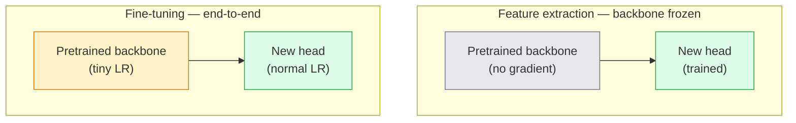

# 迁移学习与微调

> 别人已经花了上百万 GPU 小时教会网络什么是边缘、纹理和物体部件。在从头训练之前，你应该先借用这些特征。

**类型：** Build
**语言：** Python
**前置知识：** Phase 4 Lesson 03（CNN）、Phase 4 Lesson 04（图像分类）
**时间：** ~75 分钟

## 学习目标

- 区分特征提取与微调，并根据数据集大小、领域距离和计算预算选择合适方案
- 加载预训练骨干网络，替换其分类头，仅用不到 20 行代码训练分类头达到可用基线
- 使用判别式学习率逐层解冻，使早期通用特征比晚期任务相关特征获得更小的更新
- 诊断三种常见失败：解冻层学习率过高导致的特征漂移、小数据集上 BN 统计量崩溃，以及灾难性遗忘

## 问题背景

在 ImageNet 上训练一个 ResNet-50 大约需要 2,000 GPU 小时。很少有团队能为每个上线的任务都投入这样的预算。几乎所有团队实际交付的，都是一个预训练骨干网络加上一个新分类头，用几百到几千张任务相关图像训练而成。

这并不是捷径。任何一个在 ImageNet 上训练过的 CNN，其第一个卷积块学到的是边缘和类 Gabor 滤波器；接下来的几个块学到纹理和简单图案；中间块学到物体部件；最后几个块学到接近 1,000 个 ImageNet 类别的组合。这个层级的前 90% 几乎可以原封不动地迁移到医学影像、工业检测、卫星数据等几乎所有视觉任务——因为自然图像的边缘和纹理词汇是有限的。最后 10% 才是你真正需要训练的。

但要把迁移学习做好，有三个坑在等着你：用过高的学习率破坏预训练特征、冻结过多层导致模型信息不足、以及让 BatchNorm 的滑动统计量漂移到一个小数据集上——而网络其他部分并没有从这个数据集学习。本课会刻意逐一走过这些问题。

## 核心概念

### 特征提取 vs 微调

两种模式，取决于你对预训练特征的信任程度以及你拥有的数据量。



经验法则：

| 数据集大小 | 领域距离 | 方案 |
|-----------|---------|------|
| < 1k 张 | 接近 ImageNet | 冻结骨干，只训练分类头 |
| 1k-10k | 接近 | 冻结前 2-3 个 stage，微调其余部分 |
| 10k-100k | 任意 | 端到端微调，使用判别式学习率 |
| 100k+ | 较远 | 全部微调；若领域差异极大，可考虑从头训练 |

“接近 ImageNet”大致指自然 RGB 照片且内容类似物体。医学 CT、卫星遥感图像和显微镜图像属于远领域——这些特征仍有帮助，但你需要让更多层适应新领域。

### 为什么冻结也能有效

CNN 在 ImageNet 上学到的特征并不是专门面向 1,000 个类别的。它们专门面向自然图像的统计规律：特定方向的边缘、纹理、对比度模式、形状基元。这些统计规律在人类能命名的几乎所有视觉领域中都保持稳定。因此，一个在 ImageNet 上训练的模型，仅在 CIFAR-10 上接一个新的线性头而不微调骨干，就能达到 80% 以上的准确率。分类头只是在学习如何为当前任务加权这些已经学到的特征。

### 判别式学习率

当你解冻时，早期层应该比晚期层训练得更慢。早期层编码的是希望保留的通用特征；晚期层编码的是任务相关结构，需要大幅调整。

```
典型配方：

  stage 0（stem + 第一组）: lr = base_lr / 100    （基本固定）
  stage 1:                       lr = base_lr / 10
  stage 2:                       lr = base_lr / 3
  stage 3（骨干最后一组）:        lr = base_lr
  head:                          lr = base_lr  （或略高）
```

在 PyTorch 中，这只是传给优化器的一组参数分组。一个模型、五种学习率、零额外代码。

### BatchNorm 问题

BN 层保存了在 ImageNet 上计算的 `running_mean` 和 `running_var` 缓冲区。如果你的任务像素分布不同——光照不同、传感器不同、色彩空间不同——这些缓冲区就是错的。按优先顺序有三种选择：

1. **训练模式下微调 BN。** 让 BN 随其他参数一起更新滑动统计量。当任务数据集中等规模（>= 5k 样本）时的默认选择。
2. **评估模式下冻结 BN。** 保留 ImageNet 统计量，只训练权重。当数据集小到 BN 滑动平均会不稳定时的正确选择。
3. **将 BN 替换为 GroupNorm。** 彻底消除滑动平均问题。用于检测和分割骨干中每张 GPU 批量极小的情况。

搞错这一点会在不知不觉中让准确率下降 5-15%。

### 分类头设计

分类头通常是 1-3 层线性层，可选加 Dropout。每个 torchvision 骨干都附带默认分类头，你需要替换它：

```
backbone.fc = nn.Linear(backbone.fc.in_features, num_classes)          # ResNet
backbone.classifier[1] = nn.Linear(..., num_classes)                    # EfficientNet, MobileNet
backbone.heads.head = nn.Linear(..., num_classes)                       # torchvision ViT
```

对于小数据集，通常一个线性层就够了。当任务分布离骨干训练分布较远时，增加一个隐藏层（Linear -> ReLU -> Dropout -> Linear）会有帮助。

### 逐层学习率衰减

判别式学习率的一种更平滑版本，常用于现代微调方法（BEiT、DINOv2、ViT-B 微调）。不再把层分组为 stage，而是让每一层的学习率都比上一层稍小：

```
lr_layer_k = base_lr * decay^(L - k)
```

当 decay = 0.75 且 L = 12 个 transformer block 时，第一个 block 的学习率约为 head 学习率的 `0.75^11 ≈ 0.04` 倍。这一点对 transformer 微调比 CNN 更重要，CNN 通常按 stage 分组学习率就足够了。

### 评估指标

迁移学习实验需要额外跟踪两个从头训练时不会关注的数字：

- **仅预训练准确率** —— 骨干冻结时分类头的准确率。这是你的下限。
- **微调后准确率** —— 端到端训练后的同一模型准确率。这是你的上限。

如果微调后准确率低于仅预训练准确率，说明存在学习率或 BN 的 bug。务必同时打印两者。

## 动手实现

### 步骤 1：加载预训练骨干并检查结构

```python
import torch
import torch.nn as nn
from torchvision.models import resnet18, ResNet18_Weights

backbone = resnet18(weights=ResNet18_Weights.IMAGENET1K_V1)
print(backbone)
print()
print("classifier head:", backbone.fc)
print("feature dim:", backbone.fc.in_features)
```

`ResNet18` 包含四个 stage（`layer1..layer4`）、一个 stem 和一个 `fc` 分类头。每个 torchvision 分类骨干都有类似的结构。

### 步骤 2：特征提取 —— 全部冻结，替换分类头

```python
def make_feature_extractor(num_classes=10):
    model = resnet18(weights=ResNet18_Weights.IMAGENET1K_V1)
    for p in model.parameters():
        p.requires_grad = False
    model.fc = nn.Linear(model.fc.in_features, num_classes)
    return model

model = make_feature_extractor(num_classes=10)
trainable = sum(p.numel() for p in model.parameters() if p.requires_grad)
frozen = sum(p.numel() for p in model.parameters() if not p.requires_grad)
print(f"trainable: {trainable:>10,}")
print(f"frozen:    {frozen:>10,}")
```

只有 `model.fc` 可训练。骨干网络是一个冻结的特征提取器。

### 步骤 3：判别式微调

一个工具函数，用于构建按 stage 分组、具有不同学习率的参数组。

```python
def discriminative_param_groups(model, base_lr=1e-3, decay=0.3):
    stages = [
        ["conv1", "bn1"],
        ["layer1"],
        ["layer2"],
        ["layer3"],
        ["layer4"],
        ["fc"],
    ]
    groups = []
    for i, names in enumerate(stages):
        lr = base_lr * (decay ** (len(stages) - 1 - i))
        params = [p for n, p in model.named_parameters()
                  if any(n.startswith(k) for k in names)]
        if params:
            groups.append({"params": params, "lr": lr, "name": "_".join(names)})
    return groups

model = resnet18(weights=ResNet18_Weights.IMAGENET1K_V1)
model.fc = nn.Linear(model.fc.in_features, 10)
for p in model.parameters():
    p.requires_grad = True

groups = discriminative_param_groups(model)
for g in groups:
    print(f"{g['name']:>10s}  lr={g['lr']:.2e}  params={sum(p.numel() for p in g['params']):>8,}")
```

`decay=0.3` 表示每个 stage 的学习率是下一个 stage 的 30%。`fc` 得到 `base_lr`，`layer4` 得到 `0.3 * base_lr`，`conv1` 得到 `0.3^5 * base_lr ≈ 0.00243 * base_lr`。听起来很极端；但经验上有效。

### 步骤 4：BatchNorm 处理

一个辅助函数，用于冻结 BN 滑动统计量但不冻结其权重。

```python
def freeze_bn_stats(model):
    for m in model.modules():
        if isinstance(m, (nn.BatchNorm1d, nn.BatchNorm2d, nn.BatchNorm3d)):
            m.eval()
            for p in m.parameters():
                p.requires_grad = False
    return model
```

在每个 epoch 开始时，先调用 `model.train()`，再调用此函数。`model.train()` 会把所有模块切到训练模式；此函数仅对 BN 层恢复为评估模式。

### 步骤 5：最简端到端微调循环

```python
from torch.optim import SGD
from torch.utils.data import DataLoader
from torch.optim.lr_scheduler import CosineAnnealingLR
import torch.nn.functional as F

def fine_tune(model, train_loader, val_loader, device, epochs=5, base_lr=1e-3, freeze_bn=False):
    model = model.to(device)
    groups = discriminative_param_groups(model, base_lr=base_lr)
    optimizer = SGD(groups, momentum=0.9, weight_decay=1e-4, nesterov=True)
    scheduler = CosineAnnealingLR(optimizer, T_max=epochs)

    for epoch in range(epochs):
        model.train()
        if freeze_bn:
            freeze_bn_stats(model)
        tr_loss, tr_correct, tr_total = 0.0, 0, 0
        for x, y in train_loader:
            x, y = x.to(device), y.to(device)
            logits = model(x)
            loss = F.cross_entropy(logits, y, label_smoothing=0.1)
            optimizer.zero_grad()
            loss.backward()
            optimizer.step()
            tr_loss += loss.item() * x.size(0)
            tr_total += x.size(0)
            tr_correct += (logits.argmax(-1) == y).sum().item()
        scheduler.step()

        model.eval()
        va_total, va_correct = 0, 0
        with torch.no_grad():
            for x, y in val_loader:
                x, y = x.to(device), y.to(device)
                pred = model(x).argmax(-1)
                va_total += x.size(0)
                va_correct += (pred == y).sum().item()
        print(f"epoch {epoch}  train {tr_loss/tr_total:.3f}/{tr_correct/tr_total:.3f}  "
              f"val {va_correct/va_total:.3f}")
    return model
```

用上述配方在 CIFAR-10 上训练 5 个 epoch，`ResNet18-IMAGENET1K_V1` 的准确率可以从约 70% 的零样本线性探测准确率提升到约 93% 的微调准确率。如果只训练分类头而不接触骨干，准确率会停留在约 86%。

### 步骤 6：渐进式解冻

一种从网络末端向首端每个 epoch 解冻一个 stage 的计划表。以更多 epoch 为代价，缓解特征漂移。

```python
def progressive_unfreeze_schedule(model):
    stages = ["layer4", "layer3", "layer2", "layer1"]
    yielded = set()

    def start():
        for p in model.parameters():
            p.requires_grad = False
        for p in model.fc.parameters():
            p.requires_grad = True

    def unfreeze(epoch):
        if epoch < len(stages):
            name = stages[epoch]
            yielded.add(name)
            for n, p in model.named_parameters():
                if n.startswith(name):
                    p.requires_grad = True
            return name
        return None

    return start, unfreeze
```

在第一个 epoch 前调用 `start()` 一次。在每个 epoch 开始时调用 `unfreeze(epoch)`。每当可训练参数集合发生变化时，都要重建优化器，否则冻结参数仍保留着缓存的动量，会干扰优化。

## 实际使用

对于大多数真实任务，`torchvision.models` 加上三行代码就够了。上面更复杂的机制只在库默认值无法解决的问题出现时才重要。

```python
from torchvision.models import resnet50, ResNet50_Weights

model = resnet50(weights=ResNet50_Weights.IMAGENET1K_V2)
model.fc = nn.Linear(model.fc.in_features, num_classes)
optimizer = torch.optim.AdamW(model.parameters(), lr=1e-4, weight_decay=1e-4)
```

另外两个生产级默认选择：

- `timm` 提供约 800 个预训练视觉骨干，API 一致（`timm.create_model("resnet50", pretrained=True, num_classes=10)`）。对于超出 torchvision 模型库的微调任务，它是行业标准。
- 对于 transformer，使用 `transformers.AutoModelForImageClassification.from_pretrained(name, num_labels=N)`，可以获得与文本模型相同加载语义的 ViT / BEiT / DeiT。

## 交付物

本课产出：

- `outputs/prompt-fine-tune-planner.md` —— 一个根据数据集大小、领域距离和计算预算选择特征提取、渐进式微调还是端到端微调的提示词
- `outputs/skill-freeze-inspector.md` —— 一个技能，给定 PyTorch 模型后报告哪些参数可训练、哪些 BatchNorm 层处于评估模式、以及优化器是否真的接收到了可训练参数

## 练习

1. **（简单）** 在同一个 synthetic-CIFAR 数据集上，分别将 `ResNet18` 作为线性探测（骨干冻结）和完全微调训练。并排报告两者准确率。解释哪个差距说明特征迁移效果好，哪个说明不好。
2. **（中等）** 故意引入一个 bug：在骨干 stage 上设置 `base_lr = 1e-1` 而不是在分类头上。展示训练损失如何爆炸，然后通过应用 `discriminative_param_groups` 辅助函数恢复。记录每个 stage 开始发散时的学习率。
3. **（困难）** 取一个医学影像数据集（例如 CheXpert-small、PatchCamelyon 或 HAM10000），比较三种方案：(a) ImageNet 预训练冻结骨干 + 线性头；(b) ImageNet 预训练端到端微调；(c) 从头训练。报告每种方案的准确率和计算成本。数据集达到多大时，从头训练变得有竞争力？

## 关键术语

| 术语 | 人们的说法 | 实际含义 |
|------|-----------|---------|
| Feature extraction | "Freeze and train head" | 骨干参数冻结，只有新的分类头接收梯度 |
| Fine-tuning | "Retrain end-to-end" | 所有参数都可训练，通常学习率远小于从头训练 |
| Discriminative LR | "Smaller LR for early layers" | 优化器参数分组，早期 stage 的学习率是晚期 stage 的一部分 |
| Layer-wise LR decay | "Smooth LR gradient" | 每层学习率乘以 decay^(L - k)；常见于 transformer 微调 |
| Catastrophic forgetting | "The model lost ImageNet" | 学习率过高，在新任务信号还没学到之前就覆盖了预训练特征 |
| BN statistics drift | "Running mean is wrong" | BatchNorm 的 running_mean/var 是在与当前任务不同的分布上计算的，悄悄损害准确率 |
| Linear probe | "Frozen backbone + linear head" | 对预训练特征的评估——在冻结表示之上最佳线性分类器的准确率 |
| Catastrophic collapse | "Everything predicts one class" | 微调学习率过高，在分类头梯度能够稳定之前就破坏了特征，导致所有样本预测为同一类 |

## 延伸阅读

- [How transferable are features in deep neural networks? (Yosinski et al., 2014)](https://arxiv.org/abs/1411.1792) —— 首次量化跨层特征可迁移性的论文
- [Universal Language Model Fine-tuning (ULMFiT, Howard & Ruder, 2018)](https://arxiv.org/abs/1801.06146) —— 原创的判别式学习率 / 渐进式解冻配方；思想可直接迁移到视觉领域
- [timm documentation](https://huggingface.co/docs/timm) —— 现代视觉骨干的参考文档，以及它们训练时使用的精确微调默认值
- [A Simple Framework for Linear-Probe Evaluation (Kornblith et al., 2019)](https://arxiv.org/abs/1805.08974) —— 解释为什么线性探测准确率重要以及如何正确报告
