# 目标检测——从零实现 YOLO

> 检测就是分类加回归，在特征图的每个位置都运行一次，然后用非极大值抑制进行清理。

**类型：** Build
**语言：** Python
**前置要求：** Phase 4 Lesson 03（CNN）、Phase 4 Lesson 04（图像分类）、Phase 4 Lesson 05（迁移学习）
**时长：** 约 75 分钟

## 学习目标

- 解释将检测转化为密集预测任务的网格-锚点设计，并说明输出张量中每个数字的含义
- 计算框之间的交并比（IoU），并从零实现非极大值抑制
- 在预训练骨干网络之上构建一个最简的 YOLO 风格检测头，包括分类、目标度和框回归损失
- 读懂检测指标行（precision@0.5、recall、mAP@0.5、mAP@0.5:0.95），并决定下一步该调哪个旋钮

## 问题背景

分类会说“这张图是一只狗。”检测则会说“在像素 (112, 40, 280, 210) 处有一只狗，在 (400, 180, 560, 310) 处有一只猫，画面中其他位置没有东西。”这一结构性变化——从每张图一个标签变为预测可变数量的带标签边界框——正是每一个自动驾驶系统、每一款安防产品、每一个文档版式解析器和每一条工厂视觉产线所依赖的核心。

检测也是视觉领域中所有工程取舍同时涌现的地方。你需要框足够精准（回归头）、每个框的类别正确（分类头）、模型知道何时没有目标可检（目标度分数），并且每个真实目标只产生一个预测（非极大值抑制）。遗漏其中任何一项，整个流水线就会要么漏检、要么报告幻觉框，要么把同一个目标在稍有偏移的位置预测十五次。

YOLO（You Only Look Once，Redmon 等，2016）通过单次卷积网络前向传播完成上述所有步骤，首次让这一切实时运行；而相同的结构设计至今仍是现代检测器（YOLOv8、YOLOv9、YOLO-NAS、RT-DETR）的骨架。掌握了核心，所有变体都只是同一组模块的重新排列。

## 核心概念

### 将检测视为密集预测

分类器每张图像输出 C 个数字。YOLO 风格的检测器每张图像输出 `(S x S x (5 + C))` 个数字，其中 S 是空间网格尺寸。

```mermaid
flowchart LR
    IMG["Input 416x416 RGB"] --> BB["Backbone<br/>(ResNet, DarkNet, ...)"]
    BB --> FM["Feature map<br/>(C_feat, 13, 13)"]
    FM --> HEAD["Detection head<br/>(1x1 convs)"]
    HEAD --> OUT["Output tensor<br/>(13, 13, B * (5 + C))"]
    OUT --> DEC["Decode<br/>(grid + sigmoid + exp)"]
    DEC --> NMS["Non-max suppression"]
    NMS --> RESULT["Final boxes"]

    style IMG fill:#dbeafe,stroke:#2563eb
    style HEAD fill:#fef3c7,stroke:#d97706
    style NMS fill:#fecaca,stroke:#dc2626
    style RESULT fill:#dcfce7,stroke:#16a34a
```



每个 `S * S` 网格单元预测 `B` 个框。对每个框而言：

- 4 个数字描述几何信息：`tx, ty, tw, th`。
- 1 个数字是目标度分数：“是否有物体的中心落在这个单元里？”
- C 个数字是类别概率。

每个单元的总数为：`B * (5 + C)`。对于 VOC 数据集，若 `S=13, B=2, C=20`，则每个单元输出 50 个数字。

### 为什么要用网格和锚点

直接回归会为每个目标预测绝对坐标的 `(x, y, w, h)`。这对卷积网络来说很困难，因为平移图像不应该让所有预测都平移相同的量——每个目标都有空间上的归属。网格机制解决了这一点：将每个真实框的中心所在网格单元指定为负责该目标的单元；只有该单元对这个目标负责。

锚点解决第二个问题。一个 3x3 卷积很难从感受野只有 16 像素的特征单元回归出宽 500 像素的框。因此，我们为每个单元预先定义 `B` 个先验框形状（锚点），并预测每个锚点的小幅度偏移。模型学会选择合适的锚点并微调它，而不是从无到有地回归。

```
Anchor box priors (example for 416x416 input):

  small:   (30,  60)
  medium:  (75,  170)
  large:   (200, 380)

At each grid cell, every anchor emits (tx, ty, tw, th, obj, c_1, ..., c_C).
```

现代检测器通常会结合 FPN，在不同分辨率上使用不同的锚点集合——小锚点用于浅层高分辨率特征图，大锚点用于深层低分辨率特征图。思想相同，只是尺度更多。

### 解码预测值

原始的 `tx, ty, tw, th` 并不是框坐标；它们是回归目标，需要在绘制前进行变换：

```
centre x  = (sigmoid(tx) + cell_x) * stride
centre y  = (sigmoid(ty) + cell_y) * stride
width     = anchor_w * exp(tw)
height    = anchor_h * exp(th)
```

`sigmoid` 将中心偏移限制在单元内部。`exp` 让宽度从锚点自由缩放而不会出现符号翻转。`stride` 将网格坐标还原为像素坐标。自 YOLOv2 以来，这一解码步骤在每个 YOLO 版本中都是相同的。

### IoU

检测领域中衡量两个框相似度的通用指标：

```
IoU(A, B) = area(A intersect B) / area(A union B)
```

IoU = 1 表示完全重合；IoU = 0 表示没有重叠。预测框与真实框之间的 IoU 决定了该预测是否算作真正例（通常 IoU >= 0.5）。两个预测框之间的 IoU 则是 NMS 用来去重的依据。

### 非极大值抑制

在相邻锚点上训练的卷积网络经常会对同一个目标预测出重叠的框。NMS 保留置信度最高的预测，并删除任何与该预测 IoU 超过阈值的其它预测。

```
NMS(boxes, scores, iou_threshold):
    sort boxes by score descending
    keep = []
    while boxes not empty:
        pick the top-scoring box, add to keep
        remove every box with IoU > iou_threshold to the picked box
    return keep
```

典型阈值：目标检测中常用 0.45。最近的检测器会用 `soft-NMS`、`DIoU-NMS` 或直接学习抑制过程（RT-DETR），但结构上的目的都是一样的。

### 损失函数

YOLO 的损失是三项损失的加权和：

```
L = lambda_coord * L_box(pred, target, where obj=1)
  + lambda_obj   * L_obj(pred, 1,     where obj=1)
  + lambda_noobj * L_obj(pred, 0,     where obj=0)
  + lambda_cls   * L_cls(pred, target, where obj=1)
```

只有包含目标的单元才对框回归损失和分类损失有贡献。没有目标的单元只对目标度损失有贡献（教会模型保持沉默）。`lambda_noobj` 通常较小（约 0.5），因为绝大多数单元都是空的，否则它们会主导总损失。

现代变体将 MSE 框损失替换为 CIoU / DIoU（直接优化 IoU），对类别不平衡使用 focal loss，并用 quality focal loss 平衡目标度。但三模块结构始终未变。

### 检测指标

准确率不适用于检测。以下四个指标才适用：

- **Precision@IoU=0.5**——在被计为正的预测中，有多少是真正正确的。
- **Recall@IoU=0.5**——在所有真实目标中，有多少被找到了。
- **AP@0.5**——在 IoU 阈值 0.5 下的精确率-召回率曲线下面积；每个类别一个数值。
- **mAP@0.5:0.95**——在 IoU 阈值 0.5、0.55、…、0.95 上 AP 的平均值。COCO 标准指标；最严格也最具信息量。

四个都要报告。一个在 mAP@0.5 上很强但 mAP@0.5:0.95 上很弱的检测器，说明大致定位到了但框不够紧；应改进框回归损失。一个精确率高但召回率低的检测器则过于保守；应降低置信度阈值或增加目标度权重。

## 动手实现

### 第 1 步：IoU

这是整节课的劳模函数。接收两组 `(x1, y1, x2, y2)` 格式的框数组。

```python
import numpy as np

def box_iou(boxes_a, boxes_b):
    ax1, ay1, ax2, ay2 = boxes_a[:, 0], boxes_a[:, 1], boxes_a[:, 2], boxes_a[:, 3]
    bx1, by1, bx2, by2 = boxes_b[:, 0], boxes_b[:, 1], boxes_b[:, 2], boxes_b[:, 3]

    inter_x1 = np.maximum(ax1[:, None], bx1[None, :])
    inter_y1 = np.maximum(ay1[:, None], by1[None, :])
    inter_x2 = np.minimum(ax2[:, None], bx2[None, :])
    inter_y2 = np.minimum(ay2[:, None], by2[None, :])

    inter_w = np.clip(inter_x2 - inter_x1, 0, None)
    inter_h = np.clip(inter_y2 - inter_y1, 0, None)
    inter = inter_w * inter_h

    area_a = (ax2 - ax1) * (ay2 - ay1)
    area_b = (bx2 - bx1) * (by2 - by1)
    union = area_a[:, None] + area_b[None, :] - inter
    return inter / np.clip(union, 1e-8, None)
```

返回形状为 `(N_a, N_b)` 的成对 IoU 矩阵。针对单个真实框使用时，可将其中一个数组设为形状 `(1, 4)`。

### 第 2 步：非极大值抑制

```python
def nms(boxes, scores, iou_threshold=0.45):
    order = np.argsort(-scores)
    keep = []
    while len(order) > 0:
        i = order[0]
        keep.append(i)
        if len(order) == 1:
            break
        rest = order[1:]
        ious = box_iou(boxes[[i]], boxes[rest])[0]
        order = rest[ious <= iou_threshold]
    return np.array(keep, dtype=np.int64)
```

确定性算法，由于排序而为 `O(N log N)`，在相同输入下与 `torchvision.ops.nms` 行为一致。

### 第 3 步：框编码与解码

在像素坐标和网络实际回归的 `(tx, ty, tw, th)` 目标之间进行转换。

```python
def encode(box_xyxy, cell_x, cell_y, stride, anchor_wh):
    x1, y1, x2, y2 = box_xyxy
    cx = 0.5 * (x1 + x2)
    cy = 0.5 * (y1 + y2)
    w = x2 - x1
    h = y2 - y1
    tx = cx / stride - cell_x
    ty = cy / stride - cell_y
    tw = np.log(w / anchor_wh[0] + 1e-8)
    th = np.log(h / anchor_wh[1] + 1e-8)
    return np.array([tx, ty, tw, th])


def decode(tx_ty_tw_th, cell_x, cell_y, stride, anchor_wh):
    tx, ty, tw, th = tx_ty_tw_th
    cx = (sigmoid(tx) + cell_x) * stride
    cy = (sigmoid(ty) + cell_y) * stride
    w = anchor_wh[0] * np.exp(tw)
    h = anchor_wh[1] * np.exp(th)
    return np.array([cx - w / 2, cy - h / 2, cx + w / 2, cy + h / 2])


def sigmoid(x):
    return 1.0 / (1.0 + np.exp(-x))
```

测试：先编码一个框再解码——你应该能得到非常接近原框的结果（由于 sigmoid 逆函数在 `tx` 不在 post-sigmoid 范围内时并非完全可逆，会有一点误差）。

### 第 4 步：最简 YOLO 检测头

在特征图上做一个 1x1 卷积，然后 reshape 成 `(B, S, S, num_anchors, 5 + C)`。

```python
import torch
import torch.nn as nn

class YOLOHead(nn.Module):
    def __init__(self, in_c, num_anchors, num_classes):
        super().__init__()
        self.num_anchors = num_anchors
        self.num_classes = num_classes
        self.conv = nn.Conv2d(in_c, num_anchors * (5 + num_classes), kernel_size=1)

    def forward(self, x):
        n, _, h, w = x.shape
        y = self.conv(x)
        y = y.view(n, self.num_anchors, 5 + self.num_classes, h, w)
        y = y.permute(0, 3, 4, 1, 2).contiguous()
        return y
```

输出形状：`(N, H, W, num_anchors, 5 + C)`。最后一个维度保存 `[tx, ty, tw, th, obj, cls_0, ..., cls_{C-1}]`。

### 第 5 步：真实目标分配

对每个真实框，决定由哪个 `(cell, anchor)` 负责。

```python
def assign_targets(boxes_xyxy, classes, anchors, stride, grid_size, num_classes):
    num_anchors = len(anchors)
    target = np.zeros((grid_size, grid_size, num_anchors, 5 + num_classes), dtype=np.float32)
    has_obj = np.zeros((grid_size, grid_size, num_anchors), dtype=bool)

    for box, cls in zip(boxes_xyxy, classes):
        x1, y1, x2, y2 = box
        cx, cy = 0.5 * (x1 + x2), 0.5 * (y1 + y2)
        gx, gy = int(cx / stride), int(cy / stride)
        bw, bh = x2 - x1, y2 - y1

        ious = np.array([
            (min(bw, aw) * min(bh, ah)) / (bw * bh + aw * ah - min(bw, aw) * min(bh, ah))
            for aw, ah in anchors
        ])
        best = int(np.argmax(ious))
        aw, ah = anchors[best]

        target[gy, gx, best, 0] = cx / stride - gx
        target[gy, gx, best, 1] = cy / stride - gy
        target[gy, gx, best, 2] = np.log(bw / aw + 1e-8)
        target[gy, gx, best, 3] = np.log(bh / ah + 1e-8)
        target[gy, gx, best, 4] = 1.0
        target[gy, gx, best, 5 + cls] = 1.0
        has_obj[gy, gx, best] = True
    return target, has_obj
```

锚点选择采用“与真实框形状 IoU 最高”的廉价代理，与 YOLOv2/v3 的分配方式一致。v5 及以后使用更复杂的策略（task-aligned matching、dynamic k），但都是对同一思想的细化。

### 第 6 步：三项损失

```python
def yolo_loss(pred, target, has_obj, lambda_coord=5.0, lambda_obj=1.0, lambda_noobj=0.5, lambda_cls=1.0):
    has_obj_t = torch.from_numpy(has_obj).bool()
    target_t = torch.from_numpy(target).float()

    # box-regression loss: only on cells with objects
    box_pred = pred[..., :4][has_obj_t]
    box_true = target_t[..., :4][has_obj_t]
    loss_box = torch.nn.functional.mse_loss(box_pred, box_true, reduction="sum")

    # objectness loss
    obj_pred = pred[..., 4]
    obj_true = target_t[..., 4]
    loss_obj_pos = torch.nn.functional.binary_cross_entropy_with_logits(
        obj_pred[has_obj_t], obj_true[has_obj_t], reduction="sum")
    loss_obj_neg = torch.nn.functional.binary_cross_entropy_with_logits(
        obj_pred[~has_obj_t], obj_true[~has_obj_t], reduction="sum")

    # classification loss on cells with objects
    cls_pred = pred[..., 5:][has_obj_t]
    cls_true = target_t[..., 5:][has_obj_t]
    loss_cls = torch.nn.functional.binary_cross_entropy_with_logits(
        cls_pred, cls_true, reduction="sum")

    total = (lambda_coord * loss_box
             + lambda_obj * loss_obj_pos
             + lambda_noobj * loss_obj_neg
             + lambda_cls * loss_cls)
    return total, {"box": loss_box.item(), "obj_pos": loss_obj_pos.item(),
                   "obj_neg": loss_obj_neg.item(), "cls": loss_cls.item()}
```

五个超参数，每个 YOLO 教程要么硬编码、要么 sweep。比例才是关键：`lambda_coord=5, lambda_noobj=0.5` 复现了原始 YOLOv1 论文，至今仍是合理的默认值。

### 第 7 步：推理流水线

解码原始检测头输出，应用 sigmoid/exp，按目标度阈值过滤，然后做 NMS。

```python
def postprocess(pred_tensor, anchors, stride, img_size, conf_threshold=0.25, iou_threshold=0.45):
    pred = pred_tensor.detach().cpu().numpy()
    grid_h, grid_w = pred.shape[1], pred.shape[2]
    num_anchors = len(anchors)

    boxes, scores, classes = [], [], []
    for gy in range(grid_h):
        for gx in range(grid_w):
            for a in range(num_anchors):
                tx, ty, tw, th, obj, *cls = pred[0, gy, gx, a]
                score = sigmoid(obj) * sigmoid(np.array(cls)).max()
                if score < conf_threshold:
                    continue
                cls_idx = int(np.argmax(cls))
                cx = (sigmoid(tx) + gx) * stride
                cy = (sigmoid(ty) + gy) * stride
                w = anchors[a][0] * np.exp(tw)
                h = anchors[a][1] * np.exp(th)
                boxes.append([cx - w / 2, cy - h / 2, cx + w / 2, cy + h / 2])
                scores.append(float(score))
                classes.append(cls_idx)

    if not boxes:
        return np.zeros((0, 4)), np.zeros((0,)), np.zeros((0,), dtype=int)
    boxes = np.array(boxes)
    scores = np.array(scores)
    classes = np.array(classes)
    keep = nms(boxes, scores, iou_threshold)
    return boxes[keep], scores[keep], classes[keep]
```

这就是完整的评估路径：检测头 -> 解码 -> 阈值过滤 -> NMS。

## 使用现成的方案

`torchvision.models.detection` 提供了具有相同概念结构的生产级检测器。加载预训练模型只需三行。

```python
import torch
from torchvision.models.detection import fasterrcnn_resnet50_fpn_v2

model = fasterrcnn_resnet50_fpn_v2(weights="DEFAULT")
model.eval()
with torch.no_grad():
    predictions = model([torch.randn(3, 400, 600)])
print(predictions[0].keys())
print(f"boxes:  {predictions[0]['boxes'].shape}")
print(f"scores: {predictions[0]['scores'].shape}")
print(f"labels: {predictions[0]['labels'].shape}")
```

对于实时推理流水线，`ultralytics`（YOLOv8/v9）是标准选择：`from ultralytics import YOLO; model = YOLO('yolov8n.pt'); model(img)`。模型会在内部完成解码和 NMS，并返回与你自己上面实现的相同的 `boxes / scores / labels` 三元组。

## 产出物

本节课产出：

- `outputs/prompt-detection-metric-reader.md`——一个 prompt，将 `precision, recall, AP, mAP@0.5:0.95` 行转化为一行诊断和下一步最有用的单个实验。
- `outputs/skill-anchor-designer.md`——一个 skill，给定一组真实框的数据集，对 `(w, h)` 运行 k-means，按 FPN 层级返回锚点集合以及选择合适锚点数量所需的覆盖统计信息。

## 练习

1. **（简单）** 实现 `box_iou`，并在 1,000 对随机框上与 `torchvision.ops.box_iou` 对比运行。验证最大绝对差低于 `1e-6`。
2. **（中等）** 将 `yolo_loss` 改为使用 `CIoU` 框损失的版本。在一个 100 张图像的合成数据集上证明，在相同 epoch 数下 CIoU 比 MSE 收敛到更高的最终 mAP@0.5:0.95。
3. **（困难）** 实现多尺度推理：将同一张图像以三种不同分辨率输入模型，合并框预测，最后运行一次 NMS。在留出集上测量相比单尺度推理的 mAP 提升。

## 关键术语

| 术语 | 人们的说法 | 实际含义 |
|------|------------|----------|
| Anchor | “框先验” | 每个网格单元上预定义的框形状，网络从它预测偏移量而不是绝对坐标 |
| IoU | “重叠” | 两个框的交并比；检测中的通用相似度度量 |
| NMS | “去重” | 贪心算法，保留置信度最高的预测并删除超过阈值的重叠预测 |
| Objectness | “这里有没有东西” | 每个锚点、每个单元上的标量，预测该单元中心是否有物体 |
| Grid stride | “下采样因子” | 每个网格单元对应的像素数；416 像素输入、13 网格检测头的 stride 为 32 |
| mAP | “平均精度均值” | 精确率-召回率曲线下面积，按类别平均；在 COCO 中还要按 IoU 阈值平均 |
| AP@0.5 | “PASCAL VOC AP” | IoU 阈值为 0.5 的平均精度；该指标的宽松版本 |
| mAP@0.5:0.95 | “COCO AP” | 在 IoU 阈值 0.5 到 0.95、步长 0.05 上取平均；严格版本，也是当前社区标准 |

## 延伸阅读

- [YOLOv1: You Only Look Once (Redmon et al., 2016)](https://arxiv.org/abs/1506.02640)——奠基论文；此后每个 YOLO 都是对这一结构的精细化
- [YOLOv3 (Redmon & Farhadi, 2018)](https://arxiv.org/abs/1804.02767)——引入多尺度 FPN 风格检测头的论文；图示至今最清晰
- [Ultralytics YOLOv8 docs](https://docs.ultralytics.com)——当前生产环境参考实现；涵盖数据集格式、数据增强、训练配方
- [The Illustrated Guide to Object Detection (Jonathan Hui)](https://jonathan-hui.medium.com/object-detection-series-24d03a12f904)——对完整检测器家族最清晰易懂的英文导览；对理解 DETR、RetinaNet、FCOS 和 YOLO 之间的关系极有价值
