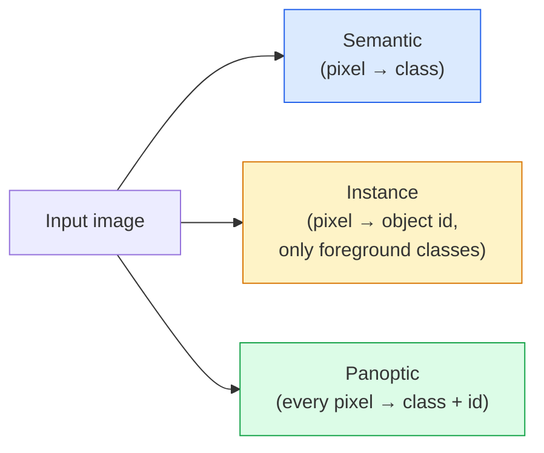
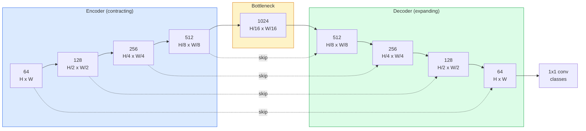

# 语义分割 — U-Net

> 分割就是对每个像素进行分类。U-Net 通过将下采样编码器与上采样解码器配对，并在它们之间连接跳跃连接来实现这一点。

**类型：** Build
**语言：** Python
**前置知识：** 第 4 阶段第 03 课（CNN），第 4 阶段第 04 课（图像分类）
**时间：** 约 75 分钟

## 学习目标

- 区分语义分割、实例分割和全景分割，并为给定问题选择合适的任务
- 在 PyTorch 中从头开始构建 U-Net，包括编码器块、瓶颈层、带转置卷积的解码器以及跳跃连接
- 实现逐像素交叉熵、Dice 损失，以及当前医学和工业分割领域默认的组合损失
- 按类别读取 IoU 和 Dice 指标，并诊断低分是来自小目标召回、边界精度还是类别不平衡

## 问题

分类为每张图像输出一个标签。检测为每张图像输出少量边界框。分割为每个像素输出一个标签。对于大小为 `H x W` 的输入，输出是形状为 `H x W`（语义）或 `H x W x N_instances`（实例）的张量。也就是说，每张图像要进行数百万次预测，而不是一次。

分割的这种结构使其几乎驱动了所有密集预测视觉产品：医学影像（肿瘤掩膜）、自动驾驶（道路、车道、障碍物）、卫星图像（建筑轮廓、作物边界）、文档解析（版面区域）、机器人（可抓取区域）。这些任务都无法通过给目标画一个框来解决；它们需要精确的轮廓。

架构问题说起来简单，但解决起来并不容易：你需要网络同时看到图像的全局上下文（这是哪种场景）和局部像素细节（究竟哪个像素是道路、哪个是人行道）。标准 CNN 为了获得上下文会压缩空间信息，从而丢失细节。U-Net 正是同时兼顾两者的设计。

## 概念

### 语义分割 vs 实例分割 vs 全景分割



- **语义分割** 表示“这个像素是道路，那个像素是汽车。”相邻的两辆车会合并成同一个 blob。
- **实例分割** 表示“这个像素是汽车 #3，那个像素是汽车 #5。”忽略背景类（“stuff” = 天空、道路、草地）。
- **全景分割** 将两者统一：每个像素都有一个类别标签，每个实例都有一个唯一 ID，stuff 和 thing 都被分割。

本课涵盖语义分割。下一课（Mask R-CNN）涵盖实例分割。

### U-Net 的结构



编码器将空间分辨率减半四次，同时将通道数翻倍。解码器则相反：将空间分辨率加倍四次，同时将通道数减半。跳跃连接在每个分辨率下将匹配的编码器特征与解码器特征拼接。最后的 1x1 卷积将 `64 -> num_classes` 映射到完整分辨率。

为什么需要跳跃连接：当解码器尝试输出像素级预测时，它只见过小的特征图。没有跳跃连接，它无法准确定位边缘，因为这些信息在编码器中被压缩掉了。跳跃连接将编码器在下采样过程中计算的高分辨率特征图传递给解码器。

### 转置卷积 vs 双线性上采样

解码器必须扩展空间维度。有两种选择：

- **转置卷积**（`nn.ConvTranspose2d`）—— 可学习的上采样。历史上是 U-Net 的默认选择。如果步长和核大小不能整除，可能会产生棋盘伪影。
- **双线性上采样 + 3x3 卷积** —— 先进行平滑上采样，再接卷积。伪影更少、参数更少，现在是现代默认选择。

两者在实际中都有使用。对于第一个 U-Net，双线性上采样更安全。

### 像素网格上的交叉熵

对于具有 C 个类别的语义分割，模型输出为 `(N, C, H, W)`。目标是 `(N, H, W)`，其中包含整数类别 ID。交叉熵与分类任务相同，只是应用到每个空间位置：

```
Loss = mean over (n, h, w) of -log( softmax(logits[n, :, h, w])[target[n, h, w]] )
```

PyTorch 中的 `F.cross_entropy` 原生支持这种形状。无需 reshape。

### Dice 损失及其必要性

交叉熵对每个像素一视同仁。当一个类别占据画面主导地位时，这是错误的（医学影像：99% 背景，1% 肿瘤）。网络可以通过全部预测为背景来达到 99% 的准确率，但仍然毫无用处。

Dice 损失通过直接优化预测掩膜与真实掩膜之间的重叠来解决这个问题：

```
Dice(p, y) = 2 * sum(p * y) / (sum(p) + sum(y) + epsilon)
Dice_loss = 1 - Dice
```

其中 `p` 是某个类别的 sigmoid/softmax 概率图，`y` 是二值真实掩膜。只有当重叠完美时损失才为零。由于它是基于比例的，因此类别不平衡无关紧要。

在实践中，使用**组合损失**：

```
L = L_cross_entropy + lambda * L_dice       (lambda ~ 1)
```

交叉熵在训练早期提供稳定的梯度；Dice 则将训练后期集中在真正匹配掩膜形状上。这种组合是医学影像领域的默认选择，在任何类别不平衡的数据集上都难以被超越。

### 评估指标

- **像素准确率** — 正确预测的像素百分比。计算代价低。在类别不平衡的数据上存在问题，原因与分类任务中的准确率相同。
- **逐类 IoU** — 每个类别掩膜的交并比；跨类别平均即为 mIoU。
- **Dice（像素级 F1）** — 与 IoU 类似；`Dice = 2 * IoU / (1 + IoU)`。医学影像领域更偏好 Dice，自动驾驶领域更偏好 IoU；两者是单调相关的。
- **边界 F1** — 衡量预测边界与真实边界的接近程度，即使很小的偏移也会受到惩罚。对于半导体检测等高精度任务非常重要。

报告每类 IoU，而不仅仅是 mIoU。当其他九类达到 85% 时，平均 IoU 会掩盖某一类只有 15% 的情况。

### 输入分辨率的权衡

U-Net 的编码器将分辨率减半四次，因此输入必须能被 16 整除。医学图像通常为 512x512 或 1024x1024。自动驾驶裁切图像通常为 2048x1024。U-Net 的内存开销与 `H * W * C_max` 成正比，在 1024x1024 分辨率下配备 1024 个瓶颈通道时，单次前向传播就会占用数 GB 显存。

两种常见的解决方案：
1. 将输入切分 —— 处理带重叠的 256x256 瓦片，然后进行拼接。
2. 将瓶颈层替换为空洞卷积，在保持较高空间分辨率的同时扩大感受野（DeepLab 系列）。

对于第一个模型，256x256 的输入配合 base=64 的 U-Net 可以在 8 GB 显存上舒适训练。

## 动手实现

### 步骤 1：编码器块

两个 3x3 卷积，带批归一化和 ReLU。第一个卷积改变通道数；第二个保持不变。

```python
import torch
import torch.nn as nn
import torch.nn.functional as F

class DoubleConv(nn.Module):
    def __init__(self, in_c, out_c):
        super().__init__()
        self.net = nn.Sequential(
            nn.Conv2d(in_c, out_c, kernel_size=3, padding=1, bias=False),
            nn.BatchNorm2d(out_c),
            nn.ReLU(inplace=True),
            nn.Conv2d(out_c, out_c, kernel_size=3, padding=1, bias=False),
            nn.BatchNorm2d(out_c),
            nn.ReLU(inplace=True),
        )

    def forward(self, x):
        return self.net(x)
```

这个块在整网中复用。`bias=False` 是因为 BN 的 beta 已经处理了偏置。

### 步骤 2：下采样和上采样块

```python
class Down(nn.Module):
    def __init__(self, in_c, out_c):
        super().__init__()
        self.net = nn.Sequential(
            nn.MaxPool2d(2),
            DoubleConv(in_c, out_c),
        )

    def forward(self, x):
        return self.net(x)


class Up(nn.Module):
    def __init__(self, in_c, out_c):
        super().__init__()
        self.up = nn.Upsample(scale_factor=2, mode="bilinear", align_corners=False)
        self.conv = DoubleConv(in_c, out_c)

    def forward(self, x, skip):
        x = self.up(x)
        if x.shape[-2:] != skip.shape[-2:]:
            x = F.interpolate(x, size=skip.shape[-2:], mode="bilinear", align_corners=False)
        x = torch.cat([skip, x], dim=1)
        return self.conv(x)
```

仅检查空间形状（`shape[-2:]`）可以处理尺寸不能被 16 整除的输入；在拼接之前，使用安全的 `F.interpolate` 对齐张量。如果比较完整形状，通道数差异也会触发，而这应该是明显的错误，而不是静默插值。

### 步骤 3：U-Net

```python
class UNet(nn.Module):
    def __init__(self, in_channels=3, num_classes=2, base=64):
        super().__init__()
        self.inc = DoubleConv(in_channels, base)
        self.d1 = Down(base, base * 2)
        self.d2 = Down(base * 2, base * 4)
        self.d3 = Down(base * 4, base * 8)
        self.d4 = Down(base * 8, base * 16)
        self.u1 = Up(base * 16 + base * 8, base * 8)
        self.u2 = Up(base * 8 + base * 4, base * 4)
        self.u3 = Up(base * 4 + base * 2, base * 2)
        self.u4 = Up(base * 2 + base, base)
        self.outc = nn.Conv2d(base, num_classes, kernel_size=1)

    def forward(self, x):
        x1 = self.inc(x)
        x2 = self.d1(x1)
        x3 = self.d2(x2)
        x4 = self.d3(x3)
        x5 = self.d4(x4)
        x = self.u1(x5, x4)
        x = self.u2(x, x3)
        x = self.u3(x, x2)
        x = self.u4(x, x1)
        return self.outc(x)

net = UNet(in_channels=3, num_classes=2, base=32)
x = torch.randn(1, 3, 256, 256)
print(f"output: {net(x).shape}")
print(f"params: {sum(p.numel() for p in net.parameters()):,}")
```

输出形状为 `(1, 2, 256, 256)` —— 空间大小与输入相同，`num_classes` 个通道。当 `base=32` 时约有 770 万个参数。

### 步骤 4：损失函数

```python
def dice_loss(logits, targets, num_classes, eps=1e-6):
    probs = F.softmax(logits, dim=1)
    targets_one_hot = F.one_hot(targets, num_classes).permute(0, 3, 1, 2).float()
    dims = (0, 2, 3)
    intersection = (probs * targets_one_hot).sum(dim=dims)
    denom = probs.sum(dim=dims) + targets_one_hot.sum(dim=dims)
    dice = (2 * intersection + eps) / (denom + eps)
    return 1 - dice.mean()


def combined_loss(logits, targets, num_classes, lam=1.0):
    ce = F.cross_entropy(logits, targets)
    dc = dice_loss(logits, targets, num_classes)
    return ce + lam * dc, {"ce": ce.item(), "dice": dc.item()}
```

Dice 按类别计算后取平均（macro Dice）。`eps` 可防止批次中缺失的类别出现除零。

### 步骤 5：IoU 指标

```python
@torch.no_grad()
def iou_per_class(logits, targets, num_classes):
    preds = logits.argmax(dim=1)
    ious = torch.zeros(num_classes)
    for c in range(num_classes):
        pred_c = (preds == c)
        true_c = (targets == c)
        inter = (pred_c & true_c).sum().float()
        union = (pred_c | true_c).sum().float()
        ious[c] = (inter / union) if union > 0 else torch.tensor(float("nan"))
    return ious
```

返回长度为 C 的向量。`nan` 标记批次中缺失的类别 —— 计算 mIoU 时不应将这些纳入平均。

### 步骤 6：用于端到端验证的合成数据集

在彩色背景上生成形状，这样网络必须学习形状，而不是像素颜色。

```python
import numpy as np
from torch.utils.data import Dataset, DataLoader

def synthetic_segmentation(num_samples=200, size=64, seed=0):
    rng = np.random.default_rng(seed)
    images = np.zeros((num_samples, size, size, 3), dtype=np.float32)
    masks = np.zeros((num_samples, size, size), dtype=np.int64)
    for i in range(num_samples):
        bg = rng.uniform(0, 1, (3,))
        images[i] = bg
        masks[i] = 0
        num_shapes = rng.integers(1, 4)
        for _ in range(num_shapes):
            cls = int(rng.integers(1, 3))
            color = rng.uniform(0, 1, (3,))
            cx, cy = rng.integers(10, size - 10, size=2)
            r = int(rng.integers(4, 12))
            yy, xx = np.meshgrid(np.arange(size), np.arange(size), indexing="ij")
            if cls == 1:
                mask = (xx - cx) ** 2 + (yy - cy) ** 2 < r ** 2
            else:
                mask = (np.abs(xx - cx) < r) & (np.abs(yy - cy) < r)
            images[i][mask] = color
            masks[i][mask] = cls
        images[i] += rng.normal(0, 0.02, images[i].shape)
        images[i] = np.clip(images[i], 0, 1)
    return images, masks


class SegDataset(Dataset):
    def __init__(self, images, masks):
        self.images = images
        self.masks = masks

    def __len__(self):
        return len(self.images)

    def __getitem__(self, i):
        img = torch.from_numpy(self.images[i]).permute(2, 0, 1).float()
        mask = torch.from_numpy(self.masks[i]).long()
        return img, mask
```

三个类别：背景（0）、圆形（1）、方形（2）。网络必须学会区分形状。

### 步骤 7：训练循环

```python
def train_one_epoch(model, loader, optimizer, device, num_classes):
    model.train()
    loss_sum, total = 0.0, 0
    iou_sum = torch.zeros(num_classes)
    for x, y in loader:
        x, y = x.to(device), y.to(device)
        logits = model(x)
        loss, _ = combined_loss(logits, y, num_classes)
        optimizer.zero_grad()
        loss.backward()
        optimizer.step()
        loss_sum += loss.item() * x.size(0)
        total += x.size(0)
        iou_sum += iou_per_class(logits, y, num_classes).nan_to_num(0)
    return loss_sum / total, iou_sum / len(loader)
```

在合成数据集上运行 10-30 个 epoch，观察形状类别的 mIoU 攀升到 0.9 以上。注意 `nan_to_num(0)` 将批次中缺失的类别视为零；为了获得准确的逐类 IoU，应在评估时按类别是否存在进行掩码，并在批次之间使用 `torch.nanmean`，而不是在这里直接平均。

## 应用

在生产环境中，`segmentation_models_pytorch`（简称 "smp"）封装了所有标准分割架构，并支持任意 torchvision 或 timm 骨干网络。三行代码即可：

```python
import segmentation_models_pytorch as smp

model = smp.Unet(
    encoder_name="resnet34",
    encoder_weights="imagenet",
    in_channels=3,
    classes=3,
)
```

实际工作中还值得了解：
- **DeepLabV3+** 用空洞卷积替代基于最大池化的下采样，使瓶颈层保持分辨率；在卫星和驾驶数据上能获得更锐利的边界。
- **SegFormer** 将卷积编码器替换为分层 Transformer；在许多基准上达到当前 SOTA。
- **Mask2Former** / **OneFormer** 在单一架构中统一了语义、实例和全景分割。

这三者都可以在 `smp` 或 `transformers` 中直接替换，使用相同的数据加载器。

## 交付

本课将产出：

- `outputs/prompt-segmentation-task-picker.md` —— 一个提示词，用于在语义、实例和全景分割之间做出选择，并为给定任务指定架构。
- `outputs/skill-segmentation-mask-inspector.md` —— 一项技能，用于报告类别分布、预测掩膜统计信息，以及预测不足或边界模糊的类别。

## 练习

1. **（简单）** 为二值分割任务（前景 vs 背景）实现 `bce_dice_loss`。在合成二分类数据集上验证，当前景仅占 5% 像素时，组合损失是否比单独使用 BCE 收敛得更快。
2. **（中等）** 将 `nn.Upsample + conv` 上采样块替换为 `nn.ConvTranspose2d` 上采样块。在合成数据集上分别训练两者并比较 mIoU。观察转置卷积版本中棋盘伪影出现的位置。
3. **（困难）** 选取一个真实分割数据集（Oxford-IIIT Pets、Cityscapes mini split 或医学影像子集），训练 U-Net 使其 IoU 达到 `smp.Unet` 参考值的 2 个百分点以内。报告逐类 IoU，并识别哪些类别从加入 Dice 损失中获益最多。

## 关键术语

| 术语 | 人们的说法 | 实际含义 |
|------|----------------|----------------------|
| 语义分割 | "Label every pixel" | 将每个像素分类为 C 个类别之一；同一类别的实例会合并 |
| 实例分割 | "Label every object" | 区分同一类别的不同实例；仅针对前景 |
| 全景分割 | "Semantic + instance" | 每个像素都有类别；每个 thing 实例还有唯一 ID |
| 跳跃连接 | "U-Net bridge" | 将编码器特征拼接到相同分辨率的解码器特征中；保留高频细节 |
| 转置卷积 | "Deconvolution" | 可学习的上采样；可能产生棋盘伪影 |
| Dice 损失 | "Overlap loss" | 1 - 2\|A ∩ B\| / (\|A\| + \|B\|)；直接优化掩膜重叠，对类别不平衡鲁棒 |
| mIoU | "Mean intersection over union" | 跨类别平均 IoU；分割领域的社区标准指标 |
| 边界 F1 | "Boundary accuracy" | 仅在边界像素上计算的 F1 分数；对高精度任务至关重要 |

## 延伸阅读

- [U-Net: Convolutional Networks for Biomedical Image Segmentation (Ronneberger et al., 2015)](https://arxiv.org/abs/1505.04597) —— 原始论文；大家都在引用的图在第 2 页
- [Fully Convolutional Networks (Long et al., 2015)](https://arxiv.org/abs/1411.4038) —— 首次将分割变成端到端卷积问题的论文
- [segmentation_models_pytorch](https://github.com/qubvel/segmentation_models.pytorch) —— 生产级分割的参考实现；包含所有标准架构和所有标准损失
- [Lessons learned from training SOTA segmentation (kaggle.com competitions)](https://www.kaggle.com/code/iafoss/carvana-unet-pytorch) —— 阐述为什么在真实数据上 TTA、伪标签和类别权重很重要的实战指南
