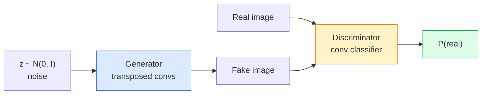
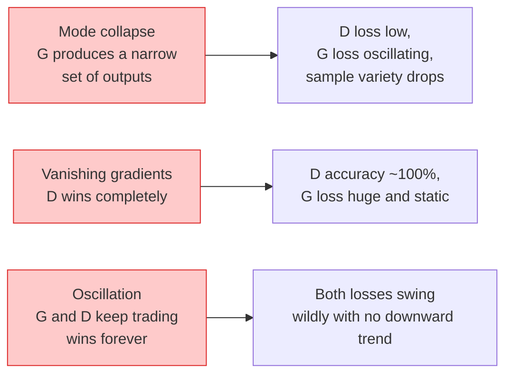

# 图像生成 —— GAN

> GAN 是两个神经网络之间的零和博弈：一个负责生成，一个负责评判。两者共同进步，直到生成的图像足以骗过评判者。

**类型：** 构建  
**语言：** Python  
**前置要求：** Phase 4 Lesson 03（CNNs）、Phase 3 Lesson 06（Optimizers）、Phase 3 Lesson 07（Regularization）  
**时长：** 约 75 分钟

## 学习目标

- 解释生成器与判别器之间的极小化极大博弈，以及为何均衡对应于 p_model = p_data
- 用 PyTorch 实现 DCGAN，并在 60 行以内生成连贯的 32×32 合成图像
- 通过三种标准技巧稳定 GAN 训练：非饱和损失、谱归一化、TTUR（双时间尺度更新规则）
- 解读训练曲线，区分健康收敛与模式崩溃、震荡、判别器完全获胜等情况

## 问题背景

分类任务教网络把图像映射到标签。生成任务则反转了问题：采样出看起来像来自同一分布的新图像。没有“正确”输出可供对比，只有想要模仿的分布。

标准损失函数（MSE、交叉熵）无法衡量“这个样本是否来自真实分布”。最小化逐像素误差会得到模糊的均值图像，而非真实样本。突破点在于让损失本身可学习：训练第二个网络来区分真假，并用它的判断来推动生成器。

GAN（Goodfellow 等，2014）定义了这一框架。到 2018 年，StyleGAN 已经能生成 1024×1024 的、难以与照片区分的人脸。扩散模型如今在质量和可控性上已占主导地位，但所有让扩散模型变得实用的技巧——归一化选择、隐空间、特征损失——最初都是在 GAN 上被理解的。

## 核心概念

### 两个网络



**生成器** G 接收一个噪声向量 `z`，输出一张图像。**判别器** D 接收一张图像，输出一个标量：该图像是真实图像的概率。

### 博弈

G 想让 D 犯错。D 想判断正确。形式上：

```
min_G max_D  E_x[log D(x)] + E_z[log(1 - D(G(z)))]
```

从右往左读：D 在最大化对真实图像（`log D(real)`）和生成图像（`log(1 - D(fake))`）的判别准确度。G 则在最小化 D 对生成图像的判别准确度——它希望 `D(G(z))` 尽可能高。

Goodfellow 证明，该极小化极大问题存在一个全局均衡：此时 `p_G = p_data`，D 处处输出 0.5，生成分布与真实分布之间的 Jensen-Shannon 散度为零。困难之处在于如何达到这个均衡。

### 非饱和损失

上面的形式在数值上不稳定。训练初期，`D(G(z))` 对每张生成图像都接近 0，因此 `log(1 - D(G(z)))` 关于 G 的梯度会消失。解决方法是翻转 G 的损失。

```python
L_D = -E_x[log D(x)] - E_z[log(1 - D(G(z)))]
L_G = -E_z[log D(G(z))]                          # non-saturating
```

当 `D(G(z))` 接近 0 时，G 的损失很大且梯度有意义。现代所有 GAN 都使用这种变体训练。

### DCGAN 架构规则

Radford、Metz、Chintala（2015）把多年失败实验总结为五条让 GAN 训练稳定的规则：

1. 用步长卷积替代池化（两个网络都这样做）。
2. 在生成器和判别器中均使用批归一化，但 G 的输出层和 D 的输入层除外。
3. 在深层架构中去掉全连接层。
4. G 在所有层使用 ReLU，输出层除外（输出层使用 tanh，映射到 [-1, 1]）。
5. D 在所有层使用 LeakyReLU（negative_slope=0.2）。

每个现代基于卷积的 GAN（StyleGAN、BigGAN、GigaGAN）仍然从这些规则出发，再逐个替换组件。

### 失效模式及其征兆



- **模式崩溃**：G 找到一张能骗过 D 的图像，之后只生成这一张。解决方法：加入小批量判别、谱归一化或标签条件。
- **判别器获胜**：D 变得太强太快，G 的梯度消失。解决方法：使用更小的 D、降低 D 的学习率，或对真实标签做标签平滑。
- **震荡**：两个网络反复互相战胜，永远无法接近均衡。解决方法：TTUR（D 的学习速度比 G 快 2–4 倍），或改用 Wasserstein 损失。

### 评估

GAN 没有真实标签，那么如何知道它是否有效？

- **样本检查**——每个 epoch 结束时直接查看 64 张样本。必不可少。
- **FID（Fréchet Inception Distance）**——真实图像集与生成图像集在 Inception-v3 特征分布上的距离。越低越好。社区标准。
- **Inception Score**——更老、更脆弱；优先使用 FID。
- **生成模型的精确率/召回率**——分别衡量质量（精确率）和覆盖度（召回率）。比单独使用 FID 更具信息量。

对于小型合成数据实验，样本检查已经足够。

## 动手实现

### 第 1 步：生成器

一个小型 DCGAN 生成器，接收 64 维噪声，输出 32×32 图像。

```python
import torch
import torch.nn as nn

class Generator(nn.Module):
    def __init__(self, z_dim=64, img_channels=3, feat=64):
        super().__init__()
        self.net = nn.Sequential(
            nn.ConvTranspose2d(z_dim, feat * 4, kernel_size=4, stride=1, padding=0, bias=False),
            nn.BatchNorm2d(feat * 4),
            nn.ReLU(inplace=True),
            nn.ConvTranspose2d(feat * 4, feat * 2, kernel_size=4, stride=2, padding=1, bias=False),
            nn.BatchNorm2d(feat * 2),
            nn.ReLU(inplace=True),
            nn.ConvTranspose2d(feat * 2, feat, kernel_size=4, stride=2, padding=1, bias=False),
            nn.BatchNorm2d(feat),
            nn.ReLU(inplace=True),
            nn.ConvTranspose2d(feat, img_channels, kernel_size=4, stride=2, padding=1, bias=False),
            nn.Tanh(),
        )

    def forward(self, z):
        return self.net(z.view(z.size(0), -1, 1, 1))
```

四层转置卷积，每层 `kernel_size=4, stride=2, padding=1`，因此空间尺寸会干净地翻倍。输出通过 tanh 激活到 [-1, 1]。

### 第 2 步：判别器

生成器的镜像。LeakyReLU、步长卷积，最后输出一个标量 logit。

```python
class Discriminator(nn.Module):
    def __init__(self, img_channels=3, feat=64):
        super().__init__()
        self.net = nn.Sequential(
            nn.Conv2d(img_channels, feat, kernel_size=4, stride=2, padding=1),
            nn.LeakyReLU(0.2, inplace=True),
            nn.Conv2d(feat, feat * 2, kernel_size=4, stride=2, padding=1, bias=False),
            nn.BatchNorm2d(feat * 2),
            nn.LeakyReLU(0.2, inplace=True),
            nn.Conv2d(feat * 2, feat * 4, kernel_size=4, stride=2, padding=1, bias=False),
            nn.BatchNorm2d(feat * 4),
            nn.LeakyReLU(0.2, inplace=True),
            nn.Conv2d(feat * 4, 1, kernel_size=4, stride=1, padding=0),
        )

    def forward(self, x):
        return self.net(x).view(-1)
```

最后一层卷积把 `4x4` 的特征图降到 `1x1`。每张图像输出一个标量；仅在计算损失时应用 sigmoid。

### 第 3 步：训练步骤

交替：每个 batch 先更新一次 D，再更新一次 G。

```python
import torch.nn.functional as F

def train_step(G, D, real, z, opt_g, opt_d, device):
    real = real.to(device)
    bs = real.size(0)

    # D step
    opt_d.zero_grad()
    d_real = D(real)
    d_fake = D(G(z).detach())
    loss_d = (F.binary_cross_entropy_with_logits(d_real, torch.ones_like(d_real))
              + F.binary_cross_entropy_with_logits(d_fake, torch.zeros_like(d_fake)))
    loss_d.backward()
    opt_d.step()

    # G step
    opt_g.zero_grad()
    d_fake = D(G(z))
    loss_g = F.binary_cross_entropy_with_logits(d_fake, torch.ones_like(d_fake))
    loss_g.backward()
    opt_g.step()

    return loss_d.item(), loss_g.item()
```

`G(z).detach()` 在 D 步骤中至关重要：我们不想让梯度流入 G。忘记这一点是新手最常见的 bug。

### 第 4 步：在合成形状上的完整训练循环

```python
from torch.utils.data import DataLoader, TensorDataset
import numpy as np

def synthetic_images(num=2000, size=32, seed=0):
    rng = np.random.default_rng(seed)
    imgs = np.zeros((num, 3, size, size), dtype=np.float32) - 1.0
    for i in range(num):
        r = rng.uniform(6, 12)
        cx, cy = rng.uniform(r, size - r, size=2)
        yy, xx = np.meshgrid(np.arange(size), np.arange(size), indexing="ij")
        mask = (xx - cx) ** 2 + (yy - cy) ** 2 < r ** 2
        color = rng.uniform(-0.5, 1.0, size=3)
        for c in range(3):
            imgs[i, c][mask] = color[c]
    return torch.from_numpy(imgs)

device = "cuda" if torch.cuda.is_available() else "cpu"
data = synthetic_images()
loader = DataLoader(TensorDataset(data), batch_size=64, shuffle=True)

G = Generator(z_dim=64, img_channels=3, feat=32).to(device)
D = Discriminator(img_channels=3, feat=32).to(device)
opt_g = torch.optim.Adam(G.parameters(), lr=2e-4, betas=(0.5, 0.999))
opt_d = torch.optim.Adam(D.parameters(), lr=2e-4, betas=(0.5, 0.999))

for epoch in range(10):
    for (batch,) in loader:
        z = torch.randn(batch.size(0), 64, device=device)
        ld, lg = train_step(G, D, batch, z, opt_g, opt_d, device)
    print(f"epoch {epoch}  D {ld:.3f}  G {lg:.3f}")
```

`Adam(lr=2e-4, betas=(0.5, 0.999))` 是 DCGAN 的默认设置——较低的 beta1 可防止动量项过多地稳定对抗博弈。

### 第 5 步：采样

```python
@torch.no_grad()
def sample(G, n=16, z_dim=64, device="cpu"):
    G.eval()
    z = torch.randn(n, z_dim, device=device)
    imgs = G(z)
    imgs = (imgs + 1) / 2
    return imgs.clamp(0, 1)
```

采样前务必切换到 eval 模式。对 DCGAN 而言这很重要，因为此时批归一化使用的是运行统计量而非当前 batch 的统计量。

### 第 6 步：谱归一化

D 中批归一化的即插即用替代方案，保证网络是 1-Lipschitz 的。能解决大多数“D 赢得太狠”的失效。

```python
from torch.nn.utils import spectral_norm

def build_sn_discriminator(img_channels=3, feat=64):
    return nn.Sequential(
        spectral_norm(nn.Conv2d(img_channels, feat, 4, 2, 1)),
        nn.LeakyReLU(0.2, inplace=True),
        spectral_norm(nn.Conv2d(feat, feat * 2, 4, 2, 1)),
        nn.LeakyReLU(0.2, inplace=True),
        spectral_norm(nn.Conv2d(feat * 2, feat * 4, 4, 2, 1)),
        nn.LeakyReLU(0.2, inplace=True),
        spectral_norm(nn.Conv2d(feat * 4, 1, 4, 1, 0)),
    )
```

把 `Discriminator` 换成 `build_sn_discriminator()`，你通常就不再需要 TTUR 技巧。谱归一化是最容易实现的单点鲁棒性提升。

## 应用

对于严肃的生成任务，使用预训练权重或转向扩散模型。两个常用库：

- `torch_fidelity` 无需编写自定义评估代码即可计算 FID / IS。
- `pytorch-gan-zoo`（旧版）和 `StudioGAN` 提供了 DCGAN、WGAN-GP、SN-GAN、StyleGAN 和 BigGAN 的已测试实现。

到 2026 年，GAN 仍然是以下场景的最佳选择：实时图像生成（延迟 <10 ms）、风格迁移、需要精确控制的图像到图像翻译（Pix2Pix、CycleGAN）。扩散模型在照片级真实感和文本条件生成上更胜一筹。

## 交付

本课产出：

- `outputs/prompt-gan-training-triage.md` —— 一个提示词，读取训练曲线描述并判断失效模式（模式崩溃、D 获胜、震荡），同时给出单一推荐修复方案。
- `outputs/skill-dcgan-scaffold.md` —— 一个技能，根据 `z_dim`、目标 `image_size` 和 `num_channels` 编写 DCGAN 脚手架，包括训练循环和样本保存。

## 练习

1. **（简单）** 在上述 DCGAN 上训练合成圆形数据集，并在每个 epoch 结束时保存 16 张样本的网格。到第几个 epoch，生成的圆圈会变得明显圆润？
2. **（中等）** 把判别器中的批归一化替换为谱归一化。并排训练两个版本。哪个收敛更快？哪个在三个随机种子上的方差更低？
3. **（困难）** 实现条件 DCGAN：把类别标签同时输入 G 和 D（在 G 中将 one-hot 与噪声拼接，在 D 中拼接一个类别嵌入通道）。在第 7 课的合成“圆与方”数据集上训练，并通过按指定标签采样来证明类别条件生效。

## 关键术语

| 术语 | 通俗说法 | 实际含义 |
|------|----------|----------|
| Generator (G) | “画东西的网” | 将噪声映射为图像；训练目标是欺骗判别器 |
| Discriminator (D) | “评论家” | 二分类器；训练目标区分真实图像与生成图像 |
| Minimax | “博弈” | 对 G 取最小、对 D 取最大的对抗损失；均衡时 p_G = p_data |
| Non-saturating loss | “数值上更稳定的版本” | G 的损失为 -log(D(G(z)))，而非 log(1 - D(G(z)))，以避免训练初期梯度消失 |
| Mode collapse | “生成器只会做一种东西” | G 只生成数据分布的一小部分；可通过 SN、小批量判别或更大 batch 修复 |
| TTUR | “两种学习率” | D 的学习速度比 G 快，通常是 2–4 倍；用于稳定训练 |
| Spectral norm | “1-Lipschitz 层” | 一种权重归一化，限制每层 Lipschitz 常数；防止 D 变得任意陡峭 |
| FID | “Fréchet Inception Distance” | 真实图像集与生成图像集在 Inception-v3 特征分布上的距离；标准评估指标 |

## 延伸阅读

- [Generative Adversarial Networks (Goodfellow et al., 2014)](https://arxiv.org/abs/1406.2661) —— 开创一切的论文
- [DCGAN (Radford, Metz, Chintala, 2015)](https://arxiv.org/abs/1511.06434) —— 让 GAN 可训练起来的架构规则
- [Spectral Normalization for GANs (Miyato et al., 2018)](https://arxiv.org/abs/1802.05957) —— 最有用的稳定技巧
- [StyleGAN3 (Karras et al., 2021)](https://arxiv.org/abs/2106.12423) —— 当前最先进的 GAN；读起来像过去十年所有技巧的精选集
