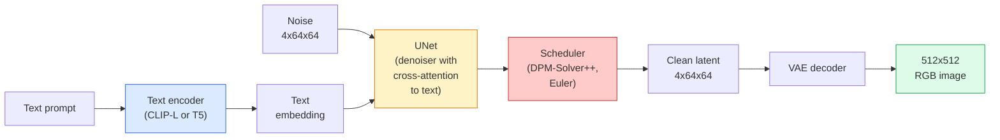

# Stable Diffusion — 架构与微调

> Stable Diffusion 是一种在预训练 VAE 的潜在空间中运行的 DDPM，它通过交叉注意力接受文本条件，使用快速确定性 ODE 求解器进行采样，并通过无分类器引导进行控制。

**Type:** 学习 + 使用
**Languages:** Python
**Prerequisites:** 第 4 阶段第 10 课（扩散模型），第 7 阶段第 2 课（自注意力）
**Time:** ~75 分钟

## 学习目标

- 梳理 Stable Diffusion 流水线的五个组成部分：VAE、文本编码器、U-Net、调度器、安全检查器——以及它们各自实际发挥的作用
- 解释什么是潜在扩散，以及为什么要在 4×64×64 的潜在空间（而非 3×512×512 的图像）中进行训练，这样能在不损失质量的情况下将计算量减少 48 倍
- 使用 `diffusers` 生成图像，执行图生图、图像修复（inpainting）以及 ControlNet 引导生成
- 在小规模自定义数据集上用 LoRA 微调 Stable Diffusion，并在推理时加载 LoRA 适配器

## 问题背景

直接在 512×512 的 RGB 图像上训练 DDPM 成本极高。每个训练步骤都要经过 U-Net 反向传播，而 U-Net 每次面对的是 3×512×512 = 786,432 个输入值；采样时也需要在同一个 U-Net 上执行 50 多次前向传播。要达到 Stable Diffusion 1.5（2022 年发布）的质量水平，像素空间扩散大约需要 256 个 GPU 月的训练时间，在消费级 GPU 上生成一张图需要 10–30 秒。

让开放权重的文本到图像模型变得实用的关键技巧是**潜在扩散**（latent diffusion，Rombach 等人，CVPR 2022）。训练一个 VAE，把 3×512×512 的图像映射到 4×64×64 的潜在张量，再映射回去，然后在这个潜在空间中执行扩散。计算量下降至原来的 `(3*512*512)/(4*64*64) = 48` 分之一，在同一款 GPU 上采样时间从十几秒降到两秒以内。

几乎所有现代图像生成模型——SDXL、SD3、FLUX、HunyuanDiT、Wan-Video——都属于潜在扩散模型，区别主要在于自编码器、去噪器（U-Net 或 DiT）以及文本条件化的具体设计。掌握了 Stable Diffusion，你就掌握了这一整套范式模板。

## 核心概念

### 流水线



- **VAE** — 冻结的自编码器。编码器将图像转换为潜在表示（用于图生图和训练），解码器将潜在表示还原为图像。
- **Text encoder（文本编码器）** — SD 1.x/2.x 使用 CLIP 文本编码器，SDXL 使用 CLIP-L + CLIP-G，SD3/FLUX 使用 T5-XXL。它输出一串 token 嵌入。
- **U-Net** — 去噪器。包含交叉注意力层，在每个分辨率层级上让潜在特征去关注文本嵌入。
- **Scheduler（调度器）** — 采样算法（DDIM、Euler、DPM-Solver++）。负责选择 sigma，并将预测出的噪声混合回潜在变量。
- **Safety checker（安全检查器）** — 可选的输出图像 NSFW/非法内容过滤器。

### 无分类器引导（CFG）

普通文本条件化会为每个提示 `c` 学习 `epsilon_theta(x_t, t, c)`。CFG 在训练时以 10% 的概率丢弃条件 `c`（替换为空嵌入），让同一个网络既能预测有条件噪声，也能预测无条件噪声。推理时：

```
eps = eps_uncond + w * (eps_cond - eps_uncond)
```

`w` 是引导强度（guidance scale）。`w=0` 表示无条件生成；`w=1` 表示普通条件生成；`w>1` 则以牺牲多样性为代价，让输出“更贴合提示词”。Stable Diffusion 的默认值是 `w=7.5`。

CFG 是文本到图像能以生产级质量运行的关键。没有它，提示词只能轻微影响输出；有了它，提示词就能主导生成结果。

### 潜在空间的几何特性

VAE 的 4 通道潜在变量并不仅仅是压缩后的图像。它是一个流形，其中的算术运算大致对应语义编辑（提示词工程与插值都发生在这里），而扩散 U-Net 也已经被训练成把全部建模能力花在这个流形上。解码一个随机的 4×64×64 潜在变量不会得到一张“看起来像随机图像”的图，而会得到乱码——因为只有潜在空间中的某个特定子流形，解码后才是有效图像。

这带来两个结果：

1. **Img2img（图生图）** = 将图像编码为潜在变量，加入部分噪声，运行去噪器，再解码。图像结构之所以能够保留，是因为编码近似可逆；具体内容则根据提示词发生变化。
2. **Inpainting（图像修复）** = 与图生图相同，但去噪器只更新被遮罩的区域；未被遮罩的区域保持编码后的潜在变量不变。

### U-Net 架构

Stable Diffusion 的 U-Net 本质上是在第 10 课的 TinyUNet 基础上放大，并增加了三个部分：

- 每个空间分辨率上的 **Transformer 块**，包含自注意力 + 对文本嵌入的交叉注意力。
- 基于正弦编码并通过 MLP 实现的 **时间嵌入**。
- 编码器与解码器在对应分辨率之间的 **跳跃连接**。

SD 1.5 的总参数量约为 8.6 亿，SDXL 约为 26 亿，FLUX 约为 120 亿。参数量的增长主要集中在注意力层。

### LoRA 微调

完整微调 Stable Diffusion 需要 20 GB 以上的显存，并更新 8.6 亿个参数。LoRA（Low-Rank Adaptation，低秩适配）保持基础模型冻结，只在注意力层注入小型低秩分解矩阵。一个 SD 的 LoRA 适配器通常只有 10–50 MB，在单张消费级 GPU 上训练 10–60 分钟即可，推理时可以作为即插即用的修改加载。

```
Original: W_q : (d_in, d_out)   frozen
LoRA:     W_q + alpha * (A @ B)   where A : (d_in, r), B : (r, d_out)

r is typically 4-32.
```

几乎所有社区微调模型都是以 LoRA 形式分发的。CivitAI 和 Hugging Face 上托管了数百万个 LoRA 适配器。

### 常见调度器

- **DDIM** — 确定性，约 50 步，简单直接。
- **Euler ancestral（欧拉祖先采样）** — 随机性，30–50 步，生成的样本更具创意。
- **DPM-Solver++ 2M Karras** — 确定性，20–30 步，生产环境默认选择。
- **LCM / TCD / Turbo** — 一致性模型及蒸馏变体；只需 1–4 步，但会牺牲部分质量。

在 `diffusers` 中更换调度器只需改一行代码，有时无需重新训练就能解决采样问题。

## 动手实现

本课全程使用 `diffusers` 库，而不是从零手搓 Stable Diffusion。需要从零重建的各个组件（VAE、文本编码器、U-Net、调度器）都是各自独立课程的主题；本课的目标是熟练掌握生产级 API。

### 步骤 1：文生图

```python
import torch
from diffusers import StableDiffusionPipeline

pipe = StableDiffusionPipeline.from_pretrained(
    "runwayml/stable-diffusion-v1-5",
    torch_dtype=torch.float16,
).to("cuda")

image = pipe(
    prompt="a dog riding a skateboard in tokyo, studio ghibli style",
    guidance_scale=7.5,
    num_inference_steps=25,
    generator=torch.Generator("cuda").manual_seed(42),
).images[0]
image.save("dog.png")
```

`float16` 能将显存占用减半，且几乎看不出质量损失。默认 DPM-Solver++ 下 `num_inference_steps=25` 的效果与 DDIM 下 `num_inference_steps=50` 相当。

### 步骤 2：更换调度器

```python
from diffusers import DPMSolverMultistepScheduler, EulerAncestralDiscreteScheduler

pipe.scheduler = DPMSolverMultistepScheduler.from_config(pipe.scheduler.config)
pipe.scheduler = EulerAncestralDiscreteScheduler.from_config(pipe.scheduler.config)
```

调度器状态与 U-Net 权重解耦。你可以用 DDPM 训练，却用任意调度器采样。

### 步骤 3：图生图

```python
from diffusers import StableDiffusionImg2ImgPipeline
from PIL import Image

img2img = StableDiffusionImg2ImgPipeline.from_pretrained(
    "runwayml/stable-diffusion-v1-5",
    torch_dtype=torch.float16,
).to("cuda")

init_image = Image.open("dog.png").convert("RGB").resize((512, 512))
out = img2img(
    prompt="a dog riding a skateboard, oil painting",
    image=init_image,
    strength=0.6,
    guidance_scale=7.5,
).images[0]
```

`strength` 表示去噪前添加噪声的强度（0.0 = 完全不变，1.0 = 完全重生成）。0.5–0.7 是风格迁移的常用区间。

### 步骤 4：图像修复

```python
from diffusers import StableDiffusionInpaintPipeline

inpaint = StableDiffusionInpaintPipeline.from_pretrained(
    "runwayml/stable-diffusion-inpainting",
    torch_dtype=torch.float16,
).to("cuda")

image = Image.open("dog.png").convert("RGB").resize((512, 512))
mask = Image.open("dog_mask.png").convert("L").resize((512, 512))

out = inpaint(
    prompt="a cat",
    image=image,
    mask_image=mask,
    guidance_scale=7.5,
).images[0]
```

遮罩中白色像素代表需要重生成的区域，黑色像素代表保留的区域。

### 步骤 5：加载 LoRA

```python
pipe.load_lora_weights("sayakpaul/sd-lora-ghibli")
pipe.fuse_lora(lora_scale=0.8)

image = pipe(prompt="a village square in ghibli style").images[0]
```

`lora_scale` 控制强度；0.0 = 无效果，1.0 = 完全效果。`fuse_lora` 会把适配器就地融合进权重以加快速度，但融合后就不能再更换适配器。在加载另一个 LoRA 之前，先调用 `pipe.unfuse_lora()`。

### 步骤 6：LoRA 训练（概览）

真正的 LoRA 训练在 `peft` 或 `diffusers.training` 中实现。其大致流程如下：

```python
# Pseudocode
for step, batch in enumerate(dataloader):
    images, prompts = batch
    latents = vae.encode(images).latent_dist.sample() * 0.18215

    t = torch.randint(0, num_train_timesteps, (batch_size,))
    noise = torch.randn_like(latents)
    noisy_latents = scheduler.add_noise(latents, noise, t)

    text_emb = text_encoder(tokenizer(prompts))

    pred_noise = unet(noisy_latents, t, text_emb)  # LoRA weights injected here

    loss = F.mse_loss(pred_noise, noise)
    loss.backward()
    optimizer.step()
```

只有 LoRA 矩阵接收梯度；基础 U-Net、VAE 和文本编码器都保持冻结。在 batch size 为 1 并开启梯度检查点的情况下，8 GB 显存即可运行。

## 实际应用

在生产环境中，你真正要做出的决策包括：

- **模型系列**：需要开源社区微调资源时选 SD 1.5，需要更高保真度时选 SDXL，追求最先进效果且能满足严格许可要求时选 SD3 / FLUX。
- **调度器**：20–30 步用 DPM-Solver++ 2M Karras；延迟要求低于 1 秒时用 LCM-LoRA。
- **精度**：4080/4090 用 `float16`，A100 及更新架构用 `bfloat16`，显存紧张时用 `int8`（通过 `bitsandbytes` 或 `compel`）。
- **条件化**：纯文本即可；若需要更强的控制，在基础流水线之上添加 ControlNet（canny、depth、pose 等）。

批量生成时，`AUTO1111` / `ComfyUI` 是社区常用工具；生产级 API 则使用 `diffusers` + `accelerate` 或结合 TensorRT 编译的 `optimum-nvidia`。

## 产出物

本课产出：

- `outputs/prompt-sd-pipeline-planner.md` — 一个提示词，用于在给定延迟预算、保真度目标和许可约束的情况下，选择 SD 1.5 / SDXL / SD3 / FLUX 以及对应的调度器和精度。
- `outputs/skill-lora-training-setup.md` — 一个技能文件，用于为自定义数据集编写完整的 LoRA 训练配置，包括 caption、rank、batch size 和学习率。

## 练习题

1. **（简单）** 使用 `[1, 3, 5, 7.5, 10, 15]` 中的 `guidance_scale` 生成同一提示词。描述图像如何变化，并指出在哪个引导值开始出现伪影。
2. **（中等）** 任选一张真实照片，使用 `StableDiffusionImg2ImgPipeline` 在 `strength` 为 `[0.2, 0.4, 0.6, 0.8, 1.0]` 的条件下生成图像。哪个强度能在改变风格的同时保留构图？为什么 1.0 会完全忽略输入？
3. **（困难）** 用某个单一主体（宠物、logo、角色等）的 10–20 张图像训练一个 LoRA，并生成包含该主体的新场景。报告在不过拟合到输入图像的前提下，身份保持效果最好时的 LoRA rank 和训练步数。

## 关键术语

| 术语 | 大家的说法 | 实际含义 |
|------|------------|----------|
| Latent diffusion | “在潜在空间扩散” | 在 VAE 潜在空间（4×64×64）而非像素空间（3×512×512）中运行整个 DDPM；计算量减少 48 倍 |
| VAE scale factor | “0.18215” | 将 VAE 原始潜在变量缩放到近似单位方差的常数；在每个 SD 流水线中硬编码 |
| Classifier-free guidance | “CFG” | 混合有条件和无条件噪声预测；是影响最大的单个推理旋钮 |
| Scheduler | “Sampler（采样器）” | 将噪声与模型预测转化为去噪潜在轨迹的算法 |
| LoRA | “Low-rank adapter（低秩适配器）” | 小型低秩分解矩阵，用于微调注意力层而不改动基础权重 |
| Cross-attention | “Text-image attention（文本-图像注意力）” | 从潜在 token 到文本 token 的注意力；在每个 U-Net 层级注入提示信息 |
| ControlNet | “Structure conditioning（结构条件化）” | 一个单独训练的适配器，用额外输入（canny、depth、pose、segmentation）引导 SD |
| DPM-Solver++ | “默认调度器” | 二阶确定性 ODE 求解器；在 2026 年仍是 20–30 步下质量最佳的选择 |

## 延伸阅读

- [High-Resolution Image Synthesis with Latent Diffusion (Rombach et al., 2022)](https://arxiv.org/abs/2112.10752) — Stable Diffusion 原论文；包含所有支撑该设计决策的消融实验
- [Classifier-Free Diffusion Guidance (Ho & Salimans, 2022)](https://arxiv.org/abs/2207.12598) — CFG 论文
- [LoRA: Low-Rank Adaptation of Large Language Models (Hu et al., 2021)](https://arxiv.org/abs/2106.09685) — LoRA 最初用于 NLP；迁移到 SD 时几乎没有改动
- [diffusers documentation](https://huggingface.co/docs/diffusers) — 每个 SD / SDXL / SD3 / FLUX 流水线的参考文档
