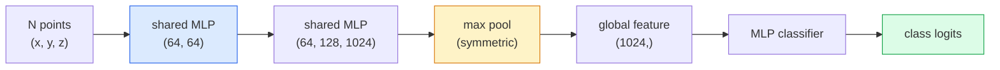

# 3D 视觉——点云与 NeRF

> 3D 视觉有两种形态。点云是传感器的原始输出。NeRF 是学习得到的体积场。两者都在回答“空间中有什么、在哪里”。

**类型：** 学习 + 实践  
**语言：** Python  
**前置知识：** 阶段 4 第 03 课（CNN）、阶段 1 第 12 课（张量操作）  
**时间：** ~45 分钟

## 学习目标

- 区分显式（点云、网格、体素）与隐式（有符号距离场、NeRF）三维表示及其适用场景
- 理解 PointNet 的对称函数技巧，它使神经网络对无序点集具有置换不变性
- 追踪 NeRF 的前向传播：光线投射、体渲染、位置编码、MLP 密度头 + 颜色头
- 使用 `nerfstudio` 或 `instant-ngp`，从少量带有位姿的图像进行预训练三维重建

## 问题背景

相机生成二维图像。激光雷达生成一组没有顺序的三维点。运动恢复结构（SfM）流程生成稀疏的三维关键点云。NeRF 从少量带有位姿的图像重建完整的三维场景。这些都属于“视觉”，但都不是 CNN 所期望的稠密张量。

3D 视觉之所以重要，是因为几乎所有高价值的机器人任务都在三维空间中运行：抓取、避障、导航、AR 遮挡、三维内容采集。只懂二维图像的视觉工程师将被该领域增长最快的部分（AR/VR 内容、机器人、自动驾驶堆栈、房地产或建筑领域的 NeRF 三维重建）拒之门外。

这两种表示因不同原因而占据主导。点云是传感器免费给你的数据。NeRF 及其后继方法（3D 高斯泼溅、神经 SDF）则是让神经网络学习场景时得到的结果。

## 核心概念

### 点云

点云是 R^3 中 N 个点的无序集合，每个点可选地带有特征（颜色、强度、法线）。

```
cloud = [
  (x1, y1, z1, r1, g1, b1),
  (x2, y2, z2, r2, g2, b2),
  ...
  (xN, yN, zN, rN, gN, bN),
]
```

没有网格，没有连接关系。两个性质让神经网络难以处理：

- **置换不变性** —— 输出不能依赖点的顺序。
- **可变的 N** —— 同一个模型必须能处理不同大小的点云。

PointNet（Qi 等人，2017）用一个思想同时解决了这两个问题：对每个点应用共享的 MLP，然后用对称函数（最大池化）聚合。结果是一个不依赖顺序的定长向量。

```
f(P) = max_{p in P} MLP(p)
```

这就是 PointNet 的全部核心。更深的变体（PointNet++、Point Transformer）增加了层次采样和局部聚合，但对称函数技巧始终未变。

### PointNet 架构



“共享 MLP”意味着同一个 MLP 独立作用于每个点。实际实现时，为效率起见会沿点维度做 1x1 卷积。

### 神经辐射场（NeRF）

NeRF（Mildenhall 等人，2020）回答了“能否从 N 张照片重建三维场景？”这个问题，方法是让神经网络本身成为场景。该网络将 `(x, y, z, viewing_direction)` 映射为 `(density, colour)`。渲染新视角就是对网络进行光线投射循环。

```
NeRF MLP:  (x, y, z, theta, phi) -> (sigma, r, g, b)

To render a pixel (u, v) of a new view:
  1. Cast a ray from the camera through pixel (u, v)
  2. Sample points along the ray at distances t_1, t_2, ..., t_N
  3. Query the MLP at each point
  4. Composite the colours weighted by (1 - exp(-sigma * dt))
  5. The sum is the rendered pixel colour
```

损失将渲染像素与训练照片中的真实像素进行比较。通过渲染步骤反向传播来更新 MLP。没有三维真值，没有显式几何——场景存储在 MLP 的权重中。

### NeRF 中的位置编码

普通 MLP 直接作用于 `(x, y, z)` 无法表示高频细节，因为 MLP 在频谱上偏向低频。NeRF 的解决方法是：在输入 MLP 前将每个坐标编码为傅里叶特征向量：

```
gamma(p) = (sin(2^0 pi p), cos(2^0 pi p), sin(2^1 pi p), cos(2^1 pi p), ...)
```

最高到 L=10 个频率层级。这与 Transformer 处理位置信息所用的技巧相同，也出现在扩散模型的时间条件中（第 10 课）。没有它，NeRF 渲染结果会模糊。

### 体渲染

```
C(r) = sum_i T_i * (1 - exp(-sigma_i * delta_i)) * c_i

T_i  = exp(- sum_{j<i} sigma_j * delta_j)
delta_i = t_{i+1} - t_i
```

`T_i` 是透射率 —— 有多少光能够到达第 i 个点。`(1 - exp(-sigma_i * delta_i))` 是第 i 个点的不透明度。`c_i` 是颜色。最终像素是沿光线的加权和。

### 什么取代了 NeRF

纯 NeRF 训练慢（数小时）且渲染慢（每张图像数秒）。此后的演进：

- **Instant-NGP**（2022）—— 用哈希网格编码替代 MLP 的位置输入；数秒内完成训练。
- **Mip-NeRF 360** —— 处理无界场景与抗锯齿。
- **3D Gaussian Splatting**（2023）—— 用数百万个三维高斯替代体积场；数分钟训练，实时渲染。当前生产环境中的默认选择。

到 2026 年，几乎所有实际产品中的“NeRF”其实都是 3D 高斯泼溅。但其心智模型仍是 NeRF。

### 数据集与基准

- **ShapeNet** —— 以点云形式对三维 CAD 模型进行分类与分割。
- **ScanNet** —— 真实室内扫描数据，用于分割。
- **KITTI** —— 户外激光雷达点云，用于自动驾驶。
- **NeRF Synthetic** / **Blended MVS** —— 带有位姿的图像数据集，用于新视角合成。
- **Mip-NeRF 360 dataset** —— 无界真实场景。

## 动手实现

### 步骤 1：PointNet 分类器

```python
import torch
import torch.nn as nn

class PointNet(nn.Module):
    def __init__(self, num_classes=10):
        super().__init__()
        self.mlp1 = nn.Sequential(
            nn.Conv1d(3, 64, 1),    nn.BatchNorm1d(64),   nn.ReLU(inplace=True),
            nn.Conv1d(64, 64, 1),   nn.BatchNorm1d(64),   nn.ReLU(inplace=True),
        )
        self.mlp2 = nn.Sequential(
            nn.Conv1d(64, 128, 1),  nn.BatchNorm1d(128),  nn.ReLU(inplace=True),
            nn.Conv1d(128, 1024, 1), nn.BatchNorm1d(1024), nn.ReLU(inplace=True),
        )
        self.head = nn.Sequential(
            nn.Linear(1024, 512),   nn.BatchNorm1d(512),  nn.ReLU(inplace=True),
            nn.Dropout(0.3),
            nn.Linear(512, 256),    nn.BatchNorm1d(256),  nn.ReLU(inplace=True),
            nn.Dropout(0.3),
            nn.Linear(256, num_classes),
        )

    def forward(self, x):
        # x: (N, 3, num_points) — transposed for Conv1d
        x = self.mlp1(x)
        x = self.mlp2(x)
        x = torch.max(x, dim=-1)[0]       # (N, 1024)
        return self.head(x)

pts = torch.randn(4, 3, 1024)
net = PointNet(num_classes=10)
print(f"output: {net(pts).shape}")
print(f"params: {sum(p.numel() for p in net.parameters()):,}")
```

约 160 万参数。每朵点云处理 1,024 个点。

### 步骤 2：位置编码

```python
def positional_encoding(x, L=10):
    """
    x: (..., D) -> (..., D * 2 * L)
    """
    freqs = 2.0 ** torch.arange(L, dtype=x.dtype, device=x.device)
    args = x.unsqueeze(-1) * freqs * 3.141592653589793
    sinc = torch.cat([args.sin(), args.cos()], dim=-1)
    return sinc.reshape(*x.shape[:-1], -1)

x = torch.randn(5, 3)
y = positional_encoding(x, L=10)
print(f"input:  {x.shape}")
print(f"encoded: {y.shape}     # (5, 60)")
```

乘以 `2^l * pi` 可得到逐级升高的频率。

### 步骤 3：小型 NeRF MLP

```python
class TinyNeRF(nn.Module):
    def __init__(self, L_pos=10, L_dir=4, hidden=128):
        super().__init__()
        self.L_pos = L_pos
        self.L_dir = L_dir
        pos_dim = 3 * 2 * L_pos
        dir_dim = 3 * 2 * L_dir
        self.trunk = nn.Sequential(
            nn.Linear(pos_dim, hidden), nn.ReLU(inplace=True),
            nn.Linear(hidden, hidden),  nn.ReLU(inplace=True),
            nn.Linear(hidden, hidden),  nn.ReLU(inplace=True),
            nn.Linear(hidden, hidden),  nn.ReLU(inplace=True),
        )
        self.sigma = nn.Linear(hidden, 1)
        self.color = nn.Sequential(
            nn.Linear(hidden + dir_dim, hidden // 2), nn.ReLU(inplace=True),
            nn.Linear(hidden // 2, 3), nn.Sigmoid(),
        )

    def forward(self, x, d):
        x_enc = positional_encoding(x, self.L_pos)
        d_enc = positional_encoding(d, self.L_dir)
        h = self.trunk(x_enc)
        sigma = torch.relu(self.sigma(h)).squeeze(-1)
        rgb = self.color(torch.cat([h, d_enc], dim=-1))
        return sigma, rgb

nerf = TinyNeRF()
x = torch.randn(128, 3)
d = torch.randn(128, 3)
s, c = nerf(x, d)
print(f"sigma: {s.shape}   rgb: {c.shape}")
```

与原始 NeRF（两个深度为 8 的 MLP 主干）相比非常小，但足以展示其架构。

### 步骤 4：沿单条光线的体渲染

```python
def volumetric_render(sigma, rgb, t_vals):
    """
    sigma: (..., N_samples)
    rgb:   (..., N_samples, 3)
    t_vals: (N_samples,) distances along the ray
    """
    delta = torch.cat([t_vals[1:] - t_vals[:-1], torch.full_like(t_vals[:1], 1e10)])
    alpha = 1.0 - torch.exp(-sigma * delta)
    trans = torch.cumprod(torch.cat([torch.ones_like(alpha[..., :1]), 1.0 - alpha + 1e-10], dim=-1), dim=-1)[..., :-1]
    weights = alpha * trans
    rendered = (weights.unsqueeze(-1) * rgb).sum(dim=-2)
    depth = (weights * t_vals).sum(dim=-1)
    return rendered, depth, weights


N = 64
t_vals = torch.linspace(2.0, 6.0, N)
sigma = torch.rand(N) * 0.5
rgb = torch.rand(N, 3)
rendered, depth, weights = volumetric_render(sigma, rgb, t_vals)
print(f"rendered colour: {rendered.tolist()}")
print(f"depth:           {depth.item():.2f}")
```

一条光线，64 个采样点，合成为一个 RGB 像素和一个深度值。

## 实际应用

真实项目中：

- `nerfstudio`（Tancik 等人）—— 当前 NeRF / Instant-NGP / 高斯泼溅的参考库。提供命令行与 Web 查看器。
- `pytorch3d`（Meta）—— 可微渲染、点云工具、网格操作。
- `open3d` —— 点云处理、配准、可视化。

在部署中，3D 高斯泼溅已基本取代纯 NeRF，因为其渲染速度快了约 100 倍。重建质量相当。

## 交付成果

本课产出：

- `outputs/prompt-3d-task-router.md` —— 一个提示词，根据任务与输入数据将任务路由到合适的 3D 表示（点云、网格、体素、NeRF、高斯泼溅）。
- `outputs/skill-point-cloud-loader.md` —— 一个技能，编写用于 `.ply` / `.pcd` / `.xyz` 文件的 PyTorch `Dataset`，包含正确的归一化、中心化和点采样。

## 练习

1. **（简单）** 证明 PointNet 具有置换不变性：将同一朵点云输入两次，一次打乱点的顺序。验证两次输出在浮点误差范围内相同。
2. **（中等）** 实现一个最小化的光线生成函数：给定相机内参和位姿，为 H x W 图像的每个像素生成光线起点和方向。
3. **（困难）** 在一个彩色立方体渲染视图组成的小合成数据集上训练 TinyNeRF（可通过可微渲染或简单光线追踪生成）。报告第 1、10、100 个 epoch 的渲染损失。模型在第几个 epoch 能产生可辨认的视图？

## 关键术语

| 术语 | 通常说法 | 实际含义 |
|------|----------|----------|
| Point cloud | “来自激光雷达的三维点” | 每点为 `(x, y, z)` 加可选特征的无序集合 |
| PointNet | “首个点云神经网络” | 每点共享 MLP + 对称（最大）池化；结构上具有置换不变性 |
| NeRF | “作为场景的 MLP” | 将 `(x, y, z, dir)` 映射到 `(密度, 颜色)` 的网络；通过光线投射渲染 |
| Positional encoding | “傅里叶特征” | 将每个坐标编码成多频率正弦/余弦，以克服 MLP 的低频偏置 |
| Volumetric rendering | “光线积分” | 利用透射率与 alpha 将沿光线的采样合成为单个像素 |
| Instant-NGP | “哈希网格 NeRF” | 用多分辨率哈希网格替代 NeRF 的坐标 MLP；速度提升 100–1000 倍 |
| 3D Gaussian splatting | “数百万高斯” | 场景 = 三维高斯集合；实时渲染，数分钟训练 |
| SDF | “有符号距离场” | 返回距最近表面有符号距离的函数；另一种隐式表示 |

## 延伸阅读

- [PointNet (Qi et al., 2017)](https://arxiv.org/abs/1612.00593) —— 置换不变分类器
- [NeRF (Mildenhall et al., 2020)](https://arxiv.org/abs/2003.08934) —— 让从照片重建三维场景成为神经网络问题的论文
- [Instant-NGP (Müller et al., 2022)](https://arxiv.org/abs/2201.05989) —— 哈希网格，1000 倍加速
- [3D Gaussian Splatting (Kerbl et al., 2023)](https://arxiv.org/abs/2308.04079) —— 在生产环境中取代 NeRF 的架构
