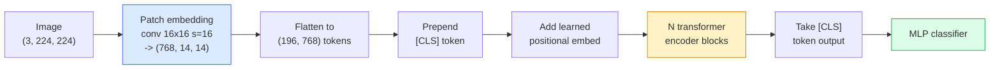

# 视觉 Transformer（ViT）

> 把图像切成 patch，把每个 patch 当作一个词，然后运行一个标准 transformer。别回头。

**类型：** Build
**语言：** Python
**前置知识：** Phase 7 Lesson 02（Self-Attention），Phase 4 Lesson 04（Image Classification）
**时长：** ~45 分钟

## 学习目标

- 从零实现 patch embedding、可学习位置嵌入、class token 和 transformer encoder block，构建一个最小化的 ViT
- 解释为什么人们曾认为 ViT 需要海量预训练数据，直到 DeiT 和 MAE 证明了并非如此
- 比较 ViT、Swin 和 ConvNeXt 的架构先验（无先验、局部窗口注意力、卷积骨干）
- 使用 `timm` 和标准的 linear-probe / fine-tune 流程，在小型数据集上微调一个预训练 ViT

## 问题背景

十年来，卷积几乎就是计算机视觉的代名词。CNN 拥有强大的归纳偏置——局部性、平移等变性——没人认为这些可以被取代。然后 Dosovitskiy 等人（2020）证明，一个直接应用于展平图像 patch 的朴素 transformer，完全不需要任何卷积机制，就能在规模足够时匹配甚至超越最强的 CNN。

关键在于“规模足够”。仅在 ImageNet-1k 上训练的 ViT 输给了 ResNet。但在 ImageNet-21k 或 JFT-300M 上预训练、再在 ImageNet-1k 上微调的 ViT 则能取胜。结论是：transformer 缺乏有用的先验，但只要有足够多的数据就能学会。后续工作（DeiT、MAE、DINO）表明，配合正确的训练配方——强增强、自监督预训练、蒸馏——ViT 也可以在小型数据上训练得很好。

到 2026 年，纯 CNN 在边缘设备上仍有竞争力（ConvNeXt 是最强的），但 transformer 主导了其他所有领域：分割（Mask2Former、SegFormer）、检测（DETR、RT-DETR）、多模态（CLIP、SigLIP）、视频（VideoMAE、VJEPA）。ViT 的 block 结构是必须掌握的基础。

## 核心概念

### 整体流程



七个步骤。Patch → token → attention → classifier。每一个变体（DeiT、Swin、ConvNeXt、MAE 预训练）都只改动其中一两个步骤，其余保持不变。

### Patch embedding

第一个卷积是关键。卷积核大小 16，步幅 16，因此一张 224×224 的图像变成 14×14 的 16×16 patch 网格，每个 patch 被投影为 768 维的嵌入。这一个卷积同时完成了 patch 化和线性投影。

```
Input:  (3, 224, 224)
Conv (3 -> 768, k=16, s=16, no padding):
Output: (768, 14, 14)
Flatten spatial: (196, 768)
```

196 个 patch = 196 个 token。每个 token 的特征维度为 768（ViT-B）、1024（ViT-L）或 1280（ViT-H）。

### Class token

一个可学习的向量被拼接到序列开头：

```
tokens = [CLS; patch_1; patch_2; ...; patch_196]   shape (197, 768)
```

经过 N 个 transformer block 后，`[CLS]` 的输出就是全局图像表示。分类头只读取这一个向量。

### Positional embedding

Transformer 本身没有空间位置的概念。给每个 token 加上一个可学习的向量：

```
tokens = tokens + learned_pos_embedding   (also shape (197, 768))
```

这个嵌入是模型的参数；基于梯度的训练会把它适应到二维图像结构上。也存在正弦二维的替代方案，但实践中很少使用。

### Transformer encoder block

标准的结构。多头自注意力、MLP、残差连接、前置 LayerNorm。

```
x = x + MSA(LN(x))
x = x + MLP(LN(x))

MLP is two-layer with GELU: Linear(d -> 4d) -> GELU -> Linear(4d -> d)
```

ViT-B/16 堆叠 12 个这样的 block，每个 block 12 个注意力头，总共 8600 万参数。

### 为什么用 Pre-LN

早期 transformer 使用 post-LN（`x = LN(x + sublayer(x))`），超过 6-8 层后没有 warmup 就难以训练。Pre-LN（`x = x + sublayer(LN(x))`）能稳定地训练更深的网络，无需 warmup。现在所有 ViT 和现代 LLM 都使用 pre-LN。

### Patch size 的权衡

- 16×16 patch → 196 个 token，标准配置。
- 32×32 patch → 49 个 token，更快但分辨率更低。
- 8×8 patch → 784 个 token，更精细但 attention 的 O(n²) 成本急剧上升。

更大的 patch = 更少的 token = 更快但空间细节更少。SwinV2 在分层窗口中使用 4×4 的 patch。

### DeiT：在 ImageNet-1k 上训练 ViT 的配方

原始 ViT 需要 JFT-300M 才能打败 CNN。DeiT（Touvron 等人，2020）仅通过四项改动就在 ImageNet-1k 上把 ViT-B 训练到 81.8% 的 top-1 准确率：

1. 强增强：RandAugment、Mixup、CutMix、Random Erasing。
2. 随机深度（训练时随机丢弃整个 block）。
3. 重复增强（每个 batch 中同一张图片采样 3 次）。
4. 来自 CNN 教师的蒸馏（可选，可进一步提升准确率）。

所有现代 ViT 训练配方都源自 DeiT。

### Swin vs ConvNeXt

- **Swin**（Liu 等人，2021）—— 基于窗口的注意力。每个 block 在局部窗口内做注意力；相邻 block 通过偏移窗口来混合跨窗口信息。在保留注意力操作的同时重新引入了类似 CNN 的局部性先验。
- **ConvNeXt**（Liu 等人，2022）—— 重新设计的 CNN，采用了与 Swin 类似的架构选择（depthwise 卷积、LayerNorm、GELU、倒置瓶颈）。证明差距并不在于“attention vs convolution”，而在于“现代训练配方 + 架构设计”。

到 2026 年，ConvNeXt-V2 和 Swin-V2 都达到了生产级水准；具体选择取决于你的推理栈（ConvNeXt 对边缘设备编译更友好）和预训练语料。

### MAE 预训练

Masked Autoencoder（He 等人，2022）：随机遮蔽 75% 的 patch，训练编码器只处理可见的 25%，再训练一个小型解码器从编码器输出中重建被遮蔽的 patch。预训练完成后丢弃解码器，只微调编码器。

MAE 让 ViT 仅凭 ImageNet-1k 就能训练，达到 SOTA，并成为当前默认的自监督预训练方案。

## 动手实现

### 步骤 1：Patch embedding

```python
import torch
import torch.nn as nn

class PatchEmbedding(nn.Module):
    def __init__(self, in_channels=3, patch_size=16, dim=192, image_size=64):
        super().__init__()
        assert image_size % patch_size == 0
        self.proj = nn.Conv2d(in_channels, dim, kernel_size=patch_size, stride=patch_size)
        num_patches = (image_size // patch_size) ** 2
        self.num_patches = num_patches

    def forward(self, x):
        x = self.proj(x)
        return x.flatten(2).transpose(1, 2)
```

一个卷积、一次展平、一次转置。这就是图像到 token 的全部过程。

### 步骤 2：Transformer block

Pre-LN、多头自注意力、带 GELU 的 MLP、残差连接。

```python
class Block(nn.Module):
    def __init__(self, dim, num_heads, mlp_ratio=4, dropout=0.0):
        super().__init__()
        self.ln1 = nn.LayerNorm(dim)
        self.attn = nn.MultiheadAttention(dim, num_heads, dropout=dropout, batch_first=True)
        self.ln2 = nn.LayerNorm(dim)
        self.mlp = nn.Sequential(
            nn.Linear(dim, dim * mlp_ratio),
            nn.GELU(),
            nn.Dropout(dropout),
            nn.Linear(dim * mlp_ratio, dim),
            nn.Dropout(dropout),
        )

    def forward(self, x):
        a, _ = self.attn(self.ln1(x), self.ln1(x), self.ln1(x), need_weights=False)
        x = x + a
        x = x + self.mlp(self.ln2(x))
        return x
```

`nn.MultiheadAttention` 负责拆分成头、缩放点积以及输出投影。`batch_first=True` 保证形状为 `(N, seq, dim)`。

### 步骤 3：完整的 ViT

```python
class ViT(nn.Module):
    def __init__(self, image_size=64, patch_size=16, in_channels=3,
                 num_classes=10, dim=192, depth=6, num_heads=3, mlp_ratio=4):
        super().__init__()
        self.patch = PatchEmbedding(in_channels, patch_size, dim, image_size)
        num_patches = self.patch.num_patches
        self.cls_token = nn.Parameter(torch.zeros(1, 1, dim))
        self.pos_embed = nn.Parameter(torch.zeros(1, num_patches + 1, dim))
        self.blocks = nn.ModuleList([
            Block(dim, num_heads, mlp_ratio) for _ in range(depth)
        ])
        self.ln = nn.LayerNorm(dim)
        self.head = nn.Linear(dim, num_classes)
        nn.init.trunc_normal_(self.pos_embed, std=0.02)
        nn.init.trunc_normal_(self.cls_token, std=0.02)

    def forward(self, x):
        x = self.patch(x)
        cls = self.cls_token.expand(x.size(0), -1, -1)
        x = torch.cat([cls, x], dim=1)
        x = x + self.pos_embed
        for blk in self.blocks:
            x = blk(x)
        x = self.ln(x[:, 0])
        return self.head(x)

vit = ViT(image_size=64, patch_size=16, num_classes=10, dim=192, depth=6, num_heads=3)
x = torch.randn(2, 3, 64, 64)
print(f"output: {vit(x).shape}")
print(f"params: {sum(p.numel() for p in vit.parameters()):,}")
```

约 280 万参数 —— 一个能在 CPU 上运行的小型 ViT。真正的 ViT-B 是 8600 万；同一个类定义，只需 `dim=768, depth=12, num_heads=12`。

### 步骤 4：合理性检查 —— 单张图像推理

```python
logits = vit(torch.randn(1, 3, 64, 64))
print(f"logits: {logits}")
print(f"probs:  {logits.softmax(-1)}")
```

应无报错运行。概率之和为 1。

## 使用现成模型

`timm` 提供了几乎所有 ViT 变体，并附带 ImageNet 预训练权重。一行代码：

```python
import timm

model = timm.create_model("vit_base_patch16_224", pretrained=True, num_classes=10)
```

`timm` 是 2026 年生产环境中使用 vision transformer 的默认选择。它在同一 API 下支持 ViT、DeiT、Swin、Swin-V2、ConvNeXt、ConvNeXt-V2、MaxViT、MViT、EfficientFormer 等数十种模型。

对于多模态任务（图像 + 文本），`transformers` 库提供了 CLIP、SigLIP、BLIP-2、LLaVA。这些模型的图像编码器都是 ViT 变体。

## 交付产物

本课产生：

- `outputs/prompt-vit-vs-cnn-picker.md` —— 一个根据数据集大小、计算资源和推理栈在 ViT、ConvNeXt 或 Swin 之间做选择的 prompt。
- `outputs/skill-vit-patch-and-pos-embed-inspector.md` —— 一个 skill，用于验证 ViT 的 patch embedding 和 positional embedding 形状是否与模型期望的序列长度一致，捕捉最常见的迁移 bug。

## 练习

1. **（简单）** 打印上述小型 ViT 前向传播过程中每个中间张量的形状。确认：输入 `(N, 3, 64, 64)` → patch `(N, 16, 192)` → 加上 CLS `(N, 17, 192)` → 分类器输入 `(N, 192)` → 输出 `(N, num_classes)`。
2. **（中等）** 在 Lesson 4 的 synthetic-CIFAR 数据集上微调一个预训练的 `timm` ViT-S/16。与在相同数据上微调的 ResNet-18 进行对比。报告训练时间和最终准确率。
3. **（困难）** 为小型 ViT 实现 MAE 预训练：遮蔽 75% 的 patch，训练编码器 + 小型解码器重建被遮蔽的 patch。评估预训练前后的 linear-probe 准确率。

## 关键术语

| 术语 | 通常的说法 | 实际含义 |
|------|-----------|---------|
| Patch embedding | “第一个卷积” | 卷积核大小 = 步幅 = patch 大小的卷积；把图像变成 token 嵌入网格 |
| Class token | “[CLS]” | 拼接到 token 序列开头的可学习向量；其最终输出是全局图像表示 |
| Positional embedding | “Learned pos” | 加到每个 token 上的可学习向量，让 transformer 知道每个 patch 来自哪里 |
| Pre-LN | “LayerNorm 在子层之前” | 更稳定的 transformer 变体：`x + sublayer(LN(x))`，而不是 `LN(x + sublayer(x))` |
| Multi-head attention | “并行注意力” | 标准 transformer 注意力被拆分为 num_heads 个独立子空间，最后再拼接 |
| ViT-B/16 | “Base, patch 16” | 经典规模：dim=768、depth=12、heads=12、patch_size=16、image=224；约 8600 万参数 |
| DeiT | “Data-efficient ViT” | 仅使用强增强在 ImageNet-1k 上训练的 ViT；证明大规模预训练数据集并非必需 |
| MAE | “Masked autoencoder” | 自监督预训练：遮蔽 75% 的 patch 并重建；当前主流的 ViT 预训练方案 |

## 延伸阅读

- [An Image is Worth 16x16 Words (Dosovitskiy et al., 2020)](https://arxiv.org/abs/2010.11929) —— ViT 论文
- [DeiT: Data-efficient Image Transformers (Touvron et al., 2020)](https://arxiv.org/abs/2012.12877) —— 如何仅在 ImageNet-1k 上训练 ViT
- [Masked Autoencoders are Scalable Vision Learners (He et al., 2022)](https://arxiv.org/abs/2111.06377) —— MAE 预训练
- [timm documentation](https://huggingface.co/docs/timm) —— 生产环境中会用到的所有 vision transformer 的参考文档
