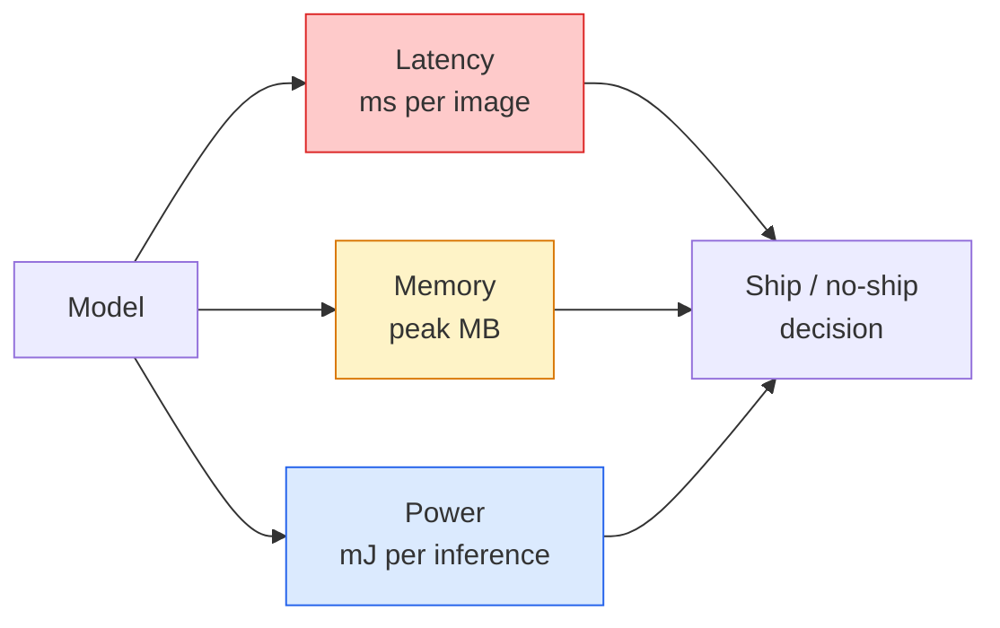

# 实时视觉 —— 边缘部署

> 边缘推理是一门让 90% 准确率的模型在仅有 2 GB 内存的设备上以 30 fps 运行的学问。每一点准确率都要用毫秒级延迟来交换。

**类型：** 学习 + 实践
**语言：** Python
**前置知识：** 阶段 4 第 04 课（图像分类）、阶段 10 第 11 课（量化）
**时间：** 约 75 分钟

## 学习目标

- 测量任意 PyTorch 模型的推理延迟、峰值内存和吞吐，并理解 FLOPs / 参数量 / 延迟之间的权衡
- 使用 PyTorch 训练后量化将视觉模型量化为 INT8，并验证精度损失 < 1%
- 导出为 ONNX 并使用 ONNX Runtime 或 TensorRT 编译；说出三种最常见的导出失败及修复方法
- 解释在边缘约束下如何选择 MobileNetV3、EfficientNet-Lite、ConvNeXt-Tiny 或 MobileViT

## 问题背景

训练时的视觉模型是一个浮点数巨兽。1 亿参数、每次前向 10 GFLOPs、2 GB 显存。这些都无法塞进手机、车载信息娱乐系统、工业相机或无人机。要交付视觉系统，就得把同样的预测能力压缩到 1/100 的预算里。

三个旋钮承担了大部分工作：模型选择（使用相同训练配方但更小的架构）、量化（用 INT8 替代 FP32）和推理运行时（ONNX Runtime、TensorRT、Core ML、TFLite）。把它们调好，就决定了你的是只能在工作站运行的演示，还是能装进 30 美元相机模块的产品。

本课首先建立测量规范（无法测量就无法优化），然后逐一讲解这三个旋钮。目标不是学会每一个边缘运行时，而是知道有哪些杠杆，以及如何验证每一个都如你所愿。

## 核心概念

### 三项预算



- **延迟**：p50、p95、p99。只看平均 p50 会掩盖实时系统真正关心的尾部行为。
- **峰值内存**：设备实际看到的最大值，而不是稳态平均值。对嵌入式目标很重要，因为内存溢出是致命的。
- **功耗 / 能耗**：电池供电设备上每次推理的毫焦耳。通常用 CPU/GPU 利用率 × 时间来近似。

一张（模型、延迟、内存、准确率）对照表就是边缘部署决策的依据。每个单元格都要在目标设备上测量，而不是在工作站上。

### 测量规范

每次边缘侧性能分析都应遵循三条规则：

1. **预热**：测量前先用 5–10 次虚拟前向传播预热模型。冷缓存和 JIT 编译会产生不具代表性的首次数据。
2. **同步**：在计时块前后调用 `torch.cuda.synchronize()` 同步 GPU 任务。否则你测量的是内核调度时间，而不是内核执行时间。
3. **固定输入尺寸**：使用生产分辨率。224×224 的延迟不是 512×512 的延迟。

### FLOPs 作为代理指标

FLOPs（每次推理的浮点运算次数）是一种便宜且与设备无关的延迟代理指标。适合架构比较，但作为绝对墙钟时间会误导。FLOPs 多 10% 的模型实际可能快 2 倍，因为它使用了对硬件友好的算子（深度可分离卷积编译效果好，大 7×7 卷积则不然）。

规则：用 FLOPs 做架构搜索，用设备上实测延迟做部署决策。

### 量化一句话

把 FP32 的权重和激活替换为 INT8。模型大小降为 1/4，内存带宽降为 1/4，在支持 INT8 核的硬件上计算量降为 1/2–1/4（每块现代移动 SoC、每块带 Tensor Core 的 NVIDIA GPU）。视觉任务上，训练后静态量化的精度损失通常在 0.1–1 个百分点。

类型：

- **动态量化** —— 权重量化到 INT8，激活仍以 FP 计算。简单，加速有限。
- **静态量化（训练后）** —— 权重 + 用小规模校准集校准激活范围。比动态量化快得多。
- **量化感知训练（QAT）** —— 训练时模拟量化，让模型学会适应。精度最好，需要标注数据。

对视觉任务，训练后静态量化（PTQ）能以 5% 的代价获得 95% 的收益。只有当 PTQ 的精度损失不可接受时才用 QAT。

### 剪枝与蒸馏

- **剪枝** —— 移除不重要的权重（幅度剪枝）或通道（结构化剪枝）。在过度参数化的模型上效果好；对已经紧凑的架构用处不大。
- **蒸馏** —— 训练一个小模型（学生）去模仿大模型（教师）的 logits。通常能恢复因缩小模型而损失的大部分精度。是生产级边缘模型的标准做法。

### 推理运行时

- **PyTorch eager** —— 慢，不用于部署。仅用于开发。
- **TorchScript** —— 旧方案。已被 `torch.compile` 和 ONNX 导出取代。
- **ONNX Runtime** —— 中立运行时。CPU、CUDA、CoreML、TensorRT、OpenVINO 都有 ONNX 执行提供程序。从这里开始。
- **TensorRT** —— NVIDIA 的编译器。在 NVIDIA GPU（工作站和 Jetson）上延迟最低。可通过 ONNX Runtime 使用，也可独立使用。
- **Core ML** —— Apple 在 iOS/macOS 上的运行时。需要 `.mlmodel` 或 `.mlpackage`。
- **TFLite** —— Google 在 Android/ARM 上的运行时。需要 `.tflite`。
- **OpenVINO** —— Intel 在 CPU/VPU 上的运行时。需要 `.xml` + `.bin`。

实践中：PyTorch -> ONNX -> 根据目标选择运行时。ONNX 是通用语言。

### 边缘架构选择器

| 预算 | 模型 | 理由 |
|------|------|------|
| < 3M 参数 | MobileNetV3-Small | 到处都能编译，优秀基线 |
| 3–10M | EfficientNet-Lite-B0 | TFLite 上单位参数准确率最高 |
| 10–20M | ConvNeXt-Tiny | 单位参数准确率最高，对 CPU 友好 |
| 20–30M | MobileViT-S 或 EfficientViT | 具备 Transformer 的 ImageNet 准确率 |
| 30–80M | Swin-V2-Tiny | 若运行栈支持窗口注意力 |

除非有特殊原因，否则以上全部量化为 INT8。

## 动手实现

### 步骤 1：正确测量延迟

```python
import time
import torch

def measure_latency(model, input_shape, device="cpu", warmup=10, iters=50):
    model = model.to(device).eval()
    x = torch.randn(input_shape, device=device)
    with torch.no_grad():
        for _ in range(warmup):
            model(x)
        if device == "cuda":
            torch.cuda.synchronize()
        times = []
        for _ in range(iters):
            if device == "cuda":
                torch.cuda.synchronize()
            t0 = time.perf_counter()
            model(x)
            if device == "cuda":
                torch.cuda.synchronize()
            times.append((time.perf_counter() - t0) * 1000)
    times.sort()
    return {
        "p50_ms": times[len(times) // 2],
        "p95_ms": times[int(len(times) * 0.95)],
        "p99_ms": times[int(len(times) * 0.99)],
        "mean_ms": sum(times) / len(times),
    }
```

预热、同步、使用 `time.perf_counter()`。报告分位数，不要只报平均值。

### 步骤 2：参数量与 FLOP 统计

```python
def parameter_count(model):
    return sum(p.numel() for p in model.parameters())

def flops_estimate(model, input_shape):
    """
    Rough FLOP count for a conv/linear-only model. For production use `fvcore` or `ptflops`.
    """
    total = 0
    def conv_hook(m, inp, out):
        nonlocal total
        c_out, c_in, kh, kw = m.weight.shape
        h, w = out.shape[-2:]
        total += 2 * c_in * c_out * kh * kw * h * w
    def linear_hook(m, inp, out):
        nonlocal total
        total += 2 * m.in_features * m.out_features
    hooks = []
    for m in model.modules():
        if isinstance(m, torch.nn.Conv2d):
            hooks.append(m.register_forward_hook(conv_hook))
        elif isinstance(m, torch.nn.Linear):
            hooks.append(m.register_forward_hook(linear_hook))
    model.eval()
    with torch.no_grad():
        model(torch.randn(input_shape))
    for h in hooks:
        h.remove()
    return total
```

真实项目请使用 `fvcore.nn.FlopCountAnalysis` 或 `ptflops`；它们能正确处理所有模块类型。

### 步骤 3：训练后静态量化

```python
def quantise_ptq(model, calibration_loader, backend="x86"):
    import torch.ao.quantization as tq
    model = model.eval().cpu()
    model.qconfig = tq.get_default_qconfig(backend)
    tq.prepare(model, inplace=True)
    with torch.no_grad():
        for x, _ in calibration_loader:
            model(x)
    tq.convert(model, inplace=True)
    return model
```

三步：配置、准备（插入观察器）、用真实数据校准、转换（融合 + 量化）。要求模型已融合（`Conv -> BN -> ReLU` -> `ConvBnReLU`），`torch.ao.quantization.fuse_modules` 会处理。

### 步骤 4：导出为 ONNX

```python
def export_onnx(model, sample_input, path="model.onnx"):
    model = model.eval()
    torch.onnx.export(
        model,
        sample_input,
        path,
        input_names=["input"],
        output_names=["output"],
        dynamic_axes={"input": {0: "batch"}, "output": {0: "batch"}},
        opset_version=17,
    )
    return path
```

`opset_version=17` 是 2026 年的安全默认。`dynamic_axes` 让你可以用任意 batch size 运行 ONNX 模型。

### 步骤 5：基准测试并对比不同方案

```python
import torch.nn as nn
from torchvision.models import mobilenet_v3_small

def compare_regimes():
    model = mobilenet_v3_small(weights=None, num_classes=10)
    params = parameter_count(model)
    flops = flops_estimate(model, (1, 3, 224, 224))
    lat_fp32 = measure_latency(model, (1, 3, 224, 224), device="cpu")
    print(f"FP32 MobileNetV3-Small: {params:,} params  {flops/1e9:.2f} GFLOPs  "
          f"p50={lat_fp32['p50_ms']:.2f}ms  p95={lat_fp32['p95_ms']:.2f}ms")
```

对 `resnet50`、`efficientnet_v2_s` 和 `convnext_tiny` 运行相同函数，你就能得到部署决策所需的对比表。

## 实际使用

生产栈通常收敛为三条路径之一：

- **Web / 无服务器**：PyTorch -> ONNX -> ONNX Runtime（CPU 或 CUDA provider）。最简单，对大多数场景足够。
- **NVIDIA 边缘（Jetson、GPU 服务器）**：PyTorch -> ONNX -> TensorRT。延迟最低，工程投入最大。
- **移动端**：PyTorch -> ONNX -> Core ML（iOS）或 TFLite（Android）。导出前先量化。

测量工具方面，`torch-tb-profiler`、`nvprof` / `nsys`、macOS 上的 Instruments 可提供逐层分解。`benchmark_app`（OpenVINO）和 `trtexec`（TensorRT）提供独立 CLI 数据。

## 交付产物

本课产出：

- `outputs/prompt-edge-deployment-planner.md` —— 一个根据目标设备和延迟 SLA 选择骨干网络、量化策略和运行时的提示词
- `outputs/skill-latency-profiler.md` —— 一个可生成完整延迟基准测试脚本的技能，包括预热、同步、分位数和内存跟踪

## 练习

1. **（简单）** 在 CPU 上测量 `resnet18`、`mobilenet_v3_small`、`efficientnet_v2_s` 和 `convnext_tiny` 在 224×224 下的 p50 延迟。报告表格并指出哪个架构的“准确率 / 毫秒”最高。
2. **（中等）** 对 `mobilenet_v3_small` 应用训练后静态量化。报告 FP32 与 INT8 的延迟，以及在 CIFAR-10（或类似数据集）留出子集上的精度损失。
3. **（困难）** 将 `convnext_tiny` 导出为 ONNX，使用 `onnxruntime` 的 `CPUExecutionProvider` 运行，并与 PyTorch eager 基线比较延迟。找出 ONNX Runtime 首次变快的那一层并解释原因。

## 关键术语

| 术语 | 人们的说法 | 实际含义 |
|------|-----------|----------|
| Latency | "多快" | 从输入到输出的时间；用 p50/p95/p99 分位数，而非平均值 |
| FLOPs | "模型大小" | 每次前向的浮点运算次数；计算成本的粗略代理 |
| INT8 quantisation | "8-bit" | 用 8 位整数替换 FP32 权重/激活；约 4 倍更小，2–4 倍更快 |
| PTQ | "Post-training quantisation" | 不重新训练直接量化已训练模型；简单，通常够用 |
| QAT | "Quantisation-aware training" | 训练时模拟量化；精度最好，需要标注数据 |
| ONNX | "中立格式" | 所有主流推理运行时都支持的模型交换格式 |
| TensorRT | "NVIDIA 编译器" | 将 ONNX 编译为 NVIDIA GPU 优化引擎 |
| Distillation | "Teacher -> student" | 训练小模型模仿大模型 logits；能恢复大部分损失的精度 |

## 延伸阅读

- [EfficientNet (Tan & Le, 2019)](https://arxiv.org/abs/1905.11946) —— 高效架构的复合缩放
- [MobileNetV3 (Howard et al., 2019)](https://arxiv.org/abs/1905.02244) —— 移动优先架构，使用 h-swish 和 squeeze-excite
- [A Practical Guide to TensorRT Optimization (NVIDIA)](https://developer.nvidia.com/blog/accelerating-model-inference-with-tensorrt-tips-and-best-practices-for-pytorch-users/) —— 如何真正拿到论文里的吞吐数据
- [ONNX Runtime docs](https://onnxruntime.ai/docs/) —— 量化、图优化、执行提供程序选择
