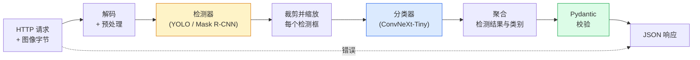

# 构建完整视觉流水线 — 课程设计

> 生产级视觉系统是由数据契约连接模型与规则所组成的链条。本阶段已经提供了所有组件；本课程设计将它们端到端地串联起来。

**类型：** 构建
**语言：** Python
**前置要求：** 第 4 阶段第 01-15 课
**时间：** ~120 分钟

## 学习目标

- 设计一个生产级视觉流水线：检测目标、对其进行分类，并输出结构化 JSON —— 同时处理所有失败路径
- 将检测器（Mask R-CNN 或 YOLO）、分类器（ConvNeXt-Tiny）和数据契约（Pydantic）整合到同一个服务中
- 对端到端流水线进行基准测试，找出首个瓶颈（通常是预处理，其次是检测器）
- 交付一个最小化的 FastAPI 服务：接收图像上传，运行流水线，返回带分类的检测结果

## 问题

单个视觉模型很有用；视觉产品则是由它们串联而成。零售货架巡检 = 检测器 + 产品分类器 + 价格 OCR 流水线。自动驾驶 = 2D 检测器 + 3D 检测器 + 分割器 + 跟踪器 + 规划器。医学预筛查 = 分割器 + 区域分类器 + 医生界面。

将这些链条连接起来，是把机器学习原型与产品区分开的关键。模型之间的每一个接口都是新的 bug 来源。每一次坐标变换、每一次归一化、每一次掩码缩放，都是潜在的无声故障点。流水线有多强，取决于它最弱的接口。

本课程设计搭建最小可行流水线：检测 + 分类 + 结构化输出 + 服务层。第 4 阶段的其余内容都可以插入这个骨架：把 Mask R-CNN 换成 YOLOv8、增加 OCR 头、增加分割分支、增加跟踪器。架构稳定；组件可插拔。

## 概念

### 流水线



七个阶段。两个模型阶段计算开销大；其余五个阶段是 bug 的藏身之处。

### 使用 Pydantic 定义数据契约

每个模型边界都变成带类型的对象。这将无声失败转化为显式报错。

```
Detection(
    box: tuple[float, float, float, float],   # (x1, y1, x2, y2)，绝对像素坐标
    score: float,                              # [0, 1]
    class_id: int,                             # 来自检测器的标签映射
    mask: Optional[list[list[int]]],           # 若存在，则使用 RLE 编码
)

PipelineResult(
    image_id: str,
    detections: list[Detection],
    classifications: list[Classification],
    inference_ms: float,
)
```

当检测器返回的边界框格式是 `(cx, cy, w, h)` 而不是 `(x1, y1, x2, y2)` 时，Pydantic 会在边界处校验失败，让你立即发现问题，而不是去调试那个悄悄返回空区域的下游裁剪步骤。

### 延迟分布

在几乎所有视觉流水线中，都有三条规律：

1. **预处理通常是最大的单块开销。** 解码 JPEG、转换色彩空间、调整尺寸 —— 这些都是 CPU 密集型操作，却容易被遗忘。
2. **检测器占据绝大部分 GPU 时间。** 70-90% 的 GPU 时间花在检测前向传播上。
3. **后处理（NMS、RLE 编解码）在 GPU 上便宜，在 CPU 上昂贵。** 务必用实际目标硬件进行性能分析。

了解延迟分布，才能将优化变成一份有优先级的清单。

### 失败模式

- **空检测** —— 返回空列表，不要崩溃。记录日志。
- **越界边界框** —— 裁剪前先钳制到图像尺寸内。
- **过小的裁剪区域** —— 对小于分类器最小输入尺寸的框跳过分类。
- **损坏的上传** —— 返回带具体错误码的 400，而不是 500。
- **模型加载失败** —— 在服务启动时失败，而不是在第一个请求时失败。

生产级流水线应逐一处理这些情况，而不是用会掩盖失败的通用 `try/except`。每一种失败都应有明确的错误代码和响应。

### 批处理

生产级服务会同时服务多个客户端。跨请求批量处理检测和分类可以成倍提升吞吐量。代价是：等待批次填满会带来额外延迟。典型配置：最多收集 20 毫秒的请求，合并成批，处理，再分发响应。`torchserve` 和 `triton` 原生支持此功能；负载可预测的小型服务则会自行实现微批处理。

## 动手实现

### 步骤 1：数据契约

```python
from pydantic import BaseModel, Field
from typing import List, Optional, Tuple

class Detection(BaseModel):
    box: Tuple[float, float, float, float]
    score: float = Field(ge=0, le=1)
    class_id: int = Field(ge=0)
    mask_rle: Optional[str] = None


class Classification(BaseModel):
    detection_index: int
    class_id: int
    class_name: str
    score: float = Field(ge=0, le=1)


class PipelineResult(BaseModel):
    image_id: str
    detections: List[Detection]
    classifications: List[Classification]
    inference_ms: float
```

在任何严肃的流水线中，写这几秒钟的代码能省下整整一小时的调试时间。

### 步骤 2：最小化的 Pipeline 类

```python
import time
import numpy as np
import torch
from PIL import Image

class VisionPipeline:
    def __init__(self, detector, classifier, class_names,
                 device="cpu", min_crop=32):
        self.detector = detector.to(device).eval()
        self.classifier = classifier.to(device).eval()
        self.class_names = class_names
        self.device = device
        self.min_crop = min_crop

    def preprocess(self, image):
        """
        image: PIL.Image 或 np.ndarray (H, W, 3) uint8
        返回: 位于 device 上的 CHW float 张量
        """
        if isinstance(image, Image.Image):
            image = np.asarray(image.convert("RGB"))
        tensor = torch.from_numpy(image).permute(2, 0, 1).float() / 255.0
        return tensor.to(self.device)

    @torch.no_grad()
    def detect(self, image_tensor):
        return self.detector([image_tensor])[0]

    @torch.no_grad()
    def classify(self, crops):
        if len(crops) == 0:
            return []
        batch = torch.stack(crops).to(self.device)
        logits = self.classifier(batch)
        probs = logits.softmax(-1)
        scores, cls = probs.max(-1)
        return list(zip(cls.tolist(), scores.tolist()))

    def run(self, image, image_id="anonymous"):
        t0 = time.perf_counter()
        tensor = self.preprocess(image)
        det = self.detect(tensor)

        crops = []
        detections = []
        valid_indices = []
        for i, (box, score, cls) in enumerate(zip(det["boxes"], det["scores"], det["labels"])):
            x1, y1, x2, y2 = [max(0, int(b)) for b in box.tolist()]
            x2 = min(x2, tensor.shape[-1])
            y2 = min(y2, tensor.shape[-2])
            detections.append(Detection(
                box=(x1, y1, x2, y2),
                score=float(score),
                class_id=int(cls),
            ))
            if (x2 - x1) < self.min_crop or (y2 - y1) < self.min_crop:
                continue
            crop = tensor[:, y1:y2, x1:x2]
            crop = torch.nn.functional.interpolate(
                crop.unsqueeze(0),
                size=(224, 224),
                mode="bilinear",
                align_corners=False,
            )[0]
            crops.append(crop)
            valid_indices.append(i)

        class_preds = self.classify(crops)

        classifications = []
        for valid_idx, (cls_id, cls_score) in zip(valid_indices, class_preds):
            classifications.append(Classification(
                detection_index=valid_idx,
                class_id=int(cls_id),
                class_name=self.class_names[cls_id],
                score=float(cls_score),
            ))

        return PipelineResult(
            image_id=image_id,
            detections=detections,
            classifications=classifications,
            inference_ms=(time.perf_counter() - t0) * 1000,
        )
```

每个接口都带类型。每条失败路径都有明确的处理决策。

### 步骤 3：连接检测器与分类器

```python
from torchvision.models.detection import maskrcnn_resnet50_fpn_v2
from torchvision.models import convnext_tiny

# 使用 ImageNet 预训练权重，构建无需训练的真实流水线
detector = maskrcnn_resnet50_fpn_v2(weights="DEFAULT")
classifier = convnext_tiny(weights="DEFAULT")
class_names = [f"imagenet_class_{i}" for i in range(1000)]

pipe = VisionPipeline(detector, classifier, class_names)

# 使用合成图像进行冒烟测试
test_image = (np.random.rand(400, 600, 3) * 255).astype(np.uint8)
result = pipe.run(test_image, image_id="demo")
print(result.model_dump_json(indent=2)[:500])
```

### 步骤 4：FastAPI 服务

```python
from fastapi import FastAPI, UploadFile, HTTPException
from io import BytesIO

app = FastAPI()
pipe = None  # 在启动时初始化

@app.on_event("startup")
def load():
    global pipe
    detector = maskrcnn_resnet50_fpn_v2(weights="DEFAULT").eval()
    classifier = convnext_tiny(weights="DEFAULT").eval()
    pipe = VisionPipeline(detector, classifier, class_names=[f"c{i}" for i in range(1000)])

@app.post("/detect")
async def detect_endpoint(file: UploadFile):
    if file.content_type not in {"image/jpeg", "image/png", "image/webp"}:
        raise HTTPException(status_code=400, detail="unsupported image type")
    data = await file.read()
    try:
        img = Image.open(BytesIO(data)).convert("RGB")
    except Exception:
        raise HTTPException(status_code=400, detail="cannot decode image")
    result = pipe.run(img, image_id=file.filename or "upload")
    return result.model_dump()
```

使用 `uvicorn main:app --host 0.0.0.0 --port 8000` 运行。使用 `curl -F 'file=@dog.jpg' http://localhost:8000/detect` 测试。

### 步骤 5：对流水线进行基准测试

```python
import time

def benchmark(pipe, num_runs=20, image_size=(400, 600)):
    img = (np.random.rand(*image_size, 3) * 255).astype(np.uint8)
    pipe.run(img)  # warm up

    stages = {"preprocess": [], "detect": [], "classify": [], "total": []}
    for _ in range(num_runs):
        t0 = time.perf_counter()
        tensor = pipe.preprocess(img)
        t1 = time.perf_counter()
        det = pipe.detect(tensor)
        t2 = time.perf_counter()
        crops = []
        for box in det["boxes"]:
            x1, y1, x2, y2 = [max(0, int(b)) for b in box.tolist()]
            x2 = min(x2, tensor.shape[-1])
            y2 = min(y2, tensor.shape[-2])
            if (x2 - x1) >= pipe.min_crop and (y2 - y1) >= pipe.min_crop:
                crop = tensor[:, y1:y2, x1:x2]
                crop = torch.nn.functional.interpolate(
                    crop.unsqueeze(0), size=(224, 224), mode="bilinear", align_corners=False
                )[0]
                crops.append(crop)
        pipe.classify(crops)
        t3 = time.perf_counter()
        stages["preprocess"].append((t1 - t0) * 1000)
        stages["detect"].append((t2 - t1) * 1000)
        stages["classify"].append((t3 - t2) * 1000)
        stages["total"].append((t3 - t0) * 1000)

    for stage, times in stages.items():
        times.sort()
        print(f"{stage:12s}  p50={times[len(times)//2]:7.1f} ms  p95={times[int(len(times)*0.95)]:7.1f} ms")
```

CPU 上的典型输出：预处理约 3 毫秒，检测 300-500 毫秒，分类 20-40 毫秒，总计 350-550 毫秒。在 GPU 上，检测为 20-40 毫秒，而预处理和分类在相对占比上开始变得更加重要。

## 应用

生产模板最终都会收敛到相同结构，并额外包含：

- **模型版本控制** —— 始终在响应中记录模型名称和权重哈希。
- **单次请求 Trace ID** —— 记录每个请求的每个阶段耗时，从而将慢响应与具体阶段关联起来。
- **降级路径** —— 如果分类器超时，返回不带分类的检测结果，而不是让整个请求失败。
- **安全过滤器** —— NSFW / PII 过滤器在分类之后、响应离开服务之前运行。
- **批量端点** —— `/detect_batch` 接收图像 URL 列表以进行批量处理。

对于生产级部署，`torchserve`、`Triton Inference Server` 和 `BentoML` 开箱即用地处理批处理、版本控制、指标和健康检查。直接运行 `FastAPI` 适用于原型和小规模产品。

## 交付

本课产出：

- `outputs/prompt-vision-service-shape-reviewer.md` —— 一个提示词，用于审查视觉服务代码中的契约/响应形状违规，并指出第一个破坏性 bug。
- `outputs/skill-pipeline-budget-planner.md` —— 一项技能，给定目标延迟和吞吐量，为每个流水线阶段分配时间预算，并标记哪个阶段会首先超出预算。

## 练习

1. **（简单）** 在任意开放数据集的 10 张图像上运行流水线。报告每个阶段的平均耗时，以及每张图像检测框数量的分布。
2. **（中等）** 为 `Detection` 增加 mask 输出字段，并用 RLE 编码。验证即使对于包含 10 个目标的图像，JSON 也能保持在 1MB 以下。
3. **（困难）** 在分类器前增加一个微批处理器：最多收集 10 毫秒的裁剪区域，在一个 GPU 调用中完成分类，再按请求返回结果。测量在每秒 5 个并发请求时的吞吐量提升以及新增的延迟。

## 关键术语

| 术语 | 通常说法 | 实际含义 |
|------|----------------|----------------------|
| Pipeline | "系统" | 预处理、推理和后处理步骤的有序链条，每对步骤之间都有带类型的接口 |
| Data contract | "模式" | 每个阶段的输入和输出都必须符合的 Pydantic / dataclass 定义；在边界处捕获集成 bug |
| Preprocessing | "模型之前" | 解码、色彩转换、调整尺寸、归一化；通常是最大的 CPU 时间消耗 |
| Postprocessing | "模型之后" | NMS、掩码缩放、阈值处理、RLE 编码；在 GPU 上便宜，在 CPU 上昂贵 |
| Microbatcher | "收集后转发" | 等待固定时间窗口以聚合多个请求，并执行一次批量化前向传播的聚合器 |
| Trace ID | "请求 ID" | 在每个阶段都会记录的每次请求标识符，从而可以端到端追踪慢请求 |
| Failure code | "命名错误" | 每种失败类别对应的具体错误代码，而不是通用的 500；使客户端重试逻辑成为可能 |
| Health check | "就绪探针" | 一个轻量端点，报告服务是否可以响应；负载均衡器依赖于此 |

## 进一步阅读

- [Full Stack Deep Learning — Deploying Models](https://fullstackdeeplearning.com/course/2022/lecture-5-deployment/) —— 生产级机器学习部署的经典概述
- [BentoML docs](https://docs.bentoml.com) —— 提供服务框架，支持批处理、版本控制和指标
- [torchserve docs](https://pytorch.org/serve/) —— PyTorch 官方服务库
- [NVIDIA Triton Inference Server](https://developer.nvidia.com/triton-inference-server) —— 支持批处理和多模型的高吞吐量服务方案
