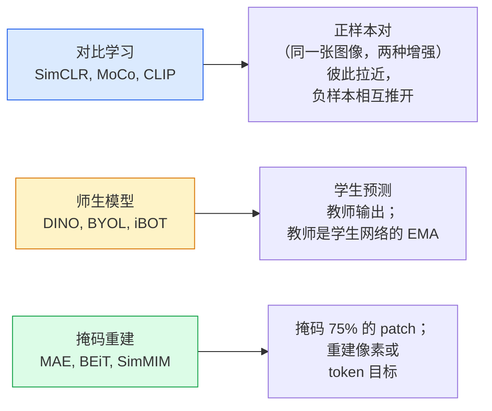

# 自监督视觉 —— SimCLR、DINO、MAE

> 标签是监督式视觉的瓶颈。自监督预训练摆脱标签：从 1 亿张无标签图像中学习视觉特征，再在 1 万张带标签图像上微调。

**类型：** Learn + Build
**语言：** Python
**前置课程：** Phase 4 Lesson 04（图像分类）、Phase 4 Lesson 14（ViT）
**时长：** 约 75 分钟

## 学习目标

- 梳理三大自监督流派——对比学习（SimCLR）、师生蒸馏（DINO）、掩码重建（MAE）——并说明各自优化的目标
- 从零实现 InfoNCE 损失，并解释为什么 batch size 为 512 时有效而 32 时失效
- 解释 MAE 75% 掩码比例并非随意设定，以及它与 BERT 15% 文本掩码的区别
- 使用 DINOv2 或 MAE 的 ImageNet 检查点进行线性探测和零样本检索

## 问题背景

监督式 ImageNet 拥有 130 万张带标签图像，据估计标注成本约为 1000 万美元。医疗和工业数据集规模更小，标注成本却更高。每个视觉团队都会问：能否先在廉价的无标签数据上预训练——YouTube 帧、网络爬虫图片、摄像头画面、卫星扫描图——然后再在小规模带标签数据集上微调？

自监督学习就是答案。在 LAION 或 JFT 上训练的现代自监督 ViT，经微调后能够达到甚至超越监督式 ImageNet 的精度，并且在下游任务（检测、分割、深度估计）上的迁移能力优于监督式预训练。DINOv2（Meta，2023）和 MAE（Meta，2022）是目前生产环境中可迁移视觉特征的默认选择。

概念上的转变在于：代理任务（pretext task）——即模型训练时执行的任务——不必与下游任务相同。关键在于它能否迫使模型学到有用的特征。预测灰度图像的颜色、旋转图像并让模型判断旋转角度、掩码 patch 后再重建——这些方法都曾奏效。其中能够规模化的是对比学习、师生蒸馏和掩码重建。

## 核心概念

### 三大流派



### 对比学习（SimCLR）

取一张图像，应用两种随机增强，得到两个视图。将两个视图输入同一个编码器和一个投影头。最小化一个损失函数，使其表达"这两个嵌入应该接近"，并且"该嵌入应该远离批次中其他图像的嵌入"。

```
Loss for positive pair (z_i, z_j) among 2N views per batch:

   L_ij = -log( exp(sim(z_i, z_j) / tau) / sum_k in batch \ {i} exp(sim(z_i, z_k) / tau) )

sim = cosine similarity
tau = temperature (0.1 standard)
```

这就是 InfoNCE 损失。每个正样本需要大量负样本，因此 batch size 很关键——SimCLR 需要 512–8192。MoCo 引入了动量队列来存储历史批次，从而将负样本数量与 batch size 解耦。

### 师生模型（DINO）

两个同架构网络：学生网络和教师网络。教师网络是学生网络权重的指数移动平均（EMA）。两者看到同一张图像的不同增强视图。训练目标是让学生网络的输出匹配教师网络的输出——没有显式负样本。

```
loss = CE( student_output(view_1),  teacher_output(view_2) )
     + CE( student_output(view_2),  teacher_output(view_1) )

teacher_weights = m * teacher_weights + (1 - m) * student_weights   (m ≈ 0.996)
```

为什么它不会坍塌成"预测常数"：教师网络的输出会经过中心化（减去每个维度的均值）和锐化（除以较小的温度）。中心化防止某一维度主导；锐化防止输出坍塌成均匀分布。

DINOv2 是 DINO 的规模化版本，在 1.42 亿张精选图像上训练。其生成的特征目前仍是零样本视觉检索和密集预测任务的最优选择。

### 掩码重建（MAE）

对 ViT 输入掩码 75% 的 patch，只将可见的 25% 输入编码器。一个较小的解码器接收编码器输出，并在被掩码位置加上掩码 token，然后训练它重建被掩码 patch 的像素。

```
Encoder:  visible 25% of patches -> features
Decoder:  features + mask tokens at masked positions -> reconstructed pixels
Loss:     MSE between reconstructed and original pixels on masked patches only
```

让 MAE 奏效的关键设计选择：

- **75% 掩码比例**——很高。这迫使编码器学习语义特征；如果只重建 25%，任务会过于简单（相邻像素相关性很强，CNN 就能轻松解决）。
- **非对称编码器/解码器**——大型 ViT 编码器只处理可见 patch；小型解码器（8 层、512 维）负责重建。预训练速度比朴素的 BEiT 快约 3 倍。
- **像素空间重建目标**——比 BEiT 的分词化目标更简单，在 ViT 上效果也更好。

预训练结束后，丢弃解码器，编码器即为特征提取器。

### 为什么是 75% 而不是 15%

BERT 掩码 15% 的 token。MAE 掩码 75%。差异在于信息密度。

- 自然语言每个 token 的熵很高。即使只预测 15% 的 token，任务仍然困难，因为每个被掩码位置都有多种合理补全。
- 图像 patch 的熵很低——未掩码的邻域往往几乎能确定被掩码 patch 的像素。要让预测任务需要语义理解，就必须激进地掩码。

75% 足够高，使得简单的空间外推无法解决任务；编码器必须表征图像内容。

### 线性探测评估

自监督预训练后，标准评估方式是**线性探测**：冻结编码器，在其顶部训练一个线性分类器，使用 ImageNet 标签，报告 top-1 准确率。

- SimCLR ResNet-50：约 71%（2020）
- DINO ViT-S/16：约 77%（2021）
- MAE ViT-L/16：约 76%（2022）
- DINOv2 ViT-g/14：约 86%（2023）

线性探测是特征质量的纯度量；微调通常会再提升 2–5 个百分点，但也会混入头部重训练的影响。

## 动手实现

### 步骤 1：双视图增强流水线

```python
import torch
import torchvision.transforms as T

two_view_train = lambda: T.Compose([
    T.RandomResizedCrop(96, scale=(0.2, 1.0)),
    T.RandomHorizontalFlip(),
    T.ColorJitter(0.4, 0.4, 0.4, 0.1),
    T.RandomGrayscale(p=0.2),
    T.ToTensor(),
])


class TwoViewDataset(torch.utils.data.Dataset):
    def __init__(self, base):
        self.base = base
        self.aug = two_view_train()

    def __len__(self):
        return len(self.base)

    def __getitem__(self, i):
        img, _ = self.base[i]
        v1 = self.aug(img)
        v2 = self.aug(img)
        return v1, v2
```

每个 `__getitem__` 返回同一张图像的两个增强视图；不需要标签。

### 步骤 2：InfoNCE 损失

```python
import torch.nn.functional as F

def info_nce(z1, z2, tau=0.1):
    """
    z1, z2: (N, D) L2-normalised embeddings of paired views
    """
    N, D = z1.shape
    z = torch.cat([z1, z2], dim=0)  # (2N, D)
    sim = z @ z.T / tau              # (2N, 2N)

    mask = torch.eye(2 * N, dtype=torch.bool, device=z.device)
    sim = sim.masked_fill(mask, float("-inf"))

    targets = torch.cat([torch.arange(N, 2 * N), torch.arange(0, N)]).to(z.device)
    return F.cross_entropy(sim, targets)
```

调用前对嵌入做 L2 归一化。`tau=0.1` 是 SimCLR 默认值；温度越低损失越尖锐，对负样本数量要求也越高。

### 步骤 3：InfoNCE 正确性检查

```python
z1 = F.normalize(torch.randn(16, 32), dim=-1)
z2 = z1.clone()
loss_same = info_nce(z1, z2, tau=0.1).item()
z2_random = F.normalize(torch.randn(16, 32), dim=-1)
loss_random = info_nce(z1, z2_random, tau=0.1).item()
print(f"InfoNCE with identical pairs:  {loss_same:.3f}")
print(f"InfoNCE with random pairs:     {loss_random:.3f}")
```

完全相同的样本对应给出较低损失（batch 较大且温度较低时接近 0）。随机样本对应应给出 log(2N-1) = ~log(31) = ~3.4（batch 为 16 对时）。

### 步骤 4：MAE 风格的掩码

```python
def random_mask_indices(num_patches, mask_ratio=0.75, seed=0):
    g = torch.Generator().manual_seed(seed)
    n_keep = int(num_patches * (1 - mask_ratio))
    perm = torch.randperm(num_patches, generator=g)
    visible = perm[:n_keep]
    masked = perm[n_keep:]
    return visible.sort().values, masked.sort().values


num_patches = 196
visible, masked = random_mask_indices(num_patches, mask_ratio=0.75)
print(f"visible: {len(visible)} / {num_patches}")
print(f"masked:  {len(masked)} / {num_patches}")
```

简单、快速，且给定种子可复现。真实 MAE 实现会对批次处理，并为每个样本保留各自的掩码。

## 实际应用

DINOv2 是 2026 年的生产环境标准：

```python
import torch
from transformers import AutoImageProcessor, AutoModel

processor = AutoImageProcessor.from_pretrained("facebook/dinov2-base")
model = AutoModel.from_pretrained("facebook/dinov2-base")
model.eval()

# Per-image embeddings for zero-shot retrieval
with torch.no_grad():
    inputs = processor(images=[pil_image], return_tensors="pt")
    outputs = model(**inputs)
    embedding = outputs.last_hidden_state[:, 0]  # CLS token
```

生成的 768 维嵌入是现代图像检索、密集匹配和零样本迁移流水线的骨干。在下游任务上微调通常只需加一个线性头。

对于图像-文本嵌入，可使用 SigLIP 或 OpenCLIP；对于 MAE 风格的微调，`timm` 仓库提供了所有 MAE 检查点。

## 交付产物

本节课产出：

- `outputs/prompt-ssl-pretraining-picker.md` —— 一个根据数据集规模、算力和下游任务选择 SimCLR / MAE / DINOv2 的提示词。
- `outputs/skill-linear-probe-runner.md` —— 一个为任意冻结编码器 + 带标签数据集编写线性探测评估的技能。

## 练习

1. **（简单）** 验证：对于对齐良好的嵌入，降低温度会使 InfoNCE 损失下降；对于随机嵌入，降低温度会使损失上升。绘制温度 `tau in [0.05, 0.1, 0.2, 0.5]` 与损失的关系图。
2. **（中等）** 实现一个 DINO 风格的中心缓冲。展示如果不做中心化，学生网络会在几个 epoch 内坍塌为常数向量。
3. **（困难）** 使用 Lesson 10 中的 TinyUNet 作为骨干，在 CIFAR-100 上训练 MAE。报告第 10、50、200 个 epoch 的线性探测准确率。证明在相同的 1,000 张图像子集上，MAE 预训练的线性探测优于从头训练的监督式线性探测。

## 关键术语

| 术语 | 大家的说法 | 实际含义 |
|------|------------|----------|
| Self-supervised | "无需标签" | 一种代理任务，从无标签数据中产生有用的表征 |
| Pretext task | "假任务" | 自监督预训练期间使用的目标（重建 patch、匹配视图）；预训练后丢弃 |
| Linear probe | "冻结编码器 + 线性头" | 自监督标准评估：只在冻结特征上训练一个线性分类器 |
| InfoNCE | "对比损失" | 对余弦相似度做 softmax；正样本对是目标类，其余都是负样本 |
| EMA teacher | "移动平均教师" | 教师网络权重是学生网络的指数移动平均；BYOL、MoCo、DINO 使用 |
| Mask ratio | "隐藏 patch 的百分比" | MAE 期间被掩码 patch 的比例；视觉 75%，文本 15% |
| Representation collapse | "常数输出" | 自监督失败：编码器对所有输入输出常数向量；通过中心化、锐化或负样本防止 |
| DINOv2 | "生产级 SSL 骨干" | Meta 2023 年的自监督 ViT；2026 年最强的通用图像特征 |

## 拓展阅读

- [SimCLR（Chen 等，2020）](https://arxiv.org/abs/2002.05709) —— 对比学习经典
- [DINO（Caron 等，2021）](https://arxiv.org/abs/2104.14294) —— 动量、中心化、锐化师生蒸馏
- [MAE（He 等，2022）](https://arxiv.org/abs/2111.06377) —— ViT 的掩码自编码器预训练
- [DINOv2（Oquab 等，2023）](https://arxiv.org/abs/2304.07193) —— 将自监督 ViT 扩展到生产级特征
