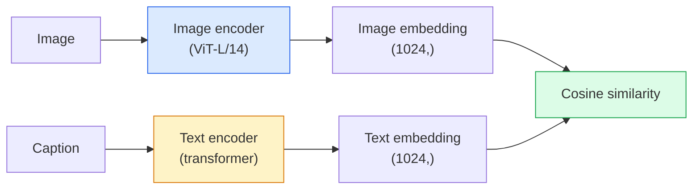

# 开放词汇视觉 — CLIP

> 同时训练一个图像编码器和一个文本编码器，让匹配的（图像，标题）对落在共享空间的同一点上。这就是全部诀窍。

**类型：** 构建 + 使用
**语言：** Python
**前置知识：** 阶段 4 第 14 课（ViT），阶段 4 第 17 课（自监督）
**时间：** ~45 分钟

## 学习目标

- 解释 CLIP 的双塔架构和对比训练目标
- 使用预训练 CLIP（或 SigLIP）进行零样本分类，无需任何任务特定训练
- 从零实现零样本分类：编码类别提示、计算余弦相似度、取 argmax
- 区分 CLIP、SigLIP、OpenCLIP 以及 LLaVA/LLaMA-vision 模型 —— 在 2026 年各自适用于什么场景

## 问题背景

传统分类器是封闭词汇的：一个 1000 类的 ImageNet 模型只能预测 1000 个标签。每个新类别都需要标注数据并重新训练分类头。

CLIP（Radford 等，OpenAI，2021）表明，在从网络抓取的 4 亿（图像，标题）对上训练，可以得到一个能够在推理时分类到任意类别集合的模型，而这些类别完全用自然语言描述。你只需写一句话就能给出一个新类别。

这种能力 —— 零样本迁移 —— 就是为什么每个现代视觉系统都以 CLIP 家族的检查点作为起点。检测（Grounding DINO、OWL-ViT）、分割（CLIPSeg、SAM）、检索、内容审核、视觉语言模型（VLM）以及文生图生成，都建立在 CLIP 风格的联合嵌入之上。

## 核心概念

### 双塔



两个编码器最后都通过线性投影映射到相同的嵌入维度（CLIP-B/32 为 512，CLIP-L/14 为 1024）。做 L2 归一化后计算余弦相似度。

### 训练目标

给定一个批次 N 个（图像，标题）对，构建一个 N×N 的相似度矩阵。训练两个编码器，使得对角线（匹配对）相似度高，非对角线（不匹配对）相似度低。

```
sim_matrix = image_embeddings @ text_embeddings.T / tau

loss_i2t = cross_entropy(sim_matrix,       targets=arange(N))
loss_t2i = cross_entropy(sim_matrix.T,     targets=arange(N))
loss = (loss_i2t + loss_t2i) / 2
```

这是对称的，因为图像到文本和文本到图像的检索都应该有效。`tau`（温度）通常作为一个可学习的标量参数，初始化为 0.07。

### SigLIP：更好的损失函数

SigLIP（Zhai 等，2023）将 softmax 替换为逐对的 sigmoid：

```
loss = mean over pairs of log(1 + exp(-y_ij * sim_ij))
y_ij = +1 if matching, -1 otherwise
```

逐对损失去除了 CLIP 所需的批次级归一化。SigLIP 在小批量下训练效果更好，在同等数据下达到或超过 CLIP 的表现。

### 零样本分类

给定一个训练好的 CLIP：

1. 对每个类别构造提示："a photo of a {class}"。
2. 用文本编码所有类别提示，得到 `T`，形状为 (C, d)。
3. 编码测试图像，得到 `I`，形状为 (1, d)。
4. 相似度 = `I @ T.T`，形状为 (1, C)。
5. 取 Argmax 得到预测类别。

提示工程很重要。OpenAI 发布了 80 个 ImageNet 提示模板（"a photo of a {}"、"a blurry photo of a {}"、"a sketch of a {}"、……）。对每个类别所有模板的嵌入取平均，可额外提升 1–3% 的 top-1 准确率。

### 2026 年 CLIP 风格模型的应用场景

- **零样本分类** —— 直接使用。
- **图像检索** —— 一次性编码所有图像，推理时嵌入查询文本。
- **文本条件检测** —— Grounding DINO、OWL-ViT 将 CLIP 文本塔包裹在检测器周围。
- **文本条件分割** —— CLIPSeg；SAM 通过 CLIP 接收文本提示输入。
- **视觉语言模型** —— LLaVA、Qwen-VL、InternVL 将 CLIP 家族的视觉编码器接入大语言模型。
- **文生图生成** —— Stable Diffusion、DALL-E 3 以 CLIP 文本嵌入作为条件。

一旦拥有了共享嵌入空间，每个视觉+语言任务都会变成距离计算。

## 动手实现

### 第 1 步：一个微型双塔模型

真实 CLIP 是 ViT + Transformer。本课为了便于在 CPU 上观察训练信号，双塔使用基于预提取特征的小型 MLP。

```python
import torch
import torch.nn as nn
import torch.nn.functional as F


class TwoTower(nn.Module):
    def __init__(self, img_in=128, txt_in=64, emb=64):
        super().__init__()
        self.image_proj = nn.Sequential(nn.Linear(img_in, 128), nn.ReLU(), nn.Linear(128, emb))
        self.text_proj = nn.Sequential(nn.Linear(txt_in, 128), nn.ReLU(), nn.Linear(128, emb))
        self.logit_scale = nn.Parameter(torch.ones([]) * 2.6592)  # ln(1/0.07)

    def forward(self, img_feats, txt_feats):
        i = F.normalize(self.image_proj(img_feats), dim=-1)
        t = F.normalize(self.text_proj(txt_feats), dim=-1)
        return i, t, self.logit_scale.exp()
```

两个投影、共享维度输出、可学习温度。整体 API 与真实 CLIP 一致。

### 第 2 步：对比损失

```python
def clip_loss(image_emb, text_emb, logit_scale):
    N = image_emb.size(0)
    sim = logit_scale * image_emb @ text_emb.T
    targets = torch.arange(N, device=sim.device)
    l_i = F.cross_entropy(sim, targets)
    l_t = F.cross_entropy(sim.T, targets)
    return (l_i + l_t) / 2
```

对称。logit_scale 越大，softmax 越尖锐，模型越自信，但也更不稳定。

### 第 3 步：零样本分类器

```python
@torch.no_grad()
def zero_shot_classify(model, image_feats, class_text_feats, class_names):
    """
    image_feats:      (N, img_in)
    class_text_feats: (C, txt_in)   每个类别一个平均嵌入
    """
    i = F.normalize(model.image_proj(image_feats), dim=-1)
    t = F.normalize(model.text_proj(class_text_feats), dim=-1)
    sim = i @ t.T
    pred = sim.argmax(dim=-1)
    return [class_names[p] for p in pred.tolist()]
```

每一步一行代码。这正是生产级 CLIP 检查点使用的零样本流程。

### 第 4 步：合理性检查

```python
torch.manual_seed(0)
model = TwoTower()

img = torch.randn(8, 128)
txt = torch.randn(8, 64)
i, t, scale = model(img, txt)
loss = clip_loss(i, t, scale)
print(f"batch size: {i.size(0)}   loss: {loss.item():.3f}")
```

对于随机初始化的模型，损失应接近 `log(N) = log(8) = 2.08` —— 这是尚未学到任何结构时对称交叉熵目标的结果。

## 实际使用

OpenCLIP 是 2026 年的社区默认选择：

```python
import open_clip
import torch
from PIL import Image

model, _, preprocess = open_clip.create_model_and_transforms("ViT-B-32", pretrained="laion2b_s34b_b79k")
tokenizer = open_clip.get_tokenizer("ViT-B-32")

image = preprocess(Image.open("dog.jpg")).unsqueeze(0)
text = tokenizer(["a photo of a dog", "a photo of a cat", "a photo of a car"])

with torch.no_grad():
    image_features = model.encode_image(image)
    text_features = model.encode_text(text)
    image_features = image_features / image_features.norm(dim=-1, keepdim=True)
    text_features = text_features / text_features.norm(dim=-1, keepdim=True)
    probs = (100.0 * image_features @ text_features.T).softmax(dim=-1)

print(probs)
```

SigLIP 更新，在小规模下训练更好，适合新项目：`google/siglip-base-patch16-224`。Hugging Face 同时提供了两者。

## 交付成果

本课产出：

- `outputs/prompt-zero-shot-class-picker.md` —— 一个提示词，给定类别列表和领域，为零样本 CLIP 设计类别模板。
- `outputs/skill-image-text-retriever.md` —— 一项技能，使用任意 CLIP 检查点构建图像嵌入索引，支持文本搜图和以图搜图。

## 练习

1. **（简单）** 使用预训练的 OpenCLIP ViT-B/32，用 80 模板提示集在 CIFAR-10 上做零样本分类。报告 top-1 准确率；应约为 85–90%。
2. **（中等）** 在同一 CIFAR-10 任务上比较单模板（"a photo of a {}"）与 80 模板平均嵌入的效果。量化差距并解释为什么模板有帮助。
3. **（困难）** 构建一个零样本图像检索索引：用 CLIP 嵌入 1000 张图像，建立 FAISS 索引，用自然语言描述查询。为你手写的 20 个保留查询报告 recall@5。

## 关键术语

| 术语 | 人们常说 | 实际含义 |
|------|----------------|----------------------|
| 双塔 | "Dual encoder" | 独立的图像和文本编码器，最终通过共享维度的投影头输出 |
| 零样本 | "No task-specific training" | 在推理时仅通过文本描述的类别进行分类；不接触任何标签 |
| 温度 / logit_scale | "tau" | 在 softmax 前缩放相似度矩阵的可学习标量 |
| 提示模板 | "A photo of a {}" | 类别名称的自然语言包装；对多个模板取平均可提升零样本准确率 |
| CLIP | "Image+text model" | 2021 年 OpenAI 的模型；2026 年该领域的通用词汇 |
| SigLIP | "Sigmoid CLIP" | 用逐对 sigmoid 替代 softmax；在小批量下训练更好 |
| OpenCLIP | "Open reproduction" | 社区在 LAION 上训练的 CLIP 变体；开源流程的生产默认选择 |
| VLM | "Vision-language model" | CLIP 家族编码器 + 大语言模型，训练用于回答图像相关问题 |

## 延伸阅读

- [CLIP: Learning Transferable Visual Models from Natural Language Supervision (Radford et al., 2021)](https://arxiv.org/abs/2103.00020)
- [SigLIP: Sigmoid Loss for Language-Image Pre-Training (Zhai et al., 2023)](https://arxiv.org/abs/2303.15343)
- [OpenCLIP](https://github.com/mlfoundations/open_clip) —— 社区代码库
- [DINOv2 vs CLIP vs MAE: a features comparison](https://huggingface.co/blog/dinov2) —— 附带用例对比的 Hugging Face 指南
