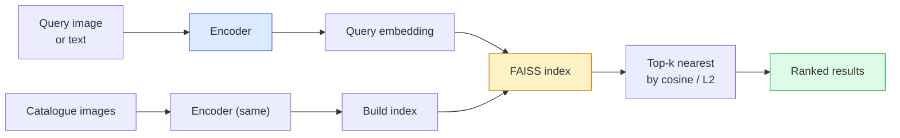

# 图像检索与度量学习

> 检索系统通过嵌入空间中的距离对候选样本进行排序。度量学习则是一门塑造该空间的学科，使这些距离能够表达你所期望的语义。

**类型：** Build
**语言：** Python
**前置：** 第 4 阶段第 14 课（ViT）、第 4 阶段第 18 课（CLIP）
**时长：** ~45 分钟

## 学习目标

- 解释 triplet、contrastive 与 proxy-based 三类度量学习损失，并能为给定数据集选择合适的损失
- 正确实现 L2 归一化与余弦相似度，并审视“同一件”与“同一类”检索之间的差异
- 构建 FAISS 索引，分别通过文本和图像进行查询，并在留出查询集上报告 recall@K
- 使用 DINOv2、CLIP 和 SigLIP 作为现成嵌入骨干网络，并了解各自的优势场景

## 问题背景

检索在生产级视觉系统中无处不在：重复图像检测、反向图片搜索、视觉搜索（“找相似商品”）、人脸重识别、监控场景下的行人再识别，以及电商中的实例级匹配。产品层面始终只有一个问题：“给定这张查询图像，为我的商品目录排序。”

两个设计决策决定了整个系统：嵌入——由什么模型生成向量；索引——如何在大规模下寻找最近邻。到 2026 年，这两者都已成为基础设施级组件（DINOv2 负责嵌入，FAISS 负责索引），这就把真正的难点抬高了：难点在于为你的应用定义“什么算相似”，然后塑造嵌入空间，使距离与之匹配。

这种塑造就是度量学习。它是一门体量小但杠杆极高的学科。

## 核心概念

### 检索一览



### 四大损失家族

| 损失 | 所需输入 | 优点 | 缺点 |
|------|----------|------|------|
| **Contrastive** | (anchor, positive) + 负样本 | 简单，适用于任意成对标签 | 若无大量负样本则收敛慢 |
| **Triplet** | (anchor, positive, negative) | 直观；可直接控制 margin | 困难三元组挖掘开销大 |
| **NT-Xent / InfoNCE** | 成对样本 + 批次内挖掘的负样本 | 可扩展到大批量 | 需要大 batch 或动量队列 |
| **Proxy-based (ProxyNCA)** | 仅类别标签 | 快速、稳定、无需挖掘 | 在小数据集上可能过拟合到 proxy |

对于大多数生产场景，应先从预训练骨干网络开始，只有当现成嵌入在测试集上表现不佳时，才添加度量学习微调。

### Triplet 损失的形式化定义

```
L = max(0, ||f(a) - f(p)||^2 - ||f(a) - f(n)||^2 + margin)
```

将 anchor `a` 拉近 positive `p`，同时推离 negative `n`，并通过 `margin` 保证二者之间存在一定的间隔。这种“三张图像”的结构可以推广到任意相似性排序。

挖掘方式至关重要：简单三元组（`n` 已经离 `a` 很远）对损失无贡献；只有困难三元组才能让网络学到东西。半困难挖掘（`n` 比 `p` 更远，但仍处于 margin 内）是 2016 年 FaceNet 的做法，至今仍是主流。

### 余弦相似度 vs L2

两种度量，两套约定：

- **Cosine**：向量夹角。要求嵌入经过 L2 归一化。
- **L2**：欧氏距离。可用于原始或归一化后的嵌入，但通常与 L2 归一化 + 平方 L2 配对使用。

对于大多数现代网络，二者是等价的：当 `||a|| = ||b|| = 1` 时，`||a - b||^2 = 2 - 2 cos(a, b)`。请选择与你嵌入训练方式相匹配的约定；混用它们会悄然改变“最近”的含义。

### Recall@K

标准的检索指标：

```
recall@K = 至少有一个正确匹配出现在前 K 个结果中的查询比例
```

同时报告 recall@1、@5、@10。若 recall@10 高于 0.95 而 recall@1 低于 0.5，说明嵌入空间结构正确，但排序存在噪声——可尝试更长时间的微调或增加重排序步骤。

对于重复检测，precision@K 更重要，因为每个假阳性都是用户可见的错误。对于视觉搜索，recall@K 才是产品层面的信号。

### FAISS 简介

Facebook AI Similarity Search。它是最近邻搜索的事实标准库。三种索引选择：

- `IndexFlatIP` / `IndexFlatL2` —— 暴力搜索、精确、无需训练。适用于约 100 万向量以内。
- `IndexIVFFlat` —— 将空间划分为 K 个单元，只搜索最接近的几个单元。近似、快速、需要训练数据。
- `IndexHNSW` —— 基于图结构，多次查询时最快，索引体积较大。

对于 10 万向量，通常使用基于余弦相似度的 `IndexFlatIP`。对于 1000 万向量，使用 `IndexIVFFlat`。对于 1 亿以上向量，则结合乘积量化（`IndexIVFPQ`）。

### 实例级 vs 类别级检索

同名但本质迥异的两类问题：

- **类别级** —— “在目录里找猫。”基于类别的相似性；现成的 CLIP / DINOv2 嵌入效果较好。
- **实例级** —— “在目录里找到*这款具体商品*。”需要对同类中外观相似的物体进行细粒度区分；现成嵌入表现不佳；度量学习微调至关重要。

在选择模型之前，务必先明确自己解决的是哪一类问题。

## 动手实现

### 步骤 1：Triplet 损失

```python
import torch
import torch.nn.functional as F

def triplet_loss(anchor, positive, negative, margin=0.2):
    d_ap = F.pairwise_distance(anchor, positive, p=2)
    d_an = F.pairwise_distance(anchor, negative, p=2)
    return F.relu(d_ap - d_an + margin).mean()
```

一行实现。适用于 L2 归一化或原始嵌入。

### 步骤 2：半困难负样本挖掘

给定一个批次的嵌入和标签，为每个 anchor 找到最难的半困难负样本。

```python
def semi_hard_negatives(emb, labels, margin=0.2):
    dist = torch.cdist(emb, emb)
    same_class = labels[:, None] == labels[None, :]
    diff_class = ~same_class
    N = emb.size(0)

    positives = dist.clone()
    positives[~same_class] = float("-inf")
    positives.fill_diagonal_(float("-inf"))
    pos_idx = positives.argmax(dim=1)

    semi_hard = dist.clone()
    semi_hard[same_class] = float("inf")
    d_ap = dist[torch.arange(N), pos_idx].unsqueeze(1)
    semi_hard[dist <= d_ap] = float("inf")
    neg_idx = semi_hard.argmin(dim=1)

    fallback_mask = semi_hard[torch.arange(N), neg_idx] == float("inf")
    if fallback_mask.any():
        hardest = dist.clone()
        hardest[same_class] = float("inf")
        neg_idx = torch.where(fallback_mask, hardest.argmin(dim=1), neg_idx)
    return pos_idx, neg_idx
```

每个 anchor 都会得到一个类内最困难的 positive，以及一个比 positive 更远但仍在 margin 内的半困难 negative。

### 步骤 3：Recall@K

```python
def recall_at_k(query_emb, gallery_emb, query_labels, gallery_labels, k=1):
    sim = query_emb @ gallery_emb.T
    _, top_k = sim.topk(k, dim=-1)
    matches = (gallery_labels[top_k] == query_labels[:, None]).any(dim=-1)
    return matches.float().mean().item()
```

在 L2 归一化嵌入上按内积取 top-k 等价于按余弦取 top-k。报告至少有一个正确邻居的查询所占的平均比例。

### 步骤 4：整合

```python
import torch
import torch.nn as nn
from torch.optim import Adam

class Encoder(nn.Module):
    def __init__(self, in_dim=128, emb_dim=64):
        super().__init__()
        self.net = nn.Sequential(
            nn.Linear(in_dim, 128), nn.ReLU(),
            nn.Linear(128, emb_dim),
        )

    def forward(self, x):
        return F.normalize(self.net(x), dim=-1)

torch.manual_seed(0)
num_classes = 6
protos = F.normalize(torch.randn(num_classes, 128), dim=-1)

def sample_batch(bs=32):
    labels = torch.randint(0, num_classes, (bs,))
    x = protos[labels] + 0.15 * torch.randn(bs, 128)
    return x, labels

enc = Encoder()
opt = Adam(enc.parameters(), lr=3e-3)

for step in range(200):
    x, y = sample_batch(32)
    emb = enc(x)
    pos_idx, neg_idx = semi_hard_negatives(emb, y)
    loss = triplet_loss(emb, emb[pos_idx], emb[neg_idx])
    opt.zero_grad(); loss.backward(); opt.step()
```

经过几百步训练后，嵌入簇会形成每个类一个簇。

## 应用实践

2026 年的生产级技术栈：

- **DINOv2 + FAISS** —— 通用视觉检索。开箱即用。
- **CLIP + FAISS** —— 查询为文本时使用。
- **Fine-tuned DINOv2 + FAISS** —— 实例级检索、人脸重识别、时尚与电商。
- **Milvus / Weaviate / Qdrant** —— 围绕 FAISS 或 HNSW 构建的托管向量数据库封装。

对于 SOTA 实例检索，标准配方是：以 DINOv2 为骨干，添加一个嵌入头，使用 triplet 或 InfoNCE 损失在带有实例标签的成对数据上微调，最后用 FAISS 建索引。

## 交付物

本节课产出：

- `outputs/prompt-retrieval-loss-picker.md` —— 一个 prompt，可针对给定检索问题选择 triplet / InfoNCE / ProxyNCA。
- `outputs/skill-recall-at-k-runner.md` —— 一个 skill，用于生成 recall@K 的整洁评估框架，包含 train/val/gallery 划分与明确的数据约定。

## 练习

1. **（简单）** 运行上述玩具示例。在训练前后用 PCA 绘制嵌入，观察六个簇的形成。
2. **（中等）** 添加 ProxyNCA 损失实现：每个类一个可学习的“proxy”，在余弦相似度上施加标准交叉熵。在玩具数据上比较其与 triplet 损失的收敛速度。
3. **（困难）** 取 1,000 张 ImageNet 验证图像，通过 HuggingFace 用 DINOv2 提取嵌入，构建 FAISS flat 索引，并以相同图像作为查询（结果应为 1.0）以及以 ImageNet 标签为真值的留出划分分别报告 recall@{1, 5, 10}。

## 关键术语

| 术语 | 通常说法 | 实际含义 |
|------|----------|----------|
| Metric learning | “塑造空间” | 训练编码器，使其输出空间中的距离反映目标相似性 |
| Triplet loss | “拉近、推远” | L = max(0, d(a, p) - d(a, n) + margin)；度量学习的经典损失 |
| Semi-hard mining | “有用的负样本” | 比 positive 离 anchor 更远但仍处于 margin 内的负样本；经验上信息量最大 |
| Proxy-based loss | “类别原型” | 每个类一个可学习的 proxy；对到 proxy 的相似度施加交叉熵；无需成对挖掘 |
| Recall@K | “前 K 命中率” | 前 K 个结果中至少有一个正确的查询比例 |
| Instance retrieval | “找到这个具体东西” | 细粒度匹配；现成特征通常表现不佳 |
| FAISS | “最近邻库” | Facebook 的最近邻库；支持精确与近似索引 |
| HNSW | “图索引” | Hierarchical Navigable Small World；快速近似最近邻，内存开销小 |

## 延伸阅读

- [FaceNet: A Unified Embedding for Face Recognition (Schroff et al., 2015)](https://arxiv.org/abs/1503.03832) —— triplet 损失与半困难挖掘的开创论文
- [In Defense of the Triplet Loss for Person Re-Identification (Hermans et al., 2017)](https://arxiv.org/abs/1703.07737) —— triplet 微调的实用指南
- [FAISS documentation](https://github.com/facebookresearch/faiss/wiki) —— 各种索引与权衡
- [SMoT: Metric Learning Taxonomy (Kim et al., 2021)](https://arxiv.org/abs/2010.06927) —— 现代损失及其关联的综述
