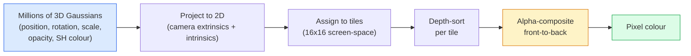

# 从零实现 3D Gaussian Splatting

> 场景是数百万个 3D 高斯组成的云。每个高斯都有位置、朝向、尺度、不透明度，以及一个随观察方向变化的颜色。对它们进行光栅化，再让梯度反向传播穿过光栅化过程，就完成了。

**类型：** 构建  
**语言：** Python  
**前置要求：** 第 4 阶段第 13 课（3D 视觉与 NeRF）、第 1 阶段第 12 课（张量运算）、第 4 阶段第 10 课（扩散基础，可选）  
**预计时长：** 约 90 分钟

## 学习目标

- 解释为什么到 2026 年，3D Gaussian Splatting 已取代 NeRF，成为照片级真实感 3D 重建的生产默认方案。
- 列出每个高斯的六个参数（位置、旋转四元数、尺度、不透明度、球谐颜色、可选特征）以及每个参数贡献的浮点数数量。
- 使用 `alpha` 合成从零实现一个 2D Gaussian Splatting 光栅化器，然后说明 3D 情况如何投影到同一个循环。
- 使用 `nerfstudio`、`gsplat` 或 `SuperSplat` 从 20–50 张照片重建一个场景，并导出到 glTF 的 `KHR_gaussian_splatting` 扩展或 OpenUSD 26.03 的 `UsdVolParticleField3DGaussianSplat` schema。

## 问题背景

NeRF 将场景存储为 MLP 的权重。渲染每个像素时，都要沿一条光线进行数百次 MLP 查询。训练需要数小时，渲染需要数秒，而且权重无法编辑——如果你想移动场景里的一把椅子，就必须重新训练。

3D Gaussian Splatting（Kerbl、Kopanas、Leimkühler、Drettakis，SIGGRAPH 2023）彻底改变了这一切。场景是一组显式的 3D 高斯。渲染通过 GPU 光栅化实现，速度可达 100+ fps。训练只需几分钟。编辑是直接操作：平移一部分高斯，椅子就被移动了。到 2026 年，Khronos Group 已批准 Gaussian splat 的 glTF 扩展，OpenUSD 26.03 内置了 Gaussian splat schema，Zillow 和 Apartments.com 用它渲染房产，大多数新的 3D 重建论文也都是 3DGS 核心思想的变体。

心智模型很简单，但数学上有足够多的环节，以至于大多数介绍都从光栅化开始，跳过投影和球谐函数。本课将完整构建——先做 2D 版本，再扩展到 3D。

## 核心概念

### 每个高斯携带的信息

一个 3D 高斯是空间中一个参数化的椭球体，具有以下属性：

```
position         mu         (3,)    centre in world coordinates
rotation         q          (4,)    unit quaternion encoding orientation
scale            s          (3,)    log-scales per axis (exponentiated at render time)
opacity          alpha      (1,)    post-sigmoid opacity [0, 1]
SH coefficients  c_lm       (3 * (L+1)^2,)   view-dependent colour
```

旋转 + 尺度构建出 3×3 协方差矩阵：`Sigma = R S S^T R^T`。这就是高斯在 3D 中的形状。球谐函数让颜色随观察方向变化——镜面高光、细微光泽、视角相关的辉光——而无需存储每视角纹理。使用 3 阶 SH，每个颜色通道有 16 个系数，每个高斯仅颜色就需要 48 个浮点数。

一个场景通常包含 100 万到 500 万个高斯。每个高斯大约存储 60 个浮点数（3 + 4 + 3 + 1 + 48 + 杂项）。一个 500 万高斯的场景约为 240 MB——远小于带每点纹理的等价点云，也比高分辨率重新渲染的 NeRF MLP 权重小一个数量级。

### 光栅化，而非光线步进



五个步骤，全部适合 GPU。每像素无需 MLP 查询。单张 RTX 3080 Ti 能以 147 fps 渲染 600 万个 splat。

### 投影步骤

位于世界坐标 `mu`、具有 3D 协方差 `Sigma` 的 3D 高斯，投影为屏幕坐标 `mu'` 处、具有 2D 协方差 `Sigma'` 的 2D 高斯：

```
mu' = project(mu)
Sigma' = J W Sigma W^T J^T          (2 x 2)

W = viewing transform (rotation + translation of camera)
J = Jacobian of the perspective projection at mu'
```

2D 高斯的足迹是一个椭圆，其轴为 `Sigma'` 的特征向量。椭圆内的每个像素都会收到该高斯的贡献，权重为 `exp(-0.5 * (p - mu')^T Sigma'^-1 (p - mu'))`。

### Alpha 合成规则

对于某个像素，覆盖它的所有高斯按从后向前排序（或等价地按从前向后并使用反向公式）。颜色合成采用与 1980 年代以来所有半透明光栅化器相同的方程：

```
C_pixel = sum_i alpha_i * T_i * c_i

T_i = prod_{j < i} (1 - alpha_j)       transmittance up to i
alpha_i = opacity_i * exp(-0.5 * d^T Sigma'^-1 d)   local contribution
c_i = eval_SH(SH_i, view_direction)    view-dependent colour
```

这**与 NeRF 的体渲染方程相同**，只是现在是在显式的稀疏高斯集合上，而不是沿光线的密集采样。正是因为这一等价性，渲染质量才能与 NeRF 媲美——两者都在积分同一个辐射场方程。

### 为何可微

投影、瓦片分配、alpha 合成、SH 求值——每一步都关于高斯参数可微。给定一张真实图像，计算渲染像素的损失，反向传播穿过光栅化器，通过梯度下降更新所有 `(mu, q, s, alpha, c_lm)`。经过约 30,000 次迭代，高斯会找到合适的位置、尺度和颜色。

### 致密化与剪枝

固定数量的高斯无法覆盖复杂场景。训练包含三种自适应机制：

- **克隆**——当某个高斯的梯度幅值很大但尺度很小时，在其当前位置克隆一个高斯：此处重建需要更多细节。
- **分裂**——当某个高斯的梯度很大且尺度较大时，将其分裂为两个更小的高斯：一个大的高斯过于平滑，无法拟合该区域。
- **剪枝**——删除不透明度低于阈值的高斯：它们没有贡献。

致密化每 N 次迭代运行一次。场景通常从约 10 万个初始高斯（由 SfM 点云生成）增长到训练结束时的 100 万到 500 万。

### 球谐函数一句话总结

视角相关颜色是单位球面上的函数 `c(direction)`。球谐函数是球面上的傅里叶基。截断到 `L` 阶，每个通道得到 `(L+1)^2` 个基函数。对新视角求颜色值，就是学习到的 SH 系数与在该视角方向求值的基函数之间的点积。0 阶 = 1 个系数 = 恒定颜色。3 阶 = 16 个系数 = 足以捕捉朗伯着色、镜面高光和轻微反射。SD Gaussian Splatting 论文默认使用 3 阶。

### 2026 年生产级流程

```
1. Capture         smartphone / DJI drone / handheld scanner
2. SfM / MVS       COLMAP or GLOMAP derives camera poses + sparse points
3. Train 3DGS      nerfstudio / gsplat / inria official / PostShot (~10-30 min on RTX 4090)
4. Edit            SuperSplat / SplatForge (clean floaters, segment)
5. Export          .ply -> glTF KHR_gaussian_splatting or .usd (OpenUSD 26.03)
6. View            Cesium / Unreal / Babylon.js / Three.js / Vision Pro
```

### 4D 与生成式变体

- **4D Gaussian Splatting**——高斯是时间的函数；用于体视频（Superman 2026、A$AP Rocky 的《Helicopter》）。
- **生成式 splat**——文本到 splat 的模型（World Labs 的 Marble），可幻觉出完整场景。
- **3D Gaussian Unscented Transform**——NVIDIA NuRec 用于自动驾驶模拟的变体。

## 动手实现

### 步骤 1：2D 高斯

我们先构建一个 2D 光栅化器。3D 情况在投影后会归约为它。

```python
import torch
import torch.nn as nn
import torch.nn.functional as F


def eval_2d_gaussian(means, covs, points):
    """
    means:  (G, 2)      centres
    covs:   (G, 2, 2)   covariance matrices
    points: (H, W, 2)   pixel coordinates
    returns: (G, H, W)  density at every pixel for every Gaussian
    """
    G = means.size(0)
    H, W, _ = points.shape
    flat = points.view(-1, 2)
    inv = torch.linalg.inv(covs)
    diff = flat[None, :, :] - means[:, None, :]
    d = torch.einsum("gpi,gij,gpj->gp", diff, inv, diff)
    density = torch.exp(-0.5 * d)
    return density.view(G, H, W)
```

`einsum` 对每一对（高斯，像素）计算二次型 `diff^T Sigma^-1 diff`。

### 步骤 2：2D Splatting 光栅化器

从前向后的 alpha 合成。2D 中的深度没有意义，因此我们用可学习的每个高斯标量来决定顺序。

```python
def rasterise_2d(means, covs, colours, opacities, depths, image_size):
    """
    means:     (G, 2)
    covs:      (G, 2, 2)
    colours:   (G, 3)
    opacities: (G,)     in [0, 1]
    depths:    (G,)     per-Gaussian scalar used for ordering
    image_size: (H, W)
    returns:   (H, W, 3) rendered image
    """
    H, W = image_size
    yy, xx = torch.meshgrid(
        torch.arange(H, dtype=torch.float32, device=means.device),
        torch.arange(W, dtype=torch.float32, device=means.device),
        indexing="ij",
    )
    points = torch.stack([xx, yy], dim=-1)

    densities = eval_2d_gaussian(means, covs, points)
    alphas = opacities[:, None, None] * densities
    alphas = alphas.clamp(0.0, 0.99)

    order = torch.argsort(depths)
    alphas = alphas[order]
    colours_sorted = colours[order]

    T = torch.ones(H, W, device=means.device)
    out = torch.zeros(H, W, 3, device=means.device)
    for i in range(means.size(0)):
        a = alphas[i]
        out += (T * a)[..., None] * colours_sorted[i][None, None, :]
        T = T * (1.0 - a)
    return out
```

速度不快——真实实现使用基于瓦片的 CUDA 核——但数学完全正确，并且完全可微。

### 步骤 3：可训练的 2D Splat 场景

```python
class Splats2D(nn.Module):
    def __init__(self, num_splats=128, image_size=64, seed=0):
        super().__init__()
        g = torch.Generator().manual_seed(seed)
        H, W = image_size, image_size
        self.means = nn.Parameter(torch.rand(num_splats, 2, generator=g) * torch.tensor([W, H]))
        self.log_scale = nn.Parameter(torch.ones(num_splats, 2) * math.log(2.0))
        self.rot = nn.Parameter(torch.zeros(num_splats))  # single angle in 2D
        self.colour_logits = nn.Parameter(torch.randn(num_splats, 3, generator=g) * 0.5)
        self.opacity_logit = nn.Parameter(torch.zeros(num_splats))
        self.depth = nn.Parameter(torch.rand(num_splats, generator=g))

    def covs(self):
        s = torch.exp(self.log_scale)
        c, si = torch.cos(self.rot), torch.sin(self.rot)
        R = torch.stack([
            torch.stack([c, -si], dim=-1),
            torch.stack([si, c], dim=-1),
        ], dim=-2)
        S = torch.diag_embed(s ** 2)
        return R @ S @ R.transpose(-1, -2)

    def forward(self, image_size):
        covs = self.covs()
        colours = torch.sigmoid(self.colour_logits)
        opacities = torch.sigmoid(self.opacity_logit)
        return rasterise_2d(self.means, covs, colours, opacities, self.depth, image_size)
```

`log_scale`、`opacity_logit` 和 `colour_logits` 都是无约束参数，在渲染时通过相应的激活函数映射。这是所有 3DGS 实现中的标准模式。

### 步骤 4：用 2D 高斯拟合目标图像

```python
import math
import numpy as np

def make_target(size=64):
    yy, xx = np.meshgrid(np.arange(size), np.arange(size), indexing="ij")
    img = np.zeros((size, size, 3), dtype=np.float32)
    # Red circle
    mask = (xx - 20) ** 2 + (yy - 20) ** 2 < 10 ** 2
    img[mask] = [1.0, 0.2, 0.2]
    # Blue square
    mask = (np.abs(xx - 45) < 8) & (np.abs(yy - 40) < 8)
    img[mask] = [0.2, 0.3, 1.0]
    return torch.from_numpy(img)


target = make_target(64)
model = Splats2D(num_splats=64, image_size=64)
opt = torch.optim.Adam(model.parameters(), lr=0.05)

for step in range(200):
    pred = model((64, 64))
    loss = F.mse_loss(pred, target)
    opt.zero_grad(); loss.backward(); opt.step()
    if step % 40 == 0:
        print(f"step {step:3d}  mse {loss.item():.4f}")
```

在 200 步内，64 个高斯会收敛成两个形状。这就是整个思想——在显式几何原语上做梯度下降。

### 步骤 5：从 2D 到 3D

3D 扩展保持相同的循环。新增内容：

1. 每个高斯的旋转从单个角度变为四元数。
2. 协方差为 `R S S^T R^T`，其中 `R` 由四元数构建，`S = diag(exp(log_scale))`。
3. 投影 `(mu, Sigma) -> (mu', Sigma')` 使用相机外参和透视投影在 `mu` 处的雅可比矩阵。
4. 颜色变为球谐展开；在观察方向上求值。
5. 深度排序使用相机空间的真实 z 值，而不是可学习的标量。

每个生产级实现（`gsplat`、`inria/gaussian-splatting`、`nerfstudio`）都在 GPU 上用基于瓦片的 CUDA 核做完全相同的事情。

### 步骤 6：球谐函数求值

3 阶以内的 SH 基每个通道有 16 项。求值如下：

```python
def eval_sh_degree_3(sh_coeffs, dirs):
    """
    sh_coeffs: (..., 16, 3)   last dim is RGB channels
    dirs:      (..., 3)       unit vectors
    returns:   (..., 3)
    """
    C0 = 0.282094791773878
    C1 = 0.488602511902920
    C2 = [1.092548430592079, 1.092548430592079,
          0.315391565252520, 1.092548430592079,
          0.546274215296039]
    x, y, z = dirs[..., 0], dirs[..., 1], dirs[..., 2]
    x2, y2, z2 = x * x, y * y, z * z
    xy, yz, xz = x * y, y * z, x * z

    result = C0 * sh_coeffs[..., 0, :]
    result = result - C1 * y[..., None] * sh_coeffs[..., 1, :]
    result = result + C1 * z[..., None] * sh_coeffs[..., 2, :]
    result = result - C1 * x[..., None] * sh_coeffs[..., 3, :]

    result = result + C2[0] * xy[..., None] * sh_coeffs[..., 4, :]
    result = result + C2[1] * yz[..., None] * sh_coeffs[..., 5, :]
    result = result + C2[2] * (2.0 * z2 - x2 - y2)[..., None] * sh_coeffs[..., 6, :]
    result = result + C2[3] * xz[..., None] * sh_coeffs[..., 7, :]
    result = result + C2[4] * (x2 - y2)[..., None] * sh_coeffs[..., 8, :]

    # degree 3 terms omitted here for brevity; full 16-coefficient version in the code file
    return result
```

学习到的 `sh_coeffs` 存储了该高斯“每个方向的颜色”。在渲染时，针对当前视角方向求值，得到一个 3 维 RGB 向量。

## 实际应用

对于真正的 3DGS 工作，使用 `gsplat`（Meta）或 `nerfstudio`：

```bash
pip install nerfstudio gsplat
ns-download-data example
ns-train splatfacto --data path/to/data
```

`splatfacto` 是 nerfstudio 的 3DGS 训练器。在 RTX 4090 上，一个典型场景的训练耗时 10–30 分钟。

2026 年重要的导出选项：

- `.ply`——原始高斯云（可移植，文件最大）。
- `.splat`——PlayCanvas / SuperSplat 量化格式。
- glTF `KHR_gaussian_splatting`——Khronos 标准，跨查看器可移植（2026 年 2 月 RC）。
- OpenUSD `UsdVolParticleField3DGaussianSplat`——原生 USD，用于 NVIDIA Omniverse 和 Vision Pro 流程。

对于 4D / 动态场景，`4DGS` 和 `Deformable-3DGS` 用随时间变化的位置和不透明度扩展了同一套机制。

## 交付成果

本课产出：

- `outputs/prompt-3dgs-capture-planner.md`——一个为给定场景类型规划拍摄会话（照片数量、相机路径、光照）的提示词。
- `outputs/skill-3dgs-export-router.md`——一个根据下游查看器或引擎选择正确导出格式（`.ply` / `.splat` / glTF / USD）的技能。

## 练习

1. **（简单）** 在不同的合成图像上运行上面的 2D splat 训练器。在 `[16, 64, 256]` 中调整 `num_splats`，并绘制每种设置下 MSE 随步数变化的曲线。找出收益递减点。
2. **（中等）** 扩展 2D 光栅化器，支持通过 2 阶谐波依赖于标量“视角角”的每个高斯 RGB 颜色。用一对目标图像训练，并验证模型能同时重建两者。
3. **（困难）** 克隆 `nerfstudio`，用 20 张你拥有的场景照片（书桌、植物、人脸、房间）训练 `splatfacto`。导出到 glTF `KHR_gaussian_splatting`，并在查看器中打开（Three.js `GaussianSplats3D`、SuperSplat、Babylon.js V9）。报告训练时间、高斯数量和渲染 fps。

## 关键术语

| 术语 | 人们的说法 | 实际含义 |
|------|------------|----------|
| 3DGS | "高斯 splats" | 将场景显式表示为数百万个带有位置、旋转、尺度、不透明度和 SH 颜色的 3D 高斯 |
| 协方差 | "高斯的形状" | `Sigma = R S S^T R^T`；单个高斯的朝向和各向异性尺度 |
| Alpha 合成 | "从后向前的混合" | 与 NeRF 体渲染相同的方程，只是作用在显式的稀疏集合上 |
| 致密化 | "克隆与分裂" | 在重建欠拟合区域自适应地增加新高斯 |
| 剪枝 | "删除低不透明度" | 移除训练过程中不透明度坍塌到接近零的高斯 |
| 球谐函数 | "视角相关颜色" | 球面上的傅里叶基；将颜色存储为观察方向的函数 |
| Splatfacto | "nerfstudio 的 3DGS" | 2026 年训练 3DGS 最简单的路径 |
| `KHR_gaussian_splatting` | "glTF 标准" | Khronos 2026 扩展，使 3DGS 跨查看器和引擎可移植 |

## 延伸阅读

- [3D Gaussian Splatting for Real-Time Radiance Field Rendering (Kerbl et al., SIGGRAPH 2023)](https://repo-sam.inria.fr/fungraph/3d-gaussian-splatting/) — 原始论文
- [gsplat (Meta/nerfstudio)](https://github.com/nerfstudio-project/gsplat) — 生产级 CUDA 光栅化器
- [nerfstudio Splatfacto](https://docs.nerf.studio/nerfology/methods/splat.html) — 参考训练方案
- [Khronos KHR_gaussian_splatting extension](https://github.com/KhronosGroup/glTF/blob/main/extensions/2.0/Khronos/KHR_gaussian_splatting/README.md) — 2026 年可移植格式
- [OpenUSD 26.03 release notes](https://openusd.org/release/) — `UsdVolParticleField3DGaussianSplat` schema
- [THE FUTURE 3D State of Gaussian Splatting 2026](https://www.thefuture3d.com/blog-0/2026/4/4/state-of-gaussian-splatting-2026) — 行业概览
