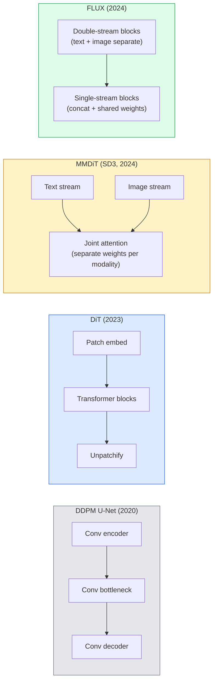

# 扩散Transformer与整流流（Rectified Flow）

> U-Net并非扩散模型的核心秘诀。把它换成Transformer，再把噪声调度换成一条直线路径，突然间你就得到了SD3、FLUX，以及所有2026年的文本生成图像模型。

**类型：** 学习 + 动手构建
**语言：** Python
**前置知识：** 第4阶段第10课（扩散DDPM）、第4阶段第14课（ViT）、第7阶段第02课（自注意力）
**时间：** 约75分钟

## 学习目标

- 追踪从U-Net DDPM（第10课）到扩散Transformer（DiT）、MMDiT（SD3），再到单流+双流DiT（FLUX）的演进
- 解释整流流：为什么噪声与数据之间的直线路径能让模型在20步而非1000步内完成采样
- 实现一个微型DiT块和一个整流流训练循环，均控制在100行以内
- 通过架构、参数量与许可证区分各模型变体（SD3、FLUX.1-dev、FLUX.1-schnell、Z-Image、Qwen-Image）

## 问题背景

第10课构建了一个以U-Net作为去噪器的DDPM。这一配方主导了2020至2023年：U-Net + beta调度 + 噪声预测损失。它催生了Stable Diffusion 1.5与2.1，以及DALL-E 2。

然而，每一个2026年的最先进的文本生成图像模型都已经超越了它。Stable Diffusion 3、FLUX、SD4、Z-Image、Qwen-Image、Hunyuan-Image——没有一个使用U-Net。它们都使用扩散Transformer（DiT）。SD3和FLUX还进一步将DDPM噪声调度替换为整流流，它把从噪声到数据的路径拉直，从而使一致性模型或蒸馏变体只需1-4步即可完成推理。

这一转变之所以重要，是因为它让基于扩散的图像生成变得可控、提示词更准确（SD3/SD4解决了文字渲染问题），并且达到了生产级速度。理解DiT + 整流流，就是理解2026年的生成式图像技术栈。

## 核心概念

### 从U-Net到Transformer



- **DiT**（Peebles & Xie, 2023）—— 将U-Net替换为类似ViT的Transformer，处理潜在空间中的图像块。通过自适应层归一化（AdaLN）进行条件注入。
- **MMDiT**（SD3, Esser et al., 2024）—— 文本和图像token拥有各自独立的权重流，并共享一个联合注意力机制。
- **FLUX**（Black Forest Labs, 2024）—— 前N个块为双流结构（与SD3类似），后面的块则将文本与图像拼接并使用共享权重（单流），以在更大深度下提升效率。
- **Z-Image**（2025）—— 一个高效的60亿参数单流DiT，挑战了"无条件堆规模"的观念。

### 一段话说清整流流

DDPM将前向过程定义为一个带噪声的随机微分方程（SDE），其中`x_t`逐渐被污染。学到的反向过程是另一个SDE，需要1000个小步来求解。

整流流定义了干净数据与纯噪声之间的**直线**插值：

```
x_t = (1 - t) * x_0 + t * epsilon,     t in [0, 1]
```

训练一个网络来预测速度 `v_theta(x_t, t) = epsilon - x_0` —— 即沿从干净数据到噪声的直线路径的前进方向（`dx_t/dt`）。采样时，将这个速度反向积分，从噪声一步步推向数据。得到的常微分方程（ODE）更接近一条直线，因此采样所需的积分步数大大减少。

SD3称其为**Rectified Flow Matching**。FLUX、Z-Image以及大多数2026年的模型都使用相同的目标函数。典型推理：20-30步Euler方法（确定性），而旧DDPM体制下需要50+步DDIM。蒸馏 / turbo / schnell / LCM变体进一步减少到1-4步。

### AdaLN条件注入

DiT通过**自适应层归一化（adaptive layer norm）**对时间步和类别/文本进行条件注入：从条件向量预测`scale`和`shift`，并在LayerNorm之后应用。这比U-Net中的FiLM式调制更简洁，也是所有现代DiT的默认做法。

```
cond -> MLP -> (scale, shift, gate)
norm(x) * (1 + scale) + shift, then residual add * gate
```

### SD3与FLUX的文本编码器

- **SD3**使用三个文本编码器：两个CLIP模型 + T5-XXL。嵌入被拼接后作为文本条件送入图像流。
- **FLUX**使用一个CLIP-L + T5-XXL。
- **Qwen-Image / Z-Image**变体使用与各自基础大语言模型对齐的自有文本编码器。

文本编码器是SD3/FLUX在提示词理解上远胜SD1.5的重要原因。仅T5-XXL就有47亿参数。

### 无分类器引导（CFG）仍然适用

整流流改变的是采样器，而非条件注入方式。无分类器引导（训练时以10%概率丢弃文本，推理时混合条件与无条件预测）在整流流中工作方式完全相同。大多数2026年的模型使用3.5-5的引导尺度——低于SD1.5的7.5，因为整流流模型默认更紧密地遵循提示词。

### Consistency、Turbo、Schnell、LCM

四个名字，同一个思路：把一个多步慢模型蒸馏成少步快模型。

- **LCM（Latent Consistency Model）** —— 训练一个学生网络，使其能从任意中间`x_t`一步预测最终`x_0`。
- **SDXL Turbo / FLUX schnell** —— 通过对抗性扩散蒸馏训练的1-4步模型。
- **SD Turbo** —— 将OpenAI风格的一致性模型适配到潜在扩散中。

任何新模型的生产部署都会同时发布一个"完整质量"检查点和一个"turbo / schnell"变体。Schnell（德语"快速"，Black Forest Labs的命名惯例）只需1-4步，适合实时流水线。

### 2026年的模型格局

| Model | Size | Architecture | License |
|-------|------|--------------|---------|
| Stable Diffusion 3 Medium | 2B | MMDiT | SAI Community |
| Stable Diffusion 3.5 Large | 8B | MMDiT | SAI Community |
| FLUX.1-dev | 12B | Double + Single Stream DiT | non-commercial |
| FLUX.1-schnell | 12B | same, distilled | Apache 2.0 |
| FLUX.2 | — | iterated FLUX.1 | mixed |
| Z-Image | 6B | S3-DiT (Scalable Single-Stream) | permissive |
| Qwen-Image | ~20B | DiT + Qwen text tower | Apache 2.0 |
| Hunyuan-Image-3.0 | ~80B | DiT | research |
| SD4 Turbo | 3B | DiT + distillation | SAI Commercial |

FLUX.1-schnell是2026年开源模型的默认选择。Z-Image是效率领导者。FLUX.2和SD4是当前质量的顶尖选手。

### 为什么这一范式转变意义重大

DDPM + U-Net有效。DiT + 整流流**效果更好、速度更快、扩展更干净**。这一转变堪比NLP中从RNN到Transformer的过渡：两种架构都能解决同一问题，但Transformer的可扩展性让它成为主流。2026年每一篇关于图像、视频或3D生成的论文都使用DiT形状的去噪器，并且通常采用整流流目标函数。U-Net DDPM现在主要用于教学目的（第10课）。

## 动手构建

### 第1步：带AdaLN的DiT块

```python
import torch
import torch.nn as nn


class AdaLNZero(nn.Module):
    """
    Adaptive LayerNorm with a gate. Predicts (scale, shift, gate) from the conditioning.
    Init such that the whole block starts as identity ("zero init").
    """

    def __init__(self, dim, cond_dim):
        super().__init__()
        self.norm = nn.LayerNorm(dim, elementwise_affine=False)
        self.mlp = nn.Linear(cond_dim, dim * 3)
        nn.init.zeros_(self.mlp.weight)
        nn.init.zeros_(self.mlp.bias)

    def forward(self, x, cond):
        scale, shift, gate = self.mlp(cond).chunk(3, dim=-1)
        h = self.norm(x) * (1 + scale.unsqueeze(1)) + shift.unsqueeze(1)
        return h, gate.unsqueeze(1)


class DiTBlock(nn.Module):
    def __init__(self, dim=192, heads=3, mlp_ratio=4, cond_dim=192):
        super().__init__()
        self.adaln1 = AdaLNZero(dim, cond_dim)
        self.attn = nn.MultiheadAttention(dim, heads, batch_first=True)
        self.adaln2 = AdaLNZero(dim, cond_dim)
        self.mlp = nn.Sequential(
            nn.Linear(dim, dim * mlp_ratio),
            nn.GELU(),
            nn.Linear(dim * mlp_ratio, dim),
        )

    def forward(self, x, cond):
        h, gate1 = self.adaln1(x, cond)
        a, _ = self.attn(h, h, h, need_weights=False)
        x = x + gate1 * a
        h, gate2 = self.adaln2(x, cond)
        x = x + gate2 * self.mlp(h)
        return x
```

`AdaLNZero`初始时是一个恒等映射，因为其MLP权重被初始化为零。训练会逐渐将块推离恒等映射；这极大地稳定了深层Transformer扩散模型。

### 第2步：一个微型DiT

```python
def timestep_embedding(t, dim):
    import math
    half = dim // 2
    freqs = torch.exp(-math.log(10000) * torch.arange(half, device=t.device) / half)
    args = t[:, None].float() * freqs[None]
    return torch.cat([args.sin(), args.cos()], dim=-1)


class TinyDiT(nn.Module):
    def __init__(self, image_size=16, patch_size=2, in_channels=3, dim=96, depth=4, heads=3):
        super().__init__()
        self.patch_size = patch_size
        self.num_patches = (image_size // patch_size) ** 2
        self.patch = nn.Conv2d(in_channels, dim, kernel_size=patch_size, stride=patch_size)
        self.pos = nn.Parameter(torch.zeros(1, self.num_patches, dim))
        self.time_mlp = nn.Sequential(
            nn.Linear(dim, dim * 2),
            nn.SiLU(),
            nn.Linear(dim * 2, dim),
        )
        self.blocks = nn.ModuleList([DiTBlock(dim, heads, cond_dim=dim) for _ in range(depth)])
        self.norm_out = nn.LayerNorm(dim, elementwise_affine=False)
        self.head = nn.Linear(dim, patch_size * patch_size * in_channels)

    def forward(self, x, t):
        n = x.size(0)
        x = self.patch(x)
        x = x.flatten(2).transpose(1, 2) + self.pos
        t_emb = self.time_mlp(timestep_embedding(t, self.pos.size(-1)))
        for blk in self.blocks:
            x = blk(x, t_emb)
        x = self.norm_out(x)
        x = self.head(x)
        return self._unpatchify(x, n)

    def _unpatchify(self, x, n):
        p = self.patch_size
        h = w = int(self.num_patches ** 0.5)
        x = x.view(n, h, w, p, p, -1).permute(0, 5, 1, 3, 2, 4).reshape(n, -1, h * p, w * p)
        return x
```

### 第3步：整流流训练

```python
import torch.nn.functional as F

def rectified_flow_train_step(model, x0, optimizer, device):
    model.train()
    x0 = x0.to(device)
    n = x0.size(0)
    t = torch.rand(n, device=device)
    epsilon = torch.randn_like(x0)
    x_t = (1 - t[:, None, None, None]) * x0 + t[:, None, None, None] * epsilon

    target_velocity = epsilon - x0
    pred_velocity = model(x_t, t)

    loss = F.mse_loss(pred_velocity, target_velocity)
    optimizer.zero_grad()
    loss.backward()
    optimizer.step()
    return loss.item()
```

与DDPM的噪声预测损失（第10课）对比：结构相同，目标不同。我们不是预测噪声`epsilon`，而是预测**速度**`epsilon - x_0`，它沿着直线插值从数据指向噪声。

### 第4步：Euler采样器

整流流是一个ODE。Euler方法是最简单的积分器，对于训练良好的整流流模型，在20步以上时几乎与高阶求解器一样准确。

```python
@torch.no_grad()
def rectified_flow_sample(model, shape, steps=20, device="cpu"):
    model.eval()
    x = torch.randn(shape, device=device)
    dt = 1.0 / steps
    t = torch.ones(shape[0], device=device)
    for _ in range(steps):
        v = model(x, t)
        x = x - dt * v
        t = t - dt
    return x
```

20步。在训练好的模型上，这能产生与1000步DDPM相当的样本。

### 第5步：端到端冒烟测试

```python
import numpy as np

def synthetic_blobs(num=200, size=16, seed=0):
    rng = np.random.default_rng(seed)
    out = np.zeros((num, 3, size, size), dtype=np.float32)
    yy, xx = np.meshgrid(np.arange(size), np.arange(size), indexing="ij")
    for i in range(num):
        cx, cy = rng.uniform(4, size - 4, size=2)
        r = rng.uniform(2, 4)
        mask = (xx - cx) ** 2 + (yy - cy) ** 2 < r ** 2
        colour = rng.uniform(-1, 1, size=3)
        for c in range(3):
            out[i, c][mask] = colour[c]
    return torch.from_numpy(out)
```

用整流流在这个数据集上训练一个`TinyDiT`。500步后，采样输出应该看起来像淡淡的彩色斑点。

## 实际使用

对于使用FLUX / SD3 / Z-Image的真实图像生成，`diffusers`库为每个模型都提供了统一的API：

```python
from diffusers import FluxPipeline, StableDiffusion3Pipeline
import torch

pipe = FluxPipeline.from_pretrained(
    "black-forest-labs/FLUX.1-schnell",
    torch_dtype=torch.bfloat16,
).to("cuda")

out = pipe(
    prompt="a golden retriever surfing a tsunami, hyperrealistic, studio lighting",
    guidance_scale=0.0,           # schnell was trained without CFG
    num_inference_steps=4,
    max_sequence_length=256,
).images[0]
out.save("surf.png")
```

三行代码，`FLUX.1-schnell`四步出图。把模型ID换成`black-forest-labs/FLUX.1-dev`即可在20-30步下获得更高质量，同时启用CFG。

对于SD3：

```python
pipe = StableDiffusion3Pipeline.from_pretrained(
    "stabilityai/stable-diffusion-3.5-large",
    torch_dtype=torch.bfloat16,
).to("cuda")
out = pipe(prompt, guidance_scale=3.5, num_inference_steps=28).images[0]
```

## 交付成果

本课产出：

- `outputs/prompt-dit-model-picker.md` —— 根据质量、延迟和许可证约束，在SD3、FLUX.1-dev、FLUX.1-schnell、Z-Image、SD4 Turbo之间做出选择。
- `outputs/skill-rectified-flow-trainer.md` —— 撰写一个包含AdaLN DiT和Euler采样的完整整流流训练循环。

## 练习题

1. **（简单）** 用上述TinyDiT在合成斑点数据集上训练500步。比较10步、20步和50步Euler采样的输出。
2. **（中等）** 添加文本/类别条件：将一个可学习的类别嵌入与时间嵌入拼接（10个按颜色区分的斑点"类别"）。分别用类别0、5、9采样，验证颜色是否匹配。
3. **（困难）** 计算同一规模网络在相同数据上训练相同步数后，整流流版本与DDPM版本生成样本之间的Fréchet距离（FID代理）。报告哪个收敛更快。

## 关键术语

| Term | What people say | What it actually means |
|------|----------------|----------------------|
| DiT | "Diffusion transformer" | Transformer that replaces the U-Net as the diffusion denoiser; operates on patchified latents |
| AdaLN | "Adaptive layer norm" | Timestep/text conditioning via learned scale, shift, gate applied after LayerNorm; standard in every modern DiT |
| MMDiT | "Multi-modal DiT (SD3)" | Separate weight streams for text and image tokens that share a joint self-attention |
| Single-stream / double-stream | "FLUX trick" | First N blocks double-stream (separate weights per modality), later blocks single-stream (concat + shared weights) for efficiency |
| Rectified flow | "Straight-line noise-to-data" | Linear interpolation between data and noise; network predicts velocity; fewer ODE steps needed at inference |
| Velocity target | "epsilon - x_0" | The regression target in rectified flow; points from clean data to noise |
| CFG guidance | "classifier-free guidance" | Mix conditional and unconditional predictions; still used in rectified-flow models |
| Schnell / turbo / LCM | "1-4 step distillation" | Small-step variants distilled from full-quality models; production real-time |

## 延伸阅读

- [Scalable Diffusion Models with Transformers (Peebles & Xie, 2023)](https://arxiv.org/abs/2212.09748) —— DiT论文
- [Scaling Rectified Flow Transformers (Esser et al., SD3 paper)](https://arxiv.org/abs/2403.03206) —— 大规模的MMDiT与整流流
- [FLUX.1 model card and technical report (Black Forest Labs)](https://huggingface.co/black-forest-labs/FLUX.1-dev) —— 双流+单流细节
- [Z-Image: Efficient Image Generation Foundation Model (2025)](https://arxiv.org/html/2511.22699v1) —— 60亿参数的单流DiT
- [Elucidating the Design Space of Diffusion (Karras et al., 2022)](https://arxiv.org/abs/2206.00364) —— 所有扩散模型设计权衡的参考
- [Latent Consistency Models (Luo et al., 2023)](https://arxiv.org/abs/2310.04378) —— LCM-LoRA如何实现4步推理
