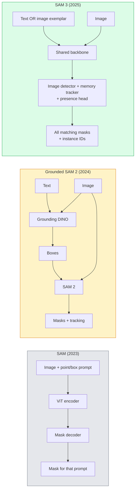

# SAM 3 与开放词汇分割

> 给模型一个文本提示和一张图像，就能获得所有匹配对象的掩码。SAM 3 让这一切只需一次前向传播。

**类型：** 使用 + 构建
**语言：** Python
**前置知识：** 第 4 阶段第 07 课（U-Net）、第 4 阶段第 08 课（Mask R-CNN）、第 4 阶段第 18 课（CLIP）
**时长：** 约 60 分钟

## 学习目标

- 区分 SAM（仅视觉提示）、Grounded SAM / SAM 2（检测器 + SAM）和 SAM 3（通过 Promptable Concept Segmentation 实现原生文本提示）
- 解释 SAM 3 的架构：共享主干网络 + 图像检测器 + 基于记忆的视频跟踪器 + 存在性头 + 解耦的检测器-跟踪器设计
- 使用 Hugging Face `transformers` 的 SAM 3 集成进行文本提示检测、分割和视频跟踪
- 根据延迟、概念复杂度和部署目标在 SAM 3、Grounded SAM 2、YOLO-World 和 SAM-MI 之间做出选择

## 问题背景

2023 年的 SAM 是一个仅接受视觉提示的模型：你点击一个点或画一个框，它返回一个掩码。要实现“把这张照片里所有橙子都给我”，你需要一个检测器（Grounding DINO）生成边界框，再用 SAM 逐个分割。Grounded SAM 把这一过程变成了流水线，但它是两个冻结模型的级联，错误会不可避免地累积。

SAM 3（Meta，2025 年 11 月，ICLR 2026）打破了这种级联。它接受一个短名词短语或图像示例作为提示，并在一次前向传播中返回所有匹配的掩码和实例 ID。这就是 **Promptable Concept Segmentation（PCS，可提示概念分割）**。结合 2026 年 3 月的 Object Multiplex 更新（SAM 3.1），它能高效跟踪视频中同一概念的多个实例。

本课关注的是这一变革带来的结构性转变。2D 分割、检测和文本-图像 grounding 已经融合为一个模型。工程上的问题不再是“我要把哪些流水线串联起来”，而是“哪个可提示模型能端到端地处理我的场景”。

## 核心概念

### 三代模型



### 可提示概念分割（Promptable Concept Segmentation）

“概念提示”是一个短名词短语（`"yellow school bus"`、`"striped red umbrella"`、`"hand holding a mug"`）或一张图像示例。模型会为图像中所有匹配该概念的实例返回分割掩码，并为每个匹配结果分配唯一的实例 ID。

这与经典的视觉提示 SAM 有三点不同：

1. 无需逐实例提示——一个文本提示即可返回所有匹配结果。
2. 开放词汇——概念可以是任何能用自然语言描述的事物。
3. 一次返回多个实例，而不是每个提示只返回一个掩码。

### 关键架构组件

- **共享主干网络**——一个 ViT 处理图像。检测器头和基于记忆的跟踪器都从中读取特征。
- **存在性头（Presence head）**——预测图像中是否根本存在该概念。将“这个在不在？”与“它在哪？”解耦。减少对不存在概念产生的误报。
- **解耦的检测器-跟踪器**——图像级检测和视频级跟踪使用独立的头，互不干扰。
- **记忆库（Memory bank）**——跨帧存储每个实例的特征以进行视频跟踪（SAM 2 使用的也是相同机制）。

### 大规模训练

SAM 3 在一个由数据引擎迭代生成并经过 AI + 人工审核的 **400 万个独立概念** 上训练。新的 **SA-CO 基准** 包含 27 万个独立概念，比此前的基准大 50 倍。SAM 3 在 SA-CO 上达到了人类水平的 75–80%，并在图像 + 视频 PCS 任务上将现有系统性能提升了一倍。

### SAM 3.1 Object Multiplex

2026 年 3 月更新：**Object Multiplex** 引入了一种共享内存机制，可同时联合跟踪同一概念的多个实例。此前，跟踪 N 个实例意味着 N 个独立的记忆库。Multiplex 将其压缩为一个共享内存，并通过每个实例的查询进行区分。结果：在不牺牲准确性的前提下，大幅提升了多目标跟踪速度。

### 2026 年 Grounded SAM 仍然重要的场景

- 当你需要替换特定的开放词汇检测器（DINO-X、Florence-2）时。
- 当 SAM 3 的许可证（在 Hugging Face 上受限）构成障碍时。
- 当你需要对检测器阈值进行比 SAM 3 所暴露的更精细控制时。
- 用于检测器组件的研究 / 消融实验。

模块化流水线仍有一席之地。但对于大多数生产工作，SAM 3 是更简单的答案。

### YOLO-World 与 SAM 3 对比

- **YOLO-World**——仅开放词汇检测器（无掩码）。实时运行。最适合需要高 fps 边界框的场景。
- **SAM 3**——完整的分割 + 跟踪。速度较慢，但输出更丰富。

生产中的分工：YOLO-World 用于仅需快速检测的流水线（机器人导航、快速仪表盘），SAM 3 用于任何需要掩码或跟踪的任务。

### SAM-MI 效率优化

SAM-MI（2025–2026）解决了 SAM 解码器的瓶颈。核心思路：

- **稀疏点提示**——使用少量精选点代替密集提示；将解码器调用减少 96%。
- **浅层掩码聚合**——将粗略的掩码预测合并为一个更清晰的掩码。
- **解耦掩码注入**——解码器接收预计算的掩码特征，而无需重新运行。

结果：在开放词汇基准上，比 Grounded-SAM 快约 1.6 倍。

### 三个模型的输出格式

三个模型都返回相同的通用结构（边界框 + 标签 + 分数 + 掩码 + ID），这很方便——下游流水线无需根据运行的是哪个模型而分支处理。

## 动手实现

### 步骤 1：提示构造

编写一个辅助函数，将用户输入的句子转换成 SAM 3 概念提示列表。这是“用户输入的内容”与“模型消费的内容”交汇的边界。

```python
def split_concepts(sentence):
    """
    Heuristic splitter for multi-concept prompts.
    Returns list of short noun phrases.
    """
    for sep in [",", ";", "and", "or", "&"]:
        if sep in sentence:
            parts = [p.strip() for p in sentence.replace("and ", ",").split(",")]
            return [p for p in parts if p]
    return [sentence.strip()]

print(split_concepts("cats, dogs and balloons"))
```

SAM 3 每次前向传播接受一个概念；对于多概念查询，需要循环或批量处理。

### 步骤 2：后处理辅助函数

将 SAM 3 的原始输出转换为我们第 4 阶段第 16 课流水线协议所规定的、格式干净的目标检测结果列表。

```python
from dataclasses import dataclass
from typing import List

@dataclass
class ConceptDetection:
    concept: str
    instance_id: int
    box: tuple          # (x1, y1, x2, y2)
    score: float
    mask_rle: str       # run-length encoded


def rle_encode(binary_mask):
    flat = binary_mask.flatten().astype("uint8")
    runs = []
    prev, count = flat[0], 0
    for v in flat:
        if v == prev:
            count += 1
        else:
            runs.append((int(prev), count))
            prev, count = v, 1
    runs.append((int(prev), count))
    return ";".join(f"{v}x{c}" for v, c in runs)
```

RLE 即使对大量高分辨率掩码也能保持响应负载很小。该格式在 SAM 2、SAM 3、Grounded SAM 2 之间通用。

### 步骤 3：统一的开放词汇分割接口

无论你使用哪种后端（SAM 3、Grounded SAM 2、YOLO-World + SAM 2），都用一个统一的方法封装起来。更换后端时，下游代码无需改动。

```python
from abc import ABC, abstractmethod
import numpy as np

class OpenVocabSeg(ABC):
    @abstractmethod
    def detect(self, image: np.ndarray, concept: str) -> List[ConceptDetection]:
        ...


class StubOpenVocabSeg(OpenVocabSeg):
    """
    Deterministic stub used for pipeline testing when real models are not loaded.
    """
    def detect(self, image, concept):
        h, w = image.shape[:2]
        return [
            ConceptDetection(
                concept=concept,
                instance_id=0,
                box=(w * 0.2, h * 0.3, w * 0.5, h * 0.8),
                score=0.89,
                mask_rle="0x100;1x50;0x200",
            ),
            ConceptDetection(
                concept=concept,
                instance_id=1,
                box=(w * 0.55, h * 0.25, w * 0.85, h * 0.75),
                score=0.74,
                mask_rle="0x80;1x40;0x220",
            ),
        ]
```

真正的 `SAM3OpenVocabSeg` 子类会封装 `transformers.Sam3Model` 和 `Sam3Processor`。

### 步骤 4：Hugging Face SAM 3 用法（参考）

对于实际模型，`transformers` 集成如下：

```python
from transformers import Sam3Processor, Sam3Model
import torch

processor = Sam3Processor.from_pretrained("facebook/sam3")
model = Sam3Model.from_pretrained("facebook/sam3").eval()

inputs = processor(images=pil_image, return_tensors="pt")
inputs = processor.set_text_prompt(inputs, "yellow school bus")

with torch.no_grad():
    outputs = model(**inputs)

masks = processor.post_process_masks(
    outputs.masks, inputs.original_sizes, inputs.reshaped_input_sizes
)
boxes = outputs.boxes
scores = outputs.scores
```

一个提示，一次调用返回所有匹配结果。

### 步骤 5：衡量 Grounded SAM 2 曾免费提供的价值

一个诚实的基准测试：在真实流水线中用 SAM 3 替换 Grounded SAM 2 会发生什么？

- 延迟：SAM 3 省去了一次前向传播（无需单独检测器），但模型本身更大；通常总体持平或略有加速。
- 准确性：SAM 3 在罕见或组合概念（`"striped red umbrella"`）上明显更好。在常见单字概念上两者相当。
- 灵活性：Grounded SAM 2 允许你更换检测器（DINO-X、Florence-2、Grounding DINO 1.5）；SAM 3 是单一模型。

结论：SAM 3 是 2026 年开放词汇分割的默认选择。当你需要检测器灵活性或不同的许可证条款时，Grounded SAM 2 仍然是正确答案。

## 实际应用

生产部署模式：

- **实时标注**——SAM 3 + CVAT 的“标签作为文本提示”功能。标注员选择一个标签名称；SAM 3 为每个匹配实例预打标签。随后进行审核和修正。
- **视频分析**——使用 SAM 3.1 Object Multiplex 进行多目标跟踪；将帧输入基于记忆的跟踪器。
- **机器人**——SAM 3 用于开放词汇操作（`"pick up the red cup"`）；作为规划原语运行。
- **医学影像**——在医学概念上微调的 SAM 3；需要在 Hugging Face 上申请访问权限。

Ultralytics 在其 Python 包中封装了 SAM 3：

```python
from ultralytics import SAM

model = SAM("sam3.pt")
results = model(image_path, prompts="yellow school bus")
```

与 YOLO 和 SAM 2 的接口一致。

## 交付成果

本课产出：

- `outputs/prompt-open-vocab-stack-picker.md` —— 一个根据延迟、概念复杂度和许可证选择 SAM 3 / Grounded SAM 2 / YOLO-World / SAM-MI 的提示词。
- `outputs/skill-concept-prompt-designer.md` —— 一个将用户话语转换为格式良好的 SAM 3 概念提示（拆分、消歧、兜底）的技能。

## 练习题

1. **（简单）** 在你选择的 10 张图像上运行 SAM 3，使用你自己挑选的概念提示。与同一批图像上的 SAM 2 + Grounding DINO 1.5 进行对比。报告每个模型漏掉了哪些概念。
2. **（中等）** 在 SAM 3 之上构建一个“点击包含 / 点击排除”的 UI：文本提示返回候选实例；用户点击决定哪些算作正例。将最终的概念集输出为 JSON。
3. **（困难）** 在一组自定义概念（例如 5 种电子元件）上微调 SAM 3，每种概念各有 20 张带标签图像。与同一测试集上的零样本 SAM 3 进行对比；测量掩码 IoU 的提升。

## 关键术语

| 术语 | 人们的说法 | 实际含义 |
|------|-----------|---------|
| Open-vocabulary segmentation | "Segment by text" | 根据自然语言描述生成目标掩码，而非固定标签集合 |
| PCS | "Promptable Concept Segmentation" | SAM 3 的核心任务——给定名词短语或图像示例，分割所有匹配实例 |
| Concept prompt | "The text input" | 短名词短语或图像示例；不是完整句子 |
| Presence head | "Is it here?" | SAM 3 中在定位前判断概念是否存在于图像中的模块 |
| SA-CO | "SAM 3 benchmark" | 包含 27 万个概念的开放词汇分割基准；比以往开放词汇基准大 50 倍 |
| Object Multiplex | "SAM 3.1 update" | 共享内存多目标跟踪；快速联合跟踪多个实例 |
| Grounded SAM 2 | "Modular pipeline" | 检测器 + SAM 2 级联；在需要更换检测器时仍有价值 |
| SAM-MI | "Efficient SAM variant" | 通过 Mask Injection 实现比 Grounded-SAM 快 1.6 倍的变体 |

## 延伸阅读

- [SAM 3: Segment Anything with Concepts (arXiv 2511.16719)](https://arxiv.org/abs/2511.16719)
- [SAM 3.1 Object Multiplex (Meta AI, March 2026)](https://ai.meta.com/blog/segment-anything-model-3/)
- [SAM 3 model page on Hugging Face](https://huggingface.co/facebook/sam3)
- [Grounded SAM 2 tutorial (PyImageSearch)](https://pyimagesearch.com/2026/01/19/grounded-sam-2-from-open-set-detection-to-segmentation-and-tracking/)
- [Ultralytics SAM 3 docs](https://docs.ultralytics.com/models/sam-3/)
- [SAM3-I: Instruction-aware SAM (arXiv 2512.04585)](https://arxiv.org/abs/2512.04585)
