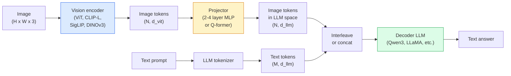

# 视觉-语言模型 —— ViT-MLP-LLM 架构模式

> 视觉编码器将图像转换为 token。MLP 投影器将这些 token 映射到 LLM 的嵌入空间。语言模型完成其余工作。这个 ViT-MLP-LLM 模式是 2026 年所有生产级 VLM 的基础。

**类型：** 学习 + 使用
**语言：** Python
**前置知识：** 第 4 阶段第 14 课（ViT）、第 4 阶段第 18 课（CLIP）、第 7 阶段第 02 课（自注意力）
**时长：** 约 75 分钟

## 学习目标

- 描述 ViT-MLP-LLM 架构，并解释三个组件各自的作用
- 从参数量、上下文长度和基准性能三个维度对比 Qwen3-VL、InternVL3.5、LLaVA-Next 和 GLM-4.6V
- 解释 DeepStack：为什么多层 ViT 特征比单层最后一层特征更能拉近视觉-语言对齐
- 使用跨模态错误率（CMER）在生产环境中度量 VLM 幻觉，并据此采取行动

## 问题背景

CLIP（第 4 阶段第 18 课）提供了图像与文本的共享嵌入空间，足以完成零样本分类和检索。但它无法回答“这张图片里有多少辆红色汽车？”，因为 CLIP 不生成文本 —— 它只能计算相似度。

视觉-语言模型（VLMs）—— Qwen3-VL、InternVL3.5、LLaVA-Next、GLM-4.6V —— 将 CLIP 家族的图像编码器连接到完整的语言模型。模型接收图像和问题，生成答案。2026 年的开源 VLM 在多模态基准（MMMU、MMBench、DocVQA、ChartQA、MathVista、OSWorld）上已达到或超过 GPT-5 和 Gemini-2.5-Pro 的水平。

这三个组件（ViT、投影器、LLM）已成为标准。不同模型之间的差异只在于：使用哪个 ViT、哪个投影器、哪个 LLM、训练数据以及对齐配方。一旦理解了这套模式，替换其中任一组件都是机械性的工作。

## 核心概念

### ViT-MLP-LLM 架构



1. **视觉编码器** —— 预训练的 ViT（CLIP-L/14、SigLIP、DINOv3 或微调变体）。输出 patch token。
2. **投影器** —— 一个小型模块（2-4 层 MLP 或 Q-former），将视觉 token 映射到 LLM 的嵌入维度。微调主要发生在这里。
3. **LLM** —— 仅解码器的语言模型（Qwen3、Llama、Mistral、GLM、InternLM）。按顺序读取视觉 + 文本 token，生成文本。

原则上三个组件都可训练。实际中，视觉编码器和 LLM 大多保持冻结，只训练投影器 —— 用几十亿参数的信号以较低成本完成对齐。

### DeepStack

普通投影只使用 ViT 的最后一层。DeepStack（Qwen3-VL）从多个 ViT 深度采样特征并堆叠。深层携带高级语义；浅层携带细粒度空间和纹理信息。将两者同时输入 LLM，可以弥合“图像包含什么”（语义）与“具体在哪里”（空间定位）之间的差距。

### 三阶段训练

现代 VLM 分阶段训练：

1. **对齐阶段** —— 冻结 ViT 和 LLM，仅在图像-标题对上训练投影器。教会投影器将视觉空间映射到语言空间。
2. **预训练阶段** —— 解冻所有组件，在大规模交错的图像-文本数据（5 亿+ 对）上训练。建立模型的视觉知识。
3. **指令微调阶段** —— 在 curated 的（图像、问题、答案）三元组上微调。教会模型对话行为和任务格式。正是这一步把“能看懂图像的语言模型”变成可用的助手。

大多数 LoRA 微调都针对第 3 阶段，使用少量标注数据。

### 模型家族对比（2026 年初）

| 模型 | 参数量 | 视觉编码器 | LLM | 上下文长度 | 优势 |
|-------|--------|----------------|-----|---------|-----------|
| Qwen3-VL-235B-A22B (MoE) | 235B（激活 22B） | custom ViT + DeepStack | Qwen3 | 256K | 通用 SOTA、GUI 智能体 |
| Qwen3-VL-30B-A3B (MoE) | 30B（激活 3B） | custom ViT + DeepStack | Qwen3 | 256K | 更小的 MoE 替代方案 |
| Qwen3-VL-8B (dense) | 8B | custom ViT | Qwen3 | 128K | 生产级稠密模型默认选择 |
| InternVL3.5-38B | 38B | InternViT-6B | Qwen3 + GPT-OSS | 128K | MMBench / MMVet 表现强劲 |
| InternVL3.5-241B-A28B | 241B（激活 28B） | InternViT-6B | Qwen3 | 128K | 可与 GPT-4o 竞争 |
| LLaVA-Next 72B | 72B | SigLIP | Llama-3 | 32K | 开源、易于微调 |
| GLM-4.6V | ~70B | custom | GLM | 64K | 开源、OCR 强劲 |
| MiniCPM-V-2.6 | 8B | SigLIP | MiniCPM | 32K | 适合边缘设备 |

### 视觉智能体

Qwen3-VL-235B 在 OSWorld 上达到全球顶尖水平 —— 这是一个面向**视觉智能体**的基准，模型需要操作 GUI（桌面、移动、网页）。模型看到屏幕截图，理解界面，并输出动作（点击、输入、滚动）。配合工具使用，它可以在常见桌面任务中形成闭环。这正是 2026 年大多数“AI PC”演示底层运行的东西。

### 智能体能力 + RoPE 变体

VLM 需要知道视频中的某一帧**在何时**出现。Qwen3-VL 从 T-RoPE（时序旋转位置编码）演进为**基于文本的时间对齐** —— 将显式的时间戳文本 token 与视频帧交错插入。模型看到“`<timestamp 00:32>` 帧 + 问题”的形式，就能推理时间关系。

### 对齐问题

爬取数据集中约有 12% 的图像-文本对的描述并未完全基于图像内容。在该数据上训练的 VLM 会默默学会幻觉 —— 虚构物体、误读数字、编造关系。在生产环境中，这是最主要的失效模式。

Skywork.ai 提出了**跨模态错误率（Cross-Modal Error Rate, CMER）**来追踪它：

```
CMER = 文本置信度高但图像-文本相似度（通过 CLIP 家族检查器）低的输出所占比例
```

CMER 高意味着模型正在自信地说出与图像不符的内容。将 CMER 作为生产 KPI 进行监控，在他们的部署中将幻觉率降低了约 35%。关键不在于“修复模型”，而在于“将高 CMER 输出路由到人工审核”。

### 使用 LoRA / QLoRA 微调

对 70B VLM 进行全面微调对大多数团队来说不现实。在注意力层 + 投影器层上使用 LoRA（秩 16-64），或使用 4-bit 基权重的 QLoRA，可以放进单张 A100 / H100。成本：5000-50000 条示例、100-5000 美元算力、2-10 小时训练。

### 空间推理仍然薄弱

当前 VLM 在空间推理基准（上下、左右、计数、距离）上的得分约为 50-60%。如果你的用例依赖“哪个物体压在哪个上面”，请大量验证 —— 通用 VLM 的表现低于人类。对于纯空间任务，比 VLM 更好的替代方案是：专门的关键点/姿态估计器、深度模型，或带有边界框几何后处理的检测模型。

## 动手实现

### 第 1 步：投影器

这是你训练最频繁的部分。2-4 层带 GELU 的 MLP。

```python
import torch
import torch.nn as nn


class Projector(nn.Module):
    def __init__(self, vit_dim=768, llm_dim=4096, hidden=4096):
        super().__init__()
        self.net = nn.Sequential(
            nn.Linear(vit_dim, hidden),
            nn.GELU(),
            nn.Linear(hidden, llm_dim),
        )

    def forward(self, x):
        return self.net(x)
```

输入是 `(N_patches, d_vit)` 的 token 张量。输出是 `(N_patches, d_llm)`。LLM 把输出的每一行都当作一个普通 token。

### 第 2 步：端到端组装 ViT-MLP-LLM

一个最简 VLM 前向传播的骨架。真实代码会使用 `transformers`；这里展示的是概念结构。

```python
class MinimalVLM(nn.Module):
    def __init__(self, vit, projector, llm, image_token_id):
        super().__init__()
        self.vit = vit
        self.projector = projector
        self.llm = llm
        self.image_token_id = image_token_id  # 文本提示中的占位 token

    def forward(self, image, input_ids, attention_mask):
        # 1. 视觉特征
        vision_tokens = self.vit(image)                     # (B, N_patches, d_vit)
        vision_embeds = self.projector(vision_tokens)       # (B, N_patches, d_llm)

        # 2. 文本嵌入
        text_embeds = self.llm.get_input_embeddings()(input_ids)  # (B, M, d_llm)

        # 3. 用视觉嵌入替换图像占位 token
        merged = self._merge(text_embeds, vision_embeds, input_ids)

        # 4. 运行 LLM
        return self.llm(inputs_embeds=merged, attention_mask=attention_mask)

    def _merge(self, text_embeds, vision_embeds, input_ids):
        out = text_embeds.clone()
        expected = vision_embeds.size(1)
        for b in range(input_ids.size(0)):
            positions = (input_ids[b] == self.image_token_id).nonzero(as_tuple=True)[0]
            if len(positions) != expected:
                raise ValueError(
                    f"batch item {b} has {len(positions)} image tokens but vision_embeds has {expected} patches."
                    " Every sample in the batch must be pre-padded to the same number of image placeholder tokens.")
            out[b, positions] = vision_embeds[b]
        return out
```

文本中的 `<image>` 占位 token 被替换为真实图像嵌入 —— 这与 LLaVA、Qwen-VL 和 InternVL 使用的模式相同。

### 第 3 步：计算 CMER

一个轻量级的运行时检查。

```python
import torch.nn.functional as F


def cross_modal_error_rate(image_emb, text_emb, text_confidence, sim_threshold=0.25, conf_threshold=0.8):
    """
    image_emb, text_emb: 图像和生成文本的嵌入（内部已做归一化）
    text_confidence:     每个 token 的平均概率，取值 [0, 1]
    返回:                高置信度但图像-文本对齐度低的输出所占比例
    """
    image_emb = F.normalize(image_emb, dim=-1)
    text_emb = F.normalize(text_emb, dim=-1)
    sim = (image_emb * text_emb).sum(dim=-1)        # 余弦相似度
    high_conf_low_sim = (text_confidence > conf_threshold) & (sim < sim_threshold)
    return high_conf_low_sim.float().mean().item()
```

把 CMER 当作生产 KPI。按端点、按提示类型、按客户监控它。CMER 上升表明模型在某个输入分布上开始出现幻觉。

### 第 4 步：玩具 VLM 分类器（可运行）

用于演示投影器可以训练。输入伪造的“ViT 特征”；一个极小的类 LLM token 预测类别。

```python
class ToyVLM(nn.Module):
    def __init__(self, vit_dim=32, llm_dim=64, num_classes=5):
        super().__init__()
        self.projector = Projector(vit_dim, llm_dim, hidden=64)
        self.head = nn.Linear(llm_dim, num_classes)

    def forward(self, vision_tokens):
        projected = self.projector(vision_tokens)
        pooled = projected.mean(dim=1)
        return self.head(pooled)
```

用合成的（特征，类别）对训练，不到 200 步即可拟合 —— 足以验证投影器模式有效。

## 实际使用

2026 年生产团队使用 VLM 的三种方式：

- **托管 API** —— OpenAI Vision、Anthropic Claude Vision、Google Gemini Vision。零基础设施，但存在供应商风险。
- **开源自托管** —— 通过 `transformers` 和 `vllm` 部署 Qwen3-VL 或 InternVL3.5。完全可控，前期投入更高。
- **领域微调** —— 加载 Qwen2.5-VL-7B 或 LLaVA-1.6-7B，在 5k-50k 条自定义示例上用 LoRA 微调，再用 `vllm` 或 `TGI`  serving。

```python
from transformers import AutoProcessor, AutoModelForVision2Seq
import torch
from PIL import Image

model_id = "Qwen/Qwen3-VL-8B-Instruct"
processor = AutoProcessor.from_pretrained(model_id)
model = AutoModelForVision2Seq.from_pretrained(model_id, torch_dtype=torch.bfloat16, device_map="auto")

messages = [{
    "role": "user",
    "content": [
        {"type": "image", "image": Image.open("plot.png")},
        {"type": "text", "text": "What does this chart show?"},
    ],
}]
inputs = processor.apply_chat_template(messages, add_generation_prompt=True, tokenize=True, return_dict=True, return_tensors="pt").to("cuda")
generated = model.generate(**inputs, max_new_tokens=256)
answer = processor.decode(generated[0][inputs["input_ids"].shape[1]:], skip_special_tokens=True)
```

`apply_chat_template` 隐藏了 `<image>` 占位 token 的分词过程；模型内部完成嵌入合并。

## 交付产出

本课产出：

- `outputs/prompt-vlm-selector.md` —— 根据准确率、延迟、上下文长度和预算选择 Qwen3-VL / InternVL3.5 / LLaVA-Next / API。
- `outputs/skill-cmer-monitor.md` —— 提供为生产 VLM 端点接入跨模态错误率、按端点仪表盘和告警阈值的代码。

## 练习题

1. **（简单）** 任选一款开源 VLM，在五张图像上运行三个提示（“这是什么？”、“数一下物体数量”、“描述场景”）。手工将每个答案评为正确 / 部分正确 / 幻觉。计算一个初版的类 CMER 率。
2. **（中等）** 在目标领域的 500 张带标题图像上，用 LoRA（秩 16）微调 Qwen2.5-VL-3B 或 LLaVA-1.6-7B。对比零样本与微调后的 MMBench 风格准确率。
3. **（困难）** 将 VLM 的图像编码器从默认的 SigLIP/CLIP 替换为 DINOv3。仅重新训练投影器（LLM 冻结 + DINOv3 冻结）。测量密集预测任务（计数、空间推理）是否有提升。

## 关键术语

| 术语 | 业界说法 | 实际含义 |
|------|----------------|----------------------|
| ViT-MLP-LLM | “VLM 模式” | 视觉编码器 + 投影器 + 语言模型；2026 年所有 VLM 的基础 |
| Projector | “桥梁” | 2-4 层 MLP（或 Q-former），将视觉 token 映射到 LLM 嵌入空间 |
| DeepStack | “Qwen3-VL 的特征技巧” | 堆叠多层 ViT 特征，而不是只用最后一层 |
| Image token | “`<image>` 占位符” | 文本序列中被投影视觉嵌入替换的特殊 token |
| CMER | “幻觉 KPI” | 跨模态错误率；文本置信度高但图像-文本相似度低时升高 |
| Visual agent | “会点击的 VLM” | 操作 GUI（OSWorld、移动端、网页）并调用工具的 VLM |
| Q-former | “固定数量 token 的桥梁” | BLIP-2 风格的投影器，输出固定数量的视觉查询 token |
| Alignment / pre-training / instruction tuning | “三阶段” | VLM 的标准训练流程 |

## 延伸阅读

- [Qwen3-VL Technical Report (arXiv 2511.21631)](https://arxiv.org/abs/2511.21631)
- [InternVL3.5 Advancing Open-Source Multimodal Models (arXiv 2508.18265)](https://arxiv.org/html/2508.18265v1)
- [LLaVA-Next series](https://llava-vl.github.io/blog/2024-05-10-llava-next-stronger-llms/)
- [BentoML: Best Open-Source VLMs 2026](https://www.bentoml.com/blog/multimodal-ai-a-guide-to-open-source-vision-language-models)
- [MMMU: Multi-discipline Multimodal Understanding benchmark](https://mmmu-benchmark.github.io/)
- [VLMs in manufacturing (Robotics Tomorrow, March 2026)](https://www.roboticstomorrow.com/story/2026/03/when-machines-learn-to-see-like-experts-the-rise-of-vision-language-models-in-manufacturing/26335/)
