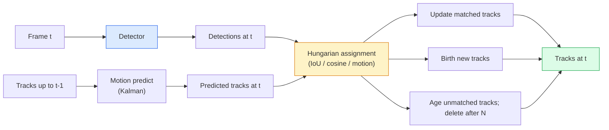

# 多目标跟踪与视频记忆

> 跟踪就是检测加关联。逐帧检测，然后将当前帧的检测与上一帧的轨迹按 ID 匹配。

**类型：** 构建  
**语言：** Python  
**前置条件：** Phase 4 Lesson 06（YOLO 检测）、Phase 4 Lesson 08（Mask R-CNN）、Phase 4 Lesson 24（SAM 3）  
**时间：** 约 60 分钟

## 学习目标

- 区分 detection-then-association 跟踪与 query-based 跟踪，并能说出主要算法家族（SORT、DeepSORT、ByteTrack、BoT-SORT、SAM 2 记忆跟踪器、SAM 3.1 Object Multiplex）
- 从零实现 IoU + 匈牙利分配的 classic tracking-by-detection
- 解释 SAM 2 的记忆库（memory bank）以及它为何比基于 IoU 的关联更擅长处理遮挡
- 读懂三大跟踪指标（MOTA、IDF1、HOTA），并根据使用场景选择合适的指标

## 问题背景

检测器告诉你单帧中物体的位置。跟踪器则告诉你，第 `t` 帧的哪一个检测与第 `t-1` 帧的哪一个检测属于同一个物体。没有跟踪，你就无法统计过线物体数量、无法跟踪一个被遮挡的球，也无法知道“4 号车已在车道中停留 8 秒”。

跟踪对任何面向视频的产品都至关重要：体育分析、监控、自动驾驶、医学视频分析、野生动物监测、水印计数。核心模块是相通的：逐帧检测器、运动模型（卡尔曼滤波器或更复杂的模型）、关联步骤（在 IoU / 余弦 / 学习特征上运行匈牙利算法），以及轨迹生命周期（诞生、更新、消亡）。

2026 年出现了两种新模式：**SAM 2 基于记忆的跟踪**（用特征记忆替代运动模型关联）和 **SAM 3.1 Object Multiplex**（为同类多个实例共享记忆）。本课先走一遍经典流程，再介绍基于记忆的方法。

## 核心概念

### 基于检测的跟踪（Tracking-by-detection）



你在 2026 年遇到的每一个跟踪器，都是这个循环的某种变体。差异在于：

- **SORT**（2016）：卡尔曼滤波 + IoU 匈牙利。简单、快速，没有外观模型。
- **DeepSORT**（2017）：SORT + 每个轨迹的 CNN 外观特征（ReID 嵌入）。在交叉场景下表现更好。
- **ByteTrack**（2021）：将低置信度检测作为第二阶段进行关联；无需外观特征，但在 MOT17 上仍是顶尖方法。
- **BoT-SORT**（2022）：ByteTrack + 相机运动补偿 + ReID。
- **StrongSORT / OC-SORT** —— ByteTrack 的后继者，运动与外观建模更强。

### 一段话理解卡尔曼滤波器

卡尔曼滤波器为每个轨迹维护一个状态 `(x, y, w, h, dx, dy, dw, dh)` 及其协方差。每帧先根据匀速模型进行**预测**，再用匹配到的检测进行**更新**。预测不确定性越高，更新时越信任检测。这样可以得到平滑轨迹，并能在短遮挡（1-5 帧）内维持轨迹。

每个经典跟踪器都在运动预测步骤中使用卡尔曼滤波器。

### 匈牙利算法

给定一个 `M x N` 代价矩阵（轨迹 × 检测），寻找一对一分配使得总代价最小。代价通常是 `1 - IoU(track_bbox, detection_bbox)`，或外观特征负余弦相似度。时间复杂度为 O((M+N)^3)；当 M、N 不超过约 1000 时，通过 `scipy.optimize.linear_sum_assignment` 在 Python 中已足够快。

### ByteTrack 的核心思想

传统跟踪器会丢弃低置信度检测（< 0.5）。ByteTrack 把它们保留为**第二阶段候选**：先用高置信度检测匹配轨迹，未匹配的轨迹再用稍宽松的 IoU 阈值去匹配低置信度检测。这样能恢复短遮挡并减少人群附近的 ID 切换。

### SAM 2 基于记忆的跟踪

SAM 2 通过维护一个**记忆库**（memory bank）来处理视频，其中存储每个实例的时空特征。在某一帧上给定提示（点、框、文本）后，它将该实例编码进记忆。在后续帧中，记忆与新帧特征进行交叉注意力，解码器输出同一实例在新帧中的掩码。

没有卡尔曼滤波器，也没有匈牙利分配。关联隐含在记忆-注意力操作之中。

优点：

- 对严重遮挡更鲁棒（记忆可跨多帧保持实例身份）。
- 与 SAM 3 的文本提示结合后支持开放词汇。
- 无需单独的运动模型。

缺点：

- 对多目标跟踪比 ByteTrack 慢。
- 记忆库会增长，限制上下文窗口。

### SAM 3.1 Object Multiplex

此前的 SAM 2 / SAM 3 跟踪为每个实例维护独立的记忆库。50 个对象就需要 50 个记忆库。Object Multiplex（2026 年 3 月）将它们合并为一个共享记忆库，并通过**每实例查询 token** 区分实例。成本随实例数量次线性增长。

Multiplex 已成为 2026 年人群跟踪的新默认选择：演唱会人群、仓库工人、十字路口车辆。

### 三大评估指标

- **MOTA（Multi-Object Tracking Accuracy）** —— 1 - (FN + FP + ID switches) / GT。按错误类型加权；单一指标，但混淆了检测失败与关联失败。
- **IDF1（ID F1）** —— ID 精确率与召回率的调和平均。专门关注每个真实轨迹随时间保持 ID 的能力。对 ID 切换敏感的任务优于 MOTA。
- **HOTA（Higher Order Tracking Accuracy）** —— 分解为检测准确率（DetA）和关联准确率（AssA）。自 2020 年起成为社区标准；最全面。

用于监控（确认身份）时报 IDF1；用于体育分析（统计传球）时报 HOTA；用于一般学术比较时报 HOTA。

## 动手实现

### 步骤 1：基于 IoU 的代价矩阵

```python
import numpy as np


def bbox_iou(a, b):
    """
    a, b: (N, 4) arrays of [x1, y1, x2, y2].
    Returns (N_a, N_b) IoU matrix.
    """
    ax1, ay1, ax2, ay2 = a[:, 0], a[:, 1], a[:, 2], a[:, 3]
    bx1, by1, bx2, by2 = b[:, 0], b[:, 1], b[:, 2], b[:, 3]
    inter_x1 = np.maximum(ax1[:, None], bx1[None, :])
    inter_y1 = np.maximum(ay1[:, None], by1[None, :])
    inter_x2 = np.minimum(ax2[:, None], bx2[None, :])
    inter_y2 = np.minimum(ay2[:, None], by2[None, :])
    inter = np.clip(inter_x2 - inter_x1, 0, None) * np.clip(inter_y2 - inter_y1, 0, None)
    area_a = (ax2 - ax1) * (ay2 - ay1)
    area_b = (bx2 - bx1) * (by2 - by1)
    union = area_a[:, None] + area_b[None, :] - inter
    return inter / np.clip(union, 1e-8, None)
```

### 步骤 2：最简 SORT 风格跟踪器

为简洁起见，省略了固定匀速卡尔曼滤波 —— 这里只用简单 IoU 关联；在生产环境中，卡尔曼预测必不可少。完整版可使用 `sort` Python 包。

```python
from scipy.optimize import linear_sum_assignment


class Track:
    def __init__(self, tid, bbox, frame):
        self.id = tid
        self.bbox = bbox
        self.last_frame = frame
        self.hits = 1

    def update(self, bbox, frame):
        self.bbox = bbox
        self.last_frame = frame
        self.hits += 1


class SimpleTracker:
    def __init__(self, iou_threshold=0.3, max_age=5):
        self.tracks = []
        self.next_id = 1
        self.iou_threshold = iou_threshold
        self.max_age = max_age

    def step(self, detections, frame):
        if not self.tracks:
            for d in detections:
                self.tracks.append(Track(self.next_id, d, frame))
                self.next_id += 1
            return [(t.id, t.bbox) for t in self.tracks]

        track_boxes = np.array([t.bbox for t in self.tracks])
        det_boxes = np.array(detections) if len(detections) else np.empty((0, 4))

        iou = bbox_iou(track_boxes, det_boxes) if len(det_boxes) else np.zeros((len(track_boxes), 0))
        cost = 1 - iou
        cost[iou < self.iou_threshold] = 1e6

        matched_track = set()
        matched_det = set()
        if cost.size > 0:
            row, col = linear_sum_assignment(cost)
            for r, c in zip(row, col):
                if cost[r, c] < 1.0:
                    self.tracks[r].update(det_boxes[c], frame)
                    matched_track.add(r); matched_det.add(c)

        for i, d in enumerate(det_boxes):
            if i not in matched_det:
                self.tracks.append(Track(self.next_id, d, frame))
                self.next_id += 1

        self.tracks = [t for t in self.tracks if frame - t.last_frame <= self.max_age]
        return [(t.id, t.bbox) for t in self.tracks]
```

60 行代码。输入每帧检测，输出每帧轨迹 ID。真实系统还会加入卡尔曼预测、ByteTrack 的第二阶段重匹配以及外观特征。

### 步骤 3：合成轨迹测试

```python
def synthetic_frames(num_frames=20, num_objects=3, H=240, W=320, seed=0):
    rng = np.random.default_rng(seed)
    starts = rng.uniform(20, 200, size=(num_objects, 2))
    velocities = rng.uniform(-5, 5, size=(num_objects, 2))
    frames = []
    for f in range(num_frames):
        dets = []
        for i in range(num_objects):
            cx, cy = starts[i] + f * velocities[i]
            dets.append([cx - 10, cy - 10, cx + 10, cy + 10])
        frames.append(dets)
    return frames


tracker = SimpleTracker()
for f, dets in enumerate(synthetic_frames()):
    tracks = tracker.step(dets, f)
```

三个沿直线运动的对象应在全部 20 帧内保持各自 ID。

### 步骤 4：ID 切换指标

```python
def count_id_switches(tracks_per_frame, gt_per_frame):
    """
    tracks_per_frame:  list of list of (track_id, bbox)
    gt_per_frame:      list of list of (gt_id, bbox)
    Returns number of ID switches.
    """
    prev_assignment = {}
    switches = 0
    for tracks, gts in zip(tracks_per_frame, gt_per_frame):
        if not tracks or not gts:
            continue
        t_boxes = np.array([b for _, b in tracks])
        g_boxes = np.array([b for _, b in gts])
        iou = bbox_iou(g_boxes, t_boxes)
        for g_idx, (gt_id, _) in enumerate(gts):
            j = iou[g_idx].argmax()
            if iou[g_idx, j] > 0.5:
                t_id = tracks[j][0]
                if gt_id in prev_assignment and prev_assignment[gt_id] != t_id:
                    switches += 1
                prev_assignment[gt_id] = t_id
    return switches
```

这是一个简化的、接近 IDF1 的指标：统计真实对象被分配到的预测轨迹 ID 改变次数。真实的 MOTA / IDF1 / HOTA 工具请使用 `py-motmetrics` 和 `TrackEval`。

## 实际应用

2026 年的生产级跟踪器：

- `ultralytics` —— 内置 YOLOv8 + ByteTrack / BoT-SORT。`results = model.track(source, tracker="bytetrack.yaml")`。默认首选。
- `supervision`（Roboflow）—— ByteTrack 封装与可视化工具。
- SAM 2 / SAM 3.1 —— 通过 `processor.track()` 实现基于记忆的跟踪。
- 自定义栈：检测器（YOLOv8 / RT-DETR）+ `sort-tracker` / `OC-SORT` / `StrongSORT`。

选择建议：

- 行人 / 车辆 / 包裹、30+ fps：**ultralytics + ByteTrack**。
- 拥挤场景中同类大量实例：**SAM 3.1 Object Multiplex**。
- 严重遮挡且外观可区分：**DeepSORT / StrongSORT**（ReID 特征）。
- 体育 / 复杂交互：**BoT-SORT** 或学习型跟踪器（MOTRv3）。

## 交付成果

本课的产出：

- `outputs/prompt-tracker-picker.md` —— 根据场景类型、遮挡模式和延迟预算选择 SORT / ByteTrack / BoT-SORT / SAM 2 / SAM 3.1。
- `outputs/skill-mot-evaluator.md` —— 编写完整的 MOTA / IDF1 / HOTA 评估框架，与真实轨迹对比。

## 练习

1. **（简单）** 分别用 3、10、30 个对象运行上面的合成跟踪器。报告每种情况下的 ID 切换次数，并指出仅使用 IoU 关联从何处开始失效。
2. **（中等）** 在关联前加入匀速卡尔曼预测步骤。展示短遮挡（2-3 帧）不再导致 ID 切换。
3. **（困难）** 通过 `transformers` 将 SAM 2 基于记忆的跟踪器作为另一跟踪后端集成。在一段 30 秒的人群视频上同时运行 SimpleTracker 与 SAM 2，比较 ID 切换次数，并手动标注 5 个显著人物的真实 ID。

## 关键术语

| 术语 | 人们的说法 | 实际含义 |
|------|------------|----------|
| Tracking-by-detection | "先检测再关联" | 逐帧检测器 + 在 IoU / 外观上的匈牙利分配 |
| Kalman filter | "运动预测" | 线性动态 + 协方差，用于平滑轨迹预测与遮挡处理 |
| Hungarian algorithm | "最优分配" | 求解最小代价二分匹配问题；`scipy.optimize.linear_sum_assignment` |
| ByteTrack | "低置信度第二遍" | 让未匹配轨迹重新匹配低置信度检测，以恢复短遮挡 |
| DeepSORT | "SORT + 外观" | 增加 ReID 特征用于跨帧匹配；更利于保持 ID |
| Memory bank | "SAM 2 的 trick" | 跨帧存储每个实例的时空特征；交叉注意力取代显式关联 |
| Object Multiplex | "SAM 3.1 共享记忆" | 单一共享记忆 + 每实例查询，实现快速多目标跟踪 |
| HOTA | "现代跟踪指标" | 分解为检测准确率与关联准确率；社区标准 |

## 扩展阅读

- [SORT (Bewley et al., 2016)](https://arxiv.org/abs/1602.00763) —— 最简 detection-then-association 跟踪论文
- [DeepSORT (Wojke et al., 2017)](https://arxiv.org/abs/1703.07402) —— 增加外观特征
- [ByteTrack (Zhang et al., 2022)](https://arxiv.org/abs/2110.06864) —— 低置信度第二阶段的关联
- [BoT-SORT (Aharon et al., 2022)](https://arxiv.org/abs/2206.14651) —— 相机运动补偿
- [HOTA (Luiten et al., 2020)](https://arxiv.org/abs/2009.07736) —— 分解式跟踪指标
- [SAM 2 video segmentation (Meta, 2024)](https://ai.meta.com/sam2/) —— 基于记忆的跟踪器
- [SAM 3.1 Object Multiplex (Meta, March 2026)](https://ai.meta.com/blog/segment-anything-model-3/)
