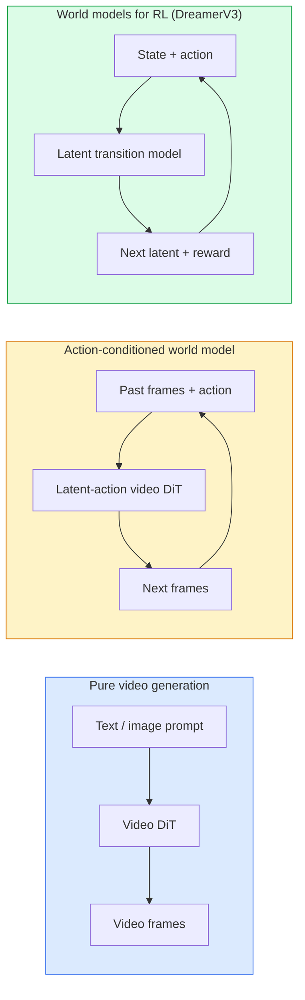

# 世界模型与视频扩散

> 能够预测场景接下来几秒画面的视频模型就是一种世界模拟器。如果让该预测以动作作为条件，你就得到了一个可学习的游戏引擎。

**类型：** 学习 + 构建
**语言：** Python
**前置要求：** 第四阶段第 10 课（扩散模型），第四阶段第 12 课（视频理解），第四阶段第 23 课（DiT + 整流流）
**时长：** 约 75 分钟

## 学习目标

- 解释纯视频生成模型（Sora 2）与动作条件化世界模型（Genie 3、DreamerV3）之间的区别
- 描述视频 DiT 的组成：时空 patch、三维位置编码、跨 (T, H, W) token 的联合注意力
- 梳理世界模型如何接入机器人系统：VLM 规划 → 视频模型仿真 → 逆动力学输出动作
- 针对给定用例（创意视频、交互式模拟、自动驾驶合成数据）在 Sora 2、Genie 3、Runway GWM-1 Worlds、Wan-Video 和 HunyuanVideo 之间做出选择

## 问题背景

2026 年，视频生成与世界建模走向融合。一个能够生成连贯一分钟视频的模型，在某种意义上已经学会了世界如何运转：物体恒存性、重力、因果律、风格。如果你让该预测以动作（向左走、开门）为条件，视频模型就变成了可学习的模拟器，可以替代游戏引擎、驾驶模拟器或机器人环境。

其影响是实实在在的。Genie 3 能从单张图像生成可玩环境。Runway GWM-1 Worlds 可合成无限可探索的场景。Sora 2 可生成带同步音频和建模物理的一分钟长视频。NVIDIA Cosmos-Drive、Wayve Gaia-2 和 Tesla DrivingWorld 则为自动驾驶训练数据生成逼真的驾驶视频。世界模型范式正在悄然接管机器人领域的 sim-to-real。

本课是第四阶段的“大图景”课程。它将图像生成、视频理解与智能体推理连接起来，整合成当前主流研究正在迈向的架构模式。

## 核心概念

### 世界建模的三大类别



- **Sora 2** 是纯基于提示条件的视频生成模型，没有动作接口，无法在生成过程中“操控”它。
- **Genie 3**、**GWM-1 Worlds**、**Mirage / Magica** 属于动作条件化世界模型。它们从观测视频中推断隐式动作，再让未来帧预测以动作作为条件。具有交互性——你按下按键或移动相机，场景就会响应。
- **DreamerV3** 与经典 RL 世界模型家族在隐空间中做预测，采用显式动作条件并基于奖励信号训练。视觉表现力较弱，但对样本高效的 RL 更有用。

### 视频 DiT 架构

```
Video latent:          (C, T, H, W)
Patchify (spatial):    grid of P_h x P_w patches per frame
Patchify (temporal):   group P_t frames into a temporal patch
Resulting tokens:      (T / P_t) * (H / P_h) * (W / P_w) tokens
```

位置编码是三维的：每个 (t, h, w) 坐标使用旋转式或可学习嵌入。注意力机制可以是：

- **全联合注意力** —— 所有 token 互相 attending。对于 N 个 token 复杂度为 O(N²)，对长视频来说开销过高。
- **分解注意力** —— 交替进行时序注意力（同一空间位置、跨时间：`(H*W) * T²`）与空间注意力（同一时间步、跨空间：`T * (H*W)²`）。TimeSformer 和大多数视频 DiT 都采用这种方式。
- **窗口注意力** —— 在 (t, h, w) 上做局部窗口。Video Swin 使用这种方式。

2026 年的每个视频扩散模型都采用这三种模式之一，再加上 AdaLN 条件化（第 23 课）与整流流。

### 以动作为条件：隐式动作模型

Genie 通过判别式地预测相邻两帧之间的动作，为每一帧学习一个**隐式动作**。模型的解码器随后以推断出的隐式动作为条件，而非显式的键盘按键。在推理时，用户可以指定一个隐式动作（或从新的先验中采样一个），模型会生成与该动作一致的下一帧。

Sora 完全跳过动作接口。它的解码器根据过去的时空 token 预测下一个时空 token。提示词只决定起始状态，生成过程中无法干预。

### 物理合理性

Sora 2 在 2026 年发布时明确宣传了其**物理合理性**：重量、平衡、物体恒存性、因果性。团队通过人工打分的合理性指标进行评估；相比 Sora 1，该模型在掉落物体、角色碰撞以及故意失败（如跳失）等场景上有明显进步。

物理合理性仍是主要的失败模式。2024–2025 年那些人们吃意大利面或用玻璃杯喝水的视频暴露出模型缺乏持久的物体表征。2026 年的模型（Sora 2、Runway Gen-5、HunyuanVideo）减少了这些问题，但尚未根除。

### 自动驾驶世界模型

驾驶世界模型以轨迹、边界框或导航地图为条件，生成逼真的道路场景。用途包括：

- **Cosmos-Drive-Dreams**（NVIDIA）—— 生成数分钟驾驶视频，用于 RL 训练。
- **Gaia-2**（Wayve）—— 以轨迹为条件的场景合成，用于策略评估。
- **DrivingWorld**（Tesla）—— 模拟不同天气、时段和交通状况。
- **Vista**（ByteDance）—— 反应式驾驶场景合成。

它们替代了昂贵的真实世界数据采集，用于处理边角案例——夜间行人乱穿马路、结冰路口、特殊车型——这些原本需要数百万英里驾驶才能收集到。

### 机器人技术栈：VLM + 视频模型 + 逆动力学

新兴的三组件机器人闭环：

1. **VLM** 解析目标（“拿起红色杯子”），规划高层动作序列。
2. **视频生成模型** 模拟执行每个动作后的效果——提前 N 帧预测观测画面。
3. **逆动力学模型** 提取能够产生这些观测的具体电机指令。

这替代了奖励塑造和需要大量样本的 RL。世界模型负责“想象”，逆动力学负责将动作执行闭环闭合。Genie Envisioner 是该结构的一种实现；许多研究团队都在朝着这一结构汇聚。

### 评估

- **视觉质量** —— FVD（Fréchet 视频距离）、用户研究。
- **提示对齐度** —— 每帧 CLIPScore、VQA 风格评估。
- **物理合理性** —— 在基准套件上进行人工评分（Sora 2 内部基准、VBench）。
- **可控性**（针对交互式世界模型）—— 动作到观测的一致性；能否回到之前的状态？

### 2026 年模型格局

| 模型 | 用途 | 参数量 | 输出 | 许可证 |
|-------|-----|------------|--------|---------|
| Sora 2 | 文本生成视频、音频 | — | 1 分钟 1080p + 音频 | 仅 API |
| Runway Gen-5 | 文本/图像生成视频 | — | 10 秒片段 | API |
| Runway GWM-1 Worlds | 交互式世界 | — | 无限 3D 推演 | API |
| Genie 3 | 从图像生成交互式世界 | 11B+ | 可玩帧 | 研究预览 |
| Wan-Video 2.1 | 开源文本生成视频 | 14B | 高质量片段 | 非商业 |
| HunyuanVideo | 开源文本生成视频 | 13B | 10 秒片段 | 宽松许可 |
| Cosmos / Cosmos-Drive | 自动驾驶模拟 | 7-14B | 驾驶场景 | NVIDIA 开放 |
| Magica / Mirage 2 | AI 原生游戏引擎 | — | 可修改世界 | 产品 |

## 动手构建

### 步骤 1：视频三维 patchify

```python
import torch
import torch.nn as nn


class VideoPatch3D(nn.Module):
    def __init__(self, in_channels=4, dim=64, patch_t=2, patch_h=2, patch_w=2):
        super().__init__()
        self.proj = nn.Conv3d(
            in_channels, dim,
            kernel_size=(patch_t, patch_h, patch_w),
            stride=(patch_t, patch_h, patch_w),
        )
        self.patch_t = patch_t
        self.patch_h = patch_h
        self.patch_w = patch_w

    def forward(self, x):
        # x: (N, C, T, H, W)
        x = self.proj(x)
        n, c, t, h, w = x.shape
        tokens = x.reshape(n, c, t * h * w).transpose(1, 2)
        return tokens, (t, h, w)
```

步长等于卷积核大小的三维卷积即可充当时空 patch 提取器。`(T, H, W) -> (T/2, H/2, W/2)` 的 token 网格。

### 步骤 2：三维旋转位置编码

旋转位置嵌入（RoPE）分别沿 `t`、`h`、`w` 轴应用：

```python
def rope_3d(tokens, t_dim, h_dim, w_dim, grid):
    """
    tokens: (N, T*H*W, D)
    grid: (T, H, W) sizes
    t_dim + h_dim + w_dim == D
    """
    T, H, W = grid
    n, seq, d = tokens.shape
    if t_dim + h_dim + w_dim != d:
        raise ValueError(f"t_dim+h_dim+w_dim ({t_dim}+{h_dim}+{w_dim}) must equal D={d}")
    assert seq == T * H * W
    t_idx = torch.arange(T, device=tokens.device).repeat_interleave(H * W)
    h_idx = torch.arange(H, device=tokens.device).repeat_interleave(W).repeat(T)
    w_idx = torch.arange(W, device=tokens.device).repeat(T * H)
    # Simplified: just scale channels by frequencies. Real RoPE rotates pairs.
    freqs_t = torch.exp(-torch.log(torch.tensor(10000.0)) * torch.arange(t_dim // 2, device=tokens.device) / (t_dim // 2))
    freqs_h = torch.exp(-torch.log(torch.tensor(10000.0)) * torch.arange(h_dim // 2, device=tokens.device) / (h_dim // 2))
    freqs_w = torch.exp(-torch.log(torch.tensor(10000.0)) * torch.arange(w_dim // 2, device=tokens.device) / (w_dim // 2))
    emb_t = torch.cat([torch.sin(t_idx[:, None] * freqs_t), torch.cos(t_idx[:, None] * freqs_t)], dim=-1)
    emb_h = torch.cat([torch.sin(h_idx[:, None] * freqs_h), torch.cos(h_idx[:, None] * freqs_h)], dim=-1)
    emb_w = torch.cat([torch.sin(w_idx[:, None] * freqs_w), torch.cos(w_idx[:, None] * freqs_w)], dim=-1)
    return tokens + torch.cat([emb_t, emb_h, emb_w], dim=-1)
```

这是简化的相加形式。真正的 RoPE 会按频率旋转成对通道；位置信息本质相同。

### 步骤 3：分解注意力块

```python
class DividedAttentionBlock(nn.Module):
    def __init__(self, dim=64, heads=2):
        super().__init__()
        self.time_attn = nn.MultiheadAttention(dim, heads, batch_first=True)
        self.space_attn = nn.MultiheadAttention(dim, heads, batch_first=True)
        self.ln1 = nn.LayerNorm(dim)
        self.ln2 = nn.LayerNorm(dim)
        self.ln3 = nn.LayerNorm(dim)
        self.mlp = nn.Sequential(nn.Linear(dim, 4 * dim), nn.GELU(), nn.Linear(4 * dim, dim))

    def forward(self, x, grid):
        T, H, W = grid
        n, seq, d = x.shape
        # time attention: same (h, w), across t
        xt = x.view(n, T, H * W, d).permute(0, 2, 1, 3).reshape(n * H * W, T, d)
        a, _ = self.time_attn(self.ln1(xt), self.ln1(xt), self.ln1(xt), need_weights=False)
        xt = (xt + a).reshape(n, H * W, T, d).permute(0, 2, 1, 3).reshape(n, seq, d)
        # space attention: same t, across (h, w)
        xs = xt.view(n, T, H * W, d).reshape(n * T, H * W, d)
        a, _ = self.space_attn(self.ln2(xs), self.ln2(xs), self.ln2(xs), need_weights=False)
        xs = (xs + a).reshape(n, T, H * W, d).reshape(n, seq, d)
        xs = xs + self.mlp(self.ln3(xs))
        return xs
```

时序注意力在每个空间位置内跨时间 attending；空间注意力在每个时间帧内跨空间位置 attending。两次 O(T² + (HW)²) 操作替代了一次 O((THW)²) 操作。这是 TimeSformer 和每一个现代视频 DiT 的核心。

### 步骤 4：组合一个微型视频 DiT

```python
class TinyVideoDiT(nn.Module):
    def __init__(self, in_channels=4, dim=64, depth=2, heads=2):
        super().__init__()
        self.patch = VideoPatch3D(in_channels=in_channels, dim=dim, patch_t=2, patch_h=2, patch_w=2)
        self.blocks = nn.ModuleList([DividedAttentionBlock(dim, heads) for _ in range(depth)])
        self.out = nn.Linear(dim, in_channels * 2 * 2 * 2)

    def forward(self, x):
        tokens, grid = self.patch(x)
        for blk in self.blocks:
            tokens = blk(tokens, grid)
        return self.out(tokens), grid
```

这不是一个可运行的视频生成器，而是一个结构性演示，用来验证每个模块的形状是否正确。

### 步骤 5：检查形状

```python
vid = torch.randn(1, 4, 8, 16, 16)  # (N, C, T, H, W)
model = TinyVideoDiT()
out, grid = model(vid)
print(f"input  {tuple(vid.shape)}")
print(f"tokens grid {grid}")
print(f"output {tuple(out.shape)}")
```

patchify 后期望得到 `grid = (4, 8, 8)` 和 `out = (1, 256, 32)`；随后输出头将每个 token 投影成时空 patch，可直接 un-patchify 回视频。

## 应用

2026 年的生产级接入方式：

- **Sora 2 API**（OpenAI）—— 文本生成视频、同步音频。高端定价。
- **Runway Gen-5 / GWM-1**（Runway）—— 图像生成视频、交互式世界。
- **Wan-Video 2.1 / HunyuanVideo** —— 开源、可自托管。
- **Cosmos / Cosmos-Drive**（NVIDIA）—— 驾驶模拟开放权重。
- **Genie 3** —— 研究预览，需申请访问。

若要构建交互式世界模型演示：从 Wan-Video 起步以获得画质，再叠加一个隐式动作适配器实现交互性。若做自动驾驶模拟：Cosmos-Drive 是 2026 年的开放参考。

在机器人领域，实际应用的栈如下：

1. 语言目标 -> VLM（Qwen3-VL）-> 高层规划。
2. 规划 -> 隐式动作视频模型 -> 想象出的推演。
3. 推演 -> 逆动力学模型 -> 低层动作。
4. 执行动作 -> 观测反馈回步骤 1。

## 交付

本课产出：

- `outputs/prompt-video-model-picker.md` —— 根据任务、许可证和延迟，在 Sora 2 / Runway / Wan / HunyuanVideo / Cosmos 之间做选择。
- `outputs/skill-physical-plausibility-checks.md` —— 定义自动化检查（物体恒存性、重力、连续性）的技能，在发布前对任何生成视频运行。

## 练习

1. **（简单）** 计算一段 5 秒 360p 视频在 patch-t=2、patch-h=8、patch-w=8 时的 token 数量，并分析该尺寸下注意力的显存开销。
2. **（中等）** 将上面的分解注意力块替换为全联合注意力块，测量形状和参数量。解释为什么真实视频模型必须使用分解注意力。
3. **（困难）** 构建一个最简隐式动作视频模型：使用 (frame_t, action_t, frame_{t+1}) 三元组数据集（任意简单 2D 游戏），训练一个以动作嵌入为条件的微型视频 DiT，并证明不同动作会产生不同的下一帧。

## 关键术语

| 术语 | 通俗说法 | 实际含义 |
|------|----------------|----------------------|
| World model | “可学习模拟器” | 给定状态和动作，预测未来观测的模型 |
| Video DiT | “时空 transformer” | 采用三维 patch 化和分解注意力的扩散 transformer |
| Latent action | “推断出的控制” | 从帧对中推断出的离散或连续动作隐变量，用于条件化下一帧生成 |
| Divided attention | “先时间后空间” | 每个块执行两次注意力操作——先跨时间、再跨空间——使 O(N²) 可控 |
| Object permanence | “物体保持真实” | 视频模型必须学习的场景属性；在食物、玻璃器皿上的经典失败模式 |
| FVD | “Fréchet 视频距离” | FID 的视频等价物；主要的视觉质量指标 |
| Inverse dynamics model | “从观测到动作” | 给定（状态，下一状态），输出连接二者的动作；闭合机器人闭环 |
| Cosmos-Drive | “NVIDIA 驾驶模拟” | 用于 RL 和评估的开放权重自动驾驶世界模型 |

## 延伸阅读

- [Sora 技术报告（OpenAI）](https://openai.com/index/video-generation-models-as-world-simulators/)
- [Genie: Generative Interactive Environments（Bruce 等，2024）](https://arxiv.org/abs/2402.15391) —— 隐式动作世界模型
- [TimeSformer（Bertasius 等，2021）](https://arxiv.org/abs/2102.05095) —— 视频 transformer 的分解注意力
- [DreamerV3（Hafner 等，2023）](https://arxiv.org/abs/2301.04104) —— 面向 RL 的世界模型
- [Cosmos-Drive-Dreams（NVIDIA，2025）](https://research.nvidia.com/labs/toronto-ai/cosmos-drive-dreams/) —— 驾驶世界模型
- [2026 年十大视频生成模型（DataCamp）](https://www.datacamp.com/blog/top-video-generation-models)
- [从视频生成到世界模型 —— 综述仓库](https://github.com/ziqihuangg/Awesome-From-Video-Generation-to-World-Model/)
