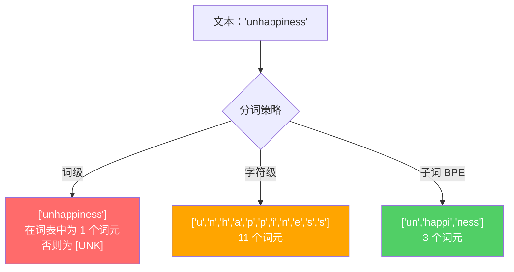
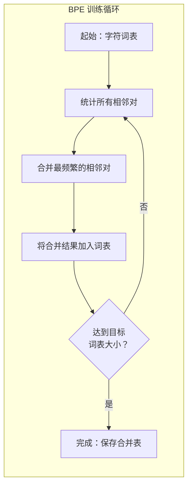
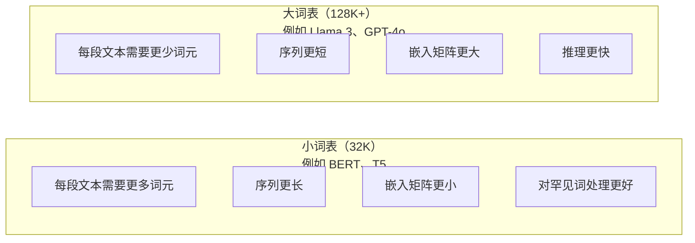

# 分词器：BPE、WordPiece、SentencePiece

> 你的大语言模型（LLM）并不阅读英文，它阅读的是整数。分词器（tokenizer）决定了这些整数是在承载意义，还是在浪费容量。

**类型：** 实战构建  
**语言：** Python  
**前置要求：** Phase 05（NLP 基础）  
**时长：** 约 90 分钟

## 学习目标

- 从零实现 BPE、WordPiece 和 Unigram 分词算法，并比较它们的合并策略
- 解释词表（vocabulary）大小如何影响模型效率：词表太小会导致序列过长，词表太大会浪费嵌入（embedding）参数量
- 分析不同语言和代码中的分词产物，识别特定分词器在何处失效
- 使用 tiktoken 和 sentencepiece 库对文本进行分词，并检查生成的词元 ID（token ID）

## 问题所在

你的大语言模型并不阅读英文，也不阅读任何人类语言。它阅读的是数字。

“Hello, world!” 与 `[15496, 11, 995, 0]` 之间的差距，就是分词器。每一个单词、每一个空格、每一个标点符号，都必须先转换成整数，模型才能处理。这种转换并非中立——它会把无法事后撤销的假设烙进模型。

分词做得不好，模型就会浪费容量，用多个词元去编码常见词。例如 “unfortunately” 会被切成四个词元，而不是一个。对于多音节词汇密集的文本，你原本 128K 的上下文窗口（context window）实际上缩水了 75%。而分词做得好，同样的上下文窗口就能容纳两倍的信息量。模型“擅长处理代码”还是“一写 Python 就卡壳”，往往取决于分词器是如何训练的。

你每次调用 GPT-4 或 Claude 的 API，都是按词元计费；模型每生成一个词元，都要消耗算力。表示同样输出所需的词元越少，端到端推理就越快。分词不是预处理，它是架构的一部分。

## 核心概念

### 三种显而易见的方案（两种行不通，一种胜出）

把文本转成数字有三种直观方法，其中两种无法扩展到生产规模。

**词级分词（word-level tokenization）** 按空格和标点切分。“The cat sat” 变成 `["The", "cat", "sat"]`。简单直接。但 “tokenization” 呢？“GPT-4o” 呢？德语复合词如 “Geschwindigkeitsbegrenzung” 呢？词级分词需要一个庞大的词表来覆盖每种语言的每个词。一旦遇到未登录词，就会出现可怕的 `[UNK]` 词元——模型在说“我不知道这是什么”。仅英语就有超过一百万种词形，再加上代码、URL、科学记数法和上百种其他语言，你几乎需要一个无限大的词表。

**字符级分词（character-level tokenization）** 走向另一个极端。“hello” 变成 `["h", "e", "l", "l", "o"]`。词表极小（几百个字符），永远不会有未知词元。但序列会变得极长：原本 10 个词元的一句话会变成 50 个字符词元。模型必须自己学会 “t”、“h”、“e” 组合起来表示 “the”，把宝贵的注意力（attention）容量浪费在人类三岁就掌握的事情上。

**子词分词（subword tokenization）** 找到了最佳平衡点。常见词保持完整：“the” 是一个词元；罕见词分解成有意义的片段：“unhappiness” 变成 `["un", "happi", "ness"]`。词表可控（30K 到 128K 词元），序列长度可控，未知词元基本消失，因为任何词都能由子词片段拼出。

每个现代大语言模型都使用子词分词。GPT-2、GPT-4、BERT、Llama 3、Claude——无一例外。区别只在于采用哪种算法。



### BPE：字节对编码（Byte Pair Encoding）

BPE 是一种被重新用于分词的贪心压缩算法。核心思想简单到可以写在一张索引卡上。

从单个字符开始，统计训练语料中每一对相邻字符的出现次数，把最频繁的相邻对合并成新词元，重复这一过程直到达到目标词表大小。

下面是在一个仅含 “lower”、“lowest” 和 “newest” 的小型语料上运行 BPE 的过程：

```
语料（含词频）：
  "lower"  x5
  "lowest" x2
  "newest" x6

步骤 0 -- 从字符开始：
  l o w e r       (x5)
  l o w e s t     (x2)
  n e w e s t     (x6)

步骤 1 -- 统计相邻字符对：
  (e,s): 8    (s,t): 8    (l,o): 7    (o,w): 7
  (w,e): 13   (e,r): 5    (n,e): 6    ...

步骤 2 -- 合并最频繁的对 (w,e) -> "we"：
  l o we r        (x5)
  l o we s t      (x2)
  n e we s t      (x6)

步骤 3 -- 重新统计并合并 (e,s) -> "es"：
  l o we r        (x5)
  l o we s t      (x2)    <- 'es' 只能由 'e'+'s' 组成，而不是 'we'+'s'
  n e we s t      (x6)    <- 注意，这里的 'e' 在 'we' 前，'s' 在 'we' 后

更精确地追踪：
  合并 "we" 后，剩余的相邻对：
  (l,o): 7   (o,we): 7   (we,r): 5   (we,s): 8
  (s,t): 8   (n,e): 6    (e,we): 6

步骤 3 -- 合并 (we,s) -> "wes" 或 (s,t) -> "st"（两者都是 8 次，选第一个）：
  合并 (we,s) -> "wes"：
  l o we r        (x5)
  l o wes t       (x2)
  n e wes t       (x6)

步骤 4 -- 合并 (wes,t) -> "west"：
  l o we r        (x5)
  l o west        (x2)
  n e west        (x6)

...继续直到达到目标词表大小。
```

合并表（merge table）就是分词器。对新文本编码时，按照学习合并的顺序依次应用这些合并。训练语料决定了存在哪些合并，而这个选择会永久塑造模型看到的输入。



### 字节级 BPE（Byte-Level BPE）：GPT-2、GPT-3、GPT-4

标准 BPE 操作在 Unicode 字符上，而字节级 BPE 直接操作原始字节（0-255）。这使得基础词表恰好为 256，能够处理任何语言或编码，并且永远不会产生未知词元。

GPT-2 首次引入了这一方法。基础词表覆盖所有可能的字节，BPE 合并在此基础上构建。OpenAI 的 tiktoken 库实现了字节级 BPE，其词表规模如下：

- GPT-2：50,257 个词元
- GPT-3.5/GPT-4：约 100,256 个词元（cl100k_base 编码）
- GPT-4o：200,019 个词元（o200k_base 编码）

### WordPiece（BERT）

WordPiece 看起来与 BPE 相似，但选择合并的方式不同。它不是使用原始频率，而是最大化训练数据的似然（likelihood）：

```
BPE 合并准则：      count(A, B)
WordPiece 合并准则： count(AB) / (count(A) * count(B))
```

BPE 问：“哪一对出现得最频繁？” WordPiece 问：“哪一对的实际共现次数比随机预期更高？” 这一细微差别产生了不同的词表。WordPiece 更偏好那些共现具有“惊喜感”而非单纯高频的合并。

WordPiece 还会为 continuation 子词加上 "##" 前缀：

```
"unhappiness" -> ["un", "##happi", "##ness"]
"embedding"   -> ["em", "##bed", "##ding"]
```

"##" 前缀表示该片段承接前一个词元。BERT 使用 30,522 个词元的 WordPiece 词表。每个 BERT 变体——DistilBERT、RoBERTa 实际用的是 BPE，但 BERT 本身使用的是 WordPiece。

### SentencePiece（Llama、T5）

SentencePiece 将输入视为原始 Unicode 字符流，包括空白字符。没有预分词（pre-tokenization）步骤，也没有关于词边界的语言特定规则。这使它真正具备语言无关性——适用于中文、日语、泰语等不以空格分词的语言。

SentencePiece 支持两种算法：
- **BPE 模式**：与标准 BPE 相同的合并逻辑，直接应用于原始字符序列
- **Unigram 模式**：从一个大词表开始，迭代移除对整体似然影响最小的词元。与 BPE 相反——它是“剪枝”而非“合并”。

Llama 2 使用 32,000 个词元的 SentencePiece BPE。T5 使用 32,000 个词元的 SentencePiece Unigram。注意：Llama 3 切换到了基于 tiktoken 的字节级 BPE 分词器，词表为 128,256 个词元。

### 词表大小的权衡

这是一个有实际可衡量后果的工程决策。



具体数字：对于 128K 词表、4,096 维嵌入，仅嵌入矩阵就有 128,000 × 4,096 = 5.24 亿参数。对于 32K 词表，则是 1.31 亿参数。仅分词器选择一项，就能造成 4 亿参数的差距。

但更大的词表对文本压缩更激进。同样一段英文段落，用 32K 词表可能需要 100 个词元，用 128K 词表可能只需 70 个。这意味着生成时前向传播次数减少 30%。对于服务数百万请求的模型而言，这是直接的算力成本降低。

趋势很明显：词表规模在不断增长。GPT-2 使用 50,257；GPT-4 使用约 100K；Llama 3 使用 128K；GPT-4o 使用 200K。

| 模型 | 词表大小 | 分词器类型 | 平均每个英文词的词元数 |
|------|---------|-----------|----------------------|
| BERT | 30,522 | WordPiece | ~1.4 |
| GPT-2 | 50,257 | 字节级 BPE | ~1.3 |
| Llama 2 | 32,000 | SentencePiece BPE | ~1.4 |
| GPT-4 | ~100,256 | 字节级 BPE | ~1.2 |
| Llama 3 | 128,256 | 字节级 BPE（tiktoken） | ~1.1 |
| GPT-4o | 200,019 | 字节级 BPE | ~1.0 |

### 多语言税（The Multilingual Tax）

主要用英语训练的分词器对其他语言非常残酷。在 GPT-2 的分词器中，韩文文本平均每个词需要 2-3 个词元，中文可能更糟。这意味着韩国用户的有效上下文窗口只有英语用户的一半——他们支付同样的价格，却得到更低的信息密度。

这就是 Llama 3 把词表从 32K 增加到 128K 的原因。为非农耕文字分配更多词元，可以在不同语言间实现更公平的压缩。

## 动手实现

### 步骤 1：字符级分词器

从基础开始。字符级分词器将每个字符映射为其 Unicode 码点。无需训练，没有未知词元，只是直接映射。

```python
class CharTokenizer:
    def encode(self, text):
        return [ord(c) for c in text]

    def decode(self, tokens):
        return "".join(chr(t) for t in tokens)
```

"hello" 变成 `[104, 101, 108, 108, 111]`。每个字符都是一个词元。这是我们接下来要改进的基线。

### 步骤 2：从零实现 BPE 分词器

真正的实现。我们在原始字节上训练（类似 GPT-2），统计字符对，合并最频繁的一对，并按顺序记录每次合并。合并表就是分词器。

```python
from collections import Counter

class BPETokenizer:
    def __init__(self):
        self.merges = {}
        self.vocab = {}

    def _get_pairs(self, tokens):
        pairs = Counter()
        for i in range(len(tokens) - 1):
            pairs[(tokens[i], tokens[i + 1])] += 1
        return pairs

    def _merge_pair(self, tokens, pair, new_token):
        merged = []
        i = 0
        while i < len(tokens):
            if i < len(tokens) - 1 and tokens[i] == pair[0] and tokens[i + 1] == pair[1]:
                merged.append(new_token)
                i += 2
            else:
                merged.append(tokens[i])
                i += 1
        return merged

    def train(self, text, num_merges):
        tokens = list(text.encode("utf-8"))
        self.vocab = {i: bytes([i]) for i in range(256)}

        for i in range(num_merges):
            pairs = self._get_pairs(tokens)
            if not pairs:
                break
            best_pair = max(pairs, key=pairs.get)
            new_token = 256 + i
            tokens = self._merge_pair(tokens, best_pair, new_token)
            self.merges[best_pair] = new_token
            self.vocab[new_token] = self.vocab[best_pair[0]] + self.vocab[best_pair[1]]

        return self

    def encode(self, text):
        tokens = list(text.encode("utf-8"))
        for pair, new_token in self.merges.items():
            tokens = self._merge_pair(tokens, pair, new_token)
        return tokens

    def decode(self, tokens):
        byte_sequence = b"".join(self.vocab[t] for t in tokens)
        return byte_sequence.decode("utf-8", errors="replace")
```

训练循环是 BPE 的核心：统计相邻对、合并胜出者、重复。每一次合并都会减少总词元数。经过 `num_merges` 轮后，词表从 256（基础字节）增长到 256 + num_merges。

编码时必须严格按照学习顺序应用合并，这很重要。如果合并 1 创造了 "th"，合并 5 创造了 "the"，那么编码必须先应用合并 1，这样 "the" 才能由 "th" + "e" 在合并 5 中形成。

解码是逆向过程：在词表中查找每个词元 ID，拼接字节，再解码为 UTF-8。

### 步骤 3：编码-解码往返测试

```python
corpus = (
    "The cat sat on the mat. The cat ate the rat. "
    "The dog sat on the log. The dog ate the frog. "
    "Natural language processing is the study of how computers "
    "understand and generate human language. "
    "Tokenization is the first step in any NLP pipeline."
)

tokenizer = BPETokenizer()
tokenizer.train(corpus, num_merges=40)

test_sentences = [
    "The cat sat on the mat.",
    "Natural language processing",
    "tokenization pipeline",
    "unhappiness",
]

for sentence in test_sentences:
    encoded = tokenizer.encode(sentence)
    decoded = tokenizer.decode(encoded)
    raw_bytes = len(sentence.encode("utf-8"))
    ratio = len(encoded) / raw_bytes
    print(f"'{sentence}'")
    print(f"  词元数：{len(encoded)}（来自 {raw_bytes} 字节）-- 压缩率：{ratio:.2f}")
    print(f"  往返测试：{'通过' if decoded == sentence else '失败'}")
```

压缩率（compression ratio）反映了分词器的效率。比率为 0.50 表示分词器把文本压缩到原始字节数的一半，比率越低越好。在训练语料上，压缩率会很好；而对于分布外（out-of-distribution）文本如 "unhappiness"（未在语料中出现），压缩率会更差——分词器会回退到字符级编码来处理未见过的模式。

### 步骤 4：与 tiktoken 对比

```python
import tiktoken

enc = tiktoken.get_encoding("cl100k_base")

texts = [
    "The cat sat on the mat.",
    "unhappiness",
    "Hello, world!",
    "def fibonacci(n): return n if n < 2 else fibonacci(n-1) + fibonacci(n-2)",
    "Geschwindigkeitsbegrenzung",
]

for text in texts:
    our_tokens = tokenizer.encode(text)
    tiktoken_tokens = enc.encode(text)
    tiktoken_pieces = [enc.decode([t]) for t in tiktoken_tokens]
    print(f"'{text}'")
    print(f"  我们的 BPE：{len(our_tokens)} 个词元")
    print(f"  tiktoken：  {len(tiktoken_tokens)} 个词元 -> {tiktoken_pieces}")
```

tiktoken 使用完全相同的算法，但在数百 GB 的文本上训练，并进行了 10 万次合并。算法完全一致，区别在于训练数据和合并次数。你的分词器只在一个段落上训练了 40 次合并，自然无法在庞大数据上胜过 tiktoken，但机制是一样的。

### 步骤 5：词表分析

```python
def analyze_vocabulary(tokenizer, test_texts):
    total_tokens = 0
    total_chars = 0
    token_usage = Counter()

    for text in test_texts:
        encoded = tokenizer.encode(text)
        total_tokens += len(encoded)
        total_chars += len(text)
        for t in encoded:
            token_usage[t] += 1

    print(f"词表大小：{len(tokenizer.vocab)}")
    print(f"所有文本的总词元数：{total_tokens}")
    print(f"总字符数：{total_chars}")
    print(f"平均每个字符的词元数：{total_tokens / total_chars:.2f}")

    print(f"\n使用最频繁的词元：")
    for token_id, count in token_usage.most_common(10):
        token_bytes = tokenizer.vocab[token_id]
        display = token_bytes.decode("utf-8", errors="replace")
        print(f"  词元 {token_id:4d}：'{display}'（使用 {count} 次）")

    unused = [t for t in tokenizer.vocab if t not in token_usage]
    print(f"\n未使用的词元：{len(unused)} / {len(tokenizer.vocab)}")
```

这会揭示词表中的齐普夫分布（Zipf distribution）：少数词元占据主导地位（空格、"the"、"e"），大多数词元很少被使用。生产级分词器会针对这一分布进行优化——常见模式获得短词元 ID，罕见模式获得更长的表示。

## 使用生产工具

你从零实现的 BPE 已经能工作。现在来看看生产级工具长什么样。

### tiktoken（OpenAI）

```python
import tiktoken

enc = tiktoken.get_encoding("cl100k_base")

text = "Tokenizers convert text to integers"
tokens = enc.encode(text)
print(f"词元：{tokens}")
print(f"片段：{[enc.decode([t]) for t in tokens]}")
print(f"往返：{enc.decode(tokens)}")
```

tiktoken 用 Rust 编写，带有 Python 绑定，每秒可编码数百万词元。同样是 BPE 算法，但工业级实现。

### Hugging Face tokenizers

```python
from tokenizers import Tokenizer
from tokenizers.models import BPE
from tokenizers.trainers import BpeTrainer
from tokenizers.pre_tokenizers import ByteLevel

tokenizer = Tokenizer(BPE())
tokenizer.pre_tokenizer = ByteLevel()

trainer = BpeTrainer(vocab_size=1000, special_tokens=["<pad>", "<eos>", "<unk>"])
tokenizer.train(["corpus.txt"], trainer)

output = tokenizer.encode("The cat sat on the mat.")
print(f"词元：{output.tokens}")
print(f"ID：{output.ids}")
```

Hugging Face 的 tokenizers 库底层也是 Rust。它可以在几秒钟内对 GB 级语料训练 BPE。训练自己的模型时，这就是你要用的工具。

### 加载 Llama 的分词器

```python
from transformers import AutoTokenizer

tokenizer = AutoTokenizer.from_pretrained("meta-llama/Llama-3.1-8B")

text = "Tokenizers are the unsung heroes of LLMs"
tokens = tokenizer.encode(text)
print(f"词元 ID：{tokens}")
print(f"词元：{tokenizer.convert_ids_to_tokens(tokens)}")
print(f"词表大小：{tokenizer.vocab_size}")

multilingual = ["Hello world", "Hola mundo", "Bonjour le monde"]
for text in multilingual:
    ids = tokenizer.encode(text)
    print(f"'{text}' -> {len(ids)} 个词元")
```

Llama 3 的 128K 词表对非英语文本的压缩明显优于 GPT-2 的 50K 词表。你可以亲自验证——把同一句子用多种语言编码，然后统计词元数。

## 交付物

本课将生成 `outputs/prompt-tokenizer-analyzer.md`——一个可复用的提示词，用于分析任意文本和模型组合的分词效率。给它一段文本样本，它会告诉你哪个模型的分词器处理得最好。

## 练习题

1. 修改 BPE 分词器，使其在每次合并后打印词表。观察 "t" + "h" 如何变成 "th"，然后 "th" + "e" 如何变成 "the"；追踪常见英文词是如何被逐块组装出来的。

2. 为 BPE 分词器添加特殊词元（`<pad>`、`<eos>`、`<unk>`），分别分配 ID 0、1、2，并相应地平移其他所有词元的 ID。再实现一个预分词步骤，在运行 BPE 之前先按空白字符切分。

3. 实现 WordPiece 的合并准则（用似然比代替频率）。在相同语料、相同合并次数下分别训练 BPE 和 WordPiece，比较得到的词表——哪种方法产生的子词在语言学上更有意义？

4. 构建一个多语言分词效率基准。分别取 10 句英文、西班牙文、中文、韩文和阿拉伯文，用 tiktoken（cl100k_base）对每句分词，并计算平均每个字符的词元数。量化每种语言的“多语言税”。

5. 在更大的语料上训练你的 BPE 分词器（下载一篇维基百科文章）。调整合并次数，使在同一文本上的压缩率与 tiktoken 相差不超过 10%。这会让你深入理解语料规模、合并次数与压缩质量之间的关系。

## 关键术语

| 术语 | 人们常说 | 实际含义 |
|------|---------|---------|
| 词元（token） | “一个词” | 模型词表中的一个单位——可能是字符、子词、词或多词片段 |
| BPE | “某种压缩的东西” | 字节对编码（Byte Pair Encoding）——迭代合并最频繁的相邻词元对，直到达到目标词表大小 |
| WordPiece | “BERT 的分词器” | 类似 BPE，但合并最大化似然比 count(AB)/(count(A)*count(B))，而非原始频率 |
| SentencePiece | “一个分词器库” | 语言无关的分词器，直接对原始 Unicode 操作，无需预分词，支持 BPE 和 Unigram 算法 |
| 词表大小（vocabulary size） | “它认识多少词” | 唯一词元的总数：GPT-2 有 50,257，BERT 有 30,522，Llama 3 有 128,256 |
| 词元产出率（fertility） | “不是分词术语” | 平均每个词被切成的词元数——衡量跨语言分词效率的指标（1.0 为完美，3.0 表示模型要多付出三倍努力） |
| 字节级 BPE（byte-level BPE） | “GPT 的分词器” | 在原始字节（0-255）而非 Unicode 字符上运行的 BPE，保证任何输入都不会出现未知词元 |
| 合并表（merge table） | “分词器文件” | 训练过程中学习到的有序合并对列表——这就是分词器本身，顺序很重要 |
| 预分词（pre-tokenization） | “按空格切分” | 子词分词前应用的规则：空白切分、数字分离、标点处理 |
| 压缩率（compression ratio） | “分词器效率如何” | 输出词元数除以输入字节数——越低表示压缩越好、推理越快 |

## 延伸阅读

- [Sennrich et al., 2016 -- "Neural Machine Translation of Rare Words with Subword Units"](https://arxiv.org/abs/1508.07909) —— 将 1994 年的压缩算法引入 NLP 的 BPE 开山之作，奠定了现代分词的基础
- [Kudo & Richardson, 2018 -- "SentencePiece: A simple and language independent subword tokenizer"](https://arxiv.org/abs/1808.06226) —— 语言无关的分词方法，让多语言模型真正实用
- [OpenAI tiktoken repository](https://github.com/openai/tiktoken) —— Rust 实现的生产级 BPE，带有 Python 绑定，用于 GPT-3.5/4/4o
- [Hugging Face Tokenizers documentation](https://huggingface.co/docs/tokenizers) —— 具备 Rust 性能的生产级分词器训练工具
