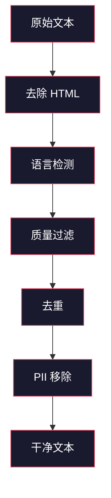
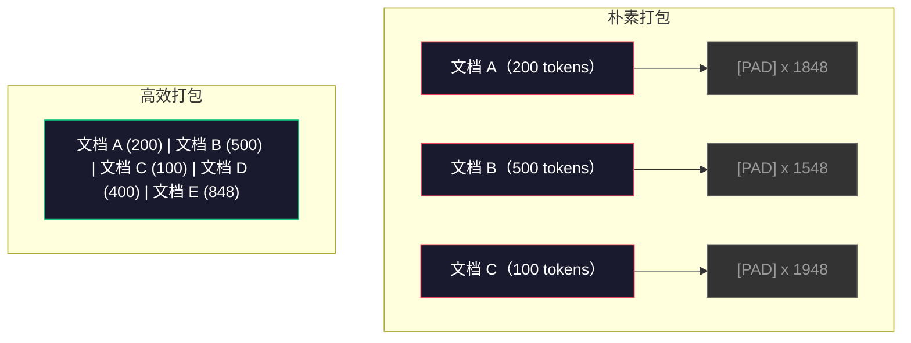

# 预训练数据管道

> 模型是一面镜子。它完美地映射出你喂给它的数据。喂给它垃圾，它就以完美的流畅度反映垃圾。

**类型：** 实战构建
**语言：** Python
**前置条件：** 第 10 阶段第 01–02 课（分词器、构建分词器）
**时长：** 约 90 分钟

## 学习目标

- 构建一个流式数据管道，能够对 TB 级文本进行分词、分块、打乱和批处理，而无需一次性加载到内存
- 实现真实预训练管道中使用的数据质量过滤（去重、语言检测、内容过滤）
- 生成固定长度的训练序列，并设置正确的注意力掩码（attention mask）以及文档边界处理
- 分析管道吞吐，确保数据加载器能跟上 GPU 训练速度

## 问题所在

你已经有一个分词器。现在你需要数据。

不是数据集，也不是 CSV 文件，而是 TB 级文本——经过清洗、去重、质量过滤、分词成固定长度序列，并以足够快的速度按随机批次提供，让你的 8 卡 GPU 集群永远不用等待下一批。

大多数人认为训练大语言模型（LLM）的关键在于模型架构。并非如此。Llama 3 使用了 15.6 万亿 token，GPT-3 使用了 3000 亿，DeepSeek-V2 使用了 8.1 万亿。这三者的架构大致相同：堆叠的 Transformer 块，加上注意力（attention）和前馈层。输出质量的差异主要来自数据。

DeepMind 的 Chinchilla 论文把这一点精确化了。对于给定的计算预算，模型参数量与训练 token 数之间存在最优比例。Chinchilla 表明，2022 年的大多数模型都严重训练不足——参数太多而数据太少。一个 700 亿参数、在 1.4 万亿 token 上训练的模型（Chinchilla 最优）胜过了 2800 亿参数、在 3000 亿 token 上训练的模型（Gopher）。

你的数据管道决定了模型学到的是语言还是噪声。

## 核心概念

### 数据来源

每个大语言模型都混合使用多种来源的数据。具体比例对大多数实验室来说是机密，但我们知道的已足够理解其类别。

| 来源 | 规模 | 质量 | 使用者 |
|------|------|------|--------|
| Common Crawl | 约 250 TB 原始数据 | 低（需要大量过滤） | GPT-3、Llama 及大多数开源模型 |
| Wikipedia | 约 20 GB | 高 | 所有主流 LLM |
| GitHub 代码 | 约 1 TB+ | 中（大量重复、死代码） | StarCoder、CodeLlama、DeepSeek-Coder |
| 图书（BookCorpus、Pile） | 约 100 GB | 高 | GPT-2、GPT-3 及早期模型 |
| 学术论文（arXiv、S2ORC） | 约 100 GB | STEM 领域高 | Llama、Galactica |
| StackOverflow、Reddit | 约 100 GB | 中 | Llama、Falcon |
| 精选网页（C4、RefinedWeb） | 约 5 TB | 中高（已预过滤） | T5、Falcon |

Llama 3 公开了它的数据配比：约 50% 网页数据、25% 代码、13% 图书与学术论文、8% 数学数据、4% 多语言网页数据。总量为 15.6 万亿 token，来源超过 5 TB 原始文本。

比例和总量同样重要。网页数据太多，模型会变成 Reddit 复读机；代码太少，它就不会编程；数学太少，它推理能力差。找到正确配比是训练 LLM 最困难的部分之一，而且没有公式——需要反复实验和评估。

### 数据清洗

原始网页数据非常脏。一个典型的 Common Crawl 转储包含：

- HTML 标签和 JavaScript
- 页眉、页脚、导航栏等模板内容
- 重复页面（精确重复和近似重复）
- 机器生成的垃圾内容
- 个人身份信息（PII）
- 低质量文本（关键词列表、SEO 垃圾）
- 被编码为文本的非文本内容

清洗不是可选项。它决定了模型是生成连贯段落，还是输出混杂 HTML 标签和商品列表的内容。



每一步都会消除一类噪声：

**去除 HTML：** 移除所有标记，只保留可见文本内容。`trafilatura` 或 `readability` 等库可以提取文章正文，同时丢弃导航、广告和模板内容。

**语言检测：** 使用 fastText 的语言识别模型（`lid.176.bin`）对每个文档分类，保留目标语言。如果一份文档被分类为英语但置信度低于 0.8，那它很可能不是干净的英文。

**质量过滤：** 这里开始变得有趣。RefinedWeb（Falcon 背后的数据集）使用基于困惑度（perplexity）的过滤：先在 Wikipedia 上训练一个小语言模型，然后给每个文档打分。高困惑度意味着该文档与 Wikipedia 差异大——可能是垃圾、关键词列表或机器生成内容。超过阈值的文档会被移除。

**去重：** 最有影响力的清洗步骤。Common Crawl 包含大量重复页面：法律免责声明、Cookie 通知、服务条款。在重复数据上训练会浪费算力，还可能导致模型逐字记忆并复述特定段落。

**PII 移除：** 姓名、邮箱、电话、社保号等。结构化 PII 用正则检测，上下文中的姓名用命名实体识别（NER）模型检测。

### 用 MinHash 去重

精确去重很简单：对每个文档做哈希，移除重复项。真正的问题是近似重复。两篇同一新闻文章，仅周围广告略有不同，就是近似重复。内容 95% 相同，但逐字节比较却不同。

MinHash + 局部敏感哈希（LSH）能高效解决这个问题。


核心思想：

1. **Shingling：** 把每个文档转换成 n-gram 集合。例如用 3 词 shingles，"the quick brown fox" 变成 {"the quick brown", "quick brown fox"}。

2. **MinHash：** 对每个文档的 shingle 集合计算 k 个哈希值。每个哈希值是在不同哈希函数下所有 shingles 的最小哈希。这会产生固定大小的"签名"，可以近似任意两篇文档的 Jaccard 相似度。

3. **LSH：** 根据 MinHash 签名的不同 band 把文档分组到桶中。同一个桶里的文档是近似重复的候选对。这避免了所有两两比较——只比较候选。

4. **验证：** 对每个候选对计算精确 Jaccard 相似度。如果超过阈值（通常为 0.8），就移除其中一个副本。

Llama 团队报告称，通过去重他们大约移除了 38% 的网页数据。这不是小数目。超过三分之一的 Common Crawl 内容是重复或近似重复的。

### 序列打包

模型期望固定长度的输入序列，而文档长度是可变的。有的 50 个 token，有的 5 万个 token。

朴素方法：把每个文档都填充（pad）到最大序列长度。这会在填充 token 上浪费巨大算力，而它们对学习没有贡献。

更好的方法：把多个文档打包进一个序列，用序列结束符（EOS）分隔。一个 2048 token 的序列可能包含三篇短文档，中间用 `[EOS]` 连接。



注意力掩码（attention mask）必须设置正确。同一个打包序列中文档 A 的 token 不应该 attending 到文档 B 的 token。这需要块对角注意力掩码（block-diagonal attention mask）。

长文档会被截断或在序列边界处切分成块。切分点很重要：在句子中间切分会让模型看到不完整的语义。有些管道会在可能的情况下对齐到段落或句子边界。

### Chinchilla 扩展定律

对于固定的计算预算 C（以 FLOPs 计），最优模型大小 N 和数据集大小 D 满足：

```
N_opt ~ C^0.5
D_opt ~ C^0.5
```

实际含义是：模型大小和数据集大小应该大致同等扩展。参数量扩大 10 倍的模型，大约需要 10 倍训练 token 才能达到相同的损失（loss）。

| 模型 | 参数量 | 训练 token | 是否 Chinchilla 最优？ |
|------|--------|------------|----------------------|
| GPT-3 | 175B | 300B | 否（训练不足 3–4 倍） |
| Chinchilla | 70B | 1.4T | 是（按设计） |
| Llama 2 | 70B | 2T | 过度训练（有意为之） |
| Llama 3 | 70B | 15T | 严重过度训练 |

Llama 3 故意违反 Chinchilla 定律。Meta 发现，在更多数据上过度训练——远超计算最优比例——能产生更适合推理的模型。额外的训练成本只付一次，但更小模型此后一直更便宜地部署。这有时被称为"推理最优"扩展方法，自 2024 年以来已成为行业标准。

## 动手构建

### 第 1 步：文本清洗

去除 HTML、规范化空白、移除非文本内容。我们将使用公共领域文本（Project Gutenberg）作为小型语料库。

```python
import re

def clean_text(text):
    text = re.sub(r"<[^>]+>", "", text)
    text = re.sub(r"http\S+", "", text)
    text = re.sub(r"[^\x20-\x7E\n]", "", text)
    text = re.sub(r"\n{3,}", "\n\n", text)
    text = re.sub(r" {2,}", " ", text)
    return text.strip()

def quality_filter(text, min_words=50, max_ratio_caps=0.3, max_ratio_special=0.1):
    words = text.split()
    if len(words) < min_words:
        return False
    caps_ratio = sum(1 for w in words if w.isupper()) / len(words)
    if caps_ratio > max_ratio_caps:
        return False
    special_chars = sum(1 for c in text if not c.isalnum() and not c.isspace())
    if special_chars / max(len(text), 1) > max_ratio_special:
        return False
    return True
```

质量过滤能抓住 SEO 垃圾（全大写）、机器生成噪声（特殊字符比例高）和残页（太短）。仅这三项检查就能从网页爬取中移除大量垃圾。

### 第 2 步：MinHash 去重

从零实现 MinHash。不需要外部库——只用 `hashlib`。

```python
import hashlib
from collections import defaultdict

def get_shingles(text, k=5):
    words = text.lower().split()
    if len(words) < k:
        return set()
    return {" ".join(words[i:i+k]) for i in range(len(words) - k + 1)}

def minhash_signature(shingles, num_hashes=128):
    signature = []
    for i in range(num_hashes):
        min_hash = float("inf")
        for shingle in shingles:
            h = int(hashlib.sha256(f"{i}:{shingle}".encode()).hexdigest(), 16)
            min_hash = min(min_hash, h)
        signature.append(min_hash)
    return signature

def lsh_buckets(signature, bands=16):
    rows_per_band = len(signature) // bands
    buckets = []
    for b in range(bands):
        start = b * rows_per_band
        band_data = tuple(signature[start:start + rows_per_band])
        bucket_hash = hashlib.md5(str(band_data).encode()).hexdigest()
        buckets.append((b, bucket_hash))
    return buckets

def deduplicate(documents, threshold=0.8, num_hashes=128, bands=16):
    signatures = []
    shingle_sets = []
    for doc in documents:
        shingles = get_shingles(doc)
        shingle_sets.append(shingles)
        signatures.append(minhash_signature(shingles, num_hashes))

    bucket_map = defaultdict(list)
    for doc_idx, sig in enumerate(signatures):
        for band_id, bucket_hash in lsh_buckets(sig, bands):
            bucket_map[(band_id, bucket_hash)].append(doc_idx)

    duplicate_pairs = set()
    for bucket_docs in bucket_map.values():
        if len(bucket_docs) < 2:
            continue
        for i in range(len(bucket_docs)):
            for j in range(i + 1, len(bucket_docs)):
                duplicate_pairs.add((bucket_docs[i], bucket_docs[j]))

    removed = set()
    for i, j in duplicate_pairs:
        if i in removed or j in removed:
            continue
        s1, s2 = shingle_sets[i], shingle_sets[j]
        if not s1 or not s2:
            continue
        jaccard = len(s1 & s2) / len(s1 | s2)
        if jaccard >= threshold:
            removed.add(j)

    return [doc for idx, doc in enumerate(documents) if idx not in removed], len(removed)
```

`num_hashes=128` 和 `bands=16` 控制精确率-召回率（precision-recall）权衡。更多哈希值提供更精确的相似度估计；更多 band 提高召回率（找到更多重复），但会带来更多假阳性。这些值对典型网页文本效果良好。

### 第 3 步：分词并打包序列

对清洗、去重后的文本进行分词，并打包成固定长度的训练序列。

```python
def tokenize_corpus(documents, tokenizer):
    all_tokens = []
    for doc in documents:
        tokens = tokenizer.encode(doc)
        all_tokens.extend(tokens)
        all_tokens.append(tokenizer.eos_id)
    return all_tokens

def pack_sequences(token_ids, seq_length, pad_id=0):
    sequences = []
    attention_masks = []
    for i in range(0, len(token_ids), seq_length):
        seq = token_ids[i:i + seq_length]
        mask = [1] * len(seq)
        if len(seq) < seq_length:
            pad_count = seq_length - len(seq)
            seq = seq + [pad_id] * pad_count
            mask = mask + [0] * pad_count
        sequences.append(seq)
        attention_masks.append(mask)
    return sequences, attention_masks
```

### 第 4 步：训练用 DataLoader

产出打包序列的随机批次。这是训练循环消费的数据。

```python
import random

class PreTrainingDataLoader:
    def __init__(self, sequences, attention_masks, batch_size, shuffle=True):
        self.sequences = sequences
        self.attention_masks = attention_masks
        self.batch_size = batch_size
        self.shuffle = shuffle

    def __len__(self):
        return (len(self.sequences) + self.batch_size - 1) // self.batch_size

    def __iter__(self):
        indices = list(range(len(self.sequences)))
        if self.shuffle:
            random.shuffle(indices)
        for start in range(0, len(indices), self.batch_size):
            batch_idx = indices[start:start + self.batch_size]
            batch_seqs = [self.sequences[i] for i in batch_idx]
            batch_masks = [self.attention_masks[i] for i in batch_idx]
            yield batch_seqs, batch_masks
```

### 第 5 步：数据集统计

计算关键指标：总 token 数、唯一 token 数、压缩率、文档长度分布。

```python
from collections import Counter

def compute_statistics(documents, token_ids, sequences, tokenizer_vocab_size):
    total_chars = sum(len(d) for d in documents)
    total_tokens = len(token_ids)
    unique_tokens = len(set(token_ids))
    compression_ratio = total_chars / total_tokens

    doc_lengths = [len(d.split()) for d in documents]
    avg_doc_length = sum(doc_lengths) / max(len(doc_lengths), 1)
    max_doc_length = max(doc_lengths) if doc_lengths else 0
    min_doc_length = min(doc_lengths) if doc_lengths else 0

    token_counts = Counter(token_ids)
    top_tokens = token_counts.most_common(10)

    non_pad_tokens = sum(sum(1 for t in seq if t != 0) for seq in sequences)
    total_positions = sum(len(seq) for seq in sequences)
    utilization = non_pad_tokens / max(total_positions, 1)

    stats = {
        "total_documents": len(documents),
        "total_characters": total_chars,
        "total_tokens": total_tokens,
        "unique_tokens": unique_tokens,
        "vocab_utilization": unique_tokens / tokenizer_vocab_size,
        "compression_ratio": compression_ratio,
        "avg_doc_length_words": avg_doc_length,
        "max_doc_length_words": max_doc_length,
        "min_doc_length_words": min_doc_length,
        "num_sequences": len(sequences),
        "sequence_utilization": utilization,
        "top_10_tokens": top_tokens,
    }
    return stats
```

压缩率（compression ratio）反映分词器在该语料上的效率。英文通常压缩到每个 token 3–4 个字符。如果只有 1.5 个字符/token，说明分词器切分过细；如果达到 8 以上，说明它学到了非常面向特定领域的合并规则。

序列利用率（sequence utilization）反映打包序列中有多少是真实数据、多少是填充（padding）。低于 90% 意味着打包低效——你在填充 token 上浪费算力。

## 投入使用

### 与 HuggingFace Datasets 对比

用 HuggingFace 的 `datasets` 库加载同一语料，并比较管道速度。

```python
from datasets import load_dataset
from transformers import AutoTokenizer

ds = load_dataset("wikitext", "wikitext-2-raw-v1", split="train")
tokenizer = AutoTokenizer.from_pretrained("meta-llama/Meta-Llama-3-8B")

import time

start = time.time()
tokenized = ds.map(
    lambda x: tokenizer(x["text"], truncation=True, max_length=2048),
    batched=True,
    num_proc=4,
)
hf_time = time.time() - start
total_tokens = sum(len(t) for t in tokenized["input_ids"])
print(f"HuggingFace: {total_tokens:,} tokens in {hf_time:.2f}s ({total_tokens/hf_time:,.0f} tokens/sec)")
```

HuggingFace 管道底层使用 Rust 实现的分词器，并在 4 核上并行处理。你的纯 Python 管道会慢 10–50 倍。这就是生产团队使用编译分词器的原因。算法相同，差异在于实现语言。

## 交付产出

本节课会生成一个用于验证和调试 LLM 训练管道数据质量的提示词。请查看 `outputs/prompt-data-quality-checker.md`。

## 练习题

1. **简单：** 在清洗管道中加入基于简单启发式（字符集分析）的语言检测。只保留英文文档，并统计移除了多少文档。
2. **中等：** 在 MinHash 近似去重之外，用 SHA-256 哈希实现精确去重。在网页爬取语料上比较两种方法抓到的重复数量。
3. **困难：** 构建一个基于困惑度（perplexity）的质量过滤器。在 Wikipedia 文本上训练一个小型 bigram 语言模型，按困惑度给每个文档打分，并移除最差的 20%。比较在过滤后数据与未过滤数据上训练时模型输出的质量。

## 关键术语

| 术语 | 人们的说法 | 实际含义 |
|------|-----------|----------|
| Common Crawl | "整个互联网" | 一家每月爬取网页的非营利机构——约 250TB 原始数据，是大多数 LLM 训练数据的起点 |
| MinHash | "某种哈希技巧" | 用固定大小签名估计集合间 Jaccard 相似度的技术——支持大规模近似重复检测 |
| LSH | "局部敏感哈希" | 把相似项分组到同一桶中的方法——将两两比较从 O(n²) 降到接近线性 |
| Sequence packing | "拼接文档" | 把多个文档填入固定长度序列并设置正确注意力掩码——消除填充浪费 |
| Chinchilla scaling | "多训练数据" | 固定计算预算下，要获得最优性能，模型大小和训练 token 应大致同比例扩展 |
| Fertility | "每词 token 数" | 平均每个词对应的 token 数——GPT-4 英文约 1.3，非拉丁文字更高 |
| Data mixing | "选择训练数据" | 代码、文本、数学、多语言数据之间的比例——没有公式，需要实验 |
| Perplexity filter | "质量打分" | 用一个小语言模型给文档打分——高困惑度说明文本与干净参考数据差异大 |
| Deduplication | "删除副本" | 消除精确重复和近似重复文档——通常可移除 30–40% 的原始网页数据 |
| Attention mask | "哪些 token 能看" | 在打包序列中阻止跨文档注意力的二进制掩码 |

## 延伸阅读

- [Hoffmann et al., 2022 -- Training Compute-Optimal Large Language Models (Chinchilla)](https://arxiv.org/abs/2203.15556) —— 改变我们对数据规模认知的论文
- [Penedo et al., 2023 -- The RefinedWeb Dataset for Falcon LLM](https://arxiv.org/abs/2306.01116) —— 如何把 Common Crawl 过滤成高质量数据
- [Touvron et al., 2023 -- Llama 2: Open Foundation and Fine-Tuned Chat Models](https://arxiv.org/abs/2307.09288) —— Llama 2 的数据管道细节
- [Lee et al., 2022 -- Deduplicating Training Data Makes Language Models Better](https://arxiv.org/abs/2107.06499) —— 去重比你想象的更重要
- [Broder, 1997 -- On the Resemblance and Containment of Documents](https://ieeexplore.ieee.org/document/666900) —— MinHash 的原始论文
- [Meta, 2024 -- Llama 3 Technical Report](https://arxiv.org/abs/2407.21783) —— 15.6T token、数据配比、过滤管道
