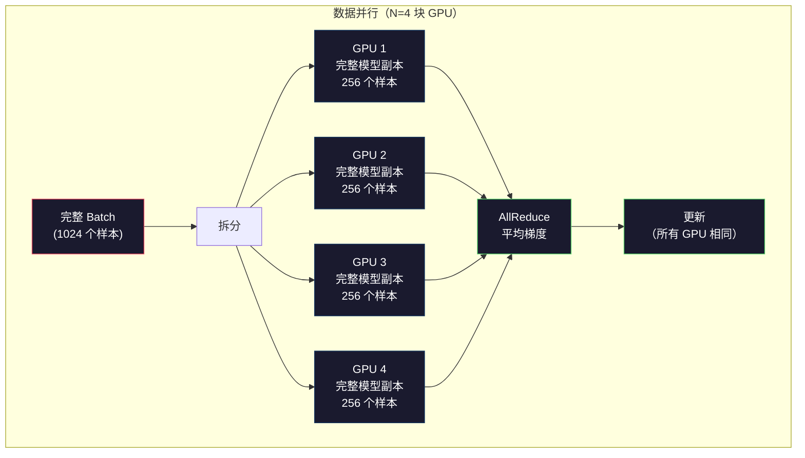
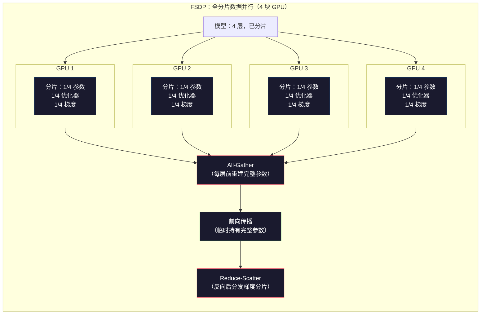
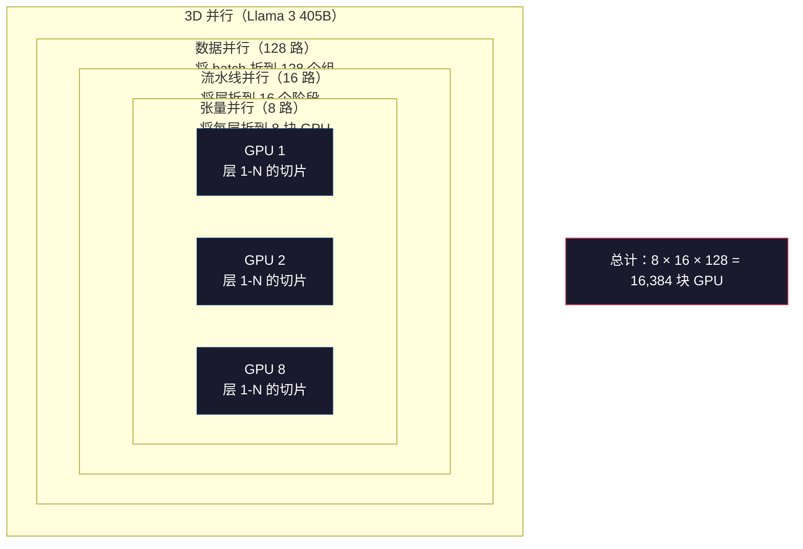

# 扩展：分布式训练、FSDP 与 DeepSpeed

> 你的 1.24 亿参数模型已经可以在一块 GPU 上完成训练。现在试试 70 亿参数。模型放不进显存，数据在单机上要跑好几周。在规模化场景下，分布式训练（distributed training）不是可选项，而是唯一的前进路径。

**类型：** 构建  
**语言：** Python  
**前置要求：** 第 10 阶段，第 04 课（预训练 Mini GPT）  
**时长：** 约 120 分钟

## 学习目标

- 解释三种并行策略（数据并行、张量并行、流水线并行），并能根据模型规模与集群大小判断何时需要哪种
- 使用 PyTorch DDP 实现数据并行（data parallelism）训练，并在多块 GPU 之间同步梯度
- 计算给定模型规模所需的显存预算（权重 + 优化器状态 + 梯度 + 激活值），从而确定最低硬件配置
- 配置 FSDP 或 DeepSpeed ZeRO 阶段，将模型状态分片到多块 GPU 上，使超出单卡显存的模型得以训练

## 问题所在

一个 70 亿参数的模型以 FP16 存储，仅权重就需要 14GB。Adam 优化器会为每个参数额外保存两份拷贝（一阶矩估计和二阶矩估计），这又是 28GB。反向传播期间的梯度（gradients）再占 14GB。在还没存任何一个激活值（activations）之前，你就已经用掉 56GB 了。

一块 NVIDIA A100 的显存是 80GB。

56GB 占了 80GB 的一大半，只剩下 24GB 给激活值——也就是前向传播过程中计算出来、必须保留到反向传播时使用的中间值。对于 2048 个 token 的序列、4096 维的模型，单层激活值大约占用 64MB；32 层就是每个样本 2GB。batch size 为 8 时需要 16GB，还在 24GB 范围内；batch size 为 12 就会爆显存。

再来看看 700 亿参数。仅权重在 FP16 下就是 140GB，单卡根本放不下。你至少需要 2 块 A100（2 × 80GB = 160GB）才装得下权重。再加上优化器状态和梯度，就需要更多：最少 3 块 GPU，实际根据分片策略通常需要 8–16 块。

Llama 3 405B 使用了 16,384 块 NVIDIA H100 GPU 进行训练，训练运行的算力成本估计高达 1 亿美元。DeepSeek V3 则以约 560 万美元训练了一个可比模型，秘诀在于架构更聪明（混合专家模型，Mixture of Experts，即每个 token 只激活一部分参数）以及训练效率更高。

本课涵盖让大规模训练成为可能的四种策略：数据并行（data parallelism）、张量并行（tensor parallelism）、流水线并行（pipeline parallelism）和全分片数据并行（fully sharded data parallelism）。我们会先用纯 Python 模拟每种机制，理解原理后再接触真实的分布式训练框架。

## 核心概念

### 为什么必须分布式

下面是真实模型的显存计算，每个数字都是算出来的，不是估算。

| 模型 | 参数量 | 权重（FP16） | Adam 状态 | 梯度（FP16） | 合计（不含激活值） |
|------|--------|-------------|-----------|-------------|------------------|
| GPT-2 Small | 124M | 248 MB | 992 MB | 248 MB | 1.5 GB |
| Llama 3 8B | 8B | 16 GB | 64 GB | 16 GB | 96 GB |
| Llama 3 70B | 70B | 140 GB | 560 GB | 140 GB | 840 GB |
| Llama 3 405B | 405B | 810 GB | 3,240 GB | 810 GB | 4,860 GB |

"Adam 状态"这一列是杀手级开销。Adam 会为每个参数保存一阶矩（m）和二阶矩（v），都用 FP32。700 亿参数就是 70B × 4 字节 × 2 = 560GB。仅优化器就需要 7 块 A100。

单块 H100 是 80GB。Llama 3 405B 至少需要 61 块 H100 才能装下权重、优化器和梯度。再加上激活值，数量还会更多。Meta 使用 16,384 块 GPU 不是因为他们想，而是因为他们必须这么做。

### 数据并行

最简单的分布式策略。把完整模型复制到 N 块 GPU 上，将每个训练 batch 分成 N 等份。每块 GPU 在自己的数据分片上执行前向和反向传播。反向传播后，对所有 GPU 的梯度求平均。每块 GPU 都用相同的平均梯度更新自己的权重副本，从而保持所有副本同步。

**优点：** 吞吐量线性扩展。N 块 GPU 每步处理 N 倍数据。通信只涉及梯度平均，并且可以与计算重叠。

**缺点：** 每块 GPU 都要保存完整的模型、优化器状态和梯度。700 亿参数的模型每块 GPU 需要 840GB。数据并行不会减少每卡显存，只会缩短训练时间。

**数学：** 有效 batch size = 每卡 batch size × N。例如 N=64 块 GPU、每卡 batch 为 16，则有效 batch 为 1,024。Llama 3 每步的有效 batch size 为 1,600 万个 token。



### 张量并行

把单个层切分到多块 GPU 上。一个矩阵乘法被拆分到不同 GPU，每块 GPU 计算结果的一部分。

假设前馈层中有一个形状为 (8192, 8192) 的权重矩阵。采用 4 路张量并行（tensor parallelism），每块 GPU 保存一个 (8192, 2048) 的分片。每块 GPU 将输入与自己的分片相乘，得到部分结果。部分结果再通过 all-reduce 或 all-gather 合并，得到完整输出。

**优点：** 减少每块 GPU 的权重显存。700 亿参数模型拆到 8 块 GPU 上，每块 GPU 大约只保存 87.5 亿参数的权重。

**缺点：** 每层之后都需要快速的 GPU 间通信。每次矩阵乘法后的 all-reduce 会引入延迟。这在 NVLink 下表现很好（同一节点内 GPU 之间 900 GB/s），但在跨节点的 InfiniBand（400 Gb/s，约 50 GB/s）下表现较差。张量并行几乎总是限制在单个节点内（8 块 GPU）。

**实际应用：** Megatron-LM 开创了张量并行。Llama 3 405B 在每个节点内使用 8 路张量并行。

### 流水线并行

按层切分模型。GPU 1 运行层 1–8，GPU 2 运行层 9–16，GPU 3 运行层 17–24，GPU 4 运行层 25–32。数据像流水线一样流过：GPU 1 计算完自己的层，把激活值传给 GPU 2；GPU 2 计算完再传给 GPU 3，依此类推。

**优点：** GPU 之间通信极少——只在层边界传递激活值，与梯度或权重相比很小。因此可以跨节点运行，对带宽要求低。

**缺点：** 流水线气泡（pipeline bubble）。当 GPU 4 正在计算微批次 1 的前向传播时，GPU 1、2、3 都处于空闲状态（它们已经完成自己的前向部分）。反向传播时顺序相反。使用朴素的流水线并行，N 个流水线阶段的 GPU 利用率只有 1/N。

**GPipe 和 PipeDream** 通过把 batch 拆成微批次（micro-batches）来解决气泡问题。GPU 1 一完成微批次 1 的前向，就立即开始微批次 2。这样不同流水线阶段的计算可以重叠。M 个微批次、N 个阶段时，气泡比例降为 (N-1)/M。例如 M=16、N=4，气泡就是 3/16 = 18.75% 的空闲时间。

### FSDP：全分片数据并行

FSDP（Fully Sharded Data Parallel，全分片数据并行）结合了数据并行的可扩展性和分片的显存效率。与每块 GPU 保存完整模型不同，每块 GPU 只保存 1/N 的参数、梯度和优化器状态。

在每一层前向传播之前，FSDP 执行一次 **all-gather（全收集）**，从所有 GPU 收集完整参数到每块 GPU 的显存中。前向传播后，每块 GPU 丢弃非本地的参数。反向传播时再次 all-gather 以重建参数用于梯度计算。反向传播后，执行 **reduce-scatter（归约散射）**，把梯度分片分发到各 GPU，使每块 GPU 只保存 1/N 的梯度。

**700 亿参数模型在 8 块 GPU 上的数学：**

| 组件 | 不使用 FSDP | 使用 FSDP |
|------|------------|-----------|
| 权重（FP16） | 每卡 140 GB | 每卡 17.5 GB |
| Adam 状态（FP32） | 每卡 560 GB | 每卡 70 GB |
| 梯度（FP16） | 每卡 140 GB | 每卡 17.5 GB |
| **合计** | **每卡 840 GB** | **每卡 105 GB** |

不使用 FSDP，一块 80GB GPU 根本装不下 700 亿参数模型。使用 8 块 GPU 的 FSDP，每卡仍需 105GB——等等，这仍然装不下。你至少需要 16 块 GPU 才能把每卡降到 80GB 以下，或者把 FSDP 与激活值检查点（activation checkpointing，反向时重新计算激活值而不是保存它们）结合使用。

通信开销比朴素数据并行更高，因为每层前都要 all-gather。但显存节省让原本不可能完成的训练成为可能。



### DeepSpeed ZeRO

DeepSpeed 的 ZeRO（Zero Redundancy Optimizer，零冗余优化器）在概念上与 FSDP 完全相同，只是由微软独立开发。它定义了三个阶段，每个阶段分片得更激进：

| 阶段 | 分片内容 | 显存节省 | 通信量 |
|------|---------|---------|--------|
| ZeRO-1 | 仅优化器状态 | 约 4 倍 | 与数据并行相同 |
| ZeRO-2 | + 梯度 | 约 8 倍 | 略多 |
| ZeRO-3 | + 参数 | 约 N 倍（N 为 GPU 数） | 每层 all-gather |

ZeRO-3 等价于 FSDP。名字不同，机制一样。PyTorch 在 DeepSpeed 证明这一概念后，推出了原生的 FSDP 实现。

DeepSpeed 还引入了 ZeRO-Offload（把优化器状态卸载到容量更大、成本更低的 CPU 内存）和 ZeRO-Infinity（卸载到 NVMe SSD）。这些以计算速度换取显存容量——卸载操作更慢，但能释放 GPU 显存。

### 混合精度训练

现代训练会同时使用多种浮点格式：

- **前向传播**：FP16 或 BF16（16 位）。显存是 FP32 的一半，矩阵乘法在 Tensor Core 上快 2 倍。
- **主权重（master weights）**：FP32（32 位）。优化器保留 FP32 权重以保证数值精度。
- **损失缩放（loss scaling）**：反向传播前把损失（loss）乘以一个较大的常数，防止 FP16 梯度下溢为零；优化器步骤前再除以相同常数。

BF16（Brain Float 16）的指数范围与 FP32 相同（8 位指数），但精度降低（尾数 7 位，对比 FP32 的 23 位）。它通常不需要损失缩放，因为能表示相同的数值范围。FP16 有 5 位指数和 10 位尾数——能表示精细值，但在极端量级会溢出或下溢。

Google 的 TPU 原生使用 BF16。NVIDIA 的 A100 和 H100 同时支持 FP16 和 BF16。行业已基本转向 BF16，因为它消除了损失缩放的麻烦。

**70 亿参数模型的显存对比：**

| 精度 | 权重 | 优化器 | 梯度 | 合计 |
|------|------|--------|------|------|
| 全部 FP32 | 28 GB | 56 GB | 28 GB | 112 GB |
| 混合精度（BF16 + FP32 主权重） | 14 GB | 56 GB | 14 GB | 84 GB |

混合精度在该模型上节省了 28GB。优化器状态始终是 FP32——这才是显存占用的大头。

### Megatron-LM 与 3D 并行

真正的大规模训练会把三种并行方式结合起来：

- **数据并行**跨节点组（扩展 batch size）
- **张量并行**在单个节点内（把层拆到 8 块 GPU）
- **流水线并行**跨节点（把层组拆到不同机器）

Llama 3 405B 在 16,384 块 H100 上的配置：
- 每个节点内 8 路张量并行（每节点 8 块 GPU）
- 跨节点 16 路流水线并行（16 个流水线阶段）
- 剩余维度上 128 路数据并行（16,384 / 8 / 16 = 128）

这种 3D 分解（8 × 16 × 128 = 16,384）就是如何扩展到数千块 GPU 的方法。每块 GPU 看到不同的数据分片（数据并行）、持有每层的一个切片（张量并行）、并计算不同的层组（流水线并行）。

DeepSeek V3 走了另一条路。他们的混合专家（Mixture of Experts, MoE）架构每个 token 只激活 370 亿参数（总共 6,710 亿参数）。这意味着每块 GPU 只需计算（并保存激活值）实际参与计算的参数。他们在 2,048 块 H800 GPU 上完成训练——不到 Meta GPU 数量的 1/8——成本为 560 万美元，而 Meta 估计为 1 亿美元。



## 动手实现

### 步骤 1：模拟数据并行

把 batch 切分到模拟的 GPU 上。每块 GPU 在自己的分片上计算前向传播，然后对"梯度"（这里用损失值模拟）求平均。

```python
import numpy as np

def simulate_data_parallelism(data, num_gpus, model_fn):
    batch_size = len(data)
    shard_size = batch_size // num_gpus
    remainder = batch_size % num_gpus

    gpu_losses = []
    gpu_gradients = []

    offset = 0
    for gpu_id in range(num_gpus):
        extra = 1 if gpu_id < remainder else 0
        shard = data[offset:offset + shard_size + extra]
        offset += shard_size + extra

        loss, grad = model_fn(shard)
        gpu_losses.append(loss)
        gpu_gradients.append(grad)

    avg_loss = np.mean(gpu_losses)
    avg_gradient = np.mean(gpu_gradients, axis=0)

    return avg_loss, avg_gradient
```

All-reduce 操作（平均梯度）是数据并行中唯一的通信。在实践中，NVIDIA GPU 使用 NCCL 库实现环形 all-reduce：每块 GPU 把 1/N 的梯度发给邻居、从另一邻居接收 1/N，经过 N-1 步后每块 GPU 都得到完整的平均值。总通信量为 2 × gradient_size × (N-1)/N，当 N 很大时接近 2 倍梯度大小。

### 步骤 2：模拟张量并行

把权重矩阵拆分到多块 GPU。每块 GPU 计算部分矩阵乘法，再合并结果。

```python
def simulate_tensor_parallelism(input_data, weight_matrix, num_gpus):
    d_in, d_out = weight_matrix.shape
    assert d_out % num_gpus == 0, f"d_out {d_out} not divisible by num_gpus {num_gpus}"
    shard_size = d_out // num_gpus

    partial_results = []
    for gpu_id in range(num_gpus):
        start = gpu_id * shard_size
        end = start + shard_size
        weight_shard = weight_matrix[:, start:end]

        partial = input_data @ weight_shard
        partial_results.append(partial)

    full_output = np.concatenate(partial_results, axis=-1)

    direct_output = input_data @ weight_matrix
    error = np.abs(full_output - direct_output).max()

    return full_output, error
```

误差应精确为零（或机器精度）。张量并行在数学上是精确的——它产生的结果与在单块 GPU 上计算完整矩阵乘法相同。这里沿着输出维度切分，每块 GPU 产生不同的列块，拼接后得到完整结果。

对于列并行的线性层（按输出维度切分），使用拼接；对于行并行（按输入维度切分），使用求和。在 Transformer 的前馈网络（FFN）中，第一个线性层（扩展）用列并行，第二个线性层（收缩）用行并行，这样两层之间不需要 all-reduce。

### 步骤 3：模拟流水线并行

把模型的层切分到虚拟 GPU 上，展示气泡问题：早期阶段在后期阶段计算时空闲。

```python
def simulate_pipeline_parallelism(num_layers, num_stages, num_microbatches):
    layers_per_stage = num_layers // num_stages

    timeline = {}
    clock = 0

    for mb in range(num_microbatches):
        for stage in range(num_stages):
            start_time = max(
                timeline.get((stage, mb - 1, "fwd"), (0, 0))[1] if mb > 0 else 0,
                timeline.get((stage - 1, mb, "fwd"), (0, 0))[1] if stage > 0 else 0,
            )
            end_time = start_time + layers_per_stage
            timeline[(stage, mb, "fwd")] = (start_time, end_time)

    last_fwd_end = max(v[1] for v in timeline.values())

    for mb in range(num_microbatches - 1, -1, -1):
        for stage in range(num_stages - 1, -1, -1):
            deps = [last_fwd_end]
            if mb < num_microbatches - 1 and (stage, mb + 1, "bwd") in timeline:
                deps.append(timeline[(stage, mb + 1, "bwd")][1])
            if stage < num_stages - 1 and (stage + 1, mb, "bwd") in timeline:
                deps.append(timeline[(stage + 1, mb, "bwd")][1])
            start_time = max(deps)
            end_time = start_time + layers_per_stage
            timeline[(stage, mb, "bwd")] = (start_time, end_time)

    total_time = max(v[1] for v in timeline.values())
    compute_time = num_microbatches * num_stages * layers_per_stage * 2
    bubble_fraction = 1.0 - compute_time / (total_time * num_stages)

    return timeline, total_time, bubble_fraction
```

4 个阶段、1 个微批次时，气泡比例为 75%——任意时刻都有 3/4 的 GPU 空闲。16 个微批次时，降到约 19%。消除气泡的代价是显存：你必须同时保存所有在飞微批次的激活值。

### 步骤 4：显存计算器

计算任意模型规模训练所需的精确显存。

```python
def memory_calculator(
    params_billions,
    precision_bytes=2,
    optimizer="adam",
    num_gpus=1,
    sharding="none",
    sequence_length=2048,
    batch_size_per_gpu=1,
    hidden_dim=None,
    num_layers=None,
):
    params = params_billions * 1e9

    weight_memory = params * precision_bytes

    if optimizer == "adam":
        optimizer_memory = params * 4 * 2
    elif optimizer == "sgd":
        optimizer_memory = params * 4
    else:
        optimizer_memory = 0

    gradient_memory = params * precision_bytes

    total_no_activation = weight_memory + optimizer_memory + gradient_memory

    if hidden_dim and num_layers:
        activation_per_layer = (
            sequence_length * batch_size_per_gpu * hidden_dim * precision_bytes * 4
        )
        activation_memory = activation_per_layer * num_layers
    else:
        activation_memory = params * precision_bytes * 0.5

    if sharding == "fsdp" or sharding == "zero3":
        weight_memory /= num_gpus
        optimizer_memory /= num_gpus
        gradient_memory /= num_gpus
    elif sharding == "zero2":
        optimizer_memory /= num_gpus
        gradient_memory /= num_gpus
    elif sharding == "zero1":
        optimizer_memory /= num_gpus

    per_gpu_total = weight_memory + optimizer_memory + gradient_memory + activation_memory

    return {
        "params_billions": params_billions,
        "weights_gb": weight_memory / 1e9,
        "optimizer_gb": optimizer_memory / 1e9,
        "gradients_gb": gradient_memory / 1e9,
        "activations_gb": activation_memory / 1e9,
        "per_gpu_total_gb": per_gpu_total / 1e9,
        "total_across_gpus_gb": per_gpu_total * num_gpus / 1e9,
        "fits_on_80gb": per_gpu_total / 1e9 <= 80,
        "num_gpus": num_gpus,
        "sharding": sharding,
    }
```

这个计算器回答了每个机器学习工程师都会问的问题："我需要多少块 GPU？"输入模型规模，看是否装得下。调整分片策略，直到每卡合计降到 80GB 以下。

### 步骤 5：混合精度模拟

比较 FP32、FP16 和混合精度训练的显存占用。

```python
def mixed_precision_comparison(params_billions):
    params = params_billions * 1e9

    fp32_weights = params * 4
    fp32_optimizer = params * 4 * 2
    fp32_gradients = params * 4
    fp32_total = fp32_weights + fp32_optimizer + fp32_gradients

    fp16_weights = params * 2
    fp16_master = params * 4
    fp16_optimizer = params * 4 * 2
    fp16_gradients = params * 2
    fp16_total = fp16_weights + fp16_master + fp16_optimizer + fp16_gradients

    mixed_weights = params * 2
    mixed_optimizer = params * 4 * 2
    mixed_gradients = params * 2
    mixed_total = mixed_weights + mixed_optimizer + mixed_gradients

    return {
        "fp32_total_gb": fp32_total / 1e9,
        "fp16_with_master_gb": fp16_total / 1e9,
        "mixed_bf16_gb": mixed_total / 1e9,
        "savings_vs_fp32": 1 - mixed_total / fp32_total,
    }
```

大多数人最大的意外：混合精度并不能把显存减半。优化器状态（Adam 的 m 和 v）无论精度如何都保持在 FP32。70 亿参数模型 FP32 训练需要 112GB，混合精度需要 84GB。这是 25% 的降低，不是 50%。优化器占主导。

## 应用它

### 运行所有模拟

```python
def run_all_demos():
    print("=" * 70)
    print("数据并行模拟")
    print("=" * 70)

    np.random.seed(42)
    data = np.random.randn(64, 32)
    weight = np.random.randn(32, 16)

    def model_fn(batch):
        output = batch @ weight
        loss = np.mean(output ** 2)
        grad = 2 * batch.T @ (batch @ weight) / len(batch)
        return loss, grad

    for n_gpus in [1, 2, 4, 8]:
        loss, grad = simulate_data_parallelism(data, n_gpus, model_fn)
        print(f"  {n_gpus} GPUs: loss={loss:.4f}, grad_norm={np.linalg.norm(grad):.4f}")

    print()
    print("=" * 70)
    print("张量并行模拟")
    print("=" * 70)

    x = np.random.randn(4, 8192)
    W = np.random.randn(8192, 8192)

    for n_gpus in [1, 2, 4, 8]:
        output, error = simulate_tensor_parallelism(x, W, n_gpus)
        print(f"  {n_gpus} GPUs: output_shape={output.shape}, max_error={error:.2e}")

    print()
    print("=" * 70)
    print("流水线并行模拟")
    print("=" * 70)

    for n_mb in [1, 4, 8, 16, 32]:
        _, total_t, bubble = simulate_pipeline_parallelism(32, 4, n_mb)
        print(f"  {n_mb:2d} micro-batches: total_time={total_t:4d}, bubble={bubble:.1%}")

    print()
    print("=" * 70)
    print("显存计算器")
    print("=" * 70)

    configs = [
        (7, "none", 1),
        (7, "fsdp", 8),
        (70, "none", 1),
        (70, "fsdp", 8),
        (70, "fsdp", 16),
        (405, "fsdp", 64),
        (405, "fsdp", 128),
    ]

    print(f"  {'Model':>8} {'Sharding':>8} {'GPUs':>5} {'Per-GPU':>10} {'Fits 80GB':>10}")
    print("  " + "-" * 50)
    for params, shard, gpus in configs:
        result = memory_calculator(params, num_gpus=gpus, sharding=shard)
        fits = "Yes" if result["fits_on_80gb"] else "No"
        print(f"  {params:>6}B {shard:>8} {gpus:>5} {result['per_gpu_total_gb']:>8.1f}GB {fits:>10}")

    print()
    print("=" * 70)
    print("混合精度对比")
    print("=" * 70)

    for params_b in [7, 13, 70, 405]:
        result = mixed_precision_comparison(params_b)
        print(f"  {params_b}B: FP32={result['fp32_total_gb']:.0f}GB, "
              f"Mixed BF16={result['mixed_bf16_gb']:.0f}GB, "
              f"Savings={result['savings_vs_fp32']:.0%}")
```

## 交付成果

本课会生成 `outputs/prompt-distributed-training-planner.md`——一个提示词，输入模型规模和可用硬件后，输出完整的分布式训练方案：并行策略、显存预算、通信开销和预期吞吐量。

## 练习

1. 修改显存计算器，加入激活值检查点（activation checkpointing）。使用检查点时，只保存每隔 K 层的激活值（典型 K=1，即全部重算）。展示显存与计算的权衡：检查点能省多少显存，会让训练慢多少（完整检查点大约增加 33% 计算）？

2. 扩展流水线并行模拟，实现 PipeDream 使用的 1F1B（one forward, one backward）调度。对比 4 阶段、8 微批次下与朴素调度的气泡比例。1F1B 的峰值显存应更小，因为它更早启动反向传播。

3. 实现一个梯度累积（gradient accumulation）模拟器。不再每个微批次后都 all-reduce，而是本地累积 K 步后再 all-reduce。展示这如何把通信量降为 1/K，同时产生相同的最终梯度（因此训练效果相同）。

4. 构建一个成本估算器。给定模型规模、目标 token 数、GPU 类型（A100 每小时 2 美元，H100 每小时 3.5 美元）和并行策略，估算总训练成本（美元）。用已知成本验证：Llama 3 405B  reportedly 约 1 亿美元，DeepSeek V3 约 560 万美元。

5. 为显存计算器增加 ZeRO-Offload。假设每节点 CPU 内存 512GB、NVMe 2TB。展示把优化器状态卸载到 CPU 后，如何用 4 块 GPU 而不是 16 块训练 700 亿参数模型，代价是优化器步骤慢 30–50%。

## 关键术语

| 术语 | 人们常说 | 实际含义 |
|------|---------|---------|
| 数据并行（data parallelism） | "把模型复制到每块 GPU" | 每块 GPU 处理不同数据分片，每步后通过 all-reduce 平均梯度 |
| 张量并行（tensor parallelism） | "把层拆到多块 GPU" | 切分权重矩阵，每块 GPU 计算部分矩阵乘法；需要高速 NVLink 互联 |
| 流水线并行（pipeline parallelism） | "把层拆到多块 GPU" | 每块 GPU 运行不同层组，数据像流水线一样流过，用微批次减少气泡 |
| FSDP | "把所有东西分片" | Fully Sharded Data Parallel，每块 GPU 持有 1/N 的权重、梯度和优化器状态，计算前 all-gather |
| ZeRO | "DeepSpeed 版的 FSDP" | Zero Redundancy Optimizer，分三阶段：分片优化器（Stage 1）、+ 梯度（Stage 2）、+ 参数（Stage 3） |
| All-reduce | "跨 GPU 求平均" | 集合通信操作，每块 GPU 最终得到所有 GPU 输入的和（或平均），通常以环形 all-reduce 实现 |
| All-gather | "从所有 GPU 收集" | 集合通信操作，每块 GPU 最终得到所有 GPU 数据的拼接；FSDP 用它重建完整参数 |
| Reduce-scatter | "求和后分发" | 集合通信操作，先对数据求和再按块分发到不同 GPU；FSDP 用它进行梯度分片 |
| 混合精度（mixed precision） | "用半精度训练" | 前向/反向用 FP16/BF16，优化器状态用 FP32；节省约 25% 显存而非 50%，因为优化器占主导 |
| 流水线气泡（pipeline bubble） | "流水线中的空闲时间" | GPU 等待上一阶段数据而空闲的时间比例，可通过增加微批次来降低 |

## 延伸阅读

- [Rajbhandari et al., 2020 -- "ZeRO: Memory Optimizations Toward Training Trillion Parameter Models"](https://arxiv.org/abs/1910.02054) —— DeepSpeed ZeRO 论文，定义了三个分片阶段
- [Shoeybi et al., 2020 -- "Megatron-LM: Training Multi-Billion Parameter Language Models Using Model Parallelism"](https://arxiv.org/abs/1909.08053) —— NVIDIA 针对 Transformer 的张量并行
- [Narayanan et al., 2021 -- "Efficient Large-Scale Language Model Training on GPU Clusters Using Megatron-LM"](https://arxiv.org/abs/2104.04473) —— 将数据、张量、流水线并行结合的 3D 并行
- [Zhao et al., 2023 -- "PyTorch FSDP: Experiences on Scaling Fully Sharded Data Parallel"](https://arxiv.org/abs/2304.11277) —— PyTorch 原生 FSDP 实现
- [Llama 3 Technical Report](https://arxiv.org/abs/2407.21783) —— 16,384 块 GPU 训练及 3D 并行细节
- [DeepSeek-V3 Technical Report](https://arxiv.org/abs/2412.19437) —— MoE 架构如何将训练成本降低一个数量级
