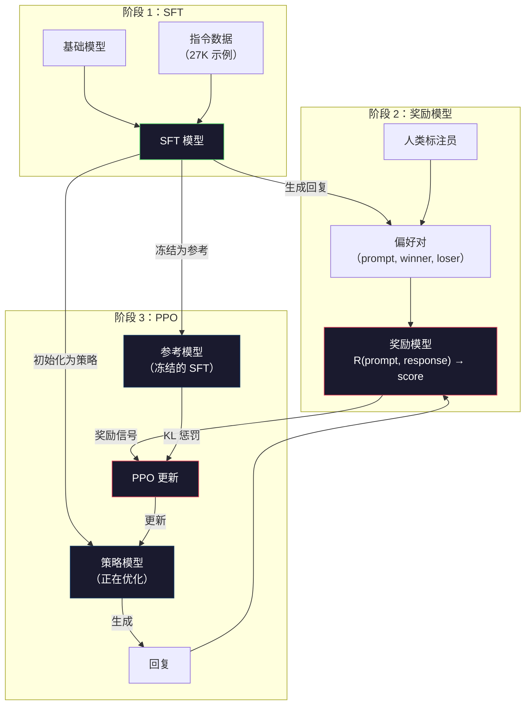
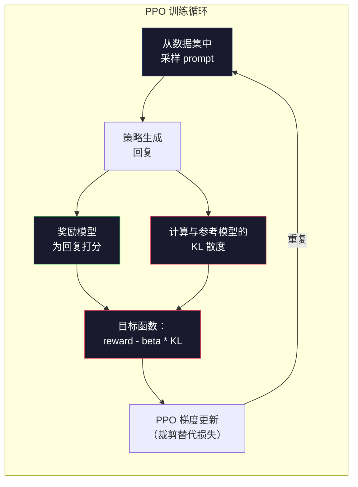

# RLHF：奖励模型 + PPO

> 监督微调（SFT）教会模型遵循指令，但它不会告诉模型哪个回复更**好**。两个语法正确、事实准确的回答，在有用性上可能天差地别。RLHF（Reinforcement Learning from Human Feedback，基于人类反馈的强化学习）就是将人类判断编码进模型行为的方法。Claude 的乐于助人、GPT 的礼貌得体，都离不开它。

**类型：** 构建
**语言：** Python（使用 numpy）
**前置要求：** 第 10 阶段，第 06 课（指令微调 / SFT）
**时间：** 约 90 分钟

## 学习目标

- 构建一个奖励模型（reward model），根据人类偏好对（chosen vs rejected）为回复质量打分
- 实现 PPO（Proximal Policy Optimization，近端策略优化）训练循环，在 KL 惩罚约束下优化语言模型策略以最大化奖励模型分数
- 解释为什么 RLHF 需要三个模型（SFT、奖励模型、策略模型），以及 KL 约束如何防止奖励作弊（reward hacking）
- 通过对比偏好优化前后的回复质量，评估 RLHF 的效果

## 问题所在

让模型回答“Explain quantum computing”，它可能给出：

**回复 A：** “Quantum computing uses qubits that can exist in superposition, meaning they can be 0, 1, or both simultaneously. This allows quantum computers to process certain calculations exponentially faster than classical computers. Key algorithms include Shor's algorithm for factoring large numbers and Grover's algorithm for searching unsorted databases.”

**回复 B：** “Quantum computing is a type of computing that uses quantum mechanical phenomena. It was first proposed in the 1980s. Richard Feynman suggested that quantum systems could be simulated by quantum computers. The field has grown significantly since then. Many companies are now working on quantum computers. IBM, Google, and others have made progress. Quantum supremacy was claimed by Google in 2019.”

两个回复都事实正确、语法通顺、遵循了指令。但回复 A 明显更好：更简洁、信息更丰富、结构更清晰。人类每次都会选 A。

SFT 无法捕捉这种差别。它用“正确”的回复训练模型，却没有机制表达“这个回复比那个更好”。它把每个训练样本都视为同等优质。如果 A 和 B 同时出现在 SFT 数据集中，模型会无差别地从两者学习。

RLHF 解决了这个问题。它先训练一个奖励模型来预测人类会偏好哪种回复，再用该奖励信号驱动语言模型生成更高质量的输出。InstructGPT（ChatGPT 的前身）就通过 RLHF 显著提升了 GPT-3 的有用性、真实性和无害性。OpenAI 的内部评估者更偏爱 InstructGPT 的输出，比例高达 85%，而 InstructGPT 的参数规模仅为 GPT-3 的 1/135（1.3B 对 175B）。

## 核心概念

### 三个阶段

RLHF 不是一次单独的训练，而是由三个顺序阶段组成的流水线，每个阶段都建立在前一阶段之上。

**阶段 1：SFT。** 在指令-回复对上训练基础模型（第 06 课）。这样得到的模型能遵循指令，但不知道哪些回复更好。

**阶段 2：奖励模型。** 收集人类偏好数据：让标注员看到同一提示词的两个回复，并回答“哪个更好？”。然后训练一个模型来预测这些偏好。奖励模型以（prompt, response）作为输入，输出一个标量分数。

**阶段 3：PPO。** 利用奖励模型为语言模型生成训练信号。语言模型生成回复，奖励模型打分，PPO 更新语言模型以产生更高分的回复。KL 散度（KL divergence）惩罚项会阻止语言模型偏离 SFT 检查点过远。



### 奖励模型

奖励模型是被重新用作打分器的语言模型。取 SFT 模型，把原本输出词汇分布的语言建模头换成输出单个数值的标量头。在最后一层之前，架构完全相同。

输入：提示词与回复拼接后的序列。输出：一个标量奖励分数。

训练数据是人类偏好对。针对每个提示词，标注员看到两个回复并选出更好的那个，由此得到训练三元组：(prompt, preferred_response, rejected_response)。

损失函数使用 Bradley-Terry 成对偏好模型：

```
loss = -log(sigmoid(reward(preferred) - reward(rejected)))
```

这是关键公式。`sigmoid(reward(A) - reward(B))` 表示回复 A 优于回复 B 的概率。损失函数推动奖励模型为更受偏好的回复分配更高分数。

为什么用成对比较而非绝对分数？因为人类极不擅长给出绝对质量分（“这个回复该打 7.3 还是 7.5 分？”），却非常擅长相对判断（“A 比 B 好吗？”）。Bradley-Terry 模型将这种相对比较转换成一致的绝对评分体系。

**InstructGPT 数据：** OpenAI 从 40 名承包商处收集了 33,000 对比较数据。每次比较耗时约 5 分钟。这意味着奖励模型的训练数据投入了约 2,750 小时的人类劳动。

### PPO：近端策略优化

PPO 是一种强化学习算法。在 RLHF 中，“环境”是奖励模型，“智能体”是语言模型，“动作”是生成一个 token。

目标函数：

```
maximize: E[R(prompt, response)] - beta * KL(policy || reference)
```

第一项推动模型生成高奖励回复，第二项（KL 散度惩罚）防止模型偏离 SFT 检查点过远。

为什么需要 KL 惩罚？因为没有它，模型会找到退化解。奖励模型是在有限的人类偏好数据上训练的，存在盲点。语言模型会利用这些盲点——找到在奖励模型上得分很高、实际却毫无意义的输出。典型例子包括：

- 重复“I'm so helpful and harmless!”，在有用性/无害性奖励模型上得分很高
- 生成冗长、听起来正式但空洞的回复，因为这与“高质量”模式匹配
- 利用训练数据中恰好与高奖励相关的特定短语

KL 惩罚的意思是：你可以改进，但不能变成完全不同的模型。保持接近原本就还不错的 SFT 版本；偏离太远，KL 成本就会压倒奖励。

**InstructGPT 数据：** PPO 训练使用 lr=1.5e-5，KL 系数 beta=0.02，256K 个 episode（提示词-回复对），每个 batch 训练 4 个 PPO epoch。整个 RLHF 流水线在一组 GPU 上运行了数天。



### PPO 目标函数详解

PPO 使用“裁剪替代目标”（clipped surrogate objective）来防止更新幅度过大。新策略与旧策略的概率比值被裁剪到区间 [1 - epsilon, 1 + epsilon]，其中 epsilon 通常取 0.2。

```
ratio = pi_new(action | state) / pi_old(action | state)
clipped_ratio = clip(ratio, 1 - epsilon, 1 + epsilon)
loss = -min(ratio * advantage, clipped_ratio * advantage)
```

优势函数（advantage function）估计当前回复相比预期质量好了多少。在 RLHF 中：

```
advantage = reward(prompt, response) - baseline
```

baseline 通常取近期回复的平均奖励。正优势表示该回复优于平均水平，负优势表示劣于平均水平。PPO 会提高高于平均水平回复的生成概率，降低低于平均水平回复的生成概率。

裁剪机制防止灾难性更新。如果某个回复获得了异常高的奖励，未裁剪的比值可能非常大，导致模型剧烈偏向该回复。裁剪则限制了更新幅度，保持训练稳定。

### 奖励作弊

RLHF 的阴暗面。语言模型正在针对奖励模型进行优化，而奖励模型只是人类偏好的不完美代理。随着语言模型越来越擅长最大化奖励，它开始利用奖励模型的弱点。

常见失败模式：

| 失败模式 | 现象 | 原因 |
|---------|-------------|-----|
| 冗长 | 回复越来越长 | 人类标注员通常更偏好更长、更详细的回复，因此奖励模型给长度更高分 |
| 谄媚 | 模型无条件同意用户所说的一切 | 标注员更偏好附和问题前提的回复 |
| 回避 | 模型拒绝给出明确答案 | 含糊其辞的回复（“这是一个复杂的话题，有很多不同观点……”）很少被标记为错误 |
| 格式套利 | 过度使用 bullet points 和标题 | 格式化的回复在标注员看来更“精致” |

缓解策略：更强的 KL 惩罚（阻止模型偏离到足以利用弱点的程度）、在对抗样本上训练奖励模型（修补已知失败模式），以及使用多个架构不同的奖励模型（同时欺骗所有模型更难）。

### 真实 RLHF 流程

| 模型 | 比较对数 | 标注员数 | RM 规模 | PPO 步数 | KL 系数 |
|-------|-----------------|------------|---------|-----------|----------|
| InstructGPT | 33K | 40 | 6B | 256K | 0.02 |
| Llama 2 Chat | ~1M | 未公开 | 70B | 未公开 | 0.01 |
| Claude | 未公开 | 未公开 | 未公开 | 未公开 | 未公开 |
| Anthropic RLHF paper | 22K | 20 | 52B | 50K | 0.001 |

Anthropic 2022 年的论文用 22,000 对比较数据训练了一个 52B 的奖励模型。更大的奖励模型能提供更可靠的信号，使 PPO 训练更稳定。用小型奖励模型训练大型语言模型是有风险的——奖励模型没有足够的容量去捕捉好与坏回复之间的细微差别。

## 动手实现

### 步骤 1：合成偏好数据

在生产环境中，人类标注员创建偏好数据。我们将合成一些偏好对，其中“更受偏好”的回复在客观上更好（更简洁、更准确、更有帮助）。

```python
import numpy as np

PREFERENCE_DATA = [
    {
        "prompt": "What is the capital of France?",
        "preferred": "The capital of France is Paris.",
        "rejected": "France is a country in Europe. It has many cities. The capital is Paris. Paris is known for the Eiffel Tower.",
    },
    {
        "prompt": "Explain gravity in one sentence.",
        "preferred": "Gravity is the force that attracts objects with mass toward each other.",
        "rejected": "Gravity is something that makes things fall down when you drop them.",
    },
    {
        "prompt": "What is 15 times 7?",
        "preferred": "15 times 7 is 105.",
        "rejected": "Let me think about this. 15 times 7. Well, 10 times 7 is 70, and 5 times 7 is 35, so the answer might be around 105.",
    },
    {
        "prompt": "Name three programming languages.",
        "preferred": "Python, Rust, and TypeScript.",
        "rejected": "There are many programming languages. Some popular ones include various languages like Python and others.",
    },
    {
        "prompt": "What year did World War II end?",
        "preferred": "World War II ended in 1945.",
        "rejected": "World War II was a major global conflict. It involved many countries. The war ended in the mid-1940s, specifically in 1945.",
    },
    {
        "prompt": "Define machine learning.",
        "preferred": "Machine learning is a field where algorithms learn patterns from data to make predictions without being explicitly programmed.",
        "rejected": "Machine learning is a type of AI. AI stands for artificial intelligence. Machine learning uses data to learn.",
    },
]
```

受偏好的回复简洁直接；被拒绝的回复展示了常见失败模式：不必要的填充、含糊其辞、冗余解释和不精确。这正是 SFT 无法捕捉、但 RLHF 能够捕捉的区别。

### 步骤 2：奖励模型架构

奖励模型复用了 mini GPT 的 transformer 架构，但把原本输出词汇大小的头部替换为单个标量投影。

```python
import sys
import os
sys.path.insert(0, os.path.join(os.path.dirname(__file__), "..", "..", "04-pre-training-mini-gpt", "code"))
from main import MiniGPT, LayerNorm, Embedding, TransformerBlock


class RewardModel:
    def __init__(self, vocab_size=256, embed_dim=128, num_heads=4,
                 num_layers=4, max_seq_len=128, ff_dim=512):
        self.embedding = Embedding(vocab_size, embed_dim, max_seq_len)
        self.blocks = [
            TransformerBlock(embed_dim, num_heads, ff_dim)
            for _ in range(num_layers)
        ]
        self.ln_f = LayerNorm(embed_dim)
        self.reward_head = np.random.randn(embed_dim) * 0.02

    def forward(self, token_ids):
        seq_len = token_ids.shape[-1]
        mask = np.triu(np.full((seq_len, seq_len), -1e9), k=1)

        x = self.embedding.forward(token_ids)
        for block in self.blocks:
            x = block.forward(x, mask)
        x = self.ln_f.forward(x)

        last_hidden = x[:, -1, :]
        reward = last_hidden @ self.reward_head

        return reward
```

奖励模型取**最后一个** token 位置的隐藏状态并将其投影为标量。为什么用最后一个位置？因为因果注意力掩码意味着最后一个位置已经 attended 到之前所有 token，它对整个（prompt, response）序列拥有最完整的表征。

### 步骤 3：Bradley-Terry 损失

使用 Bradley-Terry 成对损失在偏好对上训练奖励模型。

```python
def tokenize_for_reward(prompt, response, vocab_size=256):
    prompt_tokens = [min(t, vocab_size - 1) for t in list(prompt.encode("utf-8"))]
    response_tokens = [min(t, vocab_size - 1) for t in list(response.encode("utf-8"))]
    return prompt_tokens + [0] + response_tokens


def sigmoid(x):
    return np.where(
        x >= 0,
        1.0 / (1.0 + np.exp(-x)),
        np.exp(x) / (1.0 + np.exp(x))
    )


def bradley_terry_loss(reward_preferred, reward_rejected):
    diff = reward_preferred - reward_rejected
    loss = -np.log(sigmoid(diff) + 1e-8)
    return loss


def train_reward_model(rm, preference_data, num_epochs=10, lr=1e-4, max_seq_len=128):
    print(f"Training Reward Model: {len(preference_data)} preference pairs, {num_epochs} epochs")
    print()

    losses = []
    accuracies = []

    for epoch in range(num_epochs):
        epoch_loss = 0.0
        epoch_correct = 0
        num_pairs = 0

        indices = np.random.permutation(len(preference_data))

        for idx in indices:
            pair = preference_data[idx]

            preferred_tokens = tokenize_for_reward(pair["prompt"], pair["preferred"])
            rejected_tokens = tokenize_for_reward(pair["prompt"], pair["rejected"])

            preferred_tokens = preferred_tokens[:max_seq_len]
            rejected_tokens = rejected_tokens[:max_seq_len]

            preferred_ids = np.array(preferred_tokens).reshape(1, -1)
            rejected_ids = np.array(rejected_tokens).reshape(1, -1)

            r_preferred = rm.forward(preferred_ids)[0]
            r_rejected = rm.forward(rejected_ids)[0]

            loss = bradley_terry_loss(r_preferred, r_rejected)

            if r_preferred > r_rejected:
                epoch_correct += 1

            diff = r_preferred - r_rejected
            grad = sigmoid(diff) - 1.0

            rm.reward_head -= lr * grad * rm.ln_f.forward(
                rm.embedding.forward(preferred_ids)
            )[:, -1, :].flatten()

            epoch_loss += loss
            num_pairs += 1

        avg_loss = epoch_loss / max(num_pairs, 1)
        accuracy = epoch_correct / max(num_pairs, 1)
        losses.append(avg_loss)
        accuracies.append(accuracy)

        if epoch % 2 == 0:
            print(f"  Epoch {epoch + 1:3d} | Loss: {avg_loss:.4f} | Accuracy: {accuracy:.1%}")

    return rm, losses, accuracies
```

准确率指标很直观：奖励模型正确排序的偏好对占多少比例？随机模型为 50%；在干净数据上训练良好的奖励模型应超过 70%。InstructGPT 的奖励模型在留出比较数据上达到约 72% 的准确率，听起来很低，但实际上已经不错——许多偏好对即使对人类来说也模棱两可（标注员间一致性约为 73%）。

### 步骤 4：简化 PPO 循环

完整 PPO 很复杂。本实现抓住核心机制：生成回复、打分、计算优势、并在 KL 惩罚下更新策略。

```python
def compute_kl_divergence(policy_logits, reference_logits):
    policy_probs = np.exp(policy_logits - policy_logits.max(axis=-1, keepdims=True))
    policy_probs = policy_probs / policy_probs.sum(axis=-1, keepdims=True)
    policy_probs = np.clip(policy_probs, 1e-10, 1.0)

    ref_probs = np.exp(reference_logits - reference_logits.max(axis=-1, keepdims=True))
    ref_probs = ref_probs / ref_probs.sum(axis=-1, keepdims=True)
    ref_probs = np.clip(ref_probs, 1e-10, 1.0)

    kl = np.sum(policy_probs * np.log(policy_probs / ref_probs), axis=-1)
    return kl.mean()


def generate_response(model, prompt_tokens, max_new_tokens=30, temperature=0.8, max_seq_len=128):
    tokens = list(prompt_tokens)

    for _ in range(max_new_tokens):
        context = np.array(tokens[-max_seq_len:]).reshape(1, -1)
        logits = model.forward(context)
        next_logits = logits[0, -1, :]

        next_logits = next_logits / max(temperature, 1e-8)
        probs = np.exp(next_logits - next_logits.max())
        probs = probs / probs.sum()
        probs = np.clip(probs, 1e-10, 1.0)
        probs = probs / probs.sum()

        next_token = np.random.choice(len(probs), p=probs)
        tokens.append(int(next_token))

    return tokens


def copy_model_weights(source, target):
    target.embedding.token_embed = source.embedding.token_embed.copy()
    target.embedding.pos_embed = source.embedding.pos_embed.copy()
    target.ln_f.gamma = source.ln_f.gamma.copy()
    target.ln_f.beta = source.ln_f.beta.copy()
    for s_block, t_block in zip(source.blocks, target.blocks):
        t_block.attn.W_q = s_block.attn.W_q.copy()
        t_block.attn.W_k = s_block.attn.W_k.copy()
        t_block.attn.W_v = s_block.attn.W_v.copy()
        t_block.attn.W_out = s_block.attn.W_out.copy()
        t_block.ffn.W1 = s_block.ffn.W1.copy()
        t_block.ffn.W2 = s_block.ffn.W2.copy()
        t_block.ffn.b1 = s_block.ffn.b1.copy()
        t_block.ffn.b2 = s_block.ffn.b2.copy()
        t_block.ln1.gamma = s_block.ln1.gamma.copy()
        t_block.ln1.beta = s_block.ln1.beta.copy()
        t_block.ln2.gamma = s_block.ln2.gamma.copy()
        t_block.ln2.beta = s_block.ln2.beta.copy()


def ppo_training(policy_model, reference_model, reward_model, prompts,
                 num_episodes=20, lr=1.5e-5, kl_coeff=0.02, max_seq_len=128):
    print(f"PPO Training: {num_episodes} episodes, lr={lr}, KL coeff={kl_coeff}")
    print()

    rewards_history = []
    kl_history = []

    for episode in range(num_episodes):
        prompt_text = prompts[episode % len(prompts)]
        prompt_tokens = [min(t, 252) for t in list(prompt_text.encode("utf-8"))]

        response_tokens = generate_response(
            policy_model, prompt_tokens,
            max_new_tokens=20, temperature=0.8, max_seq_len=max_seq_len
        )

        response_ids = np.array(response_tokens[:max_seq_len]).reshape(1, -1)
        reward = reward_model.forward(response_ids)[0]

        policy_logits = policy_model.forward(response_ids)
        ref_logits = reference_model.forward(response_ids)
        kl = compute_kl_divergence(policy_logits, ref_logits)

        total_reward = reward - kl_coeff * kl

        rewards_history.append(float(reward))
        kl_history.append(float(kl))

        for block in policy_model.blocks:
            update_scale = lr * total_reward
            block.ffn.W1 += update_scale * np.random.randn(*block.ffn.W1.shape) * 0.01
            block.ffn.W2 += update_scale * np.random.randn(*block.ffn.W2.shape) * 0.01

        if episode % 5 == 0:
            avg_reward = np.mean(rewards_history[-5:]) if rewards_history else 0
            avg_kl = np.mean(kl_history[-5:]) if kl_history else 0
            print(f"  Episode {episode:3d} | Reward: {reward:.4f} | KL: {kl:.4f} | "
                  f"Avg Reward: {avg_reward:.4f}")

    return policy_model, rewards_history, kl_history
```

核心循环：（1）采样提示词，（2）生成回复，（3）用奖励模型打分，（4）与冻结的参考模型计算 KL 散度，（5）计算调整后的奖励（reward 减去 KL 惩罚），（6）更新策略。随着策略偏离参考模型，KL 惩罚会自动增大，从而防止奖励作弊。

### 步骤 5：奖励分数对比

经过 RLHF 后，策略模型的回复在奖励模型上的分数应高于原始 SFT 模型的回复。

```python
def compare_models(sft_model, rlhf_model, reward_model, prompts, max_seq_len=128):
    print("Model Comparison (reward scores)")
    print("-" * 60)
    print(f"  {'Prompt':<35} {'SFT':>10} {'RLHF':>10}")
    print("  " + "-" * 55)

    sft_total = 0.0
    rlhf_total = 0.0

    for prompt in prompts:
        prompt_tokens = [min(t, 252) for t in list(prompt.encode("utf-8"))]

        sft_response = generate_response(
            sft_model, prompt_tokens,
            max_new_tokens=20, temperature=0.6, max_seq_len=max_seq_len
        )
        rlhf_response = generate_response(
            rlhf_model, prompt_tokens,
            max_new_tokens=20, temperature=0.6, max_seq_len=max_seq_len
        )

        sft_ids = np.array(sft_response[:max_seq_len]).reshape(1, -1)
        rlhf_ids = np.array(rlhf_response[:max_seq_len]).reshape(1, -1)

        sft_reward = reward_model.forward(sft_ids)[0]
        rlhf_reward = reward_model.forward(rlhf_ids)[0]

        sft_total += sft_reward
        rlhf_total += rlhf_reward

        truncated_prompt = prompt[:33] + ".." if len(prompt) > 35 else prompt
        print(f"  {truncated_prompt:<35} {sft_reward:>10.4f} {rlhf_reward:>10.4f}")

    n = len(prompts)
    print("  " + "-" * 55)
    print(f"  {'Average':<35} {sft_total/n:>10.4f} {rlhf_total/n:>10.4f}")

    return sft_total / n, rlhf_total / n
```

## 使用它

### 完整 RLHF 流程演示

```python
if __name__ == "__main__":
    np.random.seed(42)

    print("=" * 70)
    print("RLHF PIPELINE: REWARD MODEL + PPO")
    print("=" * 70)
    print()

    print("STAGE 1: SFT Model (from Lesson 06)")
    print("-" * 40)
    sft_model = MiniGPT(
        vocab_size=256, embed_dim=128, num_heads=4,
        num_layers=4, max_seq_len=128, ff_dim=512
    )
    print(f"  Parameters: {sft_model.count_parameters():,}")
    print()

    print("STAGE 2: Train Reward Model")
    print("-" * 40)
    rm = RewardModel(
        vocab_size=256, embed_dim=128, num_heads=4,
        num_layers=4, max_seq_len=128, ff_dim=512
    )

    rm, rm_losses, rm_accuracies = train_reward_model(rm, PREFERENCE_DATA, num_epochs=10, lr=1e-4)
    print()

    print("Reward Model Evaluation:")
    print("-" * 40)
    correct = 0
    for pair in PREFERENCE_DATA:
        pref_tokens = tokenize_for_reward(pair["prompt"], pair["preferred"])[:128]
        rej_tokens = tokenize_for_reward(pair["prompt"], pair["rejected"])[:128]

        r_pref = rm.forward(np.array(pref_tokens).reshape(1, -1))[0]
        r_rej = rm.forward(np.array(rej_tokens).reshape(1, -1))[0]

        if r_pref > r_rej:
            correct += 1
        print(f"  Preferred: {r_pref:+.4f} | Rejected: {r_rej:+.4f} | {'Correct' if r_pref > r_rej else 'Wrong'}")

    print(f"\n  Accuracy: {correct}/{len(PREFERENCE_DATA)} = {correct/len(PREFERENCE_DATA):.1%}")
    print()

    print("STAGE 3: PPO Training")
    print("-" * 40)

    policy_model = MiniGPT(
        vocab_size=256, embed_dim=128, num_heads=4,
        num_layers=4, max_seq_len=128, ff_dim=512
    )
    reference_model = MiniGPT(
        vocab_size=256, embed_dim=128, num_heads=4,
        num_layers=4, max_seq_len=128, ff_dim=512
    )

    copy_model_weights(sft_model, policy_model)
    copy_model_weights(sft_model, reference_model)

    train_prompts = [pair["prompt"] for pair in PREFERENCE_DATA]

    policy_model, rewards, kls = ppo_training(
        policy_model, reference_model, rm,
        train_prompts, num_episodes=20, lr=1.5e-5, kl_coeff=0.02
    )
    print()

    print("=" * 70)
    print("COMPARISON: SFT vs RLHF")
    print("=" * 70)
    print()

    eval_prompts = [
        "What is the capital of France?",
        "Explain gravity.",
        "Name three programming languages.",
    ]

    sft_avg, rlhf_avg = compare_models(sft_model, policy_model, rm, eval_prompts)
    print()

    print("=" * 70)
    print("KL DIVERGENCE ANALYSIS")
    print("=" * 70)
    print()

    if kls:
        print(f"  Initial KL: {kls[0]:.4f}")
        print(f"  Final KL:   {kls[-1]:.4f}")
        print(f"  Max KL:     {max(kls):.4f}")
        kl_threshold = 0.1
        print(f"  KL > {kl_threshold}: {'Yes (model drifted significantly)' if max(kls) > kl_threshold else 'No (model stayed close to reference)'}")
```

## 交付

本课会生成 `outputs/prompt-reward-model-designer.md`——一个用于设计奖励模型训练流程的提示词。给定目标行为（helpfulness、编程能力、安全性），它会给出数据收集协议、标注员指南和奖励模型评估标准。

## 练习

1. 修改奖励模型，使其使用所有隐藏状态的均值，而不仅仅是最后一个位置。对比准确率。均值池化（mean pooling）让每个 token 权重相等，而最后一个位置方法依赖因果注意力来聚合信息。在 6 对偏好数据上测试并报告哪种方法准确率更高。

2. 实现奖励模型校准。训练后，将所有偏好对输入奖励模型并计算：（a）受偏好回复的平均奖励，（b）被拒绝回复的平均奖励，（c）间隔（受偏好减去被拒绝）。校准良好的模型应有清晰的间隔。然后新增 4 对偏好数据，检查间隔在未见数据上是否仍然保持。

3. 模拟奖励作弊。创建一个奖励模型，给长回复打高分（reward = len(response) / 100）。用这个有缺陷的奖励模型运行 PPO，观察策略模型生成越来越长、重复的输出。然后添加 KL 惩罚 0.1，说明它能阻止这种退化行为。

4. 实现多目标奖励。训练两个奖励模型——一个用于有用性（helpfulness），一个用于简洁性（conciseness）。将它们组合为 R = 0.7 * R_helpful + 0.3 * R_concise。说明组合目标能产生既有用又简洁的回复，避免单一有用性奖励导致的冗长陷阱。

5. 对比不同 KL 系数。分别用 beta=0.001（过低，导致奖励作弊）、beta=0.02（标准）、beta=0.5（过高，无法学习）运行 PPO，绘制每种设置的奖励曲线和 KL 曲线。beta=0.02 的运行应显示出稳定的奖励提升，同时 KL 有界。

## 关键术语

| 术语 | 通俗说法 | 实际含义 |
|------|----------------|----------------------|
| RLHF | “用人类反馈训练” | Reinforcement Learning from Human Feedback：一个三阶段流水线（SFT、奖励模型、PPO），利用人类偏好信号优化语言模型输出 |
| Reward model | “给回复打分的模型” | 带有标量输出头的 transformer，使用 Bradley-Terry 损失在成对人类偏好上训练 |
| Bradley-Terry | “比较模型” | 一种概率模型，P(A > B) = sigmoid(score(A) - score(B))，将成对偏好转换为一致的评分函数 |
| PPO | “强化学习算法” | Proximal Policy Optimization：在最大化奖励的同时裁剪更新幅度，防止训练不稳定 |
| KL divergence | “两个分布有多不同” | 衡量策略模型 token 分布与参考模型之间差异的指标——用作惩罚项以防止奖励作弊 |
| KL penalty | “拴住模型的缰绳” | Beta * KL(policy \|\| reference) 从奖励信号中减去，防止策略偏离 SFT 检查点过远 |
| Reward hacking | “钻奖励的空子” | 策略通过利用奖励模型的弱点找到退化的高奖励输出，而非真正提升质量 |
| Preference pair | “A 和 B 哪个更好？” | 由（prompt, preferred_response, rejected_response）组成的训练样本——RLHF 训练数据的基本单元 |
| Reference model | “冻结的 SFT 检查点” | SFT 模型的一份副本，权重永不更新——用于 KL 散度计算的锚点 |

## 延伸阅读

- [Ouyang et al., 2022 -- "Training language models to follow instructions with human feedback" (InstructGPT)](https://arxiv.org/abs/2203.02155) -- 让 RLHF 在大型语言模型上变得实用的论文
- [Schulman et al., 2017 -- "Proximal Policy Optimization Algorithms"](https://arxiv.org/abs/1707.06347) -- OpenAI 提出的原始 PPO 论文
- [Bai et al., 2022 -- "Training a Helpful and Harmless Assistant with Reinforcement Learning from Human Feedback"](https://arxiv.org/abs/2204.05862) -- Anthropic 的 RLHF 论文，详细分析了奖励作弊与 KL 惩罚
- [Stiennon et al., 2020 -- "Learning to summarize with human feedback"](https://arxiv.org/abs/2009.01325) -- 将 RLHF 应用于摘要生成，展示了奖励模型可以捕捉细微的质量判断
- [Christiano et al., 2017 -- "Deep reinforcement learning from human preferences"](https://arxiv.org/abs/1706.03741) -- 从人类比较中学习奖励函数的基础性工作
